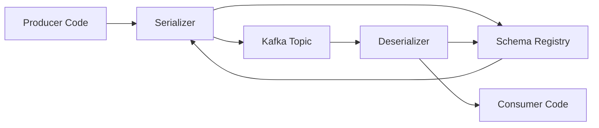

# Part 012 — Event Schema and Serialization

## 1. Tujuan Part Ini

Part ini membahas schema dan serialization event Kafka dari sudut pandang production engineering.

Fokusnya bukan hanya:

```text
pakai JSON atau Avro?
```

Fokus yang benar adalah:

```text
bagaimana producer dan consumer yang berbeda versi tetap bisa berkomunikasi tanpa merusak production, tanpa silent data loss, tanpa deserialization storm, dan tanpa breaking event contract?
```

Dalam enterprise Java/JAX-RS system, schema event adalah contract antar service.

Ketika schema buruk, dampaknya bisa berupa:

- consumer gagal deserialize
- event masuk DLQ massal
- consumer silently ignore field penting
- replay lama gagal karena schema sudah berubah
- backward compatibility rusak
- downstream service membaca arti field secara berbeda
- audit tidak bisa dipercaya
- CDC pipeline menghasilkan event tidak sesuai ekspektasi
- event contract menjadi hidden coupling antar tim

Schema bukan urusan serializer saja.

Schema adalah bagian dari architecture governance.

## 2. Serialization vs Schema

Serialization adalah proses mengubah object menjadi bytes.

Deserialization adalah proses mengubah bytes menjadi object.

Schema adalah definisi struktur dan tipe data dari payload tersebut.

Perbedaannya:

| Konsep | Pertanyaan utama |
|---|---|
| Serialization | Bagaimana object menjadi bytes? |
| Deserialization | Bagaimana bytes menjadi object? |
| Schema | Bentuk data apa yang valid? |
| Compatibility | Apakah versi lama dan baru bisa coexist? |
| Governance | Siapa boleh mengubah contract? |

Kafka sendiri menyimpan bytes.

Kafka tidak memahami apakah payload itu JSON, Avro, Protobuf, atau format lain.

Client dan platform di sekitar Kafka yang memberi makna pada bytes tersebut.

## 3. Event sebagai Contract

Event bukan sekadar object internal yang dikirim keluar.

Event adalah public contract untuk consumer.

Jika producer mengubah event tanpa governance, consumer bisa rusak.

Contoh perubahan berbahaya:

```diff
{
-  "orderId": "ORD-123",
+  "id": "ORD-123",
   "status": "SUBMITTED"
}
```

Bagi producer, ini mungkin hanya rename field.

Bagi consumer, ini breaking change.

## 4. Payload, Header, dan Metadata

Kafka record memiliki:

- key
- value
- headers
- timestamp
- topic
- partition
- offset

Schema biasanya fokus pada value/payload.

Namun event contract juga harus mengatur metadata.

Contoh metadata penting:

- event ID
- event type
- event version
- schema version atau schema ID
- correlation ID
- causation ID
- trace context
- tenant ID
- source service
- event time
- idempotency key

Pertanyaan penting:

```text
metadata ini berada di header, payload envelope, atau keduanya?
```

Tidak ada jawaban universal.

Yang penting adalah standardisasi.

## 5. Common Serialization Formats

Format umum di Kafka:

| Format | Kekuatan | Risiko |
|---|---|---|
| JSON | mudah dibaca, sederhana | schema lemah jika tanpa registry/validation |
| Avro | compact, schema evolution kuat | butuh Schema Registry/discipline |
| Protobuf | compact, typed, cocok multi-language | evolution rule harus dipahami |
| JSON Schema | JSON dengan schema validation | compatibility masih perlu governance |
| String | simpel | rawan contract ambiguity |
| Byte array custom | fleksibel | sulit governance/debugging |

Pilihan format harus mempertimbangkan:

- jumlah consumer
- multi-language ecosystem
- kebutuhan compatibility
- debugging operasional
- ukuran payload
- throughput
- schema governance maturity
- tooling internal

## 6. JSON Event

JSON sering dipakai karena mudah.

Contoh:

```json
{
  "eventId": "evt-123",
  "eventType": "OrderSubmitted",
  "eventVersion": 1,
  "eventTime": "2026-07-11T10:00:00Z",
  "payload": {
    "orderId": "ORD-123",
    "quoteId": "Q-456",
    "status": "SUBMITTED"
  }
}
```

Kelebihan:

- mudah dibaca manusia
- mudah di-log secara terbatas
- mudah dipakai lintas bahasa
- cocok untuk fase awal
- cocok untuk DLQ/debugging

Kelemahan:

- tipe data bisa ambigu
- field rename mudah tidak terdeteksi
- optional/required sering tidak jelas
- enum value bisa liar
- compatibility sulit dijamin tanpa schema validation
- payload besar dibanding binary format

JSON tanpa schema governance cenderung menjadi contract informal.

Contract informal biasanya rusak di production.

## 7. JSON dengan JSON Schema

JSON Schema memberi struktur pada JSON.

Contoh konseptual:

```json
{
  "type": "object",
  "required": ["eventId", "eventType", "payload"],
  "properties": {
    "eventId": { "type": "string" },
    "eventType": { "const": "OrderSubmitted" },
    "payload": {
      "type": "object",
      "required": ["orderId", "status"],
      "properties": {
        "orderId": { "type": "string" },
        "status": { "type": "string" }
      }
    }
  }
}
```

Manfaat:

- validasi lebih eksplisit
- required field jelas
- tipe data jelas
- CI compatibility check mungkin dilakukan
- dokumentasi event lebih kuat

Namun JSON Schema tetap membutuhkan governance.

Schema ada bukan berarti schema dipakai dengan benar.

## 8. Avro

Avro populer di Kafka ecosystem karena mendukung schema evolution dengan baik.

Karakteristik:

- schema eksplisit
- compact binary encoding
- schema ID sering disimpan di payload wire format melalui serializer tertentu
- cocok dengan Schema Registry
- mendukung default value
- reader schema dan writer schema bisa berbeda dalam batas kompatibilitas

Contoh schema Avro konseptual:

```json
{
  "type": "record",
  "name": "OrderSubmitted",
  "namespace": "com.company.order.events",
  "fields": [
    { "name": "eventId", "type": "string" },
    { "name": "orderId", "type": "string" },
    { "name": "status", "type": "string" },
    { "name": "submittedAt", "type": "string" }
  ]
}
```

Kelebihan:

- compatibility model kuat
- compact
- mature di Kafka ecosystem
- cocok untuk banyak topic dan consumer

Kelemahan:

- kurang human-readable di raw topic
- butuh tooling
- developer harus paham evolution rule
- default value sering disalahgunakan

## 9. Protobuf

Protobuf cocok untuk typed contract lintas service.

Contoh konseptual:

```proto
syntax = "proto3";

message OrderSubmitted {
  string event_id = 1;
  string order_id = 2;
  string status = 3;
  string submitted_at = 4;
}
```

Kelebihan:

- compact
- strongly typed
- multi-language support baik
- field number membantu evolution
- cocok jika organisasi sudah memakai gRPC/Protobuf

Kelemahan:

- field number tidak boleh sembarangan diubah
- reserved field harus disiplin
- default value di proto3 bisa membingungkan
- JSON mapping bisa menambah kompleksitas
- compatibility dengan consumer lama tetap perlu diuji

Protobuf bukan otomatis aman.

Ia aman jika aturan evolution dipatuhi.

## 10. Schema Registry Mental Model

Schema Registry menyimpan schema dan membantu client memvalidasi compatibility.

Mental model:



Pada publish:

- serializer mengecek/register schema
- payload dikirim dengan referensi schema ID atau mekanisme setara
- record masuk Kafka

Pada consume:

- deserializer membaca schema ID
- mengambil schema dari registry/cache
- decode bytes menjadi object

Registry bukan hanya storage.

Registry adalah enforcement point untuk compatibility.

## 11. Subject Naming Strategy

Subject adalah nama logical schema di registry.

Strategi umum:

| Strategy | Contoh | Dampak |
|---|---|---|
| TopicNameStrategy | `orders-value` | schema per topic |
| RecordNameStrategy | `com.company.OrderSubmitted` | schema per record type |
| TopicRecordNameStrategy | `orders-com.company.OrderSubmitted` | kombinasi topic + record |

Risiko salah pilih:

- banyak event type dalam satu topic sulit dikelola
- event type sama di beberapa topic berbagi compatibility tanpa sengaja
- schema evolution terlalu ketat atau terlalu longgar
- consumer tidak jelas schema apa yang valid di topic

Subject naming harus konsisten dengan topic design.

## 12. Schema ID

Dalam banyak setup, payload membawa schema ID.

Consumer menggunakan schema ID untuk tahu writer schema.

Manfaat:

- consumer tidak menebak versi schema
- replay event lama masih bisa dibaca jika schema lama tersimpan
- registry bisa memetakan writer/reader schema

Risiko:

- registry unavailable saat schema tidak ada di cache
- schema ID tidak tersedia untuk custom serializer
- schema lama dihapus atau registry corrupt
- environment mismatch antara schema ID dan registry

Schema ID adalah bagian dari runtime contract.

## 13. Compatibility Mode

Compatibility mode menentukan perubahan schema apa yang boleh.

Mode umum:

| Mode | Makna praktis |
|---|---|
| Backward | consumer baru bisa membaca data lama |
| Forward | consumer lama bisa membaca data baru |
| Full | backward + forward |
| None | tidak ada enforcement |

Ada juga variasi transitive.

Transitive berarti compatibility dicek terhadap semua versi sebelumnya, bukan hanya versi terakhir.

Untuk event yang long-lived dan butuh replay, transitive compatibility sering lebih aman.

Namun lebih ketat.

## 14. Backward Compatibility

Backward compatibility berarti reader baru bisa membaca data yang ditulis dengan schema lama.

Contoh perubahan yang biasanya aman di Avro:

```diff
fields:
  - orderId: string
  - status: string
+ - salesChannel: string = "UNKNOWN"
```

Field baru punya default.

Consumer baru bisa membaca event lama karena jika field tidak ada, default dipakai.

Risiko:

- default value bisa menyembunyikan data penting
- default `UNKNOWN` bisa merusak business logic
- consumer menganggap field baru selalu valid

Backward compatible secara teknis belum tentu benar secara bisnis.

## 15. Forward Compatibility

Forward compatibility berarti reader lama bisa membaca data yang ditulis dengan schema baru.

Contoh:

Producer baru menambahkan optional field.

Consumer lama mengabaikan field tersebut.

Risiko:

- field baru mungkin penting untuk business invariant
- consumer lama tetap berjalan tetapi salah secara bisnis
- silent degradation

Compatibility teknis harus dilengkapi contract review.

## 16. Full Compatibility

Full compatibility berarti perubahan aman dua arah.

Ini lebih cocok jika:

- deployment producer/consumer tidak sinkron
- banyak consumer tidak diketahui
- replay event lama sering dilakukan
- topic dianggap public contract
- rollback perlu aman

Kelemahannya:

- schema evolution lebih terbatas
- butuh disiplin tinggi
- kadang perlu event version baru daripada mengubah schema lama

## 17. Optional Field

Optional field sering dianggap aman.

Namun optional field bisa menciptakan ambiguity.

Contoh:

```json
{
  "orderId": "ORD-1",
  "discountCode": null
}
```

Apakah `discountCode = null` berarti:

- tidak ada discount?
- discount tidak diketahui?
- field belum diisi?
- producer lama?
- data corrupt?

Untuk field bisnis penting, definisikan semantics null.

Jangan hanya menjadikannya optional demi compatibility.

## 18. Required Field

Required field kuat untuk correctness, tetapi sulit dievolusi.

Menambahkan required field ke event yang sudah punya consumer lama biasanya breaking.

Jika butuh field baru:

- tambahkan optional/default dulu
- deploy consumer yang memahami field baru
- pastikan producer mengisi field
- setelah migration, pertimbangkan versi event baru

Jangan menambahkan required field tanpa compatibility plan.

## 19. Default Value

Default value membantu compatibility.

Namun default bisa berbahaya.

Contoh:

```json
{ "name": "currency", "type": "string", "default": "USD" }
```

Jika event lama sebenarnya tidak selalu USD, default ini menciptakan data palsu.

Default value harus benar secara domain.

Jika tidak tahu, gunakan explicit unknown state dan consumer wajib menanganinya.

## 20. Enum Evolution

Enum sering breaking.

Contoh:

```text
SUBMITTED
APPROVED
CANCELLED
```

Producer menambah:

```text
PENDING_MANUAL_REVIEW
```

Consumer lama mungkin:

- crash
- masuk default branch yang salah
- ignore event
- map ke UNKNOWN

Rule:

- consumer harus punya unknown enum handling
- producer harus mengumumkan enum baru
- contract test harus mencakup enum unknown
- event schema harus mendokumentasikan lifecycle enum

## 21. Field Rename

Field rename adalah breaking change.

Contoh:

```diff
- quoteId
+ sourceQuoteId
```

Cara aman:

1. Tambahkan field baru tanpa menghapus field lama.
2. Producer mengisi keduanya sementara.
3. Consumer migrate ke field baru.
4. Setelah semua consumer aman, deprecate field lama.
5. Hapus hanya jika compatibility policy mengizinkan dan consumer sudah tidak ada.

Rename langsung hampir selalu buruk.

## 22. Field Removal

Menghapus field bisa breaking bagi consumer yang masih membacanya.

Field removal harus melalui deprecation lifecycle.

Checklist:

- siapa consumer field ini?
- apakah field masih dipakai dashboard/projection/audit?
- apakah replay lama membutuhkan field ini?
- apakah downstream schema masih mengharapkan field ini?
- apakah contract test menangkap removal?
- apakah ada migration window?

## 23. Nested Schema

Nested schema terlihat rapi tetapi bisa menyulitkan evolution.

Contoh:

```json
{
  "order": {
    "id": "ORD-1",
    "customer": {
      "id": "C-1",
      "segment": "ENTERPRISE"
    }
  }
}
```

Risiko:

- nested object berubah tanpa consumer sadar
- field reuse antar event tidak konsisten
- compatibility sulit dipahami
- payload membengkak
- consumer mengambil dependency terlalu dalam

Gunakan nested schema untuk konsep yang stabil, bukan object internal DB yang sering berubah.

## 24. Schema Envelope vs Payload Schema

Ada dua pendekatan:

### Envelope + payload

```json
{
  "eventId": "evt-1",
  "eventType": "OrderSubmitted",
  "eventVersion": 1,
  "metadata": {},
  "payload": {}
}
```

### Flat event

```json
{
  "eventId": "evt-1",
  "orderId": "ORD-1",
  "status": "SUBMITTED"
}
```

Envelope memudahkan standardisasi metadata.

Flat event lebih sederhana dan kadang lebih compact.

Untuk enterprise event-driven system, envelope sering membantu observability, tracing, idempotency, dan DLQ.

Namun envelope jangan menjadi dumping ground.

## 25. Event Version vs Schema Version

Event version dan schema version tidak selalu sama.

| Konsep | Makna |
|---|---|
| Event version | versi contract semantic event |
| Schema version | versi teknis schema di registry |
| Schema ID | identifier registry untuk schema tertentu |

Perubahan schema kecil bisa menaikkan schema version tanpa mengubah event semantic.

Perubahan semantic mungkin membutuhkan event version baru meskipun struktur mirip.

Contoh semantic breaking:

```text
field status tetap string, tetapi arti APPROVED berubah
```

Schema compatibility tidak akan menangkap perubahan semantic seperti ini.

## 26. Schema Compatibility Tidak Sama dengan Business Compatibility

Schema registry bisa mengatakan perubahan compatible.

Namun business bisa tetap rusak.

Contoh:

```diff
+ approvalRequired: boolean = false
```

Secara teknis compatible.

Namun jika order enterprise seharusnya default `true`, consumer lama bisa salah proses.

Karena itu review schema harus melibatkan domain reasoning.

## 27. Serialization Failure

Serialization failure terjadi di producer sebelum event masuk Kafka.

Penyebab:

- object tidak sesuai schema
- field required null
- enum tidak valid
- schema registry unavailable
- schema registration ditolak
- incompatible schema
- serializer misconfigured

Risiko:

- business transaction sudah commit tetapi event gagal dibuat
- request HTTP sukses tetapi downstream tidak tahu
- outbox row tidak bisa dipublish
- producer retry tidak membantu jika schema invalid

Mitigasi:

- validate event sebelum commit jika memungkinkan
- outbox menyimpan payload valid atau event model terstruktur
- schema compatibility check di CI
- alert serialization failure
- safe fallback ke outbox retry jika failure transient registry

## 28. Deserialization Failure

Deserialization failure terjadi di consumer.

Penyebab:

- schema ID tidak ditemukan
- registry unavailable
- payload corrupt
- serializer/deserializer mismatch
- incompatible reader schema
- unexpected enum
- consumer code tidak cocok dengan schema

Risiko:

- poison event
- consumer stuck
- DLQ spike
- lag naik
- reprocessing gagal terus

Mitigasi:

- DLQ untuk bad record
- error handling deserializer
- schema compatibility enforcement
- consumer tolerant terhadap unknown field/enum
- versioned handler
- dashboard deserialization failure

## 29. Bad Record Handling

Jika deserialization gagal sebelum consumer membuat object, handler biasa mungkin tidak dipanggil.

Consumer framework harus bisa menangani raw record.

Pertanyaan PR review:

- apakah bad record bisa masuk DLQ?
- apakah original bytes disimpan?
- apakah headers disimpan?
- apakah schema ID disimpan?
- apakah offset di-commit setelah DLQ publish?
- apakah failure message aman dari PII?

Tanpa bad record handler, satu payload corrupt bisa menghentikan consumer.

## 30. Schema Registry Unavailable

Schema Registry unavailable bisa memengaruhi producer dan consumer.

Producer:

- tidak bisa register schema baru
- mungkin masih bisa produce jika schema cached
- bisa gagal jika serializer butuh registry call

Consumer:

- bisa gagal deserialize schema ID baru
- bisa lanjut jika schema cached
- bisa mengalami partial outage

Mitigasi:

- registry HA
- client cache
- alert registry health
- avoid deploying new schema saat registry unstable
- fallback/runbook jelas

## 31. Producer-Side Schema Discipline

Producer harus:

- membangun event dari domain state yang sudah valid
- mengisi metadata wajib
- mengisi schema-compatible payload
- tidak expose entity internal mentah
- tidak publish field eksperimental tanpa contract
- tidak mengubah enum diam-diam
- tidak rename field langsung
- tidak menggunakan timestamp ambiguous

Producer adalah owner contract.

Consumer tidak bisa memperbaiki schema buruk sepenuhnya.

## 32. Consumer-Side Schema Discipline

Consumer harus:

- tolerate unknown field jika format mendukung
- handle unknown enum
- tidak bergantung pada field undocumented
- validate business assumptions
- menghindari tight coupling ke producer internal model
- punya handler per event type/version jika perlu
- punya DLQ untuk incompatible event
- punya metric deserialization/validation failure

Consumer harus defensive tanpa menjadi silent.

Jika field penting hilang, jangan diam-diam proses dengan data palsu.

## 33. Schema dan Topic Design

Topic bisa berisi satu event type atau banyak event type.

### Satu event type per topic

Kelebihan:

- schema sederhana
- consumer jelas
- compatibility lebih mudah

Kekurangan:

- topic banyak
- event taxonomy bisa fragmentasi

### Banyak event type per topic

Kelebihan:

- topic per domain stream
- ordering per aggregate lebih mudah
- consumer bisa melihat lifecycle lengkap

Kekurangan:

- schema subject strategy lebih kompleks
- consumer harus route event type
- compatibility per event type harus jelas

Schema strategy harus mengikuti topic strategy.

## 34. Schema dan Partition Key

Partition key juga bagian dari contract.

Jika key berubah, ordering berubah.

Contoh perubahan berbahaya:

```diff
- key = orderId
+ key = tenantId
```

Schema payload mungkin tetap compatible.

Tetapi ordering semantics berubah total.

Review schema/event harus mencakup:

- key field
- key type
- key derivation rule
- null key policy
- partitioning impact

## 35. Schema dan Outbox Pattern

Outbox table sering menyimpan event payload.

Pertanyaan desain:

- apakah payload disimpan sebagai JSONB?
- apakah payload sudah final serialized form?
- apakah schema ID disimpan?
- apakah event type/version disimpan?
- apakah producer publisher melakukan serialization dari outbox?
- apa yang terjadi jika schema berubah sebelum outbox row dipublish?

Risiko:

```text
DB transaction commit -> outbox row tersimpan -> schema berubah -> publisher gagal serialize row lama
```

Mitigasi:

- simpan event type/version/schema metadata
- gunakan immutable event payload
- validate sebelum insert outbox
- publisher mendukung versi lama
- test migration dengan pending outbox rows

## 36. Schema dan CDC/Debezium

CDC bisa menghasilkan schema berdasarkan tabel database.

Risiko:

- perubahan kolom DB menjadi perubahan event contract tanpa sadar
- schema change event muncul
- tombstone/delete event tidak ditangani consumer
- snapshot menghasilkan payload berbeda dari event aplikasi
- internal table structure bocor ke consumer

Untuk domain event, Debezium Outbox Event Router sering lebih aman dibanding expose table change mentah.

Namun tetap harus diverifikasi di internal architecture.

## 37. Schema dan PostgreSQL/MyBatis/JDBC

Jangan expose entity MyBatis langsung sebagai event.

Masalahnya:

- entity DB berubah karena kebutuhan persistence
- event contract ikut berubah
- lazy/internal field bisa bocor
- field audit internal terbaca consumer
- nullability DB tidak sama dengan nullability event

Gunakan event DTO/contract object terpisah.

Mapping eksplisit lebih verbose tetapi lebih aman.

## 38. Schema dan Redis

Redis sering menyimpan projection/cache dari event.

Jika schema berubah:

- cache value lama mungkin tidak compatible
- invalidation event bisa tidak dipahami
- dedup key bisa berubah
- projection rebuild bisa gagal

Schema evolution harus mempertimbangkan cache rebuild dan invalidation semantics.

## 39. Schema dan Kafka Streams

Kafka Streams state store menyimpan serialized state.

Jika schema state berubah:

- state store restore bisa gagal
- changelog topic tidak compatible
- repartition topic payload berubah
- topology upgrade bisa gagal

Kafka Streams membutuhkan schema migration plan.

Pertanyaan:

- apakah internal topic memakai schema registry?
- apakah state store perlu wipe/rebuild?
- apakah topology bisa rolling upgrade?
- apakah old/new version bisa berjalan bersamaan?

## 40. Schema dan ksqlDB

ksqlDB bergantung pada schema untuk stream/table.

Risiko:

- query gagal setelah schema berubah
- materialized view salah membaca field
- persistent query berhenti
- pull query return data tidak sesuai

Jika ksqlDB dipakai, schema change harus diuji terhadap query yang ada.

## 41. Schema Governance in CI/CD

Minimal CI check:

- schema lint
- compatibility check terhadap registry atau baseline
- breaking change detection
- required metadata check
- enum change review
- field removal review
- documentation update check
- contract test untuk consumer utama

Schema change harus diperlakukan seperti API change.

OpenAPI untuk HTTP.

AsyncAPI/schema registry untuk event.

## 42. Contract Testing

Contract test memastikan consumer dan producer sepakat.

Jenis test:

- producer emits valid schema
- consumer reads old schema
- consumer reads new schema
- unknown field ignored safely
- unknown enum handled safely
- required field missing fails clearly
- replay old payload still works
- DLQ receives invalid payload

Contract test harus mencakup backward/forward scenario, bukan hanya latest schema.

## 43. Consumer-Driven Event Contract

Consumer-driven contract berarti consumer menyatakan field/semantics yang mereka butuhkan.

Manfaat:

- producer tahu siapa terdampak
- breaking change terdeteksi lebih awal
- event catalog lebih akurat
- ownership lebih jelas

Risiko:

- governance menjadi berat jika terlalu manual
- consumer bisa mengunci producer terlalu ketat

Gunakan untuk event yang high-impact dan banyak consumer.

## 44. AsyncAPI

AsyncAPI dapat mendokumentasikan event-driven contract.

Yang bisa didokumentasikan:

- channel/topic
- message/event type
- payload schema
- headers
- examples
- producer/consumer
- security
- bindings Kafka

AsyncAPI bukan pengganti registry.

AsyncAPI membantu manusia memahami contract.

Registry membantu runtime/CI enforcement.

## 45. Schema Documentation

Dokumentasi event harus menjawab:

- event ini terjadi kapan?
- siapa producer?
- siapa owner?
- siapa consumer known?
- key-nya apa?
- ordering guarantee apa?
- payload field artinya apa?
- field mana required?
- enum value artinya apa?
- metadata wajib apa?
- compatibility policy apa?
- retention topic berapa?
- replay aman atau tidak?
- privacy classification apa?

Dokumentasi field tanpa lifecycle event tidak cukup.

## 46. Validation Layer

Validasi bisa dilakukan di beberapa tempat:

| Layer | Fungsi |
|---|---|
| producer code | mencegah event invalid sejak awal |
| serializer | memastikan payload sesuai schema |
| schema registry | compatibility enforcement |
| consumer deserializer | decode payload |
| consumer validator | business validation |
| CI | mencegah breaking change sebelum deploy |

Jangan hanya mengandalkan satu layer.

## 47. Schema dan Security/Privacy

Schema review harus mengecek PII.

Pertanyaan:

- apakah payload membawa PII?
- apakah header membawa PII?
- apakah data ini boleh masuk DLQ?
- apakah data ini boleh direplay?
- apakah retention topic sesuai privacy policy?
- apakah consumer dengan ACL topic boleh melihat field ini?
- apakah log redaction menangani field ini?

Header sering dilupakan.

Padahal header juga bisa mengandung data sensitif.

## 48. Schema dan Observability

Metrics penting:

- serialization failure rate
- deserialization failure rate
- schema registry request latency
- schema registry error rate
- incompatible schema rejection
- DLQ count by schema version
- consumer lag after schema deploy
- event type distribution
- unknown enum count
- validation failure count

Dashboard schema membantu mendeteksi rollout buruk.

## 49. Schema Rollout Strategy

Rollout aman biasanya:

1. Tambahkan field baru secara compatible.
2. Deploy consumer yang bisa membaca field baru dan lama.
3. Deploy producer yang mulai mengisi field baru.
4. Monitor error/lag/DLQ.
5. Update documentation/catalog.
6. Deprecate field lama jika perlu.
7. Hapus hanya setelah consumer lama sudah tidak ada dan policy mengizinkan.

Jangan deploy producer breaking change lebih dulu.

## 50. Schema Rollback Challenge

Rollback tidak selalu mudah.

Jika producer baru sudah mengirim event dengan schema baru, lalu rollback producer:

- event baru tetap ada di Kafka
- consumer lama mungkin sudah gagal
- schema registry tetap punya schema baru
- replay masih membawa event baru
- DLQ mungkin berisi mixed schema

Rollback code tidak menghapus event yang sudah dipublish.

Karena itu forward/backward compatibility penting.

## 51. Replay dan Schema Lama

Replay event lama membutuhkan schema lama.

Jika schema lama tidak bisa dibaca:

- replay gagal
- projection rebuild gagal
- audit reconstruction gagal
- data repair menjadi manual

Pastikan:

- schema lama tetap tersedia
- consumer masih bisa membaca versi lama
- event version routing tersedia
- schema compatibility transitive dipertimbangkan

## 52. Multi-Environment Schema

Environment umum:

- local
- dev
- test
- staging
- pre-prod
- prod

Masalah umum:

- schema ID berbeda antar environment
- subject naming tidak konsisten
- compatibility mode berbeda
- schema di prod lebih lama daripada staging
- test hanya melawan latest schema

Jangan hardcode schema ID.

Gunakan registry dan subject yang benar per environment.

## 53. Java Implementation Pattern

Pisahkan:

- domain model
- persistence model
- API DTO
- event contract model

Contoh struktur:

```text
com.company.order.domain.Order
com.company.order.persistence.OrderEntity
com.company.order.api.OrderResponse
com.company.order.events.OrderSubmittedEvent
```

Mapping eksplisit:

```java
OrderSubmittedEvent event = OrderSubmittedEvent.builder()
    .eventId(eventId)
    .orderId(order.id().value())
    .quoteId(order.quoteId().value())
    .status(order.status().name())
    .submittedAt(clock.instant())
    .build();
```

Jangan publish `OrderEntity` langsung.

## 54. Java Deserialization Guardrail

Consumer handler sebaiknya tidak menerima raw unvalidated object begitu saja.

Flow:

```text
bytes -> deserialize -> validate envelope -> validate metadata -> route by event type/version -> validate business assumptions -> process
```

Jika event type/version tidak dikenal:

- DLQ jika tidak bisa diproses
- ignore hanya jika contract mengizinkan
- alert jika unexpected

Silent ignore berbahaya untuk event bisnis kritis.

## 55. Handling Unknown Fields

Unknown fields biasanya aman untuk diabaikan secara teknis.

Namun jangan biarkan unknown field penting muncul tanpa observability.

Jika consumer menerima schema baru dengan field tidak dikenal, itu mungkin normal.

Tetapi jika event type berubah semantics, consumer perlu tahu.

Gunakan schema governance, bukan runtime panic.

## 56. Handling Unknown Event Type

Jika topic berisi banyak event type, consumer bisa menerima event yang tidak didukung.

Policy harus eksplisit:

| Kondisi | Action |
|---|---|
| event type memang bukan untuk consumer ini | ignore + metric optional |
| event type baru pada domain yang sama | alert/verify |
| event type tidak valid | DLQ |
| event type versi baru tidak didukung | DLQ atau compatibility handler |

Jangan default `switch` ke no-op tanpa metric.

## 57. Handling Unknown Enum

Unknown enum harus ditangani.

Contoh buruk:

```java
switch (status) {
    case SUBMITTED -> handleSubmitted();
    case APPROVED -> handleApproved();
    case CANCELLED -> handleCancelled();
}
```

Jika enum baru muncul, behavior bisa gagal atau tidak jelas.

Contoh lebih aman:

```java
switch (status) {
    case SUBMITTED -> handleSubmitted();
    case APPROVED -> handleApproved();
    case CANCELLED -> handleCancelled();
    default -> handleUnknownStatus(event);
}
```

Untuk event bisnis kritis, unknown enum mungkin harus DLQ, bukan ignore.

## 58. Schema Review Checklist

Saat review schema event:

- Apakah event name jelas?
- Apakah event terjadi pada business fact yang benar?
- Apakah payload merepresentasikan contract, bukan DB entity?
- Apakah metadata wajib lengkap?
- Apakah partition key jelas?
- Apakah field required/optional tepat?
- Apakah default value benar secara domain?
- Apakah enum evolution aman?
- Apakah rename/removal mengikuti deprecation lifecycle?
- Apakah compatibility mode sesuai?
- Apakah consumer lama aman?
- Apakah replay event lama aman?
- Apakah DLQ bisa menyimpan event ini dengan aman?
- Apakah ada PII?
- Apakah schema test ada di CI?

## 59. Internal Verification Checklist

Untuk konteks CSG/team, verifikasi:

- format serialization yang digunakan per topic
- apakah Schema Registry digunakan
- registry implementation dan ownership
- compatibility mode per subject/topic
- subject naming strategy
- schema repository atau artifact location
- schema CI compatibility check
- event catalog atau AsyncAPI documentation
- schema review process
- breaking change approval workflow
- producer/consumer generated classes atau manual DTO
- handling unknown enum/event type
- DLQ untuk deserialization failure
- schema registry dashboard
- serialization/deserialization error metrics
- schema retention policy
- CDC/Debezium schema handling
- outbox payload format
- replay support untuk schema lama
- privacy review untuk payload/header

## 60. Common Anti-Patterns

Anti-pattern umum:

- publish database entity sebagai event
- JSON tanpa schema validation untuk event critical
- rename field langsung
- hapus field tanpa deprecation
- tambah required field tanpa migration
- default value palsu demi compatibility
- enum baru tanpa consumer readiness
- schema compatibility mode `NONE` tanpa alasan
- schema registry hanya dipakai di prod, tidak di CI
- consumer default ignore event type tidak dikenal
- payload mengandung PII tanpa classification
- schema ID di-hardcode
- schema lama dihapus sehingga replay gagal
- outbox row lama gagal publish setelah schema berubah

## 61. Production Debugging Sequence

Jika terjadi deserialization/schema incident:

1. Identifikasi topic dan consumer group terdampak.
2. Cek deploy producer/consumer terbaru.
3. Cek schema version/ID record yang gagal.
4. Cek compatibility check result.
5. Cek apakah schema registry sehat.
6. Cek DLQ sample metadata.
7. Cek apakah failure terjadi untuk semua event atau event type tertentu.
8. Cek enum/field baru.
9. Cek consumer version yang belum support.
10. Tentukan rollback, hotfix consumer, atau stop producer.
11. Jangan replay massal sebelum fix tervalidasi.
12. Replay batch kecil dari DLQ.
13. Monitor lag, DLQ, dan business correctness.
14. Update schema governance agar incident tidak terulang.

## 62. Minimal Production Standard

Untuk event schema production, minimal:

- schema eksplisit untuk event critical
- compatibility mode jelas
- schema check di CI
- event metadata standard
- no direct DB entity exposure
- consumer handles unknown enum/event type safely
- deserialization failure path ke DLQ
- schema registry monitored jika digunakan
- schema documentation/catalog
- privacy classification
- replay compatibility considered

Jika event adalah contract lintas service, schema harus diperlakukan seperti API publik.

## 63. Kesimpulan

Schema dan serialization adalah garis pertahanan pertama event-driven correctness.

Kafka hanya menyimpan bytes.

Yang membuat bytes itu aman untuk sistem enterprise adalah:

- schema yang eksplisit
- compatibility yang ditegakkan
- producer yang disiplin
- consumer yang defensive
- governance yang ringan tetapi nyata
- CI yang menangkap breaking change
- DLQ dan observability untuk failure runtime
- replay strategy untuk event lama

Part berikutnya akan naik satu level ke event contract governance: ownership, lifecycle, versioning, deprecation, AsyncAPI, compatibility matrix, dan bagaimana mencegah event menjadi coupling tersembunyi antar tim.
