# Part 013 — Event Contract Governance

## 1. Tujuan Part Ini

Part ini membahas bagaimana event Kafka diperlakukan sebagai **contract lintas service**, bukan sekadar object internal yang kebetulan dikirim ke topic.

Di Part 012, fokusnya adalah schema dan serialization: bagaimana payload divalidasi, diserialisasi, dan berevolusi.

Part ini naik satu level:

```text
Siapa pemilik event?
Siapa consumer-nya?
Bagaimana perubahan event direview?
Bagaimana mencegah breaking change?
Bagaimana consumer tahu event masih valid?
Bagaimana event didepresiasi?
Bagaimana kontrak event diuji sebelum masuk production?
```

Dalam enterprise Java/JAX-RS system, event contract governance adalah mekanisme untuk mencegah event-driven architecture berubah menjadi distributed coupling yang tidak terlihat.

Kafka membuat distribusi event menjadi mudah.

Governance membuat distribusi event tetap aman.

## 2. Core Mental Model

Event yang dipublish ke Kafka bukan milik class Java producer lagi.

Setelah event tersedia di topic, event menjadi contract publik untuk consumer yang mungkin:

- berbeda service
- berbeda team
- berbeda release cadence
- berbeda bahasa pemrograman
- berbeda deployment environment
- berbeda domain responsibility
- berbeda kebutuhan replay
- berbeda kebutuhan audit

Karena itu, perubahan event tidak boleh diperlakukan seperti refactor internal.

Perubahan event harus diperlakukan seperti perubahan API.

```text
Internal class boleh berubah bebas.
Event contract tidak.
```

Kesalahan umum:

```java
public class OrderSubmittedEvent {
    private String orderId;
    private String status;
}
```

Lalu field diganti karena nama internal berubah:

```java
public class OrderSubmittedEvent {
    private String id;
    private String state;
}
```

Dari sisi producer, ini mungkin terlihat seperti cleanup.

Dari sisi consumer, ini production breaking change.

## 3. Event Contract Bukan Hanya Schema

Schema adalah bagian dari contract.

Namun contract lebih luas.

| Area | Pertanyaan |
|---|---|
| Semantics | Apa arti event ini secara bisnis? |
| Ownership | Service/team mana yang berhak mengubah event? |
| Consumer expectation | Consumer boleh bergantung pada field apa? |
| Compatibility | Versi lama dan baru bisa coexist atau tidak? |
| Lifecycle | Event ini aktif, deprecated, atau retired? |
| Operational contract | Retention, replay, ordering, DLQ, dan SLA-nya apa? |
| Security | Apakah payload mengandung PII atau sensitive data? |
| Observability | Bagaimana event ditelusuri dari request sampai consumer? |

Schema menjawab bentuk data.

Contract menjawab janji sistem.

## 4. Event sebagai Public API

OpenAPI mendokumentasikan synchronous HTTP API.

AsyncAPI atau event catalog mendokumentasikan asynchronous API.

Keduanya adalah contract.

Perbedaannya:

| HTTP API | Kafka Event API |
|---|---|
| Client memanggil endpoint | Consumer subscribe ke topic |
| Request-response eksplisit | Producer-consumer decoupled |
| Error langsung diterima caller | Failure muncul di consumer/DLQ/lag |
| Versioning sering di path/header | Versioning sering di schema/event type/topic |
| Latency sinkron terlihat | Latency asynchronous perlu observability |
| Breaking change cepat terlihat | Breaking change bisa silent sampai consumer rusak |

Karena event async tidak memiliki caller langsung, governance justru lebih penting.

Consumer bisa rusak jauh dari tempat producer berubah.

## 5. Event Owner

Setiap event harus punya owner.

Owner bukan hanya nama service.

Owner berarti pihak yang bertanggung jawab atas:

- semantic definition
- schema evolution
- compatibility guarantee
- deprecation plan
- incident triage
- documentation
- consumer communication
- review approval

Contoh ownership yang sehat:

```text
Event: OrderSubmitted
Owner service: order-service
Owner team: Quote & Order Backend
Domain owner: Order Management
Schema owner: Backend Platform or owning team
Operational owner: owning team + platform/SRE depending on cluster setup
```

Contoh ownership yang buruk:

```text
Event: order-event
Owner: nobody
Schema: generated from entity
Consumers: unknown
Deprecation: none
Compatibility: best effort
```

Jika owner tidak jelas, event akan menjadi shared mutable dependency.

## 6. Event Consumer Registry

Producer harus tahu minimal siapa consumer yang diketahui.

Bukan berarti producer harus tightly coupled ke consumer.

Namun tanpa consumer registry, producer tidak bisa menilai impact perubahan contract.

Consumer registry minimal berisi:

- consumer service name
- team owner
- consumer group
- topic subscription
- event type yang digunakan
- field yang dipakai
- criticality
- replay sensitivity
- contact/escalation channel

Contoh:

| Consumer | Uses fields | Criticality | Replay safe? |
|---|---|---:|---|
| billing-projection-service | orderId, accountId, totalAmount, submittedAt | High | Yes, idempotent |
| notification-service | orderId, customerEmail, submittedAt | Medium | Partial |
| audit-service | full payload | High | Yes |

Governance tidak berarti producer harus meminta izin setiap consumer untuk perubahan non-breaking.

Governance berarti producer punya evidence bahwa perubahan aman.

## 7. Event Catalog

Event catalog adalah inventory contract event.

Minimal event catalog harus menjawab:

- topic name
- event type
- event owner
- schema location
- compatibility mode
- sample payload
- producer service
- known consumers
- partition key rule
- retention/compaction policy
- security classification
- replay expectation
- lifecycle status
- deprecation date jika ada

Contoh entry sederhana:

```yaml
name: OrderSubmitted
topic: order.events.v1
ownerTeam: quote-order-backend
producer: order-service
schema: schemas/order-submitted.avsc
compatibility: BACKWARD
partitionKey: orderId
classification: internal-business
lifecycle: active
knownConsumers:
  - billing-projection-service
  - audit-service
  - notification-service
```

Event catalog boleh berupa portal internal, Git repository, AsyncAPI file, schema registry metadata, atau kombinasi.

Yang penting: bisa dipercaya dan dipakai saat review.

## 8. Event Lifecycle

Event lifecycle harus eksplisit.

Lifecycle umum:

```text
proposed → experimental → active → deprecated → retired
```

### Proposed

Event sedang dirancang.

Belum boleh dianggap stable.

Checklist:

- business meaning jelas
- owner jelas
- topic jelas
- key jelas
- schema draft ada
- consumer kandidat diketahui

### Experimental

Event boleh dipakai oleh consumer terbatas.

Breaking change masih mungkin, tetapi harus dikomunikasikan.

Cocok untuk internal pilot.

### Active

Event menjadi contract production.

Breaking change harus dicegah atau dikelola via versioning/migration.

### Deprecated

Event masih diproduksi, tetapi tidak boleh dipakai consumer baru.

Harus ada migration path.

### Retired

Event tidak lagi diproduksi atau topic sudah tidak digunakan.

Retirement harus mempertimbangkan retention, replay, audit, dan consumer lama.

## 9. Event Versioning

Versioning event bisa dilakukan di beberapa level:

| Level | Contoh | Kelebihan | Risiko |
|---|---|---|---|
| Event type | `OrderSubmittedV2` | eksplisit | banyak type |
| Schema version | schema registry ID/version | cocok untuk schema evolution | semantic change bisa tersembunyi |
| Topic version | `order.events.v2` | isolation kuat | migrasi consumer lebih berat |
| Field version | field baru ditambahkan | ringan | semantic drift |
| Envelope version | `eventVersion` di metadata | mudah dibaca | harus disiplin |

Tidak ada satu strategi yang selalu benar.

Heuristik:

- perubahan field non-breaking: schema evolution biasa
- perubahan semantic besar: event type baru
- perubahan topology/retention/security besar: topic baru
- perubahan consumer contract besar: versi baru dengan migration plan

## 10. Breaking Change vs Non-Breaking Change

### Non-breaking change umum

Biasanya aman jika schema compatibility mendukung:

- menambah optional field
- menambah field dengan default value
- memperluas enum dengan consumer yang tolerant
- menambah header optional
- menambah metadata non-critical
- memperjelas dokumentasi tanpa mengubah semantics

Namun “biasanya aman” bukan berarti otomatis aman.

Consumer lama bisa gagal jika:

- strict deserializer menolak unknown field
- enum mapping tidak tolerant
- validation internal terlalu ketat
- business logic mengasumsikan field set tetap

### Breaking change umum

Contoh breaking change:

- rename field
- remove field
- mengubah tipe data
- mengubah arti field
- mengubah satuan nilai
- mengubah timezone/timestamp semantics
- mengubah partition key
- mengubah event meaning
- mengubah topic tanpa migration
- mengubah retention sehingga replay consumer gagal
- menghapus enum value yang masih dipakai

Perubahan paling berbahaya adalah perubahan semantic yang schema-nya tetap valid.

Contoh:

```json
{
  "amount": 1000
}
```

Sebelumnya `amount` berarti cents.

Setelah perubahan berarti major currency unit.

Schema tidak berubah.

Production tetap bisa rusak.

## 11. Semantic Compatibility

Schema compatibility tidak cukup.

Event juga membutuhkan semantic compatibility.

Pertanyaan semantic compatibility:

- Apakah arti field tetap sama?
- Apakah satuan tetap sama?
- Apakah timezone tetap sama?
- Apakah enum lifecycle tetap sama?
- Apakah status transition tetap kompatibel?
- Apakah event masih merepresentasikan business moment yang sama?
- Apakah consumer lama akan mengambil keputusan yang sama?

Contoh semantic breaking:

```text
OrderSubmitted dulu berarti order sudah validated.
OrderSubmitted sekarang berarti order diterima API tetapi belum validated.
```

Schema bisa identik.

Consumer fulfillment bisa salah jalan.

## 12. Contract Test

Contract test memastikan producer dan consumer sepakat terhadap event contract.

Jenis test:

| Test | Tujuan |
|---|---|
| Schema compatibility test | Mencegah breaking schema |
| Producer contract test | Memastikan producer menghasilkan event valid |
| Consumer contract test | Memastikan consumer bisa membaca event versi yang didukung |
| Golden sample test | Memastikan sample payload penting tetap valid |
| Replay compatibility test | Memastikan event lama masih bisa diproses |
| Semantic fixture test | Memastikan arti business case tetap benar |

Contoh producer contract test:

```java
@Test
void shouldPublishOrderSubmittedWithRequiredContractFields() {
    Order order = fixture.validSubmittedOrder();

    EventEnvelope event = mapper.toOrderSubmittedEvent(order);

    assertThat(event.eventId()).isNotBlank();
    assertThat(event.eventType()).isEqualTo("OrderSubmitted");
    assertThat(event.aggregateId()).isEqualTo(order.id());
    assertThat(event.payload().orderId()).isEqualTo(order.id());
    assertThat(event.payload().submittedAt()).isNotNull();
}
```

Test ini tidak membuktikan Kafka bekerja.

Test ini membuktikan contract tidak rusak.

## 13. Consumer-Driven Event Contract

Consumer-driven contract berarti consumer menyatakan bagian event yang benar-benar dibutuhkan.

Producer kemudian memastikan perubahan tidak merusak expectation tersebut.

Ini berguna ketika banyak consumer memakai field berbeda.

Contoh consumer expectation:

```yaml
consumer: billing-projection-service
event: OrderSubmitted
requires:
  - orderId
  - accountId
  - totalAmount.amount
  - totalAmount.currency
  - submittedAt
assumptions:
  - totalAmount.amount is minor currency unit
  - submittedAt is UTC instant
  - event is keyed by orderId
```

Dengan ini, producer tahu bahwa rename `accountId` bukan refactor aman.

## 14. AsyncAPI

AsyncAPI adalah cara mendokumentasikan asynchronous API seperti Kafka events.

AsyncAPI bisa mendeskripsikan:

- channel/topic
- publish/subscribe operation
- message schema
- headers
- payload
- examples
- security
- bindings Kafka
- tags dan ownership

Contoh sederhana:

```yaml
asyncapi: '3.0.0'
info:
  title: Order Events
  version: '1.0.0'
channels:
  order.events.v1:
    address: order.events.v1
    messages:
      OrderSubmitted:
        $ref: '#/components/messages/OrderSubmitted'
components:
  messages:
    OrderSubmitted:
      name: OrderSubmitted
      headers:
        $ref: '#/components/schemas/EventHeaders'
      payload:
        $ref: '#/components/schemas/OrderSubmittedPayload'
```

AsyncAPI bukan magic governance.

AsyncAPI hanya berguna jika:

- selalu update
- diverifikasi di CI
- menjadi referensi review
- terhubung ke schema registry atau source of truth
- digunakan consumer untuk onboarding

## 15. OpenAPI vs AsyncAPI

OpenAPI dan AsyncAPI melayani dua sisi contract.

| Aspek | OpenAPI | AsyncAPI |
|---|---|---|
| Interaction | synchronous request-response | asynchronous publish-subscribe |
| Consumer | HTTP client | event consumer |
| Failure visibility | response code | lag, DLQ, retry, missing event |
| Contract artifact | endpoint, method, schema | topic/channel, message, schema |
| Evolution risk | client call gagal | consumer crash atau silent misprocess |

Dalam JAX-RS service yang publish Kafka event, keduanya sering harus sinkron secara konseptual.

Contoh:

```text
POST /orders
  → returns 202 Accepted
  → creates OrderAccepted event
  → downstream projection updates status
```

OpenAPI harus menjelaskan synchronous API contract.

AsyncAPI harus menjelaskan event contract.

Keduanya harus konsisten dalam istilah domain.

## 16. Protobuf/gRPC Alignment

Jika organisasi memakai Protobuf untuk gRPC dan event payload, governance harus mencegah dua contract divergen.

Risiko:

- field number reuse
- enum evolution tidak kompatibel
- message dipakai sekaligus untuk API internal dan event publik
- event payload terlalu mirip DTO request-response
- semantic versioning tidak jelas

Prinsip:

```text
Protobuf message untuk event tetap event contract.
Bukan sekadar reuse request DTO.
```

Jangan asal reuse class karena convenient.

Event harus merepresentasikan business fact, bukan request command.

## 17. Schema Linting

Schema linting adalah pemeriksaan otomatis terhadap kualitas schema.

Contoh rule:

- nama event harus past tense untuk domain event
- field timestamp harus jelas timezone-nya
- field ID harus konsisten suffix-nya
- monetary amount harus punya currency
- enum value tidak boleh generic seperti `UNKNOWN` tanpa policy
- field sensitive harus diberi annotation/classification
- required field baru tidak boleh ditambahkan sembarangan
- deprecated field harus punya alasan dan target removal
- payload tidak boleh berisi internal database surrogate field tanpa alasan

Contoh policy:

```yaml
rules:
  eventName:
    pattern: "^[A-Z][A-Za-z]+(Created|Updated|Submitted|Cancelled|Completed)$"
  timestamps:
    requireUtcInstant: true
  money:
    requireCurrency: true
  pii:
    requireClassification: true
```

Linting tidak menggantikan review manusia.

Linting menghilangkan kesalahan murah sebelum review manusia.

## 18. Compatibility Matrix

Compatibility matrix membantu memahami kombinasi producer/consumer/schema yang didukung.

Contoh:

| Producer version | Event schema | Consumer A | Consumer B | Consumer C |
|---|---|---|---|---|
| v1.8 | OrderSubmitted v1 | supported | supported | supported |
| v1.9 | OrderSubmitted v1 + optional field | supported | supported | supported |
| v2.0 | OrderSubmitted v2 | migration required | supported | unsupported |

Matrix penting ketika:

- banyak consumer kritis
- consumer tidak deploy bersamaan
- event dipakai lintas domain/team
- replay event lama harus tetap bisa
- ada on-prem/hybrid deployment dengan release cadence lambat

## 19. Contract Registry

Contract registry bisa berupa:

- Schema Registry
- internal event catalog
- Git repository berisi AsyncAPI/schema
- developer portal
- metadata service
- combination of all

Registry idealnya menyimpan:

- schema versions
- compatibility mode
- owner
- lifecycle status
- known consumers
- documentation
- sample events
- classification
- change history

Schema Registry saja biasanya tidak cukup, karena tidak selalu menyimpan semantic ownership dan lifecycle governance.

## 20. Event Documentation Standard

Setiap event production minimal harus punya dokumentasi berikut:

```markdown
# OrderSubmitted

## Meaning
Order has been accepted as submitted by the order service after basic validation.

## Producer
order-service

## Topic
order.events.v1

## Partition key
orderId

## Delivery semantics
At-least-once. Consumers must be idempotent.

## Ordering expectation
Events for same orderId are ordered within partition.

## Payload
See schema registry subject order-submitted-value.

## Consumers
billing-projection-service, audit-service, notification-service.

## Replay policy
Replay allowed. Consumers must deduplicate by eventId.

## Privacy
Contains customer account ID but not full customer profile.

## Lifecycle
Active.
```

Dokumentasi yang hanya berisi field list tidak cukup.

Consumer perlu tahu semantics dan operational expectation.

## 21. Governance Workflow

Governance workflow yang realistis:

```mermaid
flowchart LR
    A[Propose event/change] --> B[Update schema and docs]
    B --> C[Run lint and compatibility checks]
    C --> D[Run producer contract tests]
    D --> E[Run known consumer contract tests]
    E --> F[Architecture / owner review]
    F --> G[Deploy producer safely]
    G --> H[Monitor consumer lag, DLQ, deserialization errors]
    H --> I[Update event catalog lifecycle]
```



Workflow tidak harus berat untuk semua perubahan.

Perubahan kecil non-breaking bisa otomatis.

Perubahan besar harus melewati review lebih ketat.

## 22. Governance Level Berdasarkan Risiko

Tidak semua event butuh governance sama berat.

| Event type | Governance level |
|---|---|
| Internal low-risk notification | lightweight |
| Domain event lintas service | standard |
| Financial/order state event | strict |
| Audit/compliance event | strict |
| CDC raw table event | data ownership review |
| Retry/DLQ event | operational review |
| Experimental event | explicit unstable label |

Governance yang terlalu berat akan di-bypass.

Governance yang terlalu ringan akan menyebabkan incident.

Cari titik optimal berdasarkan blast radius.

## 23. Pengaruh ke Java/JAX-RS Backend

Di Java/JAX-RS service, event contract governance memengaruhi struktur kode.

Anti-pattern:

```java
OrderEntity entity = mapper.findById(id);
kafkaProducer.send("order.events", entity);
```

Masalah:

- entity internal bocor sebagai event contract
- perubahan table/entity menjadi breaking event
- lazy field/null behavior bisa bocor
- field internal bisa mengandung sensitive data
- consumer bergantung pada bentuk persistence model

Pattern lebih baik:

```java
Order order = orderService.submit(command);
OrderSubmittedEvent event = eventMapper.toOrderSubmitted(order, metadata);
outboxRepository.insert(event);
```

Event mapper menjadi boundary antara domain/persistence dan public contract.

Review harus melihat mapper, bukan hanya producer send.

## 24. Pengaruh ke PostgreSQL/MyBatis/JDBC

Event contract governance berhubungan langsung dengan database jika event berasal dari:

- business transaction
- outbox table
- CDC table changes
- projection table
- audit table

Risiko umum:

- schema event mengikuti table schema mentah
- migration DB mengubah event tanpa review
- MyBatis result map berubah dan memengaruhi event payload
- outbox payload lama tidak lagi bisa deserialize
- JSONB payload tidak tervalidasi
- CDC raw event mengekspos column internal

Prinsip:

```text
Database schema bukan event contract.
Event contract harus sengaja dibentuk.
```

Bahkan jika Debezium digunakan, tetap perlu governance atas event yang dikonsumsi downstream.

## 25. Pengaruh ke Microservices dan Distributed Consistency

Event contract lemah akan memperburuk distributed consistency.

Contoh:

- Consumer A menganggap `OrderSubmitted` berarti validated.
- Consumer B menganggap `OrderSubmitted` berarti accepted by API.
- Producer mengubah semantics tanpa rename event.

Akibat:

- projection berbeda antar service
- saga salah lanjut
- reconciliation sulit
- incident sulit dijelaskan
- audit trail tidak konsisten

Contract governance menjaga shared language antar bounded context.

## 26. Pengaruh di Kubernetes/AWS/Azure/On-Prem

Governance bukan hanya source code.

Di platform environment, event contract terkait:

- topic creation policy
- Schema Registry access
- connector deployment
- GitOps repository
- CI compatibility checks
- environment promotion
- ACL and ownership
- observability dashboard
- rollout strategy

Di on-prem/hybrid environment, governance lebih penting karena release cadence antar deployment bisa berbeda.

Consumer lama mungkin hidup lebih lama.

Backward compatibility window harus lebih panjang.

## 27. Failure Mode

Failure mode event contract governance:

| Failure | Dampak |
|---|---|
| Field rename tanpa versioning | consumer deserialization/business failure |
| Semantic change tanpa rename/version | silent wrong processing |
| Required field baru | old producer/consumer incompatibility |
| Enum value baru | consumer crash jika enum strict |
| Event owner tidak jelas | incident triage lambat |
| Consumer tidak terdaftar | impact analysis gagal |
| Docs tidak update | onboarding dan review salah |
| Schema registry bypass | compatibility check tidak jalan |
| Test hanya happy path | replay/old event gagal |
| Deprecated event tidak pernah retired | complexity menumpuk |

## 28. Deteksi Failure

Tanda governance failure:

- deserialization error naik setelah deployment producer
- DLQ spike pada event type tertentu
- consumer lag naik setelah schema change
- consumer diam tetapi projection salah
- incident muncul di service yang tidak disentuh PR
- rollback producer tidak memperbaiki data yang sudah terlanjur terkirim
- event catalog tidak cocok dengan payload nyata
- consumer team tidak tahu ada perubahan event
- replay gagal untuk event lama

Metrics dan logs yang perlu dilihat:

- deserialization failure count
- DLQ count by event type/schema version
- consumer lag by group
- schema compatibility check result
- producer deployment timeline
- consumer error logs
- event version distribution
- unknown field/unknown enum warning jika ada

## 29. Debugging Contract Failure

Langkah debugging production-safe:

1. Identifikasi event type, topic, partition, offset, schema ID/version.
2. Ambil sample payload dari offset bermasalah dengan tool yang diizinkan.
3. Bandingkan payload dengan schema registry dan event documentation.
4. Cek producer deployment yang mulai menghasilkan payload baru.
5. Cek consumer deserializer dan mapper.
6. Cek apakah failure schema-level atau semantic-level.
7. Cek apakah event sudah masuk DLQ atau masih memblokir partition.
8. Tentukan mitigasi: rollback producer, deploy tolerant consumer, route to DLQ, atau replay setelah fix.
9. Update contract test agar failure tidak terulang.

Jangan langsung reset offset.

Reset offset bisa menyembunyikan root cause dan menyebabkan data loss atau duplicate processing.

## 30. Trade-Off Governance

| Pilihan | Kelebihan | Risiko |
|---|---|---|
| Strict governance | safety tinggi | delivery lambat, bypass risk |
| Lightweight governance | cepat | hidden breaking change |
| Schema-only governance | mudah otomatis | semantic break tidak tertangkap |
| Manual review heavy | domain reasoning kuat | bottleneck manusia |
| CI-driven governance | konsisten | false sense of safety |
| Topic versioning | isolation kuat | topic sprawl |
| Event type versioning | explicit | consumer migration tetap perlu |
| Additive evolution | smooth | contract bisa membengkak |

Senior engineer harus mengoptimalkan safety tanpa membuat proses tidak realistis.

## 31. Correctness Concern

Correctness event contract berarti:

- event merepresentasikan business fact yang benar
- consumer lama tidak rusak oleh producer baru
- consumer baru bisa membaca event lama jika replay dibutuhkan
- field punya semantics stabil
- ordering expectation terdokumentasi
- idempotency key tersedia jika diperlukan
- replay policy jelas
- deprecation tidak memutus consumer aktif

Correctness bukan hanya “schema valid”.

Correctness adalah “event benar dan aman dipakai untuk keputusan bisnis”.

## 32. Performance Concern

Governance juga perlu memperhatikan performance:

- payload terlalu besar memperberat broker, network, consumer, DLQ
- schema terlalu nested memperberat parsing
- event-carried state transfer berlebihan memperbesar retention cost
- consumer-driven field addition bisa membuat event menjadi dump object
- terlalu banyak event version memperbanyak topic dan operational overhead

Review harus bertanya:

```text
Apakah field ini benar-benar contract, atau hanya convenience untuk satu consumer?
```

## 33. Security and Privacy Concern

Event contract harus menyertakan classification.

Pertanyaan wajib:

- Apakah payload mengandung PII?
- Apakah header mengandung PII?
- Apakah event boleh masuk DLQ dengan payload penuh?
- Apakah event boleh di-replay oleh operator?
- Apakah retention sesuai data policy?
- Apakah consumer semua berhak melihat field ini?
- Apakah schema docs mengekspos sensitive sample?

Jangan menaruh sensitive data di event hanya karena consumer butuh “nanti mungkin”.

Data minimization berlaku juga di event-driven architecture.

## 34. Observability Concern

Event governance harus bisa diverifikasi di production.

Observability yang berguna:

- event type distribution
- schema version distribution
- producer version distribution
- consumer error by schema version
- DLQ by event type
- compatibility check result in CI
- event catalog drift detection
- unknown consumer group detection
- deprecated event usage

Jika deprecated event masih dikonsumsi, retirement belum aman.

## 35. PR Review Checklist

Gunakan checklist ini saat mereview PR yang mengubah event:

### Event meaning

- Apakah event merepresentasikan business fact, bukan command/request DTO?
- Apakah nama event jelas dan tidak ambigu?
- Apakah semantics berubah dari versi sebelumnya?
- Apakah event time dan processing time dibedakan?

### Ownership

- Apakah owner service/team jelas?
- Apakah known consumers terdokumentasi?
- Apakah consumer impact sudah dianalisis?

### Schema compatibility

- Apakah perubahan backward/forward compatible?
- Apakah field baru optional atau punya default?
- Apakah enum evolution aman?
- Apakah field rename/removal dihindari?

### Contract testing

- Apakah producer contract test ada?
- Apakah consumer contract test atau fixture compatibility ada?
- Apakah replay sample lama masih valid?

### Documentation

- Apakah event catalog/AsyncAPI diperbarui?
- Apakah sample payload diperbarui?
- Apakah partition key, retention, replay policy jelas?

### Security/privacy

- Apakah data classification jelas?
- Apakah PII/sensitive field diperlukan?
- Apakah DLQ/replay exposure dipertimbangkan?

### Operations

- Apakah dashboard/alert bisa membedakan event version?
- Apakah rollback/migration plan ada?
- Apakah deployment order producer/consumer aman?

## 36. Internal Verification Checklist

Untuk konteks CSG/team, jangan asumsikan detail internal. Verifikasi:

- Apakah ada event catalog internal?
- Apakah ada AsyncAPI atau dokumentasi event lain?
- Apakah Schema Registry digunakan?
- Apakah compatibility mode ditetapkan per subject?
- Apakah event owner dan consumer owner terdokumentasi?
- Apakah topic owner jelas?
- Apakah breaking change policy ada?
- Apakah schema compatibility check berjalan di CI?
- Apakah contract test producer/consumer ada?
- Apakah consumer-driven contract digunakan?
- Apakah PR template menanyakan event impact?
- Apakah ADR diperlukan untuk event baru atau topic baru?
- Apakah deprecation/retirement event pernah dilakukan?
- Apakah event sample production bisa diakses secara aman?
- Apakah governance sama untuk Kafka Connect/Debezium/CDC events?
- Apakah ada policy untuk PII/sensitive data di event?
- Apakah DLQ payload mengikuti privacy policy?
- Apakah platform/SRE punya ownership boundary dengan backend team?

## 37. Senior Engineer Heuristics

Gunakan heuristik berikut:

```text
Jika event punya lebih dari satu consumer, treat it as public API.
```

```text
Jika consumer mengambil keputusan bisnis dari field, field itu adalah contract.
```

```text
Jika perubahan schema lolos tetapi arti berubah, governance belum cukup.
```

```text
Jika tidak tahu siapa consumer, jangan anggap perubahan aman.
```

```text
Jika event tidak bisa di-replay dengan aman, dokumentasikan secara eksplisit.
```

```text
Jika event mengandung data sensitif, DLQ dan replay adalah bagian dari security review.
```

## 38. Ringkasan

Event contract governance adalah disiplin untuk menjaga event-driven architecture tetap aman ketika sistem, team, dan versi service berkembang.

Kafka memisahkan producer dan consumer secara runtime.

Namun contract tetap menghubungkan mereka secara semantic.

Governance yang baik memastikan:

- event punya owner
- consumer diketahui
- schema evolution aman
- semantic change dikontrol
- contract diuji
- documentation bisa dipercaya
- privacy/security dipikirkan
- deprecation punya lifecycle
- production debugging punya metadata dan evidence

Tanpa governance, Kafka topic akan berubah menjadi shared database versi asynchronous.

Itu bukan event-driven architecture yang sehat.
