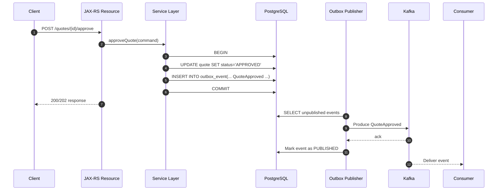

# Part 015 — Outbox Pattern

> Fokus: bagaimana service Java/JAX-RS dapat menyimpan perubahan bisnis di PostgreSQL dan mempublikasikan event Kafka dengan aman tanpa distributed transaction antara database dan Kafka.

Outbox pattern adalah salah satu pattern paling penting dalam event-driven backend system. Tanpa outbox, banyak sistem terlihat berhasil di happy path, tetapi memiliki lubang correctness serius saat database commit berhasil sementara publish Kafka gagal, atau publish Kafka berhasil sementara database rollback.

Outbox bukan sekadar tabel tambahan. Outbox adalah boundary disiplin antara **business transaction** dan **asynchronous event publication**.

Dalam sistem enterprise seperti CPQ, quote management, order management, billing integration, catalog-driven workflow, atau fulfillment orchestration, event yang hilang bisa berarti downstream service tidak pernah tahu ada perubahan state bisnis. Event duplikat bisa berarti downstream melakukan aksi dua kali. Event yang publish terlalu awal bisa berarti consumer melihat state yang belum commit. Outbox membantu mengubah failure yang sulit dikendalikan menjadi failure yang bisa diulang, diamati, dan diperbaiki.

---

## 1. Konsep Inti

Transactional outbox adalah pattern di mana aplikasi tidak langsung publish event ke Kafka sebagai bagian dari request bisnis. Aplikasi menyimpan event ke tabel outbox di database yang sama dan dalam transaksi yang sama dengan perubahan bisnis.

Alur dasarnya:

1. HTTP request masuk ke JAX-RS resource.
2. Resource memanggil service layer.
3. Service layer memulai transaction boundary.
4. Service mengubah business table, misalnya `quote`, `order`, atau `approval_request`.
5. Service menyisipkan satu atau lebih row ke `outbox_event` dalam transaksi yang sama.
6. Database commit.
7. Publisher terpisah membaca row outbox yang belum terkirim.
8. Publisher mengirim event ke Kafka.
9. Publisher menandai row sebagai published atau membiarkannya untuk CDC pipeline.

Outbox menjawab pertanyaan sederhana tetapi fatal:

> Bagaimana memastikan perubahan database dan niat publikasi event tidak terpisah oleh crash, timeout, atau network failure?

Jawabannya: simpan niat publikasi sebagai data transactional.

---

## 2. Masalah yang Diselesaikan: Dual-Write Problem

Dual-write problem muncul ketika satu request harus menulis ke dua resource berbeda yang tidak berada dalam satu atomic transaction.

Contoh buruk:

```java
@Transactional
public Quote approveQuote(ApproveQuoteCommand command) {
    Quote quote = quoteRepository.approve(command.quoteId());
    kafkaProducer.send("quote-events", quote.id(), QuoteApproved.from(quote));
    return quote;
}
```

Kode ini terlihat sederhana, tetapi correctness-nya lemah.

### Failure matrix

| Step | Database write | Kafka publish | Hasil |
|---|---:|---:|---|
| Happy path | sukses | sukses | OK |
| DB gagal | gagal | tidak publish | OK |
| Kafka gagal sebelum DB commit | rollback | gagal | OK jika exception benar |
| DB commit sukses, Kafka gagal setelahnya | sukses | gagal | downstream kehilangan event |
| Kafka publish sukses, DB rollback | gagal | sukses | downstream melihat event palsu |
| App crash setelah DB commit sebelum publish | sukses | tidak publish | event hilang |
| App crash setelah publish sebelum response | sukses | sukses/tidak pasti | retry client bisa membuat duplicate |

Tanpa outbox, kita sering tidak tahu state aktualnya. Apakah event sudah terkirim? Apakah database sudah commit? Apakah producer retry mengirim duplicate? Apakah consumer downstream harus percaya event itu valid?

Outbox memindahkan failure dari “hilang tanpa jejak” menjadi “row masih ada dan bisa dipublish ulang”.

---

## 3. Mental Model: Outbox sebagai Durable Intent

Outbox row bukan event Kafka final dalam arti operasional. Outbox row adalah **durable intent to publish**.

Artinya:

- Jika DB commit berhasil, intent publish pasti tercatat.
- Jika publisher mati, intent tetap ada.
- Jika Kafka unavailable, intent tetap ada.
- Jika publisher restart, intent bisa dicoba lagi.
- Jika event dikirim dua kali, consumer harus idempotent.

Outbox bukan menghilangkan duplicate. Outbox menghilangkan kategori “event hilang setelah DB commit”. Duplicate tetap mungkin dan harus ditangani oleh event ID, idempotency, inbox pattern, atau business idempotency.

---

## 4. Lifecycle Outbox



Lifecycle lengkap:

1. **Create** — business service membuat outbox row bersama business mutation.
2. **Visible** — row tersedia setelah commit.
3. **Claim** — publisher memilih row untuk diproses.
4. **Publish** — publisher mengirim event ke Kafka.
5. **Acknowledge** — Kafka mengkonfirmasi write sesuai producer config.
6. **Finalize** — publisher menandai row sebagai published, atau CDC connector menandai offset secara terpisah.
7. **Retry** — row gagal dipublish akan dicoba ulang.
8. **Observe** — lag, failure, retry count, dan oldest pending event dimonitor.
9. **Cleanup** — row lama dihapus/diarsip sesuai retention.

---

## 5. Outbox Table Design

Schema outbox harus mendukung correctness, observability, retry, ordering, dan debugging. Jangan hanya menyimpan payload string tanpa metadata.

Contoh minimal PostgreSQL:

```sql
CREATE TABLE outbox_event (
    id                  UUID PRIMARY KEY,
    aggregate_type      VARCHAR(100) NOT NULL,
    aggregate_id        VARCHAR(200) NOT NULL,
    event_type          VARCHAR(200) NOT NULL,
    event_version       INTEGER NOT NULL,
    topic_name          VARCHAR(255) NOT NULL,
    partition_key       VARCHAR(500) NOT NULL,
    payload             JSONB NOT NULL,
    headers             JSONB NOT NULL DEFAULT '{}'::jsonb,
    status              VARCHAR(30) NOT NULL,
    retry_count         INTEGER NOT NULL DEFAULT 0,
    next_attempt_at     TIMESTAMPTZ NOT NULL DEFAULT now(),
    last_error          TEXT NULL,
    created_at          TIMESTAMPTZ NOT NULL DEFAULT now(),
    published_at        TIMESTAMPTZ NULL,
    locked_by           VARCHAR(100) NULL,
    locked_at           TIMESTAMPTZ NULL
);

CREATE INDEX idx_outbox_event_status_next_attempt
    ON outbox_event (status, next_attempt_at, created_at);

CREATE INDEX idx_outbox_event_aggregate
    ON outbox_event (aggregate_type, aggregate_id, created_at);

CREATE INDEX idx_outbox_event_created_at
    ON outbox_event (created_at);
```

Field penting:

| Field | Fungsi |
|---|---|
| `id` | Event ID global. Dipakai consumer untuk dedup/inbox. |
| `aggregate_type` | Jenis aggregate: quote, order, catalog item, approval, dll. |
| `aggregate_id` | ID aggregate bisnis. Sering menjadi basis partition key. |
| `event_type` | Nama event, misalnya `QuoteApproved`. |
| `event_version` | Versi kontrak event. |
| `topic_name` | Target topic Kafka. |
| `partition_key` | Key Kafka untuk ordering per aggregate. |
| `payload` | Event payload. |
| `headers` | Metadata: correlation ID, causation ID, tenant ID, traceparent. |
| `status` | `PENDING`, `PUBLISHING`, `PUBLISHED`, `FAILED`, atau `PARKED`. |
| `retry_count` | Jumlah percobaan publish. |
| `next_attempt_at` | Waktu retry berikutnya. |
| `last_error` | Error terakhir untuk debugging. |
| `created_at` | Waktu event dibuat di transaction bisnis. |
| `published_at` | Waktu berhasil publish. |

Schema ini bisa disesuaikan. Yang tidak boleh hilang: event ID, target, key, payload, metadata, status/retry, timestamp, dan observability hooks.

---

## 6. Insert Outbox dalam Transaction yang Sama

Inti outbox adalah atomicity antara business row dan outbox row.

Contoh service layer:

```java
public Quote approveQuote(ApproveQuoteRequest request, RequestContext ctx) {
    return transactionTemplate.execute(status -> {
        Quote quote = quoteRepository.findForUpdate(request.quoteId());

        quote.approve(ctx.actorId(), ctx.now());
        quoteRepository.update(quote);

        OutboxEvent event = OutboxEvent.builder()
            .id(UUID.randomUUID())
            .aggregateType("quote")
            .aggregateId(quote.id().toString())
            .eventType("QuoteApproved")
            .eventVersion(1)
            .topicName("quote.events")
            .partitionKey(quote.id().toString())
            .payload(QuoteApprovedPayload.from(quote))
            .headers(EventHeaders.from(ctx))
            .status("PENDING")
            .createdAt(ctx.now())
            .build();

        outboxRepository.insert(event);

        return quote;
    });
}
```

Prinsipnya:

- Jangan publish Kafka di tengah transaction DB.
- Jangan membuat outbox row di transaction terpisah dari business update.
- Jangan generate event dari object yang belum final secara transaction.
- Jangan mengandalkan after-commit hook tanpa durable fallback.

After-commit hook boleh dipakai untuk memberi sinyal publisher agar cepat bekerja, tetapi bukan sebagai satu-satunya mekanisme reliability.

---

## 7. Polling Publisher

Polling publisher adalah worker yang membaca outbox table secara periodik dan mempublish event ke Kafka.

Pattern dasar:

1. Ambil batch row `PENDING` yang due.
2. Claim row agar tidak diproses worker lain.
3. Publish ke Kafka.
4. Jika sukses, mark `PUBLISHED`.
5. Jika gagal, increment retry dan set `next_attempt_at`.

Contoh query claim dengan `FOR UPDATE SKIP LOCKED`:

```sql
WITH candidate AS (
    SELECT id
    FROM outbox_event
    WHERE status = 'PENDING'
      AND next_attempt_at <= now()
    ORDER BY created_at ASC
    LIMIT 100
    FOR UPDATE SKIP LOCKED
)
UPDATE outbox_event o
SET status = 'PUBLISHING',
    locked_by = :publisher_id,
    locked_at = now()
FROM candidate c
WHERE o.id = c.id
RETURNING o.*;
```

`SKIP LOCKED` memungkinkan beberapa publisher berjalan paralel tanpa saling menunggu row yang sedang dikunci worker lain.

Namun concurrency harus dirancang hati-hati. Jika satu aggregate membutuhkan ordering ketat, parallel publisher bisa mempublish event aggregate yang sama secara out-of-order kecuali ada proteksi tambahan.

---

## 8. Publisher Concurrency

Concurrency publisher meningkatkan throughput, tetapi membawa risiko ordering.

Ada beberapa model:

### Model A — Single publisher

Paling sederhana dan paling mudah menjaga order global berdasarkan `created_at`. Cocok untuk volume rendah sampai sedang.

Kelemahan: throughput terbatas dan single point of processing bottleneck.

### Model B — Multiple publisher dengan SKIP LOCKED

Cocok untuk throughput lebih tinggi. Tiap worker mengambil batch berbeda.

Kelemahan: ordering global tidak dijamin. Ordering per aggregate juga bisa rusak jika dua event aggregate yang sama diklaim worker berbeda.

### Model C — Sharded publisher by aggregate hash

Publisher memproses shard tertentu berdasarkan hash `aggregate_id` atau `partition_key`.

Contoh:

```sql
WHERE mod(abs(hashtext(partition_key)), :total_shards) = :shard_id
```

Model ini menjaga ordering per partition key lebih baik karena event dengan key yang sama jatuh ke shard publisher yang sama.

### Model D — CDC publisher

Tidak ada polling publisher custom. Debezium membaca outbox row dari WAL dan mengirim ke Kafka. Ini dibahas lebih dalam di part CDC/Debezium.

---

## 9. Outbox Ordering

Kafka hanya menjamin ordering per partition. Outbox harus memilih partition key yang konsisten dengan invariant bisnis.

Untuk domain quote/order:

| Use case | Partition key yang sering masuk akal |
|---|---|
| Quote lifecycle | `quote_id` |
| Order lifecycle | `order_id` |
| Approval workflow per quote | `quote_id` atau `approval_request_id` |
| Tenant-wide catalog update | `tenant_id` jika ordering tenant penting |
| Customer account state | `customer_id` atau `account_id` |

Rule praktis:

> Jika consumer perlu melihat perubahan aggregate secara berurutan, gunakan aggregate ID sebagai Kafka key dan pastikan outbox publisher tidak merusak urutan publish untuk key tersebut.

Ordering bisa rusak karena:

- Multiple publisher mengambil event aggregate yang sama.
- Retry event lama terjadi setelah event baru sudah published.
- Partition count topic dinaikkan dan hash mapping berubah untuk event baru.
- Outbox query order by tidak stabil.
- CDC connector memproses perubahan sesuai WAL, tetapi consumer melakukan parallel processing tanpa ordering guard.

Outbox bukan automatic ordering solution. Outbox hanya memberi durable event intent. Ordering tetap harus dirancang end-to-end.

---

## 10. Retry Publish

Publisher Kafka bisa gagal karena broker unavailable, authorization issue, serialization error, schema incompatibility, network timeout, producer fencing, atau topic missing.

Bedakan failure:

| Failure | Karakter | Action |
|---|---|---|
| Network timeout | transient | retry dengan backoff |
| Broker unavailable | transient/platform | retry + alert jika lama |
| Authorization failed | permanent/config | park + alert |
| Unknown topic | config/platform | park + alert |
| Serialization error | bug/schema | park + fix data/code |
| Record too large | payload/design | park + redesign |
| Schema incompatible | contract issue | park + rollback/fix schema |

Retry tidak boleh infinite tanpa visibility. Gunakan `retry_count`, `next_attempt_at`, dan status `FAILED`/`PARKED` jika melewati retry budget.

Contoh update failure:

```sql
UPDATE outbox_event
SET status = CASE WHEN retry_count + 1 >= :max_retry THEN 'PARKED' ELSE 'PENDING' END,
    retry_count = retry_count + 1,
    next_attempt_at = now() + (:backoff_seconds || ' seconds')::interval,
    last_error = :error_message,
    locked_by = NULL,
    locked_at = NULL
WHERE id = :id;
```

---

## 11. Mark Published: Subtle but Important

Setelah producer mendapat ack dari Kafka, publisher menandai row sebagai `PUBLISHED`.

Tetapi ada failure window:

1. Publisher berhasil produce event ke Kafka.
2. Kafka ack diterima.
3. Publisher crash sebelum update outbox row menjadi `PUBLISHED`.
4. Setelah restart, event yang sama akan dipublish lagi.

Artinya outbox masih bisa menghasilkan duplicate event.

Ini bukan bug outbox. Ini konsekuensi at-least-once publishing. Consumer harus idempotent.

Prinsip penting:

- Outbox memberi **at-least-once event publication**.
- Outbox tidak memberi exactly-once end-to-end.
- Consumer harus dedup berdasarkan event ID atau business key.
- Replay harus aman.

---

## 12. CDC Publisher vs Polling Publisher

Ada dua implementasi populer:

### Polling publisher

Aplikasi atau worker custom membaca table outbox dan mengirim event ke Kafka.

Kelebihan:

- Mudah dikontrol di codebase aplikasi.
- Mudah menambahkan business-specific retry logic.
- Tidak membutuhkan Debezium.
- Mudah dipahami backend engineer.

Kekurangan:

- Bisa menambah load query polling ke DB.
- Perlu mengelola locking, concurrency, retry, lag, cleanup.
- Ordering harus dirancang manual.
- Publisher custom menjadi komponen operasional baru.

### CDC publisher

Debezium membaca perubahan outbox dari WAL dan mempublish ke Kafka, sering memakai Outbox Event Router.

Kelebihan:

- Mengurangi polling DB.
- Mengikuti urutan commit database/WAL.
- Cocok untuk throughput tinggi dan standardisasi event pipeline.
- Lebih dekat ke event publication from transaction log.

Kekurangan:

- Operational complexity pindah ke Kafka Connect/Debezium.
- Perlu mengelola replication slot, WAL retention, connector offset, schema, transform, dan connector failure.
- Debugging lebih lintas platform: app, DB, Kafka Connect, Kafka.

Keputusan polling vs CDC harus didasarkan pada volume, ownership, platform maturity, operational readiness, dan kebutuhan ordering.

---

## 13. Outbox Payload Strategy

Ada dua pendekatan payload:

### Full event payload stored in outbox

Outbox menyimpan payload final yang akan dikirim.

Kelebihan:

- Event stabil sesuai waktu transaction.
- Publisher tidak perlu query ulang business table.
- Replay publish dari outbox tidak berubah walaupun business table berubah.
- Debugging lebih mudah.

Kekurangan:

- Payload bisa besar.
- Schema migration payload historis perlu perhatian.
- PII di outbox harus dilindungi.

### Reference-only outbox

Outbox hanya menyimpan event type dan aggregate ID. Publisher query ulang business table untuk membentuk payload.

Kelebihan:

- Outbox kecil.
- Payload selalu memakai state terbaru.

Kekurangan serius:

- Event tidak merepresentasikan state saat transaction terjadi.
- Jika business row berubah sebelum publish, event bisa salah.
- Jika row dihapus/diubah, publisher bisa gagal membentuk event.
- Replay tidak deterministic.

Untuk event-driven enterprise system, full event payload biasanya lebih aman. Reference-only hanya cocok jika event memang dirancang sebagai notification event dan consumer expected untuk fetch state terbaru.

---

## 14. Headers and Metadata

Outbox harus menyimpan metadata yang akan menjadi Kafka headers atau bagian envelope.

Metadata minimal:

```json
{
  "eventId": "c26b4ad4-7ff2-4f6e-bd9e-d3df4e7bb017",
  "eventType": "QuoteApproved",
  "eventVersion": 1,
  "aggregateType": "quote",
  "aggregateId": "Q-1000123",
  "correlationId": "req-9f6b...",
  "causationId": "cmd-81cb...",
  "traceparent": "00-...",
  "tenantId": "tenant-a",
  "actorId": "user-123",
  "sourceService": "quote-service",
  "occurredAt": "2026-07-11T08:10:00Z"
}
```

Tanpa metadata ini, incident debugging menjadi tebak-tebakan. Anda akan sulit menjawab:

- Request mana yang menyebabkan event ini?
- Event ini akibat command/event apa?
- Tenant mana terdampak?
- Service mana yang publish?
- Event ini versi berapa?
- Aggregate mana yang harus direkonsiliasi?
- Apakah duplicate ini event sama atau event berbeda?

---

## 15. Outbox Cleanup and Retention

Outbox yang tidak pernah dibersihkan akan menjadi operational problem.

Policy umum:

- `PUBLISHED` disimpan beberapa hari/minggu untuk debugging dan audit teknis.
- `PARKED` disimpan lebih lama sampai manual resolution.
- `PENDING` tidak boleh terlalu tua; oldest pending age harus alert.
- Payload PII harus mengikuti data retention/privacy policy.
- Cleanup harus batch-based agar tidak membuat lock besar.

Contoh cleanup:

```sql
DELETE FROM outbox_event
WHERE status = 'PUBLISHED'
  AND published_at < now() - interval '30 days'
LIMIT 1000;
```

PostgreSQL tidak mendukung `LIMIT` langsung di `DELETE` versi standar seperti itu dalam semua bentuk; gunakan CTE:

```sql
WITH old_rows AS (
    SELECT id
    FROM outbox_event
    WHERE status = 'PUBLISHED'
      AND published_at < now() - interval '30 days'
    ORDER BY published_at
    LIMIT 1000
)
DELETE FROM outbox_event o
USING old_rows r
WHERE o.id = r.id;
```

Cleanup juga harus mempertimbangkan autovacuum, bloat, index growth, dan partitioning table jika volume sangat tinggi.

---

## 16. Outbox Migration

Perubahan outbox table adalah perubahan reliability layer. Jangan diperlakukan sebagai migration biasa.

Risiko migration:

- Menambahkan kolom `NOT NULL` tanpa default pada table besar.
- Mengubah payload shape tanpa kompatibilitas publisher.
- Mengubah status enum dan membuat publisher lama gagal.
- Mengubah index dan memperlambat polling.
- Menghapus row lama yang masih dibutuhkan replay.
- Mengubah topic/partition key logic tanpa backward compatibility.

Safe migration strategy:

1. Additive schema change dulu.
2. Deploy writer yang mulai mengisi kolom baru.
3. Backfill jika perlu.
4. Deploy publisher yang membaca kolom baru.
5. Observe.
6. Baru hapus field lama setelah aman.

---

## 17. Outbox Observability

Outbox tanpa dashboard adalah bom waktu. Anda perlu melihat apakah event intent tertahan.

Metric penting:

| Metric | Makna |
|---|---|
| `outbox.pending.count` | Jumlah event belum published. |
| `outbox.oldest.pending.age.seconds` | Usia event tertua yang belum published. |
| `outbox.publish.success.rate` | Throughput publish sukses. |
| `outbox.publish.failure.rate` | Failure rate publish. |
| `outbox.retry.count` | Jumlah retry. |
| `outbox.parked.count` | Event yang butuh manual intervention. |
| `outbox.publish.latency` | Waktu dari created sampai published. |
| `outbox.batch.size` | Ukuran batch publisher. |
| `outbox.locked.stale.count` | Row `PUBLISHING` terlalu lama. |

Alert yang berguna:

- Oldest pending age melewati SLA.
- Pending count naik terus.
- Parked count > 0 untuk event critical.
- Publish failure rate spike.
- Stale locked row muncul.
- Tidak ada publish success selama periode tertentu padahal pending > 0.

---

## 18. Debugging Outbox Failure

Saat downstream bertanya “event belum sampai”, jangan langsung reset consumer. Mulai dari outbox.

Checklist diagnosis:

1. Apakah business transaction commit?
2. Apakah outbox row dibuat?
3. Apakah status row `PENDING`, `PUBLISHING`, `PUBLISHED`, atau `PARKED`?
4. Apakah `last_error` berisi serialization, auth, topic, atau network error?
5. Apakah publisher berjalan?
6. Apakah publisher punya permission ke topic?
7. Apakah Kafka topic ada?
8. Apakah producer ack sukses?
9. Apakah event muncul di topic?
10. Apakah consumer group lag?
11. Apakah consumer masuk DLQ?
12. Apakah event duplicate dan consumer dedup?

Contoh query debugging:

```sql
SELECT id,
       aggregate_type,
       aggregate_id,
       event_type,
       topic_name,
       partition_key,
       status,
       retry_count,
       created_at,
       published_at,
       last_error
FROM outbox_event
WHERE aggregate_type = 'quote'
  AND aggregate_id = :quote_id
ORDER BY created_at DESC;
```

---

## 19. Common Failure Modes

### 19.1 Outbox row tidak dibuat

Biasanya karena event creation logic tidak berada di transaction path yang benar, conditional branch terlewat, atau mapper insert gagal tetapi exception ditelan.

Mitigasi:

- Test service transaction menghasilkan business row + outbox row.
- Jangan swallow exception insert outbox.
- Gunakan invariant test untuk command penting.

### 19.2 Outbox row dibuat tetapi tidak dipublish

Kemungkinan publisher mati, scheduler tidak berjalan, query filter salah, status stuck, lock stale, atau next attempt jauh di masa depan.

Mitigasi:

- Alert oldest pending age.
- Stale lock recovery.
- Health check publisher.

### 19.3 Event dipublish duplicate

Kemungkinan crash setelah Kafka ack sebelum mark published, retry ambiguity, atau manual replay.

Mitigasi:

- Event ID stabil.
- Consumer inbox/idempotency.
- Duplicate-safe business state transition.

### 19.4 Event out-of-order

Kemungkinan parallel publisher, retry event lama, partition key salah, atau consumer parallel processing.

Mitigasi:

- Partition key by aggregate.
- Publisher shard by partition key.
- Consumer ordering guard jika bisnis butuh.

### 19.5 Publisher terlalu lambat

Kemungkinan polling interval terlalu besar, batch kecil, index buruk, Kafka latency tinggi, DB overloaded, serialization lambat, atau topic throttling.

Mitigasi:

- Index `status,next_attempt_at,created_at`.
- Tune batch size.
- Monitor DB and Kafka latency.
- Scale publisher dengan shard-safe model.

### 19.6 Outbox table membesar

Kemungkinan cleanup tidak berjalan, retention terlalu panjang, parked event menumpuk, atau volume event naik.

Mitigasi:

- Cleanup job.
- Partition table by time jika perlu.
- Monitor table/index bloat.

---

## 20. Interaction with JAX-RS

JAX-RS resource sebaiknya tidak tahu detail Kafka producer. Resource hanya memvalidasi request, membentuk command, dan memanggil service layer.

Pattern yang lebih sehat:

```java
@Path("/quotes/{quoteId}/approval")
public class QuoteApprovalResource {

    @POST
    public Response approve(@PathParam("quoteId") String quoteId,
                            ApproveQuoteHttpRequest body,
                            @Context HttpHeaders headers) {
        RequestContext ctx = requestContextFactory.from(headers);
        ApproveQuoteCommand command = new ApproveQuoteCommand(quoteId, body.reason(), ctx);

        QuoteApprovalResult result = quoteApprovalService.approve(command);

        return Response.ok(result.toResponse()).build();
    }
}
```

Service layer bertanggung jawab terhadap transaction dan outbox. Producer runtime terpisah dari request thread.

Ini penting karena:

- HTTP response tidak boleh tergantung langsung pada Kafka broker availability jika business transaction sudah commit.
- Timeout Kafka tidak boleh memperpanjang DB transaction.
- Retry publish tidak boleh terjadi di request thread.
- Event publication harus observable di outbox, bukan tersembunyi di callback producer.

---

## 21. Interaction with MyBatis/JDBC

Dalam MyBatis/JDBC, pastikan mapper business update dan mapper outbox insert memakai connection/transaction yang sama.

Anti-pattern:

- Business mapper memakai transaction manager A, outbox mapper memakai connection manual lain.
- Outbox insert dilakukan setelah service method transaction selesai.
- Autocommit aktif tanpa sadar.
- Exception insert outbox ditangkap dan hanya dilog.

Review yang harus dilakukan:

```java
transactionTemplate.execute(status -> {
    quoteMapper.updateStatus(...);
    outboxMapper.insert(...);
    return null;
});
```

Pastikan:

- `quoteMapper` dan `outboxMapper` berada di transaction context yang sama.
- Tidak ada `REQUIRES_NEW` untuk outbox kecuali benar-benar dipahami konsekuensinya.
- Tidak ada async event construction di luar transaction yang membaca object mutable.
- Test rollback membuktikan business row dan outbox row sama-sama rollback.

---

## 22. Security and Privacy Concerns

Outbox sering menyimpan payload lengkap. Ini berarti outbox adalah data store sensitif.

Perhatikan:

- Jangan masukkan PII yang tidak dibutuhkan consumer.
- Jangan menaruh token, credential, secret, atau raw authorization header dalam event metadata.
- Pastikan log publisher tidak mencetak payload sensitif.
- Pastikan DLQ/retry/parked event tidak memperluas exposure PII.
- Pastikan retention outbox sesuai privacy policy.
- Pastikan access database ke outbox dibatasi.

Jika payload berisi data customer/order/quote yang sensitif, outbox harus masuk scope audit dan compliance review.

---

## 23. Performance Concerns

Outbox menambah write amplification dan read load.

Concern utama:

- Insert tambahan per business transaction.
- Index overhead pada outbox table.
- Polling query menambah load DB.
- Cleanup besar bisa menyebabkan bloat/lock.
- Payload JSONB besar meningkatkan IO.
- Publisher batch terlalu besar bisa memperlama lock.
- Publisher batch terlalu kecil bisa underutilize Kafka.

Tuning praktis:

- Gunakan index sesuai polling query.
- Batasi batch size.
- Gunakan backoff adaptif saat tidak ada row.
- Hindari full table scan outbox.
- Monitor query plan polling.
- Pertimbangkan partitioning table jika volume tinggi.
- Pertimbangkan CDC jika polling menjadi bottleneck.

---

## 24. Trade-Off

| Keputusan | Kelebihan | Risiko |
|---|---|---|
| Direct publish | Sederhana | Event hilang/phantom event saat failure |
| Polling outbox | Mudah dikontrol aplikasi | Perlu worker, locking, cleanup |
| CDC outbox | Mengurangi polling, mengikuti WAL | Operational complexity Debezium/Connect |
| Full payload | Deterministic replay | Storage/PII/schema concern |
| Reference payload | Outbox kecil | Event bisa tidak merepresentasikan state saat commit |
| Single publisher | Ordering sederhana | Throughput terbatas |
| Multi publisher | Throughput tinggi | Ordering risk |

---

## 25. PR Review Checklist

Gunakan checklist ini saat review PR yang menyentuh producer/event publication.

### Transaction correctness

- Apakah business mutation dan outbox insert berada dalam transaction yang sama?
- Apakah Kafka publish langsung dari request transaction dihindari?
- Apakah rollback business mutation juga rollback outbox row?
- Apakah exception insert outbox tidak ditelan?

### Event design

- Apakah event ID stabil dan unik?
- Apakah event type/version jelas?
- Apakah partition key sesuai aggregate ordering requirement?
- Apakah payload final disimpan atau reference-only? Apakah alasannya jelas?
- Apakah metadata correlation/causation/trace/tenant/actor ada?

### Publisher behavior

- Apakah publisher retry-safe?
- Apakah duplicate publish diakui dan consumer idempotency tersedia?
- Apakah failure permanent bisa diparkir dan di-alert?
- Apakah stale lock bisa dipulihkan?
- Apakah batch/concurrency tidak merusak ordering?

### Observability

- Apakah pending count, oldest pending age, failure rate, parked count dimonitor?
- Apakah `last_error` cukup untuk debugging?
- Apakah log punya event ID, aggregate ID, topic, partition key?
- Apakah dashboard/runbook tersedia?

### Operations

- Apakah cleanup/retention jelas?
- Apakah migration outbox aman?
- Apakah access/security/privacy diperhitungkan?
- Apakah replay/manual republish procedure ada?

---

## 26. Internal Verification Checklist

Karena detail internal CSG tidak tersedia, cek hal berikut di codebase dan dengan team:

- Apakah service menggunakan outbox pattern atau direct Kafka producer?
- Di mana outbox table berada: per service database, shared database, atau platform schema?
- Apa nama table outbox aktual?
- Apakah event payload disimpan full atau reference-only?
- Apakah publisher polling custom atau CDC/Debezium?
- Jika polling, bagaimana locking dilakukan? Apakah memakai `SKIP LOCKED`?
- Jika CDC, apakah memakai Debezium Outbox Event Router?
- Apa status lifecycle outbox: `PENDING`, `PUBLISHED`, `FAILED`, `PARKED`, atau lainnya?
- Bagaimana retry dan backoff publish dilakukan?
- Apakah duplicate publish dianggap normal dan ditangani consumer?
- Apa partition key default untuk quote/order/catalog/approval event?
- Apakah ada event catalog yang menjelaskan topic target?
- Apakah correlation ID, causation ID, traceparent, tenant ID, actor ID disimpan?
- Apakah outbox lag dimonitor?
- Apakah parked event punya alert?
- Apakah cleanup/retention outbox dijalankan?
- Apakah outbox masuk compliance/privacy review?
- Apakah ada incident notes terkait missing event, duplicate event, atau outbox backlog?
- Siapa owner publisher: backend team, platform team, SRE, atau data integration team?

---

## 27. Ringkasan

Outbox pattern adalah reliability boundary antara database transaction dan Kafka publication.

Mental model yang harus dipegang:

- Business mutation dan event intent harus atomic di PostgreSQL.
- Kafka publication boleh asynchronous, retryable, dan observable.
- Outbox mencegah event hilang setelah DB commit.
- Outbox tidak mencegah duplicate; consumer tetap harus idempotent.
- Ordering harus dirancang lewat partition key, publisher concurrency, dan consumer behavior.
- Observability outbox wajib: pending count, oldest pending age, failures, parked events.
- Outbox table adalah data sensitif dan operational component, bukan sekadar audit log.

Jika Anda mereview PR producer Kafka, pertanyaan pertama bukan “event dikirim ke topic apa?”, tetapi:

> Jika database commit sukses dan Kafka unavailable selama 10 menit, apakah event akan tetap terkirim nanti, bisa dipantau, dan aman jika terkirim dua kali?

Jika jawabannya tidak jelas, desain producer belum production-ready.
