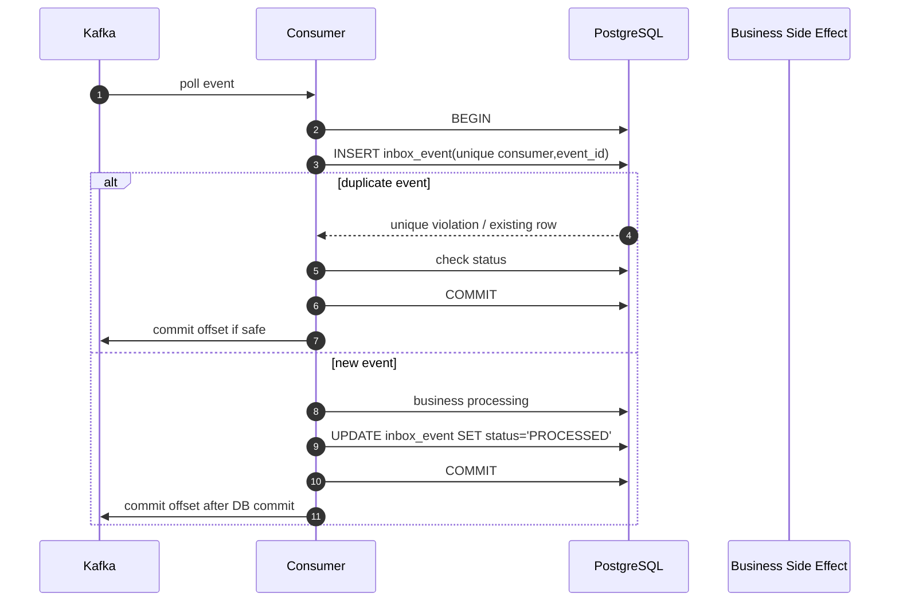

# Part 016 — Inbox Pattern

> Fokus: bagaimana consumer Kafka memproses event secara aman walaupun Kafka memberikan at-least-once delivery, event bisa duplicate, consumer bisa crash, offset commit bisa tertunda, dan replay bisa terjadi.

Inbox pattern adalah pasangan alami dari outbox pattern. Jika outbox membantu producer memastikan event tidak hilang setelah database commit, inbox membantu consumer memastikan event yang sama tidak menghasilkan efek bisnis dua kali.

Dalam Kafka, duplicate event bukan edge case langka. Duplicate adalah kondisi normal yang harus diasumsikan. Producer bisa retry. Outbox publisher bisa crash setelah Kafka ack tetapi sebelum mark published. Consumer bisa crash setelah update database tetapi sebelum commit offset. Operator bisa replay topic. Consumer group bisa rebalance. Manual recovery bisa mengirim event ulang. Semua ini membuat idempotency bukan nice-to-have, melainkan syarat correctness.

Inbox pattern membuat consumer mampu berkata:

> “Saya sudah pernah melihat event ini, dan saya tahu apakah event ini sudah diproses, gagal, sedang diproses, atau perlu intervensi.”

---

## 1. Konsep Inti

Inbox pattern adalah pattern di mana consumer menyimpan metadata event yang diterima ke database sebelum atau bersama proses bisnisnya. Tabel inbox digunakan untuk deduplication, idempotency, retry tracking, poison event tracking, replay handling, dan audit teknis.

Alur umumnya:

1. Consumer poll record dari Kafka.
2. Consumer membaca event ID atau deduplication key.
3. Consumer membuka database transaction.
4. Consumer mencoba insert row ke `inbox_event`.
5. Jika insert berhasil, event belum pernah diproses oleh consumer tersebut.
6. Consumer menjalankan business processing.
7. Consumer menandai inbox row sebagai `PROCESSED`.
8. Transaction commit.
9. Baru setelah itu offset Kafka di-commit.
10. Jika event duplicate datang lagi, unique constraint mencegah double processing.

Inbox bukan sekadar log consumer. Inbox adalah **idempotency ledger**.

---

## 2. Kenapa Inbox Dibutuhkan

Kafka consumer normal bekerja dengan offset. Offset hanya menjawab:

> Consumer group ini sudah membaca sampai offset berapa?

Offset tidak menjawab:

- Apakah business side effect sudah terjadi?
- Apakah database commit sukses?
- Apakah external API call sudah dilakukan?
- Apakah event ini duplicate dari event sebelumnya?
- Apakah replay aman?
- Apakah consumer crash setelah DB write tetapi sebelum offset commit?

Inbox menjawab pertanyaan di level aplikasi, bukan level Kafka.

---

## 3. Failure Matrix Consumer Tanpa Inbox

Misalnya consumer memproses `QuoteApproved` dan membuat approval audit row.

| Step | Business DB write | Offset commit | Hasil |
|---|---:|---:|---|
| Happy path | sukses | sukses | OK |
| Processing gagal sebelum DB write | gagal | tidak commit | retry aman |
| DB write sukses, crash sebelum offset commit | sukses | gagal | event diproses ulang, duplicate side effect |
| Offset commit sukses sebelum DB write | gagal | sukses | event hilang secara aplikasi |
| External API sukses, crash sebelum offset commit | sukses external | gagal | external call bisa terjadi dua kali |
| Rebalance saat processing lama | tidak pasti | tidak pasti | duplicate/partial processing risk |
| Replay topic | bisa ulang | offset reset | duplicate side effect jika tidak idempotent |

Inbox mengurangi risiko utama: duplicate processing setelah DB write sukses tetapi offset belum commit.

---

## 4. Inbox Table Design

Contoh schema PostgreSQL:

```sql
CREATE TABLE inbox_event (
    id                  UUID PRIMARY KEY,
    consumer_name       VARCHAR(200) NOT NULL,
    event_id            UUID NOT NULL,
    event_type          VARCHAR(200) NOT NULL,
    event_version       INTEGER NOT NULL,
    aggregate_type      VARCHAR(100) NOT NULL,
    aggregate_id        VARCHAR(200) NOT NULL,
    topic_name          VARCHAR(255) NOT NULL,
    partition_number    INTEGER NOT NULL,
    offset_number       BIGINT NOT NULL,
    deduplication_key   VARCHAR(500) NOT NULL,
    payload             JSONB NULL,
    headers             JSONB NOT NULL DEFAULT '{}'::jsonb,
    status              VARCHAR(30) NOT NULL,
    retry_count         INTEGER NOT NULL DEFAULT 0,
    last_error          TEXT NULL,
    received_at         TIMESTAMPTZ NOT NULL DEFAULT now(),
    processing_started_at TIMESTAMPTZ NULL,
    processed_at        TIMESTAMPTZ NULL,
    locked_by           VARCHAR(100) NULL,
    locked_at           TIMESTAMPTZ NULL,

    CONSTRAINT uq_inbox_consumer_event UNIQUE (consumer_name, event_id),
    CONSTRAINT uq_inbox_consumer_dedup UNIQUE (consumer_name, deduplication_key)
);

CREATE INDEX idx_inbox_event_status_received
    ON inbox_event (consumer_name, status, received_at);

CREATE INDEX idx_inbox_event_aggregate
    ON inbox_event (aggregate_type, aggregate_id, received_at);

CREATE INDEX idx_inbox_event_topic_offset
    ON inbox_event (topic_name, partition_number, offset_number);
```

Field penting:

| Field | Fungsi |
|---|---|
| `consumer_name` | Nama logical consumer. Dedup scoped per consumer. |
| `event_id` | ID event dari producer/outbox. |
| `deduplication_key` | Key alternatif jika event ID tidak cukup. |
| `status` | `RECEIVED`, `PROCESSING`, `PROCESSED`, `FAILED`, `POISON`, `IGNORED`. |
| `topic_name`, `partition_number`, `offset_number` | Debugging Kafka position. |
| `payload`, `headers` | Optional storage untuk replay/debugging. |
| `retry_count`, `last_error` | Failure diagnosis. |
| `received_at`, `processed_at` | Latency dan audit teknis. |

Unique constraint adalah jantung inbox. Tanpa constraint, inbox hanya log biasa.

---

## 5. Deduplication Key

Deduplication key menentukan apa yang dianggap “event yang sama”.

Pilihan umum:

### Event ID

Jika producer/outbox memberikan event ID global yang stabil, gunakan `(consumer_name, event_id)`.

Ini pilihan terbaik untuk event publication duplicate.

### Business command ID

Jika event merepresentasikan hasil command tertentu, bisa gunakan command ID atau idempotency key dari HTTP request.

Cocok untuk mencegah efek ganda dari retry command.

### Aggregate + event type + version + sequence

Jika tidak ada event ID, bisa memakai composite key:

```text
consumerName + aggregateType + aggregateId + eventType + aggregateVersion
```

Ini hanya aman jika aggregate version benar-benar monotonic dan tidak reuse.

### Topic + partition + offset

Jangan gunakan ini sebagai dedup utama untuk semantic duplicate. Topic/partition/offset unik untuk record Kafka, tetapi event yang sama bisa dipublish ulang di offset berbeda. Ini berguna untuk observability, bukan idempotency bisnis.

---

## 6. Consumer Lifecycle dengan Inbox



Prinsip utama:

> Commit offset Kafka setelah business transaction commit.

Jika offset di-commit sebelum DB commit, event bisa hilang secara aplikasi. Kafka menganggap sudah selesai, tetapi state bisnis belum berubah.

---

## 7. Basic Implementation Pattern

Pseudocode Java:

```java
public void handle(ConsumerRecord<String, byte[]> record) {
    EventEnvelope event = eventDeserializer.deserialize(record);

    ProcessingResult result = transactionTemplate.execute(tx -> {
        boolean inserted = inboxRepository.tryInsert(InboxEvent.from(record, event));

        if (!inserted) {
            InboxEvent existing = inboxRepository.find(consumerName, event.eventId());
            return handleDuplicate(existing, event);
        }

        try {
            processBusinessLogic(event);
            inboxRepository.markProcessed(consumerName, event.eventId());
            return ProcessingResult.PROCESSED;
        } catch (RecoverableBusinessException ex) {
            inboxRepository.markFailed(consumerName, event.eventId(), ex);
            throw ex;
        } catch (NonRecoverableBusinessException ex) {
            inboxRepository.markPoison(consumerName, event.eventId(), ex);
            return ProcessingResult.POISON_HANDLED;
        }
    });

    if (result.canCommitOffset()) {
        offsetManager.commit(record);
    }
}
```

Catatan:

- `tryInsert` harus bergantung pada unique constraint, bukan check-then-insert rapuh.
- `processBusinessLogic` harus berada dalam transaction yang sama jika side effect-nya database lokal.
- Offset commit dilakukan setelah DB commit.
- Poison event handling harus sesuai strategi: commit offset setelah park/DLQ atau stop consumer.

---

## 8. Check-Then-Insert Race Condition

Anti-pattern:

```java
if (!inboxRepository.exists(eventId)) {
    processBusinessLogic(event);
    inboxRepository.insert(eventId);
}
```

Ini race condition. Dua thread/consumer instance bisa sama-sama melihat belum ada row, lalu keduanya memproses event.

Pattern yang benar:

```sql
INSERT INTO inbox_event (...)
VALUES (...)
ON CONFLICT (consumer_name, event_id) DO NOTHING;
```

Lalu cek affected row count.

Untuk PostgreSQL:

```sql
INSERT INTO inbox_event (
    id,
    consumer_name,
    event_id,
    event_type,
    event_version,
    aggregate_type,
    aggregate_id,
    topic_name,
    partition_number,
    offset_number,
    deduplication_key,
    payload,
    headers,
    status,
    received_at
) VALUES (
    :id,
    :consumer_name,
    :event_id,
    :event_type,
    :event_version,
    :aggregate_type,
    :aggregate_id,
    :topic_name,
    :partition_number,
    :offset_number,
    :deduplication_key,
    CAST(:payload AS jsonb),
    CAST(:headers AS jsonb),
    'PROCESSING',
    now()
)
ON CONFLICT (consumer_name, event_id) DO NOTHING;
```

Jika affected rows = 0, event duplicate untuk consumer tersebut.

---

## 9. Business Idempotency vs Inbox Idempotency

Inbox idempotency dan business idempotency berbeda.

### Inbox idempotency

Menjamin event ID yang sama tidak diproses dua kali oleh logical consumer yang sama.

Ini melindungi dari duplicate delivery record yang sama secara semantik.

### Business idempotency

Menjamin operasi bisnis tetap aman meskipun input berbeda mencoba menghasilkan efek yang sama.

Contoh:

- Dua event berbeda mencoba membuat shipment untuk order yang sama.
- Dua command berbeda mencoba approve quote yang sudah approved.
- Replay event lama mencoba menurunkan state dari `FULFILLED` ke `SUBMITTED`.

Business idempotency butuh constraint/invariant di business table, bukan hanya inbox.

Contoh:

```sql
ALTER TABLE order_fulfillment
ADD CONSTRAINT uq_order_fulfillment_order_id UNIQUE (order_id);
```

Atau state transition guard:

```sql
UPDATE orders
SET status = 'FULFILLED'
WHERE id = :order_id
  AND status IN ('READY_FOR_FULFILLMENT', 'FULFILLING');
```

Jika affected rows = 0, consumer harus menentukan apakah itu duplicate benign, out-of-order event, atau invalid transition.

---

## 10. Status Model Inbox

Status yang terlalu sederhana membuat debugging sulit. Status yang terlalu kompleks membuat state machine inbox membingungkan.

Model praktis:

| Status | Makna |
|---|---|
| `PROCESSING` | Event diterima dan sedang diproses dalam transaction. |
| `PROCESSED` | Business effect sukses. |
| `FAILED` | Gagal recoverable; bisa dicoba ulang. |
| `POISON` | Event tidak bisa diproses tanpa perubahan data/code/schema/manual action. |
| `IGNORED` | Event valid tapi tidak relevan untuk consumer ini. |

Stale `PROCESSING` harus dideteksi. Jika consumer crash di tengah transaction, row biasanya rollback. Tetapi jika desain memisahkan insert inbox dan processing, status `PROCESSING` bisa tertinggal dan butuh recovery logic.

Untuk simplicity dan atomicity, sering lebih baik insert inbox + business processing + mark processed dilakukan dalam satu transaction.

---

## 11. Retry State

Retry bisa dikelola oleh Kafka retry topic, framework consumer, atau inbox table. Jangan campur tanpa model jelas.

Jika inbox menyimpan retry state:

- `retry_count`
- `last_error`
- `next_attempt_at`
- `status`
- `locked_by`
- `locked_at`

Namun untuk Kafka consumer, retry sering lebih aman melalui retry topic agar partition utama tidak diblokir oleh satu event rusak.

Model umum:

1. Consumer gagal transient.
2. Event dipublish ke retry topic dengan retry metadata.
3. Original offset di-commit setelah retry event durable.
4. Retry consumer memproses ulang setelah delay.
5. Inbox tetap dipakai untuk dedup dan status.

Jika consumer hanya throw exception dan tidak commit offset, partition bisa stuck di event yang sama. Ini mungkin benar untuk event super critical, tetapi berbahaya untuk high-volume topic.

---

## 12. Replay Handling

Replay adalah alasan utama inbox harus ada.

Replay bisa terjadi karena:

- Offset reset consumer group.
- Consumer group baru membaca topic dari awal.
- Topic event dipublish ulang dari outbox.
- Reconciliation job mengirim backfill event.
- Operator melakukan manual replay dari DLQ.

Dengan inbox:

- Event yang sama bisa dikenali dari event ID.
- Event yang sudah `PROCESSED` bisa dilewati.
- Event yang dulu `FAILED` bisa diputuskan apakah dicoba ulang.
- Event yang `POISON` bisa tetap diparkir.

Tanpa inbox, replay berpotensi mengulang side effect bisnis.

Replay-safe consumer harus punya behavior eksplisit:

| Existing inbox status | Replay behavior |
|---|---|
| `PROCESSED` | skip dan commit offset |
| `PROCESSING` stale | inspect/recover sesuai policy |
| `FAILED` | retry jika masih relevan |
| `POISON` | skip to DLQ/park atau stop sesuai policy |
| `IGNORED` | skip |

---

## 13. Payload Storage: Simpan atau Tidak?

Inbox bisa menyimpan full payload atau hanya metadata.

### Simpan full payload

Kelebihan:

- Debugging mudah.
- Manual replay dari DB mungkin.
- Audit teknis lebih lengkap.
- Bisa membandingkan payload saat duplicate.

Kekurangan:

- Storage besar.
- Privacy/PII risk.
- Schema evolution payload historis perlu perhatian.

### Simpan metadata saja

Kelebihan:

- Lebih ringan.
- Mengurangi exposure data sensitif.

Kekurangan:

- Debugging butuh Kafka/topic retention.
- Jika topic sudah expired, payload hilang.
- Manual investigation lebih sulit.

Untuk event critical, sering masuk akal menyimpan payload terbatas atau redacted payload. Jangan menyimpan data sensitif tanpa kebijakan retention dan access control.

---

## 14. Poison Event Tracking

Poison event adalah event yang tidak bisa diproses oleh consumer saat ini karena data invalid, schema tidak kompatibel, business invariant dilanggar, atau bug aplikasi.

Contoh:

- Event schema valid tapi field mandatory secara bisnis kosong.
- Event version tidak didukung.
- Aggregate target tidak ditemukan.
- State transition invalid.
- Payload terlalu besar.
- Enum baru tidak dikenali consumer lama.
- Referenced entity belum tersedia akibat out-of-order event.

Inbox membantu menyimpan status `POISON`, `last_error`, dan metadata event.

Poison event tidak boleh hilang dalam log biasa. Harus ada:

- Status jelas.
- Alert.
- Runbook.
- Manual resolution path.
- DLQ atau parking lot integration.
- Reprocess decision setelah fix.

---

## 15. Inbox with PostgreSQL Transaction

Jika consumer side effect adalah database lokal, inbox dan business update harus berada dalam transaction yang sama.

Contoh:

```java
transactionTemplate.execute(status -> {
    boolean inserted = inboxMapper.insertIfAbsent(inboxRow);

    if (!inserted) {
        return DuplicateHandling.SKIPPED;
    }

    orderProjectionMapper.upsertFromEvent(event);
    inboxMapper.markProcessed(consumerName, event.eventId());

    return DuplicateHandling.PROCESSED;
});
```

Jika transaction commit gagal, inbox insert dan business update rollback bersama. Kafka offset belum di-commit, sehingga event akan dikirim ulang dan bisa dicoba lagi.

Jika transaction commit sukses tetapi offset commit gagal, event akan dikirim ulang. Inbox unique constraint membuat consumer skip duplicate.

Ini adalah at-least-once + idempotency yang benar.

---

## 16. Inbox with MyBatis/JDBC

Di MyBatis/JDBC, problem sering muncul karena transaction boundary tidak eksplisit.

Pastikan:

- Mapper inbox dan mapper business memakai transaction/session yang sama.
- Tidak ada autocommit terpisah.
- Insert inbox tidak dilakukan di transaction berbeda dari business update.
- Offset commit tidak terjadi di dalam DB transaction.
- Exception SQL unique conflict diperlakukan sebagai duplicate, bukan error fatal.

Contoh mapper:

```xml
<insert id="insertIfAbsent">
  INSERT INTO inbox_event (
    id,
    consumer_name,
    event_id,
    event_type,
    event_version,
    aggregate_type,
    aggregate_id,
    topic_name,
    partition_number,
    offset_number,
    deduplication_key,
    payload,
    headers,
    status,
    received_at
  ) VALUES (
    #{id},
    #{consumerName},
    #{eventId},
    #{eventType},
    #{eventVersion},
    #{aggregateType},
    #{aggregateId},
    #{topicName},
    #{partitionNumber},
    #{offsetNumber},
    #{deduplicationKey},
    CAST(#{payload} AS jsonb),
    CAST(#{headers} AS jsonb),
    'PROCESSING',
    now()
  )
  ON CONFLICT (consumer_name, event_id) DO NOTHING
</insert>
```

Mapper method harus mengembalikan affected row count.

---

## 17. Offset Commit Strategy

Rule dasar:

> Commit offset setelah processing transaction commit.

Sequence aman:

```text
poll -> deserialize -> DB transaction insert inbox + business update + mark processed -> DB commit -> commit offset
```

Jika DB commit sukses tetapi offset commit gagal, duplicate akan terjadi. Inbox menangani.

Sequence berbahaya:

```text
poll -> commit offset -> process DB
```

Jika process DB gagal setelah offset commit, event hilang secara aplikasi.

Untuk batch processing, hati-hati. Jika satu batch berisi banyak record, offset commit offset terakhir berarti semua record sebelumnya dianggap selesai. Pastikan semua record dalam batch sudah sukses atau punya retry/DLQ durable sebelum commit.

---

## 18. External Side Effects

Inbox paling kuat jika side effect berada di database yang sama. Jika consumer melakukan external API call, problem lebih sulit.

Contoh:

```text
consume event -> insert inbox -> call external fulfillment API -> mark processed
```

Failure window:

- External API sukses.
- Consumer crash sebelum mark processed.
- Event dikirim ulang.
- External API dipanggil lagi.

Mitigasi:

- Gunakan idempotency key saat call external API.
- Simpan external request ID/result di DB.
- Cek status external sebelum retry.
- Gunakan outbox lagi untuk outgoing external command jika perlu.
- Desain external side effect sebagai idempotent operation.

Inbox lokal tidak bisa sendirian menjamin external system tidak melakukan aksi dua kali.

---

## 19. Out-of-Order Event Handling

Inbox mencegah duplicate, bukan out-of-order.

Contoh event:

```text
OrderSubmitted(version=1)
OrderCancelled(version=3)
OrderApproved(version=2)
```

Jika consumer menerima version 3 sebelum version 2, inbox akan melihat semuanya sebagai event berbeda dan akan mencoba process semua.

Untuk ordering, butuh business guard:

- Aggregate version check.
- State transition validation.
- Buffer pending event jika prerequisite belum ada.
- Reconciliation job.
- Idempotent state machine.

Contoh guard:

```sql
UPDATE order_projection
SET status = :new_status,
    aggregate_version = :event_version
WHERE order_id = :order_id
  AND aggregate_version < :event_version;
```

Jika affected rows = 0, event bisa duplicate lama atau out-of-order lama. Jangan otomatis treat sebagai error tanpa analisis state.

---

## 20. Inbox Cleanup and Retention

Inbox akan tumbuh seiring jumlah event yang diproses. Retention perlu diseimbangkan antara dedup window, replay window, audit, dan storage.

Pertanyaan penting:

- Berapa lama duplicate event bisa muncul?
- Berapa lama topic retention Kafka?
- Berapa lama replay mungkin dilakukan?
- Apakah event critical perlu audit lebih lama?
- Apakah payload inbox mengandung PII?
- Apakah dedup masih dibutuhkan setelah retention Kafka habis?

Jika hapus inbox terlalu cepat, replay event lama bisa memproses ulang side effect.

Policy umum:

- Simpan metadata dedup lebih lama daripada payload.
- Redact atau drop payload setelah periode tertentu.
- Simpan `event_id`, `consumer_name`, `processed_at` untuk dedup window panjang.
- Cleanup batch-based.

Contoh payload redaction:

```sql
UPDATE inbox_event
SET payload = NULL,
    headers = headers - 'authorization' - 'sensitiveField'
WHERE status = 'PROCESSED'
  AND processed_at < now() - interval '14 days';
```

---

## 21. Inbox Observability

Metric penting:

| Metric | Makna |
|---|---|
| `inbox.processed.rate` | Throughput consumer successful processing. |
| `inbox.duplicate.count` | Jumlah duplicate event yang terdeteksi. |
| `inbox.failed.count` | Event gagal recoverable. |
| `inbox.poison.count` | Event poison yang butuh action. |
| `inbox.processing.latency` | Durasi processing event. |
| `inbox.received.to.processed.latency` | End-to-end consumer latency lokal. |
| `inbox.stale.processing.count` | Event stuck di processing. |
| `inbox.replay.skip.count` | Event replay yang diskip karena sudah processed. |

Log penting:

- event ID
- consumer name
- topic/partition/offset
- aggregate ID
- event type/version
- correlation ID
- status decision: processed/duplicate/ignored/poison
- error class dan message singkat

Tanpa metric duplicate count, Anda tidak tahu apakah sistem benar-benar mengalami duplicate atau hanya berharap tidak ada.

---

## 22. Debugging Consumer dengan Inbox

Saat ada laporan “consumer memproses dua kali”, mulai dari inbox.

Query:

```sql
SELECT consumer_name,
       event_id,
       deduplication_key,
       event_type,
       aggregate_type,
       aggregate_id,
       topic_name,
       partition_number,
       offset_number,
       status,
       retry_count,
       received_at,
       processed_at,
       last_error
FROM inbox_event
WHERE consumer_name = :consumer_name
  AND aggregate_id = :aggregate_id
ORDER BY received_at DESC;
```

Pertanyaan diagnosis:

1. Apakah event ID sama atau berbeda?
2. Jika sama, apakah unique constraint bekerja?
3. Jika berbeda, apakah ini duplicate bisnis, bukan duplicate teknis?
4. Apakah dedup key terlalu lemah?
5. Apakah business table punya uniqueness/state guard?
6. Apakah offset commit gagal setelah DB commit?
7. Apakah replay dilakukan?
8. Apakah event publish duplicate dari outbox?
9. Apakah consumer name berubah sehingga dedup scope berubah?
10. Apakah cleanup inbox terlalu agresif?

---

## 23. Common Failure Modes

### 23.1 Unique constraint tidak ada

Tanpa unique constraint, duplicate event bisa diproses dua kali walaupun inbox row dibuat.

Mitigasi: tambahkan unique `(consumer_name, event_id)` atau dedup key yang benar.

### 23.2 Dedup key salah

Jika dedup key memakai topic/partition/offset, duplicate semantic event di offset berbeda tidak terdeteksi.

Mitigasi: gunakan event ID dari producer/outbox.

### 23.3 Offset commit sebelum DB commit

Event bisa hilang secara aplikasi.

Mitigasi: manual commit setelah transaction commit.

### 23.4 Consumer name berubah

Jika consumer name menjadi bagian unique key, rename consumer bisa membuat semua event lama terlihat baru.

Mitigasi: definisikan stable logical consumer name. Jangan pakai pod name/random instance ID sebagai dedup scope.

### 23.5 Inbox cleanup terlalu cepat

Replay event lama memproses ulang business side effect.

Mitigasi: retention inbox harus >= replay window dan Kafka retention untuk event critical.

### 23.6 Business operation tidak idempotent

Inbox hanya mencegah event ID sama. Dua event berbeda masih bisa menghasilkan efek ganda.

Mitigasi: business constraints, state transition guards, unique key, aggregate version.

### 23.7 External API tidak idempotent

Consumer crash bisa menyebabkan external call diulang.

Mitigasi: external idempotency key, local request ledger, reconciliation.

---

## 24. Security and Privacy Concerns

Inbox bisa menyimpan payload event dan header. Jangan abaikan privacy.

Concern:

- PII di payload.
- Token/secret tidak sengaja masuk header.
- Payload poison tersimpan lama.
- DLQ dan inbox sama-sama menyimpan data sensitif.
- Developer terlalu banyak punya akses read ke inbox.
- Log mencetak payload saat error.

Practice:

- Redact sensitive headers.
- Simpan payload hanya jika perlu.
- Gunakan payload retention berbeda dari metadata retention.
- Terapkan least privilege DB access.
- Jangan expose inbox table via generic admin UI tanpa masking.
- Masukkan inbox ke compliance evidence jika event critical.

---

## 25. Performance Concerns

Inbox menambah write per event. Untuk high-throughput consumer, ini signifikan.

Concern:

- Insert inbox + business write per event.
- Unique index contention jika key buruk.
- Payload JSONB besar.
- Table/index bloat.
- Cleanup berat.
- Transaction terlalu lama.
- Consumer throughput turun karena DB latency.

Tuning:

- Simpan payload hanya sesuai kebutuhan.
- Index minimal tapi cukup untuk dedup/debugging.
- Batch processing hati-hati dengan offset semantics.
- Gunakan connection pool sizing yang benar.
- Monitor DB latency per consumer.
- Partition inbox table by time jika volume sangat tinggi.
- Cleanup incremental.

Jangan mengorbankan correctness demi throughput tanpa sadar. Jika event critical, duplicate prevention sering lebih penting daripada raw throughput.

---

## 26. Trade-Off

| Keputusan | Kelebihan | Risiko |
|---|---|---|
| Tidak pakai inbox | Sederhana | Duplicate side effect saat crash/replay |
| Inbox metadata only | Ringan | Debugging/replay terbatas |
| Inbox full payload | Debugging kuat | Storage/privacy risk |
| Unique by event ID | Kuat untuk duplicate publish | Butuh producer event ID stabil |
| Unique by business key | Kuat untuk business duplicate | Bisa salah jika lifecycle kompleks |
| Commit offset after DB commit | Aman terhadap loss | Duplicate masih mungkin |
| Commit offset before DB commit | Throughput/latency terlihat mudah | Event loss secara aplikasi |
| Store retry state in inbox | Debuggable | Bisa tumpang tindih dengan retry topic |

---

## 27. PR Review Checklist

Gunakan checklist ini saat review consumer Kafka.

### Dedup and idempotency

- Apakah event punya event ID stabil?
- Apakah consumer memakai inbox/processed event table?
- Apakah ada unique constraint untuk `(consumer_name, event_id)`?
- Apakah dedup key benar secara semantik?
- Apakah consumer name stable logical name?

### Transaction correctness

- Apakah insert inbox dan business update dalam transaction yang sama?
- Apakah offset commit dilakukan setelah DB commit?
- Apakah rollback DB membuat offset tidak di-commit?
- Apakah unique conflict diperlakukan sebagai duplicate benign?

### Business correctness

- Apakah business operation idempotent?
- Apakah state transition guard ada?
- Apakah out-of-order event ditangani?
- Apakah replay event lama aman?
- Apakah external API call punya idempotency key?

### Failure handling

- Apakah transient vs permanent failure dibedakan?
- Apakah poison event ditandai dan di-alert?
- Apakah retry tidak membuat partition stuck tanpa batas?
- Apakah DLQ/parking lot durable?

### Observability

- Apakah duplicate count dimonitor?
- Apakah poison/failed count dimonitor?
- Apakah topic/partition/offset disimpan?
- Apakah event ID, aggregate ID, correlation ID masuk log?
- Apakah dashboard consumer lag dikaitkan dengan inbox processing latency?

### Retention/privacy

- Apakah cleanup policy jelas?
- Apakah payload disimpan? Jika ya, apakah PII aman?
- Apakah retention inbox >= replay/dedup window?

---

## 28. Internal Verification Checklist

Karena detail internal CSG tidak tersedia, cek hal berikut:

- Apakah consumer penting menggunakan inbox/processed event table?
- Apa nama logical consumer yang dipakai untuk dedup?
- Apakah event ID tersedia di semua event?
- Apakah unique constraint dedup sudah ada?
- Apakah dedup key memakai event ID atau topic/partition/offset?
- Apakah offset commit manual setelah processing?
- Apakah auto commit dimatikan untuk consumer critical?
- Apakah insert inbox dan business update berada dalam transaction PostgreSQL yang sama?
- Apakah MyBatis/JDBC transaction boundary jelas?
- Apakah consumer melakukan external API call? Jika ya, apakah idempotency key dikirim?
- Apakah business table punya unique constraint atau state transition guard?
- Bagaimana poison event ditandai?
- Apakah retry state disimpan di inbox, retry topic, atau keduanya?
- Apakah payload inbox disimpan full, redacted, atau tidak disimpan?
- Apakah inbox cleanup/retention jelas?
- Apakah ada dashboard duplicate count, failed count, poison count, processing latency?
- Apakah ada incident notes terkait duplicate processing, replay accident, atau missing side effect?
- Siapa owner consumer correctness: backend team, platform team, atau domain service owner?

---

## 29. Ringkasan

Inbox pattern adalah fondasi consumer correctness di sistem Kafka yang realistik.

Mental model yang harus dipegang:

- Kafka offset bukan bukti business processing sukses.
- At-least-once delivery berarti duplicate harus diasumsikan.
- Inbox menyimpan event processing ledger per logical consumer.
- Unique constraint adalah mekanisme dedup utama, bukan check manual.
- Offset commit harus terjadi setelah DB transaction commit.
- Inbox mencegah duplicate event ID yang sama, tetapi business idempotency tetap perlu.
- Replay safety harus diuji, bukan diasumsikan.
- External side effect membutuhkan idempotency di external boundary juga.
- Observability inbox wajib untuk debugging duplicate, poison, replay, dan latency.

Pertanyaan review paling penting untuk consumer Kafka:

> Jika event yang sama dikirim ulang setelah database commit sukses tetapi offset commit gagal, apakah consumer akan skip dengan aman tanpa mengulang side effect bisnis?

Jika jawabannya tidak jelas, consumer belum production-ready.
