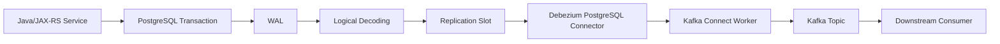
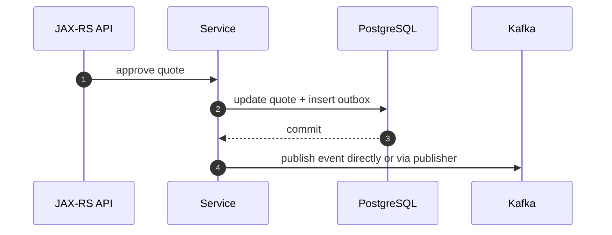
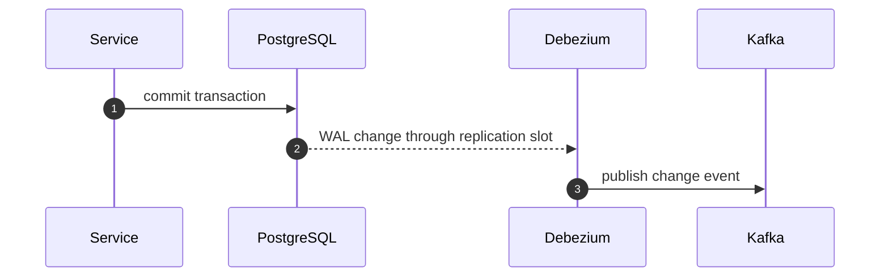
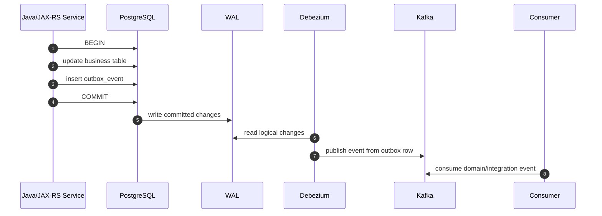

# Part 017 — CDC and Debezium

> Fokus: memahami bagaimana perubahan di PostgreSQL bisa dikirim ke Kafka melalui Change Data Capture, apa peran Debezium, di mana failure bisa terjadi, dan bagaimana menilai apakah CDC aman untuk sistem enterprise Java/JAX-RS.

CDC sering terlihat sederhana dari luar:

> “Kalau ada perubahan di database, Debezium kirim event ke Kafka.”

Model itu terlalu dangkal. Di production, CDC menyentuh transaction log database, replication slot, connector offset, schema change, snapshot, Kafka Connect, topic naming, serialization, DLQ, lag, dan recovery. Kalau salah dipahami, CDC bisa menyebabkan WAL membengkak, event duplicate, event hilang secara aplikasi, snapshot membanjiri downstream, schema berubah tanpa consumer siap, atau connector berhenti diam-diam.

Untuk engineer Java/JAX-RS, CDC penting karena sering menjadi jembatan antara aplikasi transaksional PostgreSQL dan event-driven architecture. Tetapi CDC bukan pengganti desain event yang baik. CDC hanya cara menangkap perubahan. Makna bisnis event tetap harus dirancang.

---

## 1. Konsep Inti

**Change Data Capture** adalah mekanisme untuk menangkap perubahan data dari database dan mengubahnya menjadi aliran event. Pada PostgreSQL, CDC biasanya membaca **WAL** melalui **logical decoding** menggunakan **replication slot**.

Debezium adalah platform CDC yang umum digunakan bersama Kafka Connect. Untuk PostgreSQL, Debezium membaca perubahan dari WAL, mempertahankan offset connector, lalu mem-publish record ke Kafka.

Alur sederhananya:



CDC memindahkan failure boundary:

- Aplikasi tidak harus publish Kafka langsung setelah commit.
- Database commit menjadi source of truth.
- Connector bertugas mengubah perubahan database menjadi record Kafka.
- Consumer tetap harus idempotent karena duplicate dan replay tetap mungkin.

CDC bukan magic exactly-once end-to-end. CDC hanya membuat database commit dan event emission lebih dekat secara temporal dan teknis.

---

## 2. Kenapa CDC Dibutuhkan

CDC biasanya dipilih untuk beberapa alasan:

| Kebutuhan | Kenapa CDC membantu |
|---|---|
| Menghindari dual-write | Aplikasi cukup commit DB; perubahan dipublish dari transaction log. |
| Integrasi legacy | Service lama tidak perlu dimodifikasi besar untuk publish Kafka. |
| Data replication | Perubahan table bisa dialirkan ke search, warehouse, cache, atau downstream system. |
| Outbox publishing | Outbox row yang ditulis aplikasi bisa dikirim ke Kafka oleh Debezium. |
| Audit/change stream | Perubahan database bisa dipantau tanpa polling berat. |

Tetapi CDC juga membawa risiko:

- Event bisa terlalu dekat dengan struktur table.
- Consumer bisa tergantung pada schema database internal.
- Schema migration bisa menjadi breaking event change.
- Snapshot awal bisa menghasilkan volume besar.
- Replication slot lag bisa memenuhi disk database.
- Connector failure bisa tertunda terdeteksi jika observability buruk.

Prinsip senior engineer:

> CDC adalah mekanisme transport dari database log ke Kafka, bukan otomatis menjadi domain event design.

---

## 3. CDC vs Application-Produced Event

Ada dua model besar.

### Application-produced event

Aplikasi Java/JAX-RS membuat event secara eksplisit.



Kelebihan:

- Event bisa dirancang sebagai business contract.
- Payload bisa stabil dan tidak expose schema table.
- Metadata bisa lengkap.

Kekurangan:

- Raw publish langsung berisiko dual-write jika tidak memakai outbox.
- Developer harus disiplin membuat event.
- Error handling producer harus matang.

### CDC-produced event

Connector membaca perubahan dari database.



Kelebihan:

- Event berasal dari committed database changes.
- Mengurangi dual-write di aplikasi.
- Cocok untuk outbox dan data replication.

Kekurangan:

- Raw table CDC bisa leak internal schema.
- Connector menjadi runtime dependency operational.
- Schema migration dan snapshot perlu dikelola.
- Lag connector bisa menunda event.

---

## 4. PostgreSQL WAL dan Logical Decoding

PostgreSQL menulis perubahan transaksi ke **Write-Ahead Log**. WAL digunakan untuk durability, crash recovery, replication, dan CDC.

Logical decoding memungkinkan perubahan di WAL diterjemahkan menjadi stream perubahan level logical seperti insert, update, delete.

Konsep penting:

| Konsep | Makna |
|---|---|
| WAL | Log perubahan database yang digunakan untuk recovery dan replication. |
| LSN | Log Sequence Number, posisi dalam WAL. |
| Logical decoding | Mekanisme membaca perubahan logical dari WAL. |
| Publication | Definisi table mana yang dipublikasikan untuk logical replication. |
| Replication slot | Posisi yang dipertahankan agar WAL tidak dibuang sebelum consumer membacanya. |
| Slot lag | Jarak antara WAL terbaru dan posisi slot yang sudah dikonsumsi. |

Failure penting:

> Jika replication slot tidak maju karena connector berhenti atau lambat, PostgreSQL harus mempertahankan WAL lama. Jika dibiarkan, disk database bisa penuh.

Ini adalah salah satu failure CDC paling berbahaya karena dampaknya bukan hanya Kafka, tetapi database utama.

---

## 5. Replication Slot

Replication slot adalah kontrak antara PostgreSQL dan consumer log seperti Debezium:

> “Jangan hapus WAL yang belum saya baca.”

Ini menjaga Debezium tidak kehilangan perubahan saat connector restart. Tetapi konsekuensinya, kalau Debezium mati lama, WAL tertahan.

### Slot sehat

```text
PostgreSQL WAL generated ---> Debezium reads ---> slot advances ---> old WAL removable
```

### Slot bermasalah

```text
PostgreSQL WAL generated ---> Debezium stopped ---> slot stuck ---> WAL retained ---> disk pressure
```

Checklist monitoring wajib:

- replication slot active atau tidak
- slot restart LSN
- confirmed flush LSN
- retained WAL size
- connector lag
- database disk usage
- connector task status

Di sistem mission-critical, replication slot lag harus menjadi alert platform-level, bukan hanya metric observability pasif.

---

## 6. Debezium PostgreSQL Connector

Debezium PostgreSQL connector biasanya berjalan sebagai Kafka Connect connector. Ia membaca logical replication stream dari PostgreSQL dan menulis record ke Kafka.

Komponen mental model:

| Komponen | Tanggung jawab |
|---|---|
| PostgreSQL | Source of truth dan WAL producer. |
| Replication slot | Menahan posisi CDC. |
| Publication | Menentukan table yang masuk CDC. |
| Debezium connector | Membaca WAL dan mengubah change menjadi Kafka record. |
| Kafka Connect worker | Runtime yang menjalankan connector task. |
| Kafka topic | Destination untuk change event. |
| Offset storage | Menyimpan posisi connector. |
| Schema history | Menyimpan history schema database yang dibutuhkan connector. |

Debezium bukan library Java application. Ia runtime integration yang harus dioperasikan seperti komponen production.

---

## 7. Connector Offset

Connector offset adalah posisi terakhir yang telah diproses connector. Untuk Debezium PostgreSQL, offset berkaitan dengan posisi WAL/LSN dan transaction state.

Offset penting karena:

- Menentukan dari mana connector lanjut setelah restart.
- Mencegah membaca ulang terlalu jauh.
- Membantu recovery setelah failure.
- Menentukan potensi duplicate setelah crash.

Namun offset bukan jaminan tidak ada duplicate. Jika connector sudah publish ke Kafka tetapi offset commit connector belum durable, setelah restart connector bisa mempublish ulang record yang sama.

Consumer downstream tetap wajib idempotent.

---

## 8. Snapshot

Saat connector pertama kali dijalankan, Debezium sering perlu mengambil snapshot table existing sebelum melanjutkan stream perubahan baru.

Snapshot menjawab:

> “Bagaimana downstream mendapatkan state awal, bukan hanya perubahan setelah connector aktif?”

Jenis snapshot secara konseptual:

| Jenis | Makna |
|---|---|
| Initial snapshot | Membaca isi table saat connector pertama kali mulai. |
| No snapshot | Hanya membaca perubahan setelah connector aktif. |
| Incremental snapshot | Snapshot dilakukan bertahap untuk table besar. |
| Ad hoc snapshot | Snapshot dipicu ulang untuk kebutuhan tertentu. |

Risiko snapshot:

- Volume record besar masuk Kafka.
- Consumer downstream menganggap snapshot sebagai business event baru.
- Topic retention tidak cukup untuk snapshot replay.
- Snapshot memperberat database.
- Snapshot menghasilkan ordering yang berbeda dari stream perubahan real-time.

Prinsip desain:

> Consumer harus bisa membedakan snapshot/read model bootstrap dari event bisnis real-time jika dampak bisnisnya berbeda.

---

## 9. CDC Event Shape

Raw Debezium change event biasanya membawa informasi seperti:

- state sebelum perubahan
- state setelah perubahan
- operation type
- source metadata
- timestamp
- transaction/log position

Secara konseptual:

```json
{
  "before": {
    "quote_id": "Q-1001",
    "status": "DRAFT"
  },
  "after": {
    "quote_id": "Q-1001",
    "status": "APPROVED"
  },
  "op": "u",
  "source": {
    "db": "quote_order",
    "schema": "public",
    "table": "quote",
    "lsn": "..."
  },
  "ts_ms": 1730000000000
}
```

Ini bukan otomatis event domain `QuoteApproved`. Ini adalah `quote table updated`.

Perbedaan penting:

| Raw CDC event | Domain event |
|---|---|
| Berbasis perubahan table | Berbasis makna bisnis |
| Mengikuti schema DB | Mengikuti contract event |
| Bisa mengandung noise field | Payload curated |
| Cocok untuk replication/projection | Cocok untuk integration contract |
| Consumer bisa coupling ke DB | Consumer coupling ke business contract |

Untuk CPQ/order management, raw table update jarang ideal sebagai public integration event karena status field bisa berubah karena banyak alasan. `OrderSubmitted`, `QuoteApproved`, atau `FulfillmentFailed` lebih jelas sebagai event bisnis.

---

## 10. Outbox Event Router

Debezium Outbox Event Router adalah pattern populer untuk menggabungkan transactional outbox dengan CDC.

Aplikasi menulis row ke table outbox:

```sql
INSERT INTO outbox_event (
    id,
    aggregate_type,
    aggregate_id,
    event_type,
    payload,
    headers,
    created_at
) VALUES (...);
```

Debezium membaca perubahan table outbox dari WAL, lalu transform mengubah row menjadi event Kafka yang lebih bersih.

Alur:



Kelebihan:

- Aplikasi tidak publish Kafka langsung.
- Event tetap didesain eksplisit sebagai contract.
- DB commit dan event source berada dalam transaction yang sama.
- Connector publish bisa retry dari WAL.

Risiko:

- Outbox table growth jika cleanup tidak ada.
- Debezium lag menunda event.
- Transform config salah bisa merusak routing topic/key/header.
- Schema outbox terlalu generik sehingga validasi event lemah.
- Duplicate tetap mungkin setelah connector restart.

---

## 11. CDC vs Polling Outbox

Outbox bisa dipublish dengan dua cara utama.

### Polling publisher

Aplikasi atau worker membaca table outbox secara periodik:

```sql
SELECT *
FROM outbox_event
WHERE status = 'PENDING'
ORDER BY created_at
FOR UPDATE SKIP LOCKED
LIMIT 100;
```

Kelebihan:

- Lebih mudah dipahami developer aplikasi.
- Tidak membutuhkan logical replication.
- Error handling bisa dikontrol di aplikasi.
- Cocok jika platform tidak menyediakan Debezium.

Kekurangan:

- Ada polling delay.
- Perlu locking, concurrency control, cleanup.
- Bisa membebani DB jika salah query/index.
- Perlu mekanisme mark published.

### CDC outbox

Debezium membaca insert outbox dari WAL.

Kelebihan:

- Tidak perlu polling query berulang.
- Lebih dekat dengan commit log database.
- Cocok untuk volume tinggi jika dioperasikan benar.
- Tidak perlu status `PUBLISHED` di beberapa desain.

Kekurangan:

- Perlu Kafka Connect/Debezium operational maturity.
- Replication slot lag bisa berdampak ke DB disk.
- Config connector/transform menjadi critical artifact.
- Debugging melibatkan DB + Kafka Connect + Kafka.

Tidak ada pilihan universal. Pilih berdasarkan operational maturity, volume, latency, governance, dan ownership.

---

## 12. Delete Event dan Tombstone

Dalam CDC, delete row biasanya menghasilkan event delete. Di Kafka compacted topic, tombstone adalah record dengan key tertentu dan value `null` yang memberi sinyal bahwa key tersebut bisa dihapus saat compaction.

Perlu dibedakan:

| Istilah | Makna |
|---|---|
| Database delete | Row dihapus dari table source. |
| CDC delete event | Event yang menyatakan row dihapus. |
| Kafka tombstone | Record value null untuk key tertentu di compacted topic. |
| Business cancellation | Event domain yang berarti bisnis dibatalkan, belum tentu row dihapus. |

Kesalahan umum:

- Menganggap delete row berarti bisnis dibatalkan.
- Mengabaikan tombstone sehingga consumer gagal deserialize `null` value.
- Memakai compaction tanpa key stabil.
- Menghapus row source padahal downstream butuh audit event.

Untuk CPQ/order management, banyak “delete” seharusnya soft delete atau state transition event, bukan physical delete yang kehilangan konteks bisnis.

---

## 13. Schema Change Event

CDC sangat sensitif terhadap schema change database.

Contoh perubahan yang harus direview:

- rename column
- remove column
- change data type
- add NOT NULL column tanpa default
- change enum/check constraint semantics
- split table
- merge table
- change primary key
- change timezone handling

Raw CDC consumer bisa rusak jika bergantung pada column lama. Outbox-based CDC lebih stabil karena event schema dipisahkan dari business table schema.

Prinsip:

> Database migration bukan hanya database concern jika table tersebut masuk CDC.

Checklist migration harus mencakup:

- Apakah table masuk publication CDC?
- Apakah downstream consumer memakai field yang berubah?
- Apakah Schema Registry compatibility akan gagal?
- Apakah snapshot ulang diperlukan?
- Apakah connector perlu restart?
- Apakah schema history topic aman?

---

## 14. Transaction Metadata

Debezium dapat membawa metadata transaction/log position yang berguna untuk debugging dan ordering reasoning.

Metadata yang berguna:

| Metadata | Kegunaan |
|---|---|
| source database | Mengetahui asal perubahan. |
| schema/table | Mengetahui table source. |
| LSN | Posisi WAL untuk debugging. |
| transaction id | Menghubungkan beberapa perubahan dalam satu transaksi. |
| event timestamp | Menilai lag source-to-Kafka. |
| connector name | Mengetahui pipeline source. |

Tetapi jangan expose semua metadata internal ke public event contract tanpa alasan. Metadata internal boleh berguna untuk observability, sedangkan contract event harus stabil dan bermakna bagi consumer.

---

## 15. Ordering di CDC

CDC mempertahankan urutan commit dari database log dalam batas tertentu, tetapi ketika masuk Kafka, ordering dipengaruhi oleh:

- topic routing
- partition key
- connector task parallelism
- transform
- Kafka partition count
- downstream consumer group
- replay/retry

Jika outbox event untuk aggregate yang sama harus ordered, gunakan aggregate ID sebagai Kafka key. Jangan hanya mengandalkan `created_at` atau sequence DB jika event dikirim ke partition berbeda.

Ordering harus dijawab eksplisit:

- Ordered per apa? Quote? Order? Tenant? Customer?
- Apakah semua event aggregate yang sama masuk partition yang sama?
- Apakah connector routing mempertahankan key?
- Apakah consumer memproses partition secara sequential?
- Apa yang terjadi jika event lama datang setelah event baru?

---

## 16. CDC Lag

CDC lag adalah jarak antara perubahan database committed dan event tersedia/terproses di Kafka/downstream.

Jenis lag:

| Lag | Definisi |
|---|---|
| Source lag | Debezium tertinggal membaca WAL. |
| Connector processing lag | Connector membaca tapi lambat transform/publish. |
| Kafka publish lag | Record tertahan karena broker/network/error. |
| Consumer lag | Downstream lambat consume topic hasil CDC. |
| End-to-end lag | Dari DB commit sampai downstream side effect selesai. |

Metric yang perlu dipantau:

- replication slot lag
- connector task status
- source-to-Kafka latency
- Kafka topic throughput
- connector error count
- DLQ connector count
- database disk usage
- consumer lag downstream

Lag bukan hanya performance issue. Dalam order management, lag bisa berarti downstream fulfillment, billing, notification, atau audit terlambat.

---

## 17. Connector Failure Mode

Failure umum Debezium/CDC:

| Failure | Dampak | Deteksi |
|---|---|---|
| Connector stopped | Event tidak mengalir | Connector status, no throughput |
| Replication slot lag | WAL retained, disk DB naik | Slot lag, disk alert |
| Schema incompatible | Connector error atau consumer error | Connector log, DLQ, schema registry error |
| Snapshot stuck | Bootstrap tidak selesai | Snapshot metric/log |
| Kafka broker unavailable | Connector gagal publish | Connect task error, producer error |
| Auth failure | Connector tidak bisa DB/Kafka | Task failed, auth log |
| Publication missing table | Perubahan table tidak tertangkap | No event for expected changes |
| Transform misconfigured | Topic/key/header salah | Unexpected topic/key, consumer failure |
| Tombstone mishandled | Consumer deserialize fail | Deserialization error |
| Offset corruption/reset salah | Duplicate/missing stream | Offset audit, replay symptoms |

Debugging CDC harus dimulai dari pipeline boundary:

```text
DB commit -> WAL -> replication slot -> Debezium task -> Kafka Connect worker -> Kafka topic -> consumer
```

Jangan langsung menyalahkan consumer jika event tidak muncul; validasi setiap boundary.

---

## 18. CDC dan Java/JAX-RS Service Boundary

Di aplikasi Java/JAX-RS, CDC mengubah tanggung jawab producer.

Tanpa CDC/outbox, service mungkin melakukan:

```text
HTTP request -> service transaction -> DB update -> Kafka producer send
```

Dengan CDC outbox:

```text
HTTP request -> service transaction -> DB update + outbox insert -> commit -> Debezium publishes event
```

Implikasi untuk Java service:

- Service harus menulis outbox row dalam transaction yang sama dengan business change.
- Service tidak boleh menganggap Kafka publish selesai saat HTTP response diberikan.
- Event metadata harus disiapkan sebelum insert outbox.
- Serialization event bisa dilakukan sebelum commit untuk menghindari payload invalid masuk outbox.
- Response API harus sesuai eventual consistency.

Contoh boundary yang lebih aman:

```java
@Transactional
public ApproveQuoteResult approveQuote(ApproveQuoteCommand command) {
    Quote quote = quoteRepository.findForUpdate(command.quoteId());
    quote.approve(command.actorId());

    QuoteApprovedEvent event = QuoteApprovedEvent.from(quote, command);
    eventValidator.validate(event);

    quoteRepository.update(quote);
    outboxRepository.insert(OutboxEvent.from(event));

    return new ApproveQuoteResult(quote.id(), "ACCEPTED_FOR_PUBLICATION");
}
```

Yang penting bukan sintaks Java-nya, tetapi invariant:

> Business state dan outbox event commit bersama, Kafka publication terjadi setelahnya melalui mekanisme reliable.

---

## 19. CDC dan PostgreSQL/MyBatis/JDBC

Dalam stack PostgreSQL + MyBatis/JDBC, perhatian utama ada pada transaction boundary.

Hal yang harus benar:

- Mapper update business table dan mapper insert outbox memakai transaction yang sama.
- Tidak ada auto-commit tersembunyi antara business update dan outbox insert.
- Exception serialization/validation terjadi sebelum commit.
- Outbox row punya primary key dan event ID stabil.
- Payload event tidak bergantung pada lazy state yang berubah setelah commit.
- Migration outbox table tidak mematahkan connector.
- Index outbox cukup untuk query cleanup/diagnosis.

Anti-pattern:

```java
quoteMapper.updateStatus(id, APPROVED);
sqlSession.commit();

outboxMapper.insert(event);
sqlSession.commit();
```

Jika process crash setelah commit pertama, business state berubah tetapi event tidak ada. Ini dual-write dengan bentuk database-to-database.

Pattern yang lebih benar:

```java
try {
    sqlSession.getConnection().setAutoCommit(false);
    quoteMapper.updateStatus(id, APPROVED);
    outboxMapper.insert(event);
    sqlSession.commit();
} catch (Exception e) {
    sqlSession.rollback();
    throw e;
}
```

Di framework enterprise, transaction manager harus menangani ini, tetapi PR review tetap harus memastikan mapper dipanggil dalam boundary yang sama.

---

## 20. CDC dan Schema Registry

Debezium bisa menghasilkan schema untuk record CDC. Jika menggunakan Schema Registry, perubahan table bisa menghasilkan perubahan schema event.

Pertanyaan review:

- Apakah topic CDC memakai Avro/JSON Schema/Protobuf?
- Apakah subject naming strategy stabil?
- Apakah compatibility mode cocok?
- Apakah schema raw table boleh menjadi public contract?
- Apakah outbox payload punya schema sendiri?
- Apakah schema history topic tersedia dan direplikasi?
- Apa yang terjadi saat column dihapus/rename?

Untuk integration event enterprise, lebih aman memisahkan:

```text
business table schema != event contract schema
```

Outbox Event Router bisa membantu menjaga event payload sebagai contract eksplisit.

---

## 21. CDC dan Kafka Connect DLQ

Kafka Connect dapat dikonfigurasi untuk error tolerance dan DLQ. Tetapi DLQ connector tidak boleh menjadi tempat sampah tanpa ownership.

DLQ connector harus menjawab:

- Record apa yang gagal?
- Gagal di converter, transform, serialization, atau sink/source?
- Apakah record bisa direplay?
- Siapa owner DLQ?
- Apakah DLQ berisi PII?
- Apakah DLQ punya retention dan alert?
- Apakah connector lanjut setelah gagal atau berhenti?

Untuk source connector seperti Debezium, beberapa error lebih aman menghentikan connector daripada skip record secara diam-diam. Skip pada CDC bisa berarti kehilangan event perubahan database.

Prinsip:

> Error tolerance tinggi tanpa alert dan runbook sama dengan data loss yang ditunda.

---

## 22. CDC untuk Projection dan Read Model

CDC sering dipakai untuk membangun read model:

```text
PostgreSQL table changes -> Kafka -> projection consumer -> search/read DB/cache
```

Cocok untuk:

- search index update
- reporting view
- cache invalidation
- downstream read model
- data warehouse ingestion

Tetapi ada risiko:

- Projection mengikuti table schema terlalu dekat.
- Perubahan internal DB memecah read model.
- Event delete/tombstone tidak ditangani.
- Snapshot dianggap real-time update.
- Consumer tidak idempotent terhadap duplicate CDC.
- Projection tidak punya reconciliation.

Projection dari CDC harus punya:

- deduplication
- replay plan
- rebuild plan
- lag dashboard
- schema change compatibility
- validation job

---

## 23. CDC dalam CPQ/Order Management

Dalam sistem CPQ/order management, CDC dapat muncul di beberapa tempat:

| Use case | CDC cocok? | Catatan |
|---|---:|---|
| Outbox event publishing | Ya | Jika event payload sudah curated. |
| Search/read model update | Ya | Consumer harus idempotent dan rebuildable. |
| Audit replication | Mungkin | Perhatikan retention dan privacy. |
| Public integration event dari raw table | Hati-hati | Raw table update jarang cukup sebagai business contract. |
| Order workflow command | Biasanya tidak | Command butuh intent eksplisit, bukan row change. |
| State transition event | Ya jika outbox | Event harus menyatakan transition, bukan sekadar status column changed. |

Contoh raw CDC yang buruk sebagai integration contract:

```text
quote table updated: status APPROVED
```

Consumer tidak tahu:

- siapa yang approve?
- approval reason apa?
- apakah ini approval pertama atau correction?
- command apa yang menyebabkan perubahan?
- apakah downstream harus act atau hanya observe?

Event yang lebih baik:

```text
QuoteApproved
QuoteApprovalRevoked
QuoteSubmittedForApproval
QuoteApprovalTimedOut
```

Makna bisnis harus eksplisit.

---

## 24. Operational Ownership

CDC pipeline menyentuh banyak owner:

| Area | Kemungkinan owner |
|---|---|
| Java service/outbox row | Backend team |
| PostgreSQL config/publication/slot | DBA/platform team |
| Debezium connector config | Platform/integration/backend team |
| Kafka Connect runtime | Platform/SRE |
| Kafka topic/schema | Platform + owning domain team |
| Consumer processing | Downstream backend/data team |
| Monitoring/runbook | SRE + owning team |

Failure terjadi di boundary antar owner. Karena itu perlu ownership eksplisit:

- Siapa yang restart connector?
- Siapa yang approve schema migration pada CDC table?
- Siapa yang monitor replication slot lag?
- Siapa yang triage DLQ connector?
- Siapa yang melakukan replay/backfill?
- Siapa yang bertanggung jawab jika consumer menerima duplicate?

Tanpa ownership, CDC menjadi “pipa ajaib” yang hanya diperhatikan saat incident.

---

## 25. Production Debugging Flow

Saat event dari DB tidak muncul di Kafka:

```text
1. Apakah business transaction benar-benar commit?
2. Apakah row/table masuk publication CDC?
3. Apakah replication slot aktif?
4. Apakah WAL retained/slot lag naik?
5. Apakah Debezium connector task RUNNING?
6. Apakah connector log menunjukkan error?
7. Apakah Kafka Connect worker sehat?
8. Apakah topic destination benar?
9. Apakah key/header/routing transform benar?
10. Apakah Kafka authorization berhasil?
11. Apakah record masuk DLQ?
12. Apakah consumer group membaca topic yang benar?
```

Saat event duplicate muncul:

```text
1. Apakah connector restart setelah publish sebelum offset commit?
2. Apakah outbox row dipublish ulang?
3. Apakah snapshot ulang dijalankan?
4. Apakah offset reset terjadi?
5. Apakah topic direplay?
6. Apakah consumer idempotency bekerja?
```

Saat database disk naik:

```text
1. Cek WAL directory/disk usage.
2. Cek replication slot lag.
3. Cek connector status.
4. Cek network/auth ke Kafka.
5. Cek connector throughput.
6. Cek apakah slot orphaned.
7. Eskalasi ke DBA/platform sebelum disk penuh.
```

---

## 26. PR Review Checklist

Gunakan checklist ini saat melihat perubahan yang menyentuh CDC, outbox, Debezium, atau table yang masuk publication.

### Database change

- Apakah table ini masuk CDC publication?
- Apakah migration mengubah column yang dipakai consumer?
- Apakah rename/drop column aman untuk schema compatibility?
- Apakah primary key berubah?
- Apakah delete semantics jelas?
- Apakah timestamp/timezone field konsisten?

### Outbox change

- Apakah outbox insert dalam transaction yang sama dengan business write?
- Apakah event ID stabil dan unik?
- Apakah aggregate ID menjadi key Kafka?
- Apakah payload divalidasi sebelum commit?
- Apakah metadata lengkap?
- Apakah event version jelas?

### Connector change

- Apakah connector config versioned?
- Apakah topic routing benar?
- Apakah key extraction benar?
- Apakah transform tidak menghapus metadata penting?
- Apakah error handling/DLQ jelas?
- Apakah schema history aman?
- Apakah change sudah diuji di lower environment?

### Operational readiness

- Apakah replication slot lag dimonitor?
- Apakah connector status ada alert?
- Apakah DLQ ada dashboard?
- Apakah runbook tersedia?
- Apakah replay/backfill procedure jelas?
- Apakah owner pipeline jelas?

---

## 27. Common Anti-Patterns

### Raw CDC sebagai public event tanpa governance

Consumer akhirnya bergantung pada table internal. Setiap migration menjadi breaking change tersembunyi.

### Tidak memonitor replication slot lag

Connector mati, WAL tertahan, disk database penuh. Ini bisa berubah dari integration issue menjadi database outage.

### Snapshot tanpa downstream readiness

Snapshot awal membanjiri topic dan consumer, lalu dianggap event bisnis baru.

### Tidak ada idempotency consumer

Connector restart atau replay menyebabkan duplicate side effect.

### Connector config manual

Perubahan tidak terekam di Git, sulit rollback, dan drift antar environment.

### Delete/tombstone diabaikan

Consumer gagal deserialize `null`, read model tidak menghapus data, atau audit kehilangan konteks.

### Outbox row tidak divalidasi

Payload invalid sudah commit ke DB; connector terus gagal atau DLQ penuh.

---

## 28. Internal Verification Checklist

Gunakan daftar ini saat masuk ke codebase/platform internal.

### PostgreSQL

- Apakah logical replication diaktifkan?
- Publication apa saja yang ada?
- Table apa saja yang masuk CDC?
- Replication slot apa saja yang aktif?
- Bagaimana slot lag dimonitor?
- Siapa owner database-level CDC config?

### Debezium

- Connector apa saja yang berjalan?
- Connector config disimpan di mana?
- Snapshot mode apa yang digunakan?
- Outbox Event Router digunakan atau tidak?
- Transform apa saja yang aktif?
- Bagaimana connector offset dikelola?
- Bagaimana schema history topic dikelola?

### Kafka Connect

- Worker berjalan di mana: Kubernetes, VM, managed service?
- Distributed mode atau standalone?
- Status task dimonitor di dashboard apa?
- Bagaimana restart/scale connector dilakukan?
- Apakah error tolerance dan DLQ dikonfigurasi?

### Kafka topic/schema

- Topic hasil CDC apa saja?
- Naming convention topic CDC/outbox apa?
- Apakah key topic memakai aggregate ID?
- Apakah Schema Registry digunakan?
- Compatibility mode apa?
- Apakah tombstone/delete event ditangani?

### Java/JAX-RS service

- Apakah service menulis outbox row?
- Apakah outbox insert satu transaction dengan business write?
- Apakah payload divalidasi sebelum commit?
- Apakah metadata event lengkap?
- Apakah endpoint HTTP menyadari asynchronous publication?

### Operations

- Apakah ada runbook connector failure?
- Apakah ada runbook replication slot lag?
- Apakah ada replay/backfill procedure?
- Apakah ada incident sebelumnya terkait CDC?
- Siapa owner end-to-end pipeline?

---

## 29. Ringkasan Mental Model

CDC dengan Debezium adalah mekanisme kuat untuk mengalirkan perubahan PostgreSQL ke Kafka, terutama jika digabung dengan transactional outbox. Tetapi CDC tidak menghapus kebutuhan desain event, schema governance, idempotency, observability, dan runbook.

Model yang benar:

```text
Database commit is reliable.
WAL captures committed changes.
Debezium transports changes.
Kafka distributes records.
Consumers still need idempotency.
Event contracts still need governance.
Operations still need monitoring and runbooks.
```

Jika ada satu kalimat yang perlu diingat:

> CDC membuat event publication lebih reliable terhadap database commit, tetapi tidak otomatis membuat event-driven system benar secara bisnis.

---

## 30. Latihan Review

Gunakan skenario berikut untuk melatih reasoning.

### Skenario 1

Service `quote-service` update status quote menjadi `APPROVED`. Tidak ada producer Kafka di codebase. Beberapa menit kemudian topic `quote.approved` menerima event.

Pertanyaan:

- Apakah ini raw CDC atau outbox CDC?
- Dari table mana event berasal?
- Apakah event ID berasal dari outbox atau connector?
- Apa partition key-nya?
- Apa yang terjadi jika Debezium restart?

### Skenario 2

Database disk hampir penuh. Kafka consumer downstream tidak menunjukkan error. Dashboard Kafka terlihat normal.

Pertanyaan:

- Apakah replication slot lag naik?
- Apakah Debezium connector berhenti?
- Apakah WAL tertahan?
- Siapa owner database alert ini?
- Apakah aman drop replication slot?

Catatan: drop slot tanpa memahami konsekuensi bisa menyebabkan connector kehilangan posisi dan membutuhkan snapshot/recovery.

### Skenario 3

Schema migration menghapus column `approval_reason` dari table `quote_approval`. Setelah deploy, connector gagal.

Pertanyaan:

- Apakah table masuk CDC?
- Apakah downstream schema mengharapkan field itu?
- Apakah compatibility mode mencegah perubahan?
- Apakah outbox event schema seharusnya terpisah dari table schema?
- Bagaimana rollback atau forward-fix dilakukan?

---

## 31. Apa yang Harus Dikuasai Setelah Part Ini

Setelah menyelesaikan part ini, Anda harus mampu:

- Menjelaskan CDC, WAL, logical decoding, publication, replication slot, dan Debezium secara runtut.
- Membedakan raw table CDC dari domain/integration event.
- Menjelaskan kenapa Outbox Event Router sering lebih aman daripada raw table event untuk contract publik.
- Mengidentifikasi risiko snapshot, tombstone, schema change, connector lag, dan slot lag.
- Membaca CDC pipeline sebagai end-to-end runtime: PostgreSQL → Debezium → Kafka Connect → Kafka → consumer.
- Mereview PR database migration yang berdampak ke CDC.
- Menyusun pertanyaan internal ke platform/SRE/backend/data team tanpa mengarang detail arsitektur CSG.
