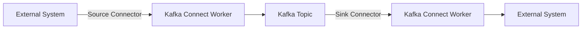
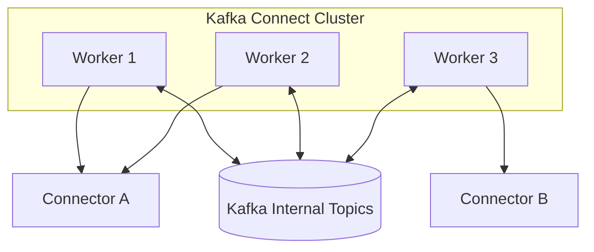

# Part 018 — Kafka Connect

> Fokus: memahami Kafka Connect sebagai runtime integrasi production, bukan sekadar “tool untuk connector”. Part ini membahas source connector, sink connector, worker, task, converter, SMT, offset/config/status topic, DLQ, scaling, monitoring, upgrade, dan failure mode.

Kafka Connect sering dipakai untuk menghubungkan Kafka dengan sistem eksternal: database, object storage, search engine, data warehouse, SaaS, filesystem, dan stream processing platform. Dalam arsitektur enterprise, Kafka Connect biasanya menjadi lapisan integrasi antara event backbone dan sistem lain.

Kesalahan umum adalah melihat Kafka Connect sebagai komponen platform yang “bukan urusan backend engineer”. Dalam kenyataannya, connector config, converter, transform, schema, DLQ, offset, dan sink semantics bisa langsung memengaruhi correctness aplikasi Java/JAX-RS, PostgreSQL, read model, audit, dan downstream order processing.

Seorang senior backend engineer tidak harus menjadi admin Kafka Connect penuh, tetapi harus bisa membaca mental model-nya, memahami failure mode-nya, dan mengajukan pertanyaan yang benar saat PR/ADR/incident menyentuh connector.

---

## 1. Konsep Inti

Kafka Connect adalah framework untuk menjalankan connector yang memindahkan data antara Kafka dan sistem eksternal.

Ada dua arah besar:

| Jenis connector | Arah data | Contoh |
|---|---|---|
| Source connector | External system → Kafka | PostgreSQL CDC, file source, SaaS event source |
| Sink connector | Kafka → External system | Elasticsearch/OpenSearch, JDBC sink, S3/object storage, data warehouse |

Mental model sederhana:



Kafka Connect menyediakan runtime umum:

- menjalankan connector
- membagi pekerjaan menjadi task
- menyimpan config
- menyimpan offset
- melaporkan status
- memakai converter untuk serialization
- memakai transform untuk memodifikasi record
- menangani error, retry, dan DLQ

Connector adalah plugin. Kafka Connect adalah runtime.

---

## 2. Kenapa Kafka Connect Ada

Tanpa Kafka Connect, setiap tim akan membuat integrasi sendiri:

```text
custom app reads DB -> custom producer -> Kafka
custom app reads Kafka -> custom writer -> search index
custom retry logic
custom offset tracking
custom monitoring
custom deployment
```

Kafka Connect mencoba menstandardisasi pola integrasi tersebut.

Kelebihan:

- Tidak perlu menulis producer/consumer custom untuk integrasi umum.
- Offset connector dikelola runtime.
- Scaling bisa dilakukan dengan task/worker.
- Config bisa dipusatkan.
- Banyak connector tersedia.
- Error handling dan DLQ punya mekanisme standar.

Kekurangan:

- Connector bisa menjadi black box jika tidak dipahami.
- Config salah bisa menyebabkan data loss atau duplicate.
- SMT bisa mengubah contract secara tersembunyi.
- Sink connector bisa tidak idempotent.
- Operasi connector membutuhkan ownership jelas.

Prinsip senior engineer:

> Kafka Connect mengurangi kode integrasi, tetapi tidak menghapus tanggung jawab correctness integrasi.

---

## 3. Worker

Worker adalah proses runtime Kafka Connect. Worker menjalankan connector dan task.

Ada dua mode:

| Mode | Kegunaan |
|---|---|
| Standalone mode | Local/dev/sederhana; offset/config biasanya lokal. |
| Distributed mode | Production; banyak worker dalam cluster Connect. |

Di production, distributed mode lebih umum karena mendukung:

- fault tolerance
- task rebalance
- horizontal scaling
- centralized config
- REST API management
- internal topics untuk config/offset/status

Mental model distributed worker:



Worker bukan broker Kafka. Worker adalah client application yang memakai Kafka untuk koordinasi dan penyimpanan metadata internal.

---

## 4. Connector dan Task

Connector adalah definisi logical integrasi. Task adalah unit kerja yang benar-benar melakukan copy data.

Contoh:

```text
Connector: postgres-cdc-quote-order
Task 0: read partition/log stream/table subset
Task 1: read another subset, if connector supports parallelism
```

Untuk sink connector:

```text
Connector: order-events-to-search-index
Task 0: consume partitions 0-3
Task 1: consume partitions 4-7
```

Tidak semua connector bisa parallel secara sama. Source CDC dari satu PostgreSQL logical replication slot misalnya punya batasan berbeda dari sink connector yang membaca banyak Kafka partition.

Pertanyaan review:

- Connector mendukung berapa task?
- Apa arti task parallelism untuk connector ini?
- Apakah task scaling mempertahankan ordering?
- Apakah sink destination idempotent jika task retry?
- Apakah task failure menghentikan connector atau hanya satu subset?

---

## 5. Source Connector

Source connector membaca data dari sistem eksternal dan menulis ke Kafka.

Contoh source:

- Debezium PostgreSQL connector
- JDBC source connector
- file source connector
- cloud storage source connector
- SaaS source connector

Source connector harus menjawab:

| Pertanyaan | Kenapa penting |
|---|---|
| Dari mana posisi baca disimpan? | Untuk recovery setelah restart. |
| Apakah source mendukung incremental read? | Untuk menghindari full scan berulang. |
| Apakah perubahan bisa hilang? | Correctness source. |
| Apakah duplicate bisa terjadi? | Consumer idempotency. |
| Bagaimana schema berubah? | Contract safety. |
| Bagaimana snapshot/bootstrap dilakukan? | Volume dan ordering. |

Source connector tidak selalu setara. Debezium membaca transaction log; JDBC source polling query ke table. Semantics-nya berbeda.

### Debezium source

```text
PostgreSQL WAL -> Debezium -> Kafka
```

Biasanya lebih reliable untuk perubahan committed, tetapi butuh replication slot dan monitoring WAL.

### JDBC polling source

```text
SELECT rows WHERE updated_at > last_seen -> Kafka
```

Lebih sederhana, tetapi rawan:

- missed update jika timestamp resolution buruk
- duplicate jika query overlap
- load database
- sulit menangkap delete
- ordering terbatas

Jangan menyamakan semua source connector.

---

## 6. Sink Connector

Sink connector membaca Kafka topic dan menulis ke sistem eksternal.

Contoh sink:

- JDBC sink ke PostgreSQL/Oracle
- Elasticsearch/OpenSearch sink
- S3/object storage sink
- data warehouse sink
- cache/search index sink

Sink connector harus menjawab:

| Pertanyaan | Kenapa penting |
|---|---|
| Apakah write idempotent? | Retry bisa duplicate. |
| Apakah sink mendukung upsert? | Penting untuk compacted/update stream. |
| Apa key yang dipakai? | Menentukan dedup/update behavior. |
| Bagaimana delete/tombstone ditangani? | Read model cleanup. |
| Bagaimana partial failure ditangani? | Data consistency. |
| Apakah ordering diperlukan? | Task parallelism bisa memengaruhi. |
| Bagaimana backpressure dari sink? | Consumer lag dan retry storm. |

Sink connector sering terlihat aman karena “tinggal konfigurasi”. Tetapi sink adalah consumer dengan side effect. Semua prinsip consumer correctness tetap berlaku.

---

## 7. Converter

Converter mengubah Kafka Connect internal data representation ke format Kafka record, atau sebaliknya.

Converter umum:

- JSON converter
- Avro converter
- Protobuf converter
- JSON Schema converter
- String/ByteArray converter

Converter memengaruhi:

- schema registration
- payload format
- compatibility
- deserialization behavior
- error handling
- DLQ payload

Kesalahan converter bisa menghasilkan:

- record tidak bisa dibaca consumer
- schema registry error
- field type berubah
- schema embedded di payload tanpa sengaja
- tombstone gagal diproses

Pertanyaan review:

- Converter key dan value apa yang dipakai?
- Apakah converter memakai Schema Registry?
- Apakah schemas enabled atau disabled untuk JSON?
- Apakah tombstone/null value didukung?
- Apakah format sama di semua environment?

---

## 8. Single Message Transform / SMT

SMT adalah transform ringan yang diterapkan pada setiap record di Kafka Connect.

SMT bisa digunakan untuk:

- rename topic
- route berdasarkan field
- extract field as key
- unwrap Debezium envelope
- add headers
- mask field
- drop field
- change timestamp
- flatten struct

SMT sangat berguna, tetapi berbahaya jika menjadi tempat logic bisnis tersembunyi.

Contoh risiko:

| SMT usage | Risiko |
|---|---|
| Extract field as key | Key salah bisa merusak ordering. |
| Route topic by field | Event masuk topic salah. |
| Drop field | Consumer kehilangan metadata. |
| Mask field | Audit/debugging kehilangan informasi jika tidak dirancang. |
| Unwrap Debezium | Metadata before/source/op hilang jika tidak disimpan. |
| Rename field | Contract berubah tanpa schema review. |

Prinsip:

> SMT boleh untuk transform teknis ringan, bukan tempat utama business semantics.

Jika transform mulai berisi keputusan domain kompleks, pertimbangkan aplikasi stream processing atau producer/outbox yang lebih eksplisit.

---

## 9. Internal Topics Kafka Connect

Dalam distributed mode, Kafka Connect menggunakan beberapa internal topic.

| Topic | Fungsi |
|---|---|
| Config topic | Menyimpan connector configuration. |
| Offset topic | Menyimpan offset connector. |
| Status topic | Menyimpan status connector/task. |

Topic ini critical. Jika salah retention/compaction/replication, Connect cluster bisa kehilangan state.

Karakteristik umum yang diharapkan:

- replication factor cukup
- cleanup policy sesuai, biasanya compact untuk state topic
- ACL hanya untuk Connect cluster
- tidak dihapus manual
- dimonitor
- dikelola sebagai platform artifact

Jika offset topic hilang, connector bisa membaca ulang data atau kehilangan posisi. Jika config topic hilang, connector definitions bisa hilang. Jika status topic bermasalah, observability task terganggu.

---

## 10. Offset Storage

Offset connector berbeda dari offset consumer aplikasi biasa, walaupun sama-sama disimpan terkait Kafka.

Untuk source connector, offset menunjukkan posisi di external system:

- WAL LSN untuk CDC
- timestamp/incrementing ID untuk JDBC source
- file position untuk file source
- API cursor untuk SaaS source

Untuk sink connector, offset biasanya berkaitan dengan Kafka topic partition offset yang sudah diproses.

Failure reasoning:

```text
source read -> transform -> produce to Kafka -> offset commit
```

Jika source connector crash setelah produce tetapi sebelum offset commit, record bisa diproduce ulang.

```text
consume Kafka -> write sink -> offset commit
```

Jika sink connector crash setelah write sink tetapi sebelum offset commit, sink write bisa diulang.

Artinya:

> Kafka Connect juga butuh idempotency, terutama di sink destination dan downstream consumer.

---

## 11. Config Storage dan Config Drift

Connector config menentukan behavior runtime. Contoh:

- source database connection
- topic naming
- tables included/excluded
- transforms
- converters
- error tolerance
- DLQ topic
- task max
- auth/security
- snapshot mode

Jika config diubah manual melalui REST API tanpa Git, risiko drift tinggi.

Masalah umum:

- dev/staging/prod config berbeda tanpa sengaja
- connector restart dengan config lama
- rollback tidak jelas
- perubahan topic routing tidak terekam
- ACL/secret berubah manual
- DLQ mati di satu environment

Practice yang lebih baik:

```text
connector config as code -> CI validation -> approval -> deploy/reconcile -> drift detection
```

Connector config harus diperlakukan seperti deployment manifest atau database migration: reviewable, versioned, auditable.

---

## 12. Status Storage dan Health

Kafka Connect membedakan status connector dan task.

Status yang perlu dipahami:

| Status | Makna |
|---|---|
| RUNNING | Connector/task aktif. |
| PAUSED | Connector dihentikan sementara. |
| FAILED | Connector/task gagal. |
| UNASSIGNED | Task belum ditempatkan ke worker. |
| RESTARTING | Sedang restart, bergantung runtime/tooling. |

Kondisi berbahaya:

- Connector RUNNING tetapi salah satu task FAILED.
- Connector RUNNING tetapi throughput nol padahal source aktif.
- Task sering restart tetapi alert tidak menyala.
- Connector PAUSED lama tanpa ticket/owner.
- Status topic tidak sehat sehingga UI/API misleading.

Health bukan hanya status `RUNNING`. Health juga mencakup throughput, lag, error rate, DLQ, dan freshness data.

---

## 13. Error Handling

Kafka Connect error bisa terjadi di banyak titik:

```text
source read -> converter -> transform -> producer to Kafka
Kafka consume -> converter -> transform -> sink write
```

Jenis error:

| Error | Contoh |
|---|---|
| Source error | DB auth gagal, API timeout, file corrupt |
| Converter error | Deserialization/schema mismatch |
| Transform error | Field missing untuk SMT |
| Producer error | Kafka unavailable, authorization failed |
| Sink error | DB constraint violation, search cluster unavailable |
| Serialization error | Payload tidak sesuai schema |
| Tombstone handling error | Sink tidak siap menerima null value |

Konfigurasi error handling harus eksplisit:

- stop connector on error
- tolerate error and continue
- write failed record to DLQ
- include error context/header
- retry with backoff
- alert on threshold

Error tolerance tidak boleh dipilih hanya agar connector “tetap jalan”. Untuk data critical, berhenti lebih aman daripada silently skip.

---

## 14. DLQ di Kafka Connect

DLQ di Kafka Connect menyimpan record yang gagal diproses, tergantung konfigurasi connector dan error tolerance.

DLQ yang baik harus menyimpan konteks cukup:

- original topic/partition/offset
- connector name
- task ID
- exception class/message
- timestamp failure
- key/value original jika aman
- headers original jika aman
- stage failure: converter/transform/sink

Risiko DLQ:

- DLQ berisi PII atau payload sensitif.
- DLQ tidak dimonitor sehingga error tersembunyi.
- DLQ retention terlalu pendek untuk investigasi.
- Tidak ada replay tool.
- Replay dari DLQ bisa menghasilkan duplicate.
- DLQ schema tidak jelas.

Prinsip:

> DLQ bukan solusi failure. DLQ adalah tempat parkir sementara untuk investigasi dan recovery terkontrol.

---

## 15. Retry dan Backoff

Connector bisa menghadapi transient failure seperti network timeout, sink overload, broker unavailable, atau database connection issue.

Retry harus punya:

- retry count atau bounded retry policy
- backoff
- alert jika retry terus terjadi
- perbedaan transient vs permanent failure
- DLQ atau stop decision
- runbook manual recovery

Failure yang sebaiknya tidak di-retry selamanya:

- schema incompatible
- authorization denied
- missing required field
- sink unique constraint karena contract salah
- invalid payload

Failure yang bisa di-retry:

- temporary network timeout
- sink temporarily unavailable
- broker leadership change
- rate limit sementara

Jika retry tidak dibatasi, connector bisa memblokir semua progress atau menciptakan pressure ke external system.

---

## 16. Scaling Kafka Connect

Scaling terjadi di dua level:

1. Menambah worker dalam Connect cluster.
2. Menambah task untuk connector tertentu.

Namun scaling tidak selalu meningkatkan throughput.

Batasan scaling:

- Source system mungkin single stream.
- Connector mungkin tidak mendukung task parallelism tinggi.
- Kafka partition count membatasi sink parallelism.
- Sink system bisa menjadi bottleneck.
- Ordering per key bisa terganggu jika config salah.
- Worker rebalance bisa menghentikan task sementara.

Pertanyaan review scaling:

- Bottleneck ada di source, Connect, Kafka, atau sink?
- Connector support `tasks.max` berapa secara efektif?
- Apakah topic partition cukup?
- Apakah sink bisa menerima parallel writes?
- Apakah write idempotent?
- Apakah scaling akan meningkatkan rebalance frequency?

---

## 17. Rebalance di Kafka Connect

Connect distributed worker melakukan koordinasi dan assignment task. Saat worker masuk/keluar atau config berubah, task bisa berpindah.

Dampaknya:

- task berhenti sementara
- offset commit/recovery terjadi
- source read bisa pause
- sink write bisa retry
- duplicate bisa terjadi di boundary failure
- lag bisa naik sementara

Rebalance yang terlalu sering bisa menyebabkan pipeline tidak stabil.

Penyebab umum:

- pod restart loop
- rolling deployment tanpa PDB/graceful shutdown
- worker OOM/CPU throttling
- config update berulang
- network instability
- plugin crash

Connect cluster di Kubernetes harus diperlakukan seperti aplikasi stateful-ish yang sensitif terhadap restart storm, meskipun worker sendiri stateless relatif terhadap internal topics.

---

## 18. Kafka Connect di Kubernetes

Kafka Connect sering berjalan di Kubernetes sebagai Deployment atau StatefulSet, tergantung platform.

Hal yang perlu dicek:

- worker replicas
- resource request/limit
- plugin installation mechanism
- mounted connector JAR
- ConfigMap/Secret
- REST API exposure
- readiness/liveness probe
- graceful shutdown
- rolling update strategy
- PodDisruptionBudget
- NetworkPolicy
- DNS/bootstrap connectivity
- TLS/SASL secret rotation

Risiko Kubernetes:

| Risiko | Dampak |
|---|---|
| CPU throttling | Connector lag naik. |
| OOMKilled | Task restart, duplicate possible. |
| Rolling update agresif | Rebalance storm. |
| Missing plugin on one pod | Task gagal saat assigned ke worker itu. |
| Secret rotation tanpa restart/reload | Auth failure. |
| NetworkPolicy salah | Worker tidak bisa broker/source/sink. |

---

## 19. Connector Upgrade

Connector upgrade bukan sekadar mengganti image/JAR.

Hal yang harus diperiksa:

- compatibility connector version dengan Kafka Connect runtime
- compatibility dengan Kafka broker
- perubahan config property
- perubahan default behavior
- perubahan schema output
- perubahan offset format
- perubahan SMT behavior
- migration guide
- rollback strategy
- lower environment replay test

Upgrade yang buruk bisa menyebabkan:

- connector gagal start
- schema berubah
- snapshot ulang tidak sengaja
- offset tidak kompatibel
- duplicate stream besar
- sink write format berubah

Prinsip:

> Upgrade connector harus diperlakukan seperti migration production, bukan dependency bump biasa.

---

## 20. Security Kafka Connect

Kafka Connect punya beberapa boundary security:

```text
Connect worker -> Kafka broker
Connector -> source system
Connector -> sink system
Connect REST API -> operator/tooling
Connect -> Schema Registry
```

Checklist security:

- TLS/SASL ke Kafka
- ACL untuk internal topics
- ACL untuk source/sink Kafka topics
- credentials source database/API
- credentials sink system
- Schema Registry credentials
- secret storage di Kubernetes/cloud secret manager
- REST API authentication/authorization
- network isolation
- least privilege per connector
- audit log perubahan connector config

Anti-pattern:

- Semua connector memakai credential superuser.
- REST API Connect terbuka internal luas tanpa auth.
- Secret connector disimpan plaintext di repo.
- ACL wildcard untuk semua topic.
- DLQ topic bisa dibaca banyak pihak padahal berisi PII.

---

## 21. Observability Kafka Connect

Kafka Connect observability harus meliputi runtime, connector, task, throughput, lag, dan error.

Metric penting:

| Area | Metric |
|---|---|
| Worker | CPU, memory, GC, restart count |
| Connector | status, running/failed/paused |
| Task | task status, task restart count |
| Throughput | records read/write rate |
| Error | error rate, failed records, DLQ count |
| Lag | source lag, sink consumer lag |
| Retry | retry count, retry latency |
| Offset | offset commit success/failure |
| External system | DB/API/search/storage latency/error |

Dashboard minimal:

- Connect cluster health
- connector list and status
- task failure panel
- throughput per connector
- lag per connector
- DLQ per connector
- worker resource usage
- recent restarts/rebalances

Alert yang berguna:

- connector/task failed
- connector paused too long
- no records produced for active source
- source lag above threshold
- sink lag above threshold
- DLQ spike
- worker restart loop
- replication slot lag for Debezium

---

## 22. Kafka Connect dan Schema Registry

Banyak connector memakai Schema Registry melalui converter.

Failure yang umum:

- Schema Registry unavailable.
- Compatibility check gagal.
- Subject naming berbeda antar environment.
- Sink tidak memahami schema evolution.
- Converter key/value salah.
- Schema ID tidak ditemukan.
- Tombstone/null value tidak ditangani.

Untuk enterprise event contract:

- Schema harus versioned.
- Compatibility mode harus jelas.
- Connector output schema harus diuji.
- Schema evolution harus masuk CI/CD.
- Consumer tidak boleh bergantung pada schema yang tidak digovern.

Jika connector menghasilkan schema dari database table, migration database juga menjadi schema contract change.

---

## 23. Kafka Connect dan Outbox/CDC

Debezium outbox adalah contoh source connector + SMT yang berdampak langsung ke event-driven architecture.

Config penting biasanya meliputi:

- table include list
- replication slot
- publication
- snapshot mode
- transforms outbox router
- route topic field
- event key field
- payload field
- header field
- converter
- schema registry
- error handling

Review harus memastikan:

- event key sesuai aggregate ID
- route topic sesuai event taxonomy
- payload bukan raw internal table jika menjadi public contract
- metadata tidak hilang
- duplicate tetap ditangani consumer
- connector lag masuk dashboard
- outbox cleanup tidak menghapus sebelum CDC membaca

Outbox + Debezium + Kafka Connect adalah runtime path critical. Jangan dibiarkan tanpa test dan runbook.

---

## 24. Kafka Connect Sink ke Read Model

Sink connector sering digunakan untuk membuat read model:

```text
Kafka topic -> Sink connector -> Elasticsearch/OpenSearch/PostgreSQL/S3/Data Warehouse
```

Correctness concern:

- Apakah sink write upsert atau insert-only?
- Apakah key Kafka menjadi document ID/primary key?
- Apakah duplicate record aman?
- Apakah delete/tombstone diproses?
- Apakah partial failure bisa diretry?
- Apakah sink schema compatible?
- Apakah ordering update penting?
- Apakah rebuild read model tersedia?

Untuk read model yang melayani API JAX-RS, sink lag dan staleness harus masuk API/UX expectation. Jangan membuat endpoint seolah data sink selalu real-time jika pipeline asynchronous.

---

## 25. Production Debugging Flow

### Connector FAILED

```text
1. Cek connector status dan task status.
2. Baca error trace task yang failed.
3. Klasifikasikan source/converter/transform/kafka/sink error.
4. Cek recent config change.
5. Cek secret/auth/network change.
6. Cek schema registry availability.
7. Cek DLQ apakah record masuk.
8. Cek apakah aman restart connector/task.
9. Cek apakah duplicate/replay akan terjadi setelah restart.
```

### No data flowing

```text
1. Apakah source memang berubah?
2. Apakah connector RUNNING?
3. Apakah task RUNNING?
4. Apakah throughput nol atau rendah?
5. Apakah source lag naik?
6. Apakah Kafka topic destination benar?
7. Apakah ACL/topic exists?
8. Apakah transform route salah?
9. Apakah data masuk DLQ?
10. Apakah consumer downstream membaca topic/group yang benar?
```

### DLQ spike

```text
1. Ambil sample record DLQ.
2. Identifikasi connector/task dan exception.
3. Cek apakah perubahan schema baru terjadi.
4. Cek apakah tombstone/null record gagal.
5. Cek apakah sink constraint berubah.
6. Cek apakah record bisa direplay.
7. Cek apakah connector harus dihentikan untuk mencegah data inconsistency.
```

### Sink lag increasing

```text
1. Cek Kafka consumer lag connector.
2. Cek sink latency/error.
3. Cek worker CPU/memory/GC.
4. Cek task parallelism.
5. Cek rate limit sink.
6. Cek retry/backoff loop.
7. Cek hot partition.
8. Cek apakah scaling aman.
```

---

## 26. Runbook Minimal Kafka Connect

Setiap connector production minimal punya runbook:

### Identitas

- Connector name
- Owner team
- Business purpose
- Source system
- Sink system
- Kafka topics involved
- Data classification

### Operasi normal

- Expected throughput
- Expected lag
- Expected schedule jika batch/polling
- Dashboard link
- Alert link
- Config repo link

### Failure handling

- How to pause connector
- How to resume connector
- How to restart task
- How to restart connector
- When not to restart
- How to inspect DLQ
- How to replay failed records
- How to escalate source/sink issue

### Recovery risk

- Duplicate risk
- Missing data risk
- Ordering risk
- Sink idempotency guarantee
- Replay procedure
- Backfill procedure

### Ownership

- Backend owner
- Platform/SRE owner
- Data owner
- Security owner if sensitive

---

## 27. PR Review Checklist

Gunakan checklist ini untuk perubahan connector config atau deployment.

### Connector definition

- Apa purpose connector?
- Source atau sink?
- Owner team jelas?
- Topic input/output jelas?
- Data classification jelas?

### Config

- Config disimpan di Git?
- Ada review/approval?
- Ada perbedaan environment yang disengaja?
- Topic naming benar?
- `tasks.max` sesuai?
- Converter benar?
- Transform benar?
- Error tolerance jelas?
- DLQ dikonfigurasi jika diperlukan?

### Correctness

- Apakah duplicate mungkin?
- Apakah sink idempotent?
- Apakah delete/tombstone ditangani?
- Apakah ordering penting?
- Apakah key benar?
- Apakah schema compatible?
- Apakah snapshot/backfill aman?

### Security

- Credential least privilege?
- Secret tidak plaintext?
- REST API aman?
- ACL topic/group/internal topic benar?
- DLQ privacy risk direview?

### Operations

- Dashboard tersedia?
- Alert tersedia?
- Runbook tersedia?
- Rollback jelas?
- Restart behavior dipahami?
- Upgrade impact diuji?

---

## 28. Common Anti-Patterns

### Connector config manual di UI/REST tanpa Git

Tidak ada audit trail, tidak ada review, sulit rollback, dan environment drift.

### SMT berisi business logic kompleks

Transform tersembunyi menjadi domain service mini tanpa test dan observability yang cukup.

### Sink connector dianggap exactly-once

Retry setelah sink write sebelum offset commit bisa menulis ulang. Sink harus idempotent.

### DLQ tanpa owner

Record gagal menumpuk, tidak ada replay, dan data loss baru terlihat saat downstream melaporkan masalah.

### Connector RUNNING dianggap sehat

Task bisa gagal, throughput bisa nol, lag bisa naik, atau data masuk topic salah.

### Internal topics tidak diperlakukan critical

Config/offset/status topic salah retention/replication bisa menghancurkan state Connect cluster.

### Plugin berbeda antar worker

Task gagal hanya saat assigned ke worker tertentu; debugging menjadi membingungkan.

---

## 29. Internal Verification Checklist

Gunakan daftar ini di lingkungan CSG/team tanpa mengasumsikan detail internal.

### Runtime

- Kafka Connect digunakan atau tidak?
- Berjalan di Kubernetes, VM, managed service, atau cloud service?
- Distributed mode atau standalone?
- Berapa worker replica?
- Bagaimana plugin connector dipasang?
- Bagaimana rolling update dilakukan?

### Connector inventory

- Connector apa saja yang aktif?
- Source connector apa saja?
- Sink connector apa saja?
- Connector mana yang business-critical?
- Siapa owner tiap connector?
- Topic apa saja yang diproduce/consume connector?

### Config governance

- Connector config disimpan di repo mana?
- Apakah ada GitOps/reconciliation?
- Apakah perubahan config melalui PR?
- Apakah ada drift detection?
- Apakah rollback config jelas?

### Converter/schema

- Converter key/value apa yang dipakai?
- Schema Registry digunakan?
- Subject naming strategy apa?
- Compatibility mode apa?
- Apakah tombstone/null value ditangani?

### Error/DLQ

- Error tolerance tiap connector apa?
- DLQ topic apa?
- Apakah DLQ dimonitor?
- Apakah DLQ berisi payload sensitif?
- Apakah replay DLQ tersedia?

### Security

- Auth Kafka Connect ke broker apa?
- ACL internal topic apa?
- Credential source/sink disimpan di mana?
- REST API Connect diamankan bagaimana?
- Siapa bisa pause/resume/update connector?

### Observability/runbook

- Dashboard connector/task tersedia?
- Alert connector failed tersedia?
- Lag dashboard tersedia?
- Runbook restart/replay tersedia?
- Incident notes Kafka Connect pernah terjadi?

---

## 30. Kafka Connect dalam Sistem Java/JAX-RS Enterprise

Dari sudut pandang service Java/JAX-RS, Kafka Connect dapat muncul sebagai:

| Peran | Dampak ke service |
|---|---|
| Debezium outbox publisher | Service menulis outbox, Connect publish event. |
| CDC raw table source | Perubahan DB service menjadi topic Kafka. |
| Sink ke read model | API membaca data yang dihasilkan async pipeline. |
| Sink ke search index | Search endpoint bergantung pada sink freshness. |
| Sink ke warehouse/audit | Compliance/reporting bergantung pada connector. |
| Source dari external platform | Service consume topic hasil connector. |

Implikasi:

- API response tidak boleh mengasumsikan sink sudah update.
- Service owner perlu tahu connector yang bergantung pada table mereka.
- Database migration harus cek dampak connector.
- Event contract harus jelas apakah berasal dari app event atau connector-derived event.
- Incident downstream bisa berakar pada connector, bukan service code.

---

## 31. Architecture Decision Questions

Saat ada usulan memakai Kafka Connect, tanyakan:

1. Apakah ini source atau sink integration?
2. Kenapa connector lebih baik daripada custom service?
3. Apa semantics sumber datanya?
4. Apakah duplicate bisa terjadi?
5. Apakah sink idempotent?
6. Apakah ordering penting?
7. Apa key record?
8. Bagaimana schema dikelola?
9. Apa error policy?
10. Apakah DLQ tersedia dan dimonitor?
11. Bagaimana replay/backfill dilakukan?
12. Siapa owner connector?
13. Bagaimana config di-review?
14. Bagaimana security credential dikelola?
15. Apa runbook incident-nya?

Jika pertanyaan ini tidak bisa dijawab, connector belum production-ready.

---

## 32. Ringkasan Mental Model

Kafka Connect adalah integration runtime. Ia menjalankan connector yang memindahkan data dari/ke Kafka. Ia punya worker, connector, task, converter, SMT, internal topic, offset, config, status, error handling, dan DLQ.

Model yang benar:

```text
Connector config is code.
Connector offset is state.
Connector task is runtime work.
Converter defines wire format.
SMT changes record semantics.
DLQ is operational debt unless owned.
Sink writes are side effects and need idempotency.
Source reads can duplicate and need downstream idempotency.
```

Kalimat kunci:

> Kafka Connect mengurangi kebutuhan menulis kode integrasi, tetapi tetap membutuhkan engineering discipline untuk correctness, schema governance, observability, security, dan runbook.

---

## 33. Apa yang Harus Dikuasai Setelah Part Ini

Setelah menyelesaikan part ini, Anda harus mampu:

- Menjelaskan perbedaan Kafka Connect, connector, worker, dan task.
- Membedakan source connector dan sink connector dari sisi failure semantics.
- Membaca risiko converter, SMT, internal topics, offset storage, dan config drift.
- Menilai apakah sink connector idempotent dan replay-safe.
- Men-debug connector failed, no data flowing, DLQ spike, dan sink lag.
- Mereview connector config sebagai production artifact.
- Mengajukan pertanyaan tepat ke platform/SRE/backend/data team terkait Kafka Connect di lingkungan internal.
