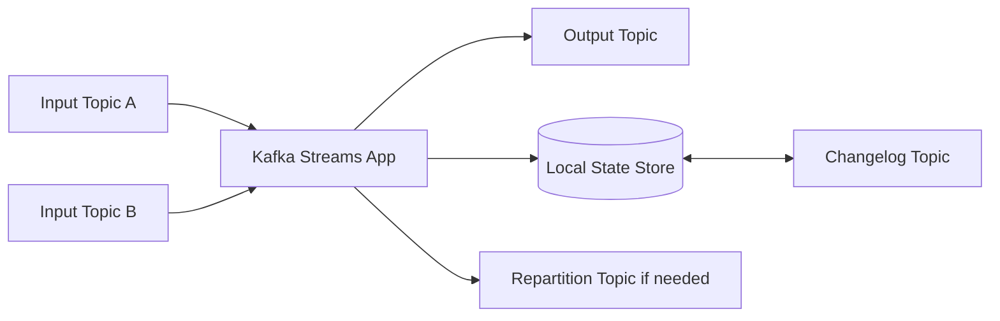
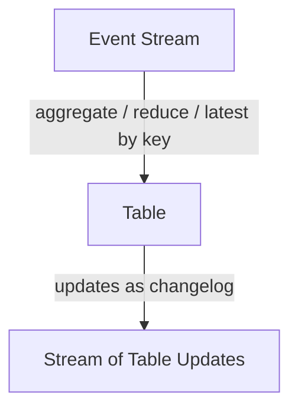
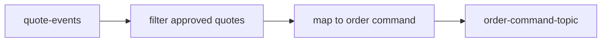
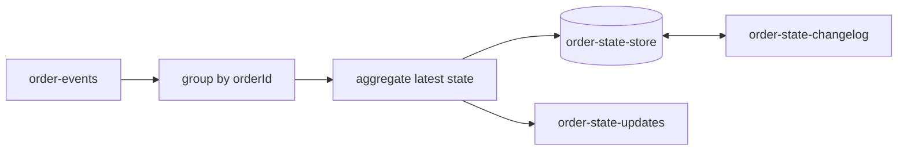
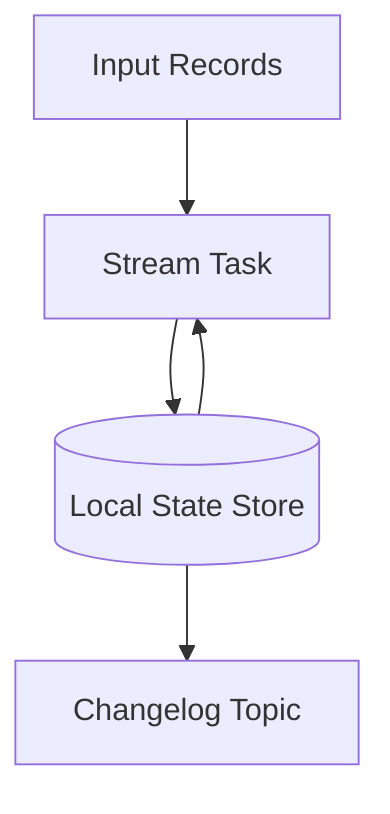
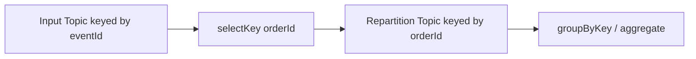
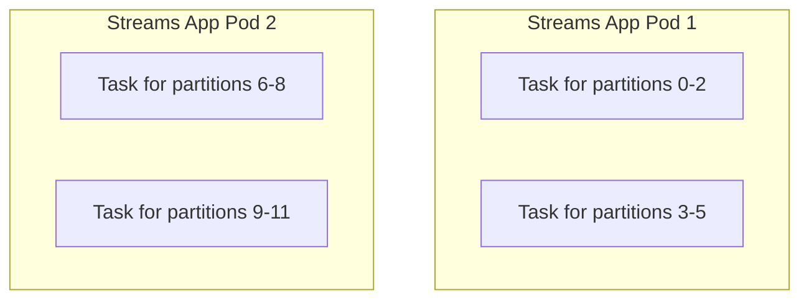

# Part 019 — Kafka Streams Foundation

> Fokus: memahami Kafka Streams sebagai library stream processing untuk aplikasi Java, bukan broker, bukan connector, dan bukan sekadar consumer wrapper. Part ini membangun mental model KStream, KTable, GlobalKTable, topology, state store, changelog topic, repartition topic, task, stream thread, application ID, consumer group relation, dan exactly-once processing dalam konteks backend Java/JAX-RS enterprise.

Kafka Streams adalah library Java untuk membangun aplikasi stream processing di atas Kafka. Ia berjalan di dalam proses aplikasi biasa, menggunakan Kafka sebagai source, sink, storage log, coordination substrate, dan recovery mechanism.

Kesalahan umum adalah menganggap Kafka Streams sebagai “Kafka consumer yang lebih fancy”. Itu terlalu dangkal. Kafka Streams membawa model komputasi yang berbeda: data mengalir melalui topology, sebagian operasi bisa stateless, sebagian stateful, sebagian membutuhkan local state store, sebagian membuat internal topic, sebagian memicu repartition, dan sebagian memerlukan reasoning tentang ordering, time, recovery, serta topology compatibility.

Dalam sistem enterprise seperti CPQ, quote/order management, catalog-driven architecture, dan integration-heavy backend, Kafka Streams dapat dipakai untuk membangun read model, enrichment pipeline, deduplication, aggregation, projection, join antar event, materialized state, dan event transformation. Tetapi ia juga bisa menjadi sumber incident jika state store, repartition topic, changelog topic, schema evolution, deployment scaling, atau upgrade topology tidak dipahami.

Prinsip dasarnya:

> Kafka Streams membuat stream processing terasa seperti aplikasi Java biasa, tetapi operational semantics-nya tetap distributed system semantics.

---

## 1. Konsep Inti

Kafka Streams adalah client-side library. Ia bukan Kafka broker dan bukan service terpisah yang wajib dioperasikan seperti ksqlDB.

Aplikasi Kafka Streams biasanya:

1. membaca record dari satu atau lebih topic,
2. memproses record melalui topology,
3. mungkin menyimpan state lokal,
4. mungkin membuat internal topic,
5. menghasilkan output ke topic lain,
6. recovery state dari Kafka saat restart atau failover.

Mental model sederhana:



Kafka Streams cocok ketika processing logic cukup kompleks sehingga plain consumer menjadi terlalu banyak custom code, tetapi masih ingin tetap berada di dalam ekosistem Java application deployment.

Ia memberi abstraction untuk:

- stream/table model,
- transformation,
- filtering,
- mapping,
- branching,
- joining,
- aggregation,
- windowing,
- local state,
- changelog-backed recovery,
- partition-aware task execution,
- processing guarantees.

Tetapi abstraction ini tidak menghapus pertanyaan correctness:

- Apakah event duplicate-safe?
- Apakah key benar?
- Apakah repartition mengubah ordering?
- Apakah state store bisa dipulihkan cukup cepat?
- Apakah topology upgrade compatible?
- Apakah output event bisa diproses ulang dengan aman?

---

## 2. Kenapa Kafka Streams Ada

Tanpa Kafka Streams, pipeline stream processing sering ditulis sebagai consumer biasa:

```text
poll records
for each record:
  deserialize
  validate
  load state from DB/cache
  transform
  maybe join with another source
  write result
  commit offset
handle retry/DLQ manually
handle state recovery manually
handle partition assignment manually
```

Untuk logic sederhana, plain consumer cukup. Tetapi saat processing membutuhkan stateful join, aggregation, windowing, dan materialized view, custom consumer cepat menjadi rapuh.

Kafka Streams ada untuk menyediakan runtime aplikasi stream processing yang:

- tetap Java-native,
- memakai Kafka partitioning sebagai parallelism model,
- memakai local state store untuk stateful processing,
- memakai Kafka changelog topic untuk recovery,
- memakai Kafka consumer group untuk assignment,
- menyediakan DSL tingkat tinggi,
- tetap memungkinkan Processor API untuk kontrol rendah,
- mendukung processing guarantee yang lebih kuat di konteks Kafka-to-Kafka.

Namun, Kafka Streams bukan solusi universal. Ia bukan pengganti database transaction, bukan pengganti workflow engine, bukan pengganti outbox, dan bukan cara ajaib untuk menghilangkan duplicate event.

---

## 3. Kafka Streams Bukan Broker, Bukan Connect, Bukan ksqlDB

Penting membedakan posisi Kafka Streams dari komponen lain.

| Komponen | Bentuk | Fokus |
|---|---|---|
| Kafka broker | Server/runtime cluster | Commit log, topic, partition, replication |
| Kafka Java producer/consumer | Client library | Produce/consume record secara eksplisit |
| Kafka Streams | Java library | Stream processing embedded di aplikasi |
| Kafka Connect | Runtime connector | Integrasi source/sink sistem eksternal |
| ksqlDB | Stream processing server/query engine | SQL-like processing di atas Kafka |
| Schema Registry | Service registry schema | Contract dan compatibility schema |

Kafka Streams berjalan sebagai aplikasi Anda sendiri. Artinya:

- deployment-nya mengikuti deployment service Java,
- observability-nya harus masuk dashboard service,
- scaling-nya mengikuti replica aplikasi,
- incident-nya menjadi incident aplikasi juga,
- ownership-nya harus jelas antara backend team dan platform team.

Dalam konteks Java/JAX-RS, Kafka Streams bisa berada dalam service yang sama dengan API, tetapi itu perlu dipikirkan hati-hati. Menggabungkan REST API dan stream processor dalam satu deployment bisa menyederhanakan code ownership, tetapi juga menggabungkan failure domain.

Pertanyaan review:

- Apakah stream processing harus hidup bersama REST API?
- Apakah restart API akan memicu stream rebalance?
- Apakah stream restore akan memperlambat readiness API?
- Apakah resource CPU/memory stream mengganggu request latency?
- Apakah lifecycle API dan lifecycle stream seharusnya dipisah?

---

## 4. Stream/Table Mental Model

Kafka Streams dibangun di atas dualitas stream dan table.

### Stream

Stream adalah sequence event yang append-only secara konseptual.

Contoh:

```text
QuoteCreated
QuotePriced
QuoteApproved
OrderSubmitted
OrderCancelled
```

Setiap record adalah fakta yang terjadi pada waktu tertentu.

Stream cocok untuk:

- event lifecycle,
- audit trail,
- integration event,
- click/activity stream,
- command result,
- notification event,
- event-carried state transfer.

### Table

Table adalah view state terbaru berdasarkan key.

Contoh:

```text
quoteId -> latest quote status
orderId -> latest order state
productId -> latest catalog snapshot
customerId -> latest customer segment
```

Table bisa dibayangkan sebagai compacted view dari changelog.

Jika stream menjawab “apa saja yang terjadi?”, table menjawab “apa state terbaru per key?”.

Kafka Streams menyatukan dua model ini:



Ini sangat penting untuk order management. Banyak bug terjadi karena engineer memperlakukan event stream seperti table, atau table update seperti immutable domain event.

---

## 5. KStream

`KStream` merepresentasikan stream of records. Setiap record adalah event independen.

Contoh konseptual:

```text
KStream<String, QuoteEvent>
key   = quoteId
value = QuoteCreated | QuotePriced | QuoteApproved
```

Operasi umum pada KStream:

- filter,
- map,
- flatMap,
- branch,
- selectKey,
- groupByKey,
- groupBy,
- join,
- transform,
- process,
- to output topic.

KStream cocok ketika setiap record harus diproses sebagai event yang berdiri sendiri.

Contoh use case:

- validasi event,
- routing event berdasarkan type,
- enrichment event,
- transform integration event,
- publish projection update,
- detect state transition,
- create notification event.

KStream bukan table. Jika Anda membutuhkan “latest state per quote”, Anda perlu aggregation/table/state store, bukan sekadar KStream linear.

---

## 6. KTable

`KTable` merepresentasikan changelog stream yang dimaterialisasi sebagai table per key.

Contoh:

```text
KTable<String, QuoteSnapshot>
key   = quoteId
value = latest quote snapshot
```

Jika record baru datang dengan key yang sama, value lama dianggap diperbarui.

KTable cocok untuk:

- latest status per aggregate,
- lookup state,
- dimension table,
- materialized read model,
- compacted topic consumption,
- stream-table join.

Mental model:

```text
quote-1 -> DRAFT
quote-1 -> PRICED
quote-1 -> APPROVED

KTable state:
quote-1 -> APPROVED
```

KTable berbahaya jika input topic sebenarnya bukan changelog state, melainkan domain event historis. Mengubah event historis menjadi latest-state table harus dilakukan dengan aturan bisnis yang eksplisit.

Contoh risiko:

```text
QuoteApproved arrives before QuotePriced due to ordering issue
KTable latest state becomes APPROVED
Later QuotePriced arrives
KTable latest state becomes PRICED
```

Jika event tidak membawa version/sequence/eventTime yang bisa digunakan untuk menolak stale update, table bisa mundur.

---

## 7. GlobalKTable

`GlobalKTable` adalah table yang direplikasi ke setiap instance Kafka Streams application.

Ia berguna untuk lookup data kecil atau sedang yang dibutuhkan oleh semua task.

Contoh:

```text
productId -> product metadata
currencyCode -> currency rule
tenantId -> tenant configuration
```

Perbedaan penting:

| Aspek | KTable | GlobalKTable |
|---|---|---|
| Partitioned | Ya | Direplikasi penuh ke semua instance |
| Scaling state | State dibagi per partition | State disalin ke semua instance |
| Use case | State besar per key | Lookup reference data kecil/sedang |
| Memory/disk cost | Terbagi | Dikali jumlah instance |

GlobalKTable bisa sangat nyaman untuk enrichment, tetapi bisa menjadi masalah jika datanya besar atau update rate tinggi.

Pertanyaan review:

- Apakah data lookup cukup kecil untuk direplikasi ke semua pod?
- Apakah update rate-nya rendah?
- Apakah semua instance memang butuh seluruh data?
- Apakah ada privacy/tenant isolation concern?
- Apakah restart akan restore semua data terlalu lama?

---

## 8. Topology

Topology adalah graph processing Kafka Streams.

Contoh topology sederhana:



Topology stateful:



Topology mendefinisikan:

- input topic,
- transformation node,
- processor node,
- state store,
- repartition topic,
- changelog topic,
- output topic.

Dalam PR review, topology harus bisa dijelaskan sebagai dataflow, bukan hanya potongan kode DSL.

Checklist topology:

- Apa input topic?
- Apa output topic?
- Apa key pada setiap tahap?
- Apakah ada repartition?
- Apakah ada state store?
- Apakah ada join?
- Apakah ada window?
- Apakah ada internal topic?
- Apa failure mode tiap node?

---

## 9. DSL vs Processor API

Kafka Streams menyediakan dua pendekatan utama.

### DSL

DSL adalah API tingkat tinggi untuk operasi umum.

Contoh operasi:

- stream,
- table,
- mapValues,
- filter,
- groupByKey,
- aggregate,
- join,
- to.

DSL cocok untuk sebagian besar pipeline yang bisa dijelaskan sebagai transformasi data declarative.

Kelebihan:

- lebih ringkas,
- lebih mudah dibaca,
- lebih sedikit boilerplate,
- integrasi state/window lebih mudah.

Kekurangan:

- beberapa behavior internal tersembunyi,
- repartition bisa terjadi secara implisit,
- naming internal topic perlu dikontrol,
- debugging topology perlu membaca generated topology.

### Processor API

Processor API memberi kontrol lebih rendah terhadap processing.

Cocok untuk:

- custom state store access,
- custom punctuator/scheduled processing,
- advanced routing,
- fine-grained metadata access,
- complex stateful logic.

Kelemahannya:

- lebih verbose,
- lebih mudah salah,
- correctness responsibility lebih besar,
- test dan observability harus lebih disiplin.

Prinsip praktis:

> Gunakan DSL selama semantics-nya jelas. Gunakan Processor API ketika Anda benar-benar membutuhkan kontrol yang tidak disediakan DSL, bukan karena terlihat lebih “advanced”.

---

## 10. State Store

State store adalah storage lokal yang digunakan Kafka Streams untuk stateful operation.

Contoh stateful operation:

- aggregation,
- reduce,
- count,
- join,
- windowed aggregation,
- deduplication,
- materialized view.

State store biasanya lokal pada instance aplikasi.



State store memberikan performa karena lookup lokal lebih cepat daripada selalu query database remote.

Tetapi konsekuensinya:

- pod restart butuh state restore,
- disk lokal/container storage perlu dipahami,
- state store harus diproteksi dengan changelog,
- state bisa hilang lokal tetapi dipulihkan dari Kafka,
- restore time bisa berdampak pada readiness,
- state store besar membuat deployment lebih berat.

State store bukan pengganti database transactional utama seperti PostgreSQL. Ia adalah materialized state untuk stream processing.

---

## 11. Changelog Topic

Changelog topic menyimpan perubahan state store di Kafka agar state store bisa dipulihkan.

Jika instance Kafka Streams mati, instance baru bisa restore state dari changelog topic.

Mental model:

```text
local state store = cache/materialized state lokal
changelog topic   = durable recovery log untuk state store
```

Tanpa changelog, state lokal hilang saat pod mati.

Changelog topic biasanya internal topic. Naming-nya terkait application ID dan store name.

Risiko changelog:

- retention salah bisa merusak recovery,
- compaction salah bisa membuang state penting,
- topic internal tidak dimonitor,
- ACL internal topic kurang,
- restore lambat karena changelog besar,
- schema state berubah tanpa migration plan.

Pertanyaan review:

- State store apa saja yang punya changelog?
- Berapa ukuran changelog topic?
- Apakah changelog compacted?
- Apakah retention aman untuk restore?
- Apakah internal topic masuk monitoring?
- Apakah restore time pernah diuji?

---

## 12. Repartition Topic

Repartition topic dibuat ketika Kafka Streams perlu mengubah key sebelum operasi yang membutuhkan data dengan key yang sama berada di partition yang sama.

Contoh:

```text
input key = eventId
operation groupBy(orderId)
```

Kafka Streams harus melakukan repartition agar semua record dengan orderId yang sama masuk ke partition yang sama.



Repartition bukan detail kecil. Ia memengaruhi:

- throughput,
- latency,
- storage,
- internal topic count,
- ordering,
- network IO,
- failure surface,
- ACL/topic governance.

Banyak PR terlihat sederhana tetapi diam-diam menambah repartition topic.

Contoh:

```java
stream
  .selectKey((oldKey, value) -> value.orderId())
  .groupByKey()
  .aggregate(...)
```

Ini bisa membuat repartition.

Checklist:

- Apakah key berubah?
- Apakah operasi berikutnya membutuhkan grouping/join?
- Apakah repartition topic diberi nama eksplisit?
- Apakah volume repartition masuk capacity planning?
- Apakah ordering lama masih valid setelah repartition?

---

## 13. Internal Topic

Kafka Streams dapat membuat internal topic untuk:

- repartition,
- changelog,
- state store recovery.

Internal topic bukan berarti tidak penting. Topic ini tetap memakai broker storage, replication, retention, ACL, metrics, dan bisa menyebabkan incident.

Contoh naming konseptual:

```text
<application.id>-<operator/store-name>-repartition
<application.id>-<store-name>-changelog
```

Risiko internal topic:

- auto-create topic policy tidak sesuai governance,
- replication factor default salah,
- cleanup policy tidak cocok,
- ACL tidak mengizinkan create/read/write,
- topic dihapus manual,
- internal topic tidak ikut DR/replication,
- naming berubah saat topology berubah.

Dalam enterprise environment, internal topic harus tetap masuk topic governance.

Internal verification checklist:

- Apakah aplikasi boleh auto-create internal topic?
- Siapa owner internal topic?
- Apakah replication factor sesuai production standard?
- Apakah internal topic muncul di dashboard?
- Apakah internal topic masuk GitOps/topic-as-code?
- Apakah deletion internal topic memerlukan approval?

---

## 14. Task

Task adalah unit parallelism Kafka Streams. Task biasanya terkait dengan assignment partition.

Jika input topic punya 12 partition, Kafka Streams akan membuat task yang merepresentasikan subset partition tersebut. Task didistribusikan ke stream threads dan application instances.

Mental model:



Task membawa:

- input partition assignment,
- processor state,
- local state store partition,
- changelog partition relation.

Saat rebalance, task bisa pindah instance. Jika task punya state store, instance baru perlu restore state.

Task-level reasoning penting untuk:

- scaling,
- restore time,
- hot partition,
- resource usage,
- standby replica,
- rebalance impact.

---

## 15. Stream Thread

Stream thread adalah thread yang menjalankan task.

Satu Kafka Streams application instance bisa punya beberapa stream thread.

Scaling Kafka Streams bisa dilakukan dengan:

1. menambah jumlah pod/application instances,
2. menambah jumlah stream threads per instance,
3. menambah partition input topic jika parallelism kurang.

Tetapi parallelism maksimum tetap dibatasi oleh partition count input dan topology structure.

Trade-off:

| Strategi | Kelebihan | Risiko |
|---|---|---|
| Tambah pod | Fault isolation lebih baik | Rebalance, overhead state restore |
| Tambah thread | Lebih banyak parallelism dalam pod | CPU contention, memory pressure |
| Tambah partition | Parallelism naik | Ordering/key semantics bisa berubah |

Prinsip praktis:

> Kafka Streams scaling bukan sekadar menaikkan replica. Partitioning, task assignment, state store, dan restore behavior harus dihitung bersama.

---

## 16. Application ID

`application.id` adalah identitas aplikasi Kafka Streams.

Ia digunakan untuk:

- consumer group ID,
- internal topic prefix,
- state store namespace,
- offset tracking,
- task ownership.

Mengubah application ID bukan perubahan kecil. Itu bisa membuat aplikasi terlihat seperti consumer group baru dan memproses ulang topic dari awal, tergantung offset reset dan config.

Contoh risiko:

```text
Old application.id: order-projection-v1
New application.id: order-projection
```

Konsekuensi potensial:

- consumer group baru,
- offset lama tidak dipakai,
- internal topic baru,
- state store baru,
- replay tidak disengaja,
- duplicate output,
- projection rebuild tidak direncanakan.

Checklist review:

- Apakah application ID stabil?
- Apakah application ID environment-specific?
- Apakah rename application ID disengaja?
- Apakah replay impact dipahami?
- Apakah output idempotent jika reprocess?
- Apakah internal topic lama akan dibersihkan?

---

## 17. Consumer Group Relation

Kafka Streams memakai Kafka consumer group di bawahnya. `application.id` biasanya menjadi group ID.

Artinya konsep consumer group tetap berlaku:

- partition assignment,
- rebalance,
- offset commit,
- lag,
- max poll interval,
- heartbeat,
- membership,
- scaling batas partition.

Namun Kafka Streams menambahkan layer:

- task assignment,
- state store ownership,
- changelog restore,
- standby tasks,
- topology metadata,
- internal topics.

Jadi saat melihat consumer lag untuk Kafka Streams, jangan hanya bertanya “consumer lambat?” Pertanyaan yang lebih lengkap:

- Apakah task sedang restore state?
- Apakah rebalance sedang terjadi?
- Apakah state store besar?
- Apakah downstream output topic lambat?
- Apakah processing logic CPU-bound?
- Apakah RocksDB/disk IO lambat?
- Apakah repartition topic menjadi bottleneck?

---

## 18. Exactly-Once Processing dalam Kafka Streams

Kafka Streams mendukung exactly-once processing dalam batas tertentu, terutama untuk Kafka-to-Kafka processing dengan transactional producer dan offset commit yang terkoordinasi.

Namun ini perlu dibaca secara presisi:

```text
Kafka input -> Kafka Streams processing -> Kafka output
```

Dalam konteks itu, Kafka Streams bisa membantu mencegah duplicate output akibat crash/retry tertentu.

Tetapi jika topology melakukan side effect eksternal:

```text
Kafka input -> Kafka Streams -> PostgreSQL write
Kafka input -> Kafka Streams -> external REST call
Kafka input -> Kafka Streams -> Redis mutation
```

Maka exactly-once Kafka tidak otomatis menjamin exactly-once ke sistem eksternal.

Prinsip:

> Kafka Streams EOS menyelesaikan sebagian problem Kafka-to-Kafka. Ia tidak menghapus kebutuhan idempotency untuk database, external API, Redis, atau side effect bisnis.

Jika Kafka Streams menghasilkan event yang kemudian dikonsumsi service lain, downstream tetap harus idempotent.

Checklist:

- Apakah topology Kafka-to-Kafka murni?
- Apakah ada side effect eksternal?
- Apakah output event idempotent?
- Apakah downstream consumer duplicate-safe?
- Apakah transactional config digunakan dengan benar?
- Apakah metrics transaction/error dipantau?

---

## 19. Kafka Streams vs Plain Consumer

Kafka Streams tidak selalu lebih baik daripada plain consumer.

| Kebutuhan | Plain Consumer | Kafka Streams |
|---|---|---|
| Consume event sederhana | Cocok | Bisa berlebihan |
| Write ke DB dengan transaction custom | Cocok | Perlu hati-hati |
| Manual retry/DLQ kompleks | Cocok | Perlu desain eksplisit |
| Stateless transform Kafka-to-Kafka | Bisa | Cocok |
| Aggregation/windowing | Custom berat | Cocok |
| Join stream/table | Custom berat | Cocok |
| Local materialized state | Custom berat | Cocok |
| Low-level control loop | Cocok | Kurang langsung |
| Complex state recovery | Custom berat | Cocok |

Gunakan plain consumer jika:

- logic sederhana,
- side effect utama adalah DB write,
- transaction boundary harus dikontrol penuh,
- retry/DLQ custom sangat spesifik,
- tidak butuh join/window/aggregation/state store.

Gunakan Kafka Streams jika:

- butuh stream transformation berantai,
- butuh aggregation/windowing,
- butuh materialized state,
- butuh join antar stream/table,
- butuh Kafka-to-Kafka processing yang scalable,
- ingin mengurangi custom state management.

---

## 20. Pengaruh ke Java/JAX-RS Backend

Kafka Streams adalah library Java. Ia bisa dijalankan dalam service Java yang sama dengan JAX-RS endpoint, tetapi harus dipisahkan secara lifecycle dan resource.

Risiko jika digabung dengan REST API:

- pod belum ready karena state restore lama,
- stream processing CPU-heavy mengganggu API latency,
- API deployment memicu stream rebalance,
- stream failure menyebabkan service dianggap unhealthy,
- readiness probe tidak membedakan API readiness dan stream readiness,
- shutdown API tidak memberi waktu commit/close streams dengan benar.

Pola yang lebih aman:

```text
service-api       = JAX-RS synchronous command/query boundary
service-streams   = Kafka Streams projection/enrichment/processing runtime
```

Tetapi pemisahan bukan wajib. Untuk service kecil, satu deployment bisa valid asal:

- thread pool dipisah,
- lifecycle stream dikontrol,
- graceful shutdown benar,
- readiness memahami restore state,
- resource request/limit cukup,
- observability per component jelas.

---

## 21. Pengaruh ke PostgreSQL/MyBatis/JDBC

Kafka Streams sering menggoda engineer untuk menyimpan state di local state store dan menghindari database. Ini bisa valid untuk derived state, tetapi tidak untuk source-of-truth transactional state.

PostgreSQL tetap lebih cocok untuk:

- aggregate source of truth,
- transactional command handling,
- consistency boundary,
- idempotency/inbox table,
- audit records yang butuh relational constraints,
- business invariant yang butuh locking/constraint.

Kafka Streams state store cocok untuk:

- derived projection,
- lookup cache dari compacted topic,
- rolling aggregation,
- stream join state,
- dedup window,
- materialized view untuk stream processing.

Bahaya:

```text
Kafka Streams state store dianggap authoritative DB
```

Akibatnya:

- repair sulit,
- audit lemah,
- migration state rumit,
- external query pattern kacau,
- restore time menjadi availability bottleneck.

Jika Kafka Streams harus menulis ke PostgreSQL, pastikan:

- write idempotent,
- ada natural key/unique constraint,
- offset/processing semantics dipahami,
- crash after DB write aman,
- replay tidak merusak state,
- external transaction mismatch tidak disamarkan sebagai EOS.

---

## 22. Pengaruh ke Microservices dan Distributed Consistency

Kafka Streams sering dipakai untuk membangun derived service state dari event service lain.

Contoh:

```text
Catalog Service -> catalog-events
Pricing Service -> pricing-events
Quote Projection Streams App -> quote-read-model-updates
Quote API -> reads projection
```

Ini meningkatkan decoupling, tetapi memperkenalkan eventual consistency.

Pertanyaan consistency:

- Berapa lag projection yang diterima?
- Apa yang API tampilkan saat projection belum update?
- Apakah read-your-writes dibutuhkan?
- Apakah stale catalog/pricing bisa menyebabkan quote salah?
- Apakah reconciliation tersedia?
- Apakah replay projection aman?

Kafka Streams tidak menghapus distributed consistency problem. Ia hanya menyediakan mekanisme untuk memproses event dan state secara partition-aware.

---

## 23. Pengaruh di Kubernetes/AWS/Azure/On-Prem

Kafka Streams berjalan sebagai aplikasi biasa, sehingga deployment environment memengaruhi behavior.

### Kubernetes

Perhatikan:

- pod restart memicu rebalance,
- rolling update memindahkan task,
- state restore bisa lama,
- disk lokal untuk state store harus dipahami,
- CPU throttling memperlambat processing,
- memory pressure bisa memicu crash,
- graceful shutdown harus memberi waktu close.

### Cloud-managed Kafka

Perhatikan:

- ACL internal topic,
- transaction support/config jika EOS,
- network latency,
- cross-AZ traffic cost,
- monitoring broker terbatas,
- quota/throughput limit,
- managed service defaults.

### On-prem/hybrid

Perhatikan:

- network stability,
- DNS/listener config,
- certificate rotation,
- storage performance,
- cross-site latency,
- DR replication internal topic,
- operational ownership.

---

## 24. Failure Mode Utama

Kafka Streams failure mode sering terlihat seperti consumer problem, tetapi root cause-nya bisa stateful.

| Symptom | Kemungkinan penyebab |
|---|---|
| Consumer lag naik | Processing lambat, restore state, downstream output lambat, hot partition |
| App restart loop | Deserialization error, state store corruption, config/auth issue |
| Rebalance sering | Pod unstable, max poll issue, resource pressure, rolling update buruk |
| Output duplicate | Reprocess, application.id berubah, EOS tidak aktif/salah, downstream tidak idempotent |
| Output missing | Filter bug, schema mismatch, topology branch salah, offset/reset issue |
| Restore lama | Changelog besar, disk lambat, standby replica tidak ada |
| Internal topic error | ACL, topic deleted, replication/retention salah |
| Join salah | Key mismatch, window/grace salah, out-of-order event |
| Projection mundur | Late/stale event tidak ditolak |

Senior engineer harus men-debug dari topology dan state, bukan hanya dari log exception.

---

## 25. Cara Mendeteksi Failure

Observability minimum Kafka Streams:

- consumer lag per input topic,
- processing rate,
- processing latency,
- punctuate/commit latency jika relevan,
- skipped record count,
- deserialization error,
- task created/closed/suspended/restored,
- rebalance count/duration,
- state restore progress,
- RocksDB metrics jika stateful,
- internal topic throughput,
- output topic production error,
- transaction error jika EOS,
- JVM CPU/memory/GC,
- pod restart count.

Dashboard harus memisahkan:

```text
input health
processing health
state store health
internal topic health
output health
runtime/pod health
```

Alert consumer lag saja tidak cukup.

---

## 26. Cara Men-debug Failure

Urutan debugging production-safe:

1. Identifikasi application.id dan topology version.
2. Cek input topic lag dan partition skew.
3. Cek apakah app sedang rebalance atau restore.
4. Cek log deserialization/processing exception.
5. Cek internal changelog/repartition topic health.
6. Cek state store size dan restore progress.
7. Cek output topic production error.
8. Cek resource pod: CPU throttling, memory, disk.
9. Cek recent deployment/topology/schema change.
10. Jangan reset offset atau hapus state store tanpa runbook.

Hal yang tidak boleh dilakukan sembarangan:

- menghapus internal topic,
- mengganti application.id untuk “memperbaiki” lag,
- reset offset tanpa replay plan,
- scale replicas tanpa cek partition/task,
- menghapus local state tanpa memahami restore cost,
- disable EOS tanpa correctness review.

---

## 27. Trade-off Kafka Streams

| Area | Keuntungan | Trade-off |
|---|---|---|
| Java-native | Mudah masuk service Java | Runtime stateful ikut lifecycle app |
| Local state | Cepat untuk lookup/aggregation | Restore, disk, migration lebih kompleks |
| DSL | Ringkas | Repartition/internal topic bisa tersembunyi |
| Scaling | Partition-aware | Dibatasi partition dan state restore |
| EOS | Membantu Kafka-to-Kafka correctness | Tidak menyelesaikan DB/external side effect |
| No separate cluster | Tidak perlu ksqlDB/Flink cluster | Setiap app membawa operational complexity |
| Materialized view | Cocok untuk projection | Staleness/replay/rebuild harus diatur |

Keputusan menggunakan Kafka Streams harus mempertimbangkan complexity budget tim.

---

## 28. Correctness Concern

Checklist correctness:

- Key input benar untuk aggregation/join?
- Apakah `selectKey` memicu repartition?
- Apakah event duplicate-safe?
- Apakah output idempotent?
- Apakah late event ditangani?
- Apakah stale update bisa menimpa state terbaru?
- Apakah schema evolution aman untuk state store?
- Apakah application.id stabil?
- Apakah state store restore tested?
- Apakah topology upgrade compatible?
- Apakah side effect eksternal idempotent?

Kafka Streams bug sering bukan syntax bug, melainkan semantic bug pada key, time, state, dan lifecycle.

---

## 29. Performance Concern

Performance dipengaruhi oleh:

- input throughput,
- partition count,
- stream threads,
- number of instances,
- state store size,
- RocksDB performance,
- serialization/deserialization cost,
- repartition volume,
- changelog throughput,
- output producer config,
- GC pressure,
- CPU throttling,
- disk IO.

Performance tuning tidak boleh dimulai dari config acak. Mulai dari bottleneck:

```text
input? processing? state store? repartition? changelog? output? resource?
```

Jika stateful, disk dan restore time sama pentingnya dengan CPU.

---

## 30. Security dan Privacy Concern

Kafka Streams bisa membaca banyak topic, membuat internal topic, dan menyimpan state lokal. Ini punya implikasi security/privacy.

Perhatikan:

- ACL input topic,
- ACL output topic,
- ACL internal topic,
- transactional ID permission jika EOS,
- sensitive data di state store lokal,
- encryption at rest untuk node/persistent disk jika dibutuhkan,
- log redaction untuk payload/header,
- PII di changelog/internal topic,
- retention internal topic,
- access ke Interactive Query jika digunakan.

State store lokal bisa menyimpan data sensitif walaupun hanya derived state. Jangan menganggap data aman hanya karena bukan database utama.

---

## 31. Observability Concern

Log aplikasi harus mencakup metadata minimal:

- application.id,
- topology version,
- task ID,
- topic,
- partition,
- offset,
- key,
- event ID,
- correlation ID,
- state store name jika relevan,
- processing duration,
- output topic,
- error classification.

Namun payload sensitif tidak boleh di-log sembarangan.

Metrics harus bisa menjawab:

- Apakah input backlog naik?
- Apakah processing lambat?
- Apakah state restore berlangsung?
- Apakah rebalance sering?
- Apakah output publish gagal?
- Apakah internal topic bermasalah?
- Apakah pod resource cukup?

---

## 32. PR Review Checklist

Gunakan checklist ini saat mereview Kafka Streams PR:

### Topology

- Apa input topic dan output topic?
- Apakah topology diagram tersedia?
- Apakah topology description dicek di test/log?
- Apakah operator/state store diberi nama eksplisit?

### Key dan partitioning

- Apa key di setiap tahap?
- Apakah `selectKey`/`groupBy` memicu repartition?
- Apakah ordering assumption valid setelah repartition?
- Apakah partition count cukup untuk scaling?

### State

- State store apa yang dibuat?
- Berapa estimasi ukuran state?
- Apakah changelog topic aman?
- Apakah restore time diuji?
- Apakah schema state bisa berevolusi?

### Correctness

- Apakah duplicate-safe?
- Apakah late/stale event ditangani?
- Apakah output idempotent?
- Apakah side effect eksternal dihindari atau dibuat idempotent?
- Apakah application.id stabil?

### Operations

- Apakah metrics/logging cukup?
- Apakah graceful shutdown ada?
- Apakah readiness mempertimbangkan restore?
- Apakah internal topic punya ACL/config?
- Apakah deployment scaling aman?

---

## 33. Internal Verification Checklist

Untuk konteks CSG/team, verifikasi hal berikut, jangan diasumsikan:

- Apakah Kafka Streams digunakan di codebase?
- Service mana yang menjalankan Kafka Streams?
- Apakah Streams app digabung dengan JAX-RS API atau dipisah?
- Apa `application.id` setiap Streams app?
- Apa input/output topic-nya?
- Apa topology description-nya?
- Apakah ada KStream, KTable, atau GlobalKTable?
- Apa state store yang digunakan?
- Apa changelog dan repartition internal topic yang tercipta?
- Apakah internal topic dikelola lewat GitOps/topic-as-code?
- Apakah EOS diaktifkan?
- Apakah ada side effect ke PostgreSQL, Redis, atau external API?
- Apakah state store menyimpan data sensitif?
- Apakah ada dashboard Kafka Streams metrics?
- Apakah ada runbook restore/rebalance/topology upgrade?
- Apakah ada incident lama terkait Streams lag, restore, duplicate output, atau schema change?

---

## 34. Ringkasan Mental Model

Kafka Streams adalah library Java untuk stream processing yang menjalankan topology di dalam aplikasi. Ia menggunakan Kafka topic sebagai input/output, consumer group sebagai assignment mechanism, state store sebagai local materialized state, changelog topic sebagai recovery log, repartition topic untuk key redistribution, dan application ID sebagai identitas operasional.

Untuk senior backend engineer, inti penguasaannya bukan sekadar bisa menulis DSL, tetapi mampu menjawab:

- apa key-nya,
- apa topology-nya,
- apa state-nya,
- apa internal topic-nya,
- apa failure mode-nya,
- apa recovery path-nya,
- apa consistency guarantee-nya,
- apa konsekuensinya ke Java service, PostgreSQL, Redis, Kubernetes, cloud, dan operations.

Kafka Streams sangat kuat ketika digunakan untuk stream processing yang memang membutuhkan state, join, aggregation, atau projection. Tetapi jika dipakai tanpa memahami state store, repartition, changelog, application ID, dan replay semantics, ia bisa menjadi sumber incident yang sulit dipahami.

