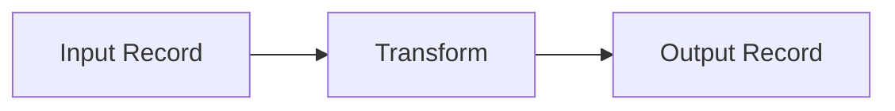
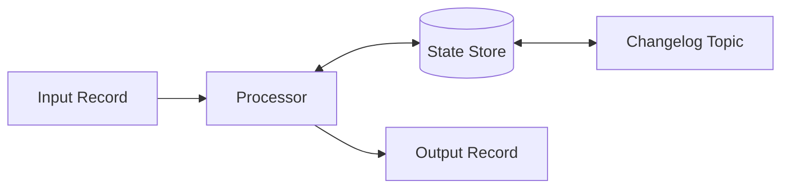
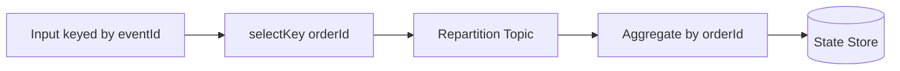
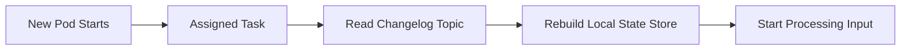

# Part 020 — Kafka Streams Operations

> Fokus: mengoperasikan Kafka Streams di production. Part ini membahas stateless dan stateful transformation, aggregation, join, windowing, grace period, suppression, late event, event time, processing time, RocksDB, state store restoration, standby replica, rebalance impact, scaling, topology upgrade, state migration, dan checklist production readiness.

Part sebelumnya membangun mental model Kafka Streams. Part ini masuk ke wilayah yang biasanya membedakan implementasi demo dari sistem production: state restore yang lambat, repartition yang tidak terlihat, join yang salah karena key, window yang salah karena event time, late event yang mengubah hasil, topology upgrade yang memicu reprocessing, dan scaling yang justru memperparah rebalance.

Kafka Streams operations bukan hanya urusan platform team. Backend engineer yang menulis topology ikut bertanggung jawab terhadap operational behavior-nya. Topology adalah kode, tetapi efeknya adalah runtime distributed stateful system.

Prinsip utama:

> Setiap Kafka Streams topology harus direview sebagai dataflow, state machine, dan production workload sekaligus.

---

## 1. Stateless Transformation

Stateless transformation adalah operasi yang tidak membutuhkan state lintas record.

Contoh:

- filter event,
- map value,
- normalize payload,
- route by event type,
- enrich dari data yang sudah ada di record,
- split stream ke beberapa output,
- redact field,
- convert schema.

Mental model:



Contoh konseptual:

```text
quote-events -> filter QuoteApproved -> map to order-command -> order-command-topic
```

Kelebihan stateless transformation:

- recovery lebih sederhana,
- tidak membutuhkan state store,
- tidak ada changelog topic,
- scaling relatif lebih mudah,
- restore time minimal,
- failure surface lebih kecil.

Namun tetap ada correctness concern:

- schema compatibility,
- key preservation,
- output idempotency,
- duplicate input,
- ordering per key,
- poison event,
- DLQ strategy,
- observability metadata.

Stateless bukan berarti bebas risiko. Jika transform mengubah event contract atau key, dampaknya bisa besar.

---

## 2. Stateful Transformation

Stateful transformation membutuhkan state lintas record.

Contoh:

- count per customer,
- latest status per order,
- deduplicate event dalam window,
- join quote event dengan catalog table,
- aggregate fulfillment state,
- detect missing transition,
- build read model.

Mental model:



Stateful processing membawa operational cost:

- state store lokal,
- changelog topic,
- restore saat restart,
- state migration saat schema berubah,
- disk/memory management,
- rebalance lebih mahal,
- correctness bergantung pada key dan ordering.

Pertanyaan wajib:

- State apa yang disimpan?
- Apakah state derived atau authoritative?
- Berapa besar state akan tumbuh?
- Bagaimana state dipulihkan?
- Bagaimana state dibersihkan?
- Bagaimana schema state berevolusi?
- Apa yang terjadi saat replay?

---

## 3. Aggregation

Aggregation menggabungkan banyak record menjadi state per key.

Contoh:

```text
orderId -> latest order lifecycle summary
quoteId -> number of pricing attempts
customerId -> total active quotes
```

Aggregation membutuhkan grouping. Grouping membutuhkan key yang benar.

Jika input sudah keyed by aggregate ID:

```text
key = orderId
```

Maka `groupByKey` bisa relatif langsung.

Jika input keyed by event ID tetapi aggregation per order ID:

```text
key = eventId
value.orderId = orderId
```

Maka perlu re-key dan repartition.



Aggregation failure mode:

- key salah menghasilkan aggregate salah,
- duplicate event menghitung dua kali,
- out-of-order event membuat state mundur,
- late event mengubah hasil historis,
- state store membesar tanpa batas,
- changelog restore lambat,
- schema state berubah tanpa migration.

Untuk CPQ/order management, aggregation harus memahami business invariant. Misalnya, menghitung order status tidak boleh hanya “last event wins” jika event bisa datang terlambat atau transition punya precedence.

---

## 4. Reduce vs Aggregate

`reduce` cocok ketika input dan output state punya tipe yang sama atau mirip.

Contoh:

```text
latest QuoteSnapshot -> latest QuoteSnapshot
```

`aggregate` cocok ketika output state berbeda dari event input.

Contoh:

```text
OrderEvent -> OrderLifecycleSummary
PricingEvent -> PricingAttemptStats
```

Pertanyaan review:

- Apakah state butuh initial value?
- Apakah update function idempotent?
- Apakah duplicate event aman?
- Apakah event lama bisa menimpa state baru?
- Apakah state menyimpan event version/sequence?
- Apakah aggregate bisa diperbaiki via replay?

Jangan menulis aggregation yang secara diam-diam menganggap input exactly-once dan ordered secara global.

---

## 5. Join

Join menggabungkan data dari dua sumber.

Jenis umum:

- KStream-KStream join,
- KStream-KTable join,
- KTable-KTable join,
- KStream-GlobalKTable join.

Join selalu membutuhkan pemikiran tentang:

- key,
- timing,
- window,
- state,
- null/missing match,
- update behavior,
- replay behavior,
- duplicate behavior.

### KStream-KTable Join

Contoh:

```text
quote-events + catalog-table -> enriched-quote-events
```

KStream membawa event, KTable membawa latest state.

Risiko:

- catalog table belum ter-load saat event datang,
- catalog update terlambat,
- event diperkaya dengan state terbaru, bukan state saat event terjadi,
- tenant-specific lookup salah,
- stale table menyebabkan output salah.

### KStream-KStream Join

Contoh:

```text
QuoteApproved + PaymentReserved within 10 minutes -> OrderReady
```

Membutuhkan window. Tanpa window, stream-stream join tidak bounded.

Risiko:

- window terlalu kecil: match hilang,
- window terlalu besar: state membengkak,
- late event tidak masuk,
- duplicate menghasilkan multiple output,
- event time salah.

### KTable-KTable Join

Cocok untuk materialized state yang terus berubah.

Risiko:

- update salah satu side memicu output baru,
- tombstone/delete behavior harus jelas,
- state size besar,
- consistency bukan transactional lintas table.

---

## 6. Windowing

Windowing membatasi operasi berdasarkan waktu.

Jenis window umum:

| Window | Karakteristik | Contoh use case |
|---|---|---|
| Tumbling | Fixed, tidak overlap | Count order per 5 menit |
| Hopping | Fixed, overlap | Moving metrics per 5 menit setiap 1 menit |
| Sliding | Berdasarkan jarak waktu antar event | Detect event pair dalam interval |
| Session | Berdasarkan aktivitas dan gap | Group activity per user/session |

Windowing berguna untuk:

- aggregation per periode,
- correlation event,
- SLA detection,
- anomaly detection,
- deduplication bounded,
- timeout-like processing.

Namun windowing adalah sumber bug besar jika event time, processing time, late event, dan grace period tidak dipahami.

---

## 7. Event Time vs Processing Time

Event time adalah waktu saat kejadian bisnis terjadi.

Processing time adalah waktu saat aplikasi memproses record.

Contoh:

```text
eventTime      = quote approved at 10:00:00
processingTime = stream app processed at 10:04:30
```

Perbedaan ini penting saat:

- event terlambat,
- replay historis,
- CDC delay,
- network delay,
- producer retry,
- clock skew,
- batch ingestion,
- disaster recovery.

Jika window memakai processing time, replay event lama bisa terlihat seperti event baru. Jika memakai event time, late event bisa masuk ke window lama atau ditolak tergantung grace period.

Untuk business process seperti order lifecycle, event time biasanya lebih bermakna. Tetapi event time harus reliable dan distandardisasi.

Checklist:

- Field mana yang menjadi event time?
- Apakah event time berasal dari source service atau broker timestamp?
- Apakah clock service sinkron?
- Apakah replay memakai event time asli?
- Apakah late event diterima atau ditolak?
- Apakah business SLA memakai event time atau processing time?

---

## 8. Grace Period

Grace period adalah toleransi untuk late event setelah window dianggap selesai.

Contoh:

```text
Window: 10:00 - 10:05
Grace: 2 minutes
Late event accepted until 10:07
```

Grace period membantu menangani out-of-order dan delayed event, tetapi memperpanjang waktu state disimpan.

Trade-off:

| Grace pendek | Grace panjang |
|---|---|
| State lebih kecil | State lebih besar |
| Output lebih cepat final | Output final lebih lambat |
| Late event lebih sering ditolak | Late event lebih banyak diterima |
| Cocok untuk low-latency | Cocok untuk correctness late-arrival |

Pertanyaan review:

- Berapa lateness normal event?
- Berapa lateness p95/p99?
- Apakah CDC bisa delay?
- Apakah retry topic bisa membuat event datang terlambat?
- Apakah late event harus mengubah hasil?
- Apakah output downstream bisa menerima correction?

---

## 9. Suppression

Suppression menahan output sampai window final atau kondisi tertentu terpenuhi.

Tanpa suppression, aggregation window bisa mengeluarkan intermediate updates.

Contoh:

```text
count=1
count=2
count=3
```

Dengan suppression until window closes:

```text
count=3 only after final
```

Suppression berguna jika downstream hanya boleh menerima hasil final. Tetapi suppression membutuhkan buffering dan bisa meningkatkan memory/state pressure.

Risiko:

- output terlambat,
- buffer membesar,
- memory pressure,
- late event setelah final tidak tercermin,
- downstream tidak tahu ada intermediate state.

Gunakan suppression jika semantics final result benar-benar dibutuhkan, bukan hanya untuk “mengurangi noise”.

---

## 10. Late Event Handling

Late event adalah event yang datang setelah waktu yang diharapkan.

Late event bisa terjadi karena:

- producer retry,
- broker/network delay,
- consumer lag,
- CDC connector lag,
- replication slot lag,
- retry topic,
- replay,
- clock skew,
- batch import,
- regional failover.

Strategi late event:

1. Accept within grace period.
2. Drop and record metric.
3. Send to DLQ/late-event topic.
4. Emit correction event.
5. Trigger reconciliation.
6. Rebuild projection via replay.

Yang berbahaya adalah diam-diam menerima late event dan menimpa state yang lebih baru.

Untuk order lifecycle, late event harus dicek terhadap state transition rule.

Contoh:

```text
Current state: ORDER_COMPLETED
Late event: ORDER_SUBMITTED
```

Tidak boleh otomatis mengembalikan state ke submitted.

---

## 11. Out-of-Order Event Handling

Kafka menjamin ordering hanya per partition. Kafka Streams juga bergantung pada key/partitioning.

Out-of-order bisa terjadi jika:

- key salah,
- event untuk aggregate sama masuk partition berbeda,
- topic partition count berubah,
- producer retry + max in-flight config buruk,
- multiple producer menerbitkan event aggregate yang sama,
- CDC dan application event bercampur,
- replay tidak menjaga urutan,
- event time berbeda dari append order.

Strategi:

- gunakan aggregate ID sebagai key,
- sertakan aggregate version/sequence,
- tolak stale event,
- simpan last processed version,
- gunakan state transition validation,
- desain correction/reconciliation,
- hindari asumsi global ordering.

Kafka Streams topology harus eksplisit tentang key yang dipakai sebelum stateful operation.

---

## 12. State Store Restoration

State store restoration terjadi saat task pindah ke instance baru atau local state hilang.

Restore membaca changelog topic untuk membangun ulang local state.



Restore time dipengaruhi oleh:

- ukuran state,
- ukuran changelog,
- compaction efficiency,
- broker throughput,
- network throughput,
- disk IO,
- CPU deserialization,
- number of tasks,
- standby replica availability.

Failure mode:

- pod tidak ready terlalu lama,
- rolling deployment lambat,
- rebalance berulang karena restore belum selesai,
- disk penuh,
- changelog missing/corrupt,
- schema state tidak compatible,
- restore membebani broker.

Production requirement:

- ukur restore time,
- alert restore stuck,
- jangan hapus local state sembarangan,
- jangan hapus changelog topic,
- gunakan standby replica jika downtime restore tidak acceptable.

---

## 13. RocksDB

Kafka Streams sering memakai RocksDB sebagai persistent key-value store lokal untuk state store.

RocksDB memberi performa stateful processing, tetapi membawa concern storage-level.

Perhatikan:

- local disk path,
- disk capacity,
- disk IO latency,
- compaction behavior,
- memory usage,
- block cache,
- write buffer,
- file descriptor,
- cleanup saat pod reschedule,
- interaction dengan container ephemeral storage.

Di Kubernetes, state store sering berada pada ephemeral disk. Itu valid karena state bisa dipulihkan dari changelog, tetapi restore cost harus diterima.

Jika state sangat besar, pertimbangkan:

- persistent volume,
- standby replicas,
- menurunkan state size,
- memecah topology,
- mengubah design menjadi database-backed read model,
- mengevaluasi apakah Kafka Streams masih tepat.

Jangan tuning RocksDB sebelum tahu bottleneck-nya. Ukur dulu CPU, disk IO, memory, restore time, dan state size.

---

## 14. Standby Replica

Standby replica adalah salinan state store yang dipelihara di instance lain agar failover lebih cepat.

Tanpa standby:

```text
Task pindah -> restore dari changelog penuh -> lama
```

Dengan standby:

```text
Task pindah -> standby sudah punya state hampir terbaru -> lebih cepat aktif
```

Kelebihan:

- mengurangi restore downtime,
- mempercepat failover,
- membantu workload state besar.

Trade-off:

- butuh disk lebih besar,
- butuh network/changelog read lebih banyak,
- butuh resource lebih besar,
- tidak menghilangkan kebutuhan changelog.

Standby berguna untuk topology stateful kritis dengan RTO rendah.

Pertanyaan review:

- Berapa restore time tanpa standby?
- Apakah restore time acceptable?
- Berapa tambahan disk untuk standby?
- Apakah cluster punya capacity?
- Apakah failover pernah diuji?

---

## 15. Rebalance Impact

Rebalance pada Kafka Streams lebih mahal daripada consumer stateless biasa karena task state bisa berpindah.

Penyebab rebalance:

- pod restart,
- rolling deployment,
- scaling replica,
- instance crash,
- max poll interval exceeded,
- heartbeat/session issue,
- network instability,
- resource starvation,
- cooperative assignment changes.

Dampak rebalance:

- processing pause,
- task revoked/assigned,
- state restore,
- lag naik,
- duplicate processing dalam beberapa scenario,
- output delay,
- API/read model stale.

Mitigasi:

- graceful shutdown,
- cooperative rebalancing jika cocok,
- stable deployment rollout,
- resource request/limit memadai,
- max poll interval cukup untuk processing,
- hindari long blocking operation,
- standby replica untuk stateful app,
- PDB untuk menghindari terlalu banyak pod mati bersamaan.

---

## 16. Scaling Kafka Streams

Scaling harus dimulai dari topology dan partitioning.

Parallelism maksimum dibatasi oleh jumlah task, yang terkait dengan partition input topic.

Contoh:

```text
Input topic partitions = 6
Max active task parallelism roughly = 6
```

Jika replica 10 tetapi partition 6, tidak semua replica akan aktif memproses task.

Scaling checklist:

- Berapa partition input topic?
- Berapa task aktif?
- Berapa stream thread per pod?
- Berapa pod replica?
- Apakah ada state store besar?
- Apakah standby replica dipakai?
- Apakah bottleneck CPU, disk, network, atau output topic?
- Apakah hot partition menyebabkan satu task lambat?

Scaling tidak selalu berarti tambah pod. Kadang solusi yang benar:

- perbaiki key distribution,
- tambah partition dengan migration plan,
- optimalkan serialization,
- kurangi repartition,
- split topology,
- ubah state store design,
- optimalkan downstream output,
- tambah broker capacity.

---

## 17. Hot Partition dan Skew

Kafka Streams sangat sensitif terhadap key skew. Jika satu key atau tenant menghasilkan volume besar, satu partition/task bisa menjadi bottleneck.

Symptom:

- lag hanya pada partition tertentu,
- satu task processing latency tinggi,
- satu pod CPU tinggi,
- output delay untuk subset aggregate,
- scaling replica tidak membantu.

Penyebab:

- tenant besar memakai tenantId sebagai key,
- order/quote tertentu menghasilkan event sangat banyak,
- null key menyebabkan distribusi tidak sesuai harapan,
- custom partitioner buruk,
- repartition berdasarkan key skewed.

Mitigasi:

- evaluasi key design,
- split hot aggregate jika business memungkinkan,
- gunakan composite key dengan hati-hati,
- buat dedicated topic untuk high-volume tenant jika benar-benar perlu,
- gunakan salting hanya jika ordering requirement tidak rusak,
- optimalkan processing untuk hot path.

Jangan mengorbankan ordering per aggregate hanya demi distribusi tanpa memahami business invariant.

---

## 18. Topology Upgrade

Topology upgrade adalah perubahan processing graph. Ini bisa sangat berisiko.

Perubahan yang tampak kecil bisa berdampak besar:

- mengganti application.id,
- mengganti store name,
- mengganti operator name,
- menambah state store,
- menghapus state store,
- mengubah key,
- menambah repartition,
- mengubah output schema,
- mengubah aggregation logic,
- mengubah window/grace,
- mengubah serde state.

Konsekuensi:

- internal topic baru,
- state store baru,
- restore ulang,
- reprocessing,
- output duplicate,
- state lama tidak compatible,
- deployment gagal karena internal topic/ACL,
- old/new version tidak bisa berjalan bersamaan.

Topology upgrade harus punya plan:

1. Apa yang berubah?
2. Apakah state lama compatible?
3. Apakah rolling upgrade aman?
4. Apakah output duplicate-safe?
5. Apakah internal topic baru perlu dibuat?
6. Apakah ACL/topic-as-code sudah siap?
7. Apakah rollback aman?
8. Apakah replay/rebuild diperlukan?

---

## 19. State Migration

State migration diperlukan ketika format state store berubah.

Contoh:

```text
Old state: { orderId, status }
New state: { orderId, status, version, lastEventTime }
```

Jika serde state berubah secara incompatible, aplikasi bisa gagal membaca state lama saat restore.

Strategi migration:

### 1. Backward-compatible state schema

Tambahkan field optional/default agar state lama bisa dibaca.

### 2. New store name

Buat state store baru dan rebuild dari input topic/changelog.

Risiko: reprocessing dan duplicate output.

### 3. New application ID

Membuat aplikasi baru dari awal.

Risiko: consumer group baru, internal topic baru, full replay.

### 4. Blue/green topology

Jalankan topology baru paralel dan validasi output sebelum switch.

Lebih aman tetapi lebih mahal.

Pertanyaan review:

- Apakah state schema versioned?
- Apakah serde backward-compatible?
- Apakah restore dari state lama diuji?
- Apakah output selama migration double?
- Apakah rollback masih bisa membaca state?
- Apakah migration perlu reconciliation?

---

## 20. Output Semantics

Kafka Streams topology biasanya menghasilkan output topic. Output ini menjadi contract untuk downstream consumer.

Output semantics harus jelas:

- Apakah output adalah event domain?
- Apakah output adalah projection update?
- Apakah output adalah command?
- Apakah output adalah correction?
- Apakah output intermediate atau final?
- Apakah output bisa duplicate?
- Apakah output bisa out-of-order?
- Apakah output membawa full state atau delta?
- Apakah output schema compatible?

Untuk aggregation/windowing, output bisa berupa update berkali-kali untuk key yang sama. Downstream harus tahu apakah itu final result atau intermediate update.

Jika memakai suppression, output mungkin hanya final tetapi lebih terlambat.

Jangan biarkan downstream menebak semantics output.

---

## 21. Retry, DLQ, dan Error Handling di Kafka Streams

Kafka Streams error handling berbeda dari consumer custom biasa.

Jenis error:

- deserialization error,
- processing exception,
- production exception,
- state store error,
- authorization error,
- internal topic error,
- schema compatibility error.

Strategi harus eksplisit:

- skip bad record dengan metric,
- fail-fast untuk data corruption,
- publish ke DLQ melalui handler/pola custom,
- stop app untuk schema incompatible,
- retry transient producer error,
- alert untuk skipped record.

Poison event dalam Streams bisa lebih berbahaya karena satu record buruk bisa membuat task gagal terus.

Checklist:

- Bagaimana deserialization exception ditangani?
- Bagaimana processing exception ditangani?
- Apakah DLQ punya metadata cukup?
- Apakah skipped record dimonitor?
- Apakah fail-fast dipakai untuk bug yang tidak aman dilanjutkan?
- Apakah replay dari DLQ aman?

---

## 22. Interactive Query Awareness

Kafka Streams dapat mengekspos local state store untuk query melalui Interactive Queries. Ini bisa berguna untuk low-latency read dari materialized state.

Namun, ini menambah kompleksitas:

- state terpartisi di beberapa instance,
- client harus tahu key berada di instance mana,
- routing query perlu metadata,
- rebalance memindahkan ownership,
- consistency tetap eventual,
- security endpoint harus dijaga,
- state lokal tidak boleh diperlakukan seperti DB utama.

Untuk JAX-RS service, Interactive Query bisa terlihat menggoda:

```text
GET /orders/{id}/projection -> query local state store
```

Pertanyaan review:

- Apakah read model perlu query langsung dari state store?
- Bagaimana routing jika key ada di pod lain?
- Apa response saat rebalance/restore?
- Apa staleness contract?
- Apakah endpoint secure?
- Apakah fallback ke database/read model lain diperlukan?

---

## 23. Kubernetes Operations

Kafka Streams di Kubernetes membutuhkan perhatian khusus.

### Readiness

Readiness harus mempertimbangkan apakah app siap memproses atau melayani query.

Jika state restore belum selesai, apakah pod boleh ready?

Jawabannya tergantung fungsi:

- Jika hanya processor async, readiness bisa berarti app siap menerima assignment.
- Jika melayani Interactive Query, readiness harus mempertimbangkan state store availability.

### Liveness

Liveness jangan terlalu agresif. Jika liveness membunuh pod saat restore panjang, akan terjadi restart loop.

### Graceful shutdown

Pod termination harus memberi waktu:

- stop menerima traffic jika ada API,
- close KafkaStreams,
- commit/flush transaksi jika relevan,
- revoke task dengan bersih.

### Rolling update

Rolling update bisa memicu rebalance dan restore. Untuk stateful topology besar, atur:

- maxUnavailable rendah,
- terminationGracePeriodSeconds cukup,
- PDB,
- deployment window,
- lag monitoring selama rollout.

---

## 24. Cloud dan On-Prem Operations

### AWS/MSK

Periksa:

- IAM/SASL/TLS support untuk app,
- ACL internal topic,
- broker quota,
- CloudWatch metrics,
- cross-AZ latency/cost,
- MSK broker sizing,
- transactional support jika EOS.

### Azure/Event Hubs Kafka-compatible endpoint

Jika memakai Kafka-compatible endpoint, jangan asumsikan seluruh semantics Kafka Streams berjalan identik dengan Apache Kafka native. Perlu verifikasi compatibility, terutama untuk internal topic, transactions, compaction, dan admin operation.

### On-prem/hybrid

Periksa:

- listener/DNS/certificate,
- network latency,
- firewall,
- disk performance broker,
- monitoring internal topic,
- DR replication untuk internal topics,
- operational ownership.

Internal verification wajib karena detail deployment sangat bergantung environment.

---

## 25. Observability untuk Kafka Streams Operations

Dashboard production sebaiknya punya panel:

### Input

- input records rate,
- input bytes rate,
- consumer lag per topic/partition,
- partition skew.

### Processing

- process rate,
- process latency,
- skipped record count,
- error rate,
- task count,
- rebalance count/duration.

### State

- state store size,
- restore progress,
- restore latency,
- RocksDB metrics,
- changelog read/write rate.

### Internal topics

- repartition topic throughput,
- changelog topic throughput,
- internal topic lag,
- internal topic error.

### Output

- output records rate,
- producer error rate,
- producer retry rate,
- transaction commit/abort rate jika EOS.

### Runtime

- CPU,
- memory,
- GC,
- disk usage,
- pod restart,
- readiness/liveness failures.

Alert harus action-oriented, bukan hanya angka.

---

## 26. Debugging Playbook

### Symptom: consumer lag naik

Langkah:

1. Cek lag per partition.
2. Cek hot partition.
3. Cek process latency.
4. Cek rebalance/restore.
5. Cek state store/RocksDB metrics.
6. Cek output producer error.
7. Cek CPU throttling/memory/disk.
8. Cek recent deployment/schema change.

### Symptom: state restore lama

Langkah:

1. Cek size changelog topic.
2. Cek restore rate.
3. Cek broker throughput.
4. Cek disk IO pod.
5. Cek apakah standby replica tersedia.
6. Cek apakah local state dihapus saat restart.
7. Cek retention/compaction changelog.

### Symptom: output salah

Langkah:

1. Cek input key.
2. Cek repartition.
3. Cek event ordering.
4. Cek late event handling.
5. Cek aggregation/join/window semantics.
6. Cek state store content jika aman.
7. Cek replay terhadap sample data.

### Symptom: app gagal setelah deployment

Langkah:

1. Cek topology change.
2. Cek internal topic ACL.
3. Cek state serde compatibility.
4. Cek application.id/store name change.
5. Cek schema registry compatibility.
6. Cek rollback safety.

---

## 27. Load Testing Kafka Streams

Load test harus mencerminkan topology, bukan hanya throughput input.

Ukur:

- max sustainable input rate,
- processing latency,
- output latency,
- consumer lag under load,
- state store growth,
- restore time setelah kill pod,
- rebalance duration,
- RocksDB disk IO,
- repartition topic throughput,
- changelog topic throughput,
- memory/GC,
- CPU throttling,
- output duplicate under crash.

Skenario penting:

1. Normal peak traffic.
2. Hot key/tenant traffic.
3. Late event burst.
4. Replay historical data.
5. Broker/network latency spike.
6. Pod restart during load.
7. Rolling deployment during lag.
8. Schema evolution deployment.

Load test Kafka Streams harus mencakup failure and recovery, bukan hanya happy-path throughput.

---

## 28. Chaos dan Resilience Test

Chaos test yang relevan:

- kill one pod,
- kill multiple pods within PDB limit,
- restart broker,
- throttle CPU,
- fill disk state store environment,
- inject deserialization error,
- inject late events,
- pause output topic availability,
- remove ACL in lower environment,
- simulate schema incompatible event,
- simulate changelog restore from empty local state.

Tujuannya bukan merusak sistem, tetapi membuktikan runbook dan observability.

Pertanyaan setelah chaos:

- Apakah alert muncul?
- Apakah runbook cukup?
- Apakah recovery otomatis?
- Apakah output duplicate?
- Apakah state consistent?
- Apakah lag kembali turun?
- Apakah customer-impact behavior dipahami?

---

## 29. Production Checklist

### Design

- Topology diagram tersedia.
- Input/output topic jelas.
- Key semantics jelas.
- Repartition diketahui.
- State store diketahui.
- Window/grace semantics jelas.
- Output contract jelas.

### Correctness

- Duplicate-safe.
- Late event policy jelas.
- Stale event tidak merusak state.
- Replay aman.
- Side effect eksternal idempotent atau dihindari.
- Schema evolution tested.

### Operations

- application.id stabil.
- Internal topic dikelola.
- ACL internal topic tersedia.
- Dashboard lengkap.
- Alert action-oriented.
- Runbook restore/rebalance/lag tersedia.
- Load/chaos test dilakukan.

### Deployment

- Graceful shutdown benar.
- Readiness/liveness tidak menyebabkan restart loop.
- Resource request/limit memadai.
- Rolling update aman.
- PDB tersedia untuk critical app.
- Restore time diketahui.

### Security/Privacy

- State store sensitif diperlakukan benar.
- PII tidak bocor ke log/internal topic tanpa kontrol.
- Access Interactive Query diamankan jika digunakan.
- Retention/changelog policy sesuai.

---

## 30. Internal Verification Checklist

Untuk konteks CSG/team, verifikasi hal berikut:

- Apakah ada Kafka Streams app production?
- Apa topology untuk setiap app?
- Apakah topology diagram tersedia?
- Apa `application.id`?
- Apa input/output/internal topic?
- Apakah ada state store? Berapa ukurannya?
- Apakah RocksDB digunakan? Di path/storage mana?
- Apakah state store berada di ephemeral disk atau persistent volume?
- Apakah standby replica diaktifkan?
- Berapa restore time aktual?
- Apakah restore time pernah diuji saat pod kill?
- Apakah ada repartition topic besar?
- Apakah window/grace period terdokumentasi?
- Apakah late event policy jelas?
- Apakah topology upgrade pernah menyebabkan incident?
- Apakah internal topic dikelola lewat GitOps?
- Apakah ACL internal topic sudah didefinisikan?
- Apakah dashboard Streams metrics lengkap?
- Apakah runbook lag/restore/rebalance tersedia?
- Apakah output downstream idempotent terhadap duplicate/replay?
- Apakah state store menyimpan data sensitif?
- Apakah ada Interactive Query endpoint?
- Apakah deployment digabung dengan JAX-RS API atau service terpisah?

---

## 31. PR Review Checklist

Saat mereview perubahan Kafka Streams:

### Topology change

- Apakah topology berubah?
- Apakah ada operator baru?
- Apakah store name berubah?
- Apakah application.id berubah?
- Apakah internal topic baru muncul?
- Apakah rolling upgrade aman?

### Key/repartition

- Apakah key berubah?
- Apakah ada `selectKey`, `groupBy`, atau join baru?
- Apakah repartition topic baru dibuat?
- Apakah ordering assumption tetap benar?
- Apakah hot partition risk meningkat?

### State/window

- Apakah state store baru dibuat?
- Apakah state schema berubah?
- Apakah window/grace berubah?
- Apakah suppression dipakai?
- Apakah late event policy berubah?

### Output contract

- Apakah output schema berubah?
- Apakah output intermediate atau final?
- Apakah downstream diberi tahu?
- Apakah compatibility test ada?

### Production readiness

- Apakah metrics/logging ditambah?
- Apakah runbook diperbarui?
- Apakah load/replay test ada?
- Apakah rollback plan aman?
- Apakah internal topic/ACL/config sudah disiapkan?

---

## 32. Ringkasan Mental Model Operasional

Kafka Streams operations adalah tentang menjaga topology stateful tetap benar, cepat, bisa dipulihkan, dan aman saat berubah.

Hal yang harus selalu diingat:

- Stateless lebih sederhana, tetapi tetap butuh contract dan observability.
- Stateful membawa state store, changelog, restore, migration, dan disk concern.
- Aggregation dan join hanya benar jika key dan time semantics benar.
- Windowing tanpa event time/grace understanding akan menghasilkan bug halus.
- Late event dan out-of-order event harus punya policy eksplisit.
- Restore time adalah bagian dari availability.
- Rebalance adalah operational event yang bisa memengaruhi output dan lag.
- Scaling dibatasi partition, task, state, dan bottleneck aktual.
- Topology upgrade adalah migration problem, bukan sekadar deployment.
- Exactly-once Kafka tidak menghilangkan idempotency untuk side effect eksternal.

Kafka Streams sangat kuat untuk stream processing Java-native, tetapi production-grade Streams membutuhkan disiplin desain yang sama ketatnya dengan database schema, API contract, dan deployment architecture.

