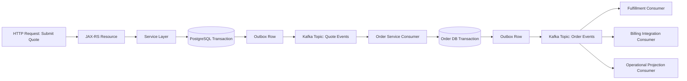

# Part 022 — Event-Driven CPQ and Order Management Context

Kafka becomes much easier to understand when it is connected to real business lifecycle problems.

In a CPQ and order management system, events are not just technical messages. They represent business facts, state transitions, integration signals, audit evidence, and workflow coordination points.

But this is also where event-driven architecture becomes dangerous. A poorly designed event can cause duplicate orders, stale quote status, missed approvals, incorrect fulfillment, broken audit trails, inconsistent read models, and difficult production incidents.

This part maps Kafka concepts to a CPQ/order-management context while staying careful about internal details. Any actual CSG event names, topic names, schema fields, retention rules, ownership rules, retry/DLQ policy, or state machine behavior must be verified internally.

---

## 1. Core Concept

In a CPQ/order-management system, event-driven architecture is usually used to communicate that something important happened in the business lifecycle.

Examples of conceptual events:

```text
QuoteCreated
QuoteConfigured
QuotePriced
QuoteSubmitted
QuoteApproved
QuoteRejected
OrderCreated
OrderValidated
OrderDecomposed
OrderSubmittedToFulfillment
OrderActivated
OrderCompleted
OrderCancelled
OrderFalloutDetected
```

These examples are conceptual only. Actual internal event names and schemas must be verified in the team/codebase.

A business event should answer:

- What happened?
- To which aggregate?
- When did it happen?
- Who or what caused it?
- Which business state changed?
- Which downstream systems may care?
- Is the event safe to replay?
- Is the event part of audit/compliance evidence?

---

## 2. Why Kafka Appears in CPQ/Order Systems

CPQ/order platforms tend to involve many services and lifecycle steps:

- catalog lookup
- product configuration
- pricing
- discounting
- eligibility
- quote generation
- approval workflow
- customer acceptance
- order creation
- order validation
- order decomposition
- provisioning/fulfillment
- billing handoff
- fallout handling
- amendment
- cancellation
- audit
- reporting
- downstream integration

A synchronous-only architecture becomes brittle because every step cannot always complete inside one HTTP request.

Kafka helps by decoupling producers and consumers across time and ownership boundaries.

However, decoupling is not free. Kafka replaces immediate call-chain coupling with event contract coupling, schema coupling, ordering concerns, idempotency requirements, replay risk, observability needs, and operational responsibilities.

---

## 3. Event Types in CPQ/Order Management

### Quote events

Conceptual quote events may describe lifecycle transitions such as:

- quote created
- quote configured
- quote priced
- quote submitted
- quote approved
- quote rejected
- quote expired
- quote accepted
- quote converted to order

Senior review questions:

- Is the quote aggregate ID the partition key?
- Are quote transitions ordered per quote?
- Is quote approval idempotent?
- Can quote pricing be recalculated and re-emitted?
- Is quote status derived or source-of-truth state?
- Is the event a domain event or integration event?

### Order events

Conceptual order events may describe:

- order created
- order validated
- order accepted
- order decomposed
- order submitted to fulfillment
- order activated
- order completed
- order cancelled
- order failed
- order fallout detected

Senior review questions:

- Is the order lifecycle a state machine?
- Which service owns the order state?
- Are events emitted after state transition commit?
- Are duplicate order events safe?
- Can downstream fulfillment consume events idempotently?
- Can event replay accidentally re-trigger external side effects?

### Catalog events

Catalog events may include:

- product created
- product updated
- offer updated
- price plan updated
- eligibility rule changed
- bundle changed
- catalog version published

Senior review questions:

- Do consumers need full snapshot or delta?
- Is catalog version part of the event?
- Are pricing/quote decisions tied to a specific catalog version?
- What happens if catalog events arrive after quote/order events?
- Is cache invalidation based on catalog events?

### Pricing events

Pricing events may describe:

- price calculated
- discount applied
- pricing failed
- pricing rule changed
- quote repriced

Senior review questions:

- Is pricing deterministic under replay?
- Are pricing inputs captured?
- Is pricing result an event-carried state transfer?
- Can consumers trust pricing event as final?
- What is the audit requirement for pricing decisions?

### Approval events

Approval events may describe:

- approval requested
- approval assigned
- approval approved
- approval rejected
- approval escalated
- approval expired

Senior review questions:

- Is approval a separate aggregate/workflow?
- Is human action captured with actor metadata?
- Are escalation and timeout events modeled?
- Are duplicate approvals blocked?
- Is approval state synchronized with quote/order state?

### Fulfillment events

Fulfillment events may describe:

- fulfillment requested
- fulfillment accepted
- fulfillment started
- fulfillment step completed
- fulfillment failed
- fulfillment completed

Senior review questions:

- Does fulfillment call external systems?
- Are side effects idempotent?
- What retry/DLQ model exists?
- Can fulfillment events arrive out of order?
- How is customer impact measured?

### Fallout events

Fallout events represent failures that require remediation.

Examples:

- order fallout detected
- fulfillment fallout detected
- provisioning failed
- manual intervention required
- fallout resolved

Senior review questions:

- Is fallout an event, a state, or both?
- Who owns remediation?
- Is fallout visible in operational dashboards?
- Can fallout resolution be replayed safely?
- Does DLQ map to business fallout or only technical failure?

### Cancellation and amendment events

Cancellation/amendment events are high-risk because they change lifecycle intent.

Questions:

- Can cancellation race with fulfillment?
- Can amendment happen after order submission?
- Is amendment modeled as new version, correction, or compensating workflow?
- Are downstream consumers able to reverse or compensate?
- Are ordering guarantees sufficient per order?

### Audit events

Audit events may record business-relevant activity for traceability.

Questions:

- Is Kafka the audit source or only transport?
- What retention is required?
- Are event headers and payloads sufficient for audit?
- Are actor, tenant, timestamp, source service, and causation ID present?
- Is event replay distinguishable from original occurrence?

---

## 4. State Transition Events

Many CPQ/order systems revolve around state machines.

Example conceptual quote lifecycle:

```text
Draft -> Configured -> Priced -> Submitted -> Approved -> Accepted -> ConvertedToOrder
```

Example conceptual order lifecycle:

```text
Created -> Validated -> Decomposed -> SubmittedToFulfillment -> Activated -> Completed
```

Events should not be random notifications. They should reflect meaningful business transitions.

A strong state transition event usually includes:

- aggregate ID
- previous state
- new state
- transition reason
- actor/system that caused transition
- command/request ID
- correlation ID
- causation ID
- event time
- source service
- schema version
- business version if applicable

But including previous/new state has trade-offs. It can make debugging easier, but it can also create coupling if consumers depend too heavily on internal state machine representation.

---

## 5. Event-Driven Order Lifecycle

A simplified event-driven order lifecycle may look like this:



This diagram is conceptual. The actual CSG flow must be verified internally.

The important lifecycle reasoning:

1. HTTP request initiates intent.
2. Service validates command.
3. Database transaction records source-of-truth change.
4. Outbox records event to publish.
5. Kafka distributes event to downstream services.
6. Consumers process idempotently.
7. Downstream services may emit more events.
8. Projections and dashboards eventually catch up.

---

## 6. Saga for Order Processing

Order management often requires multi-step workflows across services.

Example conceptual saga:

```text
Create order
  -> validate order
  -> reserve resources
  -> submit fulfillment
  -> confirm activation
  -> notify billing
  -> complete order
```

At each step, things can fail.

Failure examples:

- validation fails
- resource reservation unavailable
- fulfillment system timeout
- downstream provisioning rejects request
- billing handoff fails
- cancellation arrives during fulfillment
- duplicate event replays an old step
- consumer processes event after state has moved forward

A saga must handle:

- compensation
- timeout
- retry
- duplicate commands
- lost replies
- stuck state
- manual intervention
- audit trail
- customer impact reporting

Kafka can carry saga events and commands, but Kafka does not automatically make the saga correct.

---

## 7. Choreography vs Orchestration in CPQ/Order Flow

### Choreography

In choreography, services react to events and emit new events.

Example:

```text
QuoteApproved -> Order Service creates order -> OrderCreated -> Fulfillment starts
```

Advantages:

- loose runtime coupling
- independent service evolution
- natural pub/sub distribution
- scalable fanout

Risks:

- hidden workflow logic
- hard-to-debug lifecycle
- accidental event loops
- unclear ownership
- difficult compensation
- hard to answer “where is my order stuck?”

### Orchestration

In orchestration, a workflow owner coordinates steps.

Example:

```text
Order Orchestrator commands validation, fulfillment, billing, and compensation.
```

Advantages:

- explicit workflow state
- better visibility
- easier timeout and compensation
- clearer ownership

Risks:

- central orchestration coupling
- orchestrator can become a bottleneck
- command/reply semantics must be designed carefully
- orchestration state must be reliable

### Senior decision rule

Use choreography when the flow is simple and event reactions are independent. Use orchestration when lifecycle correctness, compensation, timeout, and visibility matter more than loose coupling.

Many enterprise order systems end up hybrid.

---

## 8. Order Decomposition Events

Order decomposition is common in telco/BSS-style systems. A commercial order may be decomposed into technical orders, service orders, provisioning tasks, or downstream integration requests.

Conceptual flow:

```text
CustomerOrderCreated
  -> OrderDecompositionStarted
  -> ServiceOrderCreated
  -> ResourceOrderCreated
  -> FulfillmentTaskCreated
  -> DecompositionCompleted
```

Key concerns:

- parent-child correlation
- decomposition version
- deterministic decomposition rules
- partial decomposition failure
- duplicate decomposition event
- cancellation during decomposition
- amendment after decomposition
- downstream ownership of child orders
- reconciliation between commercial and technical order states

A decomposition event should not lose lineage. Without lineage, debugging customer impact becomes extremely difficult.

---

## 9. Downstream Integration Events

Kafka often becomes an integration backbone for downstream systems.

Examples:

- billing integration
- fulfillment/provisioning integration
- CRM/customer integration
- catalog synchronization
- reporting/data platform feed
- notification system
- audit/compliance pipeline

For each downstream integration event, ask:

- Is this event a business fact or an integration command?
- Does the downstream system need every event or latest state only?
- Is event order important?
- What is the retry/DLQ strategy?
- What is the replay policy?
- Are external side effects idempotent?
- Who owns error resolution?
- Is failure business-visible?

Integration events should not simply leak internal domain models. They should be deliberate contracts.

---

## 10. Business Invariants in Event Flow

A business invariant is a rule that must remain true.

Examples:

- an order should not be activated before validation succeeds
- a cancelled order should not continue fulfillment unless explicitly allowed
- a quote should not convert to order unless accepted/approved according to policy
- duplicate fulfillment requests should not create duplicate external orders
- amendment should not silently overwrite completed order state
- pricing decision should be traceable to pricing inputs/version

Kafka does not enforce these invariants. Your application, database constraints, state machines, idempotency tables, and reconciliation jobs do.

When reviewing event-driven design, identify which component owns each invariant.

Bad sign:

```text
“The events will arrive in the right order, so the invariant holds.”
```

Better:

```text
“The order service validates current state transition in PostgreSQL, uses idempotency keys, rejects illegal transitions, emits events after commit, and downstream consumers are replay-safe.”
```

---

## 11. Event Replay and Business Risk

Replay is one of Kafka’s strengths. It is also a business risk.

Replay can be used to:

- rebuild projections
- repair downstream state
- reprocess missed events
- backfill derived topics
- validate new consumers
- recover after consumer outage

But replay can accidentally:

- resend external API calls
- duplicate fulfillment requests
- reopen closed workflow steps
- overwrite corrected state
- trigger notifications again
- corrupt audit interpretation
- create false operational metrics

Every consumer in a CPQ/order system must be classified:

| Consumer Type | Replay Risk | Required Protection |
|---|---:|---|
| Projection builder | Medium | idempotent upsert, rebuild mode |
| Audit sink | Medium | replay marker, append semantics clarity |
| External integration | High | idempotency key, replay guard, manual approval |
| State transition consumer | High | transition validation, processed event table |
| Analytics consumer | Low/Medium | deduplication and replay tagging |
| Notification consumer | High | send-once guard |

Replay safety must be designed, not assumed.

---

## 12. Event-Carried State Transfer vs Notification Event

A notification event says:

```text
Something happened. Fetch details elsewhere.
```

An event-carried state transfer says:

```text
Something happened, and here is enough state for consumers to act.
```

### Notification event advantages

- smaller payload
- less schema coupling
- consumer fetches freshest data
- less PII replication

### Notification event risks

- consumers call back producer service
- temporal coupling returns through HTTP
- thundering herd after event burst
- source service availability affects consumers
- fetched state may not match event time

### Event-carried state transfer advantages

- consumers can process independently
- less synchronous coupling
- better replay capability
- event captures historical state at event time

### Event-carried state transfer risks

- larger payload
- schema governance burden
- PII propagation
- stale embedded data if misunderstood
- harder schema evolution

For quote/order events, the right choice depends on consumer needs, privacy, payload size, and business semantics.

---

## 13. Command Topic vs Event Topic

A command asks another component to do something.

Example conceptual command:

```text
SubmitOrderToFulfillment
CancelOrder
RepriceQuote
ReserveResource
```

An event states that something already happened.

Example conceptual event:

```text
OrderSubmittedToFulfillment
OrderCancelled
QuoteRepriced
ResourceReserved
```

Do not blur them.

A command can be rejected. An event should represent a fact from the producer’s perspective.

If a topic contains commands but is named like events, consumers may make incorrect assumptions about idempotency, ownership, and failure handling.

---

## 14. Kafka Topic Design in CPQ/Order Context

Possible conceptual topic groupings:

```text
quote.events
order.events
catalog.events
pricing.events
approval.events
fulfillment.events
fallout.events
order.commands
order.retry
order.dlq
```

These are examples only, not CSG-specific names.

Design trade-offs:

### Topic per domain

Example:

```text
order.events
```

Advantages:

- easier lifecycle ownership
- fewer topics
- consumers can observe full aggregate lifecycle
- partitioning by order ID is straightforward

Risks:

- schema multiplexing by event type
- consumers need filtering
- high-volume event types can affect low-volume critical events

### Topic per event type

Example:

```text
order.created
order.cancelled
order.completed
```

Advantages:

- clear semantic topic
- easier consumer filtering
- per-event retention/config possible

Risks:

- topic explosion
- lifecycle governance overhead
- harder full lifecycle replay
- partition consistency across event types may be harder

### Topic per integration

Example:

```text
billing.order-events
fulfillment.order-commands
```

Advantages:

- tailored to downstream contract
- avoids leaking internal model
- supports integration-specific SLA/security

Risks:

- duplication of event data
- transformation ownership required
- more schemas to govern

---

## 15. Partition Key in CPQ/Order Context

Partition key should usually align with the aggregate whose ordering matters.

Common candidates:

- `quoteId`
- `orderId`
- `customerId`
- `tenantId`
- `accountId`
- `catalogVersionId`
- `approvalRequestId`

Trade-offs:

### Key by order ID

Good for order lifecycle ordering.

Risk: high-volume tenants still spread across many orders, which is usually good.

### Key by tenant ID

Good for tenant-level grouping.

Risk: hot tenant can create hot partition; order-level parallelism is reduced.

### Key by customer ID

Good if customer-level ordering matters.

Risk: large enterprise customers may become hot keys.

### Null key

Usually bad for lifecycle events requiring ordering because producer partitioning may distribute records without aggregate ordering guarantees.

Senior review question:

> Which business invariant requires ordering, and does the partition key support that invariant?

---

## 16. Event Metadata for CPQ/Order Events

A production CPQ/order event should usually include standardized metadata.

Recommended conceptual metadata:

```json
{
  "eventId": "uuid",
  "eventType": "OrderCreated",
  "eventVersion": "1.0",
  "sourceService": "order-service",
  "aggregateType": "Order",
  "aggregateId": "O-123",
  "tenantId": "T-001",
  "correlationId": "...",
  "causationId": "...",
  "commandId": "...",
  "idempotencyKey": "...",
  "traceId": "...",
  "actorId": "...",
  "eventTime": "2026-07-11T10:00:00Z",
  "schemaVersion": "..."
}
```

This is a conceptual example only.

Metadata enables:

- tracing
- audit
- replay control
- idempotency
- causality analysis
- tenant isolation
- incident debugging
- lineage from quote to order to fulfillment

---

## 17. Source of Truth vs Derived State

Not every event is source of truth.

Possible source-of-truth models:

- PostgreSQL owns aggregate state, Kafka publishes facts after commit
- Event log owns state, services rebuild from events
- Workflow engine owns process state, Kafka publishes lifecycle events
- External system owns fulfillment state, Kafka mirrors integration events
- Derived projection owns query-optimized read state

In most enterprise Java/JAX-RS systems using PostgreSQL/MyBatis/JDBC, PostgreSQL often remains the transactional source of truth for service-owned aggregates.

Kafka then acts as:

- event distribution layer
- integration backbone
- replayable log for downstream consumers
- CDC stream transport
- projection source
- audit/observability feed depending on design

Do not assume event sourcing unless explicitly verified.

---

## 18. Outbox in CPQ/Order Context

For quote/order state transitions, producing event directly inside or after the service method can create dual-write risks.

Safer conceptual model:

```text
Begin DB transaction
  -> validate command
  -> update quote/order table
  -> insert outbox event row
Commit DB transaction
  -> outbox publisher or CDC emits Kafka event
```

Benefits:

- DB state and event intent commit together
- producer crash after DB commit does not lose event
- retry can publish later
- CDC can publish reliably from committed row

Review questions:

- Is outbox row inserted in same transaction as state change?
- Is event payload generated before or after commit?
- Is event ID stable?
- Is partition key stored?
- Is outbox publishing idempotent?
- Is outbox lag monitored?

---

## 19. Inbox in CPQ/Order Context

Consumers that update order/quote state need duplicate protection.

Conceptual flow:

```text
Consume event
  -> begin DB transaction
  -> insert processed_event row with unique eventId
  -> apply business state transition if valid
  -> commit DB transaction
  -> commit Kafka offset
```

Important:

- duplicate event should not duplicate state change
- replay should not re-trigger irreversible side effects
- old events should not move aggregate backward
- illegal transitions should be handled explicitly
- poison events should not block all processing forever

Inbox is not a replacement for business validation. It prevents duplicate processing by event ID; it does not prove the transition is valid.

---

## 20. Failure Modes in CPQ/Order Event Flows

| Failure Mode | Example Impact | Detection Signal | Protection |
|---|---|---|---|
| Event not published | Downstream order not created | outbox lag, missing event | outbox + monitoring |
| Duplicate event | duplicate fulfillment request | duplicate event ID, downstream error | inbox/idempotency |
| Out-of-order event | order cancelled after completed incorrectly | state transition error | partition key + state validation |
| Poison event | consumer stuck | retry spike, DLQ | retry/DLQ policy |
| Schema break | consumers fail deserialization | deserialization errors | schema compatibility CI |
| Stale projection | API shows old order status | projection lag | lag dashboard + consistency SLA |
| Replay side effect | notification sent twice | customer complaint, duplicate external call | replay guard |
| Lost correlation | incident cannot trace lifecycle | missing correlation ID | metadata standard |
| Hot partition | order processing lag for tenant/customer | partition lag skew | key review |
| CDC slot lag | WAL growth, delayed events | replication slot lag | CDC monitoring |

---

## 21. Observability for CPQ/Order Event Flow

A production event-driven CPQ/order system should be observable across business and technical dimensions.

Technical metrics:

- producer send rate
- producer error rate
- outbox lag
- Kafka topic throughput
- consumer lag
- consumer processing latency
- retry topic rate
- DLQ count
- deserialization failure count
- rebalance rate
- CDC replication slot lag

Business metrics:

- quotes submitted per interval
- quote approval delay
- orders created per interval
- orders stuck in validation
- orders stuck in fulfillment
- fallout count
- cancellation count
- amendment count
- SLA breach count
- manual intervention queue size

Traceability signals:

- correlation ID from HTTP to event to downstream services
- causation ID chain
- aggregate ID lineage
- tenant ID
- source service
- actor/system identity

Without business-level observability, Kafka metrics alone may say “healthy” while orders are stuck.

---

## 22. Debugging Example: Order Not Progressing

Symptom:

```text
Customer order remains in Submitted state and does not reach FulfillmentStarted.
```

Debugging path:

```text
1. Locate orderId and tenantId.
2. Check order state in PostgreSQL.
3. Check whether OrderSubmitted event exists in outbox.
4. Check whether outbox row was published.
5. Check Kafka topic for event by orderId key.
6. Check fulfillment consumer group lag.
7. Check fulfillment consumer logs by correlationId/orderId.
8. Check retry/DLQ topics.
9. Check schema/deserialization errors.
10. Check downstream fulfillment API response if external call is involved.
11. Check whether inbox processed event table contains the eventId.
12. Check state transition guard rejected the event.
13. Check incident notes or recent deployment/schema changes.
```

This style of debugging is more reliable than checking only application logs or only Kafka lag.

---

## 23. Security and Privacy Concerns

CPQ/order events can contain sensitive data.

Potentially sensitive fields:

- customer identity
- account information
- address/contact details
- pricing and discount data
- approval comments
- user/actor IDs
- product configuration
- contract terms
- tenant-specific business data

Review concerns:

- Does the event payload contain PII?
- Does the header contain PII?
- Are logs redacted?
- Is DLQ access restricted?
- Is replay access restricted?
- Does retention match compliance needs?
- Are topic ACLs least privilege?
- Are audit events immutable enough for compliance expectations?

Do not put sensitive data into Kafka headers casually. Headers are often logged, inspected, or propagated widely.

---

## 24. Performance and Capacity Concerns

CPQ/order workloads may be uneven.

Examples:

- tenant-specific traffic spikes
- catalog publication causing mass repricing
- bulk order import
- promotional campaign quote spike
- downstream fulfillment slowdown
- replay/backfill job
- retry storm after external system recovery

Review concerns:

- Is partition count sufficient?
- Is key causing hot partition?
- Are low-volume critical events isolated from high-volume noisy events?
- Can consumers scale horizontally?
- Is downstream API rate-limited?
- Is backpressure handled?
- Are retry topics creating delayed load spikes?
- Are projections able to rebuild within acceptable time?

Throughput is not just Kafka throughput. It is end-to-end business lifecycle throughput.

---

## 25. Architecture Review Questions

Use these questions in PR/ADR review.

### Event design

- Is this truly an event, or is it a command?
- What business fact does it represent?
- Who owns it?
- Which consumers are known?
- Is it domain event, integration event, notification, or event-carried state transfer?

### State and consistency

- Which system owns source-of-truth state?
- Is state transition validated transactionally?
- Is event emitted after commit via outbox/CDC?
- What happens if consumer processes duplicate event?
- What happens if event arrives late?

### Ordering

- What ordering is required?
- Is partition key aligned with aggregate?
- Can events arrive out of order across topics?
- What happens after partition count changes?

### Replay

- Is consumer replay-safe?
- Can replay trigger external side effects?
- Is replay tagged or controlled?
- Is manual approval needed for replay?

### Operations

- What dashboard proves the flow is healthy?
- What alert detects stuck orders?
- What runbook handles DLQ/fallout?
- Who owns remediation?

---

## 26. Internal Verification Checklist

Before applying these ideas to the actual CSG environment, verify:

- Actual quote/order/catalog/pricing/approval/fulfillment event names.
- Actual topic names and ownership.
- Whether topic design is per domain, per event, per integration, or hybrid.
- Actual partition keys used by producers.
- Actual event schemas and Schema Registry usage.
- Whether quote/order lifecycle is modeled as explicit state machine.
- Whether event publication uses outbox, CDC, direct producer, or another pattern.
- Whether PostgreSQL/MyBatis/JDBC transaction boundary includes outbox insert.
- Whether Debezium or Kafka Connect is involved.
- Whether consumers use inbox/processed event table.
- Retry and DLQ policy per consumer.
- Replay policy and approval process.
- Whether Kafka events trigger external side effects.
- Observability dashboard for quote/order lifecycle.
- Consumer lag dashboard per business-critical consumer group.
- Incident notes involving duplicate orders, missing events, stale status, DLQ, fulfillment failure, or CDC lag.
- Security/privacy classification of event payloads and headers.
- Ownership boundary between backend, platform/SRE, data, and integration teams.

---

## 27. Practical Mental Model

For CPQ/order systems, Kafka should be understood as part of a business lifecycle engine, not just infrastructure.

A useful reasoning chain:

```text
Command/request
  -> validation
  -> transaction
  -> state transition
  -> outbox/event publication
  -> Kafka topic/partition
  -> consumer group
  -> idempotent processing
  -> downstream state/effect
  -> projection/observability
  -> reconciliation/replay
```

At every step, ask:

- What is the source of truth?
- What can fail?
- What can duplicate?
- What can arrive late?
- What can be replayed?
- What must be idempotent?
- What business invariant protects the customer?
- What metric tells us production is healthy?

---

## 28. Key Takeaways

Kafka is a strong fit for CPQ/order-management systems when used deliberately: lifecycle events, integration signals, projections, CDC, audit trails, and asynchronous workflows can all benefit from event streaming.

But Kafka also amplifies design mistakes. Unclear event ownership, weak partition keys, missing idempotency, unsafe replay, poor schema governance, and missing observability can turn normal business workflows into production incidents.

A senior engineer should not ask only, “Can we publish this event?”

The better questions are:

- Is this event a correct business fact?
- Is it emitted at the right transaction boundary?
- Is it keyed for the ordering we need?
- Is its schema governed?
- Are consumers idempotent?
- Can it be replayed safely?
- Is it observable across business lifecycle?
- Is the ownership clear when it fails in production?

That is the difference between using Kafka as a messaging tool and engineering an event-driven enterprise system.
