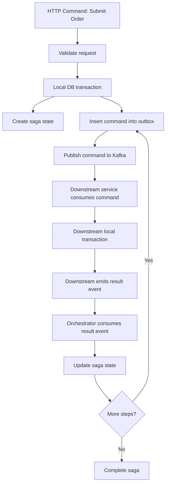

# Part 023 — Saga, Choreography, and Orchestration

> Fokus part ini: memahami cara mengoordinasikan business process lintas service tanpa distributed transaction, khususnya pada sistem enterprise seperti quote/order management, CPQ, provisioning, fulfillment, approval, billing integration, dan downstream system orchestration.

Kafka tidak otomatis menyelesaikan workflow. Kafka hanya menyediakan log event terdistribusi. Begitu sebuah business process melibatkan beberapa service, beberapa database, beberapa external API, dan beberapa kondisi bisnis yang bisa gagal sebagian, kita masuk ke wilayah **saga**, **choreography**, dan **orchestration**.

Masalah utama bukan “bagaimana mengirim message”. Masalah utamanya adalah:

- siapa yang memutuskan langkah berikutnya,
- di mana state proses disimpan,
- bagaimana menangani kegagalan parsial,
- bagaimana mencegah duplicate command,
- bagaimana mendeteksi lost reply,
- bagaimana melakukan compensation,
- bagaimana menghentikan proses yang stuck,
- bagaimana menjelaskan status proses ke user/API client,
- dan bagaimana melakukan recovery tanpa merusak invariant bisnis.

Dalam sistem Java/JAX-RS enterprise, saga biasanya dimulai dari HTTP command seperti:

- create quote,
- submit quote for approval,
- convert quote to order,
- submit order,
- cancel order,
- amend order,
- trigger fulfillment,
- reserve resource,
- activate service,
- synchronize with downstream BSS/OSS.

HTTP request tersebut mungkin hanya memulai workflow. Hasil akhirnya mungkin terjadi beberapa detik, menit, atau bahkan jam kemudian.

---

## 1. Core Mental Model

### 1.1 Local transaction vs distributed business transaction

Local transaction adalah transaction dalam satu database atau satu resource manager.

Contoh:

```text
BEGIN
  update orders set status = 'SUBMITTED'
  insert into outbox_events (...)
COMMIT
```

Ini masih manageable karena PostgreSQL transaction menjaga atomicity antara update business table dan insert outbox row.

Distributed business transaction berbeda. Ia mencakup beberapa service:

```text
Quote Service
  -> Order Service
  -> Inventory Service
  -> Pricing Service
  -> Approval Service
  -> Fulfillment Service
  -> Billing System
  -> External Partner System
```

Tidak realistis mengunci semua sistem ini dalam satu ACID transaction. Kafka juga tidak mengubah fakta ini. Kafka membantu menyebarkan event/command, tetapi correctness tetap harus dibangun di level workflow, idempotency, compensation, dan reconciliation.

### 1.2 Saga

**Saga** adalah pola untuk memecah distributed business transaction menjadi rangkaian local transaction yang saling berhubungan.

Setiap langkah melakukan satu local transaction, lalu menghasilkan command/event untuk langkah berikutnya. Jika langkah berikutnya gagal, sistem menjalankan compensation atau state transition alternatif.

Contoh sederhana:

```text
Submit Order Saga

1. Validate order
2. Reserve inventory
3. Confirm pricing
4. Request approval if needed
5. Submit fulfillment order
6. Notify billing
7. Mark order as in progress
```

Jika step 4 gagal, mungkin compensation-nya:

```text
Release inventory reservation
Mark order as approval_failed
Notify user/manual queue
```

Saga bukan rollback database global. Saga adalah **business-level recovery process**.

### 1.3 Choreography

Choreography berarti tidak ada satu coordinator utama. Service bereaksi terhadap event dari service lain.

```text
OrderSubmitted
  -> Inventory Service consumes and emits InventoryReserved
  -> Pricing Service consumes and emits PricingConfirmed
  -> Fulfillment Service consumes and emits FulfillmentStarted
```

Setiap service tahu event apa yang harus dikonsumsi dan event apa yang harus dipublish.

Kelebihan:

- loose coupling secara runtime,
- service bisa berkembang independen,
- cocok untuk simple event propagation,
- natural dengan Kafka pub/sub.

Kekurangan:

- sulit melihat end-to-end flow,
- hidden coupling antar event,
- sulit menentukan “siapa pemilik workflow”,
- sulit mendeteksi stuck process,
- compensation tersebar di banyak service,
- perubahan event bisa berdampak luas.

### 1.4 Orchestration

Orchestration berarti ada satu coordinator yang mengontrol langkah workflow.

Coordinator bisa berupa:

- custom saga service,
- workflow engine,
- BPM engine,
- state machine service,
- process manager,
- orchestration component dalam domain service.

Contoh:

```text
Order Orchestrator
  -> send ReserveInventoryCommand
  <- receive InventoryReservedEvent
  -> send ConfirmPricingCommand
  <- receive PricingConfirmedEvent
  -> send StartFulfillmentCommand
  <- receive FulfillmentStartedEvent
```

Kelebihan:

- flow lebih eksplisit,
- state workflow terpusat,
- timeout lebih mudah,
- stuck process lebih mudah dideteksi,
- compensation lebih jelas,
- status API lebih mudah.

Kekurangan:

- orchestrator bisa menjadi bottleneck ownership,
- risiko centralized logic yang terlalu besar,
- coupling ke command/reply contract,
- orchestrator harus sangat idempotent,
- orchestrator menjadi production-critical service.

---

## 2. Choreography vs Orchestration Decision

Tidak ada pilihan yang selalu benar. Pilih berdasarkan kompleksitas proses, kebutuhan audit, kebutuhan manual intervention, dan risiko bisnis.

| Pertanyaan | Choreography cenderung cocok | Orchestration cenderung cocok |
|---|---|---|
| Flow pendek dan sederhana? | Ya | Bisa, tapi mungkin berlebihan |
| Banyak branch/timeout/manual step? | Sulit | Lebih cocok |
| Butuh status end-to-end yang jelas? | Lebih sulit | Lebih mudah |
| Compensation kompleks? | Sulit dikoordinasi | Lebih eksplisit |
| Tim ingin autonomy tinggi? | Cocok | Perlu governance lebih kuat |
| Event consumer banyak dan tidak selalu known? | Cocok | Kurang cocok |
| Proses customer-impacting dan audit-heavy? | Perlu hati-hati | Sering lebih aman |
| Domain workflow sudah punya state machine kuat? | Bisa hybrid | Cocok |

Rule of thumb:

- Gunakan **choreography** untuk event propagation, audit, read-model update, cache invalidation, dan domain notification yang tidak memerlukan workflow coordinator kuat.
- Gunakan **orchestration** untuk business process panjang, stateful, memiliki timeout, retry, compensation, manual intervention, SLA, dan customer-visible status.
- Gunakan **hybrid** jika orchestrator mengontrol critical path, sementara event publik tetap dipublish untuk downstream autonomy.

---

## 3. Command Topic, Event Topic, and Reply Topic

Saga sering mencampur tiga jenis message:

1. **Command** — permintaan melakukan aksi.
2. **Event** — fakta bahwa sesuatu sudah terjadi.
3. **Reply/Result** — hasil dari command tertentu.

### 3.1 Command

Command bersifat imperatif.

```text
ReserveInventoryCommand
ConfirmPricingCommand
StartFulfillmentCommand
CancelOrderCommand
```

Command biasanya punya intended consumer yang jelas. Command bukan broadcast truth. Command adalah instruksi.

Command metadata penting:

```json
{
  "commandId": "cmd-123",
  "sagaId": "saga-789",
  "correlationId": "corr-456",
  "causationId": "event-abc",
  "aggregateId": "order-10001",
  "commandType": "ReserveInventoryCommand",
  "commandVersion": 1,
  "requestedBy": "order-service",
  "requestedAt": "2026-07-11T10:15:30Z",
  "idempotencyKey": "reserve-order-10001-v3"
}
```

### 3.2 Event

Event bersifat factual.

```text
InventoryReserved
PricingConfirmed
FulfillmentStarted
OrderSubmissionFailed
```

Event berarti producer menyatakan fakta yang sudah terjadi menurut domain producer.

### 3.3 Reply

Reply adalah response asynchronous terhadap command.

```text
InventoryReservationSucceeded
InventoryReservationRejected
PricingConfirmationSucceeded
PricingConfirmationFailed
```

Dalam beberapa organisasi, reply juga dimodelkan sebagai event biasa. Itu valid, selama contract-nya jelas.

### 3.4 Topic design implication

Ada beberapa pola:

```text
Pattern A: separate command and event topics
order.commands
inventory.events
pricing.events
fulfillment.events

Pattern B: domain-scoped topics
inventory.command
inventory.event

Pattern C: event-per-topic
inventory-reserved
inventory-reservation-rejected

Pattern D: workflow-specific topics
order-submission-commands
order-submission-events
```

Tidak ada satu struktur universal. Yang penting:

- ownership jelas,
- partition key jelas,
- retention jelas,
- schema governance jelas,
- command tidak disalahartikan sebagai event,
- consumer group permission sesuai,
- retry/DLQ strategy tersedia,
- replay semantics aman.

---

## 4. Saga State Model

Saga membutuhkan state. Jika tidak ada state, sistem sulit menjawab:

- step mana yang sudah selesai,
- command mana yang sudah dikirim,
- reply mana yang sudah diterima,
- step mana yang sedang menunggu,
- timeout mana yang sudah lewat,
- compensation mana yang sudah dijalankan,
- apakah duplicate event harus diabaikan,
- apakah workflow stuck.

Contoh table:

```sql
create table order_saga (
  saga_id uuid primary key,
  order_id varchar(64) not null,
  quote_id varchar(64),
  tenant_id varchar(64) not null,
  status varchar(64) not null,
  current_step varchar(128) not null,
  version bigint not null,
  started_at timestamptz not null,
  updated_at timestamptz not null,
  deadline_at timestamptz,
  last_event_id uuid,
  failure_code varchar(128),
  failure_message text
);

create unique index uq_order_saga_order_id
  on order_saga(order_id);
```

Contoh step table:

```sql
create table order_saga_step (
  saga_step_id uuid primary key,
  saga_id uuid not null,
  step_name varchar(128) not null,
  status varchar(64) not null,
  command_id uuid,
  input_event_id uuid,
  attempt_count int not null default 0,
  started_at timestamptz,
  completed_at timestamptz,
  deadline_at timestamptz,
  failure_code varchar(128),
  failure_message text,
  unique (saga_id, step_name)
);
```

### 4.1 Saga status examples

```text
STARTED
VALIDATING_ORDER
WAITING_FOR_INVENTORY
WAITING_FOR_PRICING
WAITING_FOR_APPROVAL
WAITING_FOR_FULFILLMENT
COMPLETED
COMPENSATING
COMPENSATED
FAILED
CANCELLED
MANUAL_REVIEW_REQUIRED
```

Status harus merepresentasikan business meaning, bukan hanya technical processing state.

### 4.2 Optimistic concurrency

Saga coordinator sering menerima event paralel. Gunakan version column atau optimistic locking untuk mencegah lost update.

```sql
update order_saga
set status = ?, current_step = ?, version = version + 1, updated_at = now()
where saga_id = ? and version = ?;
```

Jika update count = 0, berarti ada concurrent update. Handler harus retry dengan membaca ulang state.

### 4.3 Idempotent transition

State transition harus aman terhadap duplicate event.

Contoh buruk:

```text
On InventoryReserved:
  always send ConfirmPricingCommand
```

Jika event duplicate, command pricing bisa terkirim dua kali.

Contoh lebih aman:

```text
On InventoryReserved:
  load saga
  if saga.current_step != WAITING_FOR_INVENTORY:
      ignore as duplicate or stale
  else:
      mark inventory step completed
      move saga to WAITING_FOR_PRICING
      insert outbox ConfirmPricingCommand
```

State transition dan outbox command harus berada dalam satu transaction.

---

## 5. Saga Lifecycle

Lifecycle umum orchestration saga:



Failure can happen at every edge.

Key invariant:

> Saga state update and next command publication request should be atomic at the service database level, usually through outbox.

Without this, orchestrator can update state but fail to publish next command, or publish command but fail to persist state.

---

## 6. Compensation

Compensation is not rollback. Compensation is a new business action that semantically reverses or neutralizes a previous successful step.

Example:

```text
Step: Reserve inventory
Compensation: Release inventory reservation

Step: Create fulfillment request
Compensation: Cancel fulfillment request

Step: Apply provisional discount
Compensation: Revoke provisional discount
```

Some actions are not fully compensatable.

Examples:

- external partner already activated a service,
- customer notification already sent,
- irreversible billing event already submitted,
- audit event must not be deleted,
- downstream system has manual dependency.

In these cases, compensation might mean:

- create correction event,
- move to manual review,
- create reversal order,
- issue credit note,
- mark fallout state,
- run reconciliation.

### 6.1 Compensation checklist

For every saga step, ask:

- Is the step reversible?
- If reversible, what command/event reverses it?
- Is compensation idempotent?
- What happens if compensation fails?
- Does compensation need approval/manual review?
- Does compensation create audit records?
- Can compensation happen after timeout?
- Can original success event arrive after compensation starts?
- Does compensation require ordering with original event?

### 6.2 Compensation state model

```text
COMPENSATION_NOT_REQUIRED
COMPENSATION_PENDING
COMPENSATION_COMMAND_SENT
COMPENSATION_SUCCEEDED
COMPENSATION_FAILED
MANUAL_COMPENSATION_REQUIRED
```

Do not hide compensation inside generic error handling. It is domain logic and should be observable.

---

## 7. Timeout and Expiry

Distributed workflow must assume that replies may never arrive.

Reasons:

- downstream service crashed,
- message stuck in DLQ,
- consumer lag too high,
- connector stopped,
- network/auth issue,
- schema incompatibility,
- downstream processed command but failed to emit reply,
- reply produced but orchestrator consumer failed,
- topic retention removed old message,
- bug in partition key caused reply to go elsewhere logically.

### 7.1 Timeout as first-class business concept

Timeout should be represented explicitly.

```sql
deadline_at timestamptz not null
```

A scheduler/job scans saga rows where:

```sql
status like 'WAITING_%'
and deadline_at < now()
```

Then it emits timeout handling command/event via outbox.

### 7.2 Timeout event

```json
{
  "eventId": "evt-timeout-123",
  "eventType": "OrderSubmissionTimedOut",
  "sagaId": "saga-789",
  "orderId": "order-10001",
  "timedOutStep": "WAITING_FOR_INVENTORY",
  "deadlineAt": "2026-07-11T10:20:00Z",
  "detectedAt": "2026-07-11T10:21:05Z"
}
```

### 7.3 Late reply handling

Late replies are normal in distributed systems. Do not assume timeout means reply will never arrive.

Example:

```text
10:00 orchestrator sends ReserveInventoryCommand
10:05 timeout fires; saga moves to COMPENSATING
10:06 InventoryReserved arrives late
```

Handler must decide:

- ignore late success,
- compensate reserved inventory,
- move to manual review,
- reconcile with downstream state.

This must be explicit.

---

## 8. Duplicate Command and Lost Reply

### 8.1 Duplicate command

Command can be duplicated because:

- producer retry,
- outbox publisher retry,
- orchestrator crash after publish,
- replay,
- manual repair,
- DLQ reprocessing,
- duplicate event from upstream.

Downstream command handler must be idempotent.

Command handler should store processed command ID or idempotency key:

```sql
create table processed_command (
  command_id uuid primary key,
  command_type varchar(128) not null,
  aggregate_id varchar(128) not null,
  processed_at timestamptz not null,
  result_event_id uuid
);
```

### 8.2 Lost reply

A downstream service might successfully execute the command but fail to publish the result event.

Example:

```text
Inventory reservation committed
InventoryReserved event not published
```

This is another dual-write problem. Downstream service should also use outbox.

If reply is still missing, reconciliation must be possible:

- orchestrator queries downstream status API,
- downstream emits repair event,
- reconciliation job compares saga state vs downstream state,
- manual operator marks step resolved with audit reason.

### 8.3 Command/reply idempotency relationship

Use stable identifiers:

```text
commandId: unique technical message ID
idempotencyKey: stable business dedup key
sagaId: workflow identity
stepName: workflow step identity
aggregateId: business object identity
correlationId: trace across request/workflow
causationId: message that caused this command
```

Do not rely only on Kafka offset. Offset is a position in a topic partition, not a domain identity.

---

## 9. Ordering in Saga

Saga workflows often require ordering per aggregate.

For order workflow, partition key is often:

```text
orderId
```

This helps events for the same order land in the same partition, preserving order at topic level.

But ordering can still break because:

- different topics do not share global ordering,
- retries use retry topics with different timing,
- DLQ replay occurs later,
- services publish events from different transactions,
- partition count increased and key mapping changed for new messages,
- manual repair emits correction event after later event,
- event time differs from processing time.

Saga state machine must validate transition legality.

Example:

```text
Current state: WAITING_FOR_INVENTORY
Incoming event: FulfillmentStarted

Action: do not blindly accept.
Possible handling:
  - reject as impossible sequence,
  - store as pending out-of-order event,
  - trigger reconciliation,
  - move to manual review.
```

Correctness should come from state transition rules, not from hoping Kafka ordering is enough.

---

## 10. Java/JAX-RS Implementation Pattern

### 10.1 HTTP starts saga

A JAX-RS endpoint should usually not block until the full saga completes.

```java
@Path("/orders")
public class OrderResource {

  private final OrderSubmissionService orderSubmissionService;

  @POST
  @Path("/{orderId}/submit")
  public Response submitOrder(
      @PathParam("orderId") String orderId,
      @HeaderParam("Idempotency-Key") String idempotencyKey) {

    SubmitOrderResult result = orderSubmissionService.startSubmission(orderId, idempotencyKey);

    return Response.accepted()
        .entity(result)
        .build();
  }
}
```

The service starts the saga in one local transaction:

```text
1. Validate command
2. Check idempotency key
3. Create or load saga
4. Update order state to SUBMISSION_REQUESTED
5. Insert first command into outbox
6. Commit
7. Return 202 Accepted + saga/status resource
```

### 10.2 Transaction boundary

```java
@Transactional
public SubmitOrderResult startSubmission(String orderId, String idempotencyKey) {
  Order order = orderRepository.lockById(orderId);

  IdempotencyRecord existing = idempotencyRepository.find(idempotencyKey);
  if (existing != null) {
    return existing.toResult();
  }

  Saga saga = sagaRepository.create(orderId);
  order.markSubmissionRequested();

  outboxRepository.insert(
      KafkaCommand.reserveInventory(saga.id(), order.id(), order.tenantId())
  );

  idempotencyRepository.insert(idempotencyKey, saga.id());
  return SubmitOrderResult.accepted(saga.id());
}
```

Do not publish directly inside the transaction unless the architecture has a proven transactional publishing mechanism. Outbox is usually safer for DB + Kafka consistency.

### 10.3 Saga event handler

```java
public void handle(InventoryReserved event) {
  transactionTemplate.executeWithoutResult(tx -> {
    Saga saga = sagaRepository.lockById(event.sagaId());

    if (!saga.isWaitingForInventory()) {
      inboxRepository.recordDuplicateOrStale(event.eventId(), saga.id());
      return;
    }

    inboxRepository.insertProcessedEvent(event.eventId(), "InventoryReserved");
    saga.markInventoryReserved(event.eventId());

    outboxRepository.insert(
        KafkaCommand.confirmPricing(saga.id(), saga.orderId())
    );
  });
}
```

Important details:

- lock saga row or use optimistic version,
- record event ID for idempotency,
- validate current state,
- update saga state,
- insert next command into outbox,
- commit offset only after transaction succeeds.

---

## 11. Observability for Saga

Saga observability should answer:

- how many sagas are in each state,
- how long sagas stay in each step,
- which sagas are stuck,
- which downstream service causes most failures,
- how many compensations are running,
- how many compensations failed,
- how many late replies arrived,
- how many duplicate commands/events were ignored,
- how many manual interventions are pending.

### 11.1 Metrics

Recommended metrics:

```text
saga_started_total{type}
saga_completed_total{type}
saga_failed_total{type, failure_code}
saga_compensation_started_total{type}
saga_compensation_failed_total{type, step}
saga_stuck_count{type, step}
saga_step_duration_seconds{type, step}
saga_late_reply_total{type, step}
saga_duplicate_event_total{type, event_type}
saga_manual_review_count{type, reason}
```

### 11.2 Logs

Every saga log should include:

```text
sagaId
orderId/quoteId
correlationId
causationId
eventId/commandId
currentStep
previousStatus
newStatus
tenantId
consumerGroup
partition
offset
```

### 11.3 Tracing

Trace propagation should connect:

```text
HTTP request
  -> saga creation
  -> outbox insert
  -> Kafka publish
  -> downstream consumer
  -> downstream DB transaction
  -> result event publish
  -> orchestrator consumer
```

Do not expect one synchronous trace span to cover a multi-hour workflow cleanly. Use correlation ID and saga ID as durable trace anchors.

---

## 12. Failure Matrix

| Failure | Example | Detection | Safe response |
|---|---|---|---|
| Duplicate command | Same ReserveInventoryCommand consumed twice | processed_command unique constraint | return previous result or ignore duplicate |
| Lost reply | Downstream executed but did not emit event | saga timeout + downstream status mismatch | reconciliation or repair event |
| Late reply | Reply arrives after timeout/compensation | event time > deadline and saga not waiting | ignore, compensate, or manual review |
| Stuck saga | Waiting state exceeds SLA | saga deadline scanner | timeout event + escalation |
| Compensation failure | ReleaseInventoryCommand fails | compensation_failed metric | retry, DLQ, manual intervention |
| Out-of-order event | FulfillmentStarted before InventoryReserved | state transition validation | hold, reject, reconcile |
| Poison event | Bad schema or invalid payload | DLQ spike/deserialization error | DLQ + contract fix + replay |
| Rebalance storm | Consumer repeatedly loses assignment | rebalance metrics/logs | fix poll duration/resource/shutdown |
| Event schema break | New field required without default | deserialization failure | schema rollback/compat fix |
| Manual replay duplicate | Old event replayed into active saga | inbox/processed event table | ignore duplicate safely |

---

## 13. Choreography Failure Visibility

Choreography systems often fail silently because no central coordinator owns the full process.

Example:

```text
OrderSubmitted emitted
InventoryReserved emitted
PricingConfirmed never emitted
Fulfillment never starts
```

If no component owns the full lifecycle, who notices?

Options:

1. Build a process monitor from events.
2. Build a read model tracking lifecycle completeness.
3. Use orchestration for critical flow.
4. Add reconciliation jobs that compare expected vs actual state.
5. Emit timeout events based on observed lifecycle gaps.

For enterprise order management, pure choreography without lifecycle monitoring is risky.

---

## 14. Orchestration Failure Visibility

Orchestration makes failure visible, but moves responsibility to orchestrator.

The orchestrator must be:

- idempotent,
- horizontally scalable,
- partition-aware,
- stateful in database, not memory only,
- outbox-backed,
- inbox-backed,
- observable,
- replay-safe,
- timeout-aware,
- operator-friendly.

A fragile orchestrator is worse than choreography because it creates a central critical path without production-grade reliability.

---

## 15. Kubernetes and Runtime Considerations

Saga orchestrators running as Kafka consumers in Kubernetes need careful handling.

### 15.1 Graceful shutdown

On SIGTERM:

1. stop polling new records,
2. finish current record or transaction,
3. flush outbox/producer if applicable,
4. commit offsets only after DB transaction succeeds,
5. close consumer,
6. exit before termination grace period.

### 15.2 Scaling

Consumer replicas cannot exceed effective parallelism of partitions for a consumer group.

If saga events are keyed by orderId and topic has 12 partitions, more than 12 active consumers in the same group will not increase consumption parallelism.

### 15.3 CPU throttling

CPU throttling can cause:

- slow poll loop,
- heartbeat delay,
- max.poll.interval.ms exceeded,
- rebalance storm,
- duplicate processing,
- higher saga latency.

### 15.4 Pod restart impact

During rolling deploy:

- partition assignment changes,
- in-flight processing may be interrupted,
- duplicate event processing can happen,
- saga transition must remain idempotent.

---

## 16. Security and Privacy Concerns

Saga messages often contain sensitive business state.

Watch for:

- PII in command payload,
- PII in headers,
- excessive customer/order detail in DLQ,
- saga state table storing full payload unnecessarily,
- manual review screens exposing sensitive event payload,
- replay tools with broad access,
- logs containing payload or actor data,
- cross-tenant event leakage due to wrong partition key or missing tenant filter.

Minimum practice:

- tenant ID in metadata,
- least privilege ACL per command/event topic,
- redacted logs,
- controlled DLQ access,
- audit trail for manual intervention,
- clear retention policy for saga/inbox/outbox payloads.

---

## 17. PR Review Checklist

Use this checklist when reviewing saga-related changes.

### Design

- Is this actually a saga, or just event notification?
- Is choreography sufficient, or is orchestration required?
- Who owns the end-to-end workflow?
- Is the workflow state explicit and queryable?
- Are all business states named clearly?
- Is there a clear terminal state?

### Command/event contract

- Are commands and events clearly separated?
- Is command idempotency key defined?
- Is event ID globally unique?
- Are sagaId, correlationId, causationId propagated?
- Is partition key appropriate for ordering?
- Are schemas versioned and compatible?

### State and transaction

- Is saga state persisted?
- Is state transition guarded by current state/version?
- Is duplicate event handling explicit?
- Is next command inserted through outbox in the same DB transaction?
- Is offset committed only after successful processing?

### Failure handling

- Are timeout and expiry defined?
- Is late reply behavior defined?
- Is compensation defined per reversible step?
- Is compensation idempotent?
- Is manual intervention path defined?
- Is reconciliation possible?

### Observability

- Are saga state metrics exposed?
- Are stuck saga alerts defined?
- Are step duration metrics available?
- Are duplicate/late reply metrics available?
- Are logs correlated by sagaId/orderId/correlationId?
- Is there a dashboard for workflow health?

### Operations

- Is replay safe?
- Is DLQ replay safe?
- Is rolling deploy safe?
- Is graceful shutdown implemented?
- Is consumer group scaling understood?
- Is runbook available?

---

## 18. Internal Verification Checklist

Use this checklist against the actual internal system. Do not assume the answers.

### Architecture and ownership

- Verify whether CPQ/order workflows use choreography, orchestration, or hybrid.
- Verify whether there is a workflow engine, custom saga service, or state machine service.
- Verify who owns end-to-end order submission / fulfillment / cancellation workflow.
- Verify whether event-driven flow is documented in ADR, sequence diagram, or runbook.

### Kafka artifacts

- Verify command topics, event topics, reply/result topics.
- Verify partition key convention for saga-related topics.
- Verify consumer group naming for orchestrator/handlers.
- Verify retry topic and DLQ topic convention.
- Verify topic retention and compaction for workflow topics.

### State persistence

- Verify saga state table or process state table.
- Verify saga step table if available.
- Verify inbox/processed event table.
- Verify outbox table for command/result publication.
- Verify optimistic locking/version column.
- Verify timeout/deadline fields.

### Java/JAX-RS implementation

- Verify endpoint response style: 200/201 vs 202 Accepted.
- Verify idempotency key handling for HTTP commands.
- Verify transaction boundary in service layer.
- Verify MyBatis/JDBC transaction participation.
- Verify event metadata propagation.
- Verify graceful shutdown of saga consumers.

### Operations

- Verify dashboard for saga states.
- Verify stuck saga alert.
- Verify compensation failure alert.
- Verify DLQ monitoring for saga topics.
- Verify replay procedure.
- Verify manual intervention procedure.
- Verify incident notes for stuck order/quote workflows.

---

## 19. Common Anti-Patterns

### Anti-pattern 1: Event chain with no owner

```text
A emits event
B emits event
C emits event
D fails silently
```

No one knows the full lifecycle. This is choreography without process monitoring.

### Anti-pattern 2: Synchronous HTTP waiting for async workflow

```text
POST /orders/{id}/submit waits until fulfillment system responds
```

This creates timeout coupling and bad user expectation. Prefer `202 Accepted` plus status resource for long-running workflow.

### Anti-pattern 3: Compensation as technical rollback

Compensation is business logic. Treating it as generic rollback hides important domain consequences.

### Anti-pattern 4: Kafka offset as workflow state

Offset is not saga state. Store workflow state in a durable business database.

### Anti-pattern 5: No timeout

A saga without timeout can remain stuck forever.

### Anti-pattern 6: Non-idempotent command handler

Any command handler in Kafka must assume duplicate delivery.

### Anti-pattern 7: Reply event without causation ID

Without causation ID or command ID, orchestrator may not know which command the reply answers.

---

## 20. Senior Engineer Mental Model

A senior engineer should not ask only:

> “Does the event get consumed?”

Ask instead:

- What business process is this message part of?
- Who owns the workflow state?
- What are the legal state transitions?
- What happens if this event is duplicated?
- What happens if this reply never arrives?
- What happens if this reply arrives late?
- What happens if compensation fails?
- Can we explain the current status to customer support?
- Can we replay safely?
- Can we repair safely?
- Can we observe stuck workflows before customers report them?

Kafka gives the transport and log. Saga design gives the workflow correctness.

---

## 21. Key Takeaways

- Saga is a business-level recovery pattern, not a Kafka feature.
- Choreography favors autonomy but hides end-to-end workflow state unless monitored.
- Orchestration favors visibility and control but creates a critical coordinator.
- Commands, events, and replies must not be casually mixed without contract clarity.
- Saga state must be durable, versioned, queryable, timeout-aware, and idempotent.
- Compensation is not rollback; it is explicit business logic.
- Late replies, duplicate commands, lost replies, and stuck workflows are normal failure modes.
- Outbox and inbox patterns are essential for reliable saga implementation.
- Kafka ordering helps only within a partition and does not replace state transition validation.
- Production readiness requires metrics, dashboards, runbooks, manual intervention, and reconciliation.
