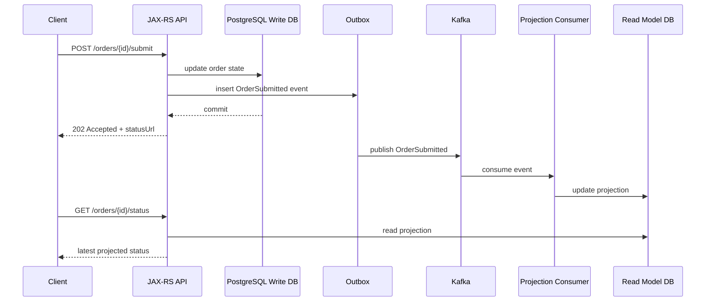

# Part 024 — Eventual Consistency and Read Models

> Fokus part ini: memahami konsekuensi ketika write model dan read model tidak update secara bersamaan, terutama pada sistem Java/JAX-RS enterprise yang memakai Kafka untuk event propagation, projection, cache invalidation, integration, dan workflow asynchronous.

Event-driven architecture sering terlihat elegan di diagram:

```text
Service A writes database
Service A emits event
Service B consumes event
Service B updates read model
UI reads Service B
```

Namun di production, ada jeda waktu antara write dan read model update. Jeda ini menciptakan **eventual consistency**.

Eventual consistency bukan bug. Ia adalah konsekuensi desain. Yang menjadi bug adalah ketika API, UX, test, customer support, atau downstream system menganggap data sudah konsisten secara instan padahal arsitekturnya asynchronous.

Dalam sistem CPQ/order management, efeknya bisa terlihat seperti:

- quote sudah submitted, tetapi status page masih menunjukkan draft,
- order sudah dibuat, tetapi search index belum menampilkan order,
- approval sudah diberikan, tetapi read model approval masih pending,
- cancellation sudah diterima, tetapi fulfillment projection masih active,
- Kafka event sudah published, tetapi consumer lag membuat dashboard terlambat,
- Redis cache belum invalidated,
- customer support melihat status berbeda dari backend source of truth.

Part ini membahas cara berpikir, mendesain, mengobservasi, dan mereview read model di atas Kafka.

---

## 1. Core Concept

### 1.1 Strong consistency

Strong consistency berarti setelah write berhasil, read berikutnya langsung melihat hasil write tersebut.

Contoh dalam satu PostgreSQL database:

```text
Transaction commits order.status = SUBMITTED
Next SELECT from same database sees SUBMITTED
```

Ini mudah dipahami jika read dan write memakai database yang sama dan transaction sudah commit.

### 1.2 Eventual consistency

Eventual consistency berarti setelah write berhasil, read model lain akan menyusul menjadi konsisten setelah propagation delay.

```text
T0: Order Service commits SUBMITTED
T1: Outbox publisher emits OrderSubmitted
T2: Projection Consumer consumes event
T3: Read Model DB updates order_status_view
T4: UI reads updated projection
```

Antara T0 dan T3/T4, user bisa membaca data lama.

### 1.3 Eventual consistency is a contract problem

Masalah terbesar eventual consistency bukan teknis saja. Ia adalah contract problem.

API harus menjawab:

- apakah response berarti perubahan sudah final?
- apakah downstream processing sudah selesai?
- apakah read endpoint membaca source of truth atau projection?
- apakah response boleh stale?
- berapa lama staleness yang diterima?
- bagaimana client mengetahui proses sudah selesai?
- bagaimana support/operator melihat status sebenarnya?

Jika contract tidak jelas, user akan menyebutnya “data inconsistent”, walaupun sistem bekerja sesuai desain.

---

## 2. Write Model vs Read Model

### 2.1 Write model

Write model adalah model yang menerima command dan menjaga invariant bisnis.

Contoh:

```text
Order Service database
- orders
- order_items
- order_state_history
- outbox_events
```

Write model harus menjaga aturan seperti:

- order tidak bisa submit jika quote expired,
- order tidak bisa cancel jika sudah completed,
- amendment harus mempertahankan version chain,
- approval state harus valid,
- tenant isolation harus ketat.

### 2.2 Read model

Read model adalah model yang dioptimalkan untuk query.

Contoh:

```text
order_search_view
customer_order_summary
quote_dashboard_projection
approval_worklist_view
fulfillment_status_view
```

Read model bisa berada di:

- PostgreSQL table terpisah,
- Elasticsearch/OpenSearch,
- Redis,
- Kafka compacted topic,
- Kafka Streams state store,
- ksqlDB materialized view,
- analytical warehouse,
- reporting DB.

Read model tidak selalu menjadi source of truth.

### 2.3 Projection

Projection adalah proses membangun read model dari event.

```text
OrderSubmitted
OrderApproved
OrderFulfillmentStarted
OrderCompleted
```

Projection consumer membaca event dan mengupdate view.

```sql
update order_summary_view
set status = 'SUBMITTED', submitted_at = ?
where order_id = ?;
```

Projection harus idempotent dan replay-safe.

---

## 3. Lifecycle of Eventual Consistency



The consistency window is between DB commit and projection update.

### 3.1 Sources of delay

- outbox polling interval,
- Debezium connector lag,
- Kafka producer retry,
- broker latency,
- consumer lag,
- consumer processing time,
- DB lock contention in projection DB,
- schema/deserialization error,
- DLQ routing,
- Kubernetes pod restart/rebalance,
- rate limiting,
- downstream dependency slowdown,
- cloud network issue.

### 3.2 Consistency window

The consistency window is:

```text
projection_updated_at - source_committed_at
```

Track this explicitly when the read model matters.

---

## 4. Read-Your-Writes Problem

The classic user-facing problem:

```text
User submits order
API returns success/accepted
User refreshes page
Old status still appears
```

This is **read-your-writes violation** from the user's perspective.

### 4.1 Why it happens

The write path and read path differ.

```text
Write: JAX-RS -> Order Service DB
Read: JAX-RS -> Projection DB / cache / search index
```

If projection lags, read returns stale data.

### 4.2 Design options

#### Option A: Read from source of truth immediately after command

For critical immediate status, return or query the write model.

```text
POST /orders/{id}/submit
returns current write-model status = SUBMISSION_REQUESTED
```

Useful when user needs immediate acknowledgement, not full downstream completion.

#### Option B: Return 202 Accepted and status URL

```http
HTTP/1.1 202 Accepted
Location: /orders/10001/submission-status/saga-789
```

Client polls status endpoint.

#### Option C: Include consistency warning in API contract

```json
{
  "orderId": "10001",
  "status": "SUBMISSION_REQUESTED",
  "processingStatus": "IN_PROGRESS",
  "readModelMayLag": true,
  "statusUrl": "/orders/10001/submission-status/saga-789"
}
```

#### Option D: Client-side optimistic UI

UI temporarily shows submitted state while backend projection catches up.

This requires careful recovery if command later fails.

#### Option E: Push update via SSE/WebSocket

For high-value workflows, status updates can be pushed.

Still, push channel must tolerate missed events and reconnect.

---

## 5. CQRS

CQRS stands for Command Query Responsibility Segregation.

It separates:

- command/write side: handles changes and enforces invariants,
- query/read side: serves optimized reads.

Kafka often connects the two sides.

```text
Write Model -> Event -> Projection Consumer -> Read Model
```

CQRS does not require event sourcing. Many systems use ordinary database writes plus outbox events to update projections.

### 5.1 When CQRS helps

- complex write invariant but simple read query,
- multiple read views for different users,
- search/dashboard requirements,
- high read volume,
- expensive joins in write DB,
- integration with analytics/reporting,
- asynchronous workflow status.

### 5.2 When CQRS is overkill

- simple CRUD,
- low volume,
- no complex read model,
- no independent scaling need,
- team lacks operational maturity,
- staleness is unacceptable,
- no clear owner for projection correctness.

CQRS adds moving parts. Use it where the trade-off is justified.

---

## 6. Projection Design

### 6.1 Projection from event-carried state

Event contains enough state to update projection.

```json
{
  "eventType": "OrderSubmitted",
  "orderId": "10001",
  "tenantId": "tenant-a",
  "status": "SUBMITTED",
  "submittedAt": "2026-07-11T10:15:30Z",
  "customerId": "cust-777",
  "totalAmount": 149.99,
  "currency": "USD"
}
```

Projection consumer does not need to call source service.

Pros:

- less runtime coupling,
- faster projection,
- better replay,
- fewer cascading failures.

Cons:

- event payload larger,
- schema governance more important,
- event may expose sensitive data,
- producer must own published state carefully.

### 6.2 Projection by lookup

Event contains ID only, consumer calls source service.

```json
{
  "eventType": "OrderSubmitted",
  "orderId": "10001"
}
```

Projection consumer calls Order API to fetch details.

Pros:

- smaller event,
- less data duplication in event.

Cons:

- runtime coupling,
- replay depends on current source state,
- source API load increases,
- historical reconstruction becomes difficult,
- failures cascade during replay.

For production replay safety, event-carried state transfer is often safer for projections.

### 6.3 Idempotent projection

Projection update must tolerate duplicate events.

Bad:

```sql
update summary
set submitted_count = submitted_count + 1
where tenant_id = ?;
```

If event is duplicated, count is wrong.

Better:

```sql
insert into processed_projection_event(event_id, projection_name, processed_at)
values (?, ?, now())
on conflict do nothing;
```

Then update only if insert succeeded.

For state projection:

```sql
update order_summary
set status = ?, last_event_id = ?, last_event_time = ?
where order_id = ?
  and (last_event_time is null or last_event_time <= ?);
```

But event_time ordering alone can be tricky. Prefer domain version/sequence when available.

### 6.4 Ordering and version

A projection should know whether incoming event is newer than current state.

Useful fields:

```text
aggregateVersion
stateVersion
eventTime
sequenceNumber
sourceCommitTimestamp
```

Example:

```sql
update order_projection
set status = ?, aggregate_version = ?
where order_id = ?
  and aggregate_version < ?;
```

Without versioning, out-of-order replay can regress projection state.

---

## 7. Materialized Views

A materialized view is a precomputed query result.

In Kafka ecosystem, it may be implemented with:

- plain consumer + PostgreSQL projection table,
- Kafka Streams state store,
- ksqlDB table,
- compacted Kafka topic,
- search index.

### 7.1 Plain consumer + PostgreSQL

Good when:

- team needs SQL query/debugging,
- projection requires relational constraints,
- support team needs direct operational view,
- projection is part of service database.

Risk:

- DB write bottleneck,
- locking/contention,
- migration complexity,
- replay can overload DB.

### 7.2 Kafka Streams state store

Good when:

- stream processing is continuous,
- joins/aggregations/windowing needed,
- low-latency local state useful,
- output topic feeds other services.

Risk:

- RocksDB operational complexity,
- state restoration time,
- internal topic management,
- topology evolution risk.

### 7.3 ksqlDB materialized view

Good when:

- SQL-like stream processing is desired,
- query logic is relatively simple,
- operational model is accepted by platform team.

Risk:

- query lifecycle governance,
- scaling limitations,
- debugging abstraction,
- compatibility differences,
- ownership ambiguity.

### 7.4 Compacted topic as materialized state

A compacted topic can hold latest value per key.

```text
key = orderId
value = latest OrderSummary
```

Good for distributing latest state. But it is not a relational query engine.

---

## 8. Cache Invalidation with Kafka

Kafka is often used to invalidate Redis or application caches.

Example:

```text
CatalogItemUpdated -> invalidate catalog:item:{id}
PricingRuleChanged -> invalidate pricing:rule:{id}
OrderStatusChanged -> invalidate order:summary:{id}
```

### 8.1 Invalidation vs update

Invalidation:

```text
Delete cache key; next read reloads from source.
```

Update:

```text
Consumer writes new value to cache.
```

Invalidation is simpler and safer when cache value depends on complex source query.

Update is useful when low latency is required, but it risks stale overwrite if events arrive out of order.

### 8.2 Cache staleness risks

- invalidation event delayed,
- Redis unavailable during invalidation,
- cache repopulated from stale source,
- event replay invalidates too much,
- tenant-specific key incorrectly computed,
- TTL too long,
- no version check on cache update,
- local in-memory cache not invalidated.

### 8.3 Redis as read model

Redis can be a read model, but only if:

- rebuild path exists,
- TTL policy is intentional,
- stale data behavior is defined,
- memory pressure is monitored,
- event duplicate/out-of-order handling exists,
- fallback source is clear.

Do not treat Redis as durable source of truth unless explicitly designed and accepted.

---

## 9. API Contract and Staleness

A JAX-RS API should be explicit about read consistency.

### 9.1 Response from command endpoint

Bad:

```json
{
  "status": "SUCCESS"
}
```

Ambiguous: success of what? Request accepted? DB committed? Kafka published? Downstream completed?

Better:

```json
{
  "orderId": "10001",
  "commandStatus": "ACCEPTED",
  "workflowStatus": "IN_PROGRESS",
  "sagaId": "saga-789",
  "statusUrl": "/orders/10001/submission-status/saga-789",
  "message": "Order submission has been accepted and is being processed asynchronously."
}
```

### 9.2 Read endpoint metadata

For projection-backed endpoint:

```json
{
  "orderId": "10001",
  "status": "SUBMITTED",
  "projectionUpdatedAt": "2026-07-11T10:15:42Z",
  "sourceEventId": "evt-123",
  "sourceEventTime": "2026-07-11T10:15:30Z",
  "consistency": {
    "model": "EVENTUAL",
    "maxExpectedLagSeconds": 30
  }
}
```

Not every API needs this much metadata exposed publicly. But internally, projection freshness must be observable.

### 9.3 Consistency SLA

Define expected lag:

```text
P50 projection lag < 1s
P95 projection lag < 10s
P99 projection lag < 60s
Alert if lag > 5m for critical projection
```

Consistency SLA should be based on business impact, not wishful thinking.

---

## 10. Rebuild and Replay Projection

A projection is only production-safe if it can be rebuilt.

Reasons to rebuild:

- projection bug,
- schema evolution bug,
- missed events,
- data corruption,
- new derived field,
- migration to new read model,
- disaster recovery,
- cache/search index rebuild.

### 10.1 Rebuild strategies

#### Strategy A: Replay Kafka topic from earliest offset

Works if topic retention covers required history and events contain enough state.

Risk:

- retention may not include full history,
- old schema compatibility issues,
- replay overloads DB,
- duplicate side effects if projection not isolated.

#### Strategy B: Snapshot from source DB + replay tail events

Common pattern:

```text
1. Take source snapshot at time T
2. Build projection from snapshot
3. Replay events after T
4. Switch read traffic
```

Risk:

- snapshot consistency,
- event boundary correctness,
- source load,
- dual-read migration complexity.

#### Strategy C: Backfill events

Generate backfill events for missing historical state.

Risk:

- backfill event semantics differ from original event,
- consumers may treat backfill as real business event,
- ordering with live events complicated.

Use explicit event type/metadata:

```json
{
  "eventType": "OrderProjectionBackfillRequested",
  "backfillId": "bf-20260711",
  "isBackfill": true
}
```

### 10.2 Replay isolation

Do not replay into production side-effect consumers unless they are explicitly replay-safe.

Projection rebuild should often use:

- separate consumer group,
- separate output table/index,
- feature flag for cutover,
- throttling,
- dry-run validation,
- checksum/reconciliation.

---

## 11. Reconciliation

Reconciliation checks whether read model matches source of truth.

Examples:

```text
Order Service source says status = SUBMITTED
Projection says status = DRAFT
```

or:

```text
Fulfillment system says activation complete
Order read model says fulfillment pending
```

### 11.1 Reconciliation job design

A reconciliation job should:

- select candidate records,
- compare source and projection,
- classify mismatch,
- emit repair event or update projection,
- produce audit trail,
- avoid unsafe overwrites,
- throttle load,
- expose metrics.

### 11.2 Mismatch classification

```text
PROJECTION_LAG
MISSING_EVENT
DUPLICATE_EVENT_EFFECT
OUT_OF_ORDER_EVENT
SCHEMA_MAPPING_BUG
MANUAL_UPDATE_NOT_PROPAGATED
SOURCE_OF_TRUTH_CONFLICT
UNKNOWN
```

Do not lump all mismatch under “data sync issue”. Classification drives safe repair.

---

## 12. Observability

### 12.1 Projection lag

Measure:

```text
now - source_event_time
projection_updated_at - source_event_time
consumer_commit_time - event_time
```

Recommended metrics:

```text
projection_lag_seconds{projection, topic, consumer_group}
projection_update_total{projection, event_type}
projection_update_failed_total{projection, event_type, reason}
projection_duplicate_event_total{projection}
projection_out_of_order_event_total{projection}
projection_rebuild_duration_seconds{projection}
projection_reconciliation_mismatch_total{projection, type}
```

### 12.2 Consumer lag is not enough

Consumer lag tells how far consumer is behind Kafka log. It does not always tell business staleness.

Example:

- consumer lag = 0,
- projection update fails silently due to DB constraint,
- read model stale.

Track both Kafka lag and projection health.

### 12.3 Freshness dashboard

A good dashboard includes:

- consumer group lag,
- projection lag percentile,
- last successful event time,
- last successful projection update time,
- failed update rate,
- DLQ count,
- stale record count,
- reconciliation mismatch count,
- rebuild status,
- top slow partitions/tenants if applicable.

---

## 13. Failure Modes

| Failure mode | Symptom | Detection | Mitigation |
|---|---|---|---|
| Consumer lag | Read model behind | consumer lag + projection lag | scale consumer, fix slow handler, tune DB |
| Projection handler error | Some events not applied | error metric, DLQ, logs | fix bug, replay DLQ |
| Duplicate event | Count inflated or repeated transition | processed event table, anomaly | idempotency guard |
| Out-of-order event | Status regresses | aggregate version check | ignore stale event/reconcile |
| Cache invalidation missed | UI shows old data | cache age, support report | TTL fallback, replay invalidation |
| Schema change broke projection | Deserialization failure | DLQ/schema errors | compatibility fix, replay |
| Retention too short | Cannot rebuild from topic | replay failure | snapshot/backfill strategy |
| Rebuild overloads DB | DB latency spike | DB metrics | throttle, batch, isolate |
| Source lookup projection fails | consumer calls source API and gets timeout | API error rate | event-carried state, retry/DLQ |
| Multi-tenant leakage | wrong tenant data in read model | audit/security finding | tenant key validation, tests |

---

## 14. PostgreSQL Implementation Pattern

### 14.1 Projection table

```sql
create table order_summary_projection (
  tenant_id varchar(64) not null,
  order_id varchar(64) not null,
  quote_id varchar(64),
  customer_id varchar(64),
  status varchar(64) not null,
  aggregate_version bigint not null,
  source_event_id uuid not null,
  source_event_time timestamptz not null,
  projection_updated_at timestamptz not null,
  primary key (tenant_id, order_id)
);
```

### 14.2 Processed event table

```sql
create table projection_processed_event (
  projection_name varchar(128) not null,
  event_id uuid not null,
  processed_at timestamptz not null,
  primary key (projection_name, event_id)
);
```

### 14.3 Idempotent upsert

```sql
insert into projection_processed_event(projection_name, event_id, processed_at)
values (:projectionName, :eventId, now())
on conflict do nothing;
```

If insert count is zero, event was already processed.

Then:

```sql
insert into order_summary_projection(
  tenant_id,
  order_id,
  quote_id,
  customer_id,
  status,
  aggregate_version,
  source_event_id,
  source_event_time,
  projection_updated_at
)
values (...)
on conflict (tenant_id, order_id)
do update set
  status = excluded.status,
  aggregate_version = excluded.aggregate_version,
  source_event_id = excluded.source_event_id,
  source_event_time = excluded.source_event_time,
  projection_updated_at = now()
where order_summary_projection.aggregate_version < excluded.aggregate_version;
```

This protects against stale events regressing projection state.

---

## 15. MyBatis/JDBC Considerations

When using MyBatis/JDBC:

- ensure processed-event insert and projection update are in the same transaction,
- check update counts to detect duplicate/stale events,
- handle unique constraint violation explicitly,
- avoid auto-commit per statement for projection update flow,
- batch carefully during replay,
- expose slow query metrics,
- index projection query paths,
- avoid unbounded transaction size in replay.

Example flow:

```text
BEGIN
  insert processed_event
  if inserted:
    upsert projection with version guard
COMMIT
commit Kafka offset
```

Do not commit Kafka offset before DB commit.

---

## 16. Kubernetes and Scaling Considerations

Projection consumers in Kubernetes must account for:

- partition count vs replica count,
- rolling restart causing rebalance,
- DB connection pool saturation,
- CPU throttling increasing lag,
- memory pressure during batch processing,
- long replay causing max.poll.interval.ms issues,
- graceful shutdown before offset commit,
- backpressure when projection DB slows down.

Scaling consumers may not help if bottleneck is PostgreSQL write throughput or a hot partition.

### 16.1 Backpressure strategy

Options:

- reduce max.poll.records,
- pause partitions when DB is overloaded,
- throttle replay jobs,
- increase DB pool carefully,
- partition projection table/index better,
- use batch upserts,
- separate live consumer and rebuild consumer,
- route high-volume projection to stream processor/search pipeline.

---

## 17. Security and Privacy

Read models often duplicate data. This multiplies privacy/security risk.

Ask:

- Does projection store PII?
- Is tenant isolation enforced in primary key and query filters?
- Does projection store payload snapshots unnecessarily?
- Are DLQ records exposing sensitive projection data?
- Is Redis cache encrypted/protected as required?
- Are search indexes access-controlled?
- Does retention match privacy requirement?
- Can replay resurrect data that should have been deleted?

Projection schema review should include data classification.

---

## 18. PR Review Checklist

### Architecture

- Is this endpoint reading source of truth or projection?
- Is staleness acceptable for this use case?
- Is consistency expectation documented?
- Is read-your-writes behavior defined?
- Is CQRS justified or overkill?

### Event and projection design

- Does event contain enough state for projection?
- Is projection idempotent?
- Is out-of-order handling defined?
- Is aggregate version or sequence available?
- Is replay safe?
- Is rebuild path defined?

### API contract

- Does command endpoint return accurate status?
- Should it return 202 Accepted?
- Is status URL available for async workflow?
- Does read endpoint expose freshness internally?
- Are stale reads acceptable in UI/business process?

### Database and cache

- Are projection tables indexed correctly?
- Are processed event IDs stored?
- Are DB transaction boundaries correct?
- Is cache invalidation safe?
- Is Redis TTL/versioning defined?

### Operations

- Is projection lag monitored?
- Is consumer lag monitored?
- Is DLQ monitored?
- Is reconciliation available?
- Is replay/rebuild runbook available?
- Is load test done for replay volume?

### Security/privacy

- Does projection duplicate sensitive data?
- Are logs redacted?
- Is tenant isolation tested?
- Is retention defined?
- Is replay access controlled?

---

## 19. Internal Verification Checklist

Use this checklist against the actual internal environment.

### Architecture

- Verify which read endpoints use source DB vs projection/read model.
- Verify whether CQRS is used explicitly or implicitly.
- Verify which projections are built from Kafka events.
- Verify whether Kafka Streams, ksqlDB, plain consumers, or ETL jobs build read models.
- Verify which read models are customer-facing vs internal-only.

### Kafka and consumer behavior

- Verify projection topics and consumer groups.
- Verify partition key and ordering assumptions.
- Verify consumer offset commit strategy.
- Verify retry/DLQ policy for projection consumers.
- Verify replay safety of projection consumers.
- Verify retention is enough for rebuild requirements.

### PostgreSQL/MyBatis/JDBC

- Verify projection table schemas.
- Verify processed event/inbox table.
- Verify aggregate version or sequence handling.
- Verify transaction boundaries in MyBatis/JDBC.
- Verify indexes and query plans for read endpoints.
- Verify migration strategy for projection schema changes.

### Redis/cache/search

- Verify whether Redis is cache only or read model.
- Verify cache invalidation topics/events.
- Verify TTL policy.
- Verify local in-memory cache invalidation if any.
- Verify search index rebuild process.
- Verify stale cache incident history.

### Observability and operations

- Verify consumer lag dashboard.
- Verify projection lag/freshness dashboard.
- Verify stale record detection.
- Verify reconciliation job and mismatch report.
- Verify replay/rebuild runbook.
- Verify owner for each read model.
- Verify support/operator visibility into source vs projection status.

### Product/API behavior

- Verify whether API documentation states eventual consistency.
- Verify whether command endpoints use 202 Accepted where appropriate.
- Verify whether status endpoint exists for async workflows.
- Verify UI behavior after command submission.
- Verify customer support playbook for inconsistent status reports.

---

## 20. Common Anti-Patterns

### Anti-pattern 1: Pretending async is sync

API returns success as if downstream process completed, while Kafka workflow is still running.

### Anti-pattern 2: Projection without owner

A read model exists, but no team owns freshness, correctness, rebuild, or incident response.

### Anti-pattern 3: No projection version guard

Out-of-order events can overwrite newer state with older state.

### Anti-pattern 4: No replay plan

Projection is built from Kafka, but topic retention is too short to rebuild.

### Anti-pattern 5: Cache invalidation as best effort only

Cache invalidation failure is ignored, causing persistent stale UI.

### Anti-pattern 6: Consumer lag as the only signal

Consumer lag is zero, but projection is still wrong due to handler failure.

### Anti-pattern 7: Read model as hidden source of truth

Other services start depending on projection as authoritative even though it is stale/derived.

---

## 21. Senior Engineer Mental Model

When reviewing eventual consistency, do not ask only:

> “Is the consumer running?”

Ask:

- What is the source of truth?
- What is derived?
- What is the maximum acceptable staleness?
- Is read-your-writes required?
- Is the API honest about async processing?
- Can stale data cause financial/customer/regulatory impact?
- How is projection lag measured?
- Can projection be rebuilt?
- Can replay corrupt state?
- Is reconciliation available?
- Who owns the read model?
- How does support know whether source or projection is correct?

Eventual consistency is manageable only when it is explicit, observable, and operationally recoverable.

---

## 22. Key Takeaways

- Eventual consistency is a design property, not an accident.
- The dangerous part is unclear API/UX/business expectation.
- Write model owns invariant; read model optimizes query.
- Projection consumers must be idempotent, ordered-aware, replay-safe, and observable.
- Read-your-writes issues must be handled with source reads, 202/status endpoint, optimistic UI, or clear contract.
- CQRS is useful but adds operational complexity.
- Projection lag must be measured separately from consumer lag.
- Redis/search/materialized views are derived state and need rebuild/reconciliation strategy.
- Replay without idempotency/version guard can corrupt read models.
- Senior engineers must make consistency windows visible and bounded by business SLA.
