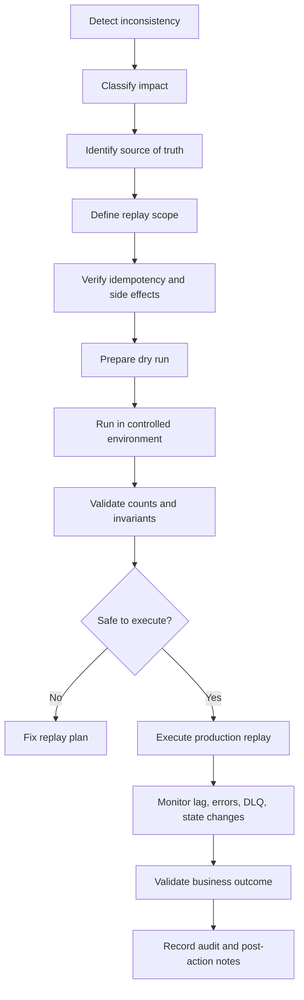
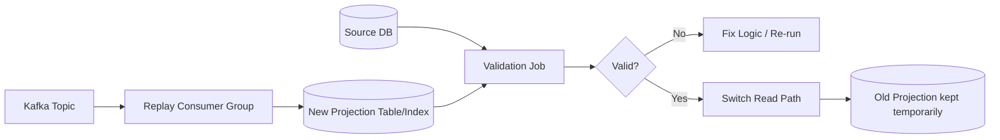

# Part 025 — Reconciliation and Replay

> Fokus part ini: memahami bagaimana memperbaiki, membangun ulang, atau memproses ulang data/event di sistem Kafka tanpa menciptakan kerusakan kedua. Replay adalah kemampuan penting, tetapi di production replay yang tidak aman sering lebih berbahaya daripada incident awal.

---

## 1. Core Mental Model

Kafka menyimpan event sebagai log. Karena event dapat disimpan dalam rentang waktu tertentu, sistem bisa melakukan **replay**: membaca ulang event lama untuk membangun ulang state, memperbaiki projection, mengisi data yang hilang, atau memproses ulang perubahan setelah bug diperbaiki.

Tetapi replay bukan sekadar “reset offset lalu jalankan consumer lagi”. Replay adalah operasi production yang menyentuh:

- correctness state bisnis,
- idempotency consumer,
- duplicate prevention,
- ordering,
- schema compatibility,
- side effect eksternal,
- audit trail,
- observability,
- authorization,
- dan customer impact.

Dalam enterprise CPQ/order management, replay bisa mengubah read model order, status approval, fulfillment projection, billing integration marker, audit trail, atau downstream state. Karena itu replay harus diperlakukan seperti **controlled data repair operation**, bukan debugging shortcut.

---

## 2. Terminology

| Istilah | Makna | Risiko utama |
|---|---|---|
| Reconciliation | Membandingkan dua sumber data untuk menemukan mismatch dan memperbaikinya | Salah menentukan source of truth |
| Replay | Membaca ulang event lama dari Kafka untuk diproses kembali | Duplicate side effect |
| Backfill | Mengisi data historis yang sebelumnya belum ada atau belum lengkap | Schema mismatch, volume spike |
| Reprocessing | Memproses ulang data/event setelah logic diperbaiki | Logic baru tidak kompatibel dengan event lama |
| Offset reset | Mengubah posisi consumer group untuk membaca ulang event | Semua event lama terbaca ulang secara massal |
| Consumer reset | Membuat consumer group baru atau mengubah offset existing group | Parallel duplicate processing |
| Topic replay | Menggunakan topic source sebagai input ulang untuk membangun output baru | Ordering dan retention limitation |
| Projection rebuild | Membangun ulang read model/materialized view dari event | Projection downtime atau stale read |
| Data repair | Perbaikan targeted terhadap data salah | Audit dan approval required |
| DLQ replay | Memproses ulang event dari dead-letter topic | Poison event bisa kembali gagal |

---

## 3. Why Reconciliation Exists

Distributed systems tidak gagal secara simetris. Dalam flow Kafka + PostgreSQL + microservices, error bisa muncul di banyak titik:

1. Producer berhasil menulis DB tetapi gagal publish event.
2. Producer publish event tetapi metadata salah.
3. Consumer menerima event tetapi crash sebelum commit offset.
4. Consumer menulis DB tetapi gagal memanggil external system.
5. Projection consumer tertinggal jauh.
6. Kafka Connect berhenti sementara replication slot terus menahan WAL.
7. Schema berubah dan sebagian consumer gagal deserialize.
8. Retry topic/DLQ menumpuk tanpa replay.
9. Bug logic menyebabkan read model salah untuk event periode tertentu.
10. Manual data correction dilakukan di DB tanpa event kompensasi.

Reconciliation menjawab pertanyaan: **apakah state antar sistem masih konsisten dengan fakta bisnis yang seharusnya?**

Replay menjawab pertanyaan: **bagaimana memproses ulang input yang valid untuk membentuk state yang benar?**

---

## 4. Source of Truth Must Be Explicit

Sebelum replay, tentukan source of truth.

Contoh dalam sistem quote/order:

| Data | Kemungkinan source of truth | Catatan |
|---|---|---|
| Quote draft | Quote service database | Event mungkin hanya integration notification |
| Order lifecycle state | Order service database atau orchestrator state | Perlu cek state machine internal |
| Catalog item | Catalog service database | Event catalog bisa dipakai untuk cache/projection |
| Pricing result | Pricing service atau pricing calculation snapshot | Replay pricing bisa berbahaya jika rule berubah |
| Approval decision | Approval service database/audit | Jangan reconstruct tanpa audit trail |
| Fulfillment status | Fulfillment/OSS/BSS downstream | Kafka event mungkin hanya mirror |
| Read model | Projection database/cache | Bisa dibangun ulang dari event jika event lengkap |

Rule penting:

> Jangan replay sebelum tahu apakah event adalah source of truth, derived signal, audit copy, atau integration notification.

---

## 5. Types of Replay

### 5.1 Full Topic Replay

Membaca ulang topic dari awal atau dari timestamp tertentu.

Cocok untuk:

- rebuild projection,
- migration read model,
- re-index search,
- recompute aggregate,
- rehydrate cache.

Berbahaya untuk:

- consumer yang memanggil external API,
- consumer yang mengirim email/notifikasi,
- consumer yang membuat order downstream,
- consumer yang menghasilkan irreversible side effect.

### 5.2 Targeted Replay

Hanya replay subset event berdasarkan event ID, aggregate ID, tenant ID, time window, atau DLQ records.

Cocok untuk:

- memperbaiki affected orders,
- replay DLQ setelah bug fix,
- repair projection untuk tenant tertentu,
- backfill event tipe tertentu.

### 5.3 Projection Rebuild

Membuat ulang read model dari event log.

Pattern aman:

1. Build projection baru di table/index baru.
2. Validasi jumlah, checksum, sample, business invariant.
3. Switch read traffic secara controlled.
4. Keep old projection untuk rollback sementara.
5. Cleanup setelah confidence cukup.

### 5.4 DLQ Replay

Memproses ulang event dari DLQ.

Harus dicek:

- error sudah fixed atau belum,
- event masih valid secara schema,
- event masih relevan secara bisnis,
- replay akan masuk consumer utama atau dedicated repair consumer,
- retry count dan original metadata tetap dipertahankan.

### 5.5 Backfill Event

Membuat event historis yang sebelumnya tidak pernah dipublish.

Ini bukan replay murni. Ini event creation operation.

Risiko:

- event time vs publish time membingungkan,
- consumer menganggap event baru sebagai business update baru,
- schema saat ini tidak cocok dengan data historis,
- duplicate dengan event lama yang tidak terdokumentasi.

---

## 6. Replay Lifecycle



Replay harus punya lifecycle eksplisit. Tanpa lifecycle, replay berubah menjadi tindakan operator ad hoc.

---

## 7. Replay Safety Principles

### 7.1 Idempotency Is Mandatory

Consumer replay-safe harus dapat menerima event yang sama lebih dari sekali tanpa menghasilkan state atau side effect ganda.

Minimal harus ada salah satu:

- `processed_event` table,
- inbox table,
- unique business constraint,
- idempotency key,
- natural idempotency pada state transition,
- deterministic projection overwrite.

Contoh aman:

```sql
INSERT INTO processed_event (event_id, consumer_name, processed_at)
VALUES (:event_id, :consumer_name, now())
ON CONFLICT (event_id, consumer_name) DO NOTHING;
```

Jika insert tidak terjadi karena conflict, consumer tahu event sudah pernah diproses.

### 7.2 Side Effects Must Be Controlled

Side effect berbahaya saat replay:

- call external API,
- create downstream order,
- send notification,
- charge billing,
- mutate third-party state,
- generate irreversible audit entry,
- trigger workflow baru.

Pattern aman:

- disable side effect saat replay jika consumer mendukung replay mode,
- gunakan dedicated replay consumer,
- gunakan idempotency key saat memanggil external service,
- tulis repair event alih-alih replay event asli,
- lakukan dry run dan compare output.

### 7.3 Event Time Must Be Preserved

Replay tidak mengubah fakta bahwa event lama terjadi di masa lalu.

Bedakan:

- `event_time`: waktu kejadian bisnis,
- `published_at`: waktu event dipublish,
- `processed_at`: waktu consumer memproses,
- `replayed_at`: waktu event diproses ulang.

Jika projection memakai `now()` sebagai waktu bisnis, replay akan merusak histori.

### 7.4 Schema Compatibility Must Be Verified

Consumer versi baru mungkin membaca event lama. Event lama mungkin tidak punya field yang sekarang dianggap wajib.

Sebelum replay:

- cek schema evolution,
- cek default values,
- cek enum evolution,
- cek field removal/rename,
- cek deserializer compatibility,
- cek behavior terhadap unknown fields.

### 7.5 Ordering Assumption Must Be Checked

Replay dari satu topic belum tentu mempertahankan ordering global. Kafka hanya menjamin ordering per partition.

Jika consumer membutuhkan ordering per order/quote/customer, pastikan:

- partition key historis benar,
- replay tidak parallelize lintas aggregate yang sama,
- event lama tidak dicampur dengan event baru tanpa guard,
- consumer bisa handle out-of-order event.

---

## 8. Offset Reset: Powerful but Dangerous

Offset reset berarti mengubah posisi baca consumer group.

Common scenarios:

- reset ke earliest,
- reset ke latest,
- reset ke timestamp,
- reset untuk topic tertentu,
- reset untuk partition tertentu,
- membuat consumer group baru.

Bahaya offset reset:

1. Consumer memproses ulang semua event lama.
2. Downstream side effect terjadi lagi.
3. Lag melonjak besar.
4. Consumer group existing terganggu.
5. Operator salah reset group production.
6. Offset reset dilakukan saat consumer masih running.
7. Reset dilakukan tanpa memperhitungkan retention.

Production rule:

> Jangan reset offset consumer group production sebelum consumer dimatikan, scope jelas, backup offset dicatat, dan rollback plan tersedia.

Checklist sebelum offset reset:

- consumer group mana,
- topic mana,
- partition mana,
- offset sebelum reset,
- offset target,
- alasan reset,
- expected record count,
- expected duration,
- side effect risk,
- approval,
- rollback plan.

---

## 9. Reconciliation Job Design

Reconciliation job adalah proses periodik atau ad hoc untuk mendeteksi mismatch.

### 9.1 Input

Possible inputs:

- source database,
- projection database,
- event log,
- outbox table,
- inbox table,
- DLQ topic,
- audit table,
- downstream system export,
- Kafka consumer lag,
- connector status.

### 9.2 Output

Possible outputs:

- mismatch report,
- repair candidate list,
- replay command list,
- compensating event,
- manual work item,
- dashboard metric,
- incident evidence.

### 9.3 Reconciliation Dimensions

| Dimension | Example check |
|---|---|
| Existence | Order exists in DB but missing in projection |
| Status | Order status differs between source and read model |
| Count | Number of order items differs |
| Sequence | Event sequence has gap or duplicate |
| Time | Projection not updated after expected SLA |
| Ownership | Event produced by unexpected service |
| Schema | Event version not supported by consumer |
| Side effect | Downstream fulfillment not triggered |

---

## 10. Replay Architecture Patterns

### 10.1 Same Consumer Replay

Existing consumer group offset is reset and same consumer processes events again.

Pros:

- simple,
- same code path,
- no new infrastructure.

Cons:

- high risk,
- affects production group,
- hard to isolate side effects,
- dangerous if consumer is not idempotent.

Use only if consumer is explicitly replay-safe.

### 10.2 New Consumer Group Replay

A new consumer group reads old events and writes to target repair/projection.

Pros:

- isolated,
- does not disturb production offset,
- easier to dry-run,
- good for projection rebuild.

Cons:

- duplicate processing risk if writing same target,
- additional compute load,
- needs clear naming and cleanup.

### 10.3 Dedicated Replay Tool

A controlled tool reads event by scope and executes repair logic.

Pros:

- explicit audit,
- can support dry-run,
- can throttle,
- can validate per aggregate.

Cons:

- more implementation effort,
- can diverge from normal consumer behavior,
- must be secured tightly.

### 10.4 Repair Event Pattern

Instead of replaying original event, publish a new correction event.

Pros:

- explicit business correction,
- audit-friendly,
- avoids hidden mutation.

Cons:

- requires domain model support,
- consumers must understand correction semantics,
- not suitable for all projection rebuilds.

---

## 11. Projection Rebuild Pattern

Projection rebuild should avoid in-place mutation when possible.

Safer flow:



Important practices:

- Use new projection table/index.
- Make rebuild idempotent.
- Track rebuild version.
- Store high-water mark offset/timestamp.
- Validate counts and business invariants.
- Avoid partial switch by tenant unless designed.
- Keep rollback path.

---

## 12. Replay and PostgreSQL/MyBatis/JDBC

Replay often writes to PostgreSQL. This creates several concerns.

### 12.1 Transaction Boundary

A replayed event should be processed in one clear database transaction:

1. Insert inbox/processed event marker.
2. Apply business/projection update.
3. Record replay metadata if needed.
4. Commit.
5. Commit Kafka offset only after DB commit.

With MyBatis/JDBC, verify:

- who owns the transaction,
- whether autocommit is disabled,
- whether mapper calls share the same connection,
- whether retry reuses stale session,
- whether exception handling triggers rollback.

### 12.2 Upsert Instead of Blind Insert

Projection replay often should use deterministic upsert:

```sql
INSERT INTO order_projection (order_id, status, updated_at, source_event_id)
VALUES (:order_id, :status, :event_time, :event_id)
ON CONFLICT (order_id)
DO UPDATE SET
  status = EXCLUDED.status,
  updated_at = EXCLUDED.updated_at,
  source_event_id = EXCLUDED.source_event_id
WHERE order_projection.updated_at <= EXCLUDED.updated_at;
```

The `WHERE` guard prevents older replayed event from overwriting newer state if event ordering is not perfect.

### 12.3 Repair Metadata

For auditability, repair/replay writes should capture:

- replay batch ID,
- operator/service identity,
- source topic,
- source partition,
- source offset,
- source event ID,
- replay reason,
- replay timestamp,
- dry-run vs executed flag.

---

## 13. Replay and Kubernetes

Kafka replay in Kubernetes usually runs as:

- temporary Job,
- dedicated Deployment with limited replicas,
- existing consumer scaled up/down,
- admin CLI pod,
- workflow-run repair process.

Production concerns:

- resource limits can throttle replay and create long runtime,
- too many replicas can overload DB,
- pod restart can duplicate work,
- HPA can scale replay unexpectedly,
- NetworkPolicy may block Kafka/Admin access,
- secret mount must be valid,
- job logs may contain sensitive data,
- replay job should not run forever.

Recommended controls:

- explicit replay batch ID,
- max records or time window,
- rate limit,
- dry-run mode,
- stop condition,
- restart policy reviewed,
- separate service account,
- restricted Kafka ACL,
- alert during replay.

---

## 14. Replay in Cloud, On-Prem, and Hybrid

### AWS / Managed Kafka

Verify:

- MSK security group allows replay job,
- IAM/SASL credentials valid,
- CloudWatch metrics visible,
- cross-account topic access if relevant,
- replay traffic does not cross expensive network path unexpectedly,
- broker throughput quota/capacity.

### Azure / Event Hubs Kafka-Compatible Endpoint

Verify:

- Kafka compatibility limitations,
- consumer group behavior,
- retention limit,
- throughput units/capacity,
- network private endpoint,
- Azure Monitor metrics.

### On-Prem / Hybrid

Verify:

- firewall path,
- TLS certificate validity,
- WAN bandwidth,
- MirrorMaker/Cluster Linking lag,
- offset translation if replaying across cluster,
- operational responsibility boundary.

---

## 15. Failure Modes

| Failure mode | Symptom | Root concern | Mitigation |
|---|---|---|---|
| Replay duplicates side effect | Duplicate downstream order/email/API call | Consumer not idempotent | Inbox, idempotency key, disable side effect |
| Offset reset wrong group | Unexpected mass reprocessing | Operator error | Approval, backup offsets, dry-run |
| Old event breaks new consumer | Deserialization or validation error | Schema incompatibility | Schema compatibility test, fallback handling |
| Projection overwritten by stale event | Newer state becomes older | Ordering/time guard missing | Event-time guard, version check |
| Replay overloads DB | DB CPU/lock spike | No throttling | Rate limit, batch size, off-peak window |
| DLQ replay loops back to DLQ | DLQ spike persists | Root cause not fixed | Validate fix before replay |
| Retention removed needed event | Cannot replay from Kafka | Retention too short | Archive, compacted source, backup, source DB repair |
| Replay hides audit trail | State changes without explanation | No repair metadata | Replay batch audit table |
| Backfill creates fake history | Consumers misinterpret event time | Metadata not explicit | Distinguish event_time, backfilled_at |
| New consumer group left running | Duplicate continuous processing | Cleanup failure | TTL, ownership, explicit shutdown |

---

## 16. Production Replay Runbook Template

### 16.1 Pre-Check

- What incident or mismatch is being fixed?
- What is the source of truth?
- What topic, partition, offset, event ID, aggregate ID, or time range is affected?
- What services consume these events?
- Which consumers have irreversible side effects?
- Is the target consumer replay-safe?
- Is schema compatibility verified?
- Is retention sufficient?
- Is there a dry-run result?
- Who approved execution?

### 16.2 Execution Plan

- Replay method: offset reset, new group, DLQ replay, repair event, or dedicated tool.
- Scope: exact event set or time window.
- Rate limit: records/sec or batch size.
- Target environment and service identity.
- Expected duration.
- Stop condition.
- Rollback or mitigation plan.

### 16.3 Monitoring During Replay

Watch:

- consumer lag,
- producer error rate,
- consumer processing latency,
- DLQ growth,
- DB CPU/locks/connection pool,
- external API error rate,
- topic throughput,
- broker request latency,
- application error logs,
- business invariant dashboard.

### 16.4 Post-Validation

Validate:

- record counts,
- affected aggregate count,
- projection count,
- status distribution,
- duplicate count,
- DLQ count,
- reconciliation report,
- sample business cases,
- audit record completeness.

---

## 17. Debugging Replay Issues

When replay fails, avoid guessing. Use layered diagnosis.

### 17.1 Kafka Layer

Check:

- topic exists,
- partition count,
- retention window,
- offset range,
- consumer group state,
- lag,
- rebalance frequency,
- auth/ACL errors,
- broker request latency.

### 17.2 Serialization Layer

Check:

- schema ID,
- event version,
- compatibility mode,
- deserializer error,
- unknown field behavior,
- required field without default.

### 17.3 Application Layer

Check:

- handler exception,
- validation failure,
- idempotency conflict,
- state transition rejection,
- null metadata,
- correlation ID availability.

### 17.4 Database Layer

Check:

- unique constraint violation,
- lock wait,
- deadlock,
- connection pool exhaustion,
- slow query,
- transaction rollback.

### 17.5 Business Layer

Check:

- event still relevant,
- aggregate already closed/cancelled,
- state transition valid,
- downstream state already moved forward,
- manual intervention required.

---

## 18. Replay Decision Matrix

| Situation | Preferred approach |
|---|---|
| Projection corrupted due to bug | Fix projection logic, rebuild into new table/index, validate, switch |
| A few DLQ events after transient outage | Replay DLQ after dependency stable |
| Missing event because producer failed before publish | Generate repair event or use outbox reconciliation |
| Consumer processed event but crashed before offset commit | Rely on idempotency and reprocess |
| Consumer performed external side effect twice | Stop replay, repair downstream manually, add idempotency |
| Schema migration broke old events | Add compatibility handler or migration adapter |
| Need historical events not in Kafka retention | Use source DB export/backfill, mark as backfilled |
| Need rebuild cache | Use new consumer group, deterministic cache writes |
| Need audit-correct business correction | Publish explicit correction/compensation event |

---

## 19. PR Review Checklist

When reviewing replay/reconciliation code or architecture, ask:

- What exact inconsistency does this fix?
- What is the source of truth?
- Is replay scope bounded?
- Is there a dry-run mode?
- Is the consumer idempotent?
- Are external side effects disabled or idempotent?
- Are event time and replay time separated?
- Is schema compatibility tested against old events?
- Is ordering assumption documented?
- Is there throttling?
- Is there audit metadata?
- Is there post-replay validation?
- Is the job safe to restart?
- Can the operation be paused/stopped?
- Are permissions limited?
- Are sensitive payloads protected in logs?
- Is there a rollback or mitigation plan?

---

## 20. Internal Verification Checklist

Cek di internal CSG/team:

- Apakah ada replay runbook resmi?
- Siapa yang boleh melakukan offset reset?
- Tool apa yang digunakan untuk inspect topic dan consumer group?
- Apakah ada policy backup offset sebelum reset?
- Apakah consumer utama replay-safe?
- Apakah ada dedicated replay consumer/tool?
- Apakah DLQ replay pernah dilakukan?
- Apakah ada reconciliation job untuk quote/order/projection?
- Apakah event lama masih compatible dengan consumer saat ini?
- Apakah projection rebuild punya pattern table/index baru?
- Apakah replay operation dicatat dalam audit table atau incident note?
- Apakah external side effect consumer punya idempotency key?
- Apakah ada dashboard saat replay berlangsung?
- Apakah database capacity cukup untuk replay?
- Apakah Kafka retention cukup untuk recovery target?
- Apakah privacy/security review diperlukan sebelum replay data sensitif?

---

## 21. Common Anti-Patterns

### Anti-pattern: Reset Offset as First Response

Offset reset harus menjadi controlled recovery step, bukan reaksi pertama ketika consumer error.

### Anti-pattern: Replay Without Idempotency

Replay tanpa idempotency sama seperti menjalankan side effect dua kali dan berharap sistem memaafkan.

### Anti-pattern: Rebuild Projection In Place

In-place rebuild membuat read model berada di state setengah benar dan sulit rollback.

### Anti-pattern: Treat Backfill as Normal Event

Backfill harus punya metadata eksplisit agar consumer tahu ini data historis, bukan kejadian baru.

### Anti-pattern: Ignore Business Validity

Event lama belum tentu masih valid jika aggregate sudah masuk terminal state.

### Anti-pattern: No Audit Trail

Replay yang tidak tercatat akan menjadi misteri di incident berikutnya.

---

## 22. Senior Engineer Heuristics

Gunakan heuristik berikut:

1. **Replay is a write operation.** Walaupun Kafka hanya dibaca, efek akhirnya biasanya menulis state.
2. **Replay is not free.** Ia menggunakan broker, network, DB, CPU, dan mental bandwidth operator.
3. **Replay requires business consent.** Terutama untuk order, billing, fulfillment, approval, dan audit.
4. **Replay requires bounded scope.** “Replay semua” jarang menjadi jawaban pertama yang aman.
5. **Replay readiness is designed before incident.** Bukan dibuat saat incident berjalan.
6. **Every replay should produce evidence.** Input, output, operator, waktu, scope, hasil validasi.

---

## 23. Final Summary

Reconciliation dan replay adalah kemampuan production-critical dalam Kafka-based systems. Kafka memberi kemampuan membaca ulang log, tetapi aplikasi yang menentukan apakah reprocessing aman atau merusak.

Untuk Java/JAX-RS enterprise backend, replay safety bergantung pada:

- idempotent consumer,
- inbox/processed event table,
- transaction boundary yang benar,
- side effect control,
- schema compatibility,
- event-time correctness,
- bounded replay scope,
- observability,
- audit trail,
- dan internal runbook yang jelas.

Target senior engineer bukan sekadar tahu cara reset offset. Targetnya adalah mampu menjawab: **apa yang akan berubah, apa yang bisa rusak, bagaimana membuktikan hasilnya benar, dan bagaimana menghindari incident kedua saat memperbaiki incident pertama.**
