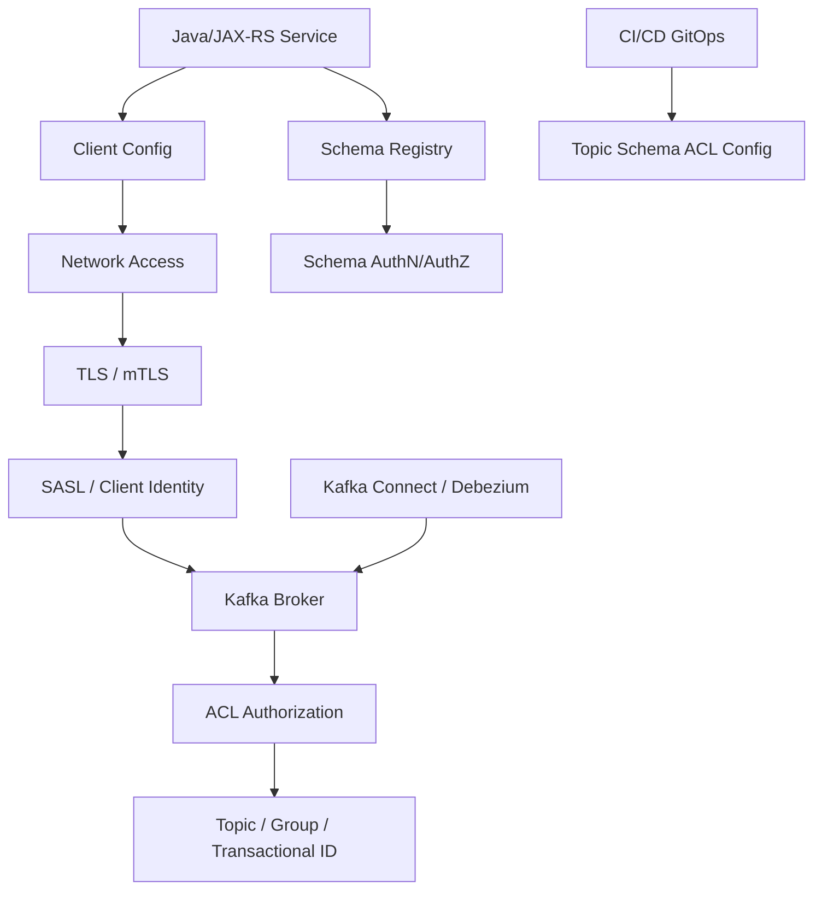
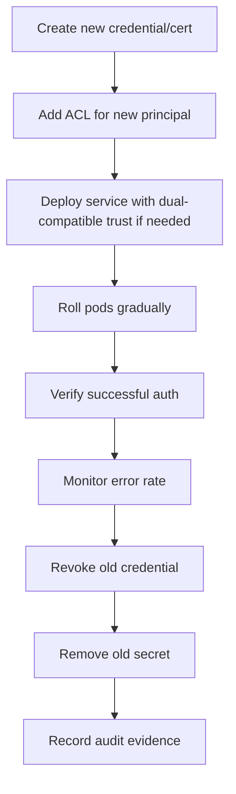

# Part 026 — Kafka Security

> Fokus part ini: memahami Kafka security sebagai kombinasi identity, encrypted transport, authorization, credential lifecycle, network isolation, auditability, dan operational discipline. Security Kafka bukan hanya “pakai SSL config”, tetapi memastikan producer, consumer, connector, schema registry, dan operator hanya dapat melakukan aksi yang benar di environment yang benar.

---

## 1. Core Mental Model

Kafka security menjawab lima pertanyaan utama:

1. **Who are you?** Authentication: client membuktikan identitasnya.
2. **Can this connection be trusted?** Transport security: traffic terenkripsi dan endpoint valid.
3. **What are you allowed to do?** Authorization: client hanya punya izin yang diperlukan.
4. **Can secrets be rotated safely?** Credential lifecycle: secret/certificate bisa diganti tanpa outage besar.
5. **Can we prove what happened?** Auditability: akses, perubahan, dan kegagalan bisa ditelusuri.

Dalam sistem enterprise Java/JAX-RS, Kafka security menyentuh:

- producer service,
- consumer service,
- Kafka Streams app,
- Kafka Connect workers,
- Debezium connector,
- Schema Registry,
- ksqlDB,
- admin tooling,
- CI/CD/GitOps pipeline,
- Kubernetes Secret,
- cloud IAM/private network,
- platform/SRE operational access.

---

## 2. Security Layers

Security bukan satu config. Security adalah rantai. Rantai paling lemah biasanya ada di:

- shared credential,
- wildcard ACL,
- topic permission terlalu luas,
- secret tidak pernah dirotasi,
- logs berisi payload sensitif,
- DLQ berisi PII,
- operator/admin tooling tanpa audit,
- non-production credential dipakai production,
- Schema Registry terbuka lebih luas daripada Kafka broker.

---

## 3. Authentication Options

Authentication menentukan identitas client.

### 3.1 TLS Server Authentication

Client memverifikasi broker melalui certificate. Ini memastikan client terhubung ke broker yang benar, bukan endpoint palsu.

Concern:

- truststore berisi CA yang benar,
- hostname verification aktif,
- advertised listener cocok dengan certificate SAN/CN,
- certificate belum expired,
- chain certificate valid.

### 3.2 mTLS

Mutual TLS berarti broker juga memverifikasi certificate client.

Kelebihan:

- strong identity berbasis certificate,
- cocok untuk private enterprise network,
- bisa dipakai tanpa username/password.

Risiko operational:

- certificate rotation sulit jika banyak service,
- principal mapping harus jelas,
- expired cert bisa menyebabkan outage massal,
- keystore/truststore handling di Kubernetes perlu disiplin.

### 3.3 SASL/PLAIN

Username/password over TLS. Jangan gunakan tanpa TLS.

Kelebihan:

- sederhana,
- mudah dipahami,
- banyak platform mendukung.

Risiko:

- secret static,
- raw credential bisa bocor di config/log,
- rotation harus direncanakan.

### 3.4 SASL/SCRAM

Challenge-response password mechanism. Umumnya lebih baik daripada plaintext password semantics, tetap perlu TLS untuk confidentiality channel.

Concern:

- SCRAM user lifecycle,
- password rotation,
- per-service identity,
- secret distribution.

### 3.5 GSSAPI / Kerberos

Biasanya muncul di enterprise/on-prem environment tertentu.

Concern:

- ticket lifecycle,
- keytab management,
- clock skew,
- platform dependency,
- operational complexity.

### 3.6 OAuth/OIDC

Kafka deployment tertentu dapat memakai token-based authentication.

Concern:

- token issuer,
- audience,
- expiration,
- refresh flow,
- service identity mapping,
- outage jika identity provider bermasalah,
- cloud-managed Kafka compatibility.

---

## 4. Principal: Identity That Kafka Sees

Principal adalah identitas yang digunakan Kafka untuk authorization.

Contoh konseptual:

- `User:quote-service-prod`
- `User:order-service-prod`
- `User:debezium-order-db-prod`
- `User:kafka-connect-sink-crm-prod`
- `User:ci-topic-admin-prod`

Security yang baik membutuhkan principal yang granular.

Bad pattern:

- semua service memakai `kafka-prod-user`,
- semua consumer memakai credential yang sama,
- admin credential dipakai aplikasi runtime,
- non-prod dan prod memakai principal yang sama,
- connector dan application service berbagi identity.

Good pattern:

- identity per service,
- identity per environment,
- identity per connector jika perlu,
- admin identity terpisah,
- CI/CD identity terbatas,
- emergency/break-glass identity diaudit.

---

## 5. Authorization and ACL

Authorization menjawab: principal ini boleh melakukan apa?

Kafka ACL biasanya melibatkan resource seperti:

- topic,
- consumer group,
- cluster,
- transactional ID,
- delegation token jika digunakan.

Common operations:

- READ,
- WRITE,
- CREATE,
- DELETE,
- ALTER,
- DESCRIBE,
- DESCRIBE_CONFIGS,
- ALTER_CONFIGS,
- IDEMPOTENT_WRITE,
- CLUSTER_ACTION.

### 5.1 Producer Permissions

Producer biasanya perlu:

- WRITE ke topic target,
- DESCRIBE topic target,
- IDEMPOTENT_WRITE jika idempotent producer membutuhkan cluster-level permission di beberapa setup,
- transactional ID permission jika transactional producer digunakan.

Producer tidak seharusnya punya READ ke semua topic.

### 5.2 Consumer Permissions

Consumer biasanya perlu:

- READ topic input,
- DESCRIBE topic input,
- READ consumer group tertentu.

Consumer tidak seharusnya punya WRITE kecuali juga publish retry/DLQ/result event.

Jika consumer publish DLQ, berikan WRITE hanya ke DLQ topic yang sesuai.

### 5.3 Kafka Streams Permissions

Kafka Streams app bisa butuh:

- READ input topics,
- WRITE output topics,
- CREATE/WRITE/DESCRIBE internal topics jika app membuat repartition/changelog topic,
- READ consumer group/application ID,
- transactional ID permission jika EOS digunakan.

Kafka Streams sering gagal production karena ACL internal topic dan transactional ID dilupakan.

### 5.4 Kafka Connect Permissions

Kafka Connect worker dan connector bisa butuh izin untuk:

- config topic,
- offset topic,
- status topic,
- source/sink topics,
- DLQ topic,
- consumer groups,
- connector-created topics jika auto-create diizinkan.

Best practice: pisahkan permission worker internal topics dari connector data topics jika platform mendukung model tersebut.

---

## 6. Least Privilege Model

Least privilege berarti setiap principal hanya punya izin minimal untuk menjalankan tugasnya.

Contoh model:

| Principal | Allowed action | Resource |
|---|---|---|
| quote-service-prod | WRITE, DESCRIBE | `quote.events.v1` |
| order-service-prod | READ, DESCRIBE | `quote.events.v1` |
| order-service-prod | WRITE, DESCRIBE | `order.events.v1` |
| order-service-prod | READ | group `order-service-prod` |
| order-service-prod | WRITE | `order.events.dlq.v1` |
| debezium-order-prod | WRITE | `dbserver.order.*` or governed outbox topic |
| schema-ci-prod | REGISTER/UPDATE schema | allowed subjects only |
| platform-admin-prod | ALTER/DESCRIBE configs | restricted admin workflow |

Review smell:

- `User:*` permission,
- `Topic:*` permission,
- application has ALTER/DELETE,
- consumer has WRITE to unrelated topics,
- producer has READ to sensitive topics,
- CI bot has runtime credentials,
- connector can write to arbitrary topics.

---

## 7. Transport Security: TLS Details That Matter

TLS protects confidentiality and integrity over the network.

### 7.1 Broker Certificate

Verify:

- certificate SAN includes broker DNS names used by clients,
- advertised listener hostname matches certificate,
- certificate chain trusted by client truststore,
- certificate rotation schedule exists.

Common failure:

- client connects to `broker-1.kafka.svc.cluster.local`, but cert only contains external DNS,
- load balancer hostname differs from certificate SAN,
- certificate expired during weekend,
- Java truststore missing intermediate CA.

### 7.2 Hostname Verification

Disabling hostname verification is a dangerous shortcut. It weakens protection against endpoint impersonation.

If someone proposes disabling it, ask:

- Why does hostname mismatch exist?
- Is advertised listener wrong?
- Is certificate SAN incomplete?
- Is this temporary or permanent?
- Is there an exception approval?

### 7.3 Java Keystore and Truststore

Java clients often use:

- keystore: client certificate/private key,
- truststore: trusted CA certificates.

Operational concerns:

- keystore password stored securely,
- truststore updated during CA rotation,
- file mounted correctly in Kubernetes,
- path matches container filesystem,
- restart/rollout strategy after secret update.

---

## 8. Secret Management

Kafka credentials should not live in source code or plain config.

Possible storage:

- Kubernetes Secret,
- cloud secret manager,
- Vault,
- sealed secrets,
- external secrets operator,
- CI/CD secret store.

Security concerns:

- who can read secret,
- whether secret is mounted as env var or file,
- whether logs print config,
- whether secret rotation updates running pods,
- whether old credentials are revoked,
- whether non-prod secret can access prod.

Environment variable risk:

- may appear in process dumps,
- may be visible through platform tooling,
- can be accidentally logged.

File-mounted secret risk:

- file permission,
- reload behavior,
- stale mount until pod restart.

---

## 9. Credential and Certificate Rotation

Rotation is where many secure systems fail operationally.

### 9.1 Rotation Goals

- replace credential before expiry,
- avoid downtime,
- prove new credential works,
- revoke old credential,
- verify no service still uses old credential,
- document completion.

### 9.2 Safe Rotation Pattern

### 9.3 Rotation Failure Modes

| Failure | Symptom | Mitigation |
|---|---|---|
| New credential lacks ACL | Auth succeeds but authorization fails | Pre-provision ACL and test |
| Truststore missing new CA | TLS handshake fails | Dual trust period |
| Cert hostname mismatch | SSL handshake error | Fix SAN/advertised listener |
| Old credential revoked too early | Service outage | Gradual rollout and verification |
| Secret updated but pod not restarted | Old credential still used | Rollout trigger or reload mechanism |
| Shared credential hides owner | Unknown affected services | Per-service identity |

---

## 10. Schema Registry Security

Schema Registry is part of the event contract control plane. If it is less secure than Kafka, attackers or mistakes can break consumers without touching broker ACL.

Protect:

- schema registration,
- schema deletion if allowed,
- compatibility mode changes,
- subject-level access,
- read access to sensitive schemas,
- CI/CD identity for schema promotion.

Risks:

- breaking schema registered accidentally,
- compatibility mode changed to `NONE`,
- unauthorized schema subject created,
- sensitive field discoverable through schema,
- producer cannot serialize because registry auth fails,
- consumer cannot deserialize because registry unavailable or unauthorized.

Review questions:

- Who can register schema?
- Is schema as code used?
- Are compatibility checks enforced in CI?
- Are subjects mapped to topic ownership?
- Are schema changes audited?

---

## 11. Kafka Connect and Debezium Security

Kafka Connect often has broad access because it moves data between systems. Treat it as high-risk.

### 11.1 Connector Credentials

Connectors may need credentials for:

- Kafka broker,
- source database,
- sink database,
- object storage,
- external API,
- Schema Registry.

Risks:

- DB credential too privileged,
- connector config exposes password,
- connector REST API open internally,
- connector writes sensitive data to DLQ,
- SMT leaks fields into headers/logs,
- Debezium captures tables not intended for event streaming.

### 11.2 Debezium-Specific Checks

Verify:

- DB replication user permission is minimal,
- captured table list is explicit,
- excluded columns include sensitive fields if required,
- outbox router filters correctly,
- tombstone/delete events do not leak sensitive payload,
- connector logs do not print row data,
- replication slot access is controlled.

### 11.3 Connect REST API

Kafka Connect REST API can create/update/delete connectors. It must be protected.

Questions:

- Is REST API exposed outside cluster?
- Is authentication enabled?
- Is access limited by NetworkPolicy/security group?
- Are connector config changes GitOps-controlled?
- Are manual changes audited?

---

## 12. Kafka Security in Kubernetes

Kubernetes adds its own attack and failure surface.

### 12.1 Secrets

Check:

- Secret namespace scope,
- RBAC for secret read,
- secret encryption at rest,
- external secret sync,
- pod service account permission,
- mounted secret path,
- restart behavior after secret rotation.

### 12.2 NetworkPolicy

Kafka clients should only reach required Kafka endpoints and required dependencies.

Check:

- egress to broker listener,
- egress to Schema Registry,
- egress to Connect/ksqlDB only if needed,
- ingress to app not overly broad,
- DNS allowed if NetworkPolicy is strict.

### 12.3 Pod Identity

Avoid one service account for many workloads.

Separate:

- runtime app identity,
- CI deploy identity,
- admin/debug identity,
- connector identity,
- replay/repair job identity.

### 12.4 Debug Pods

Debug pods with Kafka credentials are risky.

Rules:

- time-bound access,
- audit command usage if possible,
- no admin credential by default,
- no copying secrets to local machine,
- sanitize command output.

---

## 13. Kafka Security in AWS, Azure, On-Prem, Hybrid

### 13.1 AWS / MSK Context

Verify internally:

- auth mode: IAM, SASL/SCRAM, TLS, mTLS, or combination,
- VPC/subnet/security group path,
- private connectivity,
- MSK Connect security,
- CloudWatch logs/metrics access,
- cross-account access policy,
- secret rotation mechanism,
- IAM role separation.

### 13.2 Azure Context

Verify internally:

- whether using real Kafka or Event Hubs Kafka-compatible endpoint,
- auth mechanism,
- VNet/private endpoint,
- NSG rules,
- managed identity usage if applicable,
- Azure Monitor access,
- compatibility limits affecting ACL/security semantics.

### 13.3 On-Prem / Hybrid

Verify internally:

- firewall rules,
- certificate authority and renewal process,
- Kerberos/keytab if used,
- monitoring/audit stack,
- air-gapped secret process,
- cross-cluster replication permissions,
- WAN encryption path.

---

## 14. Data Security and Privacy

Kafka security is incomplete if event payload leaks sensitive data.

Sensitive locations:

- payload,
- headers,
- key,
- DLQ topic,
- retry topic,
- logs,
- metrics labels,
- tracing attributes,
- schema documentation,
- connector config,
- replay files/export.

### 14.1 PII in Headers Is Especially Dangerous

Headers are often logged or propagated. Avoid putting sensitive fields in headers unless strictly required and approved.

Bad examples:

- customer email as header,
- national ID as key,
- raw account number in correlation metadata,
- tenant secret in event metadata.

### 14.2 DLQ Privacy Risk

DLQ often stores the original failed event. If original event contains sensitive data, DLQ becomes sensitive too.

Check:

- DLQ ACL,
- retention,
- log redaction,
- replay access,
- dashboard display,
- export procedure.

### 14.3 Encryption at Rest

Broker or storage-level encryption may protect disks, but does not replace:

- topic ACL,
- payload minimization,
- log redaction,
- schema privacy review,
- retention governance.

---

## 15. Security Observability

Security should be observable.

Monitor:

- authentication failure rate,
- authorization failure rate,
- TLS handshake failures,
- expired/near-expired certificates,
- denied ACL operations,
- unexpected topic access,
- Schema Registry failed auth,
- Connect REST API changes,
- connector config changes,
- unusual consumer group creation,
- admin operations,
- secret rotation success/failure.

Log fields should include:

- principal,
- client ID,
- source address if available,
- operation,
- resource,
- result,
- error code,
- correlation ID/change request ID if config changed.

Avoid logging:

- passwords,
- tokens,
- private keys,
- raw sensitive payload,
- full event data unless explicitly approved.

---

## 16. Common Failure Modes

| Failure mode | Symptom | Likely cause | Debug direction |
|---|---|---|---|
| TLS handshake fails | Producer/consumer cannot connect | truststore, cert expiry, hostname mismatch | Check cert chain, SAN, advertised listener |
| Auth fails | `SaslAuthenticationException` or equivalent | wrong secret, disabled user, token issue | Check secret, principal, identity provider |
| Authorization fails | Topic authorization error | missing ACL | Check principal and topic/group ACL |
| Consumer cannot join group | Group authorization failed | missing group READ | Check group resource ACL |
| Transactional producer fails | transactional ID authorization/fencing | missing ACL or duplicate transactional ID | Check transactional ID config |
| Streams app fails startup | internal topic permission missing | no CREATE/WRITE/DESCRIBE | Check application ID and internal topics |
| Connect task fails | connector lacks topic or registry permission | incomplete connector ACL | Check worker/connector principal |
| Schema serialization fails | registry unauthorized/unavailable | Schema Registry auth issue | Check subject permission and registry status |
| Works in dev, fails in prod | identity/ACL differs | environment-specific config drift | Compare principal, ACL, secret, listener |
| Rotation causes outage | new secret lacks permission | rotation plan incomplete | Restore old credential or add missing ACL |

---

## 17. Java Client Security Configuration Review

Do not memorize config blindly. Review the intent.

Conceptual checklist for Java client:

- `bootstrap.servers` points to correct listener/environment.
- `security.protocol` matches broker listener.
- SASL mechanism is correct if used.
- JAAS/credential config is not logged.
- SSL truststore is correct.
- SSL keystore is correct if mTLS used.
- Hostname verification is not disabled without approved reason.
- `client.id` identifies service and environment.
- Producer/consumer principal matches service identity.
- Retry/DLQ producer does not use admin credentials.
- Test and production credentials are separated.

Security-related naming hygiene:

- client ID should include service name and environment,
- consumer group should be explicit and owned,
- transactional ID should be stable, unique, and scoped,
- secret names should make ownership clear without exposing sensitive values.

---

## 18. Security Review Checklist for Producer PR

Ask:

- Which principal does this producer use?
- Which topics can it write to?
- Does it need CREATE/ALTER permission? Usually no.
- Does it write sensitive fields?
- Are sensitive fields minimized?
- Are headers safe?
- Is Schema Registry access scoped?
- Are credentials stored securely?
- Are logs redacted?
- Is client ID meaningful?
- Does DLQ/retry producer have restricted permission?
- Does this introduce a new topic requiring ACL as code?

---

## 19. Security Review Checklist for Consumer PR

Ask:

- Which principal does this consumer use?
- Which topics can it read?
- Which consumer group does it use?
- Does it publish output/retry/DLQ events?
- Does it log event payload?
- Does it expose event data through metrics/tracing?
- Does it store sensitive data in inbox table?
- Does replay mode require elevated access?
- Does it call external systems with propagated sensitive data?
- Are offsets and group permissions scoped correctly?

---

## 20. Security Review Checklist for Connector/CDC

Ask:

- What source/sink credentials are used?
- Are captured tables/columns explicitly scoped?
- Are sensitive columns excluded or masked if required?
- Who can change connector config?
- Is connector config stored as code?
- Is connector REST API protected?
- Does connector write to DLQ?
- Who can read DLQ?
- Does connector have broader Kafka permissions than necessary?
- Is database replication user minimal?

---

## 21. Internal Verification Checklist

Cek di internal CSG/team:

- Kafka authentication mechanism yang dipakai per environment.
- Apakah TLS, mTLS, SASL/SCRAM, Kerberos, OAuth/OIDC, atau cloud IAM digunakan.
- Principal naming convention.
- ACL model untuk topic, consumer group, transactional ID, Schema Registry, dan Connect.
- Apakah topic/schema/ACL dikelola as-code.
- Siapa owner Kafka security policy.
- Bagaimana credential dan certificate dirotasi.
- Apakah ada secret manager atau hanya Kubernetes Secret.
- Apakah hostname verification pernah dinonaktifkan.
- Apakah Schema Registry punya auth dan compatibility governance.
- Apakah Kafka Connect REST API terlindungi.
- Apakah Debezium connector punya DB permission minimal.
- Apakah DLQ/retry topic mengandung data sensitif.
- Apakah logs/traces/metrics melakukan redaction.
- Apakah ada dashboard auth failure/authorization failure.
- Apakah ada audit log untuk admin operation.
- Apakah emergency access/break-glass terdokumentasi.

---

## 22. Anti-Patterns

### Anti-pattern: Shared Kafka User for All Services

Sulit audit, sulit revoke, dan melanggar least privilege.

### Anti-pattern: Wildcard Topic Access

`Topic:*` untuk aplikasi runtime hampir selalu terlalu luas.

### Anti-pattern: Disable SSL Hostname Verification Permanently

Ini menutupi masalah certificate/listener dan melemahkan security.

### Anti-pattern: Admin Credential in Application Pod

Aplikasi runtime tidak boleh membawa credential yang bisa mengubah cluster/topic/config.

### Anti-pattern: Secure Kafka but Open Schema Registry

Schema Registry adalah bagian dari contract control plane. Jangan dibiarkan lebih lemah dari broker.

### Anti-pattern: DLQ Treated as Harmless

DLQ sering mengandung payload penuh dan harus dianggap sensitif.

### Anti-pattern: Rotation Without Test

Credential rotation tanpa canary/gradual rollout adalah recipe outage.

---

## 23. Senior Engineer Heuristics

Gunakan heuristik berikut saat review Kafka security:

1. **Identity must map to ownership.** Kalau principal tidak bisa dikaitkan ke service/team, audit akan lemah.
2. **Authorization must match data flow.** Producer write, consumer read, connector scoped, admin separate.
3. **Security config must be operable.** Cert/secret yang aman tapi tidak bisa dirotasi akan menjadi outage.
4. **Sensitive data minimization beats encryption alone.** Jangan kirim data sensitif jika tidak perlu.
5. **DLQ is production data.** Treat DLQ as sensitive and governed.
6. **Schema is part of security.** Schema dapat membocorkan struktur data dan menyebabkan breakage.
7. **Debug access is still access.** Temporary access harus time-bound dan audited.
8. **Cloud-managed does not remove responsibility.** Managed Kafka tetap membutuhkan identity, ACL, secret, network, and governance discipline.

---

## 24. Final Summary

Kafka security harus dipahami sebagai control system, bukan sekadar konfigurasi client.

Untuk Java/JAX-RS enterprise backend, security yang matang berarti:

- setiap service punya identity jelas,
- transport terenkripsi dan hostname valid,
- ACL mengikuti least privilege,
- Schema Registry dan Kafka Connect ikut diamankan,
- secret/certificate bisa dirotasi,
- DLQ/retry/replay tidak membocorkan data,
- logs/traces/metrics tidak menyimpan payload sensitif,
- CI/CD/GitOps mengontrol topic/schema/ACL,
- dan audit evidence tersedia saat incident atau compliance review.

Target senior engineer adalah bisa melihat data flow Kafka sebagai security boundary: **siapa boleh publish apa, siapa boleh consume apa, siapa boleh mengubah contract, siapa boleh replay data, dan bagaimana semua itu dibuktikan secara operasional.**
