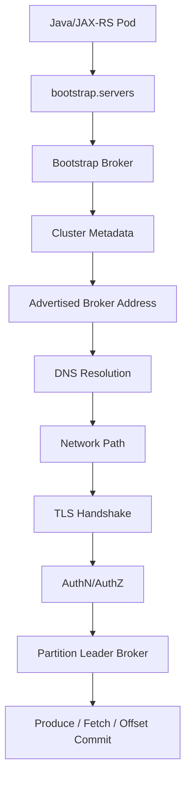
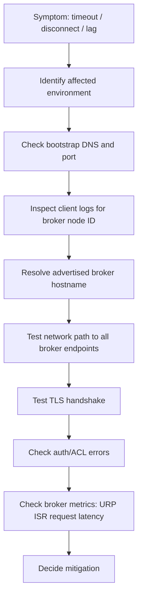

# Part 027 — Kafka Networking

> Fokus part ini: memahami Kafka networking sebagai rantai konektivitas dari aplikasi Java/JAX-RS sampai broker. Banyak incident Kafka bukan disebabkan oleh producer/consumer logic, tetapi oleh `advertised.listeners`, DNS, TLS hostname verification, firewall, security group, NetworkPolicy, NAT, load balancer, private endpoint, atau perbedaan internal/external listener.

---

## 1. Core Mental Model

Kafka networking terlihat sederhana dari client:

```properties
bootstrap.servers=kafka-a:9092,kafka-b:9092,kafka-c:9092
```

Tetapi secara nyata, client tidak hanya menggunakan alamat bootstrap. Alamat bootstrap hanya pintu awal untuk mengambil metadata cluster. Setelah metadata diterima, client akan mencoba konek ke broker leader partition menggunakan alamat yang diberikan broker melalui `advertised.listeners`.

Jadi alur mental model-nya:

1. Java client connect ke salah satu bootstrap server.
2. Broker mengembalikan metadata cluster.
3. Metadata berisi broker ID, topic, partition, leader, dan advertised address.
4. Client membuka koneksi baru ke broker leader berdasarkan advertised address.
5. Produce/fetch request berjalan ke broker leader partition.

Masalah umum: bootstrap server bisa di-resolve dan bisa dikoneksi, tetapi produce/consume tetap gagal karena advertised broker address tidak bisa dijangkau dari client.

---

## 2. Kafka Networking Flow



Setiap edge di diagram adalah titik failure:

- bootstrap DNS gagal,
- bootstrap port tertutup,
- metadata berisi hostname yang salah,
- broker DNS tidak resolve dari pod,
- firewall/security group memblokir port broker,
- NAT/load balancer mengubah path,
- TLS certificate tidak cocok dengan hostname,
- advertised listener internal dipakai dari external client,
- external listener dipakai oleh internal client dan menyebabkan traffic keluar-masuk cluster,
- cross-zone/cross-region traffic tidak sengaja terjadi.

---

## 3. Bootstrap Server Is Not the Whole Cluster

`bootstrap.servers` sering disalahpahami sebagai “endpoint Kafka”. Yang benar: ini adalah seed list untuk menemukan cluster.

Client tidak perlu mencantumkan semua broker, tetapi harus mencantumkan cukup broker agar initial discovery tahan terhadap broker down.

Contoh buruk:

```properties
bootstrap.servers=kafka-0.kafka:9092
```

Jika `kafka-0` down saat startup, client tidak bisa discover cluster.

Contoh lebih baik:

```properties
bootstrap.servers=kafka-0.kafka:9092,kafka-1.kafka:9092,kafka-2.kafka:9092
```

Untuk managed Kafka, bootstrap biasanya berupa daftar broker endpoint yang disediakan platform. Untuk Kubernetes self-managed Kafka, bootstrap bisa berupa service khusus yang mengarah ke broker atau operator-generated bootstrap service.

Yang perlu diperhatikan:

- bootstrap address harus reachable dari semua client runtime,
- bootstrap address harus memakai listener yang benar,
- port harus sesuai protocol security,
- DNS TTL dan failover behavior harus dipahami,
- client harus punya retry/backoff yang masuk akal saat bootstrap gagal.

---

## 4. Listener and Advertised Listener

Kafka broker punya dua konsep penting:

| Konsep | Arti |
|---|---|
| `listeners` | Address/port tempat broker bind dan menerima koneksi. |
| `advertised.listeners` | Address/port yang diberitahukan broker kepada client dalam metadata. |

Contoh:

```properties
listeners=INTERNAL://0.0.0.0:9092,EXTERNAL://0.0.0.0:9094
advertised.listeners=INTERNAL://kafka-0.kafka.svc.cluster.local:9092,EXTERNAL://kafka.example.com:9094
listener.security.protocol.map=INTERNAL:SASL_SSL,EXTERNAL:SASL_SSL
inter.broker.listener.name=INTERNAL
```

`listeners` menjawab: broker mendengar di mana?  
`advertised.listeners` menjawab: client harus menghubungi broker lewat alamat apa?

Failure mode paling klasik: broker mengiklankan alamat internal Kubernetes kepada client external, atau mengiklankan alamat external load balancer kepada pod internal.

---

## 5. Internal Listener vs External Listener

Kafka deployment enterprise sering punya lebih dari satu listener:

- internal client listener,
- external client listener,
- inter-broker listener,
- replication listener,
- admin/maintenance listener jika digunakan.

### Internal listener

Dipakai oleh service dalam network yang sama, misalnya pod Java/JAX-RS dalam Kubernetes namespace atau VPC/VNet yang sama.

Karakteristik:

- memakai DNS internal,
- private IP,
- tidak melewati public internet,
- latency lebih rendah,
- security tetap wajib.

### External listener

Dipakai oleh client di luar network broker, misalnya aplikasi on-prem ke Kafka cloud, partner integration, atau workstation admin.

Karakteristik:

- bisa lewat load balancer,
- bisa membutuhkan NAT/private endpoint/VPN/peering,
- lebih rawan hostname/certificate mismatch,
- perlu kontrol firewall dan ACL lebih ketat.

Rule of thumb: client harus memakai listener yang sesuai dengan posisi network-nya. Jangan biarkan aplikasi internal memakai external listener hanya karena “bisa connect”. Itu bisa menambah latency, cost, dan failure surface.

---

## 6. Broker Metadata and Partition Leader Routing

Kafka client akan route request ke broker yang menjadi leader partition.

Untuk producer:

- producer mengambil metadata topic,
- partitioner menentukan partition,
- client mengirim record ke broker leader untuk partition tersebut.

Untuk consumer:

- consumer group assignment menentukan partition yang dibaca,
- client fetch dari broker leader partition,
- offset commit dikirim ke coordinator.

Artinya, client harus bisa menghubungi semua broker yang mungkin menjadi leader partition, bukan hanya bootstrap broker.

Jika hanya satu broker reachable, gejala yang muncul bisa tidak konsisten:

- sebagian topic bisa produce,
- sebagian partition gagal,
- consumer bisa join group tetapi fetch gagal,
- metadata request sukses tetapi produce timeout,
- error terlihat random tergantung partition leader.

---

## 7. DNS in Kafka Connectivity

DNS adalah dependency critical untuk Kafka client.

Kafka client membutuhkan DNS untuk:

- bootstrap hostname,
- advertised broker hostname,
- Schema Registry endpoint,
- Kafka Connect endpoint jika client/admin tooling mengaksesnya,
- cloud private endpoint,
- Kubernetes service name,
- load balancer hostname.

DNS failure pattern:

- `UnknownHostException`,
- intermittent resolution failure,
- DNS TTL terlalu panjang saat broker/load balancer berubah,
- split-horizon DNS salah,
- private hosted zone/private DNS zone tidak di-link ke VPC/VNet yang benar,
- CoreDNS overloaded di Kubernetes,
- search domain Kubernetes menghasilkan resolusi yang tidak diharapkan.

Untuk Java service di Kubernetes, DNS path biasanya:

```mermaid
flowchart LR
  A[Java Pod] --> B[/etc/resolv.conf]
  B --> C[CoreDNS]
  C --> D[Kubernetes Service DNS / Private DNS]
  D --> E[Broker or Load Balancer IP]
```

Jika Kafka berada di managed cloud/private endpoint, DNS bisa melewati Route 53 private hosted zone atau Azure Private DNS Zone. Ini harus diverifikasi di internal environment, jangan diasumsikan.

---

## 8. Kubernetes Service and Kafka Broker Identity

Kafka bukan stateless HTTP service biasa. Broker identity penting karena metadata cluster mengacu ke broker tertentu.

Untuk Kafka di Kubernetes, biasanya ada pola:

- headless service untuk broker discovery,
- per-broker service untuk external access,
- StatefulSet ordinal identity,
- persistent volume per broker,
- operator-generated listener config.

Contoh hostname internal:

```text
kafka-0.kafka-brokers.kafka.svc.cluster.local:9092
kafka-1.kafka-brokers.kafka.svc.cluster.local:9092
kafka-2.kafka-brokers.kafka.svc.cluster.local:9092
```

Jika broker restart dan pindah node, broker identity tetap `kafka-0`, tetapi IP bisa berubah. Karena itu hostname lebih penting daripada IP static.

Anti-pattern:

- hardcode pod IP sebagai broker address,
- expose semua broker melalui satu ClusterIP tanpa advertised listener yang benar,
- memakai load balancer L7 HTTP untuk Kafka protocol,
- menggunakan service yang menyembunyikan broker identity sehingga metadata tidak cocok.

---

## 9. Load Balancer and Kafka

Kafka protocol bukan HTTP. Load balancer harus dipakai dengan hati-hati.

### Bootstrap load balancer

Beberapa deployment memakai load balancer untuk bootstrap. Ini bisa diterima jika metadata yang dikembalikan tetap mengarah ke broker address yang benar.

### Per-broker load balancer

Untuk external access, setiap broker sering membutuhkan endpoint sendiri, karena client harus bisa menghubungi broker leader tertentu.

Pola umum:

```text
broker-0.example.com:9094 -> kafka-0
broker-1.example.com:9094 -> kafka-1
broker-2.example.com:9094 -> kafka-2
```

### Risiko load balancer

- idle timeout memutus koneksi Kafka,
- source NAT menghilangkan source identity,
- health check salah,
- cross-zone load balancing menambah cost/latency,
- TLS passthrough vs TLS termination membingungkan,
- L7 proxy tidak memahami Kafka protocol,
- single load balancer address membuat broker identity kabur.

Untuk managed Kafka, detail ini biasanya diabstraksikan, tetapi tetap memengaruhi connectivity dan security group.

---

## 10. NAT Issues

NAT sering muncul di cloud/hybrid deployment.

Kafka problem dengan NAT muncul saat:

- broker mengiklankan private IP yang tidak routeable dari client,
- client berada di luar VPC/VNet dan menerima metadata internal,
- NAT mengubah source IP sehingga ACL/network policy tidak sesuai,
- return path asymmetric,
- firewall stateful tidak melihat jalur pulang yang sama,
- TLS certificate memakai hostname berbeda dari endpoint NAT.

Gejala:

- bootstrap sukses tetapi request berikutnya timeout,
- producer log berisi `Connection to node -1` lalu node broker tertentu gagal,
- consumer join group tetapi fetch gagal,
- error hanya terjadi dari environment tertentu.

Prinsip: alamat yang di-advertise harus bisa dicapai dari perspektif client, bukan dari perspektif broker.

---

## 11. Firewall, Security Group, NSG, and NetworkPolicy

Kafka connectivity membutuhkan izin di beberapa layer:

- host firewall,
- cloud security group/NSG,
- subnet route table,
- Kubernetes NetworkPolicy,
- service mesh egress policy jika ada,
- corporate firewall,
- VPN/Direct Connect/ExpressRoute firewall,
- private endpoint policy jika digunakan.

Port umum:

| Komponen | Port contoh | Catatan |
|---|---:|---|
| PLAINTEXT Kafka | 9092 | Tidak direkomendasikan untuk production enterprise. |
| SSL/SASL_SSL Kafka | 9093/9094 | Port bisa berbeda per deployment. |
| Schema Registry | 8081 | Sering HTTP/HTTPS. |
| Kafka Connect REST | 8083 | Harus diamankan. |
| ksqlDB | 8088 | Harus diamankan. |

Port actual harus diverifikasi di internal config.

Common mistake: security group hanya membuka port bootstrap, tetapi tidak membuka port per-broker advertised endpoint.

---

## 12. TLS Hostname Verification

TLS hostname verification memastikan hostname yang dipakai client cocok dengan certificate broker.

Masalah terjadi jika:

- client connect ke IP, certificate hanya punya DNS SAN,
- advertised listener memakai hostname internal, cert memakai hostname external,
- wildcard certificate tidak mencakup broker hostname,
- private DNS alias tidak ada di SAN,
- certificate rotation mengganti SAN tanpa update listener,
- hostname verification dimatikan untuk “sementara” lalu permanen.

Java client config yang sering terkait:

```properties
security.protocol=SASL_SSL
ssl.truststore.location=/etc/kafka/truststore.jks
ssl.truststore.password=${TRUSTSTORE_PASSWORD}
ssl.endpoint.identification.algorithm=https
```

Menonaktifkan hostname verification:

```properties
ssl.endpoint.identification.algorithm=
```

Ini harus dianggap emergency workaround, bukan solusi final.

---

## 13. Cross-Zone Traffic

Di cloud, broker dan client bisa berada di availability zone berbeda.

Risiko cross-zone:

- latency meningkat,
- network cost meningkat,
- broker overload tidak merata,
- failover behavior lebih kompleks,
- producer/consumer traffic melewati path yang tidak optimal.

Kafka deployment yang matang memperhatikan:

- broker rack awareness,
- client placement,
- partition leadership distribution,
- load balancer cross-zone setting,
- subnet/AZ mapping,
- multi-AZ managed Kafka behavior.

Untuk Java/JAX-RS service di Kubernetes, cek apakah pod tersebar across zones dan apakah Kafka broker/endpoint juga multi-zone. Jangan asumsikan “same region” berarti latency sama.

---

## 14. Cross-Region Connectivity

Cross-region Kafka connectivity harus diperlakukan sebagai architecture decision, bukan default network path.

Masalah cross-region:

- latency tinggi,
- bandwidth cost,
- transient network partition,
- ordering dan failover complexity,
- duplicate event saat DR,
- producer timeout tuning berbeda,
- consumer lag bisa naik karena network.

Jika butuh cross-region event flow, biasanya lebih baik memakai replication topology seperti MirrorMaker 2, Cluster Linking, managed replication, atau event bridge layer, bukan membuat semua service remote produce/consume langsung ke cluster region lain.

Internal verification:

- apakah service cross-region langsung connect ke Kafka,
- apakah ada replicated topic,
- bagaimana schema direplikasi,
- bagaimana consumer failover,
- apa RPO/RTO yang disepakati.

---

## 15. Client-to-Broker Connectivity Checklist

Untuk debugging dari pod Java/JAX-RS ke Kafka broker:

1. Apakah `bootstrap.servers` benar untuk environment ini?
2. Apakah DNS bootstrap resolve dari pod?
3. Apakah port bootstrap terbuka?
4. Apakah metadata broker address bisa di-resolve dari pod?
5. Apakah semua advertised broker reachable?
6. Apakah TLS handshake sukses?
7. Apakah auth sukses?
8. Apakah ACL mengizinkan topic/group?
9. Apakah latency/network timeout masuk akal?
10. Apakah issue hanya terjadi untuk partition leader tertentu?

Useful command dari pod/debug container jika diizinkan:

```bash
nslookup kafka-bootstrap.example.internal
nc -vz kafka-bootstrap.example.internal 9093
openssl s_client -connect kafka-bootstrap.example.internal:9093 -servername kafka-bootstrap.example.internal
```

Untuk Kafka protocol-level check, gunakan tooling yang disetujui tim, misalnya `kcat`, `kafka-topics.sh`, `kafka-broker-api-versions.sh`, atau platform-specific CLI.

---

## 16. Broker-to-Broker Connectivity

Client connectivity bukan satu-satunya network Kafka. Broker juga perlu komunikasi antar broker untuk replication, controller communication, dan cluster metadata.

Broker-to-broker issue bisa menyebabkan:

- under-replicated partitions,
- ISR shrink,
- leader election instability,
- produce latency meningkat,
- broker keluar-masuk cluster,
- controller instability,
- replication lag.

Checklist broker-to-broker:

- inter-broker listener benar,
- port antar broker terbuka,
- DNS broker internal stabil,
- firewall tidak memblokir antar node/pod,
- network throughput cukup,
- rack awareness config sesuai topology,
- cert/trust antar broker valid jika TLS dipakai,
- time sync tidak bermasalah.

Backend engineer tidak selalu mengelola ini, tetapi harus tahu gejalanya agar tidak salah menyalahkan consumer/producer code.

---

## 17. Kafka Networking in Kubernetes Client Deployments

Untuk Kafka client yang berjalan sebagai pod:

- DNS melalui CoreDNS,
- egress bisa dibatasi NetworkPolicy,
- service account mungkin memengaruhi secret access,
- pod restart bisa memicu reconnect/rebalance,
- CPU throttling bisa membuat heartbeat terlambat dan terlihat seperti network issue,
- sidecar/service mesh bisa mengubah connection behavior.

Checklist manifest:

```yaml
# contoh fokus area, bukan template final
containers:
  - name: app
    env:
      - name: KAFKA_BOOTSTRAP_SERVERS
        valueFrom:
          configMapKeyRef:
            name: app-config
            key: kafka.bootstrapServers
    volumeMounts:
      - name: kafka-truststore
        mountPath: /etc/kafka/certs
readinessProbe:
  httpGet:
    path: /health/ready
    port: 8080
terminationGracePeriodSeconds: 60
```

Readiness tidak boleh hanya mengecek HTTP server hidup jika service bergantung pada Kafka untuk fungsi utama. Tetapi readiness yang hard-fail karena Kafka transient down juga bisa menyebabkan cascading restart. Desain readiness harus sesuai criticality service.

---

## 18. Kafka Networking in AWS

Di AWS, area yang sering relevan:

- VPC,
- subnet,
- route table,
- security group,
- NACL,
- private hosted zone,
- MSK broker endpoints,
- IAM/SASL/TLS endpoint,
- PrivateLink jika digunakan,
- VPC peering/Transit Gateway,
- EKS pod networking.

Common AWS failure:

- security group client tidak diizinkan ke broker,
- broker SG tidak mengizinkan inbound dari node/pod SG,
- Route 53 private hosted zone tidak terasosiasi ke VPC client,
- cross-account VPC routing tidak lengkap,
- MSK endpoint type tidak sesuai client network,
- DNS resolves tetapi route table tidak punya path,
- NACL stateless rule memblokir ephemeral port.

Internal verification checklist harus mencakup network diagram actual, bukan hanya Terraform variable.

---

## 19. Kafka Networking in Azure

Di Azure, area yang sering relevan:

- VNet,
- subnet,
- NSG,
- route table/user-defined route,
- private endpoint,
- Private DNS Zone,
- AKS egress,
- Azure Firewall,
- peering,
- ExpressRoute,
- Event Hubs Kafka-compatible endpoint jika digunakan.

Common Azure failure:

- Private DNS Zone tidak di-link ke VNet AKS,
- NSG memblokir broker/endpoint,
- UDR mengarahkan traffic ke firewall yang belum allow Kafka port,
- private endpoint DNS resolve ke public endpoint,
- AKS egress SNAT membuat source IP tidak sesuai rule,
- Kafka-compatible endpoint punya batas semantic dibanding Kafka asli.

Jika memakai Event Hubs Kafka endpoint, jangan otomatis mengasumsikan semua behavior identik dengan Apache Kafka broker.

---

## 20. On-Prem and Hybrid Networking

Hybrid Kafka path biasanya paling rawan karena melibatkan:

- corporate DNS,
- firewall,
- proxy policy,
- VPN,
- Direct Connect/ExpressRoute,
- NAT,
- split-horizon DNS,
- certificate trust chain internal,
- cloud private endpoint,
- on-prem route advertisement.

Gejala hybrid issue:

- hanya terjadi dari data center tertentu,
- hanya terjadi saat failover route,
- TLS handshake gagal karena internal CA tidak trusted,
- latency spike pada jam tertentu,
- packet loss menyebabkan producer timeout,
- consumer lag naik tanpa CPU/DB bottleneck.

Debugging hybrid harus melibatkan network/platform team, karena aplikasi hanya melihat timeout. Timeout adalah symptom, bukan root cause.

---

## 21. Common Advertised Listener Failure Patterns

### Pattern 1: Bootstrap works, produce times out

Kemungkinan:

- advertised broker hostname tidak reachable,
- port per broker tertutup,
- leader broker berada di address yang salah,
- TLS certificate mismatch pada broker address.

### Pattern 2: Works inside cluster, fails from laptop/VPN

Kemungkinan:

- internal listener dipakai external client,
- private DNS tidak tersedia dari VPN,
- firewall memblokir broker endpoint,
- split-horizon DNS salah.

### Pattern 3: Works in dev, fails in prod

Kemungkinan:

- prod memakai SASL_SSL/TLS hostname verification,
- SG/NSG prod lebih ketat,
- prod broker multi-AZ/per-broker endpoint,
- prod DNS/private endpoint berbeda.

### Pattern 4: Only some messages fail

Kemungkinan:

- partition leader tertentu tidak reachable,
- broker tertentu down/network isolated,
- advertised listener salah hanya untuk sebagian broker.

### Pattern 5: Consumer joins group but cannot fetch

Kemungkinan:

- coordinator reachable, leader partition tidak reachable,
- fetch path diblokir,
- authorization berbeda antara group dan topic,
- broker metadata stale.

---

## 22. Production-Safe Troubleshooting Flow

Jangan langsung restart service. Ikuti alur:



Mitigation bisa berupa:

- rollback config,
- fix DNS/private zone,
- open network rule,
- switch to correct listener,
- rotate/fix cert,
- restart one affected broker via platform procedure,
- scale consumer only jika network sudah sehat.

Restart consumer tanpa memperbaiki listener/DNS hanya akan mengulang masalah dan bisa menambah rebalance storm.

---

## 23. Java Client Configuration Areas

Networking-related Java Kafka configs:

```properties
bootstrap.servers=...
client.dns.lookup=use_all_dns_ips
connections.max.idle.ms=540000
request.timeout.ms=30000
default.api.timeout.ms=60000
reconnect.backoff.ms=50
reconnect.backoff.max.ms=10000
retry.backoff.ms=100
security.protocol=SASL_SSL
ssl.endpoint.identification.algorithm=https
```

Catatan:

- `request.timeout.ms` terlalu kecil bisa false positive saat network transient.
- Timeout terlalu besar memperlambat failure detection.
- `client.dns.lookup` penting untuk multi-IP DNS, tetapi behavior harus diuji.
- Backoff terlalu agresif bisa menyebabkan reconnect storm.
- Metrics harus digunakan untuk membedakan broker slow vs network broken.

---

## 24. Network-Aware Producer Concern

Producer paling sensitif terhadap:

- latency ke broker leader,
- request timeout,
- delivery timeout,
- retry storm,
- metadata refresh failure,
- unavailable partition leader,
- ack setting.

Jika network latency naik:

- batch lebih lama terkirim,
- buffer memory bisa naik,
- delivery timeout bisa terjadi,
- throughput turun,
- duplicate risk tetap harus ditangani jika retry terjadi,
- end-to-end business latency meningkat.

Producer PR review harus menanyakan:

- apa yang terjadi jika broker unreachable 30 detik?
- apakah HTTP request menunggu produce selesai?
- apakah outbox melindungi event publication?
- apakah metrics producer dikirim?
- apakah retry/backoff masuk akal?

---

## 25. Network-Aware Consumer Concern

Consumer sensitif terhadap:

- fetch latency,
- heartbeat connectivity,
- group coordinator reachability,
- max poll interval,
- rebalance loop,
- offset commit timeout.

Network issue bisa terlihat seperti:

- consumer lag naik,
- rebalance storm,
- `CommitFailedException`,
- heartbeat timeout,
- consumer keluar dari group,
- duplicate processing setelah restart.

Consumer PR review harus menanyakan:

- apakah graceful shutdown cukup lama?
- apakah processing time dibedakan dari fetch latency?
- apakah commit failure ditangani?
- apakah consumer idempotent terhadap duplicate akibat rebalance/network failure?

---

## 26. Observability for Networking

Metric/log yang membantu:

- connection creation rate,
- connection close rate,
- request latency,
- request timeout rate,
- network processor idle percent,
- bytes in/out,
- failed authentication,
- failed authorization,
- DNS error log,
- TLS handshake failure,
- client reconnect rate,
- broker node-specific error,
- under-replicated partition,
- ISR shrink.

Tambahkan dimensi:

- environment,
- service,
- client ID,
- consumer group,
- broker ID,
- topic,
- partition,
- AZ/zone jika tersedia,
- cluster.

Tanpa dimensi broker ID/topic/partition, banyak networking issue terlihat seperti “Kafka lambat” padahal hanya satu broker endpoint bermasalah.

---

## 27. Internal Verification Checklist

Verifikasi internal berikut sebelum menyimpulkan desain networking:

- Apa daftar `bootstrap.servers` per environment?
- Listener apa saja yang tersedia: internal, external, inter-broker?
- Apa `advertised.listeners` actual per broker?
- Apakah client internal memakai internal listener?
- Apakah external/on-prem client memakai listener yang tepat?
- Bagaimana DNS bootstrap dan broker dikelola?
- Apakah DNS private zone terhubung ke VPC/VNet/cluster yang benar?
- Apakah semua broker endpoint reachable dari pod aplikasi?
- Apakah security group/NSG/firewall membuka semua port yang dibutuhkan?
- Apakah Kubernetes NetworkPolicy membatasi egress Kafka?
- Apakah TLS certificate SAN cocok dengan advertised hostname?
- Apakah hostname verification aktif?
- Apakah ada NAT/load balancer di path?
- Apakah load balancer per-broker atau hanya bootstrap?
- Apakah cross-zone traffic disengaja?
- Apakah ada cross-region direct Kafka connection?
- Apakah Kafka Connect/Debezium/Schema Registry memakai network path yang sama?
- Apakah ada runbook Kafka connectivity?
- Apakah incident notes pernah menyebut DNS, advertised listener, TLS, firewall, atau security group?

---

## 28. Anti-Patterns

### Anti-pattern: Treat Kafka Like HTTP Behind One Load Balancer

Kafka client butuh metadata broker dan koneksi ke partition leader. Satu endpoint load balancer yang menyembunyikan broker identity sering tidak cukup.

### Anti-pattern: Bootstrap Succeeds, Therefore Network Is Fine

Bootstrap hanya tahap awal. Semua advertised broker harus reachable.

### Anti-pattern: Disable TLS Hostname Verification

Ini menutupi masalah certificate/listener dan membuat client rentan terhadap endpoint salah.

### Anti-pattern: Use External Listener From Internal Pod

Ini bisa menambah latency, biaya, dan dependency pada load balancer/NAT yang tidak perlu.

### Anti-pattern: Hardcode Broker IP

Broker IP bisa berubah, terutama di Kubernetes dan managed service. Gunakan DNS yang benar.

### Anti-pattern: Debug Only From Laptop

Connectivity dari laptop/VPN tidak mewakili connectivity dari pod production.

### Anti-pattern: Restart Consumer for Network Issue

Restart bisa memperburuk rebalance storm dan tidak memperbaiki DNS/listener/firewall.

---

## 29. Senior Engineer Heuristics

1. **Bootstrap is discovery, not destination.** Selalu cek advertised broker path.
2. **Network must be validated from the client runtime.** Test dari pod/service yang sama, bukan hanya laptop.
3. **Kafka exposes broker identity.** Jangan desain networking seolah Kafka adalah stateless HTTP service.
4. **TLS hostname mismatch is architecture smell.** Fix DNS/listener/cert, bukan disable verification.
5. **Timeout is a symptom.** Cari apakah root cause DNS, routing, firewall, TLS, auth, broker load, atau coordinator issue.
6. **Cross-zone/cross-region is a cost and latency decision.** Jangan biarkan terjadi tidak sengaja.
7. **Network issues create correctness issues.** Duplicate, lag, rebalance, and replay risk sering berasal dari connectivity instability.

---

## 30. Final Summary

Kafka networking adalah salah satu area paling penting untuk production readiness. Dari sisi aplikasi Java/JAX-RS, `bootstrap.servers` hanyalah awal. Yang menentukan keberhasilan produce/consume adalah apakah client bisa:

- resolve bootstrap dan advertised broker hostname,
- reach semua broker leader yang relevan,
- melewati firewall/security group/NetworkPolicy,
- menyelesaikan TLS handshake dengan hostname valid,
- menggunakan listener yang sesuai dengan posisi network,
- bertahan terhadap reconnect dan transient network failure,
- dan menyediakan metrics/log cukup untuk debugging.

Target senior engineer bukan menghafal semua port, tetapi mampu membaca topology: **client ada di mana, broker mengiklankan alamat apa, DNS mengarah ke mana, network rule mengizinkan apa, TLS membuktikan hostname apa, dan failure terlihat sebagai symptom apa di producer/consumer.**
