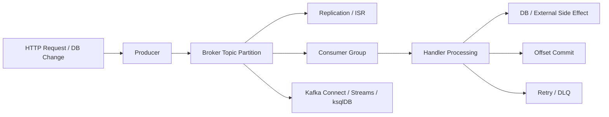
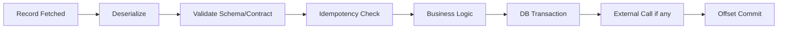
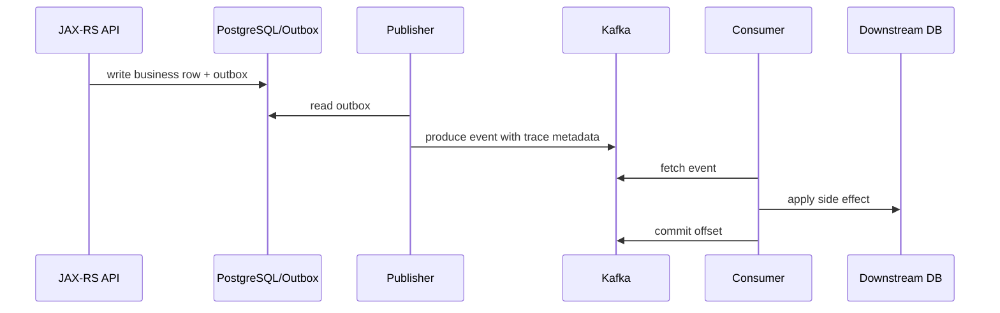
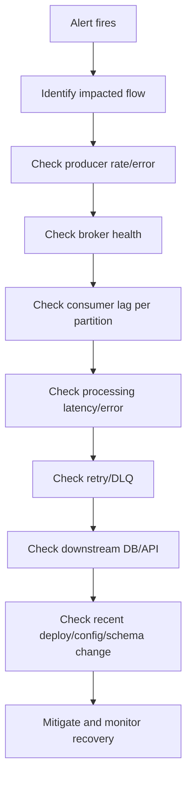

# Part 028 — Kafka Observability

> Fokus part ini: membangun observability Kafka yang berguna untuk mengambil keputusan production. Observability Kafka bukan hanya melihat consumer lag. Observability harus menjawab: apakah event diproduksi, tersimpan, direplikasi, dikonsumsi, diproses, di-commit, di-retry, masuk DLQ, atau tertahan di connector/stream processor.

---

## 1. Core Mental Model

Kafka observability harus mengikuti lifecycle event end-to-end:



Setiap stage punya pertanyaan observability sendiri:

- Producer: apakah send berhasil, lambat, retry, atau gagal?
- Broker: apakah topic/partition sehat, replicated, disk cukup, latency normal?
- Consumer: apakah fetch berjalan, processing lambat, lag naik, rebalance terjadi?
- Handler: apakah bisnis logic gagal, DB lambat, external API timeout?
- Offset: apakah commit aman dan maju?
- Retry/DLQ: apakah failure terkendali atau menumpuk?
- Connect/Streams/ksqlDB: apakah runtime internal stuck atau restore state?

Consumer lag penting, tetapi tidak cukup. Lag adalah symptom, bukan diagnosis.

---

## 2. Observability Goals

Observability Kafka harus memungkinkan lima aktivitas:

1. **Detect**: tahu ada masalah sebelum customer complain.
2. **Triage**: tahu area masalah: producer, broker, consumer, DB, connector, network, schema, security.
3. **Diagnose**: tahu root cause atau minimal kandidat root cause yang kuat.
4. **Mitigate**: tahu tindakan aman: pause, scale, rollback, replay, drain DLQ, fix config.
5. **Prove recovery**: tahu sistem sudah kembali sehat dan backlog sudah turun.

Dashboard yang hanya menampilkan banyak grafik tanpa alur diagnosis tidak cukup. Dashboard harus mengarahkan engineer dari symptom ke keputusan.

---

## 3. Golden Signals for Kafka

Kafka observability bisa dimulai dari golden signals berikut:

| Area | Signal | Pertanyaan |
|---|---|---|
| Traffic | messages/sec, bytes/sec | Apakah event masih mengalir? |
| Latency | produce latency, fetch latency, processing latency, end-to-end latency | Di mana delay terjadi? |
| Errors | send error, auth error, deserialization error, handler failure | Failure jenis apa yang terjadi? |
| Saturation | disk, network, CPU, request queue, lag, buffer memory | Resource mana yang penuh? |

Untuk Kafka, tambahkan signal khusus:

- consumer lag,
- rebalance rate,
- under-replicated partitions,
- offline partitions,
- ISR shrink/expand,
- controller events,
- DLQ rate,
- connector task state,
- stream state restore progress.

---

## 4. Consumer Lag: Useful but Often Misread

Consumer lag adalah selisih antara latest offset topic partition dan committed/current offset consumer group.

Jenis lag:

- **consumer group lag**: total lag satu group,
- **partition lag**: lag per partition,
- **max partition lag**: lag partition terburuk,
- **lag age**: seberapa tua event tertua yang belum diproses,
- **processing lag**: delay dari event time ke processing time,
- **commit lag**: offset belum commit walaupun record sudah diproses.

Lag tinggi bisa berarti:

- consumer down,
- consumer processing lambat,
- DB downstream lambat,
- broker fetch lambat,
- partition hot,
- rebalance storm,
- poison event memblokir partition,
- consumer sengaja dipause,
- producer throughput naik normal tetapi consumer capacity belum cukup.

Jangan langsung scale consumer hanya karena lag naik. Scale hanya membantu jika bottleneck adalah parallelism dan partition count memungkinkan.

---

## 5. Consumer Group Lag vs Partition Lag

Total group lag bisa menipu.

Contoh:

| Partition | Lag |
|---:|---:|
| 0 | 0 |
| 1 | 0 |
| 2 | 500000 |
| 3 | 0 |

Total lag 500000. Masalahnya bukan seluruh consumer group lambat, tetapi satu partition tertahan.

Kemungkinan root cause:

- hot partition karena key skew,
- poison event pada satu aggregate,
- handler blocked untuk tenant/order tertentu,
- partition leader bermasalah,
- out-of-order/state conflict di satu key,
- consumer assignment tidak seimbang.

Dashboard wajib punya view per partition dan top lagging partitions.

---

## 6. End-to-End Latency

End-to-end latency menjawab: berapa lama dari event terjadi sampai effect downstream selesai?

Komponen umum:

```text
event_time -> producer_send_time -> broker_append_time -> consumer_fetch_time -> processing_start_time -> processing_end_time -> offset_commit_time
```

Latency breakdown:

| Segment | Makna |
|---|---|
| event_time to send_time | delay aplikasi/outbox/publisher |
| send_time to append_time | producer/broker/network latency |
| append_time to fetch_time | queueing/consumer lag |
| fetch_time to processing_start | consumer poll/backpressure delay |
| processing_start to end | business handler/DB/API latency |
| processing_end to commit | offset commit overhead/failure |

Tanpa timestamp standar di event metadata, end-to-end latency sulit dihitung. Karena itu Part 014 tentang metadata langsung berhubungan dengan observability.

---

## 7. Producer Metrics

Producer metrics yang penting:

- record send rate,
- record error rate,
- record retry rate,
- request latency average/p95/p99,
- batch size average,
- compression rate,
- buffer available bytes,
- bufferpool wait time,
- record queue time,
- outgoing byte rate,
- metadata age,
- produce throttle time jika quota dipakai,
- delivery timeout count,
- authentication/authorization failure.

Interpretasi:

- retry naik + error rendah: transient broker/network issue mungkin tertutup retry.
- bufferpool wait naik: producer menghasilkan lebih cepat dari kemampuan send/broker.
- request latency naik: broker/network/acks/replication bisa lambat.
- batch kecil terus: throughput mungkin tidak efisien; `linger.ms`/traffic pattern perlu dicek.
- send rate drop ke nol: upstream request turun atau producer stuck/fail.

Producer metrics harus punya `client.id`, service, environment, topic.

---

## 8. Producer Observability in Java/JAX-RS Services

Dalam service Java/JAX-RS, producer observability harus menghubungkan HTTP request ke event publication.

Yang perlu di-log/trace secara aman:

- correlation ID,
- causation ID,
- event ID,
- event type,
- topic,
- partition jika diketahui,
- offset setelah callback sukses,
- producer send duration,
- failure category,
- retry behavior,
- outbox row ID jika memakai outbox.

Jangan log payload penuh jika berpotensi mengandung data sensitif.

Pattern yang baik:

```text
http.request.id=... event.id=... event.type=OrderSubmitted topic=order.events partition=7 offset=123456 result=published duration_ms=42
```

Pattern buruk:

```text
Kafka failed
```

Log buruk tidak cukup untuk incident.

---

## 9. Consumer Metrics

Consumer metrics yang penting:

- records consumed rate,
- bytes consumed rate,
- records lag max,
- fetch latency,
- fetch rate,
- poll latency,
- time between polls,
- commit latency,
- commit failure rate,
- assigned partitions,
- rebalance count/rate,
- heartbeat rate/failure,
- processing duration,
- handler success/failure rate,
- retry/DLQ publish rate,
- pause/resume duration,
- consumer thread alive state.

Consumer harus membedakan:

- waktu fetch dari broker,
- waktu menunggu poll berikutnya,
- waktu business processing,
- waktu DB transaction,
- waktu external API,
- waktu offset commit.

Kalau semua dicampur sebagai “consumer latency”, diagnosis akan lemah.

---

## 10. Consumer Processing Latency

Processing latency adalah waktu handler memproses satu record atau batch.

Pecah processing latency:



Jika processing latency naik, kandidat root cause:

- deserialization failure loop,
- schema validation berat,
- idempotency table lock/contention,
- DB slow query,
- external dependency timeout,
- retry blocking partition,
- batch terlalu besar,
- CPU throttling,
- GC pause,
- thread pool saturation.

Tambahkan metric handler berdasarkan event type agar event tertentu tidak menyembunyikan masalah.

---

## 11. Rebalance Metrics

Rebalance adalah normal, tetapi rebalance storm adalah incident.

Metrics/log yang penting:

- rebalance count,
- rebalance duration,
- partitions revoked/assigned,
- consumer generation,
- time since last poll,
- max poll interval breach,
- heartbeat failure,
- pod restart correlation,
- deployment rollout correlation.

Rebalance storm bisa disebabkan oleh:

- consumer processing terlalu lama,
- `max.poll.interval.ms` terlalu kecil,
- pod restart/rolling update terlalu agresif,
- liveness probe membunuh pod,
- CPU throttling membuat heartbeat terlambat,
- network instability,
- coordinator broker bermasalah,
- mixed client versions/protocol issue.

Alert rebalance tidak boleh hanya berbunyi saat ada rebalance. Alert harus berbunyi saat rate/duration abnormal dan berdampak ke lag/throughput.

---

## 12. Broker Metrics

Broker metrics yang wajib dipahami:

- request handler idle percent,
- network processor idle percent,
- request latency per request type,
- produce request rate/latency,
- fetch request rate/latency,
- bytes in/out,
- messages in rate,
- under-replicated partitions,
- offline partitions,
- active controller count,
- leader election rate,
- unclean leader election count,
- ISR shrink/expand rate,
- disk usage,
- log flush latency,
- page cache behavior jika tersedia,
- CPU/memory/GC,
- connection count,
- authentication/authorization failures.

Backend engineer tidak harus menjadi Kafka broker admin, tetapi harus bisa membaca apakah consumer lag berasal dari consumer code atau broker health.

---

## 13. Under-Replicated and Offline Partitions

### Under-replicated partition

Partition disebut under-replicated jika follower replica tertinggal atau tidak masuk ISR.

Dampak:

- durability melemah,
- produce dengan `acks=all` bisa melambat/gagal jika `min.insync.replicas` tidak terpenuhi,
- broker/network/storage issue mungkin terjadi.

### Offline partition

Offline partition berarti tidak ada leader yang available.

Dampak:

- producer tidak bisa write ke partition itu,
- consumer tidak bisa fetch,
- event flow terganggu.

Alert untuk offline partition harus critical. Under-replicated partition juga serius, terutama untuk topic critical.

---

## 14. ISR Shrink and Expand

ISR shrink berarti replica keluar dari in-sync replica set. ISR expand berarti replica kembali sync.

ISR shrink spike bisa menunjukkan:

- broker overloaded,
- disk lambat,
- network antar broker bermasalah,
- GC pause,
- follower tertinggal,
- rolling restart/upgrade,
- storage saturation.

Jika ISR shrink terjadi bersamaan dengan producer latency naik, kemungkinan bottleneck ada di broker replication path, bukan producer code.

Untuk topic dengan `acks=all`, ISR health langsung berpengaruh ke write availability.

---

## 15. Disk Usage and Storage Observability

Kafka menyimpan log segment di disk. Disk observability harus mencakup:

- disk used percent,
- disk free bytes,
- disk IO utilization,
- read/write throughput,
- await/latency,
- partition distribution per broker,
- topic retention contribution,
- log segment count,
- compaction backlog jika compact topic,
- broker log directory offline.

Disk full adalah incident serius:

- broker bisa berhenti menerima writes,
- partition leadership bisa terganggu,
- retention cleanup mungkin tidak cukup cepat,
- compaction bisa tertinggal,
- recovery butuh keputusan data retention vs capacity.

Dashboard harus menunjukkan top topics by storage usage dan growth rate.

---

## 16. Network Throughput and Request Latency

Network metrics:

- bytes in/out per broker,
- connection count,
- request queue time,
- local/remote time jika tersedia,
- failed connections,
- TCP retransmits jika tersedia,
- load balancer metrics jika ada,
- cross-zone/cross-region traffic jika cloud exposes it.

Request latency harus dilihat per request type:

- Produce,
- FetchConsumer,
- FetchFollower,
- Metadata,
- OffsetCommit,
- FindCoordinator,
- JoinGroup/SyncGroup.

Jika `Metadata` latency/error naik, client bisa gagal discover leader. Jika `OffsetCommit` latency naik, duplicate risk dan rebalance pain meningkat. Jika `FetchConsumer` naik, consumer lag bisa naik walau handler cepat.

---

## 17. Controller Metrics

Controller mengelola metadata cluster, partition leadership, dan broker membership.

Metrics penting:

- active controller count,
- controller change rate,
- leader election rate,
- offline partition count,
- preferred replica imbalance,
- metadata request latency,
- KRaft quorum health jika KRaft,
- ZooKeeper metrics jika legacy.

Active controller count harus 1 per cluster. Jika sering berubah, cluster instability perlu dicek.

Untuk KRaft, quorum health menjadi penting. Untuk ZooKeeper legacy, session issue dan ensemble health masih relevan.

---

## 18. Kafka Connect Metrics

Kafka Connect observability harus menjawab:

- worker hidup atau tidak,
- connector running/paused/failed,
- task running/failed,
- source records produced,
- sink records consumed/written,
- connector offset maju atau stuck,
- error rate,
- DLQ rate,
- retry count,
- transform/converter failure,
- rebalance worker Connect cluster,
- REST API health.

Untuk Debezium/PostgreSQL:

- replication slot lag,
- WAL lag,
- snapshot progress,
- source record lag,
- connector restart count,
- schema change handling.

Connector bisa gagal diam-diam jika tidak ada alert task failed. Jangan hanya monitor worker pod readiness.

---

## 19. Kafka Streams Metrics

Kafka Streams observability harus mencakup:

- process rate,
- commit latency,
- poll/process/commit ratio,
- task assignment,
- thread state,
- rebalance rate,
- state store size,
- RocksDB metrics,
- changelog restore progress,
- standby replica lag,
- repartition topic throughput,
- skipped records,
- late records,
- suppression buffer jika digunakan,
- EOS transaction metrics jika enabled.

Failure khas Kafka Streams:

- state restore sangat lama setelah restart,
- internal topic missing/misconfigured,
- changelog retention salah,
- topology incompatible saat upgrade,
- repartition topic meledak throughput,
- RocksDB disk penuh,
- rebalance terus-menerus.

Dashboard Streams harus terpisah dari plain consumer dashboard.

---

## 20. DLQ Metrics

DLQ adalah alarm correctness. DLQ bukan tempat sampah yang boleh dilupakan.

Metrics penting:

- DLQ produce rate,
- DLQ total depth/lag,
- DLQ by source topic,
- DLQ by event type,
- DLQ by error category,
- DLQ by consumer group,
- oldest DLQ event age,
- replay success/failure rate,
- duplicate DLQ event count,
- poison event recurrence.

Alert DLQ harus mempertimbangkan criticality:

- satu event payment/order critical masuk DLQ bisa high severity,
- ratusan low-priority analytics event mungkin tidak critical,
- DLQ spike setelah deployment biasanya red flag.

DLQ event harus punya metadata cukup untuk replay dan root cause: original topic, partition, offset, event ID, error class, stack category, timestamp, retry count.

---

## 21. Schema and Serialization Observability

Schema/serialization issue sering muncul sebagai consumer failure, tetapi root cause-nya contract change.

Monitor:

- serialization failure rate di producer,
- deserialization failure rate di consumer,
- schema registry request latency/error,
- schema compatibility check failure di CI,
- schema not found,
- unauthorized schema access,
- incompatible schema registration attempt,
- unknown magic byte atau wrong serializer.

Dashboard schema harus bisa menjawab:

- schema mana yang berubah,
- kapan berubah,
- siapa yang deploy producer,
- consumer mana yang mulai gagal,
- apakah compatibility mode bekerja.

---

## 22. Outbox and Inbox Observability

Jika memakai outbox:

- outbox pending count,
- oldest pending age,
- publish success/failure rate,
- publish retry count,
- stuck status count,
- polling publisher lag,
- CDC connector lag jika CDC outbox,
- cleanup job success.

Jika memakai inbox:

- processed event insert rate,
- duplicate detection count,
- inbox processing status count,
- stuck/in-progress age,
- retry count,
- poison tracked count,
- cleanup success,
- idempotency constraint violation count.

Outbox/inbox metrics sangat penting karena Kafka bisa sehat tetapi data flow tetap tertahan di DB boundary.

---

## 23. Alerting Strategy

Alert yang baik harus actionable.

Buruk:

```text
Kafka lag > 1000
```

Lebih baik:

```text
Consumer group order-fulfillment lag age > 10 minutes for critical topic order.events, and processing rate < incoming rate for 15 minutes
```

Prinsip alert:

- alert berdasarkan impact, bukan angka statis saja,
- gunakan duration/window agar tidak noisy,
- bedakan warning vs critical,
- include owner/runbook/dashboard link,
- include environment, cluster, topic, consumer group,
- alert lag age lebih berguna daripada offset lag murni untuk business impact,
- alert DLQ critical untuk event bisnis critical,
- alert broker offline/partition offline harus high severity.

---

## 24. Dashboard Design

Minimal dashboard Kafka production sebaiknya punya beberapa view.

### 24.1 Executive / service health view

- event throughput per critical flow,
- end-to-end latency,
- consumer lag age,
- DLQ count,
- incident/status indicator.

### 24.2 Producer view

- send rate,
- error/retry rate,
- latency p95/p99,
- bufferpool wait,
- topic distribution.

### 24.3 Consumer view

- lag total/per partition,
- processing rate,
- processing latency,
- rebalance rate,
- commit latency,
- handler error rate.

### 24.4 Broker view

- broker health,
- request latency,
- URP/offline partitions,
- ISR shrink,
- disk/network/CPU,
- controller health.

### 24.5 Integration runtime view

- Connect task state,
- Debezium slot lag,
- Streams state restore,
- ksqlDB query status,
- Schema Registry health.

### 24.6 Failure handling view

- retry topic rates,
- DLQ rates,
- oldest DLQ age,
- replay status,
- poison event count.

---

## 25. Logs, Traces, and Metrics Relationship

Metrics tell what changed. Logs explain local decisions. Traces connect request/event flow.

Use all three:

| Signal | Role |
|---|---|
| Metrics | Detect trend and alert. |
| Logs | Explain discrete events and errors. |
| Traces | Connect cross-service flow and latency path. |

Kafka traces should propagate:

- trace ID,
- span context,
- correlation ID,
- causation ID,
- event ID.

Trace model:



Trace tidak harus membuat Kafka synchronous. Trace hanya membuat asynchronous flow dapat dilacak.

---

## 26. Business-Level Observability

Kafka metrics tidak cukup jika tidak dikaitkan ke business flow.

Untuk CPQ/order system, contoh business metrics:

- quote submitted event rate,
- quote approval event delay,
- order submitted to fulfillment started latency,
- fallout event count,
- cancellation event processing delay,
- order state projection lag,
- stuck saga count,
- reconciliation mismatch count.

Technical health bisa hijau tetapi business flow merah. Misalnya consumer lag rendah karena consumer cepat memindahkan semua event ke DLQ. Karena itu DLQ dan business outcome harus dimonitor bersama.

---

## 27. Common Diagnosis Patterns

### Pattern 1: Lag naik, producer rate normal, consumer processing latency naik

Kemungkinan root cause: DB/external API/handler lambat.

### Pattern 2: Lag naik, consumer processing latency normal, fetch latency naik

Kemungkinan root cause: broker/network issue.

### Pattern 3: Lag naik hanya satu partition

Kemungkinan root cause: hot key, poison event, partition leader issue.

### Pattern 4: Producer retry naik, broker URP naik

Kemungkinan root cause: broker replication/network/disk issue.

### Pattern 5: DLQ spike setelah deploy

Kemungkinan root cause: code bug, schema incompatibility, config change, downstream contract break.

### Pattern 6: Consumer rebalance storm + pod restarts

Kemungkinan root cause: liveness probe, max poll interval, CPU throttling, rolling update, network instability.

### Pattern 7: Debezium source lag naik + WAL storage naik

Kemungkinan root cause: connector stopped, replication slot lag, sink Kafka unavailable, connector task failure.

---

## 28. Production Incident Triage Flow



Key questions:

- Apakah event masih diproduksi?
- Apakah topic menerima data?
- Apakah broker sehat?
- Apakah lag per partition atau global?
- Apakah consumer memproses atau stuck?
- Apakah failure masuk retry/DLQ?
- Apakah ada deployment/schema/config change?
- Apakah customer impact sudah terjadi?

---

## 29. Observability in Kubernetes

Untuk Kafka client di Kubernetes, korelasikan Kafka metrics dengan Kubernetes metrics:

- pod restart count,
- deployment rollout time,
- CPU throttling,
- memory pressure/OOMKilled,
- readiness/liveness failure,
- node pressure,
- network policy changes,
- DNS/CoreDNS latency/error,
- HPA scale events,
- PDB disruption,
- container logs.

Consumer lag spike saat rollout belum tentu Kafka problem. Bisa jadi deployment mengganti semua consumer sekaligus dan memicu rebalance storm.

CPU throttling bisa membuat consumer heartbeat terlambat, lalu terjadi rebalance, lalu duplicate processing meningkat.

---

## 30. Observability in AWS/Azure/On-Prem

Cloud/on-prem layer juga harus dimonitor:

- managed Kafka metrics,
- load balancer metrics,
- private endpoint health,
- VPC/VNet flow logs jika tersedia,
- security group/NSG changes,
- disk/storage metrics,
- cloud network throughput,
- cross-zone/cross-region traffic,
- IAM/auth failure,
- certificate expiry,
- DNS query metrics jika tersedia.

On-prem:

- broker host disk,
- OS network errors,
- filesystem latency,
- firewall drops,
- certificate expiry,
- rack/node power/network event,
- monitoring agent health.

Internal Kafka observability harus menyambungkan aplikasi, broker, Kubernetes, cloud/network, dan business metrics.

---

## 31. SLO and Error Budget Thinking

Kafka SLO sebaiknya tidak hanya “cluster up”. SLO harus dekat ke business flow.

Contoh SLO:

- 99% order events consumed and applied within 2 minutes.
- Critical consumer group lag age below 5 minutes during business hours.
- DLQ rate for critical order events below defined threshold.
- No offline partitions for production critical topics.
- Producer publish success rate above 99.9% over 10 minutes.

SLO harus punya owner dan runbook.

Error budget membantu memutuskan:

- kapan harus menghentikan feature rollout,
- kapan scale consumer/broker,
- kapan memperbaiki schema governance,
- kapan investasi ke outbox/inbox/replay tooling lebih penting daripada fitur baru.

---

## 32. Internal Verification Checklist

Verifikasi internal berikut:

- Tool observability apa yang digunakan: Prometheus, Grafana, Datadog, New Relic, CloudWatch, Azure Monitor, ELK, OpenTelemetry, atau lainnya?
- Apakah producer metrics diekspor dari semua Java service?
- Apakah consumer metrics diekspor dengan `client.id`, `group.id`, topic, partition?
- Apakah consumer lag dashboard punya per-partition view?
- Apakah lag age dihitung, bukan hanya offset lag?
- Apakah end-to-end latency bisa dihitung dari event metadata?
- Apakah DLQ metrics ada per source topic/event type/error category?
- Apakah retry topic metrics dipantau?
- Apakah broker metrics mencakup URP, offline partitions, ISR shrink, request latency, disk, network?
- Apakah Kafka Connect task state dipantau?
- Apakah Debezium replication slot lag dipantau?
- Apakah Kafka Streams state restore/rebalance metrics dipantau?
- Apakah Schema Registry latency/error/compatibility failure dipantau?
- Apakah dashboard punya link ke runbook?
- Apakah alert punya owner dan severity?
- Apakah incident notes menyebut missing dashboard/metric/log?
- Apakah logs mengandung event ID/correlation ID tanpa payload sensitif?
- Apakah traces menghubungkan HTTP request, outbox publish, Kafka event, dan consumer processing?
- Apakah business-level metrics untuk quote/order lifecycle tersedia?

---

## 33. Anti-Patterns

### Anti-pattern: Only Monitor Consumer Lag

Lag penting, tetapi tidak menjelaskan root cause.

### Anti-pattern: Total Lag Without Partition Breakdown

Satu hot partition bisa tersembunyi di total lag.

### Anti-pattern: Alert Without Owner or Runbook

Alert tanpa tindakan yang jelas hanya menjadi noise.

### Anti-pattern: Technical Metrics Without Business Metrics

Kafka sehat tidak berarti order lifecycle sehat.

### Anti-pattern: Log Payload for Debugging

Payload event bisa mengandung data sensitif. Log metadata dan identifier yang aman.

### Anti-pattern: No DLQ Alert

DLQ yang tidak dipantau adalah data loss yang ditunda.

### Anti-pattern: No Deploy Correlation

Banyak incident Kafka muncul setelah deploy, schema change, topic config change, atau rollout Kubernetes.

### Anti-pattern: Dashboard Too Broad

Dashboard yang penuh grafik tanpa alur diagnosis memperlambat incident response.

---

## 34. Senior Engineer Heuristics

1. **Lag is a symptom.** Selalu cari apakah bottleneck producer, broker, consumer, handler, DB, network, schema, atau retry.
2. **Partition view matters.** Per-partition metrics sering mengungkap hot key dan poison event.
3. **End-to-end latency requires metadata.** Tanpa timestamp dan correlation ID standar, observability akan buta.
4. **DLQ is correctness telemetry.** DLQ spike adalah sinyal domain/contract/runtime failure.
5. **Broker health changes producer and consumer behavior.** URP/ISR/request latency harus dilihat bersama client metrics.
6. **Kubernetes events explain Kafka symptoms.** Restart, CPU throttling, rollout, dan DNS issue bisa terlihat sebagai rebalance atau lag.
7. **Business metrics close the loop.** Event processed bukan berarti business outcome berhasil.
8. **Every alert must answer: what should I do now?** Kalau tidak, alert perlu didesain ulang.

---

## 35. Final Summary

Kafka observability yang matang harus menyambungkan event lifecycle dari producer sampai business outcome. Untuk Java/JAX-RS enterprise backend, observability yang baik berarti:

- producer send/error/retry/latency terlihat,
- broker health, ISR, replication, disk, network terlihat,
- consumer lag total dan per partition terlihat,
- processing latency dipisahkan dari fetch dan commit latency,
- rebalance storm bisa dideteksi,
- retry/DLQ punya metric dan ownership,
- Connect/Debezium/Streams/ksqlDB tidak menjadi black box,
- schema/serialization failure bisa dikorelasikan dengan deployment/schema change,
- trace dan correlation ID menyambungkan HTTP request ke event dan downstream effect,
- dashboard dan alert mengarah ke runbook, bukan sekadar grafik.

Target senior engineer adalah mampu menjawab dengan cepat: **event flow ini sehat atau tidak, bottleneck ada di mana, apakah customer terdampak, tindakan mitigasi apa yang aman, dan bukti apa yang menunjukkan recovery sudah terjadi.**
