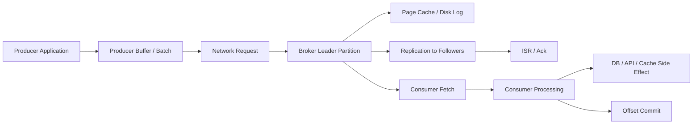
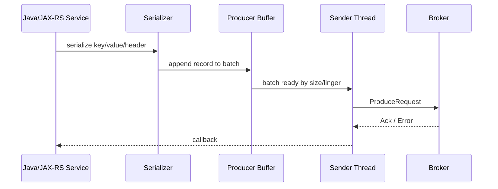
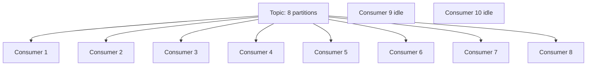
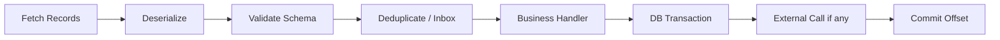

# Part 029 — Kafka Performance and Capacity Planning

> Fokus part ini: memahami Kafka performance sebagai hasil interaksi producer, topic, partition, broker, disk, network, replication, retention, consumer, downstream dependency, dan deployment environment. Kafka tuning bukan sekadar menaikkan partition count atau menambah consumer replica.

---

## 1. Core Mental Model

Kafka performance harus dibaca sebagai pipeline:



Setiap stage bisa menjadi bottleneck:

| Stage | Bottleneck umum | Symptom |
|---|---|---|
| Producer app | event creation lambat, serialization mahal | send rate rendah, CPU app tinggi |
| Producer buffer | buffer penuh, batching tidak efisien | bufferpool wait naik, delivery timeout |
| Network | bandwidth, TLS overhead, DNS, cross-zone traffic | request latency naik, timeout |
| Broker leader | CPU, request queue, disk IO, page cache pressure | produce/fetch latency naik |
| Replication | follower lambat, ISR shrink | under-replicated partition, ack lambat |
| Storage | disk throughput, retention besar, compaction | disk usage naik, IO wait tinggi |
| Consumer fetch | fetch size, assignment, lag tinggi | lag naik, fetch latency naik |
| Consumer handler | DB/API lambat, poison event, lock contention | processing latency naik, commit tertunda |
| Downstream DB/API | connection pool, locks, throttling | lag naik meskipun Kafka sehat |

Prinsip penting: Kafka cepat ketika workload selaras dengan log append, batching, sequential IO, dan parallelism per partition. Kafka lambat ketika workload memaksa broker/client sering flush request kecil, hot partition, consumer serial bottleneck, atau downstream tidak mampu mengikuti event rate.

---

## 2. Performance Vocabulary

Sebelum tuning, samakan bahasa:

| Istilah | Arti |
|---|---|
| Throughput | Jumlah record/byte per detik yang dapat diproduksi atau dikonsumsi |
| Latency | Waktu dari satu titik ke titik lain, misalnya send-to-ack atau produce-to-consume |
| End-to-end latency | Waktu dari business event terjadi sampai downstream effect selesai |
| Tail latency | Latency p95/p99; sering lebih penting dari rata-rata |
| Saturation | Resource mendekati penuh: CPU, disk, network, request queue, buffer |
| Backlog | Record yang belum diproses consumer |
| Consumer lag | Selisih offset latest dengan offset consumer group |
| Capacity | Beban maksimum yang bisa ditangani dengan SLO tertentu |
| Headroom | Kapasitas cadangan sebelum SLO rusak |

Jangan menyebut sistem “fast” hanya karena average latency rendah. Sistem production perlu p95/p99, lag age, error rate, retry rate, dan headroom.

---

## 3. Throughput vs Latency Trade-Off

Kafka producer bisa mengejar throughput dengan batching. Namun batching biasanya menambah latency kecil.

Trade-off umum:

| Optimasi | Dampak throughput | Dampak latency | Risiko |
|---|---:|---:|---|
| batch size lebih besar | naik | bisa naik | memory usage naik |
| linger.ms lebih besar | naik | naik | event critical terlambat |
| compression enabled | naik untuk network/disk | CPU naik | CPU bottleneck |
| acks=all | durability naik | latency naik | perlu ISR sehat |
| replication factor tinggi | durability naik | broker/network cost naik | write latency naik |
| partition count tinggi | parallelism naik | overhead metadata/file naik | ordering dan operational cost |

Untuk CPQ/order management, semua event tidak punya target sama:

- audit/event history bisa toleran latency lebih tinggi,
- order state transition biasanya butuh latency rendah dan correctness tinggi,
- analytics/high-volume telemetry bisa mengejar throughput,
- integration event ke downstream bisa dibatasi oleh SLA pihak downstream.

Tuning harus dimulai dari SLO per event class, bukan dari angka config generik.

---

## 4. Kafka Performance Dimensions

Ada lima dimensi yang harus dipisah saat diagnosis:

1. **Producer throughput**: seberapa cepat service bisa membuat dan mengirim record.
2. **Broker write capacity**: seberapa cepat broker bisa menerima, mereplikasi, dan menyimpan data.
3. **Broker read capacity**: seberapa cepat broker bisa melayani fetch consumer.
4. **Consumer processing capacity**: seberapa cepat handler menyelesaikan side effect.
5. **Storage/retention capacity**: seberapa lama data disimpan tanpa memenuhi disk.

Kesalahan umum: mengira lag berarti Kafka broker lambat. Pada banyak kasus, broker sehat tetapi consumer handler lambat karena DB lock, connection pool habis, external API timeout, atau poison event.

---

## 5. Producer-Side Performance

Producer Kafka Java client bekerja dengan buffer dan batch.

Alur sederhana:



Config penting:

| Config | Fungsi | Performance impact |
|---|---|---|
| `batch.size` | ukuran batch per partition | batch besar meningkatkan throughput jika traffic cukup |
| `linger.ms` | waktu tunggu batch sebelum dikirim | menaikkan batching, menambah latency |
| `compression.type` | kompresi record batch | hemat network/disk, tambah CPU |
| `buffer.memory` | total memory buffer producer | buffer kecil mudah penuh |
| `acks` | jumlah ack yang dibutuhkan | durability vs latency |
| `retries` | retry transient failure | durability naik, latency tail bisa naik |
| `delivery.timeout.ms` | batas total send sampai berhasil/gagal | terlalu kecil bisa false failure |
| `request.timeout.ms` | timeout request broker | memengaruhi retry behavior |
| `max.in.flight.requests.per.connection` | request parallel per connection | throughput vs ordering/failure semantics |

Untuk service Java/JAX-RS, producer performance tidak boleh hanya dilihat dari Kafka client. Perhatikan juga:

- serialization cost,
- schema validation cost,
- event enrichment cost,
- outbox publisher batch size,
- DB query untuk mengambil outbox row,
- thread pool producer/publisher,
- connection pool PostgreSQL,
- HTTP request latency jika publish dilakukan inline.

---

## 6. Batching Strategy

Batching adalah alasan utama Kafka efisien. Kafka lebih suka sedikit request besar daripada banyak request kecil.

Namun batching per partition berarti producer hanya bisa membentuk batch besar jika banyak record masuk ke partition yang sama dalam window waktu tertentu.

Contoh implikasi:

- traffic rendah + banyak partition = batch kecil,
- key tersebar rata + traffic sedang = batch sedang,
- hot key + satu partition panas = batch besar tetapi skew,
- linger terlalu rendah = request kecil,
- linger terlalu tinggi = latency naik.

Rule of thumb arsitektural:

- Untuk event critical low latency, `linger.ms` kecil lebih masuk akal.
- Untuk event high-throughput non-interactive, batching lebih agresif bisa masuk akal.
- Untuk outbox publisher, batch DB dan batch Kafka harus dituning bersama.

Contoh anti-pattern:

```java
// Anti-pattern: synchronous send per request path untuk event non-critical.
producer.send(record).get();
```

Risiko:

- HTTP thread tertahan,
- tail latency API naik,
- broker/network glitch menjadi customer-facing latency,
- throughput service turun.

Lebih aman untuk banyak use case:

```java
producer.send(record, (metadata, exception) -> {
    if (exception != null) {
        // classify failure, log with event id/correlation id, trigger retry/outbox handling
        return;
    }
    // record topic/partition/offset for traceability
});
```

Tetapi untuk correctness yang melibatkan DB commit, Part 015 tetap lebih penting: gunakan outbox agar publish failure tidak menghilangkan business event.

---

## 7. Compression

Compression mengurangi byte yang dikirim dan disimpan, tetapi menggunakan CPU.

Pilihan umum:

| Compression | Karakter umum | Cocok untuk |
|---|---|---|
| none | CPU rendah, network/disk tinggi | traffic kecil, latency sensitif ekstrem |
| gzip | compression tinggi, CPU lebih mahal | archival/high compression need |
| snappy | cepat, compression sedang | general low-latency throughput |
| lz4 | cepat, compression baik | throughput tinggi |
| zstd | compression sangat baik, CPU relatif efisien | high-volume modern workload jika didukung stack |

Yang perlu diukur:

- producer CPU,
- broker CPU,
- network throughput,
- disk usage,
- request latency,
- consumer decompression cost.

Jangan memilih compression hanya dari artikel benchmark. Payload event internal, ukuran message, schema format, dan hardware menentukan hasil nyata.

---

## 8. Acknowledgement and Replication Cost

`acks` memengaruhi durability dan latency.

| acks | Makna | Risiko |
|---|---|---|
| `0` | producer tidak menunggu broker | data loss tinggi, observability lemah |
| `1` | leader ack setelah write | data bisa hilang jika leader gagal sebelum replica catch up |
| `all` / `-1` | tunggu ISR sesuai config | latency lebih tinggi, durability lebih baik |

Untuk enterprise order/quote event, default mental model yang sehat biasanya `acks=all` dengan `min.insync.replicas` yang benar. Tetapi config aktual harus mengikuti standar internal platform.

Replication factor memengaruhi:

- durability,
- availability,
- disk usage,
- network replication,
- write latency,
- recovery time.

Performance tuning tidak boleh menurunkan durability diam-diam. Jika seseorang mengusulkan `acks=1` untuk “mempercepat”, tanyakan:

- event ini boleh hilang atau tidak?
- apa recovery mechanism jika event hilang?
- apakah ada outbox/reconciliation?
- apakah customer impact diterima?
- apakah perubahan ini disetujui sebagai risk decision?

---

## 9. Partition Count and Parallelism

Partition adalah unit parallelism utama Kafka.

Partition count memengaruhi:

- producer parallelism,
- broker file/log count,
- consumer group parallelism,
- ordering boundary,
- rebalance cost,
- leader distribution,
- recovery time,
- operational overhead.

Consumer parallelism maksimum untuk satu consumer group pada satu topic kira-kira dibatasi oleh jumlah partition. Jika topic punya 8 partition, 20 consumer instance dalam group yang sama tidak membuat 20 instance aktif untuk topic itu; sebagian idle.



Namun menaikkan partition count bukan solusi gratis:

- ordering key mapping bisa berubah untuk future records,
- metadata overhead naik,
- open file/log segment naik,
- rebalance lebih mahal,
- small batch problem bisa muncul,
- cluster controller/broker overhead naik.

Untuk event berbasis aggregate seperti quote/order, partition key harus menjaga ordering per aggregate. Jika partition count dinaikkan, event baru dengan key yang sama bisa masuk ke partition berbeda tergantung partitioner dan metadata baru. Ini tidak mengubah record lama, tetapi bisa memengaruhi asumsi replay dan ordering lintas waktu.

---

## 10. Hot Partition and Skew

Hot partition terjadi ketika satu atau sedikit partition menerima beban jauh lebih besar.

Penyebab umum:

- key terlalu sempit, misalnya tenant besar sebagai key,
- null key sehingga sticky partitioner menciptakan distribusi yang tidak sesuai harapan pada window tertentu,
- satu aggregate sangat aktif,
- event type high-volume dicampur dengan low-volume critical event di topic yang sama,
- producer custom partitioner buruk,
- traffic burst dari batch job.

Symptom:

- satu partition lag tinggi,
- satu broker leader lebih sibuk,
- consumer untuk partition itu CPU/DB lebih tinggi,
- end-to-end latency hanya buruk untuk subset key,
- broker network/disk tidak merata.

Diagnosis awal:

```text
1. Ambil top lagging partitions.
2. Cek leader broker untuk partition tersebut.
3. Cek key distribution sample jika aman.
4. Cek producer source service dan event type.
5. Cek consumer processing latency per partition/key/tenant.
6. Cek apakah ada tenant/order/customer tertentu mendominasi.
```

Mitigasi bergantung pada invariant:

| Mitigasi | Cocok jika | Risiko |
|---|---|---|
| ubah key | ordering lama tidak wajib atau bisa dimigrasi | breaking behavior |
| split topic | event type berbeda punya karakter berbeda | governance lebih kompleks |
| tambah partition | consumer parallelism kurang | ordering mapping berubah |
| shard key buatan | aggregate ordering tidak wajib | event per aggregate bisa out-of-order |
| optimize handler | bottleneck di consumer logic | tidak menyelesaikan producer skew |
| isolate tenant besar | multi-tenant heavy hitter | topic explosion/ops overhead |

---

## 11. Consumer Throughput

Consumer throughput bukan hanya jumlah message per detik yang bisa di-fetch. Yang penting adalah message per detik yang selesai diproses dan aman di-commit.

Consumer pipeline:



Bottleneck umum:

- deserialization gagal atau mahal,
- handler synchronous terlalu lambat,
- DB lock/contention,
- connection pool exhausted,
- external API throttled,
- idempotency table tidak diindeks dengan benar,
- inbox cleanup buruk,
- poison event memblokir partition,
- commit offset terlalu sering,
- max poll records terlalu besar sehingga max poll interval terlewati.

Config penting:

| Config | Fungsi | Risiko jika salah |
|---|---|---|
| `max.poll.records` | jumlah record per poll | terlalu besar membuat processing lama; terlalu kecil overhead naik |
| `max.poll.interval.ms` | batas waktu antar poll | terlalu kecil menyebabkan rebalance saat processing lambat |
| `fetch.min.bytes` | minimal data fetch | bisa menaikkan throughput tapi menambah latency |
| `fetch.max.bytes` | maksimum fetch response | terlalu kecil membatasi throughput |
| `max.partition.fetch.bytes` | fetch per partition | terlalu kecil untuk large message |
| `enable.auto.commit` | auto commit offset | correctness risk untuk processing non-trivial |

Untuk consumer yang menulis PostgreSQL, sering kali bottleneck ada di:

- index missing,
- row lock,
- transaction terlalu panjang,
- batch insert/update tidak efisien,
- connection pool kecil,
- deadlock retry,
- foreign key/check constraint mahal,
- JSONB processing tanpa index yang tepat.

---

## 12. Consumer Parallelism Pattern

Ada beberapa pola parallelism:

### 12.1 Scale consumer instances

Menambah pod consumer dalam group yang sama.

Cocok jika:

- partition count cukup,
- bottleneck CPU/processing per consumer,
- downstream DB/API masih punya capacity.

Tidak membantu jika:

- partition count lebih kecil dari replica,
- satu partition hot,
- DB adalah bottleneck,
- poison event memblokir satu partition,
- consumer sering rebalance.

### 12.2 Parallelize inside consumer

Consumer fetch lalu dispatch ke executor.

Risiko besar:

- ordering per partition bisa rusak,
- offset commit menjadi sulit,
- failure partial antar task,
- backpressure perlu eksplisit,
- shutdown lebih rumit.

Jika dipakai, perlu desain:

- per-partition ordered executor,
- bounded queue,
- pause/resume saat backlog internal penuh,
- commit offset hanya setelah semua prior record selesai,
- idempotency wajib.

### 12.3 Split workload by topic/event type

Cocok jika satu topic mencampur event berat dan ringan.

Risiko:

- topic governance lebih kompleks,
- consumer dependency bertambah,
- schema/event catalog harus rapi.

---

## 13. Broker Capacity

Broker capacity dipengaruhi oleh:

- number of brokers,
- partition leaders per broker,
- replication factor,
- min ISR,
- disk throughput,
- disk capacity,
- network bandwidth,
- CPU untuk compression/TLS/request handling,
- page cache,
- retention/compaction workload,
- number of clients/connections,
- controller/metadata overhead.

Broker sehat bukan hanya “up”. Broker sehat berarti:

- tidak ada offline partition,
- under-replicated partition rendah/nol,
- ISR stabil,
- request latency normal,
- disk usage punya headroom,
- network tidak saturasi,
- controller stabil,
- leader distribution seimbang,
- GC/CPU normal jika JVM broker self-managed,
- no throttling/quota surprise.

Untuk managed Kafka, beberapa detail broker mungkin tidak terlihat penuh. Namun konsep diagnosis tetap sama: baca metric yang tersedia dan pahami batas managed service.

---

## 14. Disk IO and Page Cache

Kafka mengandalkan log append dan page cache. Disk bukan hanya storage; disk adalah bagian dari performance path.

Hal yang memengaruhi disk:

- write throughput producer,
- replication writes,
- consumer reads dari page cache atau disk,
- retention cleanup,
- log compaction,
- segment rolling,
- broker recovery,
- re-replication setelah broker/node failure.

Symptom disk bottleneck:

- broker request latency naik,
- produce/fetch latency naik,
- disk IO utilization tinggi,
- page cache miss meningkat,
- under-replicated partition karena follower lambat,
- log flush/recovery lambat,
- disk usage mendekati penuh.

Performance dan retention selalu terkait. Retention terlalu panjang untuk high-volume topic bisa membuat disk penuh atau recovery sangat lambat. Retention terlalu pendek bisa menghancurkan replay/recovery capability.

---

## 15. Network IO

Kafka bisa menjadi network-heavy karena setiap write direplikasi.

Contoh kasar:

```text
producer writes 100 MB/s
replication factor = 3
broker cluster internal replication roughly adds significant additional network traffic
consumer reads add more outgoing traffic
cross-AZ/cross-region traffic can multiply cost and latency
```

Network bottleneck bisa muncul di:

- producer to broker,
- broker to broker replication,
- broker to consumer,
- cross-zone routing,
- NAT gateway,
- load balancer,
- Kubernetes overlay network,
- TLS overhead,
- firewall/security inspection.

Checklist diagnosis:

- cek bytes in/out per broker,
- cek request timeout producer/consumer,
- cek cross-zone traffic,
- cek advertised listener path,
- cek TLS handshake/auth failure,
- cek broker leader distribution,
- cek consumer fetch rate.

---

## 16. Retention as Capacity Variable

Retention bukan hanya compliance setting; retention adalah capacity variable.

Disk requirement kasar:

```text
required_storage ≈ daily_ingest_bytes × retention_days × replication_factor × overhead_factor
```

Overhead factor bergantung pada segment, index, compaction, filesystem, dan operational headroom.

Contoh reasoning:

- topic ingest 200 GB/hari,
- retention 7 hari,
- replication factor 3,
- raw replicated storage minimal sekitar 4.2 TB sebelum overhead/headroom.

Jangan lupa:

- burst traffic,
- reprocessing window,
- delayed consumer recovery,
- compaction backlog,
- disk failure/re-replication,
- future growth,
- environment non-prod.

Part 030 membahas retention/compaction lebih detail.

---

## 17. Broker Sizing Mental Model

Broker sizing harus mulai dari workload, bukan dari default instance size.

Input yang dibutuhkan:

| Input | Kenapa penting |
|---|---|
| messages/sec per topic | throughput record |
| average/max message size | network, disk, fetch config |
| bytes/sec ingest | broker write capacity |
| replication factor | disk/network multiplier |
| retention days/size | storage capacity |
| number of partitions | metadata, parallelism, overhead |
| consumer groups count | read amplification |
| compression ratio | disk/network reduction |
| peak/burst factor | headroom |
| SLO latency | tuning target |
| DR/replication | extra network/storage |

Output sizing:

- broker count,
- disk size and type,
- network capacity,
- CPU headroom,
- partition per broker target,
- leader distribution,
- replication factor,
- retention budget,
- scaling trigger.

Untuk backend engineer, tujuan bukan selalu menentukan broker size sendiri, tetapi mampu berdiskusi dengan platform/SRE menggunakan bahasa yang benar.

---

## 18. Partition Count Planning

Pertanyaan sebelum menentukan partition count:

1. Berapa throughput target topic?
2. Berapa parallelism consumer yang dibutuhkan?
3. Apakah ordering per aggregate wajib?
4. Apa partition key?
5. Apakah key distribution merata?
6. Berapa consumer group yang membaca topic ini?
7. Apakah topic akan direplay besar-besaran?
8. Apakah topic high-volume atau low-volume critical?
9. Apakah partition count bisa dinaikkan nanti tanpa mengganggu semantics?
10. Apakah platform punya limit partition per broker?

Formula konseptual:

```text
partition_count >= required_consumer_parallelism
partition_count should also support target throughput
partition_count must not violate ordering/cost/operational constraints
```

Jangan membuat semua topic punya partition count besar “agar future-proof”. Itu sering berubah menjadi metadata overhead, small batch inefficiency, dan operational noise.

---

## 19. Load Testing Kafka-Based Systems

Load test Kafka harus mengukur end-to-end, bukan hanya produce benchmark.

Minimal load test scenarios:

| Scenario | Tujuan |
|---|---|
| steady-state normal load | baseline throughput/latency |
| peak load | cek headroom |
| burst load | cek buffering dan lag recovery |
| consumer down then catch-up | cek backlog drain rate |
| broker degraded | cek replication/latency impact |
| DB slow | cek consumer backpressure |
| poison event | cek retry/DLQ behavior |
| schema failure | cek deserialization/compatibility guard |
| replay load | cek idempotency dan downstream capacity |

Metrics yang harus dikumpulkan:

- producer send rate/error/retry/latency,
- broker request latency,
- bytes in/out,
- partition skew,
- consumer lag and lag age,
- processing latency,
- DB CPU/locks/connection pool,
- DLQ rate,
- end-to-end latency,
- pod CPU/memory,
- network throughput.

Anti-pattern load test:

- hanya test producer tanpa consumer,
- payload tidak realistis,
- key distribution tidak realistis,
- schema/serialization berbeda dari production,
- tidak menyertakan DB side effect,
- tidak mengukur p95/p99,
- tidak menguji recovery setelah lag.

---

## 20. Capacity Planning for Consumer Lag Recovery

Saat consumer down selama 1 jam, pertanyaannya bukan hanya “berapa lag?” tetapi “berapa lama catch-up?”

Contoh:

```text
incoming rate = 10,000 events/min
consumer processing capacity = 15,000 events/min
outage = 60 min
backlog = 600,000 events
net catch-up rate = 15,000 - 10,000 = 5,000 events/min
catch-up time = 600,000 / 5,000 = 120 min
```

Jika consumer capacity hanya sedikit di atas incoming rate, recovery lama. Jika capacity sama dengan incoming rate, backlog tidak pernah turun.

SLO harus mencakup:

- maximum acceptable lag age,
- recovery time setelah outage,
- downstream DB capacity saat catch-up,
- retry/DLQ behavior saat replay/catch-up,
- apakah catch-up boleh menurunkan online traffic.

---

## 21. Performance Failure Modes

| Failure mode | Symptom | Kemungkinan root cause | Tindakan awal |
|---|---|---|---|
| Producer latency naik | request latency/retry naik | broker/network/acks/ISR | cek broker latency, ISR, network |
| Producer delivery timeout | send gagal setelah retry | broker unavailable, buffer penuh, timeout kecil | cek producer buffer, broker health |
| Lag naik merata | semua partition lag | consumer capacity turun, DB slow | cek processing latency dan DB |
| Lag hanya satu partition | one partition lag tinggi | hot key, poison event | cek key/event di partition |
| Rebalance storm | assignment sering berubah | pod restart, max poll exceeded, heartbeat issue | cek consumer logs, kube events |
| Broker disk penuh | disk usage alert | retention terlalu besar, traffic naik | cek topic size/retention |
| ISR shrink | under-replicated partition | follower slow, network/disk issue | cek broker follower/network/disk |
| Tail latency tinggi | p99 buruk | GC, DB locks, batch burst, network jitter | breakdown latency |
| DLQ spike | DLQ rate naik | schema/handler/permanent failure | sample DLQ safely |

---

## 22. Java/JAX-RS Performance Concerns

Dalam Java/JAX-RS service, Kafka performance sering dipengaruhi hal di luar Kafka:

- HTTP worker thread blocked oleh synchronous send,
- producer instance dibuat per request,
- serializer terlalu mahal,
- payload terlalu besar karena event-carried state transfer berlebihan,
- event publish dilakukan sebelum DB commit,
- outbox publisher query tidak memakai index,
- retry loop di application layer tidak bounded,
- metrics tidak punya topic/client ID label,
- consumer handler memakai unbounded executor,
- consumer melakukan external API call tanpa timeout/bulkhead,
- offset commit terlalu sering atau tidak aman,
- DB transaction terlalu panjang.

Producer instance harus long-lived dan reusable. Membuat producer per request adalah anti-pattern berat karena metadata fetch, connection setup, buffer allocation, dan resource cleanup akan merusak latency/throughput.

---

## 23. PostgreSQL/MyBatis/JDBC Performance Concerns

Integrasi PostgreSQL sering menjadi bottleneck Kafka consumer/outbox.

Checklist outbox publisher:

- index untuk status + created_at/id,
- batch select terbatas,
- `FOR UPDATE SKIP LOCKED` jika multi-publisher,
- update status efisien,
- payload tidak terlalu besar,
- cleanup/partitioning outbox table,
- retry state tidak membuat query berat,
- transaction pendek.

Checklist inbox/idempotency:

- unique index pada event_id/dedup_key,
- insert-on-conflict pattern,
- status processing tidak menciptakan deadlock,
- cleanup/retention,
- query by event_id cepat,
- business update dan inbox write dalam transaction yang sama.

Consumer throughput sering membaik setelah DB index/transaction diperbaiki, bukan setelah partition ditambah.

---

## 24. Kubernetes Performance Concerns

Kafka client di Kubernetes punya failure/performance khusus:

- CPU throttling membuat poll/heartbeat terlambat,
- memory limit terlalu kecil membuat GC/OOM,
- rolling update memicu rebalance storm,
- readiness salah membuat pod menerima traffic sebelum Kafka client siap,
- liveness terlalu agresif membunuh consumer yang sedang restore/catch-up,
- HPA berdasarkan CPU saja tidak memahami consumer lag,
- pod anti-affinity tidak diperhatikan untuk critical consumers,
- network policy/DNS issue menambah timeout,
- preStop/grace period terlalu pendek untuk commit/shutdown.

Untuk consumer high-throughput, pantau:

- CPU throttling,
- GC pause,
- pod restart,
- rebalance count,
- lag per pod/partition,
- DB pool saturation,
- processing latency.

---

## 25. Cloud, On-Prem, and Hybrid Capacity Considerations

### Managed Kafka

Perhatikan:

- broker type/class,
- storage autoscaling,
- partition limits,
- throughput quotas,
- cross-AZ cost/latency,
- metric visibility,
- upgrade windows,
- auth/network constraints,
- connector managed service limits.

### Self-managed Kafka

Perhatikan:

- broker OS tuning,
- disk layout,
- filesystem,
- JVM/GC,
- network interface,
- rack awareness,
- patching,
- backup/DR,
- operational expertise.

### Hybrid

Perhatikan:

- WAN latency,
- cross-region replication,
- bandwidth cap,
- firewall/NAT,
- certificate rotation,
- offset translation,
- failover semantics,
- duplicate events during recovery.

Performance di hybrid deployment lebih sering dibatasi network dan operational boundaries daripada Kafka client config.

---

## 26. Tuning Workflow

Jangan tuning secara acak. Gunakan workflow:

```text
1. Define SLO
2. Measure baseline
3. Identify bottleneck stage
4. Change one variable
5. Load test
6. Compare p50/p95/p99, error, lag, saturation
7. Validate correctness impact
8. Roll out gradually
9. Monitor recovery and regression
```

Contoh salah:

```text
Lag naik -> tambah partition -> tambah consumer -> selesai
```

Contoh lebih benar:

```text
Lag naik -> cek lag per partition -> satu partition hot -> cek key distribution -> tenant besar mendominasi -> cek business ordering invariant -> pilih mitigation: isolate tenant / split event / optimize handler / controlled repartitioning
```

---

## 27. Capacity Planning Questions for Architecture Review

Gunakan pertanyaan ini saat review desain event-driven:

1. Berapa expected message rate normal dan peak?
2. Berapa average dan max payload size?
3. Apa partition key dan distribusinya?
4. Berapa partition count awal dan kenapa?
5. Berapa consumer group yang membaca topic?
6. Berapa consumer parallelism yang dibutuhkan?
7. Apa target p95/p99 end-to-end latency?
8. Apa maximum acceptable lag age?
9. Berapa retention dan replay window?
10. Apakah topic compacted, delete-based, atau keduanya?
11. Apakah event high-volume dicampur dengan critical low-volume?
12. Apa downstream bottleneck utama?
13. Apa plan jika consumer down 1 jam?
14. Bagaimana load test dilakukan?
15. Apa dashboard dan alert sebelum go-live?

---

## 28. Internal Verification Checklist

Gunakan checklist ini di CSG/team. Jangan asumsikan detail internal tanpa verifikasi.

### Kafka cluster/platform

- Broker count per environment.
- Managed Kafka atau self-managed.
- Replication factor default.
- `min.insync.replicas` default.
- Partition limit per broker/topic.
- Broker disk type, capacity, autoscaling jika ada.
- Network bandwidth/cross-zone topology.
- Quota/throttling policy.
- Upgrade/maintenance window.

### Topic capacity

- Topic throughput per hari/jam/menit.
- Average dan max message size.
- Partition count per topic.
- Leader distribution.
- Retention dan cleanup policy.
- High-volume topic dan critical topic.
- Partition skew dashboard.
- Topic growth trend.

### Producer

- Producer config: `acks`, `retries`, `linger.ms`, `batch.size`, `compression.type`, `delivery.timeout.ms`.
- Producer metrics by `client.id`.
- Synchronous vs asynchronous send.
- Outbox publisher batch size.
- Serialization cost.
- Event payload size.
- Retry/error handling.

### Consumer

- Consumer group lag dashboard.
- Lag per partition.
- Consumer replicas vs partition count.
- `max.poll.records`, `max.poll.interval.ms`, fetch config.
- Processing latency.
- Offset commit strategy.
- Rebalance metrics.
- DB/API downstream bottleneck.

### PostgreSQL/MyBatis/JDBC

- Outbox table index and cleanup.
- Inbox/idempotency table index.
- Connection pool capacity.
- DB lock/deadlock metrics.
- Slow queries from consumer/outbox publisher.
- Transaction duration.

### Kubernetes/cloud/on-prem

- Pod resource request/limit.
- CPU throttling metrics.
- HPA rule.
- Rolling update strategy.
- Graceful shutdown.
- NetworkPolicy/security group.
- Cross-region/cross-zone traffic.

### Load testing

- Latest load test result.
- Peak scenario tested.
- Consumer catch-up tested.
- Replay tested.
- Poison event tested.
- Broker degradation tested.
- DB slow scenario tested.

---

## 29. PR Review Checklist

Saat review PR yang menyentuh Kafka performance:

- Apakah payload event membesar signifikan?
- Apakah topic baru punya partition count yang dijelaskan?
- Apakah partition key bisa menyebabkan hot partition?
- Apakah producer config mengikuti standar internal?
- Apakah send dilakukan synchronous di request path?
- Apakah outbox publisher punya batch dan index yang benar?
- Apakah consumer processing bisa melewati `max.poll.interval.ms`?
- Apakah consumer menulis DB dengan query/index yang aman?
- Apakah ada external API call tanpa timeout/bulkhead?
- Apakah retry bisa menciptakan retry storm?
- Apakah metrics punya label topic/client/group yang cukup?
- Apakah dashboard/alert diperbarui?
- Apakah load test diperlukan sebelum merge?
- Apakah capacity impact didokumentasikan di ADR?

---

## 30. Key Takeaways

- Kafka performance adalah pipeline problem, bukan config problem tunggal.
- Consumer lag adalah symptom; root cause bisa producer, broker, network, consumer, DB, schema, retry, atau hot partition.
- Partition count menentukan parallelism tetapi juga membawa ordering dan operational cost.
- Batching dan compression menaikkan throughput, tetapi harus diuji terhadap latency dan CPU.
- Retention memengaruhi storage capacity, recovery, replay, dan disk pressure.
- Consumer throughput biasanya dibatasi handler dan downstream DB/API, bukan Kafka fetch.
- Load test harus end-to-end dan mencakup recovery setelah backlog.
- Capacity planning harus dimulai dari SLO, event rate, payload size, retention, partition strategy, dan downstream capacity.

