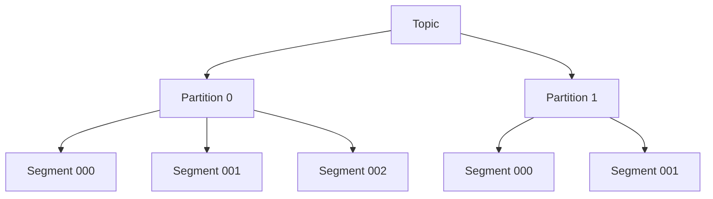
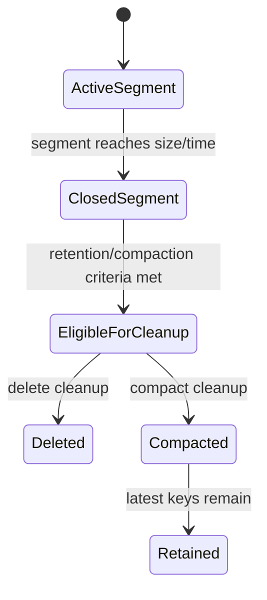

# Part 030 — Retention, Compaction, and Storage

> Fokus part ini: memahami bagaimana Kafka menyimpan data, kapan data dihapus, kapan data dikompaksi, bagaimana tombstone bekerja, dan kenapa retention/compaction adalah keputusan architecture, bukan sekadar konfigurasi platform.

---

## 1. Core Mental Model

Kafka menyimpan record dalam log per partition.



Setiap partition adalah append-only log. Producer menambah record ke ujung log. Consumer membaca berdasarkan offset. Kafka tidak menghapus record saat consumer sudah membaca. Data tetap ada sampai retention/cleanup policy menghapus atau mengompaksi segment.

Ini berbeda dari queue tradisional. Dalam Kafka:

- consumer acknowledgement tidak menghapus message,
- offset consumer group hanya pointer pembacaan,
- replay mungkin selama data masih ada,
- retention adalah batas recovery/reprocessing,
- compaction mempertahankan latest value per key, bukan semua history.

---

## 2. Why Retention Exists

Retention menjawab pertanyaan: berapa lama Kafka harus menyimpan data?

Alasan retention:

- membatasi disk usage,
- menyediakan replay window,
- mendukung consumer downtime recovery,
- mendukung audit/history jika topic memang dirancang untuk itu,
- mendukung projection rebuild,
- menghindari storage tumbuh tanpa batas.

Retention terlalu pendek:

- consumer yang down lama kehilangan data,
- replay/backfill tidak mungkin,
- recovery projection gagal,
- offset out of range,
- data loss secara business.

Retention terlalu panjang:

- disk cost tinggi,
- broker recovery lambat,
- re-replication mahal,
- compaction backlog besar,
- privacy/compliance risk meningkat,
- operational blast radius saat disk pressure.

Retention adalah trade-off antara recovery capability, cost, performance, dan risk.

---

## 3. Kafka Storage Building Blocks

| Konsep | Makna |
|---|---|
| Topic | logical stream/category record |
| Partition | ordered log unit |
| Offset | posisi record dalam partition |
| Segment | file fisik bagian dari partition log |
| Active segment | segment yang sedang ditulis |
| Closed segment | segment lama yang bisa eligible untuk cleanup |
| Index file | membantu lookup offset/time |
| Retention | aturan kapan data boleh dihapus |
| Compaction | cleanup yang mempertahankan latest record per key |
| Tombstone | record key dengan value null untuk menghapus key dalam compacted topic |

Kafka cleanup biasanya bekerja pada closed segment, bukan record individual satu per satu. Karena itu, record yang sudah melewati retention tidak selalu langsung hilang pada detik itu juga. Cleanup bergantung pada segment rolling dan background cleaner.

---

## 4. Segment Lifecycle

Lifecycle sederhana:



Segment rolling dipengaruhi oleh:

- segment size,
- segment time,
- broker/topic configuration,
- traffic volume.

Implikasi:

- high-volume topic cepat membuat segment baru,
- low-volume topic mungkin segment aktif bertahan lama,
- cleanup bisa tertunda sampai segment closed,
- segment size terlalu besar bisa membuat cleanup terlihat lambat,
- segment terlalu kecil meningkatkan jumlah file/metadata overhead.

---

## 5. Cleanup Policy

Kafka topic memiliki cleanup policy utama:

| Policy | Makna | Cocok untuk |
|---|---|---|
| `delete` | hapus data berdasarkan time/size retention | event history, integration events, audit terbatas |
| `compact` | simpan latest value per key | changelog, latest state, lookup topic |
| `compact,delete` | compact dan juga hapus berdasarkan retention | state topic dengan batas umur |

`delete` mempertahankan log sebagai history sementara.

`compact` mempertahankan latest state per key dan membuang versi lama key saat cleaner berjalan.

Jangan memilih compact hanya karena ingin hemat disk. Compact mengubah semantics. Topic compacted bukan event history lengkap.

---

## 6. Delete-Based Retention

Delete-based retention menghapus segment lama berdasarkan waktu atau ukuran.

Config konseptual:

```properties
cleanup.policy=delete
retention.ms=604800000
retention.bytes=-1
segment.bytes=1073741824
segment.ms=604800000
```

Makna:

- simpan data kira-kira 7 hari berdasarkan waktu,
- tidak membatasi berdasarkan size jika `retention.bytes=-1`,
- segment di-roll berdasarkan size/time,
- cleanup menghapus closed segment yang eligible.

Use case:

- domain/integration event dengan replay window terbatas,
- event analytics pipeline,
- audit dengan retention tertentu,
- retry/DLQ topic dengan lifecycle jelas.

Risiko:

- retention lebih pendek dari downtime consumer,
- disk penuh jika traffic naik tetapi retention fixed,
- replay tidak bisa melewati retention,
- offset out of range jika consumer terlalu lama tertinggal.

---

## 7. Size-Based Retention

Size-based retention membatasi total ukuran log partition/topic.

Kegunaan:

- guardrail disk usage,
- high-volume topic dengan storage budget ketat,
- non-critical telemetry.

Risiko:

- data bisa terhapus lebih cepat saat traffic burst,
- replay window menjadi tidak stabil,
- consumer downtime tolerance tidak bisa dinyatakan hanya dalam hari,
- business team bisa salah paham “retention 7 hari” padahal size cap menghapus lebih awal.

Jika memakai size-based retention, dokumentasikan replay window sebagai estimasi tergantung traffic, bukan janji absolut.

---

## 8. Log Compaction

Log compaction mempertahankan record terakhir untuk setiap key.

Contoh log sebelum compaction:

```text
offset 0: key=quote-1, value={status:DRAFT}
offset 1: key=quote-2, value={status:DRAFT}
offset 2: key=quote-1, value={status:APPROVED}
offset 3: key=quote-2, value={status:CANCELLED}
offset 4: key=quote-3, value={status:DRAFT}
```

Setelah compaction, Kafka boleh mempertahankan kira-kira:

```text
key=quote-1, value={status:APPROVED}
key=quote-2, value={status:CANCELLED}
key=quote-3, value={status:DRAFT}
```

Compaction tidak menjamin hanya latest record yang selalu terlihat. Cleaner berjalan background. Consumer bisa membaca record lama jika belum dikompaksi atau jika membaca dari offset lama.

Makna penting:

- compacted topic adalah state reconstruction tool,
- bukan audit log lengkap,
- key wajib stabil,
- null key tidak bisa dikompaksi dengan semantics per key,
- tombstone diperlukan untuk delete key.

---

## 9. Tombstone

Tombstone adalah record dengan key dan value null.

```text
key=quote-123, value=null
```

Dalam compacted topic, tombstone memberi sinyal bahwa key tersebut harus dihapus dari latest state.

Use case:

- menghapus state dari compacted topic,
- sink connector menghapus row di target,
- state store/changelog cleanup,
- materialized view delete propagation.

Risiko:

- consumer tidak siap menerima null value,
- tombstone dianggap deserialization error,
- tombstone retention terlalu pendek/panjang,
- delete semantics tidak terdokumentasi,
- downstream read model tidak menghapus state.

Consumer compacted topic wajib explicitly handle tombstone.

Contoh handler:

```java
if (record.value() == null) {
    readModelRepository.deleteByKey(record.key());
    return;
}

readModelRepository.upsert(record.key(), record.value());
```

---

## 10. Keyed Event Requirement

Compaction hanya bermakna jika record punya key yang stabil.

Key buruk untuk compacted topic:

- random UUID per event,
- null key,
- timestamp,
- correlation ID,
- retry attempt ID.

Key baik:

- aggregate ID,
- entity ID,
- tenant + entity ID jika multi-tenant,
- natural state key yang memang merepresentasikan satu object.

Untuk CPQ/order context:

- quote state compacted topic bisa memakai quote ID,
- order state compacted topic bisa memakai order ID,
- catalog item latest state bisa memakai catalog item ID,
- tenant-aware key bisa dibutuhkan jika ID tidak globally unique.

Tetapi ini harus diverifikasi terhadap internal schema dan ID uniqueness. Jangan mengasumsikan ID global tanpa bukti.

---

## 11. Event History vs Latest State

Kesalahan desain umum: memakai satu topic untuk dua kebutuhan berbeda.

| Kebutuhan | Topic semantics yang cocok |
|---|---|
| Audit lengkap semua perubahan | delete retention panjang atau archival pipeline |
| Latest state per entity | compacted topic |
| Integration event untuk consumer | delete retention sesuai replay window |
| Cache invalidation | delete retention pendek atau compacted tergantung key semantics |
| Changelog state store | compacted internal/changelog topic |
| DLQ investigation | delete retention sesuai incident investigation window |

Jika topic compacted dipakai sebagai audit log, history bisa hilang. Jika topic delete-retention dipakai sebagai latest state store, consumer baru harus membaca seluruh history dalam retention window dan bisa gagal jika data awal sudah terhapus.

---

## 12. Retention and Replay Safety

Replay hanya mungkin jika record masih ada.

Pertanyaan replay:

1. Replay butuh data berapa lama ke belakang?
2. Apakah retention topic cukup?
3. Apakah consumer idempotent?
4. Apakah event schema lama masih bisa dibaca?
5. Apakah downstream side effect aman diulang?
6. Apakah DLQ/retry topic juga masih menyimpan context?
7. Apakah tombstone perlu direplay?
8. Apakah compacted topic cukup untuk rebuild state, atau butuh full history?

Jika replay adalah requirement bisnis, retention harus dirancang, diuji, dan dimonitor. Jangan berharap replay bisa dilakukan jika retention dipilih hanya berdasarkan disk cost.

---

## 13. Retention and Consumer Downtime

Consumer bisa tertinggal selama data masih tersedia. Jika consumer offset menunjuk ke data yang sudah terhapus, consumer akan mengalami offset out of range.

Scenario:

```text
Topic retention: 24 jam
Consumer down: 36 jam
Oldest required offset sudah dihapus
Consumer restart -> offset out of range
```

Pilihan recovery:

- reset ke earliest yang masih ada, dengan data loss gap,
- reset ke latest, kehilangan backlog,
- restore dari backup/archival jika ada,
- rebuild dari source of truth lain,
- lakukan data repair/reconciliation.

Untuk event critical, retention harus lebih panjang dari:

- maximum expected downtime,
- detection time,
- incident response time,
- fix/deploy time,
- replay/recovery time.

---

## 14. Retention and Audit

Audit requirement sering disalahpahami.

Kafka topic retention bukan otomatis audit solution permanen.

Audit membutuhkan:

- immutability expectation,
- access control,
- retention policy yang disetujui,
- search/query capability,
- long-term storage jika perlu,
- evidence chain,
- privacy controls,
- schema readability jangka panjang,
- operational guarantee.

Kafka bisa menjadi sumber event audit sementara atau bagian dari pipeline audit, tetapi untuk retention jangka panjang biasanya perlu sink ke storage lain seperti database audit, object storage, data lake, atau compliance archive. Mekanisme aktual harus diverifikasi internal.

---

## 15. Retention and Privacy

Event payload bisa mengandung data sensitif. Retention panjang memperbesar risk surface.

Concern:

- PII di payload,
- PII di header,
- PII di key,
- data sensitif di DLQ,
- data sensitif di retry topic,
- log aplikasi mencetak payload,
- replay membuka ulang data lama,
- compacted topic mempertahankan latest sensitive state,
- tombstone/delete Kafka bukan selalu sama dengan regulatory deletion end-to-end.

Untuk data sensitif:

- minimalkan payload,
- gunakan reference ID jika cukup,
- hindari PII di key/header karena sering masuk log/metrics,
- pastikan encryption/access control,
- pastikan retention sesuai policy,
- pastikan DLQ punya policy yang sama ketatnya,
- pastikan deletion semantics jelas.

---

## 16. Disk Capacity Planning

Storage requirement kasar:

```text
storage ≈ ingest_bytes_per_day × retention_days × replication_factor × overhead_factor
```

Untuk compacted topic, sizing lebih kompleks karena bergantung pada:

- jumlah unique key,
- update frequency per key,
- compaction lag,
- tombstone rate,
- segment size,
- cleaner throughput,
- delete retention jika `compact,delete`.

Headroom penting karena broker perlu ruang untuk:

- traffic burst,
- re-replication,
- compaction rewrite,
- segment/index overhead,
- delayed cleanup,
- operational response time.

Disk penuh adalah incident serius. Broker yang kehabisan disk dapat menyebabkan produce failure, under-replication, dan availability issue.

---

## 17. Compaction Performance Cost

Compaction bukan gratis. Log cleaner membaca segment lama dan menulis hasil compacted.

Cost:

- disk read/write tambahan,
- CPU tambahan,
- IO contention dengan produce/fetch,
- cleaner backlog,
- tombstone cleanup complexity.

Symptom compaction tidak mampu mengejar:

- compacted topic disk tumbuh terus,
- old versions bertahan lama,
- cleaner metrics backlog naik,
- broker disk IO tinggi,
- request latency ikut naik.

Mitigasi:

- review key cardinality,
- review update frequency,
- tune cleaner config dengan platform/SRE,
- split topic jika satu topic terlalu heterogen,
- review segment size,
- pastikan disk IO cukup,
- jangan masukkan high-churn state tanpa sizing.

---

## 18. Message Size and Storage Impact

Large message memperburuk banyak hal:

- broker disk usage,
- network bandwidth,
- producer memory buffer,
- consumer fetch memory,
- serialization/deserialization latency,
- compaction cost,
- GC pressure,
- DLQ storage,
- replay duration.

Untuk event enterprise, bedakan:

- event notification: payload minimal,
- event-carried state transfer: payload membawa state cukup lengkap,
- audit event: payload mungkin lengkap tetapi retention/security berbeda,
- integration event: payload disesuaikan contract consumer.

Anti-pattern:

- memasukkan seluruh object graph quote/order ke setiap event tanpa alasan,
- payload berisi field yang tidak dibutuhkan consumer,
- binary besar masuk Kafka,
- PII besar masuk DLQ tanpa retention policy.

Jika payload besar memang diperlukan, butuh ADR: kenapa, size limit, retention impact, schema governance, privacy risk, dan load test.

---

## 19. Retention for Retry and DLQ Topics

Retry dan DLQ topic juga butuh retention strategy.

Retry topic:

- retention harus cukup untuk delayed retry window,
- jangan terlalu panjang tanpa cleanup,
- metadata retry count harus jelas,
- poison event jangan berputar selamanya.

DLQ topic:

- retention harus cukup untuk investigation,
- payload bisa sensitif,
- akses harus dibatasi,
- replay tool harus aman,
- DLQ growth harus di-alert,
- expired DLQ harus punya policy.

Pertanyaan penting:

- Berapa lama tim butuh untuk investigasi DLQ?
- Apakah DLQ payload mengandung PII?
- Apakah DLQ akan direplay manual?
- Apakah DLQ masuk audit/compliance scope?
- Siapa owner DLQ?

---

## 20. Retention for Outbox and CDC Pipelines

Jika Kafka diisi dari outbox/CDC, retention Kafka harus dipikirkan bersama retention source table.

Outbox table:

- cleanup terlalu cepat bisa menghilangkan evidence publish,
- cleanup terlalu lambat membuat table bengkak,
- published event retention di DB dan Kafka bisa berbeda,
- failed event harus dipertahankan untuk diagnosis.

Debezium/CDC:

- Kafka retention menentukan replay downstream,
- PostgreSQL WAL retention dipengaruhi replication slot lag,
- connector offset harus dijaga,
- schema history topic harus aman,
- tombstone/delete event handling harus dipahami.

Jangan hanya memonitor Kafka disk. Monitor outbox growth dan replication slot lag juga.

---

## 21. Compacted Topic Use Cases

Use case valid:

- latest account/customer/order/quote state snapshot,
- configuration/state distribution,
- Kafka Streams changelog topic,
- lookup table for stream processing,
- cache warm-up state,
- materialized view source.

Use case berbahaya:

- audit history lengkap,
- event sourcing source of truth,
- business timeline reconstruction,
- compliance evidence semua perubahan,
- workflow step log yang butuh semua transition.

Compacted topic menjawab “state terakhir apa?” bukan “apa saja yang pernah terjadi?”

---

## 22. Delete + Compact Combined Policy

`cleanup.policy=compact,delete` berarti Kafka bisa melakukan compaction dan juga menghapus data berdasarkan retention.

Kegunaan:

- menjaga latest state hanya untuk window tertentu,
- membatasi storage compacted topic,
- state yang kadaluarsa boleh hilang.

Risiko:

- key lama bisa hilang seluruhnya,
- consumer baru tidak bisa rebuild state penuh jika state sudah expired,
- semantics lebih sulit dipahami,
- delete retention dan tombstone retention harus jelas.

Gunakan hanya jika lifecycle state memang punya expiry dan consumer memahami bahwa state lama bisa hilang.

---

## 23. Offset, Retention, and Data Loss

Offset adalah posisi, bukan data. Offset bisa masih tercatat di consumer group, tetapi record pada offset itu sudah dihapus.

Saat offset out of range, config `auto.offset.reset` bisa menentukan behavior jika tidak ada committed offset valid.

Pilihan umum:

| Value | Behavior | Risiko |
|---|---|---|
| `earliest` | mulai dari offset paling awal yang tersedia | bisa memproses banyak data, tetapi gap lama tetap hilang |
| `latest` | mulai dari record baru | backlog hilang diam-diam jika tidak diawasi |
| `none` | error jika offset tidak valid | fail-fast, butuh handling eksplisit |

Untuk consumer critical, hindari reset diam-diam tanpa observability dan approval. Offset reset adalah tindakan data correctness, bukan sekadar operational command.

---

## 24. Storage Failure Modes

| Failure mode | Symptom | Root cause umum | Risiko |
|---|---|---|---|
| Disk usage tinggi | disk alert | retention terlalu panjang, traffic naik | produce failure |
| Retention terlalu pendek | offset out of range | config salah, traffic burst + size cap | data loss |
| Compaction backlog | compacted topic tumbuh | cleaner tidak mampu mengejar | disk pressure |
| Tombstone tidak diproses | stale read model | consumer tidak handle null | data inconsistency |
| Large message spike | broker/client latency naik | payload membesar | OOM/timeout |
| DLQ disk growth | DLQ topic membesar | poison event/schema failure | storage/privacy risk |
| Segment cleanup lambat | data lama masih ada | active segment belum roll, cleaner delay | privacy/capacity risk |
| Re-replication berat | network/disk tinggi | broker failure/recovery | latency/ISR issue |

---

## 25. Production Debugging: Disk Usage Spike

Langkah diagnosis aman:

```text
1. Identifikasi broker/topic yang tumbuh paling cepat.
2. Cek bytes in per topic.
3. Cek retention.ms dan retention.bytes topic.
4. Cek cleanup.policy.
5. Cek partition count dan replica factor.
6. Cek segment rolling config.
7. Cek compaction cleaner backlog jika compacted.
8. Cek DLQ/retry topic spike.
9. Cek producer deployment/release terakhir.
10. Cek payload size change/schema change.
11. Tentukan mitigasi: stop producer, reduce retention, scale storage, drain DLQ, rollback, split topic.
```

Mitigasi harus mempertimbangkan data loss. Mengurangi retention saat incident bisa menyelamatkan disk tetapi menghapus replay/audit window. Perlu approval sesuai severity.

---

## 26. Production Debugging: Offset Out of Range

Kemungkinan:

- consumer down lebih lama dari retention,
- retention.ms terlalu pendek,
- retention.bytes menghapus data lebih cepat karena traffic burst,
- topic recreated,
- offset commit lama menunjuk ke data yang sudah hilang,
- wrong consumer group/environment.

Langkah aman:

```text
1. Jangan langsung reset offset.
2. Identifikasi group, topic, partition, committed offset.
3. Cek earliest/latest available offset.
4. Hitung gap offset dan rentang waktu data hilang.
5. Cek retention config dan topic age.
6. Cek apakah source of truth lain bisa rebuild gap.
7. Cek business impact.
8. Pilih recovery: replay partial, reconciliation, reset earliest/latest dengan approval, data repair.
```

Offset reset tanpa memahami gap bisa membuat data loss permanen dan sulit diaudit.

---

## 27. Production Debugging: Tombstone Issues

Symptom:

- read model masih menampilkan entity yang sudah dihapus,
- consumer error saat value null,
- deserializer gagal untuk tombstone,
- sink connector tidak menghapus target row,
- compacted topic masih menyimpan old value terlalu lama.

Diagnosis:

- cek apakah tombstone diproduksi dengan key benar,
- cek consumer null handling,
- cek connector delete handling,
- cek topic cleanup policy,
- cek tombstone retention,
- cek compaction lag,
- cek key serializer consistency.

---

## 28. Java/JAX-RS Impact

Retention/compaction memengaruhi service Java/JAX-RS:

- endpoint status bisa membaca projection yang stale jika tombstone belum diproses,
- replay dari topic bisa gagal jika retention pendek,
- consumer baru tidak bisa bootstrap state jika data awal hilang,
- large payload memperbesar latency request jika event dibuat inline,
- DLQ payload bisa muncul di log jika exception handler buruk,
- idempotency logic bisa menerima event lama saat replay,
- state transition handler harus siap menerima duplicate/out-of-order event dari replay.

JAX-RS API contract sebaiknya tidak menjanjikan state update downstream langsung selesai hanya karena event sudah diproduksi.

---

## 29. PostgreSQL/MyBatis/JDBC Impact

Retention Kafka harus dibandingkan dengan retention data di PostgreSQL:

- apakah source table masih menyimpan data untuk rebuild jika Kafka retention habis?
- apakah outbox table menyimpan published event cukup lama?
- apakah inbox table retention cukup untuk replay window?
- apakah processed event table cleanup bisa membuat duplicate replay diproses ulang?
- apakah audit table menjadi source of truth untuk event history?
- apakah JSONB payload di outbox terlalu besar dan memperlambat cleanup?

Contoh risk:

```text
Kafka retention: 7 hari
Inbox dedup retention: 3 hari
Replay event umur 5 hari
Result: consumer bisa memproses duplicate karena dedup record sudah dihapus
```

Retention Kafka, inbox, outbox, audit, dan read model harus konsisten dengan replay policy.

---

## 30. Kubernetes/AWS/Azure/On-Prem Impact

### Kubernetes

- PV size menentukan broker disk capacity jika Kafka self-managed.
- StorageClass performance memengaruhi IO.
- Pod reschedule bisa memicu recovery/re-replication.
- Node disk pressure bisa mengganggu broker.
- Backup/restore PV harus jelas.

### AWS

- MSK storage autoscaling jika dipakai harus diverifikasi.
- CloudWatch disk metrics harus di-alert.
- Cross-AZ replication memengaruhi cost/network.
- MSK Connect/Debezium topic internal juga punya retention.

### Azure

- Event Hubs Kafka-compatible endpoint tidak identik dengan Kafka storage semantics penuh; compatibility harus diverifikasi.
- Self-managed Kafka di AKS/VM bergantung pada disk/network Azure.
- Azure Monitor alert harus mencakup storage dan throughput.

### On-prem/hybrid

- disk procurement tidak instan,
- filesystem/RAID/storage appliance memengaruhi latency,
- hybrid replication menambah storage dan network,
- air-gapped deployment butuh retention lebih konservatif untuk recovery.

---

## 31. Retention Design Patterns

### Pattern 1: Integration Event Topic

```text
cleanup.policy=delete
retention = replay window + incident response buffer
key = aggregate id
```

Cocok untuk consumer downstream yang perlu replay beberapa hari/minggu.

### Pattern 2: Latest State Topic

```text
cleanup.policy=compact
key = entity id
value = latest state
```

Cocok untuk bootstrap read model/cache, bukan audit timeline.

### Pattern 3: Audit Event Topic

```text
cleanup.policy=delete
retention = sesuai audit requirement atau sink ke archive
key = aggregate id / audit key
```

Cek apakah Kafka cukup atau butuh archive eksternal.

### Pattern 4: Retry Topic

```text
cleanup.policy=delete
retention = max retry delay + safety buffer
headers = retry count, original topic, original partition, original offset
```

### Pattern 5: DLQ Topic

```text
cleanup.policy=delete
retention = investigation SLA + replay window
access = restricted
schema = dead letter envelope
```

---

## 32. Anti-Patterns

- Semua topic diberi retention sama tanpa memperhatikan business criticality.
- Retention pendek untuk event yang butuh replay panjang.
- Compacted topic dipakai sebagai audit log lengkap.
- Topic tanpa key tetapi ingin compaction.
- Tombstone tidak diuji di consumer.
- DLQ retention lebih longgar daripada sensitive topic asal.
- Large payload tanpa capacity impact review.
- Retention.bytes dipakai tanpa sadar replay window bisa berubah saat traffic burst.
- Inbox dedup retention lebih pendek dari replay window.
- Outbox cleanup menghapus evidence sebelum incident investigation selesai.
- Mengubah retention saat incident tanpa approval data loss.

---

## 33. Internal Verification Checklist

Gunakan checklist ini di CSG/team. Jangan mengasumsikan config internal tanpa verifikasi.

### Topic retention

- Retention ms per topic.
- Retention bytes per topic.
- Cleanup policy per topic.
- Segment size/time config jika topic override.
- Replication factor.
- Topic owner.
- Business reason untuk retention.
- Replay window yang dijanjikan.

### Compaction

- Topic compacted yang ada.
- Key semantics per compacted topic.
- Tombstone behavior.
- Tombstone retention.
- Consumer null handling.
- Compaction lag/dashboard.
- Cleaner performance metrics jika self-managed.

### Storage

- Disk usage per broker/topic.
- Growth trend.
- Storage autoscaling jika ada.
- Disk alert threshold.
- Re-replication capacity.
- Cross-zone/cross-region storage/network cost.

### Event/data classification

- PII/sensitive data di payload.
- PII/sensitive data di header/key.
- DLQ sensitive data handling.
- Retention compliance requirement.
- Audit requirement.
- Deletion/privacy procedure.

### Replay and recovery

- Consumer downtime tolerance.
- Replay procedure.
- Offset reset approval.
- Inbox dedup retention.
- Outbox retention.
- Audit/source-of-truth fallback.
- Reconciliation job.

### Platform/deployment

- Managed Kafka vs self-managed config visibility.
- Topic config as code.
- GitOps drift detection.
- Emergency retention change process.
- Runbook disk full.
- Runbook offset out of range.

---

## 34. PR Review Checklist

Saat review PR/ADR yang menyentuh retention/compaction/storage:

- Apakah topic baru butuh `delete`, `compact`, atau `compact,delete`?
- Apa alasan business retention?
- Apakah replay window eksplisit?
- Apakah retention sesuai consumer downtime tolerance?
- Apakah retention sesuai privacy/compliance?
- Apakah payload size dihitung?
- Apakah key stabil untuk compacted topic?
- Apakah tombstone diproduksi dan dikonsumsi dengan benar?
- Apakah DLQ/retry topic punya retention dan access control?
- Apakah inbox dedup retention >= replay window?
- Apakah outbox cleanup tidak menghapus evidence terlalu cepat?
- Apakah disk capacity impact dihitung?
- Apakah dashboard/alert storage tersedia?
- Apakah perubahan retention bisa menyebabkan data loss?
- Apakah perlu ADR untuk trade-off cost vs recovery?

---

## 35. Key Takeaways

- Kafka tidak menghapus data saat consumer membaca; retention/cleanup policy yang menentukan lifecycle data.
- Delete retention cocok untuk event history terbatas; compaction cocok untuk latest state per key.
- Compacted topic bukan audit log lengkap.
- Tombstone adalah bagian penting dari delete semantics di compacted topic dan harus diuji.
- Retention menentukan replay window dan consumer downtime tolerance.
- Size-based retention bisa membuat replay window berubah saat traffic burst.
- Disk capacity harus dihitung dari ingest rate, retention, replication factor, overhead, dan headroom.
- Retention Kafka harus konsisten dengan inbox, outbox, audit, DLQ, dan reconciliation policy.
- Storage incident sering menjadi data correctness incident, bukan hanya infrastructure incident.

