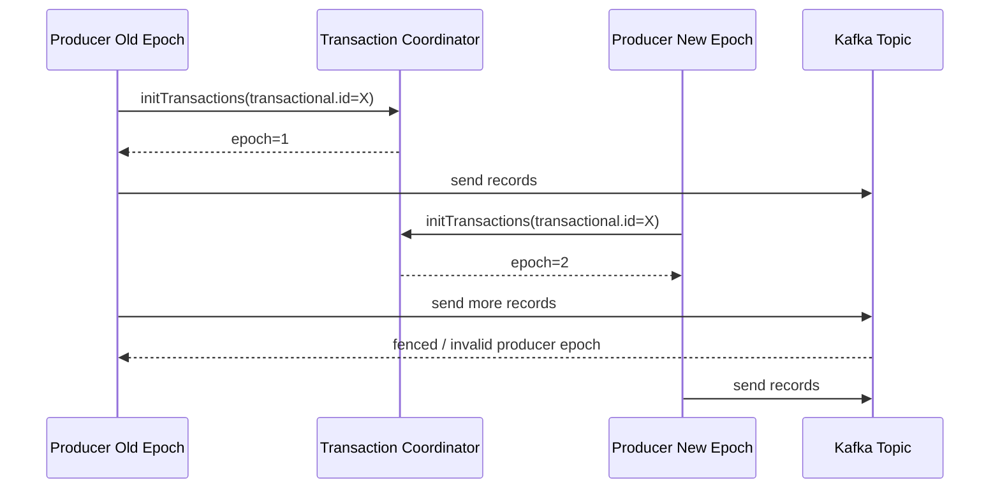
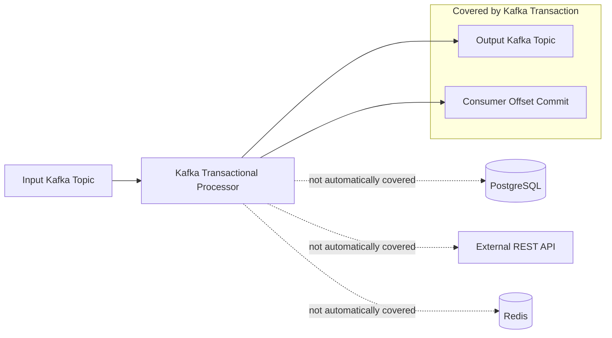
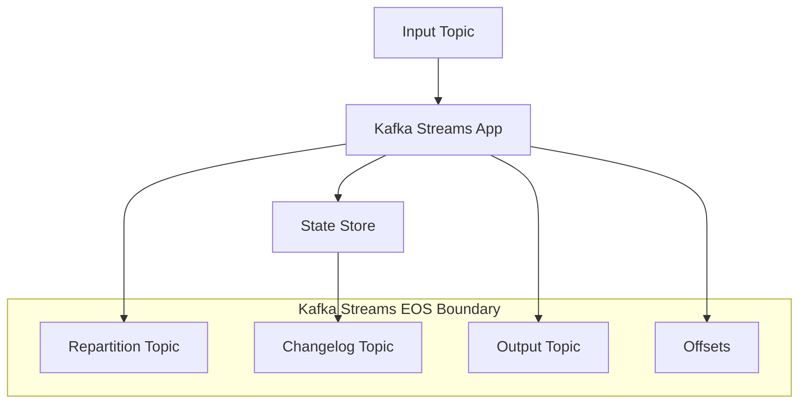
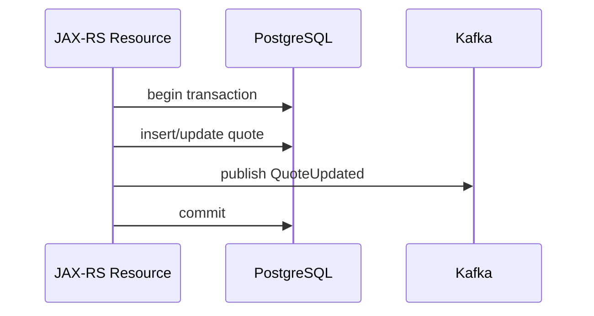
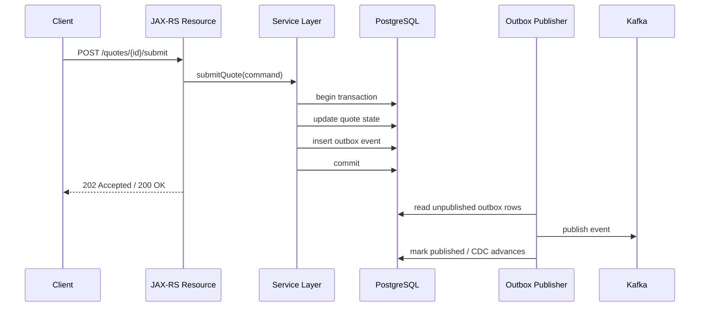

# Part 031 — Kafka Transactions

> Fokus part ini: memahami Kafka transactions secara realistis. Kafka transactions berguna untuk atomicity di dalam Kafka, tetapi tidak otomatis menyelesaikan atomicity antara Kafka dan PostgreSQL, external API, Redis, atau sistem downstream lain.

---

## 1. Core Mental Model

Kafka transaction adalah mekanisme untuk membuat sekumpulan write ke Kafka terlihat secara atomic kepada consumer yang membaca dengan isolation yang sesuai.

Secara sederhana:

```mermaid
sequenceDiagram
  participant App as Java Service / Stream App
  participant Producer as Transactional Producer
  participant TC as Transaction Coordinator
  participant T1 as Topic A / Partition 0
  participant T2 as Topic B / Partition 1
  participant Off as Consumer Offsets Topic

  App->>Producer: beginTransaction()
  Producer->>TC: initialize transactional epoch
  App->>Producer: send(record A)
  Producer->>T1: append transactional record
  App->>Producer: send(record B)
  Producer->>T2: append transactional record
  App->>Producer: sendOffsetsToTransaction(offsets)
  Producer->>Off: stage offset commit
  App->>Producer: commitTransaction()
  Producer->>TC: commit marker
  TC->>T1: transaction committed
  TC->>T2: transaction committed
  TC->>Off: offsets committed
```

Kafka transaction dapat menggabungkan:

- produce ke beberapa topic/partition,
- commit offset consumer ke `__consumer_offsets`,
- read-process-write pattern di Kafka,
- exactly-once processing dalam boundary Kafka.

Namun Kafka transaction tidak membuat PostgreSQL commit dan Kafka publish menjadi satu atomic transaction. Itu tetap problem berbeda.

---

## 2. Why Kafka Transactions Exist

Kafka transaction ada untuk beberapa masalah nyata:

1. **Atomic multi-topic publish**  
   Satu proses perlu publish beberapa record ke beberapa topic dan semua record harus terlihat bersama atau tidak terlihat sama sekali.

2. **Read-process-write stream processing**  
   Aplikasi membaca dari Kafka, memproses, menulis hasil ke Kafka, lalu commit offset. Jika crash terjadi di tengah, hasil dan offset tidak boleh mismatch.

3. **Exactly-once processing inside Kafka**  
   Kafka dapat mencegah duplicate visible output untuk pipeline Kafka-to-Kafka tertentu.

4. **Producer retry without duplicate visible writes**  
   Bersama idempotent producer, transaction membantu mengurangi duplicate output akibat retry dan crash.

Kafka transaction bukan dibuat untuk:

- menggantikan database transaction,
- membuat external API call transactional,
- menghilangkan kebutuhan idempotent consumer,
- menjamin business exactly-once end-to-end,
- menyelesaikan outbox problem antara DB dan Kafka.

---

## 3. Transactional Producer

Transactional producer adalah Kafka producer yang memiliki `transactional.id`.

Contoh konfigurasi konseptual:

```properties
bootstrap.servers=kafka-1:9092,kafka-2:9092
acks=all
enable.idempotence=true
transactional.id=quote-service-publisher-0
transaction.timeout.ms=60000
```

Catatan penting:

- `enable.idempotence=true` otomatis diperlukan untuk transactional producer.
- `acks=all` diperlukan untuk durability yang sesuai.
- `transactional.id` harus stabil untuk instance producer tertentu.
- `transactional.id` tidak boleh sembarang di-generate tanpa strategi.
- Jika dua producer memakai `transactional.id` yang sama, Kafka melakukan fencing.

Lifecycle dasar:

```java
producer.initTransactions();

try {
    producer.beginTransaction();
    producer.send(new ProducerRecord<>(topicA, keyA, valueA));
    producer.send(new ProducerRecord<>(topicB, keyB, valueB));
    producer.commitTransaction();
} catch (Exception e) {
    producer.abortTransaction();
    throw e;
}
```

Ini terlihat sederhana, tetapi operational semantics-nya tidak sederhana.

---

## 4. Transactional ID

`transactional.id` adalah identity logical producer untuk transaction. Kafka menggunakannya untuk:

- melacak producer ID,
- melacak producer epoch,
- melakukan fencing producer lama,
- menghubungkan transaksi yang sedang berjalan dengan coordinator,
- menjaga state transaction antar restart.

Desain `transactional.id` harus memperhatikan deployment model.

Contoh buruk:

```text
transactional.id=quote-service
```

Jika semua pod memakai ID sama, pod akan saling fencing.

Contoh lebih aman untuk workload yang dipartisi:

```text
transactional.id=quote-service-publisher-${stableShardId}
```

Masalahnya: Kubernetes pod name tidak selalu stable shard identity yang benar. Untuk transactional producer, identity harus dirancang, bukan sekadar pakai hostname.

---

## 5. Producer Fencing

Producer fencing adalah mekanisme Kafka untuk mencegah producer lama menulis setelah producer baru dengan `transactional.id` yang sama aktif.



Fencing mencegah split-brain producer. Namun fencing juga bisa menjadi incident jika deployment menyebabkan dua instance aktif dengan identity sama.

Gejala producer fencing:

- `ProducerFencedException`,
- transaction abort meningkat,
- producer error rate naik,
- message tidak ter-publish,
- pod restart loop jika error tidak ditangani benar.

Correct response:

- hentikan producer instance yang fenced,
- jangan retry infinite pada producer yang sudah fenced,
- evaluasi transactional ID strategy,
- cek deployment scaling dan rolling update.

---

## 6. Transaction Timeout

`transaction.timeout.ms` adalah batas waktu transaction aktif sebelum broker menganggap transaction gagal.

Jika transaction terlalu lama:

- broker abort transaction,
- producer menerima error,
- record transactional tidak visible sebagai committed,
- offset yang dikirim dalam transaction tidak committed,
- consumer downstream bisa tertahan membaca committed data jika ada open transaction lama.

Transaction panjang berbahaya karena Kafka transaction bukan tempat untuk long-running business process.

Anti-pattern:

```text
begin Kafka transaction
  call pricing service
  call approval service
  update PostgreSQL
  publish quote event
commit Kafka transaction
```

Masalah:

- external call tidak transactional,
- latency tidak terkendali,
- transaction timeout risk,
- producer resource tertahan,
- failure handling sulit,
- tidak menyelesaikan DB/Kafka atomicity.

Kafka transaction sebaiknya singkat dan bounded.

---

## 7. Send Offsets to Transaction

`sendOffsetsToTransaction()` digunakan dalam pola read-process-write.

Flow:

```mermaid
sequenceDiagram
  participant C as Consumer
  participant P as Transactional Producer
  participant In as Input Topic
  participant Out as Output Topic
  participant Off as __consumer_offsets

  C->>In: poll records
  P->>P: beginTransaction()
  P->>Out: produce processed output
  P->>Off: sendOffsetsToTransaction(next offsets)
  P->>P: commitTransaction()
```

Maknanya: output dan offset commit menjadi atomic dalam Kafka.

Jika commit transaction sukses:

- output terlihat,
- offset dianggap committed.

Jika abort/crash:

- output tidak terlihat untuk `read_committed`,
- offset tidak committed,
- input akan dibaca ulang.

Ini membantu Kafka-to-Kafka processing. Namun jika processing juga menulis PostgreSQL, offset dan output Kafka atomic tidak otomatis mencakup PostgreSQL write.

---

## 8. Consumer Isolation Level

Consumer yang membaca transactional record perlu memahami `isolation.level`.

| isolation.level | Perilaku |
|---|---|
| `read_uncommitted` | Bisa membaca record transactional sebelum commit/abort final |
| `read_committed` | Hanya membaca record non-transactional atau transaction yang sudah committed |

Untuk pipeline yang mengandalkan Kafka transaction, consumer downstream biasanya harus memakai:

```properties
isolation.level=read_committed
```

Tanpa ini, consumer bisa melihat record dari transaction yang akhirnya abort.

Internal verification penting:

- apakah producer transactional benar-benar dipakai,
- apakah consumer downstream memakai `read_committed`,
- apakah topic berisi campuran transactional dan non-transactional producer,
- apakah metrics transaction dipantau.

---

## 9. Exactly-Once Processing in Kafka Context

Exactly-once di Kafka harus dibaca secara sempit:

> Kafka dapat memberikan exactly-once processing untuk pipeline yang membaca dari Kafka, memproses, menulis ke Kafka, dan commit offset ke Kafka dalam transaction yang sama.

Boundary-nya:



Jika pipeline menyentuh PostgreSQL, external REST API, file storage, payment gateway, CRM, provisioning system, atau Redis, exactly-once Kafka tidak cukup.

Yang tetap dibutuhkan:

- idempotency,
- outbox,
- inbox,
- reconciliation,
- business state transition guard,
- retry/DLQ policy,
- audit trail.

---

## 10. Kafka Streams EOS

Kafka Streams menyediakan mode exactly-once processing yang membungkus read-process-write, state store changelog, repartition topic, dan output topic.

Secara konseptual:



Kafka Streams EOS membantu ketika:

- ada aggregation stateful,
- ada join/windowing,
- ada output topic yang tidak boleh duplicate secara visible,
- offset dan output harus atomic dalam Kafka.

Namun tetap tidak menyelesaikan:

- DB update di dalam processor,
- external API call,
- side effect non-Kafka,
- business duplicate akibat replay external,
- corrupt event payload,
- semantic idempotency.

Rule praktis: jangan memasukkan external side effect yang tidak idempotent ke dalam Kafka Streams processor seolah-olah EOS akan melindunginya.

---

## 11. Database Transaction Mismatch

Problem paling sering: Java service menulis PostgreSQL dan publish Kafka event.

Contoh flow:



Failure matrix:

| Step | Failure | Dampak |
|---|---|---|
| DB write sukses, Kafka publish gagal | Event hilang | Downstream tidak tahu perubahan |
| Kafka publish sukses, DB commit gagal | Event palsu | Downstream percaya state yang tidak committed |
| Kafka publish retry setelah timeout | Duplicate event | Consumer harus idempotent |
| DB commit sukses, app crash sebelum publish | Missing event | Butuh outbox/reconciliation |

Kafka transaction tidak bisa membungkus DB transaction PostgreSQL secara natural. Solusi yang lebih umum adalah transactional outbox.

---

## 12. Outbox vs Kafka Transaction

Perbandingan praktis:

| Problem | Kafka Transaction | Transactional Outbox |
|---|---|---|
| Kafka-to-Kafka atomic output + offset | Cocok | Bisa, tetapi biasanya overkill |
| DB write + event publish | Tidak cukup | Cocok |
| External API + event publish | Tidak cukup | Perlu saga/idempotency/reconciliation |
| Multi-topic publish atomic | Cocok | Bisa jika outbox publisher mengatur batch, tetapi tidak native atomic Kafka visible set |
| Consumer duplicate handling | Tidak menghapus kebutuhan | Tetap butuh inbox/idempotency |
| Operational complexity | Medium-high | Medium, tergantung polling/CDC |

Rule sederhana:

- Kafka transaction untuk **Kafka boundary**.
- Outbox untuk **database-to-Kafka boundary**.
- Inbox/idempotency untuk **Kafka-to-database boundary**.
- Saga/compensation untuk **business process boundary**.

---

## 13. When Kafka Transaction Helps

Kafka transaction membantu ketika:

1. **Read-process-write Kafka pipeline**  
   Consumer membaca topic A, menghasilkan topic B, dan offset commit harus atomic.

2. **Kafka Streams stateful processing**  
   Output, changelog, repartition, dan offsets harus konsisten.

3. **Multi-topic publish dalam Kafka**  
   Satu logical processing menghasilkan beberapa Kafka output yang harus terlihat bersama.

4. **Avoid duplicate visible output after retry**  
   Retry producer tidak boleh membuat output ganda yang visible.

5. **Strong processing semantics inside Kafka**  
   Terutama untuk stream processing platform, projection Kafka-to-Kafka, enrichment Kafka-to-Kafka, atau aggregation event.

---

## 14. When Kafka Transaction Does Not Solve the Real Problem

Kafka transaction tidak menyelesaikan:

- DB commit + Kafka publish atomicity,
- DB write + external REST call atomicity,
- HTTP request duplicate submission,
- downstream consumer duplicate side effect,
- payment/provisioning/fulfillment side effect,
- schema compatibility break,
- ordering across partitions,
- replay side effect,
- poison event,
- business invariant violation,
- human workflow compensation.

Jika desain Anda berkata “pakai Kafka transaction supaya tidak perlu idempotency”, itu hampir pasti asumsi lemah.

---

## 15. Transactional Producer Operational Risk

Risiko operational:

### 15.1 Transaction coordinator pressure

Kafka transaction membutuhkan transaction coordinator. Workload transactional yang besar dapat meningkatkan pressure pada broker/coordinator.

### 15.2 Long-running transaction

Transaction terlalu lama dapat menyebabkan:

- abort,
- latency downstream,
- consumer `read_committed` tertahan,
- resource leak-like behavior.

### 15.3 Fencing due to deployment

Rolling update atau scaling yang salah dapat membuat producer saling fencing.

### 15.4 Misconfigured transactional ID

ID terlalu umum menyebabkan collision. ID terlalu random menyebabkan transaction state menumpuk dan fencing tidak efektif.

### 15.5 Mixed isolation consumer

Sebagian consumer `read_committed`, sebagian `read_uncommitted`, menyebabkan observability/debugging membingungkan.

### 15.6 Error handling salah

Producer yang sudah fenced atau transaction fatal error tidak boleh dipakai lagi seperti biasa.

---

## 16. Transaction Metrics

Metrics yang perlu dipantau:

| Metric area | Yang dicari |
|---|---|
| Transaction commit rate | apakah transaction berjalan normal |
| Transaction abort rate | peningkatan abort abnormal |
| Transaction latency | commit/abort lambat |
| Producer error rate | timeout, fenced, coordinator unavailable |
| Request latency | latency ke broker/coordinator |
| Transaction coordinator metrics | load dan error coordinator |
| Consumer lag | downstream tertahan karena transaction/processing |
| `read_committed` lag behavior | LSO/high watermark gap jika tersedia |

Untuk aplikasi Java:

- expose producer metrics,
- tag metric dengan service/pod/topic,
- log transaction boundary dengan correlation ID,
- jangan log payload sensitive,
- alert pada abort spike dan fencing error.

---

## 17. Transaction Failure Modes

### 17.1 Commit timeout

Producer tidak tahu apakah commit berhasil atau gagal secara langsung.

Response:

- treat as ambiguous,
- jangan publish compensating event sembarangan,
- cek broker/client logs,
- cek downstream visibility,
- gunakan idempotency untuk output semantics.

### 17.2 Abort failure

Abort gagal bisa terjadi karena broker unavailable atau producer state invalid.

Response:

- close producer,
- create new producer jika aman,
- monitor transaction coordinator,
- cek open transaction timeout.

### 17.3 Producer fenced

Response:

- stop instance,
- jangan retry transaction dengan producer yang sama,
- cek deployment identity.

### 17.4 Coordinator unavailable

Response:

- cek broker health,
- cek network,
- cek transaction state topic replication,
- cek cluster controller/coordinator logs.

### 17.5 Downstream reads aborted records

Kemungkinan consumer memakai `read_uncommitted`.

Response:

- cek consumer config,
- cek topic producer mix,
- cek consumer library defaults.

---

## 18. Java/JAX-RS Impact

Untuk JAX-RS service yang menerima HTTP command, Kafka transaction jarang menjadi solusi utama untuk publish event setelah DB write.

Lebih aman:



Transactional producer bisa digunakan di outbox publisher jika publisher perlu publish multi-topic atomically, tetapi itu tetap tidak menggantikan outbox transaction dengan DB.

---

## 19. PostgreSQL/MyBatis/JDBC Impact

Pertanyaan yang harus dijawab:

- Apakah business state dan event intent disimpan dalam transaction DB yang sama?
- Apakah outbox row memiliki unique event ID?
- Apakah outbox publisher idempotent?
- Apakah consumer idempotent terhadap duplicate outbox publish?
- Apakah serialization dilakukan sebelum atau sesudah DB commit?
- Apakah MyBatis mapper ikut dalam transaction yang sama dengan insert outbox?
- Apakah ada retry pada serialization/publish failure?
- Apakah migration outbox compatible dengan publisher versi lama dan baru?

Kafka transaction tidak boleh membuat tim mengabaikan pertanyaan-pertanyaan ini.

---

## 20. Kubernetes/AWS/Azure/On-Prem Impact

### Kubernetes

- transactional ID harus compatible dengan pod scaling,
- rolling update tidak boleh menghasilkan duplicate active identity,
- graceful shutdown harus abort/commit dengan jelas,
- pod termination grace period harus cukup,
- readiness harus false sebelum consumer/producer shutdown.

### AWS/Azure managed Kafka

- cek dukungan dan konfigurasi transaction,
- cek broker/client version compatibility,
- cek metrics transaction coordinator,
- cek auth/ACL untuk transactional ID.

### On-prem

- cek replication factor internal transaction state topic,
- cek broker disk/network health,
- cek upgrade compatibility,
- cek transaction coordinator availability.

---

## 21. Security and Authorization Concern

Transactional producer membutuhkan permission yang sesuai.

Perlu dicek:

- write permission ke output topic,
- permission untuk transactional ID,
- consumer group permission jika memakai `sendOffsetsToTransaction`,
- TLS/SASL config,
- secret rotation impact terhadap long-running producer,
- audit log untuk principal producer.

Tanpa ACL yang benar, error bisa muncul sebagai authorization failure saat transaction berjalan, bukan hanya saat startup.

---

## 22. Debugging Checklist

Saat transactional producer bermasalah:

1. Cek error class:
   - `ProducerFencedException`,
   - timeout,
   - authorization,
   - coordinator unavailable,
   - invalid producer epoch.
2. Cek apakah `transactional.id` unik sesuai instance/shard.
3. Cek apakah ada rolling update/scaling baru.
4. Cek transaction timeout vs processing duration.
5. Cek consumer `isolation.level`.
6. Cek abort rate dan commit latency.
7. Cek broker coordinator metrics.
8. Cek ACL transactional ID.
9. Cek apakah ada external side effect di dalam transaction.
10. Cek apakah problem sebenarnya dual-write DB/Kafka.

---

## 23. PR Review Checklist

Gunakan checklist ini saat mereview Kafka transaction usage:

- [ ] Apakah use case benar-benar Kafka-to-Kafka atomicity?
- [ ] Apakah ada PostgreSQL write yang keliru dianggap covered oleh Kafka transaction?
- [ ] Apakah ada external API call di dalam transaction?
- [ ] Apakah `transactional.id` stabil dan tidak collision antar pod?
- [ ] Apakah producer fencing ditangani dengan stop/close, bukan retry infinite?
- [ ] Apakah `transaction.timeout.ms` masuk akal?
- [ ] Apakah consumer downstream memakai `read_committed` jika dibutuhkan?
- [ ] Apakah ACL transactional ID sudah tersedia?
- [ ] Apakah transaction metrics diexpose?
- [ ] Apakah ada test untuk crash before commit, crash after output, dan retry?
- [ ] Apakah outbox tetap digunakan untuk DB + Kafka consistency?
- [ ] Apakah idempotent consumer tetap ada?

---

## 24. Internal Verification Checklist

Cek di internal CSG/team:

- Apakah ada service yang memakai transactional producer?
- Apakah Kafka Streams EOS digunakan?
- Apakah `transactional.id` convention terdokumentasi?
- Apakah ACL transactional ID dikelola as-code?
- Apakah consumer memakai `read_committed` atau default?
- Apakah ada dashboard transaction commit/abort/fencing?
- Apakah ada incident producer fencing atau transaction timeout?
- Apakah outbox publisher memakai transactional producer?
- Apakah ada klaim “exactly-once” di dokumentasi internal yang perlu diklarifikasi?
- Apakah ada flow DB write + Kafka publish tanpa outbox?
- Apakah platform/SRE punya runbook transaction coordinator issue?

---

## 25. Senior Engineer Heuristic

Gunakan prinsip ini:

> Kafka transaction adalah alat correctness untuk boundary Kafka. Untuk boundary bisnis, database, external API, dan human workflow, tetap butuh idempotency, outbox, inbox, saga, compensation, dan reconciliation.

Jika desain terlihat “benar” hanya karena memakai kata exactly-once, review belum selesai.

