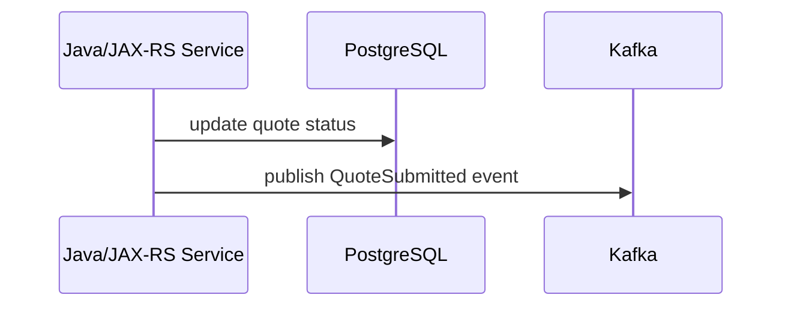
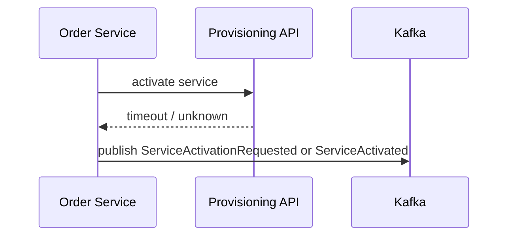
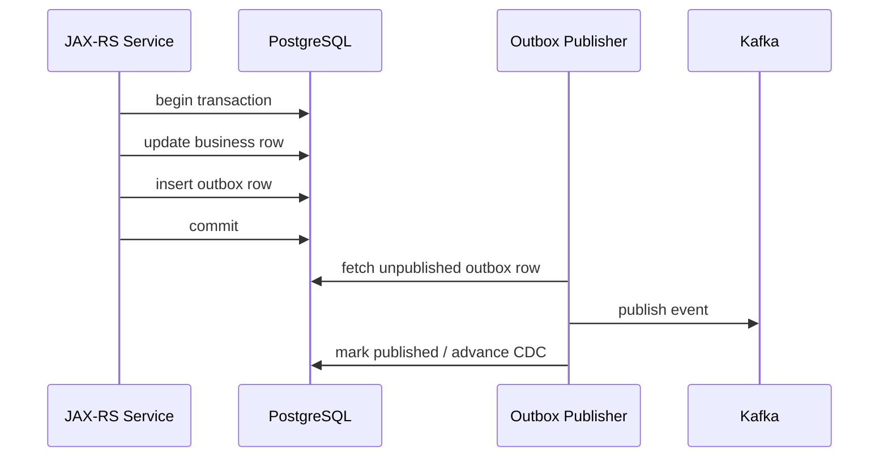
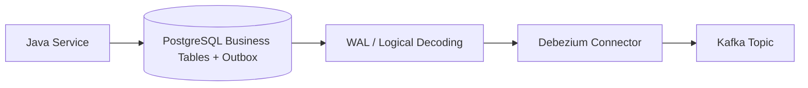
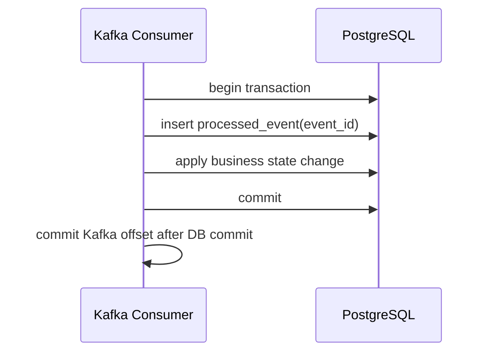
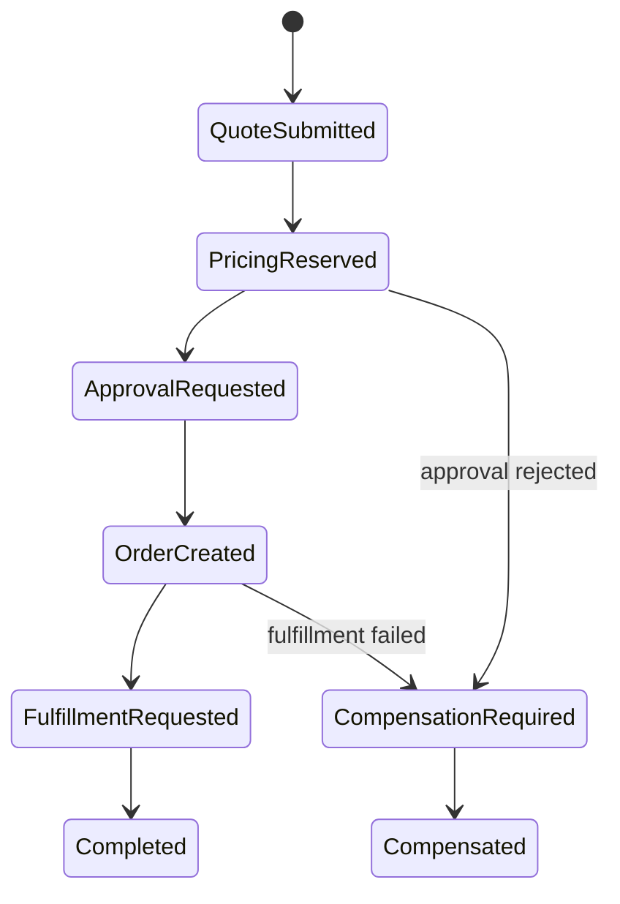
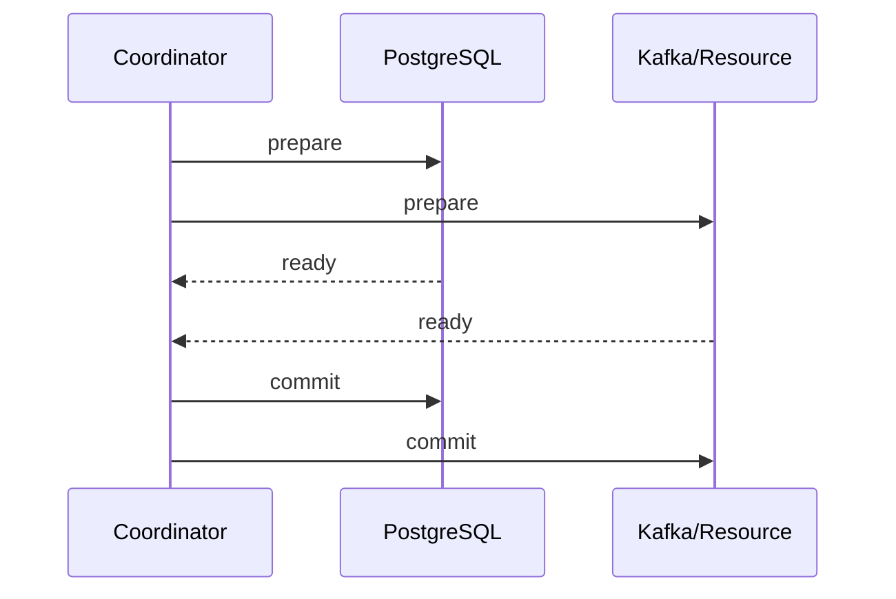
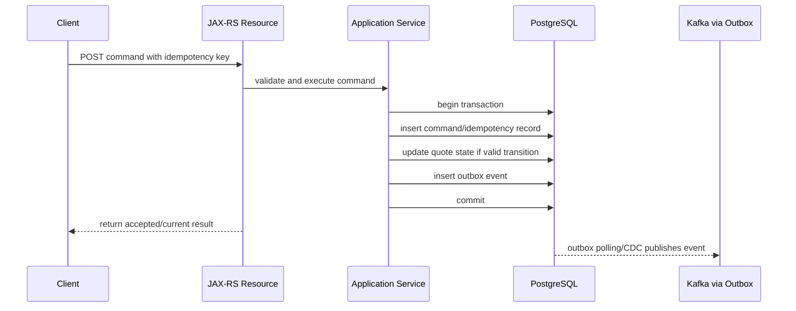

# Part 032 — Dual-Write Problem and Distributed Consistency

> Fokus part ini: memahami kenapa menulis ke dua sistem berbeda adalah sumber utama data inconsistency di event-driven architecture, dan bagaimana memilih solusi yang realistis: outbox, CDC, inbox, saga, compensation, idempotency, dan reconciliation.

---

## 1. Core Mental Model

Dual-write problem terjadi ketika satu business operation harus mengubah dua resource berbeda, tetapi tidak ada atomic transaction yang benar-benar melindungi keduanya.

Contoh paling umum:



Dua write tersebut tidak atomic sebagai satu unit. Jika salah satu sukses dan yang lain gagal, sistem masuk ke state yang tidak konsisten.

Dual-write bukan hanya DB + Kafka. Pola yang sama muncul pada:

- PostgreSQL + Kafka,
- Kafka + PostgreSQL,
- PostgreSQL + Redis,
- PostgreSQL + external REST API,
- external API + Kafka,
- Kafka + object storage,
- database A + database B,
- local state + workflow engine,
- domain state + audit event.

Distributed consistency adalah disiplin mendesain agar mismatch tersebut bisa dicegah, dideteksi, atau diperbaiki.

---

## 2. Why Dual-Write Exists in Enterprise Systems

Enterprise backend jarang hanya menulis satu tempat. Dalam CPQ/order management style system, satu command dapat menyebabkan:

- update quote state,
- insert approval request,
- publish integration event,
- invalidate Redis cache,
- call pricing/eligibility service,
- start workflow/saga,
- create audit record,
- notify downstream order service,
- update read model.

Setiap side effect memiliki failure behavior berbeda. Database bisa commit. Kafka publish bisa timeout. External system bisa return 500 setelah sebenarnya memproses request. Redis bisa expire. Consumer bisa duplicate. Workflow bisa stuck.

Karena itu, architecture yang sehat tidak bertanya “bagaimana supaya tidak pernah gagal?”, tetapi:

- failure mana yang mungkin terjadi,
- state mana yang menjadi source of truth,
- side effect mana yang bisa diulang,
- event mana yang bisa direplay,
- mismatch mana yang bisa direconcile,
- invariant bisnis mana yang tidak boleh dilanggar.

---

## 3. The Basic Failure Matrix

Untuk operasi:

```text
1. Write database
2. Publish Kafka event
```

Failure matrix:

| DB write | Kafka publish | Hasil | Risiko |
|---|---|---|---|
| gagal | tidak dilakukan | aman relatif | command gagal |
| gagal | sukses | event palsu | downstream melihat state yang tidak ada |
| sukses | gagal | missing event | downstream tidak tahu state berubah |
| sukses | timeout ambigu | tidak jelas | duplicate atau missing tergantung retry |
| sukses | sukses | ideal | tetap butuh duplicate-safe consumer |

Timeout adalah kasus paling licin. Producer bisa timeout walaupun broker akhirnya menerima record. Retry bisa menghasilkan duplicate jika producer/idempotency tidak benar atau jika event ID berubah.

---

## 4. Database Write + Kafka Publish

Pattern naïve:

```java
transaction.begin();
quoteRepository.updateStatus(quoteId, SUBMITTED);
kafkaProducer.send(event).get();
transaction.commit();
```

Masalah:

1. Kafka publish sukses, DB commit gagal.
2. Kafka publish timeout, DB transaction tertahan.
3. Kafka publish lambat memperpanjang DB lock.
4. Kafka publish retry bisa duplicate.
5. Jika service crash setelah DB write sebelum publish, event hilang.

Pattern naïve lain:

```java
transaction.begin();
quoteRepository.updateStatus(quoteId, SUBMITTED);
transaction.commit();
kafkaProducer.send(event).get();
```

Masalah:

1. DB commit sukses, service crash sebelum publish.
2. Publish gagal setelah state berubah.
3. Reconciliation diperlukan untuk menemukan missing event.

Solusi utama: transactional outbox.

---

## 5. Kafka Publish + Database Write

Pattern ini kadang muncul pada consumer:

```text
consume event
publish downstream event
write database state
commit offset
```

Failure matrix:

| Kafka publish | DB write | Offset commit | Risiko |
|---|---|---|---|
| sukses | gagal | tidak commit | duplicate downstream event saat retry |
| gagal | sukses | tidak commit | DB berubah, output event hilang |
| sukses | sukses | gagal | input diproses ulang, duplicate side effect |
| sukses | sukses | sukses | ideal |

Jika consumer menghasilkan output event dan menulis DB, Anda harus menentukan source of truth dan idempotency boundary.

Pilihan desain:

- DB write dulu, lalu outbox untuk output event.
- Kafka transaction untuk Kafka output + offset, tapi DB tetap idempotent/reconcile.
- Inbox untuk dedup input event.
- Saga state table untuk workflow.
- Reconciliation untuk mismatch.

---

## 6. External API Call + Event Publish

External API membuat dual-write lebih sulit karena biasanya tidak ikut transaction.

Contoh:



Masalah:

- timeout bukan berarti gagal,
- external system mungkin sudah memproses request,
- retry bisa duplicate activation,
- publish event bisa salah menggambarkan real external state,
- compensation mungkin tidak sempurna.

Solusi bergantung use case:

- idempotency key ke external API,
- command ID/correlation ID,
- status polling,
- saga state table,
- pending/unknown state,
- reconciliation job,
- compensation command,
- manual intervention.

Jangan publish “Activated” jika status external masih unknown. Publish event yang merepresentasikan state yang benar: `ActivationRequested`, `ActivationPending`, `ActivationConfirmed`, `ActivationFailed`, atau `ActivationStatusUnknown` sesuai domain.

---

## 7. Transactional Outbox

Transactional outbox memindahkan publish intent ke database transaction yang sama dengan business state.



Keuntungan:

- business state dan event intent atomic di DB,
- crash after commit tidak menghilangkan event intent,
- publisher bisa retry,
- outbox lag bisa dipantau,
- data repair lebih jelas,
- event ID bisa stabil.

Trade-off:

- event tidak langsung published pada saat commit,
- butuh publisher/CDC pipeline,
- outbox table perlu cleanup/retention,
- duplicate publish tetap mungkin,
- consumer tetap harus idempotent,
- ordering perlu dirancang.

---

## 8. CDC-Based Outbox

CDC-based outbox menggunakan Debezium atau CDC pipeline untuk membaca perubahan outbox dari WAL PostgreSQL.



Kelebihan:

- tidak perlu polling manual,
- publish mengikuti commit order WAL,
- mengurangi query polling ke database,
- cocok untuk event streaming dari DB changes.

Risiko:

- replication slot lag,
- WAL retention membengkak,
- connector stopped,
- snapshot surprise,
- schema change break,
- tombstone/delete semantics,
- connector offset corruption,
- operational ownership sering lintas tim.

CDC bukan magic. Ia memindahkan problem publish ke pipeline WAL/connector yang harus diobservasi dan dioperasikan.

---

## 9. Polling Outbox

Polling outbox membaca row yang belum published.

Contoh query konseptual:

```sql
SELECT id, aggregate_id, event_type, payload, headers
FROM outbox_event
WHERE status = 'PENDING'
ORDER BY created_at, id
LIMIT 100
FOR UPDATE SKIP LOCKED;
```

Lalu publisher:

1. claim rows,
2. publish ke Kafka,
3. mark published,
4. retry jika gagal,
5. move to failed jika retry exhausted.

Kelebihan:

- lebih mudah dikontrol aplikasi,
- tidak butuh Debezium,
- retry state eksplisit,
- mudah dibuat per service.

Risiko:

- polling load,
- locking bug,
- publisher concurrency issue,
- mark published failure after Kafka publish,
- duplicate publish,
- cleanup/retention debt.

Polling outbox tetap butuh idempotent event ID dan idempotent consumer.

---

## 10. Inbox Pattern for Consumer Side

Outbox melindungi producer side. Inbox melindungi consumer side.



Jika event yang sama diterima lagi:

```sql
INSERT INTO processed_event(event_id, consumer_name, processed_at)
VALUES (?, ?, now())
ON CONFLICT (event_id, consumer_name) DO NOTHING;
```

Jika insert tidak terjadi karena conflict, event sudah diproses. Consumer bisa skip dengan aman.

Inbox penting karena outbox/CDC/publisher retry dapat menghasilkan duplicate publish. Kafka at-least-once delivery juga dapat menghasilkan duplicate processing.

---

## 11. Saga

Saga digunakan saat satu business process melibatkan beberapa local transaction lintas service.



Saga bukan distributed transaction. Saga adalah koordinasi local transaction + event/command + compensation.

Saga cocok ketika:

- proses panjang,
- ada human approval,
- ada external integration,
- partial failure harus direcover,
- state intermediate harus terlihat,
- compensation mungkin diperlukan.

Saga tetap membutuhkan:

- saga ID,
- correlation ID,
- state table,
- idempotent command handler,
- timeout,
- retry policy,
- stuck saga monitoring,
- manual repair path.

---

## 12. Compensation

Compensation adalah aksi bisnis untuk membatalkan/mengimbangi efek sebelumnya.

Contoh:

| Action | Possible compensation |
|---|---|
| reserve price | release price reservation |
| create order | cancel order |
| allocate resource | release resource |
| request fulfillment | send cancellation if not completed |
| publish integration request | publish compensating event |

Compensation tidak selalu perfect rollback. Dalam sistem enterprise, beberapa side effect tidak bisa benar-benar dibatalkan. Misalnya notifikasi sudah terkirim, external partner sudah menerima request, atau fulfillment sudah masuk proses manual.

Karena itu, desain harus membedakan:

- reversible step,
- irreversible step,
- compensatable step,
- manual intervention step,
- audit-only step.

---

## 13. Idempotency

Idempotency adalah kemampuan memproses command/event berulang tanpa mengubah hasil akhir secara salah.

Idempotency boundary berbeda-beda:

| Boundary | Idempotency key |
|---|---|
| HTTP command | `Idempotency-Key` / command ID |
| Kafka event | event ID |
| Consumer processing | event ID + consumer name |
| Business aggregate | quote/order ID + target state/version |
| External API | external idempotency key/request ID |
| Outbox | outbox event ID |
| Saga | saga ID + step ID |

Idempotency bukan hanya “cek event ID”. Untuk state machine, idempotency harus memahami valid transition.

Contoh:

```text
Current state: SUBMITTED
Incoming event: QuoteSubmitted
Action: no-op, already applied
```

Tetapi:

```text
Current state: CANCELLED
Incoming event: QuoteApproved
Action: reject / compensate / flag inconsistency
```

---

## 14. Reconciliation

Reconciliation adalah proses membandingkan state antar sistem dan memperbaiki mismatch.

Contoh reconciliation:

- DB state `SUBMITTED`, tetapi event `QuoteSubmitted` tidak pernah muncul.
- Outbox row pending terlalu lama.
- Downstream projection count berbeda dari source of truth.
- External provisioning status berbeda dari order state.
- Kafka consumer lag/replay membuat read model tertinggal.

Reconciliation job biasanya:

1. menentukan source of truth,
2. mencari mismatch,
3. mengklasifikasikan mismatch,
4. membuat repair action,
5. memastikan repair idempotent,
6. mencatat audit trail,
7. menghasilkan report.

Reconciliation bukan alasan untuk desain asal-asalan. Ia adalah safety net untuk realitas distributed system.

---

## 15. Distributed Transaction Avoidance

Dalam sistem microservices modern, distributed transaction sering dihindari karena:

- coupling tinggi,
- lock lintas service mahal,
- failure recovery rumit,
- coordinator menjadi bottleneck,
- participant heterogen tidak mendukung protocol yang sama,
- cloud-managed systems sering tidak compatible,
- long-running business process tidak cocok dengan ACID transaction.

Alternatif yang lebih umum:

- local transaction per service,
- transactional outbox,
- inbox/idempotent consumer,
- saga,
- compensation,
- retry/DLQ,
- reconciliation,
- explicit status model,
- audit trail.

Ini bukan berarti consistency diabaikan. Consistency dipindahkan dari “global lock” menjadi “desain lifecycle dan recovery”.

---

## 16. Two-Phase Commit Limitation

Two-phase commit mencoba membuat beberapa resource commit secara atomic melalui coordinator.



Keterbatasan praktis:

- tidak semua resource mendukung XA/2PC,
- operational complexity tinggi,
- blocking jika coordinator gagal,
- latency meningkat,
- coupling antar resource meningkat,
- sulit untuk external REST API,
- tidak cocok untuk long-running workflow.

Untuk Java/JAX-RS service enterprise, 2PC biasanya bukan default pilihan untuk Kafka + PostgreSQL. Outbox lebih praktis dan lebih observable.

---

## 17. Consistency Trade-Offs

Tidak semua use case butuh consistency yang sama.

| Use case | Consistency concern | Pattern |
|---|---|---|
| Quote submitted event | downstream harus tahu state committed | outbox |
| Read model update | boleh lag beberapa detik | event projection + lag monitoring |
| Fulfillment command | side effect external harus idempotent | saga + command ID |
| Audit trail | tidak boleh hilang | DB audit + outbox/audit topic |
| Cache invalidation | stale cache tolerated terbatas | event + TTL + explicit invalidation |
| Pricing reservation | double reservation berbahaya | idempotency + state/version guard |
| Workflow approval | long-running/human step | saga/orchestration |

Senior engineer harus mendesain berdasarkan risk, bukan dogma.

---

## 18. Source of Truth Decision

Untuk setiap flow, tentukan source of truth.

Pertanyaan:

- Apakah PostgreSQL service ini source of truth untuk quote/order state?
- Apakah Kafka event adalah notification dari state yang sudah committed?
- Apakah downstream projection boleh berbeda sementara?
- Apakah external system punya authoritative state sendiri?
- Apakah ada state yang harus direconcile dua arah?
- Apakah event replay boleh mengubah source of truth?

Jika source of truth tidak jelas, incident akan sulit diselesaikan karena setiap tim menunjuk sistem berbeda.

---

## 19. Event Semantics and Truthfulness

Event harus jujur terhadap state.

Buruk:

```text
OrderCompleted
```

padahal fulfillment baru dikirim dan belum confirmed.

Lebih jujur:

```text
OrderFulfillmentRequested
OrderFulfillmentAccepted
OrderFulfillmentCompleted
OrderFulfillmentFailed
```

Dual-write sering diperparah oleh event yang terlalu optimistis. Event harus merepresentasikan fakta yang sudah benar pada boundary producer.

Rule:

- publish fact, bukan harapan,
- command topic untuk instruksi,
- event topic untuk fakta,
- status unknown harus dimodelkan eksplisit,
- jangan menyembunyikan pending state.

---

## 20. Failure Matrix Template

Gunakan template ini saat review desain:

| Step | Resource | Operation | If fails before | If fails after | Detection | Recovery |
|---|---|---|---|---|---|---|
| 1 | PostgreSQL | update quote | no state change | state committed | DB error/log | retry command |
| 2 | PostgreSQL | insert outbox | transaction rollback | event intent committed | DB constraint/log | retry command/outbox scan |
| 3 | Kafka | publish event | outbox remains pending | event may be duplicate | outbox lag/producer metrics | retry publisher/idempotent consumer |
| 4 | Consumer DB | apply projection | event will retry | projection updated, offset may fail | consumer lag/log | inbox dedup/retry |
| 5 | External API | send command | no external side effect | ambiguous side effect | timeout/status polling | idempotency/reconcile |

Review belum selesai sampai failure matrix punya detection dan recovery untuk setiap ambiguous state.

---

## 21. Java/JAX-RS Design Impact

Untuk endpoint command:

```http
POST /quotes/{quoteId}/submit
Idempotency-Key: abc-123
```

Desain yang lebih sehat:



Hal penting:

- resource layer tidak memegang distributed consistency,
- service layer menentukan transaction boundary,
- DB transaction menyimpan business state + event intent,
- response HTTP tidak menjanjikan downstream sudah selesai,
- idempotency key melindungi duplicate submit,
- outbox melindungi missing event.

---

## 22. PostgreSQL/MyBatis/JDBC Design Impact

Di PostgreSQL/MyBatis/JDBC, perhatikan:

- semua write yang harus atomic masuk transaction yang sama,
- MyBatis mapper tidak boleh membuka connection/transaction terpisah diam-diam,
- outbox insert harus ikut rollback jika business write rollback,
- unique constraint untuk idempotency key,
- unique constraint untuk event ID,
- state transition guard di SQL atau service layer,
- locking strategy untuk concurrent command,
- migration outbox/inbox harus backward compatible,
- JSONB payload schema harus versioned,
- `created_at`/sequence harus mendukung ordering yang diharapkan.

Contoh constraint konseptual:

```sql
CREATE UNIQUE INDEX uq_command_idempotency
ON command_idempotency(service_name, idempotency_key);

CREATE UNIQUE INDEX uq_outbox_event_id
ON outbox_event(event_id);
```

---

## 23. Kafka Design Impact

Kafka side perlu menjawab:

- Apakah event ID stabil dari outbox row?
- Apakah partition key sesuai aggregate ID?
- Apakah event order per aggregate dijaga?
- Apakah producer retry aman?
- Apakah consumer idempotent?
- Apakah DLQ menyimpan metadata cukup untuk replay?
- Apakah replay tidak melanggar business state?
- Apakah event schema berevolusi kompatibel?
- Apakah topic retention cukup untuk recovery?
- Apakah consumer lag berdampak ke business SLA?

Kafka hanya transport/log. Correctness tetap datang dari desain end-to-end.

---

## 24. Redis Design Impact

Redis sering muncul dalam dual-write sebagai cache, lock, dedup, atau idempotency store.

Risiko:

- DB commit sukses, cache invalidation gagal,
- Redis idempotency key expired terlalu cepat,
- Redis lock expired saat proses masih berjalan,
- Redis write sukses, DB write gagal,
- cache menyimpan state yang belum committed,
- cache rebuild membaca projection stale.

Rule:

- Redis bukan source of truth untuk state bisnis kritis kecuali memang dirancang demikian,
- cache invalidation harus tolerate missing event dengan TTL/rebuild,
- lock tidak menggantikan database constraint,
- idempotency kritis sebaiknya punya backing durable store atau recovery strategy.

---

## 25. Kubernetes/Cloud/On-Prem Impact

Dual-write failure sering muncul saat platform event:

- pod killed setelah DB commit sebelum publish,
- rolling update menghentikan outbox publisher,
- network partition ke Kafka,
- DNS/TLS issue ke broker,
- Debezium connector stopped,
- replication slot lag,
- Redis unavailable,
- external service timeout,
- cloud-managed Kafka throttling,
- node disk pressure,
- secret rotation memutus producer.

Karena itu, deployment harus mendukung:

- graceful shutdown,
- readiness/liveness yang benar,
- retry bounded,
- outbox lag alert,
- DLQ alert,
- connector health alert,
- reconciliation job,
- runbook data repair.

---

## 26. Observability for Distributed Consistency

Metrics/log/tracing yang penting:

| Signal | Tujuan |
|---|---|
| outbox pending count | mendeteksi publish backlog |
| outbox oldest pending age | mengukur risk missing downstream update |
| outbox publish failure rate | mendeteksi Kafka/serialization issue |
| consumer duplicate count | memvalidasi idempotency pressure |
| inbox conflict count | mendeteksi replay/duplicate rate |
| DLQ count by event type | mendeteksi poison/systematic failure |
| reconciliation mismatch count | mendeteksi consistency drift |
| projection lag | stale read risk |
| saga stuck count | workflow partial failure |
| external unknown status count | side-effect ambiguity |

Logging harus menyertakan:

- event ID,
- command ID,
- idempotency key,
- correlation ID,
- causation ID,
- aggregate ID,
- saga ID,
- topic/partition/offset,
- outbox row ID,
- consumer name.

---

## 27. Data Repair and Replay Safety

Repair harus idempotent dan auditable.

Jangan lakukan:

- reset offset production tanpa memahami side effect,
- replay topic ke consumer non-idempotent,
- insert missing event manual tanpa event ID/correlation,
- update DB state tanpa audit,
- delete outbox row pending tanpa root cause,
- republish DLQ tanpa memperbaiki poison cause.

Lakukan:

- tentukan source of truth,
- buat repair plan,
- dry-run jika memungkinkan,
- batasi scope by aggregate/time/window,
- gunakan idempotency guard,
- catat audit trail,
- monitor lag/DLQ setelah repair,
- validasi business count.

---

## 28. Common Anti-Patterns

### 28.1 Publish inside DB transaction

Kafka call memperpanjang DB transaction dan tidak menjamin atomicity DB+Kafka.

### 28.2 Publish after commit without outbox

Crash setelah commit membuat missing event.

### 28.3 Random event ID on retry

Duplicate tidak bisa didedup dengan stabil.

### 28.4 Consumer commits offset before DB write

Crash menyebabkan event hilang secara processing.

### 28.5 External call without idempotency key

Retry bisa menggandakan side effect.

### 28.6 “Exactly-once” claim without boundary

Exactly-once harus menyebut boundary. Kafka-only? DB included? External included?

### 28.7 No reconciliation

Sistem distributed tanpa reconciliation hanya menunggu drift menjadi incident.

---

## 29. Architecture Decision Framework

Gunakan pertanyaan ini:

1. Apa command/event/fact yang sedang diproses?
2. Apa source of truth?
3. Resource apa saja yang ditulis?
4. Apakah write harus atomic atau boleh eventually consistent?
5. Jika partial failure, state apa yang mungkin terjadi?
6. Apakah side effect bisa diulang?
7. Apa idempotency key-nya?
8. Apakah butuh outbox?
9. Apakah butuh inbox?
10. Apakah butuh saga/compensation?
11. Apakah butuh reconciliation?
12. Bagaimana mendeteksi stuck/missing/duplicate?
13. Bagaimana repair dilakukan?
14. Apa customer impact saat lag/failure?
15. Apa yang harus ada di PR/ADR?

---

## 30. Dual-Write Review Checklist

Gunakan checklist ini saat review PR/ADR:

- [ ] Apakah ada lebih dari satu resource yang ditulis?
- [ ] Apakah source of truth eksplisit?
- [ ] Apakah ada failure matrix?
- [ ] Apakah DB write + Kafka publish memakai outbox?
- [ ] Apakah outbox row dibuat dalam transaction yang sama dengan business row?
- [ ] Apakah event ID stabil?
- [ ] Apakah partition key sesuai aggregate/order requirement?
- [ ] Apakah consumer idempotent?
- [ ] Apakah inbox/processed event table tersedia untuk side effect kritis?
- [ ] Apakah external API memakai idempotency key?
- [ ] Apakah timeout external dimodelkan sebagai unknown/pending, bukan sukses/gagal palsu?
- [ ] Apakah compensation tersedia untuk step yang compensatable?
- [ ] Apakah irreversible step jelas?
- [ ] Apakah retry bounded dan DLQ tersedia?
- [ ] Apakah reconciliation job tersedia untuk mismatch penting?
- [ ] Apakah observability mencakup outbox lag, DLQ, consumer lag, stuck saga?
- [ ] Apakah repair/replay runbook ada?
- [ ] Apakah schema/event contract compatible?
- [ ] Apakah security/privacy impact event sudah direview?

---

## 31. Internal Verification Checklist

Cek di internal CSG/team:

- Flow mana yang menulis PostgreSQL dan publish Kafka/RabbitMQ event?
- Apakah semua flow penting memakai outbox atau CDC?
- Apakah ada direct producer call dari service transaction?
- Apakah ada event yang dipublish setelah commit tanpa outbox?
- Apakah outbox publisher polling atau Debezium?
- Apakah ada consumer yang menulis DB tanpa inbox/idempotency?
- Apakah idempotency key untuk HTTP command tersedia?
- Apakah external integration punya idempotency/correlation ID?
- Apakah saga state disimpan eksplisit?
- Apakah stuck saga/reconciliation dashboard tersedia?
- Apakah DLQ replay runbook ada?
- Apakah ada incident missing event, duplicate event, stale projection, atau inconsistent order state?
- Apakah PR template meminta failure matrix?
- Apakah ADR event-driven decision menyebut consistency trade-off?

---

## 32. Senior Engineer Heuristic

Gunakan prinsip ini:

> Tidak ada distributed consistency gratis. Kalau satu command menyentuh dua resource, Anda harus memilih: atomic local transaction + outbox, idempotent side effect, saga/compensation, reconciliation, atau menerima risiko inconsistency secara sadar.

Desain event-driven yang matang bukan desain yang tidak pernah gagal. Desain yang matang tahu cara gagal, cara mendeteksi, cara retry, cara dedup, cara compensate, dan cara repair tanpa memperbesar kerusakan.

