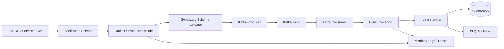
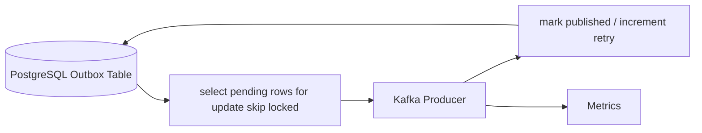
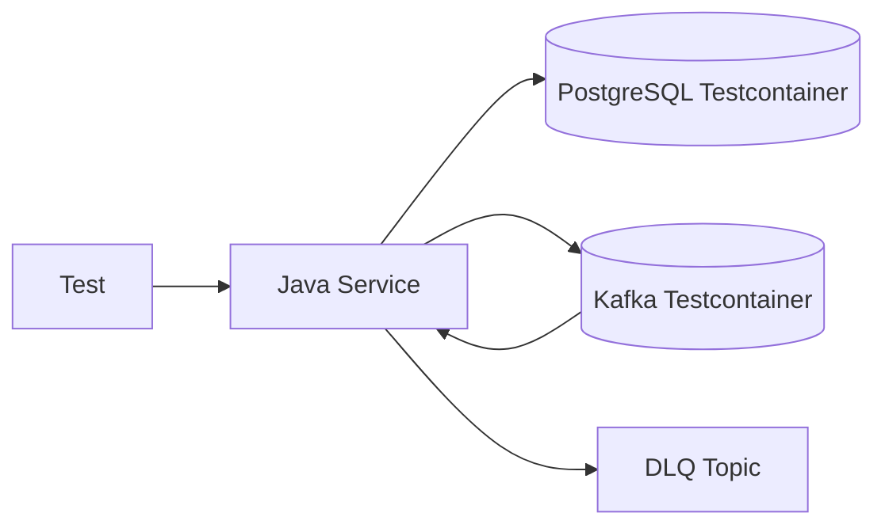

# Part 033 — Java Client Implementation Patterns

> Fokus part ini: membangun pola implementasi Kafka client di Java yang layak untuk enterprise backend system: jelas boundary-nya, aman terhadap failure, bisa diobservasi, bisa dites, dan tidak menyembunyikan risiko correctness di balik abstraction yang terlalu nyaman.

---

## 1. Core Mental Model

Kafka Java client bukan hanya library untuk `send()` dan `poll()`. Di production, Kafka client adalah boundary antara aplikasi Java/JAX-RS dan distributed log.

Boundary ini harus mengatur:

- serialization,
- schema validation,
- header propagation,
- partition key,
- retry,
- DLQ,
- idempotency,
- offset commit,
- metrics,
- tracing,
- backpressure,
- shutdown,
- testability,
- configuration,
- operational diagnostics.

Pola implementasi yang buruk biasanya terlihat sederhana di awal, tetapi sulit di-debug saat incident.

Pola implementasi yang baik tidak harus kompleks, tetapi harus eksplisit.



---

## 2. What a Kafka Client Layer Must Not Hide

Abstraction boleh dibuat, tetapi tidak boleh menghilangkan keputusan penting.

Jangan menyembunyikan:

- topic name,
- event type,
- schema version,
- partition key,
- event ID,
- correlation ID,
- idempotency key,
- retry policy,
- DLQ policy,
- offset commit point,
- error classification,
- consumer group identity,
- shutdown behavior,
- metrics name.

Abstraction yang buruk:

```java
messageBus.publish(object);
```

Masalahnya:

- topic tidak jelas,
- key tidak jelas,
- schema tidak jelas,
- metadata tidak jelas,
- error handling tidak jelas,
- delivery semantics tidak jelas,
- tracing tidak jelas,
- test assertion sulit.

Abstraction yang lebih sehat:

```java
publisher.publish(new EventEnvelope<>(
    TopicNames.QUOTE_EVENTS,
    EventType.QUOTE_SUBMITTED,
    quoteId.toString(),
    metadata,
    payload
));
```

Tujuannya bukan membuat kode lebih panjang. Tujuannya adalah membuat keputusan arsitektural terlihat di PR.

---

## 3. Plain Kafka Java Client vs Framework Wrapper

Ada beberapa pendekatan:

| Pendekatan | Kelebihan | Risiko |
|---|---|---|
| Plain Kafka Java client | Kontrol penuh, eksplisit | Banyak boilerplate, rawan inkonsistensi antar service |
| Internal wrapper | Standardisasi metadata, metrics, retry | Bisa menyembunyikan semantics jika desainnya buruk |
| Framework annotation | Cepat untuk simple consumer | Offset/retry/error behavior sering tidak terlihat |
| Outbox publisher abstraction | Cocok untuk DB + Kafka consistency | Butuh table, worker, observability |
| Kafka Streams | Cocok untuk stream processing | Lebih berat, stateful, operationally complex |

Untuk enterprise Java/JAX-RS service, pola yang biasanya sehat:

- resource/service layer tidak memanggil Kafka producer secara bebas,
- ada boundary producer abstraction,
- event metadata standar,
- serialization/schema validation terpusat,
- consumer loop punya lifecycle eksplisit,
- handler punya contract idempotency dan error classification,
- retry/DLQ bukan keputusan ad-hoc di setiap handler.

---

## 4. Recommended Package Boundary

Contoh struktur package:

```text
com.company.quote
  api/
    QuoteResource.java
  application/
    SubmitQuoteService.java
  domain/
    Quote.java
    QuoteStatus.java
  persistence/
    QuoteMapper.java
    OutboxMapper.java
    InboxMapper.java
  events/
    QuoteSubmittedEvent.java
    QuoteEventPayload.java
    EventEnvelope.java
    EventMetadata.java
  kafka/
    KafkaProducerFactory.java
    EventPublisher.java
    OutboxPublisher.java
    KafkaConsumerRunner.java
    EventHandler.java
    RetryPolicy.java
    DlqPublisher.java
    KafkaHeaderMapper.java
    KafkaMetrics.java
```

Prinsip penting:

- domain model tidak perlu tahu Kafka client,
- service layer boleh menghasilkan domain/integration event,
- persistence layer mengelola outbox/inbox jika dipakai,
- Kafka adapter mengubah event menjadi record,
- consumer handler mengelola business processing,
- retry/DLQ/metrics tidak tersebar liar.

---

## 5. Producer Wrapper Pattern

Producer wrapper bertugas mengubah event application-level menjadi `ProducerRecord` yang benar.

Minimal tanggung jawab:

- menentukan topic,
- menentukan partition key,
- mengisi headers,
- serialize payload,
- mencatat metrics,
- mencatat log safe,
- menangani callback error,
- tidak membuat event ID baru saat retry aplikasi,
- tidak menelan exception tanpa observability.

Contoh interface:

```java
public interface EventPublisher {
    PublishResult publish(EventEnvelope<?> event);
}
```

Contoh envelope:

```java
public record EventEnvelope<T>(
    String eventId,
    String eventType,
    String eventVersion,
    String aggregateId,
    String partitionKey,
    EventMetadata metadata,
    T payload
) {}
```

Contoh metadata:

```java
public record EventMetadata(
    String correlationId,
    String causationId,
    String traceId,
    String tenantId,
    String actorId,
    String sourceService,
    Instant eventTime,
    String schemaVersion
) {}
```

Producer wrapper tidak boleh diam-diam memilih random key untuk event yang membutuhkan ordering per aggregate.

---

## 6. ProducerRecord Construction

Record harus dibuat dengan keputusan eksplisit.

```java
public ProducerRecord<String, byte[]> toRecord(EventEnvelope<?> event) {
    Headers headers = new RecordHeaders()
        .add("event_id", event.eventId().getBytes(UTF_8))
        .add("event_type", event.eventType().getBytes(UTF_8))
        .add("event_version", event.eventVersion().getBytes(UTF_8))
        .add("correlation_id", event.metadata().correlationId().getBytes(UTF_8))
        .add("causation_id", event.metadata().causationId().getBytes(UTF_8))
        .add("tenant_id", event.metadata().tenantId().getBytes(UTF_8))
        .add("source_service", event.metadata().sourceService().getBytes(UTF_8));

    byte[] value = serializer.serialize(event.payload());

    return new ProducerRecord<>(
        TopicNames.QUOTE_EVENTS,
        null,
        event.metadata().eventTime().toEpochMilli(),
        event.partitionKey(),
        value,
        headers
    );
}
```

Hal yang harus terlihat:

- topic,
- key,
- timestamp,
- headers,
- payload serializer,
- event ID,
- schema version.

---

## 7. Synchronous Send vs Asynchronous Send

Synchronous send:

```java
producer.send(record).get();
```

Kelebihan:

- error terlihat langsung,
- mudah dipahami,
- cocok untuk small tooling/internal admin job.

Risiko:

- blocking thread request,
- memperpanjang latency HTTP,
- bisa menahan DB transaction jika salah ditempatkan,
- throughput rendah,
- timeout bisa ambigu.

Asynchronous send:

```java
producer.send(record, (metadata, exception) -> {
    if (exception != null) {
        handleFailure(record, exception);
    } else {
        recordSuccess(metadata);
    }
});
```

Kelebihan:

- throughput lebih baik,
- batching lebih efektif,
- request thread tidak harus menunggu broker.

Risiko:

- error terjadi setelah caller selesai,
- butuh callback discipline,
- butuh outbox atau persistence jika event tidak boleh hilang.

Untuk service yang menulis PostgreSQL lalu harus publish event, solusi utamanya bukan memilih sync vs async. Solusi utamanya adalah outbox/CDC.

---

## 8. Producer Error Handling

Producer error handling harus membedakan:

- serialization failure,
- schema compatibility failure,
- authorization failure,
- unknown topic,
- broker unavailable,
- timeout,
- record too large,
- invalid configuration,
- non-retriable exception,
- retriable exception.

Pattern buruk:

```java
try {
    producer.send(record).get();
} catch (Exception e) {
    log.warn("failed to publish", e);
}
```

Masalah:

- caller tidak tahu publish gagal,
- event bisa hilang,
- tidak ada metric,
- tidak ada retry/DLQ/outbox status,
- tidak ada severity.

Pattern lebih baik:

```java
try {
    producer.send(record, callback);
} catch (SerializationException e) {
    metrics.increment("kafka.producer.serialization_failure");
    throw new EventSerializationFailure(event.eventId(), e);
} catch (AuthorizationException e) {
    metrics.increment("kafka.producer.authorization_failure");
    throw new EventPublicationConfigurationFailure(event.eventId(), e);
} catch (KafkaException e) {
    metrics.increment("kafka.producer.submit_failure");
    throw new EventPublicationFailure(event.eventId(), e);
}
```

Jika memakai outbox, failure publish harus mengubah retry state outbox, bukan hanya log.

---

## 9. Outbox Publisher Pattern in Java

Outbox publisher biasanya berupa worker:



Pseudocode:

```java
while (running.get()) {
    List<OutboxRow> rows = outboxRepository.claimPending(batchSize);

    for (OutboxRow row : rows) {
        try {
            EventEnvelope<?> event = outboxSerializer.deserialize(row.payload());
            publisher.publish(event);
            outboxRepository.markPublished(row.id(), Instant.now());
        } catch (RetriablePublicationException e) {
            outboxRepository.markRetry(row.id(), e.getMessage());
        } catch (NonRetriablePublicationException e) {
            outboxRepository.markFailed(row.id(), e.getMessage());
        }
    }

    sleep(pollInterval);
}
```

Critical detail:

- `claimPending` harus concurrency-safe,
- event ID tidak berubah antar retry,
- publish success harus dikaitkan dengan broker acknowledgement,
- mark published harus aman terhadap crash,
- outbox lag harus dimonitor,
- payload/schema failure harus terlihat sebagai failed row, bukan infinite retry.

---

## 10. Consumer Runner Pattern

Consumer runner mengelola lifecycle `KafkaConsumer`.

Tanggung jawab:

- create consumer,
- subscribe topic,
- poll loop,
- dispatch record ke handler,
- manage pause/resume,
- manage offset commit,
- classify error,
- publish retry/DLQ jika perlu,
- handle wakeup/shutdown,
- expose metrics,
- tidak memproses record setelah shutdown dimulai.

Contoh sederhana:

```java
public final class KafkaConsumerRunner implements Runnable {
    private final KafkaConsumer<String, byte[]> consumer;
    private final EventHandler handler;
    private final AtomicBoolean running = new AtomicBoolean(true);

    @Override
    public void run() {
        try {
            consumer.subscribe(List.of(TopicNames.QUOTE_EVENTS));

            while (running.get()) {
                ConsumerRecords<String, byte[]> records = consumer.poll(Duration.ofMillis(500));

                for (ConsumerRecord<String, byte[]> record : records) {
                    processOne(record);
                }

                consumer.commitSync();
            }
        } catch (WakeupException e) {
            if (running.get()) throw e;
        } finally {
            consumer.close();
        }
    }

    public void shutdown() {
        running.set(false);
        consumer.wakeup();
    }
}
```

Ini masih basic. Untuk production, commit strategy dan error strategy harus lebih rinci.

---

## 11. Handler Contract

Consumer handler sebaiknya punya contract eksplisit.

```java
public interface EventHandler<T> {
    HandlerResult handle(EventContext context, T event) throws Exception;
}
```

Contoh result:

```java
public sealed interface HandlerResult {
    record Success() implements HandlerResult {}
    record RetryableFailure(String reason) implements HandlerResult {}
    record NonRetryableFailure(String reason) implements HandlerResult {}
    record Ignored(String reason) implements HandlerResult {}
}
```

Mengapa result penting?

- tidak semua exception sama,
- poison event harus dipisahkan dari transient failure,
- duplicate event bisa dianggap success/ignored,
- business validation failure mungkin perlu DLQ,
- external dependency failure mungkin perlu retry,
- offset commit bergantung pada hasil.

Pattern buruk:

```java
handler.handle(record);
consumer.commitSync();
```

Tanpa result, consumer runner tidak tahu apakah aman commit.

---

## 12. Error Classification

Minimal kategori error:

| Error | Contoh | Aksi umum |
|---|---|---|
| Duplicate | event sudah diproses | commit offset, metric duplicate |
| Validation failure | required field kosong | DLQ/non-retryable |
| Deserialization failure | schema tidak cocok | DLQ atau stop, tergantung policy |
| Transient dependency | DB/network timeout | retry/backoff |
| Authorization/config | ACL salah, topic tidak ada | stop/alert |
| Business conflict | invalid state transition | DLQ atau ignored tergantung invariant |
| Poison event | selalu gagal karena data | DLQ/parking lot |
| Fatal application bug | NullPointerException sistemik | stop/alert, jangan infinite retry |

Jangan memperlakukan semua exception sebagai retryable.

Infinite retry pada poison event akan membuat partition macet.

---

## 13. Retry Handler Pattern

Retry handler harus memutuskan:

- apakah error retryable,
- retry ke mana,
- berapa delay,
- berapa max attempt,
- metadata apa yang dibawa,
- kapan DLQ,
- apakah offset source boleh di-commit.

Contoh metadata retry:

```text
original_topic
original_partition
original_offset
original_event_id
retry_attempt
first_failure_time
last_failure_time
failure_reason
consumer_group
source_service
```

Pola topic:

```text
quote.events
quote.events.retry.1m
quote.events.retry.10m
quote.events.retry.1h
quote.events.dlq
```

Catatan penting:

- Kafka tidak punya delayed delivery native seperti scheduler queue tradisional.
- Delayed retry biasanya dibuat dengan retry topic, scheduler, timestamp check, atau platform-specific mechanism.
- Retry topic harus tetap mempertahankan event ID dan correlation ID.
- DLQ harus punya cukup konteks untuk manual triage dan replay.

---

## 14. DLQ Publisher Pattern

DLQ event bukan sekadar payload original.

DLQ record harus memuat:

- original topic,
- original partition,
- original offset,
- original key,
- original headers,
- original event ID,
- consumer group,
- failure class,
- failure message yang aman,
- failure stack trace jika policy mengizinkan,
- attempt count,
- failed at timestamp,
- service version,
- trace ID/correlation ID,
- replay eligibility.

Contoh model:

```java
public record DeadLetterEvent(
    OriginalRecordReference original,
    FailureDetails failure,
    ReplayPolicy replayPolicy,
    byte[] originalPayload
) {}
```

DLQ yang buruk hanya berisi `errorMessage` dan payload mentah. Saat incident, tim tidak tahu consumer mana yang gagal, offset mana, dan apakah aman direplay.

---

## 15. Serialization Abstraction

Serialization abstraction harus menstandarkan:

- format payload,
- schema validation,
- schema version,
- error handling,
- logging safe,
- compatibility behavior,
- null/tombstone handling jika relevan.

Contoh interface:

```java
public interface EventSerializer<T> {
    byte[] serialize(T payload);
    T deserialize(byte[] bytes);
    String schemaVersion();
    String contentType();
}
```

Jika memakai Avro/Protobuf/JSON Schema + Schema Registry, abstraction juga harus jelas tentang:

- subject naming strategy,
- schema ID,
- compatibility mode,
- generated classes vs generic record,
- unknown field behavior,
- enum evolution,
- default values.

Kesalahan umum:

- langsung serialize POJO dengan JSON tanpa contract,
- rename field tanpa compatibility check,
- menganggap optional field selalu aman,
- tidak punya schema test,
- deserialization failure menyebabkan consumer loop crash terus-menerus.

---

## 16. Header Propagation

Header propagation harus standard.

Minimal header yang sering berguna:

```text
event_id
event_type
event_version
correlation_id
causation_id
traceparent
tenant_id
source_service
schema_version
content_type
idempotency_key
```

Prinsip:

- metadata routing/debugging sebaiknya di header,
- business state utama sebaiknya di payload,
- PII di header berbahaya karena sering ikut log/metrics,
- correlation ID harus datang dari request upstream jika ada,
- event ID harus stabil antar retry/replay.

Header mapper membantu mencegah setiap service membuat standar sendiri.

---

## 17. Metrics Instrumentation

Producer metrics application-level:

- publish attempt count,
- publish success count,
- publish failure count,
- serialization failure count,
- send latency,
- callback latency,
- record size,
- outbox lag,
- outbox retry count,
- outbox failed count.

Consumer metrics application-level:

- records polled,
- records processed,
- processing duration,
- handler success/failure,
- duplicate event count,
- retry published count,
- DLQ published count,
- deserialization failure count,
- commit latency,
- rebalance count,
- shutdown duration.

Jangan hanya mengandalkan broker metrics. Broker bisa sehat sementara consumer handler rusak.

---

## 18. Logging Pattern

Log Kafka client harus cukup untuk debugging, tetapi tidak membocorkan payload sensitif.

Log producer success:

```text
Published event eventId=... type=... topic=... partition=... offset=... key=... correlationId=...
```

Log consumer failure:

```text
Failed to process event eventId=... type=... topic=... partition=... offset=... group=... correlationId=... failureClass=...
```

Jangan log payload penuh secara default.

Untuk payload debugging:

- gunakan redaction,
- gunakan sampling,
- gunakan secure access,
- gunakan DLQ inspection tooling,
- ikuti data classification policy.

---

## 19. Graceful Shutdown

Graceful shutdown penting untuk consumer.

Tanpa graceful shutdown:

- pod mati saat record sedang diproses,
- offset belum commit,
- record diproses ulang,
- external call bisa duplicate,
- rebalance bisa sering terjadi,
- handler bisa meninggalkan partial state.

Pattern:

```java
Runtime.getRuntime().addShutdownHook(new Thread(() -> {
    runner.shutdown();
}));
```

Untuk Kubernetes:

- `terminationGracePeriodSeconds` harus cukup,
- `preStop` bisa memberi waktu drain,
- consumer harus `wakeup()`,
- stop polling record baru,
- selesaikan in-flight record jika aman,
- commit offset hanya setelah processing aman,
- close consumer.

Graceful shutdown tidak menggantikan idempotency. Ia hanya mengurangi duplicate, bukan menghilangkannya.

---

## 20. Threading Model

KafkaConsumer tidak thread-safe. Satu consumer instance sebaiknya digunakan oleh satu thread.

Pilihan desain:

### 20.1 Single-thread Poll and Process

```text
poll -> process record -> commit
```

Kelebihan:

- sederhana,
- ordering lebih mudah,
- offset management mudah.

Kekurangan:

- throughput terbatas,
- satu slow record bisa menahan partition.

### 20.2 Poll Thread + Worker Pool

```text
poll -> dispatch to workers -> track completion -> commit safe offsets
```

Kelebihan:

- throughput lebih tinggi,
- CPU-bound processing bisa paralel.

Risiko:

- ordering bisa rusak,
- offset commit jauh lebih kompleks,
- backpressure harus eksplisit,
- in-flight tracking wajib,
- shutdown lebih sulit.

Untuk event yang membutuhkan ordering per key, jangan asal lempar record ke generic worker pool tanpa partition/key-aware scheduling.

---

## 21. Backpressure Pattern

Consumer harus bisa melambat saat downstream lambat.

Mekanisme:

- `max.poll.records` dibatasi,
- pause partition saat worker queue penuh,
- resume setelah backlog turun,
- batasi concurrency per partition/key,
- gunakan bounded executor queue,
- expose backlog metric,
- jangan infinite in-memory buffering.

Pattern buruk:

```java
executor.submit(() -> handler.handle(record));
```

Jika executor queue unbounded, consumer bisa mengambil lebih banyak record daripada yang bisa diproses. Memory naik, shutdown kacau, offset commit tidak jelas.

Pattern lebih baik:

```java
if (workQueue.isFull()) {
    consumer.pause(consumer.assignment());
} else {
    dispatch(record);
}
```

Backpressure adalah correctness concern, bukan hanya performance concern.

---

## 22. Offset Commit Pattern

Offset commit harus disesuaikan dengan processing model.

Untuk single-thread:

```text
poll -> process all records successfully -> commitSync
```

Untuk per-record:

```text
process record -> commit offset for that partition
```

Untuk async worker pool:

```text
track completed offsets per partition -> commit only contiguous completed offset
```

Jangan commit offset record N+10 jika record N belum selesai pada partition yang sama.

Commit offset berarti: “consumer group ini tidak perlu membaca ulang sampai offset ini”. Jika processing belum aman, commit adalah data loss risk.

---

## 23. Configuration Management

Kafka client config harus dikelola sebagai production artifact.

Producer config yang perlu direview:

- `bootstrap.servers`,
- `client.id`,
- `acks`,
- `enable.idempotence`,
- `retries`,
- `delivery.timeout.ms`,
- `request.timeout.ms`,
- `linger.ms`,
- `batch.size`,
- `compression.type`,
- `max.in.flight.requests.per.connection`,
- security config.

Consumer config yang perlu direview:

- `bootstrap.servers`,
- `group.id`,
- `enable.auto.commit`,
- `auto.offset.reset`,
- `max.poll.records`,
- `max.poll.interval.ms`,
- `session.timeout.ms`,
- `heartbeat.interval.ms`,
- `fetch.min.bytes`,
- `fetch.max.bytes`,
- assignment strategy,
- security config.

Configuration harus berbeda per environment, tetapi semantics penting jangan berubah diam-diam.

---

## 24. Unit Testing Producer Code

Unit test producer wrapper harus memverifikasi:

- topic benar,
- key benar,
- header lengkap,
- event ID tidak null,
- correlation ID diteruskan,
- schema version benar,
- serializer dipanggil,
- exception diklasifikasi,
- metrics/logging dipanggil secara wajar.

Contoh assertion penting:

```java
assertThat(record.topic()).isEqualTo("quote.events");
assertThat(record.key()).isEqualTo(quoteId.toString());
assertThat(header(record, "correlation_id")).isEqualTo(correlationId);
```

Test yang hanya memastikan `send()` dipanggil belum cukup.

---

## 25. Unit Testing Consumer Handler

Handler test harus fokus pada business idempotency dan state transition.

Test cases:

- event valid menghasilkan state benar,
- duplicate event tidak mengubah state dua kali,
- out-of-order event ditolak atau ditangani sesuai rule,
- invalid state transition aman,
- external dependency timeout diklasifikasi retryable,
- validation failure diklasifikasi non-retryable,
- inbox/processed event table dipakai,
- transaction rollback bekerja.

Consumer handler test tidak perlu Kafka broker untuk semua kasus. Banyak correctness bug bisa ditemukan dengan plain unit/integration DB test.

---

## 26. Integration Testing with Testcontainers

Testcontainers Kafka berguna untuk menguji:

- producer benar-benar publish record,
- consumer benar-benar consume record,
- serialization/deserialization real,
- offset commit behavior,
- retry/DLQ behavior,
- outbox publisher loop,
- inbox idempotency dengan PostgreSQL container,
- schema registry jika tersedia di test setup.

Contoh test architecture:



Test yang penting:

- publish event after command,
- duplicate event diproses sekali,
- poison event masuk DLQ,
- retry count bertambah,
- offset tidak commit sebelum processing sukses,
- shutdown tidak kehilangan in-flight record.

---

## 27. Embedded Kafka Caveat

Embedded Kafka bisa berguna untuk test cepat, tetapi hati-hati:

- behavior tidak selalu sama dengan deployment production,
- security/network tidak teruji,
- broker config berbeda,
- Schema Registry/Connect/CDC biasanya tidak ikut,
- test bisa terlalu “in-memory happy path”.

Untuk confidence production, gunakan Testcontainers atau environment integration yang mendekati runtime nyata.

---

## 28. Failure Modes in Java Client Code

Failure mode umum:

- producer wrapper membuat event ID baru setiap retry,
- key null untuk event yang butuh ordering,
- header correlation ID hilang,
- consumer auto commit aktif tanpa sadar,
- handler non-idempotent,
- exception semua dianggap retryable,
- DLQ kehilangan original offset,
- unbounded executor queue menyebabkan OOM,
- shutdown tidak memanggil `consumer.wakeup()`,
- offset commit dilakukan sebelum async worker selesai,
- deserialization failure membuat consumer crash loop,
- metrics hanya broker-level, tidak application-level,
- Testcontainers hanya happy path.

---

## 29. Production Readiness Checklist

- [ ] Producer wrapper menentukan topic, key, headers, serializer secara eksplisit.
- [ ] Event ID stabil dan tidak berubah saat retry.
- [ ] Correlation ID, causation ID, trace context, tenant ID dipropagasi.
- [ ] Producer error handling membedakan retriable dan non-retriable.
- [ ] Outbox digunakan untuk DB + Kafka consistency jika event tidak boleh hilang.
- [ ] Consumer auto commit dimatikan untuk handler kritis.
- [ ] Offset commit terjadi setelah processing aman.
- [ ] Handler idempotent.
- [ ] Inbox/processed event table tersedia untuk side effect kritis.
- [ ] Retry/DLQ policy eksplisit.
- [ ] DLQ event menyimpan original topic/partition/offset/key/header.
- [ ] Consumer graceful shutdown tersedia.
- [ ] Threading model jelas dan tidak merusak ordering.
- [ ] Backpressure tersedia.
- [ ] Metrics/logging/tracing tersedia.
- [ ] Unit test dan integration test mencakup failure path.

---

## 30. PR Review Checklist

Saat review PR Kafka client Java, tanyakan:

1. Event apa yang dipublish/consume?
2. Topic dan partition key apa?
3. Apakah ordering diperlukan?
4. Apakah event ID stabil?
5. Apakah metadata standar lengkap?
6. Apakah schema validated?
7. Apakah producer dipanggil dalam DB transaction?
8. Apakah outbox dibutuhkan?
9. Apakah consumer idempotent?
10. Kapan offset commit?
11. Apa yang terjadi jika handler crash setelah DB write?
12. Apa yang terjadi jika deserialization gagal?
13. Apa retry policy?
14. Apa DLQ schema?
15. Apakah consumer bisa shutdown dengan aman?
16. Apakah worker pool merusak ordering?
17. Apakah metrics cukup untuk incident?
18. Apakah test mencakup duplicate, poison, retry, dan replay?

---

## 31. Internal Verification Checklist

Cek di internal CSG/team:

- Apakah ada Kafka client library/wrapper standar?
- Apakah producer langsung memakai plain `KafkaProducer` di banyak service?
- Apakah consumer langsung memakai plain `KafkaConsumer` di banyak service?
- Apakah event metadata/header standard sudah ada?
- Apakah event ID, correlation ID, causation ID, trace context wajib?
- Apakah serializer/schema validation distandarkan?
- Apakah retry/DLQ handler reusable?
- Apakah DLQ schema distandarkan?
- Apakah auto commit digunakan di consumer production?
- Apakah graceful shutdown ada di semua consumer pod?
- Apakah worker pool dipakai dan bagaimana offset commit dijaga?
- Apakah Testcontainers Kafka/PostgreSQL digunakan di CI?
- Apakah ada shared dashboard untuk producer/consumer metrics?
- Apakah PR template meminta partition key, idempotency, retry/DLQ, dan observability?

---

## 32. Senior Engineer Heuristic

Gunakan prinsip ini:

> Kafka client abstraction yang baik membuat keputusan distributed systems terlihat, bukan tersembunyi.

Jika abstraction membuat developer lupa tentang partition key, offset commit, idempotency, retry, DLQ, schema, dan observability, abstraction itu berbahaya.

Jika abstraction membuat keputusan tersebut konsisten, eksplisit, dan mudah direview, abstraction itu memperkuat engineering quality.
