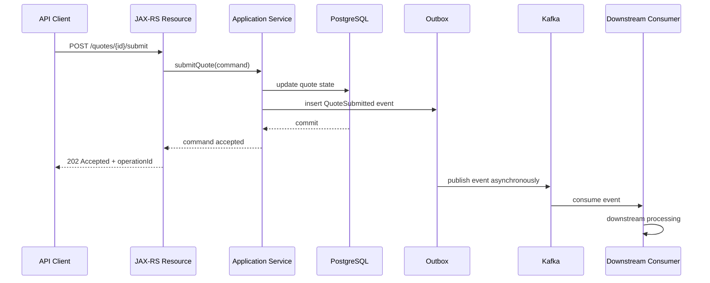
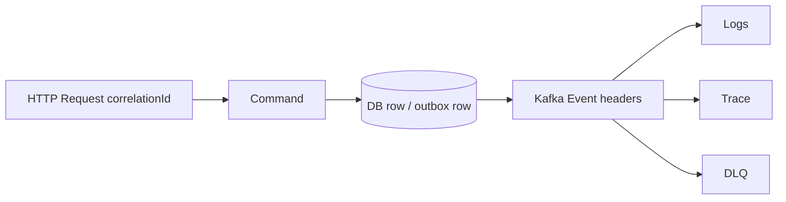
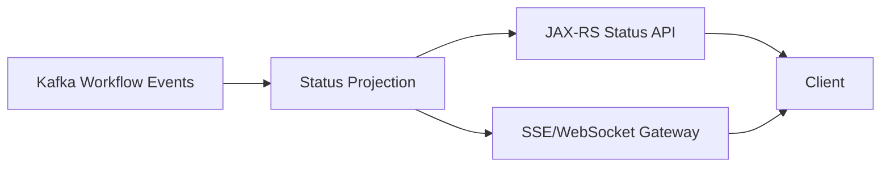
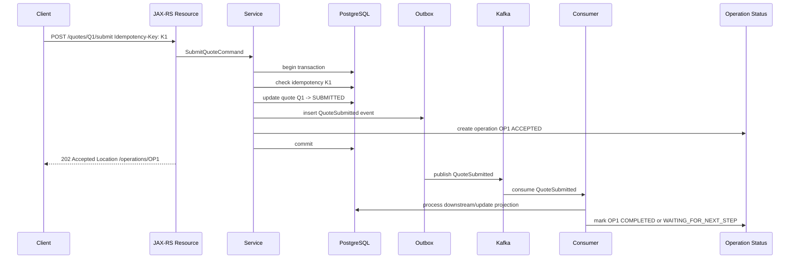

# Part 034 — JAX-RS and Kafka Integration

> Fokus part ini: mendesain integrasi JAX-RS dan Kafka dengan benar saat HTTP request memicu event atau workflow asynchronous. Intinya bukan “cara publish dari endpoint”, tetapi bagaimana menjaga contract API, transaction boundary, idempotency, observability, dan expectation client.

---

## 1. Core Mental Model

JAX-RS bekerja dengan model request/response. Kafka bekerja dengan model asynchronous event log.

Integrasi keduanya harus menjawab pertanyaan fundamental:

> Saat HTTP response dikirim, apa yang sebenarnya sudah selesai?

Kemungkinan jawaban:

- command sudah diterima,
- business row sudah disimpan,
- outbox row sudah dibuat,
- event sudah dipublish ke Kafka,
- event sudah dikonsumsi downstream,
- workflow sudah selesai,
- read model sudah update,
- external system sudah menerima update.

Banyak bug desain terjadi karena API mengembalikan response seolah semua selesai, padahal hanya step awal yang selesai.



Dalam flow ini, response `202 Accepted` tidak berarti downstream selesai. Itu berarti command diterima dan akan diproses secara asynchronous.

---

## 2. The Main Design Tension

HTTP caller biasanya menginginkan jawaban langsung:

- berhasil atau gagal,
- order dibuat atau tidak,
- approval dimulai atau tidak,
- pricing selesai atau tidak,
- fulfillment dikirim atau tidak.

Kafka-based workflow sering tidak bisa memberi jawaban final langsung karena ada:

- downstream consumer,
- saga step,
- external dependency,
- retry,
- DLQ,
- eventual consistency,
- projection lag,
- human approval,
- long-running orchestration.

Maka API contract harus eksplisit tentang state yang dijamin oleh response.

---

## 3. Common Integration Patterns

### 3.1 Synchronous Command, Asynchronous Event

HTTP request memodifikasi local state dan menghasilkan event.

```text
POST /quotes/{id}/submit
```

Response bisa:

- `200 OK` jika state local sudah berubah dan tidak ada long-running downstream guarantee,
- `202 Accepted` jika workflow asynchronous masih berjalan,
- `409 Conflict` jika state transition tidak valid,
- `422 Unprocessable Entity` jika business validation gagal.

### 3.2 Pure Asynchronous Command Acceptance

HTTP hanya menerima command dan menyimpan request/workflow state.

```text
POST /orders
-> 202 Accepted
-> Location: /operations/{operationId}
```

Client mengecek status.

### 3.3 Synchronous Facade over Async Backend

API menunggu beberapa event/downstream result sebelum response.

Ini berisiko:

- timeout panjang,
- coupling ke downstream,
- retry ambigu,
- thread request tertahan,
- pengalaman client tidak stabil.

Gunakan hanya jika SLA jelas dan bounded.

### 3.4 Read Model Driven API

API membaca projection/materialized view yang dibangun dari event.

Risiko:

- stale read,
- read-your-writes problem,
- projection lag,
- client melihat state lama setelah command sukses.

---

## 4. Do Not Publish Directly from Resource Layer

Pattern buruk:

```java
@Path("/quotes")
public class QuoteResource {
    @POST
    @Path("/{id}/submit")
    public Response submit(@PathParam("id") String id) {
        kafkaProducer.send(new ProducerRecord<>("quote.events", id, payload));
        return Response.ok().build();
    }
}
```

Masalah:

- resource layer melewati business transaction,
- validation/state transition tidak jelas,
- event bisa dipublish tanpa DB state valid,
- idempotency tidak jelas,
- metadata tidak lengkap,
- error Kafka dipetakan sembarangan ke HTTP,
- sulit dites,
- outbox sulit diterapkan.

Resource layer sebaiknya hanya:

- parse request,
- validate shape/basic input,
- extract identity/correlation,
- call application service,
- map result ke HTTP response.

---

## 5. Better Resource-Service Boundary

Contoh struktur:

```java
@Path("/quotes")
public class QuoteResource {
    private final SubmitQuoteService submitQuoteService;

    @POST
    @Path("/{id}/submit")
    public Response submit(
        @PathParam("id") String quoteId,
        @HeaderParam("Idempotency-Key") String idempotencyKey,
        SubmitQuoteRequest request
    ) {
        SubmitQuoteCommand command = new SubmitQuoteCommand(
            quoteId,
            request.reason(),
            idempotencyKey,
            RequestContext.current()
        );

        SubmitQuoteResult result = submitQuoteService.submit(command);

        return Response.accepted(result.statusRepresentation())
            .location(URI.create("/operations/" + result.operationId()))
            .build();
    }
}
```

Service layer:

```java
public SubmitQuoteResult submit(SubmitQuoteCommand command) {
    return transactionTemplate.execute(tx -> {
        Quote quote = quoteRepository.findForUpdate(command.quoteId());
        quote.submit(command.actorId());

        quoteRepository.update(quote);
        outboxRepository.insert(QuoteSubmittedEvent.from(quote, command));
        operationRepository.markAccepted(command.operationId());

        return SubmitQuoteResult.accepted(command.operationId());
    });
}
```

Kafka publish terjadi setelahnya melalui outbox publisher/CDC, bukan langsung dari resource.

---

## 6. HTTP Response Semantics

HTTP status harus mencerminkan apa yang sudah dijamin.

| Status | Cocok untuk | Jangan dipakai untuk |
|---|---|---|
| `200 OK` | hasil final tersedia langsung | workflow async yang belum selesai |
| `201 Created` | resource local benar-benar dibuat | downstream order belum tentu selesai |
| `202 Accepted` | command diterima untuk processing async | validasi gagal atau command ditolak |
| `400 Bad Request` | request malformed | business state conflict |
| `401/403` | auth/authz gagal | validation business |
| `404` | resource tidak ditemukan | state transition invalid |
| `409 Conflict` | invalid state/version conflict | schema payload salah |
| `422` | business validation gagal | infrastructure timeout |
| `503` | dependency/service unavailable | domain rejection |

Kesalahan umum: return `200 OK` setelah hanya publish event, padahal downstream bisa gagal.

---

## 7. 202 Accepted Pattern

Gunakan `202 Accepted` jika:

- request diterima,
- processing belum selesai,
- client butuh status tracking,
- downstream asynchronous,
- workflow bisa retry/DLQ,
- final result tidak tersedia dalam request latency budget.

Response sebaiknya memuat:

```json
{
  "operationId": "op-123",
  "status": "ACCEPTED",
  "message": "Quote submission accepted for asynchronous processing.",
  "statusUrl": "/operations/op-123",
  "correlationId": "corr-abc"
}
```

Header yang berguna:

```text
Location: /operations/op-123
Retry-After: 5
X-Correlation-Id: corr-abc
```

`202 Accepted` harus didukung status endpoint atau mekanisme notification. Tanpa itu, client kehilangan visibility.

---

## 8. Operation Status Resource

Status endpoint:

```text
GET /operations/{operationId}
```

Contoh status:

```json
{
  "operationId": "op-123",
  "status": "PROCESSING",
  "submittedAt": "2026-07-11T03:00:00Z",
  "lastUpdatedAt": "2026-07-11T03:00:10Z",
  "correlationId": "corr-abc",
  "links": {
    "quote": "/quotes/Q-123"
  }
}
```

Status yang sehat:

```text
ACCEPTED
PROCESSING
WAITING_FOR_APPROVAL
WAITING_FOR_DOWNSTREAM
COMPLETED
FAILED
CANCELLED
EXPIRED
REQUIRES_MANUAL_REVIEW
```

Hindari status generik seperti `PENDING` untuk semua hal. Status harus membantu support dan debugging.

---

## 9. Idempotency Key in HTTP Request

HTTP client bisa retry karena:

- network timeout,
- gateway timeout,
- client crash,
- load balancer retry,
- user double click,
- mobile/browser retry,
- upstream job retry.

Tanpa idempotency key, duplicate request bisa menghasilkan duplicate command/event.

Header umum:

```text
Idempotency-Key: submit-quote-Q123-request-456
```

Server harus menyimpan:

- idempotency key,
- request hash,
- actor/client,
- target resource,
- operation ID,
- response/result state,
- expiry.

Prinsip:

- same idempotency key + same request = same operation/result,
- same idempotency key + different request = conflict,
- idempotency key harus masuk ke event metadata,
- idempotency key bukan pengganti consumer idempotency.

---

## 10. Request Correlation to Event

Setiap HTTP request yang menghasilkan event harus membawa correlation.



Metadata penting:

- correlation ID,
- causation ID,
- trace context,
- operation ID,
- command ID,
- idempotency key,
- actor/user ID,
- tenant ID,
- source service.

Tanpa correlation, incident berubah menjadi pencarian manual antar log dan offset.

---

## 11. Transaction Boundary

Golden rule:

> Jika HTTP command mengubah PostgreSQL dan harus menghasilkan Kafka event, simpan business change dan outbox event dalam transaction yang sama.

Pattern aman:

```text
begin transaction
  validate command
  update business state
  insert outbox event
  insert/update operation status
commit
publish later from outbox/CDC
```

Pattern berbahaya:

```text
begin transaction
  update business state
  publish Kafka event
commit
```

Risiko:

- Kafka publish sukses, DB commit gagal,
- Kafka publish timeout menahan DB lock,
- DB rollback tidak menghapus event yang sudah terlihat downstream.

Pattern lain yang juga berbahaya:

```text
commit DB
publish Kafka event
```

Risiko:

- service crash setelah commit sebelum publish,
- event hilang,
- downstream tidak tahu state berubah.

---

## 12. Producing Before vs After Commit

### Produce Before Commit

```text
publish event -> commit DB
```

Risiko:

- event terlihat sebelum state commit,
- consumer membaca state yang belum ada,
- rollback menghasilkan event palsu.

### Produce After Commit

```text
commit DB -> publish event
```

Risiko:

- crash sebelum publish,
- publish failure menghasilkan missing event.

### Insert Outbox in Commit

```text
commit DB state + outbox row -> publish asynchronously
```

Trade-off:

- butuh outbox table/worker/CDC,
- event tidak langsung publish pada saat response,
- butuh monitoring outbox lag.

Namun untuk enterprise correctness, ini biasanya trade-off yang lebih sehat.

---

## 13. Synchronous API Over Asynchronous Processing

Kadang API ingin menunggu event selesai diproses.

Contoh buruk:

```text
POST /orders
  -> publish OrderCreated
  -> wait until FulfillmentCompleted consumed
  -> return 200
```

Masalah:

- HTTP timeout,
- downstream coupling,
- retry ambiguity,
- resource thread tertahan,
- failure mapping sulit,
- partial result sulit dijelaskan.

Jika tetap diperlukan:

- batasi timeout ketat,
- jelaskan fallback response,
- gunakan operation ID,
- jangan block DB transaction,
- gunakan correlation ID,
- handle duplicate wait,
- jangan menganggap absence of event sebagai failure final tanpa timeout model.

Sering kali lebih baik return `202 Accepted`.

---

## 14. Long-Running Workflow

Workflow quote/order bisa melibatkan:

- validation,
- pricing,
- approval,
- catalog check,
- eligibility,
- order decomposition,
- fulfillment,
- external integration,
- fallout/manual intervention.

HTTP endpoint sebaiknya memulai workflow, bukan menyembunyikan seluruh workflow di request thread.

Model:

```text
POST /orders
-> 202 Accepted
-> operation/order status endpoint
-> event-driven workflow updates status
```

Status harus dirancang sebagai domain-facing state, bukan sekadar internal task status.

---

## 15. Error Mapping

Kafka/internal error tidak boleh dipetakan sembarangan ke HTTP.

| Failure | HTTP response umum | Catatan |
|---|---|---|
| request malformed | 400 | tidak masuk workflow |
| unauthorized | 401/403 | tidak publish event |
| resource not found | 404 | tidak publish event |
| invalid state transition | 409 | tidak publish event |
| business validation failed | 422 | tidak publish event |
| DB unavailable before accept | 503 | command tidak diterima |
| outbox insert gagal | 503/500 | command tidak diterima jika transaction rollback |
| event publish async gagal setelah accept | status endpoint FAILED/RETRYING | bukan response awal |
| downstream gagal | operation FAILED/REQUIRES_MANUAL_REVIEW | bukan response awal jika async |

Jika response sudah `202 Accepted`, failure berikutnya harus terlihat lewat operation status, notification, dashboard, atau callback mechanism.

---

## 16. Timeout Expectation

Timeout harus dijelaskan di contract.

Jenis timeout:

- HTTP request timeout,
- DB transaction timeout,
- Kafka producer timeout,
- outbox publish lag,
- consumer processing timeout,
- saga step timeout,
- external system timeout,
- operation expiry.

Client-facing API harus jelas:

- apakah timeout berarti command tidak diterima,
- apakah timeout berarti status unknown,
- apakah client boleh retry,
- apakah retry perlu idempotency key,
- di mana client memeriksa status.

Ambiguous timeout adalah salah satu sumber duplicate command terbesar.

---

## 17. API Contract with Eventual Consistency

Jika API membaca read model asynchronous, dokumentasikan staleness.

Contoh contract:

```text
POST /quotes/{id}/submit returns 202 when the submit command is accepted.
GET /quotes/{id} may reflect the previous state until the quote projection is updated.
Use GET /operations/{operationId} to track command processing status.
```

Dalam dokumentasi internal, jelaskan:

- source of truth,
- projection lag expectation,
- read-your-writes behavior,
- consistency SLA,
- reconciliation behavior,
- status endpoint semantics.

Jangan membuat client menebak apakah response berarti final state.

---

## 18. SSE/WebSocket Status Update

Jika user experience membutuhkan update real-time:

- SSE bisa dipakai untuk one-way status updates,
- WebSocket bisa dipakai untuk bidirectional interaction,
- polling status endpoint tetap lebih sederhana untuk banyak enterprise backend flow,
- event Kafka internal tidak harus langsung diekspos ke client.

Pattern:



Hati-hati:

- jangan expose internal event schema mentah,
- jangan bocorkan PII/header,
- handle reconnect,
- handle missed update,
- tetap sediakan polling fallback.

---

## 19. Request Validation vs Event Validation

Ada dua level validasi:

### 19.1 HTTP Request Validation

- required field,
- format,
- authz,
- request size,
- business precondition awal.

### 19.2 Event Validation

- schema compatibility,
- event metadata lengkap,
- domain invariant,
- partition key,
- event version,
- consumer contract.

Request valid tidak otomatis berarti event valid. Event tetap harus melewati schema/metadata validation sebelum masuk outbox/publish.

---

## 20. Security and Privacy Boundary

HTTP context sering membawa data sensitif:

- user identity,
- tenant,
- authorization claims,
- request IP,
- token-derived attributes,
- PII payload.

Jangan copy semua HTTP context ke event.

Pilih metadata yang memang diperlukan:

- actor ID,
- tenant ID,
- correlation ID,
- source service,
- authorized business action.

Hindari:

- access token mentah,
- cookie,
- full request header,
- PII di Kafka header,
- payload rahasia tanpa classification.

Event retention jauh lebih panjang daripada request memory. Data yang masuk Kafka bisa bertahan lama dan direplay.

---

## 21. Observability for JAX-RS to Kafka Flow

Minimal tracing/logging:

- HTTP request received,
- command validated,
- DB transaction started/committed/rolled back,
- outbox row created,
- operation ID created,
- response sent,
- outbox event published,
- consumer processed,
- operation status updated.

Metric penting:

- command accepted count,
- command rejected count,
- idempotency duplicate count,
- outbox insert failure,
- outbox lag,
- publish success/failure,
- operation processing duration,
- operation failed count,
- status endpoint latency,
- projection lag.

Trace harus menghubungkan HTTP request ke event dan downstream consumer melalui correlation/trace context.

---

## 22. Testing the Integration

Test cases penting:

### 22.1 Resource Layer Test

- request valid menghasilkan expected status,
- missing idempotency key ditolak jika wajib,
- invalid state menghasilkan 409,
- malformed request menghasilkan 400,
- response `202` memuat operation ID dan Location.

### 22.2 Service Transaction Test

- business row dan outbox row commit bersama,
- rollback menghapus keduanya,
- duplicate idempotency key tidak membuat outbox baru,
- same key different request menghasilkan conflict.

### 22.3 Outbox/Kafka Integration Test

- outbox row dipublish ke Kafka,
- headers lengkap,
- key benar,
- event ID stabil,
- publish failure meningkatkan retry state.

### 22.4 End-to-End Test

- POST command,
- outbox publish,
- consumer process,
- status endpoint berubah,
- duplicate POST tidak membuat duplicate side effect.

---

## 23. Example End-to-End Flow



Key point:

- response tidak menunggu consumer,
- idempotency key mencegah duplicate command,
- outbox mencegah missing event setelah DB commit,
- status resource memberi visibility.

---

## 24. Common Failure Modes

Failure mode umum:

- endpoint publish event langsung tanpa DB state,
- endpoint return `200 OK` padahal workflow belum selesai,
- `202 Accepted` tanpa status endpoint,
- idempotency key tidak ada,
- retry client membuat duplicate event,
- correlation ID hilang di event,
- DB commit sukses tetapi publish gagal karena tidak ada outbox,
- publish sukses tetapi DB rollback karena publish dilakukan sebelum commit,
- API membaca projection stale lalu dianggap command gagal,
- timeout dianggap safe retry padahal command sudah diterima,
- downstream failure tidak terlihat oleh client/support,
- sensitive HTTP header bocor ke Kafka header,
- OpenAPI tidak menjelaskan eventual consistency.

---

## 25. JAX-RS/Kafka Design Checklist

- [ ] Apa yang dijamin ketika HTTP response dikirim?
- [ ] Apakah response status sesuai semantics?
- [ ] Apakah workflow async memakai `202 Accepted`?
- [ ] Apakah ada operation/status endpoint?
- [ ] Apakah idempotency key wajib untuk command yang bisa diretry?
- [ ] Apakah same key + different request ditolak?
- [ ] Apakah correlation ID diteruskan ke event?
- [ ] Apakah event metadata lengkap?
- [ ] Apakah business state dan outbox row commit bersama?
- [ ] Apakah Kafka publish tidak terjadi sebelum DB commit?
- [ ] Apakah publish failure setelah accept terlihat di status/dashboard?
- [ ] Apakah read model staleness dijelaskan?
- [ ] Apakah timeout semantics jelas?
- [ ] Apakah security/privacy boundary dicek?
- [ ] Apakah tests mencakup duplicate request, rollback, outbox publish, dan status transition?

---

## 26. OpenAPI / API Documentation Notes

Untuk endpoint async, dokumentasi harus memuat:

- response `202 Accepted`,
- operation ID,
- status URL,
- possible operation states,
- retry behavior,
- idempotency key requirement,
- correlation ID header,
- eventual consistency note,
- error response schema,
- timeout behavior,
- whether final result delivered by polling, callback, SSE, WebSocket, atau downstream API.

Contoh deskripsi yang jujur:

```text
This endpoint accepts a quote submission command. The response indicates that the command was accepted and persisted. Downstream processing is asynchronous. Use the returned operationId to track completion. A successful 202 response does not guarantee that downstream order fulfillment has completed.
```

---

## 27. Internal Verification Checklist

Cek di internal CSG/team:

- Endpoint JAX-RS mana yang publish Kafka event atau membuat outbox row?
- Apakah producer dipanggil langsung dari resource layer?
- Apakah service layer punya transaction boundary jelas?
- Apakah business row dan outbox row commit bersama?
- Apakah endpoint async menggunakan `202 Accepted` atau tetap `200 OK`?
- Apakah ada operation/status endpoint untuk workflow long-running?
- Apakah idempotency key dipakai untuk command penting?
- Apakah correlation ID dari HTTP masuk ke event metadata/header?
- Apakah OpenAPI menjelaskan eventual consistency?
- Apakah status downstream failure terlihat ke support/customer-facing workflow?
- Apakah projection lag dimonitor?
- Apakah ada API yang membaca stale read model setelah command?
- Apakah ada sensitive HTTP metadata yang masuk Kafka header/payload?
- Apakah test mencakup duplicate HTTP retry dan outbox consistency?

---

## 28. Senior Engineer Heuristic

Gunakan prinsip ini:

> HTTP response adalah contract. Kafka event adalah consequence. Jangan membuat response menjanjikan lebih dari consequence yang benar-benar sudah terjadi.

Integrasi JAX-RS dan Kafka yang matang bukan endpoint yang bisa publish event dengan cepat. Integrasi yang matang adalah API yang jelas tentang acceptance, completion, idempotency, status visibility, failure handling, consistency boundary, dan operational traceability.
