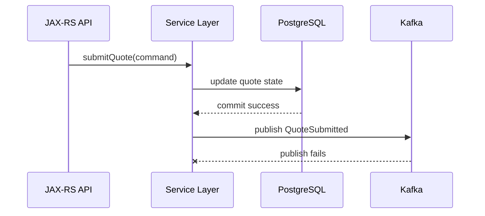
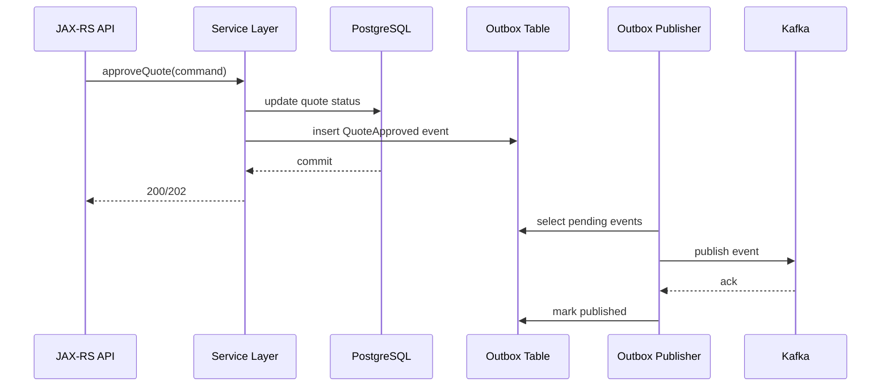
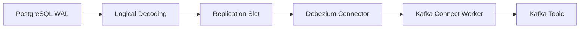

# Part 035 — PostgreSQL, MyBatis, and Kafka Integration

> Fokus part ini: memahami integrasi PostgreSQL, MyBatis/JDBC, dan Kafka sebagai masalah **transaction boundary + distributed consistency**, bukan sekadar “insert DB lalu publish event”.

---

## 1. Core Mental Model

Dalam enterprise Java service, PostgreSQL sering menjadi **system of record** untuk local bounded context. Kafka menjadi **event distribution backbone** untuk memberi tahu sistem lain bahwa sesuatu berubah.

Masalah utamanya:

> PostgreSQL transaction dan Kafka publish bukan satu atomic transaction yang sama.

Jika service melakukan dua hal ini secara naïve:

1. update database,
2. publish event ke Kafka,

maka selalu ada celah failure di antara keduanya.



Database sudah berubah, tetapi event tidak terkirim. Downstream tidak tahu perubahan terjadi.

Solusi umum bukan memaksa distributed transaction, tetapi memakai pola:

- transactional outbox,
- CDC/Debezium,
- inbox/idempotency,
- reconciliation,
- replay-safe consumer,
- observability terhadap lag dan stuck records.

---

## 2. Integration Shapes

### 2.1 Direct DB Write + Kafka Publish

Pattern:

```text
HTTP request
-> validate command
-> update PostgreSQL
-> commit
-> kafkaProducer.send(...)
```

Ini sederhana, tetapi rawan dual-write failure.

Masalah:

- DB commit sukses, Kafka publish gagal.
- Kafka publish sukses, HTTP response gagal.
- Kafka publish retry menghasilkan duplicate event.
- Event terkirim sebelum transaction commit jika publish dilakukan terlalu cepat.
- Rollback DB tidak otomatis membatalkan event.

Gunakan hanya untuk event non-kritis atau telemetry yang boleh hilang, bukan event bisnis yang menggerakkan order lifecycle.

### 2.2 Transactional Outbox + Polling Publisher

Pattern:

```text
HTTP request
-> update business table
-> insert outbox row in same DB transaction
-> commit
-> background publisher reads outbox
-> publish to Kafka
-> mark outbox row published
```

Ini pattern umum untuk event bisnis penting.



Kelebihan:

- business write dan outbox write atomic di PostgreSQL,
- Kafka publish bisa di-retry,
- failure bisa diobservasi sebagai outbox backlog,
- event tidak hilang setelah DB commit.

Kekurangan:

- perlu publisher process,
- perlu locking/concurrency control,
- ordering perlu dipikirkan,
- cleanup/retention perlu jelas,
- masih bisa menghasilkan duplicate publish jika crash setelah publish sebelum mark published.

### 2.3 Transactional Outbox + CDC/Debezium

Pattern:

```text
HTTP request
-> update business table
-> insert outbox row
-> commit
-> Debezium reads WAL
-> emits Kafka event
```

Kelebihan:

- tidak perlu polling publisher manual,
- event mengikuti commit order PostgreSQL/WAL,
- cocok untuk high-throughput outbox.

Kekurangan:

- Debezium/Connect menjadi runtime kritis,
- replication slot lag bisa menahan WAL,
- connector failure bisa menghentikan event publication,
- schema/SMT/config drift harus dikelola,
- debugging lebih lintas layer.

### 2.4 Kafka Consumer + PostgreSQL Write

Pattern:

```text
Kafka event
-> consumer validates schema
-> deduplicate event
-> update PostgreSQL
-> commit offset after DB commit
```

Ini membutuhkan inbox/idempotency.

Jika consumer crash setelah DB commit tetapi sebelum offset commit, event akan diproses ulang. Maka DB write harus aman terhadap duplicate.

### 2.5 Kafka as Source for Projection Table

Pattern:

```text
Topic events
-> projection consumer
-> update read model table
-> API reads projection
```

Risiko:

- projection lag,
- stale read,
- rebuild projection mahal,
- replay harus idempotent,
- schema evolution bisa mematahkan projection.

---

## 3. Transaction Boundary in Java/JAX-RS Service

Boundary yang sehat:

```text
JAX-RS Resource
-> Application Service
   -> begin DB transaction
   -> validate command
   -> load aggregate/state
   -> enforce state transition
   -> write business rows
   -> write outbox row
   -> commit DB transaction
-> return HTTP response
```

Resource layer tidak seharusnya memegang detail Kafka.

Resource layer hanya:

- parse request,
- validate shape dasar,
- propagate correlation context,
- call application service,
- map result ke HTTP response.

Application service bertanggung jawab terhadap:

- business invariant,
- DB transaction,
- outbox row,
- idempotency key,
- domain state transition,
- audit metadata.

Contoh pseudo-code:

```java
@Path("/quotes")
public class QuoteResource {
    private final QuoteApplicationService service;

    @POST
    @Path("/{quoteId}/submit")
    public Response submitQuote(
            @PathParam("quoteId") String quoteId,
            SubmitQuoteRequest request,
            @HeaderParam("Idempotency-Key") String idempotencyKey,
            @Context HttpHeaders headers) {

        CommandContext context = CommandContext.from(headers, idempotencyKey);
        SubmitQuoteResult result = service.submitQuote(quoteId, request, context);

        return Response.accepted(result).build();
    }
}
```

Kafka event tidak dipublish dari `QuoteResource`. Event disiapkan di service layer sebagai outbox row.

---

## 4. MyBatis/JDBC Transaction Boundary

Dengan MyBatis/JDBC, hal yang perlu dijaga:

- jangan gunakan autocommit untuk command yang menulis banyak table,
- pastikan business write dan outbox write berada dalam transaction yang sama,
- jangan membuat SQL session berbeda untuk outbox jika tidak ikut transaction yang sama,
- jangan commit offset Kafka sebelum DB commit untuk consumer,
- jangan melakukan publish Kafka di tengah transaction lalu rollback DB.

Pseudo-code service:

```java
public SubmitQuoteResult submitQuote(String quoteId, SubmitQuoteRequest request, CommandContext ctx) {
    return transactionTemplate.execute(tx -> {
        Quote quote = quoteMapper.findForUpdate(quoteId);

        quote.submit(ctx.actorId());

        quoteMapper.updateStatus(
            quote.id(),
            quote.status(),
            quote.version()
        );

        OutboxEvent event = OutboxEvent.domainEvent(
            "QuoteSubmitted",
            quote.id(),
            ctx.correlationId(),
            ctx.causationId(),
            ctx.tenantId(),
            quote.toEventPayload()
        );

        outboxMapper.insert(event);

        return SubmitQuoteResult.accepted(quote.id(), event.eventId());
    });
}
```

Yang penting bukan library transaksi spesifiknya. Yang penting adalah invariant:

> Business state dan outbox event harus commit atau rollback bersama.

---

## 5. Insert Business Row + Outbox Row

Contoh DDL sederhana:

```sql
CREATE TABLE quote (
    quote_id          UUID PRIMARY KEY,
    tenant_id         TEXT NOT NULL,
    status            TEXT NOT NULL,
    version           BIGINT NOT NULL,
    submitted_at      TIMESTAMPTZ,
    updated_at         TIMESTAMPTZ NOT NULL DEFAULT now()
);

CREATE TABLE outbox_event (
    outbox_id          UUID PRIMARY KEY,
    aggregate_type     TEXT NOT NULL,
    aggregate_id       TEXT NOT NULL,
    event_type         TEXT NOT NULL,
    event_version      INTEGER NOT NULL,
    event_id           UUID NOT NULL UNIQUE,
    tenant_id          TEXT NOT NULL,
    correlation_id     TEXT NOT NULL,
    causation_id       TEXT,
    partition_key      TEXT NOT NULL,
    payload            JSONB NOT NULL,
    headers            JSONB NOT NULL DEFAULT '{}'::jsonb,
    status             TEXT NOT NULL DEFAULT 'PENDING',
    attempt_count      INTEGER NOT NULL DEFAULT 0,
    next_attempt_at    TIMESTAMPTZ NOT NULL DEFAULT now(),
    created_at         TIMESTAMPTZ NOT NULL DEFAULT now(),
    published_at       TIMESTAMPTZ
);

CREATE INDEX idx_outbox_pending
    ON outbox_event (status, next_attempt_at, created_at)
    WHERE status = 'PENDING';

CREATE INDEX idx_outbox_aggregate_order
    ON outbox_event (aggregate_type, aggregate_id, created_at);
```

Transactional command:

```sql
BEGIN;

UPDATE quote
SET status = 'SUBMITTED',
    version = version + 1,
    submitted_at = now(),
    updated_at = now()
WHERE quote_id = :quote_id
  AND tenant_id = :tenant_id
  AND status = 'DRAFT';

INSERT INTO outbox_event (
    outbox_id,
    aggregate_type,
    aggregate_id,
    event_type,
    event_version,
    event_id,
    tenant_id,
    correlation_id,
    causation_id,
    partition_key,
    payload,
    headers
) VALUES (
    :outbox_id,
    'Quote',
    :quote_id,
    'QuoteSubmitted',
    1,
    :event_id,
    :tenant_id,
    :correlation_id,
    :causation_id,
    :quote_id,
    :payload::jsonb,
    :headers::jsonb
);

COMMIT;
```

Review question:

> Apakah ada state transition business yang berhasil tanpa outbox event yang sesuai?

Jika jawabannya bisa “ya”, desain belum production-safe.

---

## 6. Outbox Payload: JSONB vs Typed Columns

Outbox row biasanya butuh dua jenis data:

1. **routing/query metadata** sebagai typed columns,
2. **event payload** sebagai JSONB atau serialized binary/string.

Typed columns cocok untuk:

- event type,
- aggregate type,
- aggregate ID,
- tenant ID,
- partition key,
- status,
- attempt count,
- created_at,
- next_attempt_at,
- correlation ID.

JSONB payload cocok untuk:

- event body,
- nested business data,
- event-carried state transfer,
- debugging/replay view.

Jangan hanya menyimpan satu blob tanpa metadata. Itu membuat outbox sulit dioperasikan.

Bad:

```sql
CREATE TABLE outbox_event (
    id UUID PRIMARY KEY,
    payload TEXT NOT NULL
);
```

Better:

```sql
CREATE TABLE outbox_event (
    outbox_id UUID PRIMARY KEY,
    event_type TEXT NOT NULL,
    aggregate_id TEXT NOT NULL,
    partition_key TEXT NOT NULL,
    payload JSONB NOT NULL,
    status TEXT NOT NULL,
    created_at TIMESTAMPTZ NOT NULL
);
```

---

## 7. Outbox Polling with `SKIP LOCKED`

Polling publisher harus aman saat ada beberapa worker.

Pattern umum PostgreSQL:

```sql
WITH picked AS (
    SELECT outbox_id
    FROM outbox_event
    WHERE status = 'PENDING'
      AND next_attempt_at <= now()
    ORDER BY created_at
    LIMIT :batch_size
    FOR UPDATE SKIP LOCKED
)
UPDATE outbox_event o
SET status = 'IN_PROGRESS',
    attempt_count = attempt_count + 1
FROM picked
WHERE o.outbox_id = picked.outbox_id
RETURNING o.*;
```

Setelah publish sukses:

```sql
UPDATE outbox_event
SET status = 'PUBLISHED',
    published_at = now()
WHERE outbox_id = :outbox_id;
```

Setelah publish gagal:

```sql
UPDATE outbox_event
SET status = 'PENDING',
    next_attempt_at = now() + (:backoff_seconds || ' seconds')::interval
WHERE outbox_id = :outbox_id;
```

Jika attempt terlalu banyak:

```sql
UPDATE outbox_event
SET status = 'FAILED'
WHERE outbox_id = :outbox_id;
```

Important failure mode:

> Publisher bisa crash setelah Kafka ack sukses tetapi sebelum row ditandai `PUBLISHED`.

Akibatnya event bisa dipublish ulang. Maka consumer tetap harus idempotent.

Outbox mengurangi missing event, bukan menghapus duplicate event.

---

## 8. Outbox Ordering

Ordering tidak otomatis selesai hanya karena outbox memakai `ORDER BY created_at`.

Pertanyaan yang harus dijawab:

- Ordering dibutuhkan per apa?
- Per aggregate?
- Per tenant?
- Per quote/order/customer?
- Apakah beberapa aggregate boleh paralel?
- Apakah satu aggregate bisa diproses oleh beberapa publisher?
- Apakah event key Kafka sama dengan aggregate ID?

Jika ordering dibutuhkan per quote:

```text
partition_key = quote_id
```

Jika ordering dibutuhkan per order:

```text
partition_key = order_id
```

Jika ordering dibutuhkan per tenant, hati-hati hot tenant:

```text
partition_key = tenant_id
```

Outbox publisher sebaiknya tidak mengubah partition key sesuka hati. Partition key adalah bagian dari event contract operational.

---

## 9. CDC from PostgreSQL

CDC membaca perubahan dari WAL PostgreSQL. Dengan Debezium, flow umum:



Dalam model CDC, application service hanya menulis DB. Event publication dilakukan oleh connector.

Kelebihan:

- tidak ada polling query intensif,
- publication mengikuti commit log database,
- cocok untuk outbox event router,
- bisa mengurangi logic publisher custom.

Risiko:

- replication slot lag menahan WAL,
- connector mati membuat event stuck,
- snapshot bisa menghasilkan data historis yang tidak diharapkan consumer,
- schema change bisa mematahkan connector,
- tombstone/delete event harus dipahami,
- Connect offset harus dibackup/dioperasikan.

Review question:

> Apakah tim backend tahu siapa yang memonitor replication slot lag dan connector status?

Jika tidak, CDC bisa menjadi hidden production dependency.

---

## 10. Event Metadata Table

Kadang metadata event lebih baik dinormalisasi sebagian untuk query operational.

Contoh:

```sql
CREATE TABLE event_metadata (
    event_id        UUID PRIMARY KEY,
    event_type      TEXT NOT NULL,
    aggregate_type  TEXT NOT NULL,
    aggregate_id    TEXT NOT NULL,
    tenant_id       TEXT NOT NULL,
    correlation_id  TEXT NOT NULL,
    causation_id    TEXT,
    command_id      TEXT,
    actor_id        TEXT,
    source_service  TEXT NOT NULL,
    created_at      TIMESTAMPTZ NOT NULL DEFAULT now()
);
```

Ini berguna untuk:

- audit trail,
- event lineage,
- replay planning,
- debugging correlation,
- business investigation,
- compliance evidence.

Namun jangan menduplikasi semua payload tanpa alasan. Tentukan mana metadata operational yang perlu query cepat.

---

## 11. Idempotency Table for HTTP Commands

Idempotency key dari HTTP request bisa disimpan di PostgreSQL.

Contoh:

```sql
CREATE TABLE command_idempotency (
    tenant_id          TEXT NOT NULL,
    idempotency_key   TEXT NOT NULL,
    command_type      TEXT NOT NULL,
    request_hash      TEXT NOT NULL,
    result_reference  JSONB,
    status            TEXT NOT NULL,
    created_at        TIMESTAMPTZ NOT NULL DEFAULT now(),
    updated_at        TIMESTAMPTZ NOT NULL DEFAULT now(),
    PRIMARY KEY (tenant_id, idempotency_key)
);
```

Flow:

1. Request masuk dengan `Idempotency-Key`.
2. Service insert row idempotency.
3. Jika key sudah ada, compare request hash.
4. Jika sama, return result sebelumnya.
5. Jika beda, return conflict.
6. Business write + outbox write tetap dalam transaction yang konsisten.

Tanpa idempotency table, client retry bisa menghasilkan duplicate command dan duplicate event.

---

## 12. Inbox Table for Kafka Consumers

Consumer yang menulis PostgreSQL perlu deduplication.

```sql
CREATE TABLE inbox_event (
    consumer_name      TEXT NOT NULL,
    event_id           UUID NOT NULL,
    event_type         TEXT NOT NULL,
    aggregate_id       TEXT NOT NULL,
    tenant_id          TEXT NOT NULL,
    status             TEXT NOT NULL,
    received_at        TIMESTAMPTZ NOT NULL DEFAULT now(),
    processed_at       TIMESTAMPTZ,
    error_message      TEXT,
    PRIMARY KEY (consumer_name, event_id)
);
```

Consumer flow:

```text
poll event
-> begin DB transaction
-> insert inbox row
   -> if duplicate, skip business processing
-> perform business update
-> mark inbox processed
-> commit DB transaction
-> commit Kafka offset
```

Pseudo-code:

```java
void handle(EventEnvelope event) {
    transactionTemplate.execute(tx -> {
        boolean firstTime = inboxMapper.tryInsert(
            consumerName,
            event.eventId(),
            event.eventType(),
            event.aggregateId(),
            event.tenantId()
        );

        if (!firstTime) {
            return null;
        }

        domainHandler.apply(event);
        inboxMapper.markProcessed(consumerName, event.eventId());
        return null;
    });

    offsetCommitter.commitAfterProcessing(event.kafkaOffset());
}
```

Invariant:

> Kafka offset commit terjadi setelah DB transaction sukses.

---

## 13. State Transition Table

Untuk domain seperti quote/order, event sering berkaitan dengan state transition.

State transition sebaiknya dijaga di DB, bukan hanya di kode.

Contoh:

```sql
CREATE TABLE quote_state_transition (
    transition_id UUID PRIMARY KEY,
    quote_id UUID NOT NULL,
    tenant_id TEXT NOT NULL,
    from_status TEXT NOT NULL,
    to_status TEXT NOT NULL,
    event_id UUID NOT NULL,
    command_id TEXT,
    actor_id TEXT,
    created_at TIMESTAMPTZ NOT NULL DEFAULT now()
);
```

Update guarded:

```sql
UPDATE quote
SET status = :to_status,
    version = version + 1,
    updated_at = now()
WHERE quote_id = :quote_id
  AND tenant_id = :tenant_id
  AND status = :expected_from_status;
```

Jika affected rows = 0, jangan publish event seolah transition berhasil.

Manfaat:

- audit state transition,
- replay validation,
- debugging duplicate command,
- detecting invalid transition,
- reconstruction of lifecycle.

---

## 14. Locking and Event Publication

### 14.1 `SELECT FOR UPDATE`

Digunakan saat perlu mencegah concurrent command mengubah aggregate yang sama.

```sql
SELECT *
FROM quote
WHERE quote_id = :quote_id
FOR UPDATE;
```

Risiko:

- lock contention,
- deadlock,
- long transaction,
- API latency meningkat,
- outbox insert tertahan.

### 14.2 Optimistic Locking

Gunakan `version` field.

```sql
UPDATE quote
SET status = :status,
    version = version + 1
WHERE quote_id = :quote_id
  AND version = :expected_version;
```

Jika update gagal, command harus retry atau return conflict.

### 14.3 Event Publication and Locks

Jangan melakukan network call Kafka sambil memegang DB lock.

Bad:

```text
begin transaction
-> lock quote
-> update quote
-> kafka send sync
-> commit
```

Risiko:

- Kafka latency memperpanjang DB lock,
- broker timeout membuat transaction lama,
- deadlock/lock wait meningkat,
- rollback setelah event terkirim.

Better:

```text
begin transaction
-> lock/update quote
-> insert outbox
-> commit
-> async publisher sends Kafka event
```

---

## 15. Serialization Failure After DB Commit

Outbox row bisa gagal dipublish karena serialization/schema issue.

Contoh:

- payload JSONB tidak sesuai event schema,
- required field hilang,
- enum value tidak dikenal,
- schema registry unavailable,
- incompatible schema ID,
- serializer exception.

Jika failure terjadi setelah DB commit, business state sudah berubah.

Maka perlu:

- status outbox `FAILED`,
- error_message/error_code,
- retry policy,
- schema validation sebelum commit jika memungkinkan,
- alert untuk stuck outbox,
- repair script dengan approval,
- compatibility check di CI.

DDL tambahan:

```sql
ALTER TABLE outbox_event
ADD COLUMN last_error_code TEXT,
ADD COLUMN last_error_message TEXT,
ADD COLUMN failed_at TIMESTAMPTZ;
```

Review question:

> Jika event tidak bisa diserialize setelah DB commit, siapa yang tahu, siapa yang memperbaiki, dan bagaimana downstream dipulihkan?

---

## 16. Migration Ordering

Database migration dan event schema migration harus dikoordinasikan.

Urutan aman umum untuk menambah field optional:

1. Tambahkan kolom DB jika diperlukan.
2. Update code untuk populate field baru.
3. Tambahkan field optional/default di schema event.
4. Deploy producer.
5. Deploy consumer yang membaca field baru.
6. Setelah semua consumer siap, field bisa menjadi required hanya jika governance mengizinkan.

Urutan berbahaya:

```text
Deploy producer with required new field
-> old consumer/schema breaks
```

Atau:

```text
Drop DB column
-> outbox serializer masih membaca column
-> event publication fails
```

Migration checklist:

- DB migration backward compatible?
- Event schema backward/forward compatible?
- Producer dan consumer deploy order aman?
- Outbox historical payload masih bisa dipublish/replay?
- Projection rebuild masih bisa membaca event lama?
- Rollback schema mungkin atau tidak?

---

## 17. Data Repair

Data repair dalam Kafka/PostgreSQL integration harus hati-hati karena perubahan DB bisa memerlukan event susulan.

Jenis repair:

- fix business row only,
- insert missing outbox event,
- mark outbox row pending again,
- replay Kafka event,
- reset projection,
- dedup duplicate rows,
- correct state transition history.

Anti-pattern:

```sql
UPDATE quote SET status = 'SUBMITTED' WHERE quote_id = '...';
```

Tanpa outbox event, downstream tetap stale.

Repair yang lebih aman:

```text
begin transaction
-> correct business row
-> insert correction event / state transition event / outbox event
-> commit
-> monitor publication and consumption
```

Setiap repair harus punya:

- reason,
- approver,
- affected aggregate list,
- before/after snapshot,
- event impact,
- replay/dedup plan,
- rollback/compensation plan,
- validation query.

---

## 18. Observability Queries

### 18.1 Outbox Backlog

```sql
SELECT status, count(*)
FROM outbox_event
GROUP BY status
ORDER BY status;
```

### 18.2 Oldest Pending Event

```sql
SELECT min(created_at) AS oldest_pending
FROM outbox_event
WHERE status = 'PENDING';
```

### 18.3 Failed Events by Type

```sql
SELECT event_type, last_error_code, count(*)
FROM outbox_event
WHERE status = 'FAILED'
GROUP BY event_type, last_error_code
ORDER BY count(*) DESC;
```

### 18.4 Inbox Duplicate Rate

```sql
SELECT event_type, count(*)
FROM inbox_event
WHERE received_at >= now() - interval '1 hour'
GROUP BY event_type;
```

### 18.5 Projection Lag

```sql
SELECT now() - max(processed_at) AS projection_lag
FROM inbox_event
WHERE consumer_name = :consumer_name
  AND status = 'PROCESSED';
```

Metrics yang perlu ada:

- outbox pending count,
- outbox oldest age,
- outbox publish rate,
- outbox failure rate,
- inbox duplicate count,
- consumer DB transaction latency,
- DB lock wait,
- deadlock count,
- connection pool saturation,
- Kafka publish latency,
- end-to-end event latency.

---

## 19. Performance Concerns

PostgreSQL/Kafka integration bisa bottleneck di beberapa titik.

### 19.1 Outbox Table Growth

Outbox tanpa cleanup akan membesar.

Risiko:

- index bloat,
- slow polling,
- vacuum pressure,
- storage growth,
- backup size meningkat.

Mitigasi:

- partition outbox by time,
- archive published rows,
- delete after retention,
- partial index for pending rows,
- monitor table/index bloat.

### 19.2 Polling Frequency

Polling terlalu cepat:

- DB load tinggi,
- empty poll overhead,
- connection pool pressure.

Polling terlalu lambat:

- event latency tinggi,
- downstream stale,
- backlog membesar.

Gunakan adaptive polling atau notification jika sesuai, tetapi jangan membuat DB menjadi message broker kedua tanpa kontrol.

### 19.3 Batch Size

Batch terlalu kecil:

- throughput rendah,
- overhead tinggi.

Batch terlalu besar:

- long transaction,
- lock duration panjang,
- memory pressure,
- duplicate burst saat crash.

### 19.4 Connection Pool

Consumer dan outbox publisher bersaing dengan API traffic untuk DB connection.

Pertanyaan review:

- Apakah publisher punya pool terpisah?
- Apakah consumer batch bisa menghabiskan pool?
- Apakah slow downstream membuat DB transaction panjang?
- Apakah retry storm menekan PostgreSQL?

---

## 20. Failure Matrix

| Scenario | DB State | Outbox State | Kafka State | Risk | Mitigation |
|---|---:|---:|---:|---|---|
| DB commit fails | rolled back | none | none | no event | normal rollback |
| DB commit succeeds, app crashes | committed | pending | not published | event delayed | outbox publisher |
| Publisher sends, Kafka ack fails ambiguously | committed | pending/in progress | maybe published | duplicate | idempotent consumer |
| Kafka ack succeeds, mark published fails | committed | pending/in progress | published | duplicate on retry | idempotent consumer + event ID |
| Serialization fails | committed | failed | not published | missing downstream update | alert + repair |
| Consumer DB commit succeeds, offset commit fails | committed | inbox processed | consumed again later | duplicate processing | inbox/idempotency |
| Consumer offset commit succeeds before DB commit | not committed | none | skipped | data loss | commit after processing |
| CDC connector stops | committed | committed | delayed | event backlog | connector monitoring |
| Replication slot lag grows | committed | committed | delayed | WAL disk pressure | lag alert + connector recovery |

---

## 21. PostgreSQL/MyBatis/Kafka PR Review Checklist

Saat review PR, tanyakan:

- Apakah command menulis DB dan menghasilkan event?
- Apakah event dibuat dalam transaction yang sama dengan business write?
- Apakah ada outbox atau CDC?
- Apakah partition key disimpan eksplisit?
- Apakah event ID unik?
- Apakah metadata lengkap?
- Apakah schema event divalidasi?
- Apakah outbox failure terlihat di dashboard?
- Apakah consumer idempotent?
- Apakah offset commit setelah DB commit?
- Apakah ada inbox/processed event table?
- Apakah state transition guarded?
- Apakah migration backward compatible?
- Apakah repair/replay aman?
- Apakah ada integration test dengan PostgreSQL + Kafka?

---

## 22. Internal Verification Checklist

Cek di codebase dan platform internal:

- Transaction manager yang dipakai oleh service Java/JAX-RS.
- Apakah MyBatis session ikut transaction yang sama.
- Apakah autocommit dimatikan untuk command kritis.
- Outbox table schema, status lifecycle, index, dan cleanup policy.
- Apakah outbox publisher polling atau CDC.
- Jika polling: query `FOR UPDATE SKIP LOCKED`, batch size, retry policy.
- Jika CDC: Debezium connector, replication slot, publication, offset topic, connector status.
- Event payload format: JSONB, Avro, Protobuf, JSON Schema, atau custom.
- Metadata event: event ID, correlation ID, causation ID, tenant ID, actor ID, source service, partition key.
- Idempotency table untuk HTTP command.
- Inbox/processed event table untuk consumer.
- State transition table atau audit table.
- Migration strategy untuk DB + event schema.
- Dashboard: outbox lag, failed event, connector lag, consumer lag, DB lock wait, DB connection pool.
- Runbook data repair dan replay.
- Incident notes terkait missing event, duplicate event, stale projection, connector lag, atau DB lock contention.

---

## 23. Common Anti-Patterns

### Anti-pattern 1: Publish Kafka Event Before DB Commit

```text
begin transaction
-> publish event
-> DB commit fails
```

Consumer melihat event untuk state yang tidak pernah committed.

### Anti-pattern 2: Publish Kafka Event After DB Commit Without Outbox

```text
DB commit success
-> app crashes before publish
```

Downstream tidak pernah tahu perubahan.

### Anti-pattern 3: Consumer Commits Offset Before DB Write

```text
commit offset
-> DB write fails
```

Event hilang dari perspektif consumer group.

### Anti-pattern 4: No Event ID

Tanpa event ID, dedup dan audit menjadi lemah.

### Anti-pattern 5: Redis-only Idempotency for Critical DB Consumer

Jika Redis kehilangan key, duplicate bisa diproses ulang. Untuk state kritis, dedup sebaiknya anchored di PostgreSQL.

### Anti-pattern 6: Outbox Without Monitoring

Outbox tanpa dashboard adalah event loss yang ditunda.

### Anti-pattern 7: Manual DB Repair Without Event Repair

DB berubah, downstream tetap stale.

---

## 24. Senior Engineer Mental Model

Untuk integrasi PostgreSQL, MyBatis, dan Kafka, selalu mulai dari pertanyaan:

1. Apa source of truth lokal?
2. Apa event yang harus keluar setelah state berubah?
3. Apakah business write dan event intent atomic?
4. Bagaimana event dipublish setelah commit?
5. Apa yang terjadi jika publish gagal?
6. Apa yang terjadi jika publish duplicate?
7. Apa yang terjadi jika consumer crash setelah DB commit?
8. Bagaimana replay dilakukan?
9. Bagaimana repair dilakukan?
10. Dashboard mana yang menunjukkan pipeline sehat?

Kafka tidak menghapus kebutuhan database discipline. Kafka justru membuat transaction boundary lebih penting.

---

## 25. Key Takeaways

- PostgreSQL transaction dan Kafka publish bukan atomic transaction yang sama.
- Direct DB write + Kafka publish rawan dual-write problem.
- Outbox membuat event intent atomic dengan business state.
- CDC/Debezium bisa menghilangkan custom polling, tetapi menambah operational dependency.
- Outbox tetap bisa menghasilkan duplicate publish; consumer harus idempotent.
- Consumer yang menulis DB perlu inbox/processed event table.
- Offset commit harus dilakukan setelah processing dan DB commit sukses.
- Migration DB dan event schema harus dirancang backward compatible.
- Data repair harus mempertimbangkan event impact, bukan hanya row update.
- PostgreSQL/Kafka integration yang sehat punya observability terhadap outbox lag, connector lag, consumer lag, DB locks, dan failure states.
