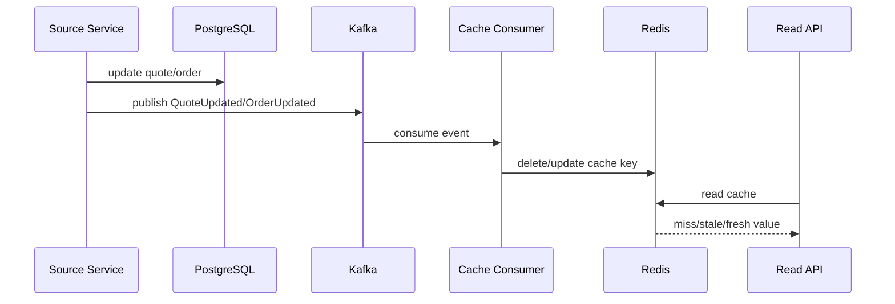
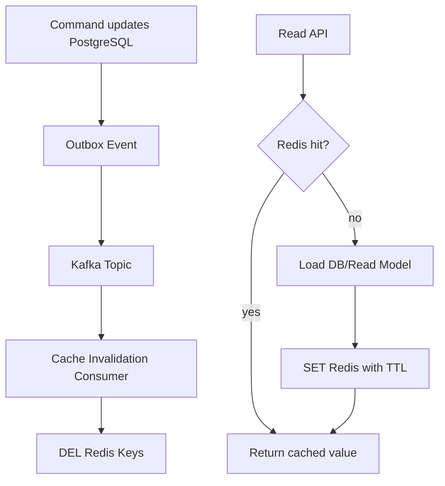
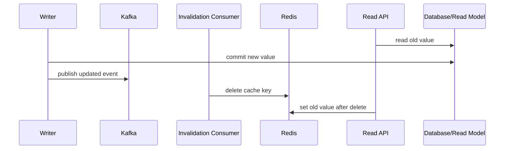

# Part 036 — Redis and Kafka Integration

> Fokus part ini: memahami Redis sebagai komponen cepat untuk cache, dedup, idempotency, lock, dan rate limiting di sekitar Kafka — tetapi bukan pengganti event log, durable workflow state, atau database transaction boundary.

---

## 1. Core Mental Model

Kafka dan Redis sama-sama sering muncul di arsitektur event-driven, tetapi mental model-nya berbeda.

Kafka adalah:

- durable distributed log,
- replayable event stream,
- consumer-group based processing backbone,
- cocok untuk integration event dan stream processing.

Redis adalah:

- in-memory data structure store,
- sangat cepat,
- cocok untuk cache, ephemeral coordination, counters, locks, rate limits,
- bisa durable dengan konfigurasi tertentu, tetapi bukan default mental model untuk event backbone kritis.

Kesalahan umum:

> Menggunakan Redis untuk menyelesaikan masalah yang sebenarnya butuh durable event log atau database-backed idempotency.

Redis sangat berguna, tetapi harus ditempatkan dengan benar.

---

## 2. Where Redis Fits Around Kafka

Redis sering dipakai di sekitar Kafka untuk:

- cache invalidation via Kafka event,
- projection cache,
- idempotency cache,
- duplicate suppression window,
- distributed lock around expensive consumer section,
- rate limiter untuk producer atau consumer,
- short-lived workflow state,
- backpressure signal,
- feature flag/config cache,
- pub/sub internal low-criticality notification.

Namun untuk data bisnis kritis seperti order state, quote lifecycle, fulfillment status, dan audit trail, Redis tidak boleh menjadi satu-satunya source of truth kecuali memang ada desain durability yang jelas.

---

## 3. Redis Cache Invalidation via Kafka

Pattern umum:



Ada dua strategi utama:

1. **Invalidate cache**: hapus key, biarkan request berikutnya rebuild dari DB.
2. **Update cache**: consumer langsung menulis value baru ke Redis.

Untuk sistem enterprise, invalidation sering lebih aman daripada update karena:

- source of truth tetap PostgreSQL/read model,
- schema cache tidak terlalu coupling ke event payload,
- out-of-order update lebih mudah dikelola,
- stale cache bisa dikoreksi dengan reload.

Namun invalidation bisa menghasilkan cache stampede jika banyak request miss bersamaan.

---

## 4. Invalidate vs Update Cache

### 4.1 Delete/Invalidate Pattern

```text
Kafka event: QuoteUpdated
-> consumer calculates cache key
-> DEL quote:{tenantId}:{quoteId}
```

Kelebihan:

- sederhana,
- mengurangi risiko menulis value lama,
- cache rebuild dari source of truth,
- cocok jika payload event tidak membawa semua state.

Kekurangan:

- request berikutnya kena cache miss,
- bisa menyebabkan thundering herd,
- read latency naik sementara,
- butuh fallback DB/read model sehat.

### 4.2 Update/Write-through Projection Cache

```text
Kafka event: QuoteUpdated
-> consumer transforms payload
-> SET quote:{tenantId}:{quoteId} newValue EX ttl
```

Kelebihan:

- read lebih cepat setelah event,
- cocok untuk projection kecil,
- bisa mengurangi DB read.

Kekurangan:

- rawan out-of-order event,
- event payload harus cukup lengkap,
- schema cache coupling ke event schema,
- replay bisa menulis value historis jika tidak dijaga versioning.

Rule of thumb:

> Jika event tidak membawa full state + version, jangan update cache value secara buta. Invalidate lebih aman.

---

## 5. Cache Key Design

Cache key harus eksplisit dan stabil.

Contoh:

```text
quote:{tenantId}:{quoteId}
order:{tenantId}:{orderId}
catalog:{tenantId}:{catalogVersion}:{productId}
pricing:{tenantId}:{priceListId}:{productId}
```

Hindari key yang tidak punya tenant boundary:

```text
quote:{quoteId}
```

Risiko:

- cross-tenant collision,
- security/privacy issue,
- incorrect invalidation,
- debugging sulit.

Untuk event invalidation, payload/header minimal perlu:

- tenant ID,
- aggregate ID,
- event type,
- event version,
- source service,
- event time,
- aggregate version jika ada,
- cache namespace jika distandardisasi.

---

## 6. Version-Aware Cache Updates

Untuk update cache langsung dari Kafka event, gunakan version check.

Redis value bisa menyimpan:

```json
{
  "aggregateVersion": 42,
  "payload": {
    "quoteId": "...",
    "status": "APPROVED"
  }
}
```

Saat event datang:

```text
if event.aggregateVersion > cached.aggregateVersion:
    update cache
else:
    ignore stale event
```

Ini penting karena Kafka hanya menjamin ordering per partition. Jika key salah, event untuk aggregate yang sama bisa masuk partition berbeda dan datang out-of-order.

Jika consumer melakukan retry, replay, atau reset offset, event lama juga bisa datang lagi.

---

## 7. Redis as Idempotency Store

Redis sering dipakai untuk idempotency key karena cepat.

Contoh:

```text
SET idempotency:{tenantId}:{key} result NX EX 86400
```

Untuk HTTP command ringan, Redis idempotency bisa cukup jika:

- duplicate window terbatas,
- kehilangan key dapat diterima,
- result bisa dihitung ulang,
- command tidak memicu irreversible external side effect.

Untuk command bisnis kritis, Redis-only idempotency lemah.

Risiko:

- key expired terlalu cepat,
- Redis failover kehilangan key jika durability tidak kuat,
- duplicate command diproses ulang,
- result tidak bisa diaudit,
- cross-service idempotency tidak konsisten.

Untuk CPQ/order management, idempotency kritis sebaiknya anchored di PostgreSQL, sementara Redis boleh menjadi acceleration layer.

Pattern hybrid:

```text
Request arrives
-> check Redis fast path
-> if miss, check PostgreSQL idempotency table
-> process command in DB transaction
-> store result in PostgreSQL
-> optionally cache result in Redis
```

---

## 8. Redis as Dedup Store for Kafka Consumer

Redis bisa digunakan untuk suppress duplicate event dalam window tertentu.

```text
SET processed:{consumer}:{eventId} 1 NX EX 604800
```

Jika `SET NX` sukses, process event. Jika gagal, skip duplicate.

Kelebihan:

- cepat,
- mengurangi DB hit,
- cocok untuk high-volume low-risk event,
- cocok untuk dedup window temporal.

Kekurangan:

- bukan audit trail kuat,
- dedup hilang setelah TTL,
- Redis data loss bisa menyebabkan reprocessing,
- tidak atomic dengan DB business write,
- tidak cukup untuk exactly/effectively-once business processing.

Untuk consumer yang menulis PostgreSQL state kritis, gunakan inbox table di DB. Redis dedup boleh menjadi front filter, bukan satu-satunya guard.

---

## 9. Distributed Lock Around Consumer

Kadang consumer memakai Redis lock untuk melindungi critical section.

Contoh:

```text
lock:order:{orderId}
```

Tujuan:

- mencegah dua worker memproses aggregate sama bersamaan,
- melindungi expensive external call,
- mengurangi race antar event out-of-order,
- membatasi concurrent processing per tenant/customer.

Namun Redis lock sangat sering disalahgunakan.

Risiko:

- lock expired saat processing masih berjalan,
- worker pause/GC membuat lock lepas,
- network partition membuat ownership ambigu,
- lock release oleh process yang bukan owner jika token tidak dicek,
- lock membuat throughput turun,
- deadlock-like behavior jika TTL terlalu panjang.

Minimal lock harus punya token:

```text
SET lock:order:{orderId} {randomToken} NX PX 30000
```

Release harus compare token:

```lua
if redis.call("get", KEYS[1]) == ARGV[1] then
  return redis.call("del", KEYS[1])
else
  return 0
end
```

Tetap ingat:

> Redis lock bukan pengganti idempotent state transition di database.

---

## 10. Rate Limiting Producers and Consumers

Redis cocok untuk rate limiting karena atomic counters dan TTL.

Use case producer:

- membatasi request yang menghasilkan event,
- melindungi Kafka dari burst tenant tertentu,
- mencegah abuse API,
- menjaga downstream SLA.

Use case consumer:

- membatasi call ke external API,
- mengontrol throughput per tenant,
- menghindari saturasi PostgreSQL,
- menjaga integration partner rate limit.

Contoh fixed window:

```text
INCR rate:{tenantId}:{minute}
EXPIRE rate:{tenantId}:{minute} 120
```

Jika counter melewati limit, producer bisa:

- return `429 Too Many Requests`,
- enqueue command untuk delayed processing,
- reject non-critical request,
- degrade feature.

Consumer bisa:

- pause partition sementara,
- delay retry,
- route ke retry topic,
- reduce max poll records,
- use token bucket.

Hati-hati: rate limiter yang salah bisa menciptakan lag Kafka besar.

---

## 11. Redis Stream vs Kafka

Redis Streams menyediakan append-only stream dan consumer group, tetapi mental model dan operational target berbeda dari Kafka.

Redis Streams cocok untuk:

- lightweight stream internal,
- small-scale async processing,
- low-latency in-memory queue-like workload,
- workload yang dekat dengan Redis ecosystem,
- ephemeral atau bounded retention use case.

Kafka lebih cocok untuk:

- durable event backbone lintas service,
- high-throughput log,
- long retention,
- replay besar,
- schema-governed integration event,
- stream processing ecosystem,
- multi-team event contract.

Perbandingan singkat:

| Concern | Kafka | Redis Stream |
|---|---|---|
| Primary mental model | durable distributed log | Redis data structure stream |
| Replay | strong, native by offset/retention | possible but memory/retention dependent |
| Retention | time/size/compaction | trimming/maxlen policies |
| Partitioning | topic partitions | stream key based; scaling model berbeda |
| Ecosystem | Connect, Streams, ksqlDB, Schema Registry | Redis ecosystem |
| Contract governance | common with schemas/registry | usually custom |
| Enterprise integration backbone | strong fit | limited fit |

Jangan memilih Redis Stream hanya karena lebih mudah dipakai jika requirement sebenarnya adalah replayable enterprise event backbone.

---

## 12. Redis Pub/Sub vs Kafka

Redis Pub/Sub adalah fire-and-forget messaging.

Karakteristik:

- tidak durable,
- subscriber offline kehilangan pesan,
- tidak ada replay,
- tidak cocok untuk event bisnis kritis,
- cocok untuk notification ephemeral.

Kafka berbeda:

- event disimpan di log,
- consumer bisa tertinggal lalu catch up,
- offset per consumer group,
- replay berdasarkan retention,
- cocok untuk integration event.

Redis Pub/Sub cocok untuk:

- local cache notification low-risk,
- UI ephemeral update,
- internal node coordination ringan,
- invalidation yang boleh hilang jika ada TTL fallback.

Tidak cocok untuk:

- order submitted,
- payment captured,
- quote approved,
- fulfillment requested,
- compliance audit event.

---

## 13. Event-Driven Cache Invalidation Pattern

Cache invalidation berbasis event harus punya fallback.

Pattern sehat:

```text
Write side:
  DB transaction commits
  Outbox/Kafka publishes domain event

Cache side:
  Consumer receives event
  Deletes affected Redis keys

Read side:
  Try Redis
  If miss, load from DB/read model
  Store with TTL
```

Mermaid:



Important:

- Cache invalidation event should be idempotent.
- Deleting missing key is safe.
- Duplicate invalidation is safe.
- Out-of-order invalidation is usually less dangerous than out-of-order update.
- TTL is safety net, not primary consistency mechanism.

---

## 14. Cache Staleness

Redis cache can become stale when:

- Kafka event delayed,
- invalidation consumer lagging,
- invalidation event lost due to non-durable path,
- wrong cache key calculated,
- event missing tenant ID,
- consumer fails deserialization,
- Redis command fails,
- stale value reinserted after invalidation race,
- out-of-order update overwrites newer cache.

Staleness needs explicit policy:

- acceptable staleness window,
- TTL per cache type,
- manual invalidation ability,
- cache rebuild path,
- dashboard for invalidation lag,
- ability to bypass cache during incident,
- consistency notes in API contract if user-visible.

For CPQ/order management, stale pricing/catalog/quote/order state can have business impact. Treat cache staleness as correctness risk, not only performance issue.

---

## 15. Race: Read Re-Populates Old Value After Invalidation

Common race:



Result: Redis contains old value even after invalidation.

Mitigations:

- shorter TTL,
- version-aware cache set,
- compare aggregate version before write,
- read from primary after command if strong UX needed,
- use write-through from source of truth carefully,
- include updated_at/version in cache value.

Version-aware SET pseudo-logic:

```text
current = GET key
if current is missing or new.version >= current.version:
    SET key newValue EX ttl
else:
    ignore stale write
```

---

## 16. Cache Rebuild

Cache rebuild can be:

- lazy: rebuild on read miss,
- batch: rebuild selected keys,
- replay-based: consume event history and rebuild projection/cache,
- full refresh: clear namespace and repopulate.

For Redis cache, lazy rebuild is common.

But for high-traffic keys, clear-all can cause stampede.

Mitigations:

- staggered rebuild,
- per-key locking,
- request coalescing,
- background warmup,
- TTL jitter,
- rate limit DB fallback,
- circuit breaker for cache rebuild.

TTL jitter example:

```text
ttl = baseTtl + random(0, jitterSeconds)
```

This avoids many keys expiring at the same instant.

---

## 17. Redis/Kafka Failure Interaction

### 17.1 Kafka Up, Redis Down

Consumer receives invalidation event but Redis command fails.

Options:

- retry Redis command,
- pause consumer briefly,
- route event to retry topic,
- send to DLQ after budget,
- rely on TTL if business impact low,
- alert if critical cache.

Do not commit offset before deciding failure semantics.

### 17.2 Kafka Down, Redis Up

Cache continues serving old data if invalidation event cannot be published or consumed.

Mitigation:

- TTL safety net,
- outbox ensures event eventually published,
- cache bypass for sensitive reads,
- monitoring event publication lag.

### 17.3 Redis Loses Data

Cache loss usually recoverable.

But if Redis was used for idempotency/dedup/lock state, loss may cause:

- duplicate command processing,
- duplicate consumer side effect,
- lock safety issue,
- rate limit reset.

This is why critical idempotency belongs in durable store.

### 17.4 Consumer Lag Increases

Invalidation events delayed. Redis returns stale value longer.

Need metric:

```text
cache_invalidation_lag_seconds = now - event_time_of_last_processed_invalidation
```

---

## 18. Offset Commit When Redis Is Involved

If Kafka consumer only deletes cache and cache is best-effort, offset commit can be after attempted invalidation with fallback TTL.

If invalidation is correctness-critical, commit only after Redis operation succeeds or event is safely moved to retry/DLQ.

Pattern:

```text
poll event
-> calculate keys
-> delete keys in Redis
-> if success: commit offset
-> if transient failure: retry/pause
-> if permanent failure: DLQ with enough metadata
```

But be careful:

- blocking consumer on Redis outage can create large lag,
- skipping invalidation can create stale read,
- DLQ needs replay tool,
- duplicate invalidation is safe, so retry is usually fine.

---

## 19. Redis Data Structures Useful Around Kafka

### 19.1 String

For simple cache/idempotency marker.

```text
SET processed:eventId 1 EX 604800 NX
```

### 19.2 Hash

For structured cached object or metadata.

```text
HSET quote:{id} status APPROVED version 42 updatedAt ...
```

### 19.3 Set

For membership index.

```text
SADD tenant:{tenantId}:activeOrders {orderId}
```

### 19.4 Sorted Set

For scheduled retry/rate control/custom delayed work.

```text
ZADD retry:events {timestamp} {eventId}
```

Be careful not to rebuild Kafka retry semantics poorly in Redis unless requirement is clearly bounded.

### 19.5 Lua Script

For atomic compare-and-set or lock release.

Useful when version-aware update or token-based lock release is needed.

---

## 20. Observability

Metrics to track:

- Redis command latency,
- Redis error rate,
- cache hit ratio,
- cache miss ratio,
- cache invalidation consume lag,
- invalidation failure count,
- Redis memory usage,
- evicted keys,
- expired keys,
- blocked clients,
- connection pool saturation,
- duplicate suppressed count,
- lock acquisition failure count,
- lock timeout count,
- rate limit rejection count,
- Kafka consumer lag for invalidation group,
- DLQ count for Redis-related consumer.

Logs should include:

- event ID,
- event type,
- tenant ID,
- aggregate ID,
- cache key,
- correlation ID,
- Redis command outcome,
- retry count,
- consumer group,
- partition/offset.

Dashboard should answer:

1. Are invalidation consumers keeping up?
2. Is Redis healthy?
3. Are cache misses normal or incident-level?
4. Are keys being evicted unexpectedly?
5. Are lock/rate-limit mechanisms causing backlog?
6. Is stale cache suspected for customer-facing issue?

---

## 21. Security and Privacy

Redis cache can leak sensitive data if key/value design is careless.

Concerns:

- PII in cache value,
- PII in cache key,
- tenant ID missing from key,
- shared Redis across services/environments,
- no encryption in transit,
- broad Redis credentials,
- logs printing cache values,
- DLQ containing Redis operation payload with sensitive key/value,
- stale sensitive data retained longer than allowed.

Guidelines:

- avoid PII in key names,
- include tenant boundary,
- use TTL for sensitive cache,
- encrypt in transit if required,
- restrict service credentials,
- do not log full cached payload,
- define cache retention policy,
- treat cache schema as security-sensitive.

Bad key:

```text
customer-email:john@example.com
```

Better key:

```text
customer:{tenantId}:{customerId}
```

---

## 22. Performance Concerns

Redis improves latency, but Kafka integration can create new bottlenecks.

### 22.1 Hot Keys

Example:

```text
tenant:{largeTenant}:catalog
```

One key receives huge traffic.

Mitigation:

- shard key by domain,
- split catalog by product/category/version,
- use local in-process cache for ultra-hot immutable data,
- add TTL jitter,
- monitor per-key hotness if tooling supports.

### 22.2 Cache Stampede

Many requests miss at once.

Mitigation:

- request coalescing,
- lock around rebuild,
- stale-while-revalidate pattern,
- background refresh,
- TTL jitter.

### 22.3 Consumer Throughput vs Redis Latency

If invalidation consumer calls Redis one key at a time, throughput may suffer.

Options:

- pipeline Redis commands,
- batch deletes,
- limit batch size,
- monitor command latency,
- avoid long blocking script.

### 22.4 Redis Memory Pressure

If Kafka-driven cache update writes too many keys:

- eviction increases,
- hit ratio drops,
- stale/partial cache behavior appears,
- Redis CPU can spike.

Define maximum cache cardinality and eviction policy consciously.

---

## 23. Testing Redis/Kafka Integration

Test cases:

- invalidation event deletes correct key,
- duplicate invalidation is safe,
- missing key delete is safe,
- event without tenant ID is rejected,
- out-of-order update does not overwrite newer cache,
- Redis unavailable behavior is correct,
- consumer offset is not committed incorrectly,
- DLQ contains enough replay metadata,
- cache rebuild works after Redis flush,
- idempotency key expiry behavior is acceptable,
- lock expiry during long processing is handled,
- rate limiter does not starve critical events,
- cache stampede mitigation works under load.

For integration tests, use:

- Testcontainers Kafka,
- Testcontainers Redis,
- PostgreSQL if fallback read involved,
- fake clock for TTL tests,
- explicit consumer offset assertions.

---

## 24. Redis/Kafka PR Review Checklist

Ask these questions:

- Is Redis used as cache, idempotency store, lock, rate limiter, or stream?
- Is Redis the source of truth? If yes, is that intentional and durable enough?
- What happens if Redis loses the key?
- What happens if Redis is down while Kafka event is consumed?
- Is Kafka offset committed only after required Redis action?
- Are cache keys tenant-safe?
- Is invalidation idempotent?
- Is update cache version-aware?
- Is TTL defined?
- Is stale read acceptable? For how long?
- Is there a cache bypass or rebuild path?
- Are duplicate event and replay safe?
- Are Redis errors observable?
- Are lock tokens used correctly?
- Is rate limiting causing consumer lag?
- Are sensitive values avoided in keys/logs?

---

## 25. Internal Verification Checklist

Cek di codebase dan runtime internal:

- Redis digunakan untuk apa saja: cache, lock, idempotency, dedup, rate limiter, pub/sub, stream.
- Redis cache key convention dan tenant boundary.
- Kafka topic/event yang memicu cache invalidation.
- Consumer group untuk invalidation.
- Offset commit strategy invalidation consumer.
- Apakah invalidation memakai delete atau update cache.
- Jika update cache: apakah ada aggregate version check.
- TTL per cache namespace.
- Cache rebuild path dan cache bypass mechanism.
- Redis connection pool config di Java service.
- Redis failure handling: retry, DLQ, fallback TTL, alert.
- Redis lock implementation: token, TTL, release script.
- Redis idempotency/dedup usage dan apakah ada durable DB fallback.
- Rate limiter implementation dan dampaknya terhadap Kafka lag.
- Dashboard: Redis latency, error, memory, eviction, hit ratio, Kafka invalidation lag.
- Incident notes terkait stale cache, Redis outage, duplicate processing, lock expiry, atau consumer lag akibat Redis.

---

## 26. Common Anti-Patterns

### Anti-pattern 1: Redis as Durable Event Store

Menggunakan Redis Pub/Sub atau ephemeral key sebagai pengganti Kafka untuk event bisnis kritis.

### Anti-pattern 2: Cache Update Without Version

Consumer menulis cache dari event lama dan menimpa state baru.

### Anti-pattern 3: Redis-only Idempotency for Irreversible Command

Key expired atau hilang, command diproses ulang.

### Anti-pattern 4: Lock Without Token

Process A membuat lock, lock expired, process B membuat lock, process A menghapus lock milik B.

### Anti-pattern 5: Commit Kafka Offset Before Critical Redis Action

Event dianggap selesai, tetapi invalidation gagal.

### Anti-pattern 6: PII in Cache Key

Key muncul di logs, metrics, slowlog, atau monitoring.

### Anti-pattern 7: No TTL

Cache value hidup terlalu lama dan stale setelah event pipeline gagal.

### Anti-pattern 8: Redis Rate Limiter Without Backpressure Plan

Consumer menahan event terlalu lama dan menciptakan Kafka lag besar.

---

## 27. Senior Engineer Mental Model

Saat melihat Redis dan Kafka dalam satu flow, tanyakan:

1. Redis dipakai untuk state durable atau ephemeral?
2. Jika Redis hilang, apakah correctness rusak atau hanya latency naik?
3. Jika Kafka event delayed, berapa lama cache boleh stale?
4. Jika event duplicate, apakah Redis operation aman?
5. Jika event replay, apakah cache update aman?
6. Jika event out-of-order, apakah version check mencegah stale overwrite?
7. Jika Redis down, apakah consumer block, retry, DLQ, atau skip?
8. Jika rate limiter aktif, apakah Kafka lag terkendali?
9. Jika lock expired, apakah DB state transition tetap idempotent?
10. Apakah observability bisa membuktikan cache invalidation berjalan?

Redis adalah alat yang sangat kuat untuk speed. Tetapi correctness tetap harus ditopang oleh event contract, database invariant, idempotency, dan operational visibility.

---

## 28. Key Takeaways

- Kafka adalah durable event backbone; Redis adalah fast in-memory coordination/cache layer.
- Redis cocok untuk cache invalidation, dedup window, rate limiting, lock, dan fast lookup.
- Redis tidak boleh menjadi satu-satunya guard untuk business-critical idempotency kecuali durability dan failure semantics jelas.
- Cache invalidation via Kafka biasanya lebih aman daripada blind cache update.
- Jika update cache dari event, gunakan aggregate version.
- Redis lock harus memakai token dan TTL, tetapi tetap bukan pengganti DB invariant.
- Redis outage harus punya keputusan offset commit/retry/DLQ yang eksplisit.
- Cache staleness adalah correctness concern, bukan sekadar performance concern.
- Observability harus menghubungkan Redis health, Kafka lag, invalidation lag, cache hit ratio, dan stale-read incident.
