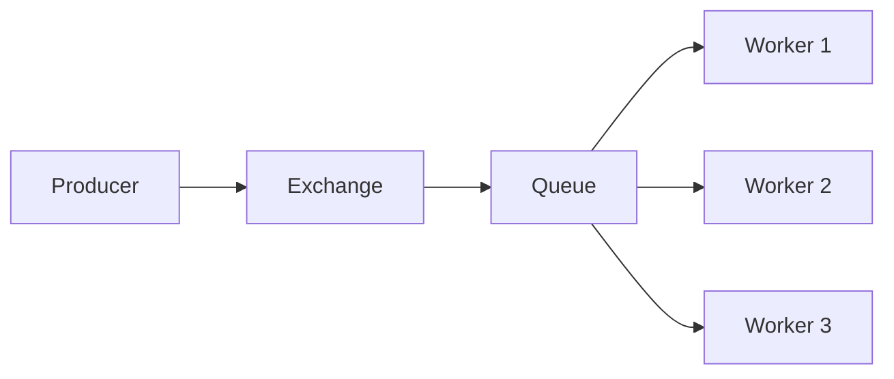
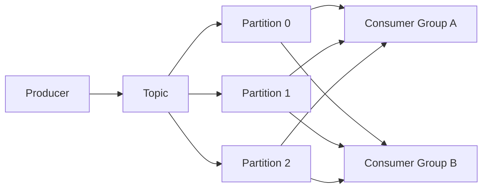
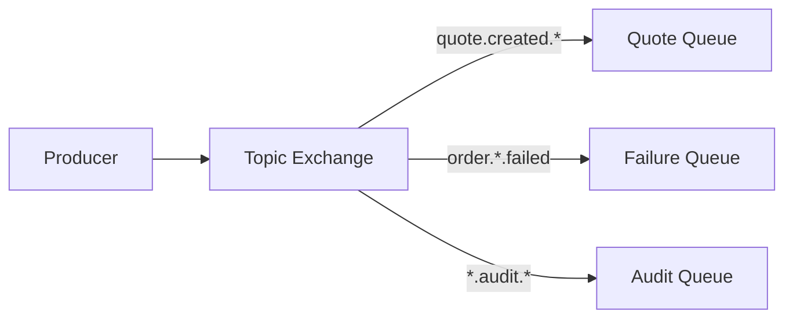
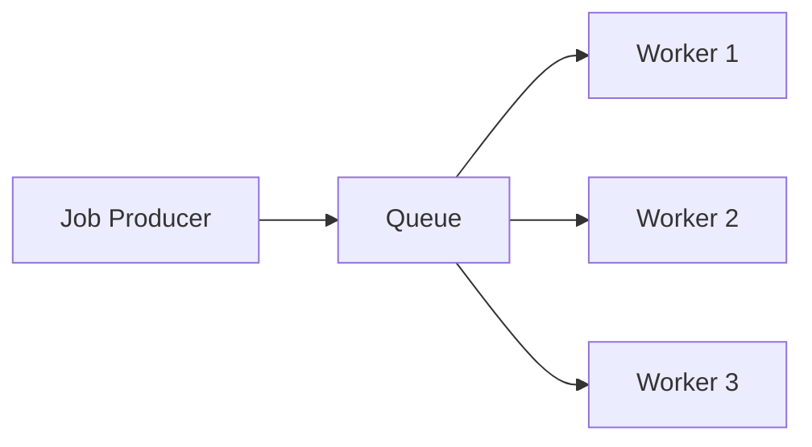
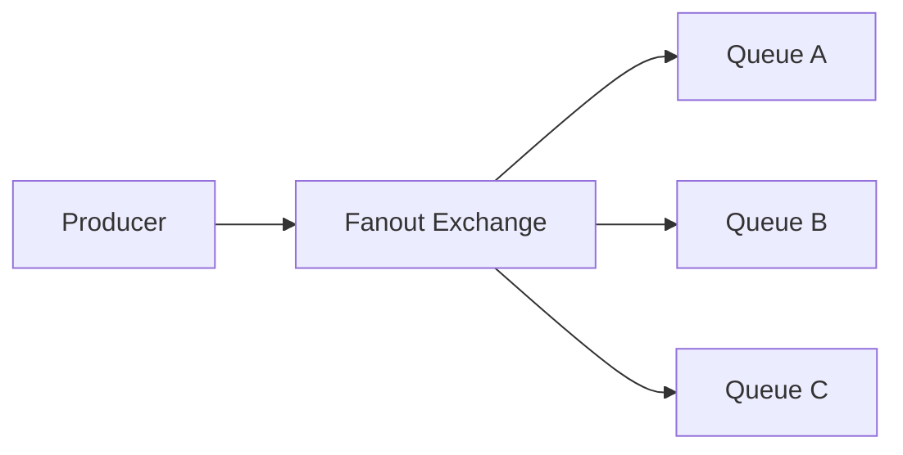
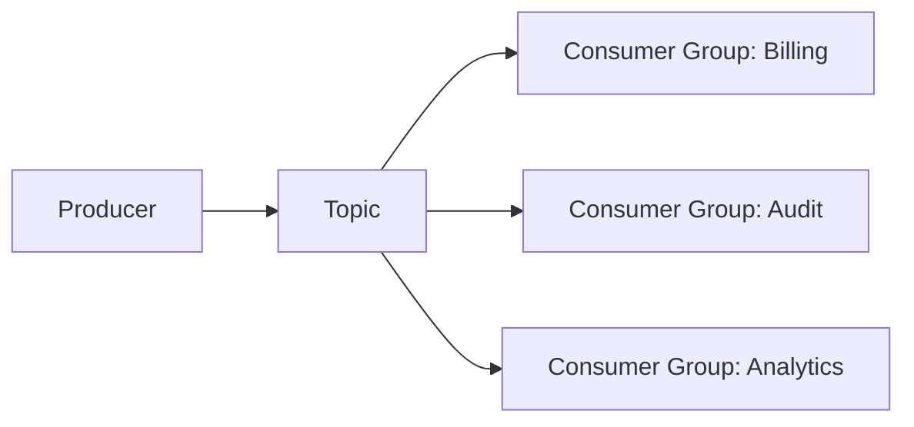
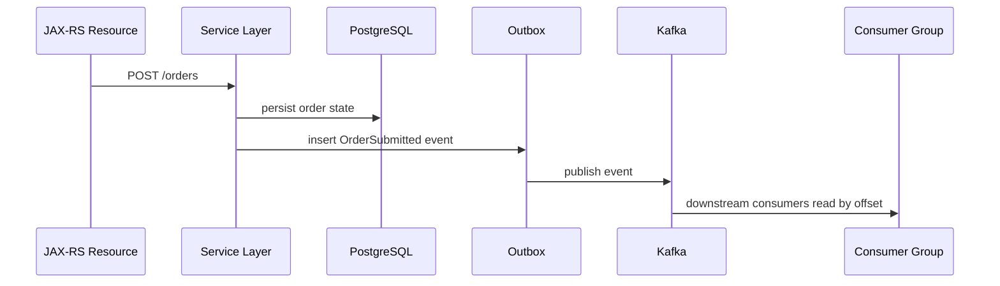
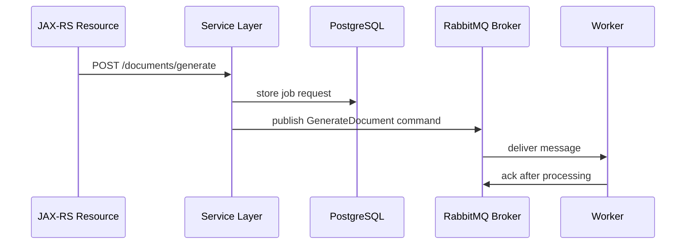
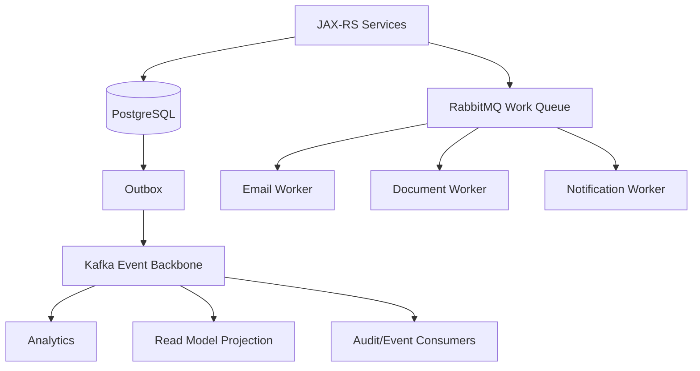

# Part 037 — Kafka vs RabbitMQ and RabbitMQ Stream

> Fokus part ini: memahami perbedaan Kafka, RabbitMQ, dan RabbitMQ Stream dari sisi semantics, correctness, replay, ordering, routing, throughput, latency, dan operational trade-off. Tujuannya bukan memilih tool favorit, tetapi memilih platform yang cocok untuk invariant bisnis dan failure model.

---

## 1. Core Mental Model

Kafka dan RabbitMQ sama-sama sering disebut “messaging system”, tetapi model dasarnya berbeda.

Kafka adalah:

- distributed commit log,
- event streaming platform,
- durable event backbone,
- replayable stream,
- topic-partition-offset based,
- consumer group menyimpan posisi baca,
- message tidak hilang hanya karena sudah dibaca consumer,
- cocok untuk integration event, analytics stream, CDC, replay, fanout, dan stream processing.

RabbitMQ klasik adalah:

- message broker berbasis exchange dan queue,
- routing engine,
- push-oriented delivery,
- queue ownership lebih eksplisit,
- message biasanya dihapus setelah ack,
- cocok untuk work queue, task dispatch, RPC-ish async command, routing kompleks, dan low-latency operational messaging.

RabbitMQ Stream berada di tengah:

- log-like stream di ekosistem RabbitMQ,
- message bisa direplay,
- offset-based consumption,
- throughput lebih tinggi daripada queue klasik untuk stream use case,
- tetap berbeda dari Kafka dalam ecosystem, operational model, scaling assumptions, dan integration tooling.

Mental model paling penting:

> Kafka adalah log yang banyak consumer bisa baca ulang. RabbitMQ klasik adalah broker yang mengirim message ke queue untuk diproses dan di-ack. RabbitMQ Stream mencoba membawa stream/log semantics ke RabbitMQ, tetapi bukan berarti identik dengan Kafka.

---

## 2. Queue vs Log

### 2.1 Queue Mental Model

Pada queue klasik:



Karakteristik:

- message masuk queue,
- broker mengirim message ke consumer,
- consumer ack setelah selesai,
- setelah ack, message biasanya dihapus,
- consumer dalam queue yang sama membagi pekerjaan,
- replay bukan model utama,
- retention historis bukan fungsi utama.

Queue cocok untuk:

- task processing,
- asynchronous command,
- background job,
- work distribution,
- retry dengan dead-letter exchange,
- workflow step yang harus diproses sekali secara operasional.

### 2.2 Log Mental Model

Pada Kafka:



Karakteristik:

- record ditulis ke log,
- record memiliki offset,
- consumer membaca dari offset tertentu,
- tiap consumer group punya posisi baca sendiri,
- message tetap ada sampai retention/compaction menghapusnya,
- replay adalah first-class capability,
- banyak consumer group bisa membaca event yang sama secara independen.

Log cocok untuk:

- domain/integration event,
- event-carried state transfer,
- CDC,
- stream processing,
- audit-ish event trail,
- projection rebuild,
- analytics pipeline,
- cross-service event backbone.

---

## 3. Acknowledgement Model

### 3.1 RabbitMQ Ack

RabbitMQ klasik memakai message acknowledgement pada broker.

Flow umum:

```text
broker delivers message -> consumer processes -> consumer ack -> broker removes message from queue
```

Jika consumer mati sebelum ack:

```text
message can be requeued or dead-lettered depending on config
```

Ack di RabbitMQ menjawab pertanyaan:

> Apakah message ini sudah berhasil diproses oleh consumer queue ini?

### 3.2 Kafka Offset Commit

Kafka tidak menghapus message setelah consumer selesai. Consumer menyimpan offset.

Flow umum:

```text
consumer polls record at offset N -> process -> commit offset N+1
```

Offset commit menjawab pertanyaan:

> Sampai offset mana consumer group ini sudah memproses stream?

Perbedaannya besar:

- RabbitMQ ack mengontrol lifecycle message dalam queue.
- Kafka offset commit mengontrol progress consumer group.
- Kafka record tetap ada untuk consumer group lain dan untuk replay selama retention masih ada.

### 3.3 Correctness Impact

Dalam RabbitMQ:

- ack terlalu cepat dapat menyebabkan lost processing,
- ack terlambat dapat menyebabkan duplicate re-delivery,
- prefetch memengaruhi fairness dan backpressure.

Dalam Kafka:

- commit offset sebelum processing dapat menyebabkan data loss di consumer,
- commit offset setelah processing dapat menyebabkan duplicate processing,
- idempotency tetap wajib untuk at-least-once processing.

---

## 4. Routing Model

RabbitMQ unggul pada routing.

RabbitMQ punya:

- exchange,
- binding,
- routing key,
- direct exchange,
- topic exchange,
- fanout exchange,
- headers exchange,
- dead-letter exchange.

Contoh routing:



Kafka routing lebih sederhana:

- producer memilih topic,
- partition ditentukan oleh key/partitioner,
- consumer subscribe ke topic,
- filtering biasanya dilakukan di consumer atau stream processing layer.

Implikasi:

- Jika kebutuhan utama adalah complex broker-side routing, RabbitMQ sering lebih natural.
- Jika kebutuhan utama adalah durable event stream dan replay, Kafka lebih natural.

Anti-pattern Kafka:

> Membuat satu topic besar berisi semua event lalu berharap Kafka melakukan routing kompleks seperti RabbitMQ exchange.

Kafka bisa melakukan pattern seperti ini dengan consumer-side filtering atau Kafka Streams, tetapi ada cost:

- consumer membaca event yang tidak dibutuhkan,
- coupling schema lebih luas,
- topic ownership kabur,
- observability lebih sulit,
- biaya throughput naik.

---

## 5. Work Distribution

### 5.1 RabbitMQ Work Queue

RabbitMQ cocok untuk work queue:



Satu message diproses oleh satu worker. Scaling worker relatif natural.

Use case:

- send email job,
- PDF generation,
- background export,
- payment attempt command,
- task yang tidak perlu replay historis oleh banyak group.

### 5.2 Kafka Consumer Group

Kafka juga bisa membagi kerja lewat consumer group:

```text
partition count = max parallelism per consumer group
```

Jika topic punya 8 partition, satu consumer group efektif maksimal memproses 8 partition secara paralel. Menambah consumer instance lebih dari partition count tidak menambah parallelism untuk group yang sama.

Kafka cocok jika work distribution juga butuh:

- durable event history,
- replay,
- multiple independent consumer group,
- ordering per key,
- integration backbone.

Jika hanya butuh background job queue sederhana, Kafka bisa terlalu berat.

---

## 6. Fanout Model

RabbitMQ fanout biasanya lewat exchange ke banyak queue:



Setiap queue punya message copy sendiri. Consumer dari queue tersebut memproses sesuai queue ownership.

Kafka fanout lewat banyak consumer group:



Setiap consumer group punya offset sendiri. Tidak perlu membuat physical copy per consumer group pada topic yang sama.

Untuk event backbone enterprise, Kafka fanout sering lebih kuat karena:

- banyak consumer bisa ditambahkan tanpa mengubah producer,
- consumer bisa replay dari offset tertentu,
- historical event bisa dipakai untuk projection/backfill,
- consumer autonomy lebih kuat.

Namun governance menjadi penting:

- siapa boleh consume topic?
- apakah payload aman untuk semua consumer?
- apakah schema evolution mempertimbangkan semua consumer?
- apakah event punya owner?

---

## 7. Replay and Retention

Replay adalah pembeda besar.

Kafka:

- message disimpan sampai retention/compaction,
- consumer bisa reset offset,
- projection bisa dibangun ulang,
- consumer baru bisa membaca historical event,
- replay harus idempotent.

RabbitMQ klasik:

- message yang sudah ack biasanya hilang,
- replay bukan model utama,
- replay biasanya butuh publisher mengirim ulang dari source lain,
- atau message disimpan sendiri di database/audit store.

RabbitMQ Stream:

- mendukung stream replay,
- memiliki offset/retention-like behavior,
- lebih cocok untuk event stream daripada queue klasik,
- tetapi ecosystem dan operational playbook tetap perlu dibandingkan dengan Kafka.

Architecture rule:

> Jika consumer baru harus bisa membangun state dari event historis, gunakan log/stream semantics. Jangan desain di atas queue klasik kecuali ada event store eksternal yang jelas.

---

## 8. Ordering

### 8.1 Kafka Ordering

Kafka menjamin ordering dalam satu partition.

Ordering per aggregate biasanya dicapai dengan partition key:

```text
key = orderId
key = quoteId
key = tenantId + aggregateId
```

Trade-off:

- key yang sama menjaga order,
- key yang sama masuk partition yang sama,
- partition yang sama membatasi parallelism,
- hot key bisa membuat hot partition.

### 8.2 RabbitMQ Ordering

RabbitMQ queue dapat memberi ordering dalam kondisi tertentu, tetapi ordering bisa terpengaruh oleh:

- multiple consumers,
- redelivery,
- retries,
- nack/requeue,
- priority queue,
- dead lettering,
- concurrency di worker.

Jika satu queue diproses oleh banyak consumer, effective processing order tidak selalu sama dengan enqueue order.

### 8.3 Decision Impact

Untuk order lifecycle, quote state transition, approval sequence, dan fulfillment step:

- tanyakan aggregate boundary,
- tentukan apakah ordering wajib,
- tentukan apakah parallelism boleh mengorbankan ordering,
- tentukan bagaimana out-of-order event ditangani.

Platform choice tidak menghilangkan kebutuhan state-version check.

---

## 9. Backpressure

### 9.1 RabbitMQ Backpressure

RabbitMQ memiliki mekanisme seperti:

- prefetch count,
- consumer ack rate,
- queue depth,
- flow control,
- memory/disk alarm.

Jika consumer lambat, queue depth naik. Broker bisa memberi pressure saat resource penuh.

### 9.2 Kafka Backpressure

Kafka backpressure terlihat sebagai:

- consumer lag naik,
- processing latency naik,
- fetch/poll behavior berubah,
- broker disk retention pressure jika lag melebihi retention,
- producer batching/timeout/retry meningkat jika broker/network bottleneck.

Consumer lambat tidak menghapus record, tetapi jika lag melebihi retention, consumer bisa kehilangan kemampuan membaca offset lama.

Correctness concern:

> Kafka lag bukan hanya masalah performa. Jika retention habis sebelum consumer catch up, itu berubah menjadi data loss untuk consumer group tersebut.

---

## 10. Latency and Throughput

Generalized comparison:

| Dimension | Kafka | RabbitMQ Classic | RabbitMQ Stream |
|---|---|---|---|
| Primary model | Durable log | Queue broker | Stream/log-like broker |
| Routing | Topic + partition | Exchange + binding | Stream-oriented |
| Replay | Strong | Not primary | Supported |
| Throughput | Very high for sequential log IO | Strong but routing/queue semantics differ | Higher than classic queue for stream use case |
| Latency | Good, tunable via batching | Often strong for low-latency command/task | Depends on stream setup |
| Fanout | Consumer groups | Multiple queues | Stream consumers |
| Historical retention | Core feature | Not core | Stream feature |
| Consumer progress | Offset | Ack | Offset-like |
| Best fit | Event backbone, CDC, analytics, stream processing | Work queue, routing, task dispatch | Stream use cases inside RabbitMQ ecosystem |

Do not overgeneralize benchmark claims. Actual performance depends on:

- message size,
- durability config,
- replication,
- ack policy,
- batching,
- disk/network,
- consumer processing time,
- broker topology,
- cloud/on-prem network path,
- monitoring overhead,
- schema/serialization cost.

---

## 11. Event vs Command Decision

Kafka is often better for events:

```text
OrderSubmitted
QuoteApproved
CatalogPriceChanged
FulfillmentFailed
```

RabbitMQ is often natural for commands/tasks:

```text
GenerateDocument
SendNotification
AttemptPayment
ProvisionService
```

But this is not absolute.

Kafka can carry commands if:

- command ordering matters,
- command stream must be replayable,
- many independent processors need visibility,
- command lifecycle is part of event-driven workflow.

RabbitMQ can carry events if:

- routing semantics matter more than replay,
- event does not need historical retention,
- consumers are known and queue-bound,
- operational team standardizes on RabbitMQ.

The real question:

> Is this message a durable business fact to be retained and replayed, or a work item to be delivered and acknowledged?

---

## 12. Enterprise Java/JAX-RS Impact

In a Java/JAX-RS service, platform choice affects application design.

### Kafka Integration Shape



Kafka asks the service to care about:

- event contract,
- partition key,
- ordering,
- offset semantics,
- replay safety,
- schema evolution,
- consumer group autonomy,
- lag observability.

### RabbitMQ Integration Shape



RabbitMQ asks the service to care about:

- routing key,
- exchange/queue binding,
- ack/nack,
- prefetch,
- dead-letter exchange,
- queue depth,
- worker concurrency,
- retry/requeue behavior.

---

## 13. PostgreSQL/MyBatis/JDBC Impact

Both Kafka and RabbitMQ still suffer from dual-write risk:

```text
DB commit succeeds, message publish fails
message publish succeeds, DB commit fails
```

Solution patterns remain similar:

- transactional outbox,
- CDC outbox,
- idempotent consumer,
- inbox/processed message table,
- reconciliation job,
- retry/DLQ.

The difference is what happens after publish:

Kafka:

- downstream consumers can replay,
- consumer groups progress independently,
- retention must cover recovery window,
- event log may become system integration memory.

RabbitMQ classic:

- message lifecycle is tied to queue/ack,
- replay usually needs another source,
- queue depth and ack rate are central operations signals,
- routing topology is part of architecture.

Do not choose RabbitMQ because you want to avoid idempotency. Duplicates can still happen.

Do not choose Kafka because you want “guaranteed exactly once business processing”. You still need application-level correctness.

---

## 14. Kubernetes and Cloud Deployment Impact

Kafka client deployment in Kubernetes is sensitive to:

- consumer group rebalance during pod rollout,
- partition count vs replica count,
- graceful shutdown,
- readiness/liveness probes,
- DNS/bootstrap/advertised listeners,
- resource throttling,
- broker network latency.

RabbitMQ clients in Kubernetes are sensitive to:

- connection/channel lifecycle,
- prefetch config,
- queue consumer concurrency,
- consumer cancellation,
- requeue storm,
- broker memory/disk alarm,
- exchange/queue declaration drift.

Managed cloud Kafka and managed RabbitMQ also differ:

- Kafka managed services often abstract broker operations but still expose partition/retention/ACL/schema issues.
- RabbitMQ managed services often abstract node operations but still expose topology, queue depth, DLX, connection, and flow-control issues.

For hybrid/on-prem deployment, network/firewall/TLS/certificate rotation can dominate both.

---

## 15. Failure Mode Comparison

| Failure Mode | Kafka Concern | RabbitMQ Concern |
|---|---|---|
| Consumer slow | Consumer lag grows; retention risk | Queue depth grows; memory/disk pressure |
| Consumer crash | Reprocess from last committed offset | Unacked message requeued/redelivered |
| Producer retry | Duplicate records possible | Duplicate messages possible |
| Broker failure | ISR, leader election, under-replicated partitions | Mirrored/quorum queue behavior, node failover |
| Bad message | Deserialization failure, poison event, DLQ topic | Nack/requeue loop, DLX, poison queue |
| Ordering issue | Partition key, retries, repartitioning | Multiple consumers, requeue, priority, retry |
| Schema change | Compatibility break across consumers | Payload contract break across consumers |
| Replay need | Offset reset possible if retained | Usually not available unless stream/external store |
| Hot workload | Hot partition | Hot queue/consumer |
| Routing bug | Wrong topic/key or consumer filtering | Wrong exchange/binding/routing key |

---

## 16. Choosing Kafka

Choose Kafka when you need:

- durable event stream,
- replay/reprocessing,
- event-driven integration backbone,
- multiple independent consumer groups,
- CDC from databases,
- stream processing,
- event-carried state transfer,
- projection rebuild,
- high-throughput sequential log processing,
- partition-key based ordering,
- long-lived event contract.

Kafka is a strong fit for:

- OrderSubmitted,
- QuoteApproved,
- CatalogPriceChanged,
- PriceCalculated,
- FulfillmentStatusChanged,
- CDC outbox events,
- analytics/event pipeline,
- cross-service state propagation.

Kafka may be overkill for:

- simple background job,
- small internal task queue,
- low-volume command with no replay need,
- complex broker-side routing requirement,
- request/response workflow where synchronous semantics are actually required.

---

## 17. Choosing RabbitMQ Classic

Choose RabbitMQ classic when you need:

- work queue semantics,
- command/task dispatch,
- rich broker-side routing,
- exchange/binding flexibility,
- per-message ack/nack behavior,
- dead-letter exchange pattern,
- low-latency operational messaging,
- known consumer queues,
- job processing where historical replay is not central.

RabbitMQ is a strong fit for:

- SendEmailCommand,
- GenerateInvoicePdf,
- RetryPaymentAttempt,
- DispatchNotification,
- ExecuteProvisioningStep,
- internal worker pool tasks.

RabbitMQ is weaker when:

- new consumers need event history,
- multiple teams independently consume business facts,
- projection rebuild is required,
- CDC/stream processing is central,
- retention/replay is core to operations.

---

## 18. Choosing RabbitMQ Stream

RabbitMQ Stream can be considered when:

- the organization already operates RabbitMQ deeply,
- stream/replay semantics are needed,
- Kafka ecosystem is not required,
- operational simplicity within RabbitMQ estate matters,
- throughput requirement fits RabbitMQ Stream deployment,
- consumer ecosystem is acceptable.

Questions to ask before choosing RabbitMQ Stream over Kafka:

- Do we need Kafka Connect ecosystem?
- Do we need Debezium integration maturity?
- Do we need Kafka Streams/ksqlDB?
- Do we need existing platform tooling around Kafka?
- Do we need Confluent/Aiven/MSK/Event Hubs compatibility?
- Do teams already understand Kafka consumer group/partition semantics?
- What is the operational maturity of RabbitMQ Stream in the organization?

Do not choose RabbitMQ Stream just because RabbitMQ classic exists. Treat it as a separate architecture decision.

---

## 19. Hybrid Usage

Many enterprise systems legitimately use both Kafka and RabbitMQ.

Example split:



Healthy split:

- Kafka for business facts and replayable integration events.
- RabbitMQ for operational commands and task execution.

Risky split:

- Same event published to both without clear source of truth.
- Different consumers rely on different brokers for the same business fact.
- Retry/DLQ policies diverge without governance.
- No unified trace/correlation metadata.
- Incident ownership unclear.

---

## 20. Anti-Patterns

### 20.1 Kafka as a Simple Job Queue Without Replay Need

Symptom:

- one topic,
- one consumer group,
- no replay requirement,
- no event contract,
- no retention reasoning,
- partition count chosen randomly.

Risk:

- operational overhead without benefit,
- consumer lag complexity,
- partition scaling constraint,
- harder debugging than a queue.

### 20.2 RabbitMQ as Enterprise Event Store

Symptom:

- business events disappear after ack,
- no event history,
- no projection rebuild,
- replay requires manual DB export,
- new consumers cannot bootstrap.

Risk:

- no durable integration memory,
- difficult recovery,
- consumer onboarding requires special backfill,
- audit gaps.

### 20.3 Broker Choice Hiding Domain Ambiguity

Symptom:

- team debates Kafka vs RabbitMQ before defining event/command semantics.

Correct order:

1. Define message meaning.
2. Define lifecycle and owner.
3. Define delivery and replay requirements.
4. Define ordering and idempotency requirements.
5. Define operational model.
6. Choose platform.

---

## 21. Architecture Decision Questions

Before choosing Kafka, RabbitMQ, or RabbitMQ Stream, answer:

1. Is this a business fact or a command/task?
2. Does the message need historical retention?
3. Do future consumers need to replay history?
4. Are there many independent consumer groups?
5. Is broker-side routing central?
6. Is per-message ack/nack central?
7. What is the required ordering boundary?
8. What duplicate behavior is acceptable?
9. What is the retry/DLQ model?
10. What is the schema governance model?
11. What is the operational owner?
12. What dashboard will show failure?
13. How do we repair data after partial failure?
14. How do we backfill a new consumer?
15. What happens if retention expires?
16. What happens if queue depth grows?
17. What happens during deployment rollout?
18. What security/ACL model applies?
19. What compliance/privacy constraints apply?
20. What is the exit/deprecation path?

---

## 22. PR Review Checklist

When reviewing a PR that introduces Kafka/RabbitMQ usage, ask:

- Is the message an event, command, notification, or task?
- Is the selected broker aligned with that meaning?
- Is the source of truth clear?
- Is there an outbox if DB write and publish must both happen?
- Is consumer processing idempotent?
- Is retry/DLQ behavior explicit?
- Is ordering required? If yes, what enforces it?
- Is schema/payload contract documented?
- Is metadata standardized?
- Is observability present?
- Is security/ACL least-privilege?
- Is replay/backfill needed?
- Is queue depth or consumer lag monitored?
- Is operational ownership clear?

---

## 23. Internal Verification Checklist

Verify inside CSG/team before making conclusions:

- Which messaging platforms are approved: Kafka, RabbitMQ, RabbitMQ Stream, cloud-managed alternatives?
- Which systems use Kafka today?
- Which systems use RabbitMQ today?
- Is RabbitMQ Stream used anywhere or only RabbitMQ classic?
- What are the platform team recommendations per use case?
- Are there architecture standards for event vs command?
- Are topic/queue/exchange naming conventions documented?
- Are retry/DLQ conventions standardized across platforms?
- Are there existing event catalogs or queue catalogs?
- Are there incident notes comparing Kafka vs RabbitMQ failure modes?
- Are observability dashboards consistent across brokers?
- Are security/ACL models equivalent across platforms?
- Are schema contracts governed for Kafka and RabbitMQ messages?
- Are there hybrid flows where one business action emits to both Kafka and RabbitMQ?
- Who owns broker topology changes?
- Who approves new topics, queues, exchanges, and bindings?

---

## 24. Senior Engineer Heuristics

Use these heuristics in architecture discussions:

- If the message is a durable business fact, start with Kafka/event log thinking.
- If the message is a task to be performed by workers, start with queue thinking.
- If historical replay matters, avoid queue-only design.
- If broker-side routing matters more than replay, RabbitMQ may be simpler.
- If many autonomous consumers will appear over time, Kafka is usually stronger.
- If strict aggregate ordering matters, reason about key/partition or single-threaded processing explicitly.
- If duplicate handling is not designed, neither Kafka nor RabbitMQ will save you.
- If dual-write is present, broker choice is secondary; outbox/CDC/reconciliation is primary.
- If observability is missing, the design is not production-ready.

---

## 25. Summary

Kafka, RabbitMQ, and RabbitMQ Stream solve overlapping but not identical problems.

Kafka is strongest when the system needs:

- durable event stream,
- replay,
- fanout via consumer groups,
- event backbone,
- CDC,
- stream processing,
- projection rebuild.

RabbitMQ classic is strongest when the system needs:

- work queue,
- command/task dispatch,
- rich routing,
- per-message ack/nack,
- worker-style concurrency.

RabbitMQ Stream is relevant when:

- RabbitMQ ecosystem is already strategic,
- stream semantics are needed,
- Kafka ecosystem is not mandatory,
- operational team can support it.

The senior-level decision is not “Kafka is better” or “RabbitMQ is simpler”. The senior-level decision is:

> What semantics does this business flow need, and which platform exposes those semantics with the least hidden correctness and operational risk?
