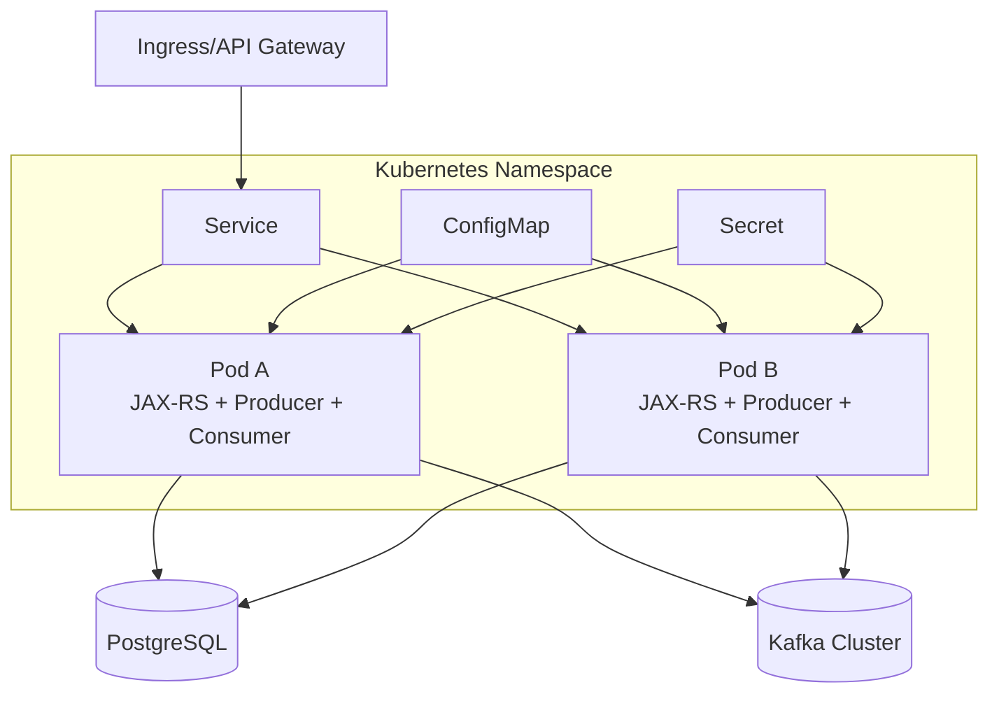
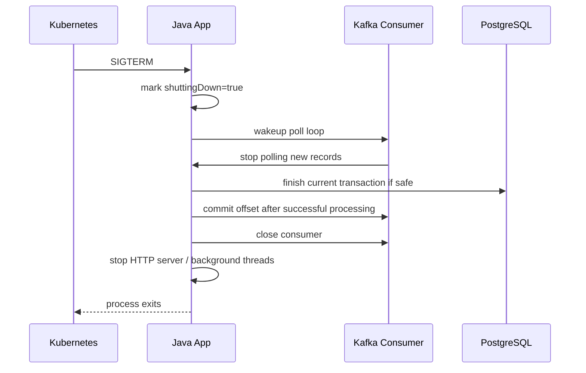
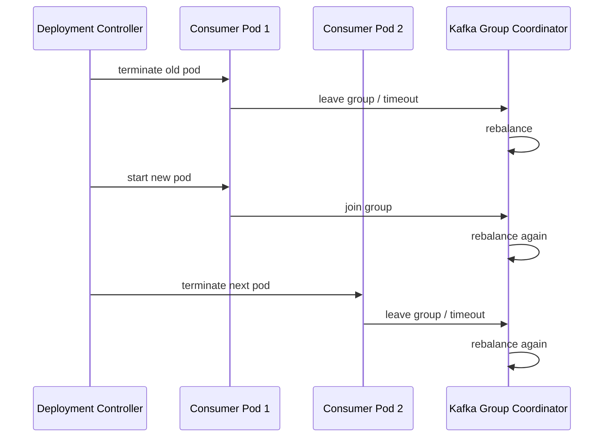

# Part 038 — Kubernetes Deployment for Kafka Clients

> Fokus part ini: men-deploy producer dan consumer Kafka berbasis Java/JAX-RS di Kubernetes secara production-safe. Kafka client di Kubernetes bukan hanya soal container bisa start, tetapi soal rebalance, graceful shutdown, offset safety, resource throttling, network policy, secret rotation, dan rollout behavior.

---

## 1. Core Mental Model

Kafka client di Kubernetes hidup dalam environment yang dinamis:

- pod bisa restart,
- pod bisa di-reschedule ke node lain,
- rollout bisa mengganti semua replica,
- HPA bisa menambah/mengurangi pod,
- node bisa drain,
- CPU bisa throttled,
- memory bisa OOMKilled,
- DNS/network bisa berubah,
- secret/config bisa dirotasi,
- readiness/liveness probe bisa membunuh pod yang sebenarnya hanya lambat sementara.

Kafka consumer group sensitif terhadap perubahan membership. Setiap pod consumer yang datang/pergi dapat memicu rebalance.

Mental model utama:

> Setiap lifecycle event Kubernetes dapat menjadi lifecycle event Kafka consumer group.

Implikasi:

- rollout bukan hanya deployment concern,
- rollout adalah ordering/lag/duplicate-processing concern,
- shutdown bukan hanya SIGTERM handling,
- shutdown adalah offset commit correctness concern,
- HPA bukan hanya scaling concern,
- HPA adalah partition-assignment dan rebalance-stability concern.

---

## 2. Typical Deployment Shape

Contoh arsitektur service Java/JAX-RS yang juga menjadi Kafka producer/consumer:



Ada dua style deployment:

1. **API + Kafka client dalam satu service**
   - JAX-RS endpoint produce event.
   - Consumer juga berjalan dalam service yang sama.
   - Lebih sederhana secara repo/deployment.
   - Bisa sulit mengatur scaling API vs consumer.

2. **API service dan consumer worker dipisah**
   - API deployment fokus request/response.
   - Consumer deployment fokus background processing.
   - Scaling lebih terkontrol.
   - Operational ownership lebih jelas.

Senior-level question:

> Apakah traffic HTTP dan throughput Kafka perlu scaling axis yang sama?

Jika tidak, pisahkan deployment.

---

## 3. Pod Lifecycle and Kafka Lifecycle

Kubernetes lifecycle yang relevan:

```text
Pending -> Running -> Ready -> Terminating -> Removed
```

Kafka client lifecycle yang relevan:

```text
start -> connect -> join group -> poll/process -> commit offset -> leave group -> close
```

Mapping risiko:

| Kubernetes Event | Kafka Impact |
|---|---|
| Pod start | consumer joins group; rebalance may occur |
| Pod becomes unready | traffic may stop, but consumer may still run unless coded otherwise |
| Pod SIGTERM | consumer must stop polling, finish/abort safely, commit if appropriate, close |
| Pod killed after grace period | in-flight processing may duplicate after reassignment |
| Pod OOMKilled | no graceful commit; duplicate likely |
| Rolling update | repeated membership changes; rebalance storm possible |
| HPA scale up/down | partition reassignment and cache/state churn |
| Node drain | multiple consumers may terminate together |

Rule:

> Treat pod termination as a normal failure path, not an exceptional path.

---

## 4. Graceful Shutdown

Graceful shutdown untuk Kafka consumer harus menjawab:

1. Bagaimana consumer berhenti menerima record baru?
2. Bagaimana in-flight record diselesaikan?
3. Kapan offset di-commit?
4. Bagaimana external resources ditutup?
5. Apa yang terjadi jika grace period habis?

Recommended flow:



Important practices:

- handle SIGTERM,
- use `consumer.wakeup()` for blocking poll loop,
- stop accepting new work,
- finish current record/batch if within budget,
- commit only successfully processed offsets,
- close producer/consumer cleanly,
- configure `terminationGracePeriodSeconds` realistically.

Bad pattern:

```text
SIGTERM -> immediately System.exit -> no close -> no final commit -> duplicate storm
```

But also avoid:

```text
SIGTERM -> wait forever -> pod stuck terminating -> rollout blocked
```

---

## 5. Termination Grace Period

`terminationGracePeriodSeconds` must align with consumer processing time.

If consumer processing can take 60 seconds but grace period is 30 seconds:

- pod may be killed mid-processing,
- DB transaction may rollback or partially complete depending on code,
- offset may not commit,
- record may be reprocessed by another pod,
- duplicate side effects can occur.

Guideline:

```text
terminationGracePeriodSeconds >= max expected safe in-flight processing time + shutdown buffer
```

But do not set it blindly high. Long grace period can slow rollout and node drain.

Better design:

- keep per-record processing bounded,
- avoid long external calls inside consumer,
- use pause/resume or async work queue carefully,
- store durable workflow state,
- make processing idempotent.

---

## 6. Readiness Probe

Readiness answers:

> Should Kubernetes send traffic to this pod?

For API producer service, readiness should check:

- app initialized,
- HTTP server ready,
- required config loaded,
- critical dependencies reachable if necessary,
- schema/serialization initialized if startup requires it.

Be careful checking Kafka broker availability in readiness:

- If Kafka is temporarily unavailable, making all API pods unready may remove the entire service from load balancing.
- If endpoint cannot operate without Kafka, failing readiness may be correct.
- If endpoint uses outbox and can still commit DB transaction, Kafka broker availability may not need to block readiness.

Correctness question:

> Can this API accept a request safely if Kafka is unavailable right now?

If using transactional outbox:

```text
HTTP request -> DB transaction inserts business row + outbox row -> later publisher sends to Kafka
```

Then API readiness should not necessarily depend on live Kafka connectivity.

If producing directly to Kafka in request path:

```text
HTTP request -> DB write -> Kafka publish synchronously
```

Then Kafka availability may be on critical path, but this design itself needs dual-write scrutiny.

---

## 7. Liveness Probe

Liveness answers:

> Should Kubernetes restart this pod because it is broken?

Do not make liveness too aggressive.

Bad liveness checks:

- fail when Kafka is slow,
- fail when consumer lag is high,
- fail when downstream API is slow,
- fail during long GC pause with too short timeout,
- fail because one background worker is temporarily backpressured.

This can create restart loops and rebalance storms.

Good liveness checks:

- JVM process is alive,
- main app event loop is not deadlocked,
- health endpoint can respond,
- fatal initialization state detected,
- unrecoverable internal state detected.

Rule:

> Liveness is for “restart can fix this pod”. It is not for “dependency is currently degraded”.

Dependency degradation belongs in readiness, metrics, alerts, or circuit breaker behavior.

---

## 8. Startup Probe

For services with slow startup, use startup probe.

Why:

- JVM warmup,
- schema registry initialization,
- Kafka metadata load,
- connection pool initialization,
- large config loading,
- migration check,
- stream state restore if Kafka Streams is embedded.

Without startup probe, liveness may kill the pod before it fully starts.

Especially for Kafka Streams or stateful consumers:

```text
state restore can take longer than normal HTTP startup
```

Do not treat state restore as liveness failure unless it is truly stuck.

---

## 9. Consumer Rebalance on Pod Restart

Rolling update can cause repeated rebalances:



Impact:

- processing pauses,
- lag increases,
- partition ownership changes,
- local caches/state are lost,
- duplicate processing can occur,
- external downstream load may spike.

Mitigations:

- cooperative rebalancing where appropriate,
- graceful shutdown,
- sensible max surge/unavailable,
- Pod Disruption Budget,
- avoid unnecessary restarts,
- avoid liveness-induced restart loops,
- separate API and consumer deployments if scaling differs.

---

## 10. Horizontal Scaling

Kafka consumer scaling is constrained by partition count.

```text
effective consumer parallelism per group <= number of partitions
```

If topic has 6 partitions:

- 1 consumer pod: one pod handles all 6 partitions,
- 3 consumer pods: each roughly handles 2 partitions,
- 6 consumer pods: each roughly handles 1 partition,
- 10 consumer pods: 4 pods idle for that topic/group.

Scaling deployment replicas beyond partition count does not increase processing parallelism for that consumer group.

For multi-topic consumers, assignment depends on total partitions and assignor behavior.

Senior-level scaling questions:

- What topic partitions does this consumer group read?
- How many replicas are deployed?
- Is processing CPU-bound, IO-bound, DB-bound, or downstream-bound?
- Is ordering required per key?
- Would increasing partitions break key-order assumptions?
- Would adding replicas overload PostgreSQL or external APIs?

---

## 11. HPA and Consumer Lag

HPA can scale based on CPU/memory or custom metrics like consumer lag.

Scaling on lag is tempting but dangerous if not bounded.

Failure scenario:

```text
consumer lag rises because PostgreSQL is slow
HPA adds more consumer pods
more pods hit PostgreSQL
PostgreSQL gets slower
lag rises further
```

This is positive feedback.

Before scaling on lag, identify bottleneck:

- CPU-bound processing: scale pods may help.
- IO-bound DB writes: scale pods may hurt.
- downstream API rate limit: scale pods may hurt.
- hot partition: scale pods will not help.
- broker/network bottleneck: scale pods may not help.
- poison event: scale pods will not help.

Safer approach:

- cap max replicas,
- use rate limiting,
- use backpressure,
- monitor DB/downstream saturation,
- include lag age, not only lag count,
- combine scaling with SLO and dependency health.

---

## 12. Resource Requests and Limits

Kafka clients are sensitive to CPU and memory.

CPU throttling can cause:

- slower polling,
- missed heartbeats,
- max poll interval violation,
- rebalance,
- producer batching delay,
- request timeout,
- higher end-to-end latency.

Memory pressure can cause:

- OOMKilled pod,
- lost in-flight processing,
- consumer group rebalance,
- producer buffer exhaustion,
- GC pause,
- RocksDB/state store issues if Kafka Streams.

Set resource requests/limits based on:

- message size,
- batch size,
- max poll records,
- processing memory,
- producer buffer memory,
- compression overhead,
- serialization/deserialization cost,
- DB result set size,
- concurrency model.

Avoid setting CPU limits too low for latency-sensitive Kafka consumers. CPU throttling can mimic consumer slowness and trigger rebalance symptoms.

---

## 13. JVM and Container Memory

In containerized Java:

- heap must fit within container memory,
- off-heap/native memory also exists,
- thread stacks consume memory,
- direct buffers consume memory,
- compression and network buffers consume memory,
- RocksDB uses native memory for Kafka Streams.

Do not set heap equal to container limit.

Example risk:

```text
container memory limit = 1024Mi
-Xmx = 1024m
native memory + threads + buffers exceed limit
pod OOMKilled
```

Better:

```text
container memory limit = 1024Mi
heap maybe 60-75% depending on workload
leave room for native/off-heap/thread/direct buffers
```

For Kafka Streams with RocksDB, be more conservative because RocksDB uses off-heap/native resources.

---

## 14. ConfigMap Strategy

Kafka client config often includes:

- bootstrap servers,
- topic names,
- consumer group ID,
- schema registry URL,
- timeout values,
- retry config,
- DLQ topic,
- security protocol,
- metrics flags.

Store non-secret config in ConfigMap, but avoid config drift.

Risks:

- staging and production topic names accidentally mixed,
- wrong consumer group ID deployed,
- retry/DLQ topic mismatch,
- partition key config changed without review,
- schema registry URL points to wrong environment,
- feature flag changes consumer behavior without rollout discipline.

Use config validation at startup:

- required topic configured,
- group ID not blank,
- bootstrap server matches environment,
- DLQ topic present if DLQ enabled,
- schema registry present if schema serializer used,
- security protocol configured.

Fail fast for invalid config. Do not run with unsafe defaults.

---

## 15. Secret Strategy

Kafka secrets may include:

- SASL username/password,
- SCRAM credentials,
- OAuth client secret,
- truststore password,
- keystore password,
- client certificate/key,
- Schema Registry credentials.

Kubernetes Secret concerns:

- RBAC access,
- namespace isolation,
- secret rotation,
- mounted file vs env var,
- reload behavior,
- audit trail,
- external secret manager integration.

Secret rotation questions:

- Does the app reload credentials without restart?
- If restart is required, will rollout trigger rebalance storm?
- Are old and new credentials valid during overlap?
- Are Schema Registry credentials rotated together?
- Are producer and consumer permissions separated?

Avoid sharing one powerful Kafka credential across many services. Use least privilege.

---

## 16. NetworkPolicy and Connectivity

Kafka clients need outbound connectivity to:

- Kafka brokers/bootstrap endpoint,
- Schema Registry,
- Kafka Connect REST API if app manages connectors, usually avoid from app,
- PostgreSQL,
- Redis,
- downstream APIs,
- observability endpoints.

NetworkPolicy should be explicit:

```text
app namespace -> kafka broker listener
app namespace -> schema registry
app namespace -> postgresql
app namespace -> redis if needed
app namespace -> telemetry collector
```

Common failures:

- bootstrap server reachable but broker advertised listener not reachable,
- DNS resolves differently inside cluster,
- TLS certificate hostname does not match advertised broker name,
- firewall allows port to bootstrap but not all brokers,
- NetworkPolicy blocks Schema Registry,
- egress proxy breaks Kafka protocol,
- cross-zone network latency increases producer timeout.

Kafka connectivity test must verify metadata path, not only TCP connect to bootstrap.

---

## 17. DNS and Service Discovery

Kafka clients first connect to bootstrap server, then receive broker metadata containing advertised listeners.

If advertised listener is wrong from pod perspective:

```text
bootstrap succeeds
metadata returns broker.internal.local
pod cannot resolve broker.internal.local
client fails after bootstrap
```

This is why advertised listener issues are common in Kubernetes/hybrid setups.

Checklist:

- Can pod resolve bootstrap DNS?
- Can pod connect to bootstrap port?
- Can pod resolve each advertised broker hostname?
- Can pod connect to each advertised broker port?
- Does TLS certificate match broker hostname?
- Is client using internal listener from inside cluster and external listener from outside?

Do not rely only on `nc bootstrap 9092`. That does not prove Kafka metadata connectivity works.

---

## 18. Rolling Update Strategy

For consumer deployments, rolling update settings affect group stability.

Consider:

```yaml
strategy:
  type: RollingUpdate
  rollingUpdate:
    maxUnavailable: 1
    maxSurge: 1
```

Trade-off:

- Higher surge can add consumers and trigger rebalance.
- Higher unavailable can reduce capacity and increase lag.
- Slow rollout may be safer for critical consumers.
- Fast rollout may create repeated rebalances and lag spikes.

For consumers with long processing time:

- ensure graceful shutdown,
- set termination grace period,
- monitor lag during rollout,
- deploy off-peak if necessary,
- avoid concurrent rollout of many consumer groups that hit same DB/downstream.

For API-only producer deployment:

- readiness matters more,
- ensure producer flush/close on shutdown,
- avoid dropping in-flight HTTP requests,
- confirm outbox behavior if Kafka unavailable.

---

## 19. Pod Disruption Budget

Pod Disruption Budget helps avoid too many voluntary disruptions.

Example:

```yaml
apiVersion: policy/v1
kind: PodDisruptionBudget
metadata:
  name: order-consumer-pdb
spec:
  minAvailable: 2
  selector:
    matchLabels:
      app: order-consumer
```

PDB helps during:

- node drain,
- cluster upgrade,
- voluntary disruption,
- maintenance.

PDB does not protect against:

- OOMKilled pods,
- node crash,
- app crash loop,
- forced deletion,
- insufficient cluster capacity.

Set PDB based on:

- minimum processing capacity,
- partition count,
- customer impact of lag,
- replica count,
- multi-AZ/node distribution.

---

## 20. Readiness and Consumer Workers

If a pod has both API and consumer worker, readiness can be tricky.

Question:

> Does readiness control HTTP traffic only, or should it also reflect consumer worker health?

Kubernetes Service readiness mainly controls service endpoints for inbound traffic. It does not automatically stop Kafka consumption.

If consumer worker becomes unhealthy but HTTP is fine:

- readiness may remain true,
- consumer is still broken,
- lag grows silently unless metrics/alerts exist.

If HTTP is unhealthy but consumer is fine:

- readiness may become false,
- pod stops receiving HTTP traffic,
- consumer may continue processing unless app stops it.

This is another reason to separate API and consumer deployments when operational concerns differ.

---

## 21. Producer Shutdown

Producer services need shutdown discipline too.

On shutdown:

- stop accepting new HTTP requests,
- finish in-flight requests if possible,
- flush producer if direct producer is used,
- close producer with timeout,
- avoid infinite flush blocking,
- record publish failures clearly.

If using outbox:

- API request commits DB/outbox,
- publisher worker may be in same pod or separate pod,
- publisher must mark publish status safely,
- shutdown should not mark event published before Kafka ack.

Producer close concern:

```text
send async -> app exits before callback -> event may not be published
```

Mitigation:

- do not fire-and-forget without lifecycle management,
- track futures/callbacks,
- flush on controlled shutdown,
- prefer outbox for business-critical events.

---

## 22. Consumer Batch Size and Kubernetes

Kafka consumer config interacts with pod lifecycle:

- `max.poll.records`,
- `max.poll.interval.ms`,
- `session.timeout.ms`,
- `heartbeat.interval.ms`,
- fetch size,
- processing concurrency.

If `max.poll.records` is high and each record takes time:

```text
batch processing time > max.poll.interval.ms -> consumer considered stuck -> rebalance
```

In Kubernetes, CPU throttling can make this worse.

Guideline:

```text
max.poll.records * worst-case per-record processing time < max.poll.interval.ms with buffer
```

If processing is slow:

- reduce max poll records,
- increase max poll interval carefully,
- pause partitions while processing,
- use bounded worker pool carefully,
- commit offsets only after completed processing,
- move long-running work to workflow/job system.

---

## 23. Backpressure in Kubernetes

Backpressure should be explicit.

Consumer can use:

- pause/resume,
- bounded executor queue,
- rate limiter,
- DB connection pool limit,
- downstream circuit breaker,
- retry topic instead of busy loop,
- max poll records tuning.

Avoid unbounded internal queues:

```text
poll records fast -> enqueue unbounded -> memory grows -> OOMKilled -> rebalance -> duplicate processing
```

A healthy consumer should prefer slowing down over accumulating unbounded memory.

Backpressure observability:

- executor queue depth,
- pause duration,
- DB pool saturation,
- downstream latency,
- consumer processing latency,
- consumer lag age,
- retry topic throughput,
- DLQ rate.

---

## 24. Multi-Container and Sidecar Concerns

Some deployments use sidecars for:

- service mesh proxy,
- log collector,
- certificate agent,
- secret agent,
- telemetry collector.

Kafka protocol may be affected by:

- mTLS interception,
- proxy timeout,
- DNS rewriting,
- connection pooling assumptions,
- large message transfer,
- long-lived TCP connections,
- broker metadata with multiple hostnames.

If service mesh is used, verify:

- Kafka protocol compatibility,
- outbound port exclusions if needed,
- TLS passthrough vs termination,
- DNS behavior,
- connection idle timeout,
- metrics visibility.

Do not assume HTTP mesh behavior applies cleanly to Kafka TCP clients.

---

## 25. Observability for Kafka Clients in Kubernetes

Minimum metrics to expose per deployment:

Producer:

- send rate,
- error rate,
- retry rate,
- request latency,
- record queue time,
- batch size,
- buffer available bytes,
- metadata age,
- serialization failure count.

Consumer:

- records consumed rate,
- processing latency,
- poll latency,
- commit latency,
- lag by partition,
- lag age,
- rebalance count,
- assigned partitions,
- duplicate/idempotency conflict count,
- DLQ publish count.

Kubernetes:

- pod restarts,
- OOMKilled count,
- CPU throttling,
- memory working set,
- rollout status,
- node disruption,
- readiness/liveness failures,
- termination duration.

Golden correlation:

```text
consumer lag spike + pod restarts + CPU throttling + rebalance count
```

This usually means deployment/runtime issue, not Kafka broker issue.

---

## 26. Example Deployment Skeleton

Illustrative only. Adjust to internal platform standards.

```yaml
apiVersion: apps/v1
kind: Deployment
metadata:
  name: order-consumer
spec:
  replicas: 3
  strategy:
    type: RollingUpdate
    rollingUpdate:
      maxUnavailable: 1
      maxSurge: 1
  selector:
    matchLabels:
      app: order-consumer
  template:
    metadata:
      labels:
        app: order-consumer
    spec:
      terminationGracePeriodSeconds: 90
      containers:
        - name: app
          image: example/order-consumer:1.0.0
          ports:
            - containerPort: 8080
          envFrom:
            - configMapRef:
                name: order-consumer-config
            - secretRef:
                name: order-consumer-secrets
          resources:
            requests:
              cpu: "500m"
              memory: "768Mi"
            limits:
              memory: "1024Mi"
          startupProbe:
            httpGet:
              path: /health/startup
              port: 8080
            failureThreshold: 30
            periodSeconds: 5
          readinessProbe:
            httpGet:
              path: /health/ready
              port: 8080
            periodSeconds: 10
            timeoutSeconds: 2
          livenessProbe:
            httpGet:
              path: /health/live
              port: 8080
            periodSeconds: 20
            timeoutSeconds: 2
```

Notes:

- CPU limit intentionally omitted in this example to avoid accidental throttling; follow internal standards.
- Memory limit remains important.
- Startup/readiness/liveness must reflect actual app behavior.
- Termination grace must align with consumer processing time.

---

## 27. Common Kubernetes Failure Modes

### 27.1 Rebalance Storm During Rollout

Symptoms:

- lag spike,
- repeated partition revocation/assignment logs,
- high rebalance count,
- processing pauses,
- duplicate processing.

Likely causes:

- too many pods restarted together,
- short session timeout,
- aggressive liveness probe,
- slow shutdown,
- CPU throttling,
- HPA flapping.

### 27.2 Consumer OOMKilled

Symptoms:

- pod restart reason OOMKilled,
- lag spike,
- duplicate processing,
- large heap/GC logs,
- unbounded internal queue.

Likely causes:

- max poll records too high,
- batch payload too large,
- unbounded worker queue,
- memory limit too low,
- heap too close to container limit,
- leak in event handler.

### 27.3 Readiness Misconfiguration

Symptoms:

- pod removed from service unexpectedly,
- deployment never becomes ready,
- API unavailable during Kafka outage,
- readiness flaps.

Likely causes:

- readiness depends on non-critical Kafka dependency,
- readiness timeout too low,
- startup time confused with readiness,
- DB/Kafka transient latency treated as unready.

### 27.4 Liveness Misconfiguration

Symptoms:

- restart loop,
- rebalance storm,
- lag worsens after restart,
- no real app deadlock.

Likely causes:

- liveness checks dependency health,
- timeout too aggressive,
- GC pause,
- CPU throttling.

### 27.5 NetworkPolicy Blocks Broker Metadata Path

Symptoms:

- bootstrap connects,
- produce/consume fails,
- logs show broker hostname unreachable,
- TLS hostname mismatch.

Likely causes:

- advertised listener unreachable,
- DNS not resolvable from pod,
- NetworkPolicy allows bootstrap only,
- security group/firewall incomplete.

---

## 28. Production-Safe Rollout Checklist

Before rollout:

- Check current consumer lag.
- Check DLQ rate.
- Check DB/downstream health.
- Confirm replicas vs partitions.
- Confirm PDB exists for critical consumers.
- Confirm termination grace period.
- Confirm graceful shutdown logs in previous rollout.
- Confirm no active incident.

During rollout:

- Watch pod restarts.
- Watch consumer rebalance count.
- Watch lag and lag age.
- Watch processing latency.
- Watch DB pool saturation.
- Watch DLQ/retry topic.
- Watch error rate.

After rollout:

- Confirm lag returns to normal.
- Confirm no DLQ spike.
- Confirm no duplicate/idempotency conflict spike beyond expected.
- Confirm all pods stable.
- Confirm deployment version matches expected.
- Confirm traces/logs show healthy processing.

---

## 29. Internal Verification Checklist

Verify inside CSG/team:

- Are Kafka consumers deployed with API service or separate worker deployment?
- What Kubernetes manifests/Helm charts/GitOps repo define Kafka clients?
- What is the standard graceful shutdown implementation?
- Is `terminationGracePeriodSeconds` standardized?
- Are readiness/liveness/startup probes defined consistently?
- Are CPU limits allowed or avoided for Kafka consumers?
- What resource requests are typical for Java Kafka services?
- Are HPA rules based on CPU, memory, lag, or custom metrics?
- Is there a Pod Disruption Budget for critical consumers?
- What is the rollout strategy for high-throughput consumers?
- Are Kafka credentials mounted as env vars, files, or external secret provider?
- How is secret/certificate rotation handled?
- Are NetworkPolicy rules required for Kafka broker and Schema Registry?
- Can pods resolve and reach all advertised broker listeners?
- Are consumer lag, rebalance count, pod restart, and CPU throttling visible in one dashboard?
- Are there incident notes for rebalance storm, OOMKilled consumer, or rollout-induced lag?
- Who owns Kubernetes deployment standards: backend team, platform team, or SRE?

---

## 30. PR Review Checklist

When reviewing Kubernetes deployment changes for Kafka clients, ask:

- Does this service produce, consume, or both?
- Should API and consumer be separate deployments?
- Does replica count align with partition count?
- Is graceful shutdown implemented and tested?
- Is termination grace period realistic?
- Are readiness/liveness/startup probes correct?
- Could liveness cause restart loop during dependency degradation?
- Could rollout cause rebalance storm?
- Is PDB configured for critical consumers?
- Are resource requests/limits appropriate?
- Could CPU throttling cause poll/heartbeat issues?
- Is heap sized safely below memory limit?
- Are ConfigMap values environment-safe?
- Are secrets least-privilege and rotation-ready?
- Are NetworkPolicy/DNS/TLS paths verified?
- Are metrics and alerts deployed with the service?
- Is rollback safe if schema/topic/config changed too?

---

## 31. Summary

Deploying Kafka clients on Kubernetes is not just packaging Java code into a container.

You must reason about:

- pod lifecycle,
- consumer group lifecycle,
- graceful shutdown,
- offset commit safety,
- producer flush safety,
- readiness/liveness semantics,
- rollout-induced rebalance,
- partition count vs replicas,
- HPA feedback loops,
- CPU throttling,
- memory pressure,
- network policy,
- DNS/advertised listener,
- secret rotation,
- observability.

The senior-level stance:

> A Kafka consumer deployment is production-ready only when Kubernetes lifecycle behavior has been mapped to Kafka processing semantics and failure recovery is observable, bounded, and idempotent.
