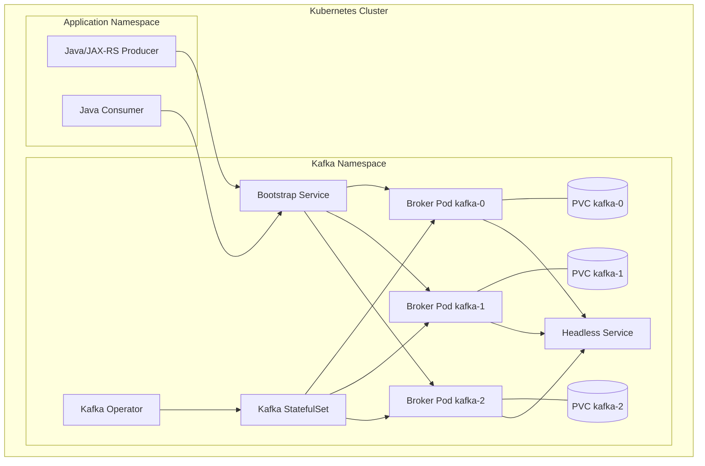
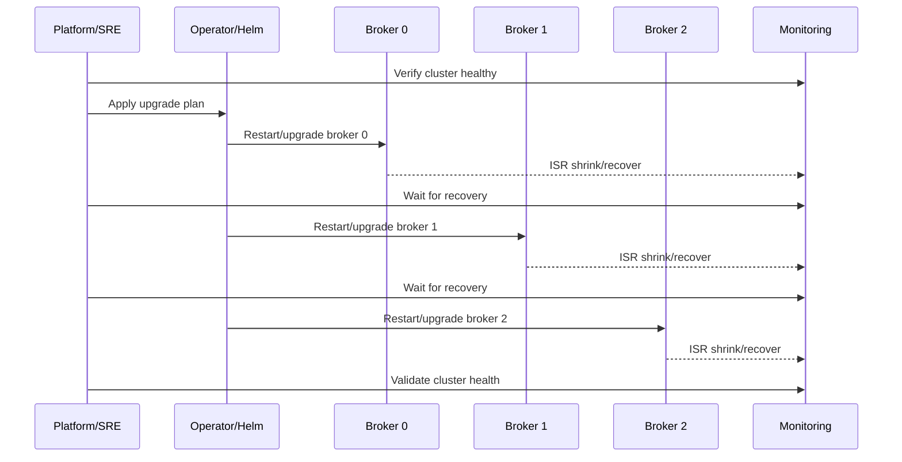
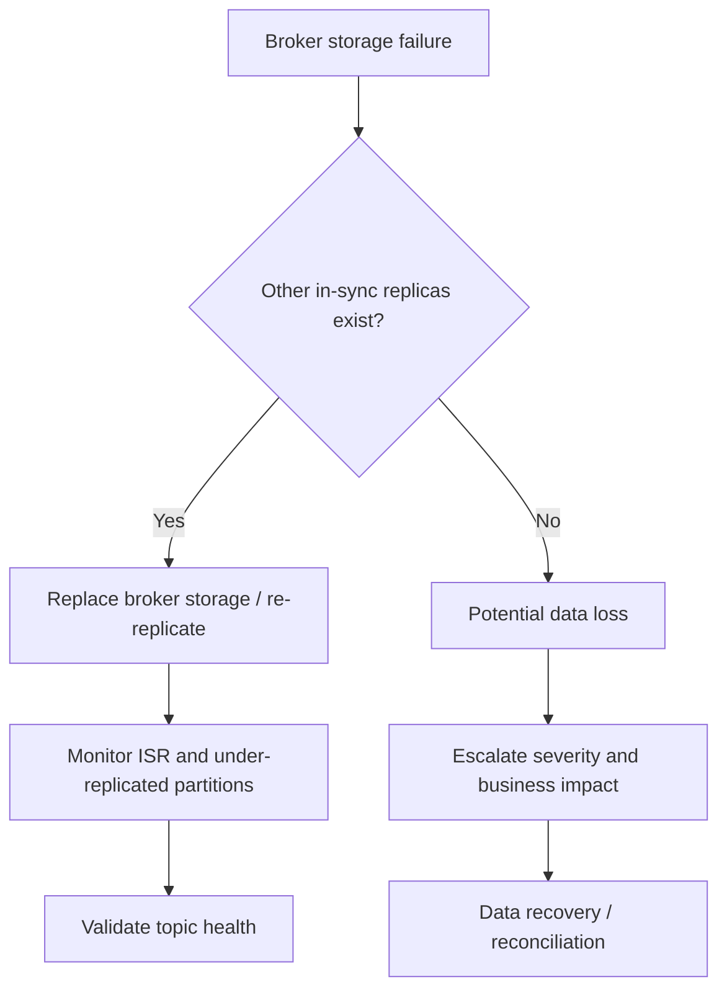
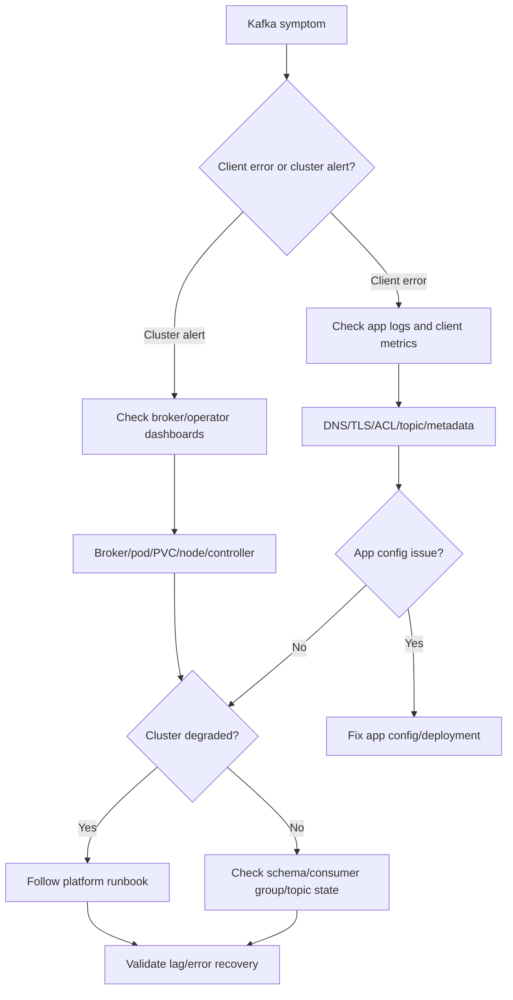

# Part 039 — Kafka Cluster in Kubernetes

> Fokus part ini: memahami Kafka sebagai **stateful distributed system** ketika dijalankan di Kubernetes. Ini bukan materi “cara install Kafka pakai Helm”. Ini adalah mental model untuk menilai apakah deployment Kafka di Kubernetes aman secara storage, identity, quorum, networking, upgrade, observability, dan failure recovery.

---

## 1. Core Mental Model

Kafka cluster di Kubernetes berbeda dari aplikasi stateless Java/JAX-RS.

Service Java biasa bisa diperlakukan sebagai unit yang mudah diganti:

- pod mati → pod baru dibuat,
- image diganti → rollout,
- node drain → reschedule,
- replica bertambah → load terbagi.

Kafka broker tidak sesederhana itu.

Kafka broker memiliki state penting:

- broker identity,
- partition data,
- local log segment,
- replication role,
- controller metadata,
- quorum participation,
- listener identity,
- persistent storage,
- disk locality,
- network reachability.

Mental model utama:

> Kafka di Kubernetes adalah stateful distributed storage system yang kebetulan berjalan sebagai pod.

Implikasinya:

- pod restart bisa berarti broker restart,
- node failure bisa berarti broker availability event,
- volume detach/attach bisa menjadi recovery bottleneck,
- storage latency bisa menjadi broker latency,
- advertised listener salah bisa membuat client tidak bisa connect,
- rolling upgrade salah bisa menyebabkan ISR shrink,
- anti-affinity salah bisa menaruh banyak broker di node yang sama,
- resource throttling bisa memicu broker instability,
- operator automation bisa membantu, tetapi juga bisa menyembunyikan risiko.

---

## 2. Kafka in Kubernetes: High-Level Shape

Typical deployment Kafka di Kubernetes:



Kubernetes objects yang biasanya relevan:

- `StatefulSet` untuk broker identity stabil,
- `PersistentVolumeClaim` untuk broker data,
- `StorageClass` untuk disk behavior,
- `Headless Service` untuk stable DNS per broker,
- bootstrap service untuk client discovery,
- `Secret` untuk TLS/SASL credential,
- `ConfigMap` atau custom resource untuk broker config,
- `PodDisruptionBudget` untuk mencegah eviction massal,
- anti-affinity/topology spread constraints untuk distribusi broker,
- operator custom resource jika memakai Strimzi/Confluent Operator.

---

## 3. Running Kafka in Kubernetes Is a Responsibility Decision

Sebelum membahas manifest, pertanyaan pertama bukan “pakai Helm chart apa?”

Pertanyaan pertama:

> Apakah organisasi siap mengoperasikan Kafka sebagai stateful distributed system?

Kafka cluster membutuhkan ownership untuk:

- capacity planning,
- broker upgrade,
- disk replacement,
- certificate rotation,
- ACL lifecycle,
- topic governance,
- partition reassignment,
- recovery after broker failure,
- metrics and alerting,
- backup/replication strategy,
- DR testing,
- incident response,
- security hardening,
- client connectivity.

Untuk tim backend Java/JAX-RS, ini berarti:

- jangan menganggap Kafka cluster sebagai “infrastructure black box” sepenuhnya,
- pahami failure signal yang memengaruhi producer/consumer,
- tahu kapan masalah ada di aplikasi vs cluster,
- tahu siapa owner cluster dan escalation path,
- tahu batas tanggung jawab backend vs platform/SRE.

---

## 4. StatefulSet: Why Kafka Usually Uses It

Kafka broker membutuhkan identity yang stabil.

`StatefulSet` memberi:

- pod name stabil: `kafka-0`, `kafka-1`, `kafka-2`,
- network identity stabil,
- volume claim stabil per pod,
- ordered startup/shutdown behavior jika dikonfigurasi,
- mapping broker identity ke storage.

Tanpa identity stabil, broker dapat kehilangan hubungan dengan:

- broker ID,
- data directory,
- advertised listener,
- replication assignment,
- metadata quorum role,
- certificates jika cert dibuat per broker identity.

Contoh pola identity:

```text
Pod:       kafka-0
Broker ID: 0
PVC:       data-kafka-0
DNS:       kafka-0.kafka-brokers.kafka.svc.cluster.local
```

Failure mode jika identity tidak stabil:

- broker dianggap broker baru,
- partition leadership kacau,
- replica recovery berat,
- client metadata stale,
- operator melakukan reconciliation tidak terduga,
- cluster masuk degraded state.

---

## 5. PersistentVolume: Kafka Data Lives on Disk

Kafka bukan hanya memory queue. Kafka menyimpan log segment di disk.

Disk Kafka berisi:

- topic partition log,
- segment file,
- index file,
- time index,
- producer state snapshot,
- transaction state jika transaksi digunakan,
- metadata/quorum data tergantung mode deployment,
- local state yang dibutuhkan broker untuk recovery.

PersistentVolume harus diperlakukan sebagai komponen kritis.

Hal yang perlu dinilai:

- latency disk,
- throughput disk,
- IOPS,
- durability,
- volume attach/detach time,
- reclaim policy,
- expansion support,
- zone binding,
- snapshot policy,
- performance under compaction,
- behavior saat node failure.

Mental model:

> Kafka performance sering kali adalah disk performance yang terlihat sebagai broker latency.

---

## 6. StorageClass: Small Config, Large Consequence

`StorageClass` menentukan karakteristik disk.

Contoh aspek penting:

- provisioner,
- volume type,
- replication/durability level,
- zone awareness,
- binding mode,
- expansion support,
- reclaim policy,
- filesystem,
- mount options.

Pertanyaan review:

- Apakah disk lokal atau network-attached?
- Apakah latency stabil saat throughput tinggi?
- Apakah disk bisa resize online?
- Apakah PVC terikat ke zone tertentu?
- Apakah broker pod selalu bisa dijadwalkan ulang ke zone volume?
- Apa yang terjadi jika node mati tetapi volume masih attached?
- Apakah reclaim policy bisa menghapus data Kafka secara tidak sengaja?

Failure mode:

- broker stuck `Pending` karena volume zone mismatch,
- broker lama recovery karena attach/detach lambat,
- disk latency tinggi → produce latency naik,
- disk full → broker unstable,
- compaction backlog → IO pressure,
- storage throttling → ISR shrink,
- accidental PVC deletion → data loss.

---

## 7. Broker Identity

Broker identity adalah invariant besar.

Kafka membutuhkan broker identity untuk:

- metadata cluster,
- replica placement,
- partition leadership,
- client metadata,
- inter-broker communication,
- ACL/certificate mapping jika relevant,
- controller/quorum state.

Di Kubernetes, broker identity biasanya berasal dari:

- StatefulSet ordinal,
- pod name,
- generated broker ID,
- operator-managed configuration,
- broker certificate subject/SAN,
- advertised listener host.

Contoh mapping:

```text
StatefulSet ordinal: 1
Pod name:            kafka-1
Broker ID:           1
Internal DNS:         kafka-1.kafka-brokers.kafka.svc
PVC:                 data-kafka-1
Certificate SAN:      kafka-1.kafka-brokers.kafka.svc
```

Jika mapping ini rusak, cluster bisa terlihat hidup tetapi tidak sehat.

Gejala:

- broker join sebagai ID berbeda,
- duplicate broker identity,
- client metadata error,
- TLS hostname verification failure,
- partition remains offline,
- controller logs metadata inconsistency.

---

## 8. Headless Service and Broker DNS

Kafka client tidak hanya connect ke bootstrap server.

Alur client:

1. client connect ke bootstrap server,
2. bootstrap server mengembalikan metadata broker,
3. client connect langsung ke broker yang menjadi leader partition,
4. client terus memakai advertised listener broker.

Karena itu, DNS broker harus valid dari sisi client.

Di Kubernetes, broker DNS biasanya memakai headless service:

```text
kafka-0.kafka-brokers.kafka.svc.cluster.local
kafka-1.kafka-brokers.kafka.svc.cluster.local
kafka-2.kafka-brokers.kafka.svc.cluster.local
```

Failure mode umum:

- bootstrap berhasil tetapi produce gagal,
- metadata mengembalikan hostname yang tidak resolvable,
- advertised listener mengarah ke internal DNS yang tidak bisa diakses client eksternal,
- TLS certificate tidak cocok dengan advertised hostname,
- network policy mengizinkan bootstrap service tetapi memblokir direct broker traffic.

Debugging direction:

- dari pod aplikasi, resolve broker DNS,
- test TCP ke broker listener,
- cek advertised listener di metadata,
- cek certificate SAN,
- cek NetworkPolicy,
- cek service dan endpoint.

---

## 9. Listener and Advertised Listener in Kubernetes

Kafka listener adalah endpoint tempat broker menerima koneksi.

Advertised listener adalah endpoint yang diberitahukan Kafka kepada client.

Ini sering menjadi sumber incident.

Contoh listener internal:

```text
LISTENERS=INTERNAL://0.0.0.0:9092
ADVERTISED_LISTENERS=INTERNAL://kafka-0.kafka-brokers.kafka.svc:9092
```

Untuk external access, bisa ada listener berbeda:

```text
LISTENERS=INTERNAL://0.0.0.0:9092,EXTERNAL://0.0.0.0:9094
ADVERTISED_LISTENERS=INTERNAL://kafka-0.kafka-brokers.kafka.svc:9092,EXTERNAL://broker-0.kafka.example.com:9094
```

Trade-off:

| Model | Cocok Untuk | Risiko |
|---|---|---|
| Internal-only listener | aplikasi dalam cluster | tidak bisa dipakai external client |
| NodePort | simple external access | port management, node dependency |
| LoadBalancer per broker | external access jelas | mahal, operational overhead |
| Ingress TCP/proxy | centralized entry | Kafka metadata complexity |
| Private endpoint | enterprise cloud | DNS/routing/cert complexity |

Prinsip:

> Bootstrap address boleh satu, tetapi advertised broker address harus reachable satu per satu oleh client.

---

## 10. Pod Anti-Affinity

Kafka replication factor tidak berguna penuh jika semua broker berada di node yang sama.

Anti-affinity mencegah broker terkonsentrasi.

Target ideal:

- broker tersebar antar node,
- broker tersebar antar zone,
- replica partition tidak berada di failure domain yang sama,
- controller/quorum node tidak berada di satu node/zone.

Contoh intent:

```yaml
podAntiAffinity:
  requiredDuringSchedulingIgnoredDuringExecution:
    - labelSelector:
        matchLabels:
          app: kafka
      topologyKey: kubernetes.io/hostname
```

Untuk multi-zone:

```yaml
topologySpreadConstraints:
  - maxSkew: 1
    topologyKey: topology.kubernetes.io/zone
    whenUnsatisfiable: DoNotSchedule
    labelSelector:
      matchLabels:
        app: kafka
```

Failure mode jika anti-affinity lemah:

- satu node mati → banyak broker mati,
- replication factor terlihat aman tetapi secara fisik tidak aman,
- maintenance node menyebabkan outage,
- ISR shrink massal,
- partition offline.

---

## 11. Rack Awareness

Rack awareness memberi Kafka informasi failure domain.

Di Kubernetes, rack bisa dipetakan ke:

- availability zone,
- node label,
- rack label,
- topology domain.

Tujuan:

- replica tersebar antar failure domain,
- broker leadership tidak terkonsentrasi,
- failure satu zone tidak menghapus semua replica partition,
- DR/multi-AZ behavior lebih predictable.

Contoh konsep:

```text
broker kafka-0 -> rack az-a
broker kafka-1 -> rack az-b
broker kafka-2 -> rack az-c
```

Review concern:

- Apakah broker punya rack label yang benar?
- Apakah topic replica benar-benar tersebar?
- Apakah operator mengatur broker rack automatically?
- Apakah client cross-zone traffic cost diperhitungkan?
- Apakah partition leadership balanced antar zone?

---

## 12. Replication Factor and min.insync.replicas

Kafka cluster availability tidak hanya broker count.

Kombinasi penting:

- replication factor,
- `min.insync.replicas`,
- producer `acks`,
- broker availability,
- partition leadership.

Contoh common production setup:

```text
replication.factor = 3
min.insync.replicas = 2
producer.acks = all
```

Meaning:

- setiap partition punya 3 replica,
- produce dianggap sukses jika minimal 2 ISR menerima write,
- jika terlalu banyak broker gagal, produce gagal daripada silently losing durability.

Trade-off:

| Setting | Benefit | Risk |
|---|---|---|
| RF=1 | murah, simple | data loss tinggi |
| RF=2 | lebih aman | toleransi failure terbatas |
| RF=3 | standard production | storage lebih besar |
| min ISR=1 | availability tinggi | durability rendah |
| min ISR=2 | durability lebih baik | produce bisa gagal saat degraded |

Senior engineer harus paham:

> Produce failure saat cluster degraded bisa menjadi desain yang benar, bukan bug.

---

## 13. Controller and Metadata Quorum

Kafka modern menggunakan KRaft, bukan ZooKeeper, untuk metadata quorum.

Dalam deployment Kubernetes, perlu memahami:

- controller role,
- broker role,
- combined broker/controller mode,
- dedicated controller nodes,
- quorum size,
- metadata log,
- controller availability.

Pattern:

| Pattern | Description | Trade-off |
|---|---|---|
| Combined broker/controller | broker juga menjadi controller | simple, cocok cluster kecil |
| Dedicated controller | controller terpisah dari broker data | isolation lebih baik, operational lebih kompleks |

Failure mode:

- quorum lost → metadata operation gagal,
- topic creation/deletion stuck,
- partition leadership election terganggu,
- broker join/leave bermasalah,
- controller logs penuh error.

Internal verification:

- apakah cluster memakai KRaft atau ZooKeeper legacy,
- berapa controller quorum size,
- apakah controller pod tersebar antar node/zone,
- apakah monitoring mencakup controller metrics.

---

## 14. ZooKeeper Legacy Awareness

Beberapa cluster lama masih memakai ZooKeeper.

Jika ada ZooKeeper:

- ZooKeeper adalah dependency kritis,
- ZooKeeper ensemble juga perlu storage, quorum, backup, monitoring,
- broker metadata bergantung pada ZooKeeper,
- upgrade path ke KRaft harus direncanakan hati-hati.

Failure mode:

- ZooKeeper quorum lost,
- session expiration,
- broker disconnect dari ZooKeeper,
- controller election storm,
- metadata operation delay,
- split operational ownership antara Kafka dan ZooKeeper.

Checklist:

- Cek apakah Kafka cluster masih ZooKeeper-based.
- Cek ZooKeeper ensemble size.
- Cek storage dan anti-affinity ZooKeeper.
- Cek migration plan ke KRaft jika relevan.
- Cek incident history ZooKeeper.

---

## 15. Operator Pattern

Operator mengelola Kafka sebagai custom resource.

Operator bisa mengotomasi:

- broker creation,
- listener config,
- certificate generation,
- rolling upgrade,
- topic/user management,
- rebalance integration,
- config reconciliation,
- status reporting,
- scaling,
- storage expansion tergantung platform.

Common options:

- Strimzi,
- Confluent Operator,
- vendor-specific operator,
- Helm chart tanpa operator,
- internal platform abstraction.

Mental model:

> Operator mengurangi manual work, tetapi tidak menghapus kebutuhan memahami Kafka failure model.

Operator risk:

- reconciliation mengubah config saat tidak diharapkan,
- CRD version mismatch,
- operator upgrade bug,
- rolling restart otomatis saat config berubah,
- certificate rotation memicu client outage,
- default config tidak cocok production,
- hidden resource naming convention.

---

## 16. Strimzi Awareness If Used

Jika environment memakai Strimzi, konsep yang perlu dikenali:

- `Kafka` custom resource,
- `KafkaTopic`,
- `KafkaUser`,
- entity operator,
- user operator,
- topic operator,
- cluster operator,
- listener configuration,
- TLS certificates,
- Cruise Control integration jika digunakan,
- KafkaRebalance jika digunakan,
- storage configuration,
- rack awareness.

Review concern:

- Apakah topic dikelola via `KafkaTopic` atau auto-create/manual CLI?
- Apakah user/ACL dikelola via `KafkaUser`?
- Apakah operator punya permission terlalu besar?
- Apakah Kafka CR berada di GitOps repo?
- Apakah perubahan CR memicu rolling restart?
- Apakah certificate rotation sudah diuji?

Internal verification checklist:

- Cek apakah Strimzi digunakan.
- Cek versi Strimzi.
- Cek CRD dan custom resource utama.
- Cek topic/user management model.
- Cek operator logs saat incident.

---

## 17. Confluent Operator Awareness If Used

Jika memakai Confluent Operator, area yang perlu dicek:

- Confluent Platform component lifecycle,
- Kafka broker CR,
- Schema Registry CR,
- Kafka Connect CR,
- ksqlDB CR,
- Control Center jika digunakan,
- license/enterprise feature dependency,
- RBAC/ACL integration,
- TLS/SASL configuration,
- rolling upgrade workflow.

Concern:

- vendor-specific abstraction bisa memudahkan operasi,
- tetapi harus paham mapping ke Kafka native concepts,
- jangan mereview hanya di level CR tanpa memahami broker effect.

Internal verification checklist:

- Cek apakah Confluent Operator digunakan.
- Cek komponen Confluent apa saja yang aktif.
- Cek Schema Registry/Connect/ksqlDB dependency.
- Cek license/upgrade constraint.
- Cek operational runbook dari platform team.

---

## 18. Helm Chart Awareness If Used

Helm chart sering dipakai untuk bootstrap Kafka, tetapi chart bukan operator penuh.

Risiko Helm-only deployment:

- upgrade perlu hati-hati,
- value drift,
- manual topic/user management,
- kurang reconciliation intelligence,
- default values mungkin tidak production-safe,
- storage/anti-affinity defaults perlu dicek,
- secret rotation bisa manual.

Review checklist:

- Cek chart source dan version.
- Cek `values.yaml` production override.
- Cek resource request/limit.
- Cek persistence enabled.
- Cek anti-affinity.
- Cek listener config.
- Cek upgrade notes.
- Cek apakah Helm state sinkron dengan GitOps.

---

## 19. Broker Restart

Broker restart bisa terjadi karena:

- rolling deployment,
- config change,
- node drain,
- pod eviction,
- OOMKill,
- liveness probe failure,
- certificate rotation,
- operator reconciliation,
- manual restart,
- host/storage issue.

Kafka seharusnya bisa tolerate broker restart jika:

- replication factor cukup,
- ISR sehat,
- min ISR compatible,
- restart dilakukan satu per satu,
- controller/quorum tetap sehat,
- disk masih valid,
- recovery tidak terlalu lama,
- client retry config benar.

Failure mode saat restart:

- leader election latency naik,
- producer request timeout,
- consumer fetch error sementara,
- ISR shrink,
- under-replicated partition,
- offline partition jika replica tidak cukup,
- controller load meningkat,
- rebalance indirectly jika client app juga restart.

Operational rule:

> Jangan restart broker massal tanpa melihat ISR, controller health, disk pressure, dan client impact.

---

## 20. Rolling Upgrade

Rolling upgrade Kafka harus menjaga cluster tetap available.

Area review:

- version compatibility,
- inter-broker protocol version,
- metadata version,
- client compatibility,
- Schema Registry/Connect/Streams compatibility,
- operator version,
- CRD compatibility,
- rollback feasibility,
- canary/maintenance window,
- monitoring selama upgrade.

Simplified flow:



Do not proceed if:

- under-replicated partitions exist before upgrade,
- disk is near full,
- controller unstable,
- one broker is already down,
- replication lag high,
- client error rate already elevated,
- there is no rollback plan.

---

## 21. Resource Requests and Limits for Brokers

Kafka broker needs predictable CPU, memory, disk, and network.

Kubernetes resource concerns:

- CPU throttling can increase latency,
- memory pressure can OOM broker,
- disk pressure can destabilize node,
- network bandwidth can cap throughput,
- noisy neighbors can affect broker IO,
- too-low request can schedule broker onto weak nodes,
- too-tight limit can create artificial instability.

Broker resource planning should consider:

- producer ingress throughput,
- consumer egress throughput,
- replication traffic,
- compaction workload,
- controller workload,
- page cache behavior,
- TLS overhead,
- compression/decompression overhead,
- number of partitions.

For backend engineers:

- high producer latency may come from broker CPU/disk/network,
- consumer lag may come from broker fetch latency,
- retry storm may amplify broker pressure,
- client metrics and broker metrics must be correlated.

---

## 22. Disk Full Failure

Disk full is one of the most dangerous Kafka cluster incidents.

Causes:

- retention too long,
- topic volume growth,
- compaction backlog,
- replication backlog,
- DLQ spike,
- CDC burst,
- audit topic unexpected growth,
- logs stored on same disk,
- PVC not expanded,
- under-estimated high-volume topic.

Effects:

- broker rejects writes,
- broker crashes or becomes unstable,
- partitions offline,
- producers fail,
- consumer lag increases,
- cluster recovery becomes harder.

Prevention:

- disk usage alert,
- growth rate alert,
- retention review,
- topic-level volume dashboard,
- DLQ monitoring,
- capacity planning,
- PVC expansion runbook,
- emergency retention change procedure.

Never blindly delete Kafka files manually unless platform runbook explicitly says so.

---

## 23. Storage Failure

Storage failure examples:

- volume detached unexpectedly,
- volume cannot attach to new node,
- filesystem corruption,
- disk latency spike,
- cloud disk throttling,
- local disk lost with node,
- PVC deleted,
- StorageClass backend issue.

Kafka can tolerate storage loss only if:

- replication factor is sufficient,
- other replicas are in sync,
- reassignment/re-replication is possible,
- data loss window is acceptable.

Decision path:



Backend implication:

- producer may see timeout/not enough replicas,
- consumers may see unavailable partitions,
- replay expectations may be broken if data lost,
- downstream data repair may be needed.

---

## 24. Node Failure

Node failure impacts Kafka based on broker placement.

If anti-affinity is correct:

- one broker down,
- cluster remains available,
- partition leaders move,
- ISR may shrink,
- producer may continue depending on min ISR.

If anti-affinity is poor:

- multiple brokers down,
- partition offline,
- quorum risk,
- data availability issue.

Review questions:

- How many broker pods can a single node failure kill?
- Are broker pods protected by PDB?
- Are controllers spread across nodes?
- Are PVCs re-attachable to another node?
- Does storage binding block rescheduling?
- Is there enough spare node capacity?

---

## 25. Network Failure

Kafka is sensitive to network partitions and latency.

Kubernetes network failure can come from:

- CNI issue,
- NetworkPolicy misconfiguration,
- DNS outage,
- service endpoint issue,
- node network degradation,
- load balancer issue,
- firewall/security group change,
- cross-zone routing issue,
- TLS handshake issue.

Symptoms:

- producer timeout,
- consumer fetch timeout,
- broker disconnect,
- ISR shrink,
- controller instability,
- client metadata refresh failure,
- authorization errors if identity path impacted.

Debugging checklist:

- Can app pod resolve bootstrap DNS?
- Can app pod connect to each broker advertised address?
- Can broker connect to other brokers?
- Is DNS stable?
- Did NetworkPolicy change?
- Did certificate or listener config change?
- Is the error auth, DNS, TCP, TLS, or Kafka protocol?

---

## 26. PodDisruptionBudget

PDB protects against voluntary disruptions.

Example intent:

```yaml
apiVersion: policy/v1
kind: PodDisruptionBudget
metadata:
  name: kafka-pdb
spec:
  maxUnavailable: 1
  selector:
    matchLabels:
      app: kafka
```

PDB helps during:

- node drain,
- cluster autoscaler operations,
- maintenance,
- voluntary eviction.

PDB does not prevent:

- node crash,
- OOMKill,
- disk failure,
- kernel panic,
- forced deletion,
- simultaneous infrastructure failure.

Review concern:

- Is `maxUnavailable` safe for broker count and RF/min ISR?
- Does PDB cover controllers too?
- Does operator respect PDB?
- Does maintenance process check Kafka health before drain?

---

## 27. Liveness and Readiness for Brokers

Broker probes must be careful.

Too aggressive liveness probe can restart a broker during transient slowness, causing more instability.

Readiness should indicate whether broker can serve traffic, but Kafka health is richer than simple TCP open.

Bad probe pattern:

```text
If port 9092 slow for 2 seconds, kill broker.
```

Better health thinking:

- broker process alive,
- broker registered in cluster,
- listener available,
- controller/quorum healthy,
- disk available,
- not stuck in fatal error,
- under-replicated partitions observed externally,
- readiness not used as full Kafka health substitute.

For Kafka, many teams rely more on operator-managed health and metrics than simplistic app-style probes.

---

## 28. Kafka Cluster Scaling

Scaling Kafka brokers is not the same as scaling stateless pods.

Adding broker capacity does not automatically rebalance existing partitions.

When broker added:

- new broker joins cluster,
- existing partitions remain where they are unless reassigned,
- new topics may use new broker,
- partition reassignment needed to move load,
- rebalancing consumes network/disk IO.

Scaling steps:

1. Add broker.
2. Verify broker healthy.
3. Plan partition reassignment.
4. Throttle reassignment if needed.
5. Monitor under-replicated partitions and broker load.
6. Validate balanced leadership/storage/network.

Failure mode:

- new broker idle while old brokers overloaded,
- reassignment overloads cluster,
- cross-zone traffic spikes,
- leadership imbalance remains,
- storage skew persists.

---

## 29. Partition Reassignment

Partition reassignment moves replicas across brokers.

Use cases:

- after adding broker,
- after replacing broker,
- to fix storage skew,
- to fix hot broker,
- to improve rack awareness,
- to decommission broker.

Risks:

- high replication traffic,
- disk IO spike,
- network saturation,
- ISR instability,
- produce latency increase,
- consumer fetch latency increase,
- long-running operation.

Review questions:

- Is reassignment throttled?
- Is it done during safe window?
- Are high-volume topics included?
- Is there rollback/cancel path?
- Are broker metrics watched?
- Is there enough disk headroom?

---

## 30. Topic Auto-Creation in Kubernetes Deployments

Kafka has topic auto-creation settings.

In enterprise systems, auto-create topic is often risky.

Risk:

- typo creates unexpected topic,
- default partition count wrong,
- default replication factor wrong,
- retention wrong,
- no owner,
- no schema governance,
- no ACL review,
- no observability setup.

Recommendation:

> Production topics should be explicit artifacts, preferably managed as code.

Internal verification:

- Is `auto.create.topics.enable` disabled?
- If enabled, who approves it and why?
- Are topic defaults safe?
- Are topics created via GitOps/operator?
- Is there drift detection?

---

## 31. Config Drift

Kafka cluster config can drift between:

- GitOps repository,
- operator custom resource,
- actual broker runtime,
- manual CLI changes,
- cloud console changes,
- Helm values,
- emergency incident changes.

Drift can affect:

- retention,
- compaction,
- min ISR,
- ACL,
- listener config,
- quotas,
- topic partitions,
- replication factor,
- cleanup policy.

Review approach:

- define source of truth,
- audit manual changes,
- reconcile drift,
- log emergency changes,
- prevent silent config mutation,
- include Kafka artifacts in CI/CD review.

---

## 32. Broker Logs: What to Look For

Broker logs are useful but noisy.

Key patterns:

- controller election,
- partition leadership changes,
- ISR shrink/expand,
- replica fetcher errors,
- disk errors,
- authentication failure,
- authorization denial,
- network disconnect,
- request timeout,
- log dir failure,
- transaction coordinator error,
- group coordinator error,
- metadata quorum warning.

Backend engineer should not need to operate brokers daily, but should recognize signals:

```text
Not enough replicas
Leader not available
Unknown topic or partition
TimeoutException
AuthorizationException
DisconnectException
RecordTooLargeException
OffsetOutOfRangeException
```

Map symptom to layer:

| Error | Possible Layer |
|---|---|
| `LeaderNotAvailable` | broker/controller/topic metadata |
| `NotEnoughReplicas` | RF/min ISR/degraded broker |
| `TimeoutException` | network/broker load/client config |
| `TopicAuthorizationException` | ACL/security |
| `UnknownTopicOrPartition` | topic governance/deployment order |
| `SSLHandshakeException` | TLS/cert/listener |

---

## 33. Observability for Kafka Cluster in Kubernetes

Cluster dashboard should include:

- broker up/down,
- controller health,
- KRaft quorum health,
- under-replicated partitions,
- offline partitions,
- ISR shrink/expand rate,
- request latency,
- produce/fetch rate,
- bytes in/out,
- disk usage,
- disk IO latency,
- network throughput,
- CPU usage/throttling,
- memory usage,
- JVM GC,
- partition count per broker,
- leader count per broker,
- preferred leader imbalance,
- log cleaner backlog,
- active controller count,
- broker restart count,
- pod scheduling issues,
- PVC capacity and status.

Kubernetes dashboard should include:

- pod restarts,
- pod phase,
- node pressure,
- PVC bound status,
- volume attach errors,
- CNI/DNS issues,
- operator reconciliation errors,
- resource throttling.

---

## 34. Alerting Strategy

Good alerts are symptom-oriented and actionable.

High-value alerts:

- offline partition > 0,
- under-replicated partitions > 0 for sustained period,
- active controller count invalid,
- broker down,
- disk usage above threshold,
- disk fill rate high,
- request latency high,
- ISR shrink rate spike,
- controller/quorum unstable,
- operator reconciliation failed,
- PVC attach failure,
- broker pod crash loop,
- log directory offline,
- authentication failure spike,
- authorization denial spike.

Avoid only alerting on:

- CPU high without impact,
- one transient reconnect,
- raw bytes throughput without baseline,
- temporary ISR shrink during planned maintenance without context.

Alert should link to:

- dashboard,
- runbook,
- owner,
- severity guidance,
- recent deployment changes,
- escalation channel.

---

## 35. Security in Kubernetes-Hosted Kafka

Security layers:

- network isolation,
- TLS encryption,
- mTLS/SASL authentication,
- ACL authorization,
- secret management,
- certificate rotation,
- RBAC for Kubernetes resources,
- operator permissions,
- namespace boundaries,
- audit logs.

Key risk:

- broker secrets mounted broadly,
- app namespace can access Kafka admin secrets,
- operator has cluster-wide privileges without audit,
- certificate rotation not tested,
- wildcard ACLs used for convenience,
- NetworkPolicy too permissive,
- sensitive events accessible by unrelated services.

Review questions:

- Which services can connect to Kafka namespace?
- Are admin credentials separate from app credentials?
- Are ACLs least privilege?
- Are certs rotated without downtime?
- Are secrets encrypted at rest?
- Are KafkaUser/Kubernetes Secret lifecycles tied to GitOps?

---

## 36. Backup and Disaster Recovery Misconceptions

Kafka backup is not usually “snapshot the PVC and done”.

Why:

- distributed log state spans brokers,
- snapshots may not be consistent across brokers,
- metadata must match data,
- offsets and schemas may need separate handling,
- consumers may need reconciliation,
- restored cluster may require identity/listener changes.

DR usually relies on:

- replication factor for local broker failure,
- multi-AZ placement,
- cross-cluster replication for region failure,
- MirrorMaker 2 or Cluster Linking if available,
- schema replication,
- runbook for failover,
- replay/reconciliation strategy.

For backend services:

- know RPO/RTO assumption,
- know duplicate risk after failover,
- know offset translation behavior,
- know if consumers must be reset,
- know whether event ordering can change.

---

## 37. Running Kafka in Kubernetes vs Managed Kafka

Comparison:

| Dimension | Kafka in Kubernetes | Managed Kafka |
|---|---|---|
| Operational control | high | medium/low |
| Operational burden | high | lower |
| Storage tuning | flexible | provider constrained |
| Upgrade ownership | internal | provider/shared |
| Network integration | flexible but complex | provider patterns |
| Cost predictability | depends | depends |
| Failure responsibility | mostly internal | shared/provider |
| Debug depth | full access | limited internals |
| Compliance/on-prem need | possible | depends provider |

Kafka in Kubernetes may be valid when:

- on-prem/hybrid constraint,
- strong platform team exists,
- data locality requirement,
- custom runtime requirements,
- managed service unavailable,
- enterprise standard mandates it.

Managed Kafka may be better when:

- team wants less broker operation,
- cloud-native deployment,
- predictable support model,
- faster setup,
- platform team capacity limited.

Architecture review question:

> Are we choosing Kubernetes Kafka because it is the right operational model, or because Kubernetes is the default hammer?

---

## 38. Java/JAX-RS Application Impact

Kafka cluster in Kubernetes affects Java/JAX-RS services through:

- bootstrap server config,
- DNS resolution,
- TLS/SASL secrets,
- broker latency,
- producer timeout,
- consumer lag,
- rebalance behavior,
- schema registry connectivity,
- retry storm risk,
- DLQ growth,
- topic availability,
- security authorization.

Producer impact:

- `acks=all` can fail when min ISR not met,
- timeouts increase during broker pressure,
- metadata refresh may fail if listener broken,
- retries can amplify incident.

Consumer impact:

- fetch latency increases,
- lag grows,
- partition unavailable,
- deserialization failures can spike if schema registry impacted,
- consumer processing may be fine but broker fetch slow.

Design implication:

- client config must be production-aware,
- errors must be observable,
- retry must be bounded,
- service must degrade safely,
- runbook must separate app vs Kafka cluster failure.

---

## 39. Common Production Failure Scenarios

### 39.1 Broker Pod CrashLoopBackOff

Possible causes:

- bad config,
- corrupted log dir,
- disk full,
- permission issue,
- cert/secret issue,
- JVM memory issue,
- incompatible upgrade.

Check:

- pod logs,
- previous container logs,
- events,
- PVC mount,
- config diff,
- operator logs,
- broker metrics before crash.

### 39.2 Broker Pending

Possible causes:

- PVC zone mismatch,
- no node capacity,
- anti-affinity too strict,
- taint/toleration mismatch,
- StorageClass issue.

Check:

- pod describe,
- PVC/PV status,
- node capacity,
- scheduler events,
- topology constraints.

### 39.3 Under-Replicated Partitions

Possible causes:

- broker down,
- network issue,
- slow disk,
- overloaded broker,
- replication throttling,
- reassignment in progress.

Check:

- broker health,
- disk IO,
- network throughput,
- ISR metrics,
- reassignment tasks,
- recent restart.

### 39.4 Client Can Bootstrap But Cannot Produce

Possible causes:

- advertised listener not reachable,
- ACL missing,
- TLS SAN mismatch,
- leader unavailable,
- min ISR not met,
- topic missing,
- broker overloaded.

Check:

- client error class,
- broker metadata,
- DNS from app pod,
- ACL,
- topic health,
- ISR.

### 39.5 Operator Reconciliation Loop

Possible causes:

- invalid custom resource,
- permission issue,
- incompatible CRD,
- storage change not allowed,
- certificate generation failure,
- manual drift.

Check:

- operator logs,
- custom resource status,
- Kubernetes events,
- recent GitOps commit,
- CRD version.

---

## 40. Production-Safe Debugging Flow

Use layer-by-layer debugging.



Principles:

- do not reset offsets as first response,
- do not restart all brokers,
- do not delete PVC,
- do not change retention blindly,
- do not disable TLS/ACL to test in production,
- do not scale consumers without checking partition count and bottleneck,
- do not assume client bug before checking advertised listener and broker health.

---

## 41. Internal Verification Checklist

Gunakan checklist ini untuk CSG/team verification.

### 41.1 Deployment Model

- Apakah Kafka dijalankan di Kubernetes?
- Jika ya, apakah self-managed, Strimzi, Confluent Operator, Helm, atau platform internal?
- Apakah ada managed Kafka untuk environment lain?
- Siapa owner cluster: platform, SRE, backend, vendor, atau shared?

### 41.2 Kubernetes Objects

- Cek StatefulSet broker.
- Cek PVC/PV per broker.
- Cek StorageClass.
- Cek headless service.
- Cek bootstrap service.
- Cek listener service.
- Cek PodDisruptionBudget.
- Cek anti-affinity/topology spread.
- Cek NetworkPolicy.
- Cek Secret/ConfigMap.

### 41.3 Broker and Quorum

- Cek broker count.
- Cek KRaft vs ZooKeeper.
- Cek controller quorum.
- Cek broker/controller role separation.
- Cek replication factor default.
- Cek min ISR default.
- Cek auto topic creation.

### 41.4 Storage

- Cek disk type.
- Cek disk size.
- Cek disk usage trend.
- Cek disk expansion procedure.
- Cek volume attach/detach behavior.
- Cek reclaim policy.
- Cek snapshot/backup assumption.

### 41.5 Networking

- Cek advertised listener.
- Cek internal/external listener.
- Cek DNS from app namespace.
- Cek TLS SAN.
- Cek firewall/security group if hybrid.
- Cek cross-zone traffic.

### 41.6 Operations

- Cek rolling upgrade runbook.
- Cek broker restart runbook.
- Cek partition reassignment runbook.
- Cek disk full runbook.
- Cek under-replicated partition runbook.
- Cek operator upgrade process.
- Cek incident history.

### 41.7 Observability

- Cek broker dashboard.
- Cek Kubernetes pod/PVC dashboard.
- Cek operator dashboard/logs.
- Cek alerts.
- Cek alert-to-runbook mapping.
- Cek consumer lag correlation.

---

## 42. PR / Architecture Review Checklist

Saat ada perubahan yang menyentuh Kafka cluster di Kubernetes:

- Apakah perubahan memicu broker rolling restart?
- Apakah dilakukan saat cluster healthy?
- Apakah ada impact ke ISR?
- Apakah ada impact ke client listener?
- Apakah certificate/secret berubah?
- Apakah resource request/limit berubah?
- Apakah storage config berubah?
- Apakah anti-affinity/topology berubah?
- Apakah topic default berubah?
- Apakah ACL/user berubah?
- Apakah operator/CRD version berubah?
- Apakah rollback jelas?
- Apakah dashboard dan alert siap?
- Apakah ada maintenance window?
- Apakah backend services perlu redeploy?
- Apakah consumer lag expected saat perubahan?

---

## 43. Senior Engineer Heuristics

Gunakan heuristik berikut:

1. **Broker pod bukan stateless pod.** Jangan perlakukan Kafka seperti deployment API biasa.
2. **Storage adalah bagian dari correctness.** Disk bukan detail infra minor.
3. **Advertised listener adalah contract runtime.** Jika salah, client akan gagal walau bootstrap hidup.
4. **Replication factor tanpa failure-domain awareness bisa menipu.** Replica harus tersebar secara fisik/logis.
5. **Operator bukan pengganti mental model.** Operator membantu eksekusi, bukan reasoning.
6. **Scaling broker tidak otomatis rebalance.** Broker baru bisa idle tanpa partition movement.
7. **Upgrade sehat dimulai dari cluster sehat.** Jangan upgrade cluster yang sudah degraded.
8. **PDB hanya melindungi voluntary disruption.** Node crash tetap harus dimodelkan.
9. **Disk full adalah incident besar.** Treat as production risk, not housekeeping.
10. **Backend harus tahu blast radius.** Kafka cluster incident langsung memengaruhi producer, consumer, outbox, CDC, replay, dan SLA bisnis.

---

## 44. Summary

Kafka di Kubernetes adalah pilihan arsitektur dan operasional yang serius.

Yang harus dikuasai:

- StatefulSet menjaga broker identity,
- PVC/StorageClass menentukan durability dan performance,
- listener/advertised listener menentukan client connectivity,
- anti-affinity dan rack awareness menentukan real fault tolerance,
- replication factor dan min ISR menentukan durability behavior,
- operator membantu lifecycle tetapi tetap perlu review,
- rolling upgrade harus menjaga ISR dan quorum,
- broker scaling membutuhkan partition reassignment,
- observability harus mencakup Kafka dan Kubernetes sekaligus,
- backend Java/JAX-RS harus memahami bagaimana cluster failure muncul sebagai producer/consumer error.

Final mental model:

> Kafka in Kubernetes is not just Kafka plus YAML. It is a stateful distributed log running on a dynamic orchestration platform. Production safety comes from respecting both systems at the same time.

