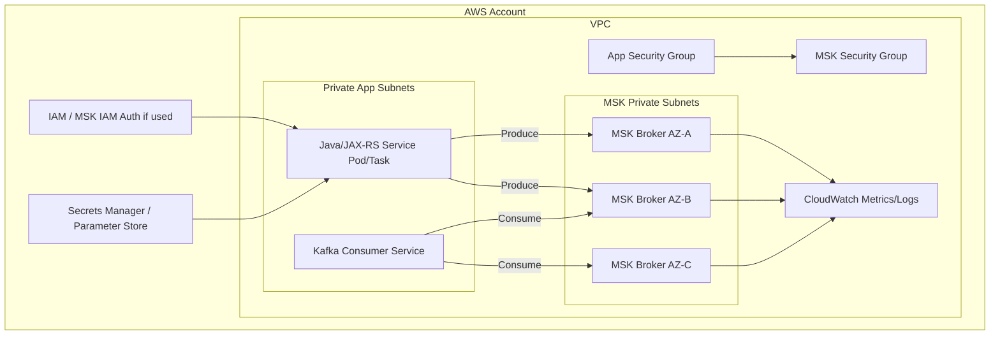
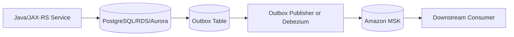
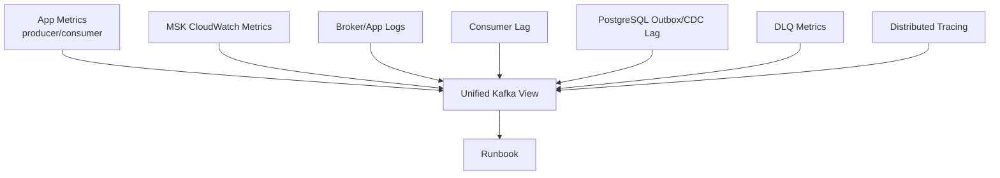
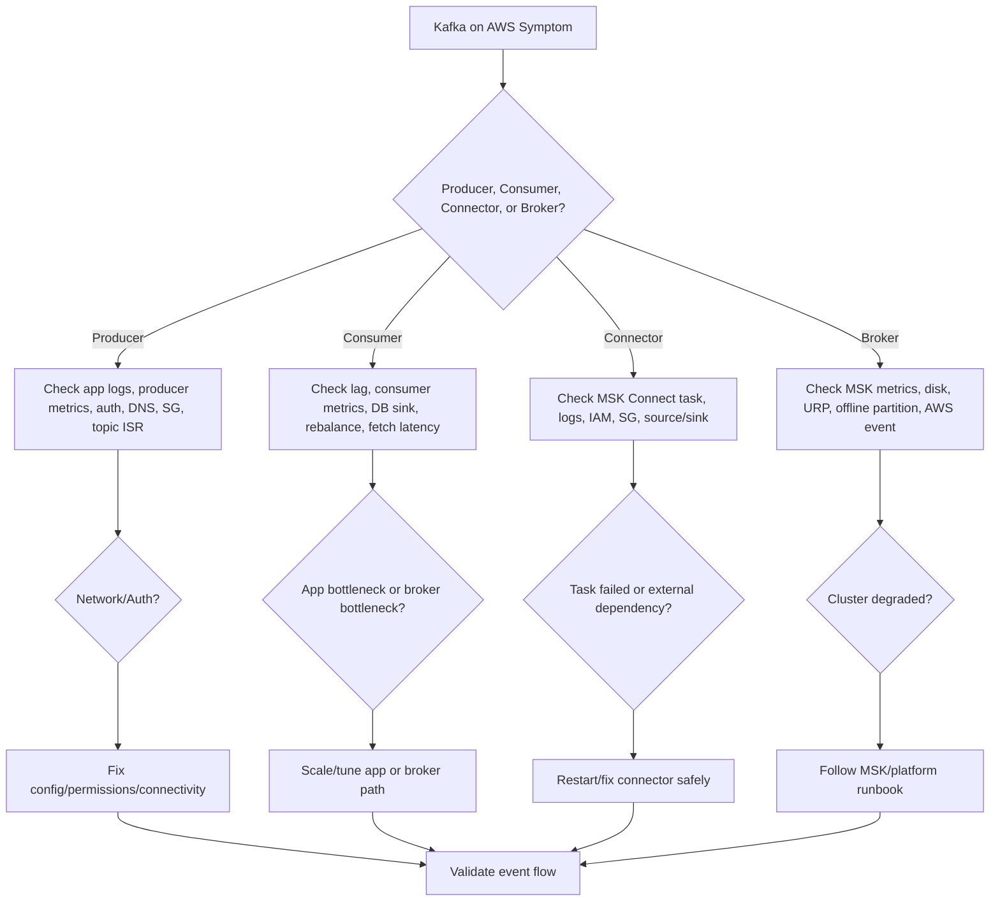

# Part 040 — Kafka on AWS

> Fokus part ini: memahami opsi dan failure model Kafka di AWS untuk sistem enterprise Java/JAX-RS. Tujuannya bukan menghafal layanan AWS, tetapi mampu menilai connectivity, security, reliability, observability, managed-service constraints, dan operational ownership saat Kafka berjalan di AWS.

---

## 1. Core Mental Model

Kafka di AWS biasanya muncul dalam beberapa bentuk:

1. Amazon MSK provisioned cluster.
2. Amazon MSK Serverless.
3. Self-managed Kafka di EC2.
4. Self-managed Kafka di EKS.
5. Kafka-compatible atau adjacent services untuk use case tertentu.
6. Hybrid connectivity antara AWS dan on-prem/cloud lain.

Mental model utama:

> Kafka on AWS is not only a broker decision. It is a VPC, subnet, routing, security group, authentication, encryption, observability, IAM, and operational responsibility decision.

Untuk backend Java/JAX-RS, konsekuensinya terasa di:

- bootstrap server,
- DNS resolution,
- security group egress/ingress,
- TLS truststore,
- SASL/IAM/SCRAM credentials,
- private connectivity,
- cross-account access,
- latency across AZ/VPC/region,
- consumer lag visibility,
- MSK broker health,
- CloudWatch metrics/logs,
- connector deployment,
- schema registry choice,
- incident escalation path.

---

## 2. AWS Kafka Deployment Options

### 2.1 Amazon MSK Provisioned

Amazon MSK adalah managed Kafka cluster di AWS.

AWS mengelola sebagian aspek broker infrastructure, tetapi tim tetap bertanggung jawab untuk banyak hal:

- topic design,
- partition count,
- retention,
- schema governance,
- ACL/security model,
- client config,
- consumer lag,
- retry/DLQ,
- performance tuning,
- data consistency,
- event ownership,
- incident response untuk aplikasi.

MSK cocok ketika:

- ingin Kafka asli,
- ingin mengurangi operational burden broker,
- aplikasi berjalan di AWS,
- perlu private networking dalam VPC,
- perlu integrasi CloudWatch,
- ingin menghindari self-managed EC2/EKS broker operations.

### 2.2 MSK Serverless

MSK Serverless mengurangi kebutuhan capacity planning broker secara eksplisit.

Cocok untuk:

- workload yang fluktuatif,
- tim yang ingin mengurangi sizing broker,
- use case yang cocok dengan batasan serverless service,
- environment yang tidak butuh full broker-level control.

Perlu diverifikasi:

- throughput/partition limits,
- supported Kafka feature set,
- pricing model,
- auth options,
- networking model,
- compatibility dengan client/connector,
- observability detail,
- operational limits.

### 2.3 Self-Managed Kafka on EC2

Kafka berjalan langsung di EC2 instances.

Tim/platform bertanggung jawab atas:

- OS patching,
- disk layout,
- filesystem,
- broker process,
- upgrade,
- certificate,
- security hardening,
- monitoring,
- backup/DR,
- instance failure recovery,
- capacity planning.

Cocok jika:

- butuh kontrol penuh,
- ada platform team kuat,
- ada requirement khusus,
- managed service tidak memenuhi constraint.

### 2.4 Self-Managed Kafka on EKS

Kafka berjalan di Kubernetes/EKS.

Ini mewarisi kompleksitas dari Part 039:

- StatefulSet,
- PVC/EBS/EFS/local disk,
- StorageClass,
- operator,
- pod scheduling,
- node group,
- anti-affinity,
- network policy,
- rolling upgrade.

Cocok jika:

- standard platform adalah Kubernetes,
- operator seperti Strimzi/Confluent digunakan,
- tim siap mengoperasikan Kafka stateful di EKS.

---

## 3. Decision Matrix

| Option | Control | Operational Burden | AWS Integration | Kafka Feature Fidelity | Typical Risk |
|---|---:|---:|---:|---:|---|
| MSK Provisioned | Medium | Medium | High | High | sizing, networking, auth, cost |
| MSK Serverless | Lower | Lower | High | Need verification | service limits, cost model, feature limits |
| Self-managed EC2 | High | High | Medium | High | ops burden, patching, disk failure |
| Self-managed EKS | High | Very High | Medium/High | High | K8s + Kafka complexity |

Architecture review question:

> Do we need Kafka control, Kafka semantics, AWS-managed operations, or simply event integration? The answer determines the platform choice.

---

## 4. Reference Architecture: Java/JAX-RS to MSK



Key point:

- aplikasi harus berada di network path yang bisa mencapai broker,
- security group harus mengizinkan traffic ke listener broker,
- auth mechanism harus didukung client,
- DNS bootstrap broker harus resolvable,
- TLS trust harus benar,
- CloudWatch harus dipakai bersama app metrics.

---

## 5. VPC Mental Model

Kafka di AWS hampir selalu private-networking-first.

Komponen penting:

- VPC,
- private subnet,
- route table,
- security group,
- NACL,
- VPC peering,
- Transit Gateway,
- PrivateLink jika tersedia/relevan,
- DNS resolution,
- cross-account networking,
- cross-region networking.

Kafka client tidak hanya butuh akses ke satu bootstrap host.

Client flow:

1. connect ke bootstrap broker,
2. terima metadata semua broker,
3. connect ke broker leader partition,
4. maintain connection pool.

Karena itu:

> Security group dan routing harus mengizinkan akses ke semua broker advertised endpoints, bukan hanya bootstrap address.

Failure mode:

- bootstrap berhasil, produce gagal ke leader broker,
- satu AZ subnet blocked sehingga partition tertentu gagal,
- DNS berbeda antar VPC,
- cross-account route missing,
- NACL stateless rule memblokir return traffic,
- security group hanya mengizinkan satu broker.

---

## 6. Subnet and Availability Zone Design

Kafka availability di AWS sangat terkait AZ.

Best-practice mental model:

- broker tersebar di multiple AZ,
- aplikasi berjalan di multiple AZ,
- routing antar subnet jelas,
- security group lintas subnet diizinkan,
- cross-AZ traffic cost/latency dipahami,
- failure satu AZ dimodelkan.

Pertanyaan review:

- MSK cluster ada di berapa AZ?
- App service ada di AZ yang sama atau berbeda?
- Apakah route table private subnet benar?
- Apakah broker reachable dari semua app subnet?
- Apakah consumer failover saat AZ impaired sudah diuji?
- Apakah multi-AZ benar-benar memberi tolerance sesuai RF/min ISR?

Potential trade-off:

| Choice | Benefit | Risk |
|---|---|---|
| Broker multi-AZ | availability lebih baik | cross-AZ traffic/cost |
| App multi-AZ | app resilient | consumer rebalance saat AZ failure |
| Single-AZ dev cluster | murah/simple | tidak represent production failure |

---

## 7. Security Group Model

Security group adalah firewall stateful di AWS.

Kafka security group design biasanya melibatkan:

- app security group,
- MSK cluster security group,
- connector security group,
- bastion/admin security group jika ada,
- on-prem CIDR if hybrid.

Principle:

> Allow app security group to connect to MSK security group on Kafka listener ports. Avoid broad CIDR unless required and reviewed.

Common ports depend on listener/auth configuration. Jangan menghafal port; cek cluster actual config.

Failure mode:

- app SG egress blocked,
- MSK SG ingress missing,
- connector SG berbeda dari app SG,
- admin tool bisa connect tetapi app tidak,
- one environment works because SG overly broad,
- cross-account SG reference not configured.

Debugging checklist:

- identify source security group,
- identify broker listener port,
- verify MSK SG ingress,
- verify app SG egress,
- verify NACL,
- verify route table,
- verify DNS endpoint,
- test from same runtime environment.

---

## 8. IAM Authentication for MSK

Amazon MSK can support IAM-based authentication depending on cluster/client setup.

Conceptually:

- client uses AWS identity,
- Kafka auth maps to IAM authorization model or AWS-specific mechanism,
- Java client needs compatible login/module/library/config,
- IAM policy controls cluster/topic/group operations depending setup.

Benefits:

- integrates with AWS IAM,
- avoids static username/password in some models,
- can use role-based access from EKS/ECS/EC2,
- supports centralized identity governance.

Risks:

- client config more complex,
- local testing harder,
- token/signing failure can look like Kafka auth failure,
- IAM policy mismatch causes authorization errors,
- cross-account role assumption adds complexity,
- library version compatibility matters.

Internal verification:

- Is IAM auth used?
- Which Java auth library/config is standard?
- Are workloads using IRSA, ECS task role, EC2 role, or static credential?
- Are IAM policies least privilege?
- How are topic/group permissions represented?
- How are auth failures monitored?

---

## 9. SASL/SCRAM

SASL/SCRAM uses username/password-like credentials with challenge-response.

In AWS context, credentials may be stored in:

- AWS Secrets Manager,
- Parameter Store,
- Kubernetes Secret,
- CI/CD secret store,
- platform-managed secret system.

Review questions:

- Where is SCRAM credential stored?
- How is it rotated?
- Does app reload credential or require restart?
- Are producer and consumer principals separate?
- Are credentials environment-specific?
- Are admin credentials separated?
- Is secret access audited?

Failure mode:

- secret rotated but app not restarted,
- wrong secret mounted,
- password mismatch,
- broad shared credential across services,
- stale secret in CI/CD,
- emergency credential not revoked.

---

## 10. TLS and Truststore

TLS concerns:

- encryption in transit,
- broker certificate chain,
- hostname verification,
- truststore distribution,
- certificate rotation,
- client configuration,
- listener endpoint matching.

Common Java client config concepts:

```properties
security.protocol=SSL
ssl.truststore.location=/etc/kafka/truststore.jks
ssl.truststore.password=${TRUSTSTORE_PASSWORD}
ssl.endpoint.identification.algorithm=https
```

For SASL over TLS:

```properties
security.protocol=SASL_SSL
sasl.mechanism=SCRAM-SHA-512
```

Failure mode:

- `SSLHandshakeException`,
- expired certificate,
- missing CA in truststore,
- hostname mismatch,
- wrong listener endpoint,
- truststore secret not mounted,
- app uses plaintext listener accidentally.

Review checklist:

- Is TLS required in all environments?
- Is hostname verification enabled?
- How are CAs distributed?
- How is cert rotation tested?
- Are truststore passwords protected?
- Are logs free of secrets?

---

## 11. Private Connectivity

Enterprise Kafka on AWS often avoids public internet.

Patterns:

- same VPC,
- VPC peering,
- Transit Gateway,
- PrivateLink if supported by deployment model,
- Direct Connect from on-prem,
- VPN,
- cross-account private networking.

Each pattern affects:

- DNS,
- route tables,
- security group references,
- NACL,
- latency,
- throughput,
- blast radius,
- troubleshooting ownership.

Critical Kafka-specific concern:

> Advertised broker endpoints must be reachable through the chosen private connectivity path.

Hybrid failure example:

```text
On-prem client connects to bootstrap endpoint.
Bootstrap returns private VPC broker DNS.
On-prem DNS cannot resolve or route to those broker addresses.
Client fails after metadata fetch.
```

Fix is not “Kafka retry”. Fix is listener/DNS/network design.

---

## 12. Cross-Account Access

Large enterprises often separate accounts:

- platform account,
- application account,
- shared services account,
- logging/monitoring account,
- data account.

Kafka cross-account concerns:

- VPC connectivity,
- DNS resolution,
- security group references or CIDR rules,
- IAM role assumption if IAM auth,
- Secrets Manager sharing,
- CloudWatch metric visibility,
- topic/ACL ownership,
- billing/cost allocation,
- incident escalation path.

Review questions:

- Which account owns MSK?
- Which account runs Java services?
- Is auth cross-account or credential-based?
- Can app team see cluster metrics?
- Who approves topic/ACL changes?
- How are secrets shared?
- How are incidents routed?

---

## 13. CloudWatch Metrics and Logs

CloudWatch can collect MSK metrics/logs depending configuration.

Important metric categories:

- broker CPU,
- memory/JVM,
- disk usage,
- network in/out,
- bytes in/out,
- request latency,
- under-replicated partitions,
- offline partitions,
- active controller,
- ISR shrink/expand,
- produce/fetch request metrics,
- connection count,
- authentication failures,
- consumer lag if integrated separately,
- MSK Connect metrics if used.

Broker metrics alone are insufficient.

Need correlate with:

- application producer metrics,
- application consumer metrics,
- consumer lag dashboard,
- DLQ metrics,
- Schema Registry metrics,
- Connect metrics,
- PostgreSQL outbox lag,
- Debezium replication slot lag,
- API latency/error rate.

Operational principle:

> Kafka health is a cross-layer view: MSK metrics + client metrics + business flow metrics.

---

## 14. MSK Logs

MSK can expose broker logs depending setup.

Useful log categories:

- broker server logs,
- controller logs,
- state change logs,
- log cleaner logs,
- auth errors,
- request handling errors.

Use broker logs to investigate:

- leader election,
- ISR changes,
- authorization denial,
- authentication failures,
- disk/log directory problems,
- replication issue,
- controller instability.

Caution:

- logs can be noisy,
- do not depend only on logs for alerting,
- sensitive principal/topic names may appear,
- log retention/cost must be managed.

---

## 15. MSK Connect

MSK Connect is AWS-managed Kafka Connect runtime.

It may be used for:

- source connectors,
- sink connectors,
- Debezium-like CDC depending connector support,
- S3 sink,
- JDBC sink/source,
- OpenSearch sink,
- custom connectors.

Core concepts remain Kafka Connect concepts:

- connector,
- task,
- worker,
- converter,
- SMT,
- offset storage,
- DLQ,
- error tolerance,
- restart,
- scaling.

AWS-specific concerns:

- connector plugin packaging,
- IAM role for connector,
- VPC/subnet/security group,
- worker capacity,
- CloudWatch logs,
- secret access,
- connector upgrade,
- offset continuity,
- network path to source/sink systems.

Failure mode:

- connector cannot reach database,
- connector cannot reach MSK,
- IAM role lacks permission,
- plugin version incompatible,
- task failed silently without alert,
- DLQ grows,
- offset stuck,
- source system throttles connector.

---

## 16. Schema Registry Options on AWS

Kafka schema governance still matters on AWS.

Possible options:

- Confluent Schema Registry self-managed or managed,
- AWS Glue Schema Registry,
- custom/internal registry,
- schema as code without runtime registry,
- Protobuf schema package governance,
- JSON Schema validation in CI.

Review questions:

- Which registry is used?
- Is it compatible with Kafka clients and serializers?
- Is schema ID embedded in payload wire format?
- Are compatibility checks enforced?
- Is registry reachable from app subnets?
- Is registry auth separate from Kafka auth?
- Are schemas promoted through environments?
- Is schema rollback possible?

Failure mode:

- producer cannot register schema,
- consumer cannot fetch schema,
- incompatible schema deployed,
- registry outage blocks serialization/deserialization,
- schema drift between environments,
- connector uses different converter/schema model.

---

## 17. Topic and ACL Management in AWS

AWS does not remove topic governance responsibility.

Topics still need:

- owner,
- purpose,
- partition count,
- replication factor,
- retention,
- cleanup policy,
- schema contract,
- ACL/principal,
- environment naming,
- monitoring,
- deprecation plan.

ACL/auth can be represented through:

- Kafka ACLs,
- IAM policies if IAM auth model supports it,
- operator/platform abstraction,
- manual admin tooling,
- GitOps pipeline.

Review principle:

> Topic creation is a production artifact change, not a runtime accident.

Internal verification:

- Are topics created as code?
- Is auto-create disabled?
- Are ACLs least privilege?
- Are topic configs reviewed?
- Are topic changes promoted through environments?
- Is there drift detection?

---

## 18. Backup and Replication Considerations

Kafka backup/DR on AWS can involve:

- multi-AZ MSK cluster,
- cross-region replication,
- MirrorMaker 2,
- Cluster Linking if available through platform/vendor,
- S3 archival sink,
- replay from retained topics,
- database/outbox as source of truth,
- downstream reconciliation.

Important distinction:

- replication factor protects within cluster/AZ failure domain,
- cross-region replication protects region-level failure,
- S3 sink is not necessarily a hot failover path,
- database backup does not automatically restore Kafka event log,
- Kafka retained log does not automatically restore all business state.

Review questions:

- What is RPO/RTO?
- Is DR active-passive or active-active?
- Are offsets replicated/translated?
- Are schemas replicated?
- Are ACLs replicated?
- Are consumers replay-safe?
- Is failover tested?

---

## 19. Cost Model

Kafka on AWS cost drivers:

- broker instance size/count,
- storage size,
- storage throughput/IOPS,
- data transfer across AZ,
- data transfer across region/VPC,
- CloudWatch metrics/log ingestion,
- MSK Connect worker capacity,
- NAT Gateway if traffic routes poorly,
- PrivateLink/Transit Gateway/Direct Connect,
- retention duration,
- replication factor,
- partition count overhead,
- client retry storms during incidents.

Cost anti-patterns:

- long retention for high-volume topics without business need,
- DLQ unbounded growth,
- excessive partitions,
- cross-AZ chatty traffic not understood,
- debug logs left enabled,
- connector constantly reprocessing,
- over-provisioned broker for bursty workload that fits serverless/alternative model.

Senior engineer lens:

> Cost is also architecture feedback. High Kafka cost often reveals unclear retention, over-broad event payloads, poor topic design, or inefficient consumers.

---

## 20. Performance and Capacity on MSK

MSK performance still depends on Kafka fundamentals:

- partition count,
- broker count,
- broker size,
- storage throughput,
- producer batching,
- compression,
- replication factor,
- consumer parallelism,
- fetch settings,
- retention/compaction,
- hot partitions,
- cross-AZ traffic.

Capacity review:

- bytes in/sec,
- bytes out/sec,
- peak throughput,
- partition count per broker,
- leader distribution,
- disk usage growth,
- consumer lag,
- request latency,
- connection count,
- CPU utilization,
- network utilization,
- storage throughput.

Do not scale blindly:

- adding brokers may not redistribute partitions,
- increasing partitions can break ordering assumptions,
- increasing producer retries can amplify load,
- increasing consumer replicas beyond partition count does not improve parallelism,
- compression reduces network but costs CPU.

---

## 21. Common AWS Kafka Failure Modes

### 21.1 Security Group Misconfiguration

Symptom:

- connection timeout,
- bootstrap fails,
- metadata fetched but produce fails,
- some partitions work, others fail.

Cause:

- broker listener port blocked,
- app SG missing egress,
- MSK SG missing ingress,
- cross-account security group rule wrong,
- NACL blocks ephemeral return port.

Safe debugging:

- test from app runtime,
- check route/security group/NACL,
- verify all broker endpoints,
- do not assume one successful TCP test covers all brokers.

### 21.2 IAM Auth Failure

Symptom:

- authentication failed,
- authorization denied,
- token/signing error,
- app works locally but not in EKS/ECS.

Cause:

- missing IAM policy,
- wrong role,
- IRSA misconfigured,
- clock skew,
- incompatible client library,
- cross-account assume-role issue.

### 21.3 TLS Failure

Symptom:

- SSL handshake error,
- certificate unknown,
- hostname verification failure.

Cause:

- wrong truststore,
- expired CA/cert,
- wrong endpoint,
- internal/external listener mismatch,
- app image missing CA.

### 21.4 DNS Failure

Symptom:

- bootstrap hostname resolves in one subnet but not another,
- cross-VPC client cannot resolve broker DNS,
- hybrid client receives private DNS it cannot resolve.

Cause:

- Route 53 resolver issue,
- private hosted zone not associated,
- VPC DNS disabled/misconfigured,
- advertised listener unsuitable for client network.

### 21.5 Broker Storage Pressure

Symptom:

- produce latency increases,
- disk usage alert,
- under-replicated partitions,
- broker unstable.

Cause:

- retention too high,
- traffic growth,
- DLQ spike,
- compaction backlog,
- storage under-provisioned.

### 21.6 Consumer Lag Spike

Symptom:

- lag grows across many groups,
- API downstream stale,
- projection delayed.

Potential causes:

- broker fetch latency,
- consumer CPU throttling,
- database sink slow,
- partition hot spot,
- schema registry latency,
- connector failure,
- network issue,
- producer burst.

Need correlate app metrics with MSK metrics.

---

## 22. AWS Deployment Patterns for Java/JAX-RS Clients

Java services may run on:

- EKS,
- ECS/Fargate,
- EC2 Auto Scaling Group,
- Lambda for limited use cases,
- on-prem connecting to MSK,
- another cloud through private network.

### 22.1 EKS Client

Concerns:

- pod security group or node security group,
- IRSA for IAM auth,
- secret mounting for SCRAM/TLS,
- DNS inside cluster,
- NetworkPolicy,
- resource throttling,
- graceful shutdown for consumers.

### 22.2 ECS/Fargate Client

Concerns:

- task role,
- security group per service/task,
- secret injection,
- ENI networking,
- deployment rolling behavior,
- task shutdown grace period.

### 22.3 EC2 Client

Concerns:

- instance profile,
- host-level firewall,
- JVM truststore deployment,
- service manager restart behavior,
- patching and AMI drift.

### 22.4 Lambda Client

Use with caution.

Concerns:

- connection reuse,
- cold start,
- concurrency spikes,
- networking/VPC overhead,
- long polling mismatch,
- offset management if consuming,
- better suited for specific event integration patterns than general Kafka consumer loops.

---

## 23. Outbox/CDC on AWS

Common AWS-related flows:



If PostgreSQL is RDS/Aurora:

- CDC/logical replication settings must be enabled,
- replication slot lag must be monitored,
- parameter group may matter,
- network path from connector to DB matters,
- security group permits connector to DB,
- WAL retention risk still exists,
- connector credential rotation matters.

If using MSK Connect/Debezium:

- connector subnet/SG must reach database and MSK,
- connector IAM/secret access required,
- connector offset and task health monitored,
- snapshot behavior reviewed,
- schema changes handled.

Internal verification:

- Is outbox publisher app-based or CDC-based?
- Is database RDS/Aurora/self-managed?
- Is Debezium used?
- Is MSK Connect used?
- Is replication slot lag monitored?
- Who owns connector restart?

---

## 24. Schema Registry Connectivity on AWS

Schema Registry may run:

- inside EKS,
- on EC2,
- as managed Confluent component,
- outside AWS,
- replaced by AWS Glue Schema Registry,
- as internal platform service.

Connectivity questions:

- Can producer/consumer reach registry?
- Is registry multi-AZ?
- Does registry use private endpoint?
- Does registry require IAM, basic auth, mTLS, or token?
- Is registry latency visible?
- Does registry outage block app startup or runtime processing?
- Is schema cache configured?

Failure mode:

- producer cannot serialize new schema,
- consumer cannot deserialize after restart,
- connector converter fails,
- schema registration blocked by auth,
- CI passes but runtime registry differs.

---

## 25. Observability Design on AWS

Minimum useful observability view:



Must-have dashboards:

- MSK cluster health,
- broker disk usage,
- under-replicated/offline partitions,
- broker request latency,
- bytes in/out,
- consumer lag by group/topic/partition,
- producer error/retry rate,
- consumer processing latency,
- DLQ rate/depth,
- connector task status,
- replication slot lag if CDC,
- schema registry health,
- app API impact.

Alert quality rules:

- alert on customer-impacting symptoms,
- include affected topic/group/service,
- link to runbook,
- avoid raw cloud metric without action,
- correlate Kafka and app symptoms.

---

## 26. Security Review for AWS Kafka

Security layers:

- VPC private networking,
- security groups,
- NACLs,
- TLS,
- SASL/SCRAM or IAM auth,
- Kafka ACL/IAM permission,
- Secrets Manager/Parameter Store,
- KMS encryption,
- CloudWatch log access,
- audit trail,
- least privilege for app roles,
- cross-account boundaries.

Review checklist:

- Are brokers public or private?
- Is TLS enforced?
- Which auth mechanism is used?
- Are principals per service?
- Are producer and consumer permissions separated?
- Are admin permissions restricted?
- Are secrets rotated?
- Are CloudWatch logs protected?
- Is PII logged in events or DLQ?
- Are sensitive topics isolated?

---

## 27. AWS Kafka and Kubernetes/EKS Integration

If Java/JAX-RS services run in EKS and Kafka is MSK:

Concerns:

- EKS node/pod security group to MSK SG,
- IRSA for IAM auth,
- Kubernetes Secret for SCRAM/TLS,
- NetworkPolicy allowing egress,
- CoreDNS resolution,
- pod restart/rebalance,
- resource throttling,
- deployment rollout strategy,
- service mesh sidecar if used,
- mTLS interaction if service mesh intercepts traffic.

Failure mode:

- sidecar blocks Kafka protocol,
- NetworkPolicy allows HTTP but not Kafka,
- pod SG not referenced in MSK SG,
- IRSA role missing permission,
- secret mounted with wrong path,
- CPU throttling causes consumer max poll interval issue,
- rolling deployment causes rebalance storm.

---

## 28. AWS Kafka and On-Prem/Hybrid Integration

Hybrid Kafka connectivity may use:

- Direct Connect,
- Site-to-Site VPN,
- Transit Gateway,
- private hosted zone/resolver forwarding,
- on-prem firewall rules,
- mTLS/SASL across boundary.

Kafka-specific risk:

- advertised listeners return AWS private DNS,
- on-prem cannot resolve or route,
- latency higher than expected,
- packet loss causes producer/consumer instability,
- firewall allows bootstrap but not all brokers,
- certificate hostname mismatch.

Architecture review:

- Are there separate listeners for on-prem clients?
- Is DNS split-horizon configured?
- Are broker endpoints reachable from on-prem?
- Is cross-boundary latency acceptable?
- Are retries/backoff configured to avoid storms?
- Is data classification approved for cross-boundary flow?

---

## 29. Environment Promotion

AWS Kafka environments often include:

- dev,
- test,
- staging,
- pre-prod,
- prod,
- DR.

Risks:

- topic config differs between envs,
- schema compatibility differs,
- auth mode differs,
- network path differs,
- MSK version differs,
- partition count lower in test hiding production ordering/performance issue,
- retention much shorter hiding replay requirement,
- auto-create enabled in lower env but disabled in prod.

Promotion checklist:

- topic as code,
- schema as code,
- ACL as code,
- connector config as code,
- environment-specific values explicit,
- CI compatibility checks,
- drift detection,
- rollback plan,
- prod-like test for critical event flow.

---

## 30. Incident Response: AWS-Specific Questions

When Kafka incident happens on AWS, ask:

### Network

- Is this isolated to one AZ/subnet?
- Did security group/NACL/route table change?
- Is DNS resolving correctly?
- Is Direct Connect/VPN/Transit Gateway healthy?

### MSK

- Are brokers healthy?
- Any under-replicated/offline partitions?
- Disk usage high?
- Request latency high?
- Any recent MSK operation/upgrade/config change?

### Client

- Which services are affected?
- Producer or consumer or both?
- Any auth/TLS error?
- Did deployment happen?
- Are retries increasing?

### Data Flow

- Is outbox growing?
- Is connector stopped?
- Is DLQ increasing?
- Is replication slot lag growing?
- Is projection stale?

### Ownership

- Is platform/SRE needed?
- Is AWS support needed?
- Is backend data repair needed?
- Is customer communication needed?

---

## 31. Production-Safe Debugging Flow



Guardrails:

- do not reset offsets before understanding lag cause,
- do not open security groups broadly as permanent fix,
- do not disable TLS/auth to test production,
- do not change topic retention during incident without data-loss review,
- do not scale partition count without ordering review,
- do not restart connectors repeatedly without inspecting task failure.

---

## 32. Internal Verification Checklist for AWS Kafka Usage

### 32.1 Platform Choice

- Apakah memakai Amazon MSK provisioned?
- Apakah memakai MSK Serverless?
- Apakah Kafka self-managed di EC2?
- Apakah Kafka self-managed di EKS?
- Apakah ada hybrid/on-prem connectivity?
- Siapa owner platform dan escalation path?

### 32.2 Network

- Cek VPC ID.
- Cek private subnet per AZ.
- Cek route table.
- Cek security group app → MSK.
- Cek NACL jika ada restriction.
- Cek DNS resolution dari runtime app.
- Cek cross-account/cross-VPC connectivity.
- Cek Direct Connect/VPN/Transit Gateway jika hybrid.

### 32.3 Security

- Cek auth mechanism: IAM, SASL/SCRAM, mTLS, atau kombinasi.
- Cek TLS enforced atau tidak.
- Cek secret storage.
- Cek credential/cert rotation.
- Cek service principal per app.
- Cek topic/group permissions.
- Cek admin access boundary.

### 32.4 Kafka Config

- Cek Kafka version.
- Cek broker count.
- Cek replication factor default.
- Cek min ISR.
- Cek partition count per critical topic.
- Cek retention/compaction.
- Cek auto-create topic.
- Cek quota if used.

### 32.5 Observability

- Cek CloudWatch metrics enabled.
- Cek broker logs enabled.
- Cek consumer lag dashboard.
- Cek producer/consumer app metrics.
- Cek DLQ dashboard.
- Cek connector metrics/logs.
- Cek schema registry health.
- Cek alert-to-runbook links.

### 32.6 Connect/CDC

- Cek MSK Connect usage.
- Cek connector plugin/version.
- Cek connector IAM role.
- Cek connector subnet/SG.
- Cek source/sink connectivity.
- Cek Debezium/CDC config.
- Cek replication slot lag if PostgreSQL.
- Cek connector DLQ.

### 32.7 CI/CD and Governance

- Cek topic as code.
- Cek schema as code.
- Cek ACL as code.
- Cek connector config as code.
- Cek environment promotion.
- Cek drift detection.
- Cek approval workflow.
- Cek rollback plan.

### 32.8 DR and Data Safety

- Cek RPO/RTO.
- Cek multi-AZ setup.
- Cek cross-region replication if any.
- Cek backup/archival assumption.
- Cek consumer replay safety.
- Cek schema replication.
- Cek DR test result.

---

## 33. PR / Architecture Review Checklist

Untuk perubahan Kafka on AWS, tanyakan:

- Apakah topic baru sudah punya owner?
- Apakah partition count dan key strategy sudah direview?
- Apakah retention sesuai kebutuhan replay/audit/privacy?
- Apakah schema compatibility dicek?
- Apakah producer/consumer principal least privilege?
- Apakah app security group bisa reach semua broker endpoint?
- Apakah auth mechanism sesuai standard team?
- Apakah secrets/certs dikelola aman?
- Apakah CloudWatch/app metrics sudah ada?
- Apakah consumer lag alert tersedia?
- Apakah DLQ/retry policy tersedia?
- Apakah outbox/CDC flow aman?
- Apakah connector config dipromosikan via CI/CD?
- Apakah cross-account/hybrid path diuji?
- Apakah rollback aman?
- Apakah runbook diperbarui?

---

## 34. Senior Engineer Heuristics

1. **MSK is managed Kafka, not managed event architecture.** AWS membantu broker operation, bukan event correctness.
2. **Kafka client needs all broker endpoints, not only bootstrap.** Ini sumber banyak network bug.
3. **Security group issue sering terlihat seperti Kafka timeout.** Jangan langsung tuning producer.
4. **IAM auth is powerful but adds client/config complexity.** Pastikan standard library dan policy jelas.
5. **CloudWatch broker metrics must be correlated with app metrics.** Broker sehat belum tentu flow bisnis sehat.
6. **MSK Connect is still Kafka Connect.** Task, offset, converter, SMT, DLQ tetap harus dipahami.
7. **Schema Registry choice matters.** AWS Glue, Confluent, atau custom registry punya wire format dan governance berbeda.
8. **Cross-AZ/multi-AZ improves availability but affects traffic/cost/latency.** Jangan abaikan data transfer.
9. **Serverless reduces sizing but not semantics.** Ordering, idempotency, schema, retry, DLQ tetap masalah aplikasi.
10. **Private connectivity must align with advertised listeners.** Network reachable secara umum belum tentu Kafka-reachable.

---

## 35. Summary

Kafka on AWS harus dipahami sebagai gabungan dari Kafka semantics dan AWS infrastructure semantics.

Yang harus dikuasai:

- pilihan MSK provisioned, MSK Serverless, self-managed EC2, self-managed EKS,
- VPC/subnet/security group/DNS/routing sebagai bagian dari Kafka connectivity,
- IAM/SASL/TLS sebagai bagian dari client correctness,
- CloudWatch plus app metrics untuk observability end-to-end,
- MSK Connect dan CDC sebagai operational runtime sendiri,
- Schema Registry choice sebagai governance decision,
- cross-account/hybrid connectivity sebagai advertised-listener problem,
- DR/replication sebagai data safety problem,
- CI/CD/GitOps sebagai guardrail untuk topic/schema/ACL/connector.

Final mental model:

> In AWS, Kafka incidents often look like application errors but originate from network, identity, storage, managed-service limits, or cross-layer configuration drift. A senior backend engineer must debug across Kafka, Java client, VPC, IAM, CloudWatch, PostgreSQL, CDC, and deployment pipeline boundaries.

