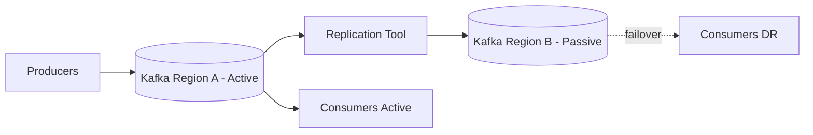
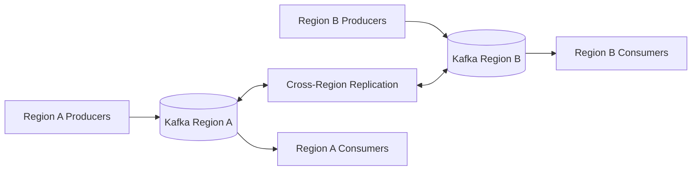
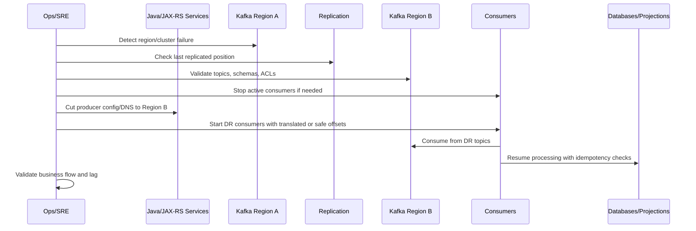

# Cheatsheet Kafka Part 043 — Multi-Region and Disaster Recovery

## 1. Core idea

Kafka disaster recovery is not just "copy topics to another cluster".

A Kafka DR design must answer harder questions:

- what data can be lost,
- how long the system can be unavailable,
- which producers fail over,
- which consumers fail over,
- whether offsets move across regions,
- whether schemas move across regions,
- whether duplicates are acceptable,
- whether ordering still matters after failover,
- whether replay after failback is safe,
- whether downstream databases can tolerate repeated events,
- whether the business process can survive a partial event history.

Kafka is often used as an event backbone. That means a Kafka outage or region failure is not isolated to Kafka. It can affect order processing, quote lifecycle, approval workflow, fulfillment integration, cache invalidation, projections, audit pipelines, CDC replication, analytics, and reconciliation.

For a Java/JAX-RS backend engineer, the main responsibility is not to operate every replication tool. The responsibility is to understand the failure semantics of multi-region Kafka well enough to design producers and consumers that remain correct during failover, replay, duplicate delivery, region split, and recovery.

---

## 2. Multi-AZ vs multi-region

### 2.1 Multi-AZ

Multi-AZ means Kafka brokers are distributed across availability zones inside one region.

The goal is usually high availability inside a region.

Typical properties:

- lower latency than multi-region,
- shared regional control plane,
- synchronous replication between brokers is usually feasible,
- producer can use `acks=all`,
- ISR behavior is still manageable,
- consumer clients normally keep using the same cluster endpoint,
- failover is mostly broker/partition leadership movement.

Multi-AZ protects against:

- single broker failure,
- single node failure,
- single rack/AZ failure if configured correctly,
- storage failure affecting one broker,
- rolling maintenance.

It does not fully protect against:

- whole-region outage,
- regional control-plane outage,
- catastrophic network isolation,
- regional credential/auth service failure,
- region-wide DNS/private endpoint issue,
- operator or automation deleting data across the whole cluster.

### 2.2 Multi-region

Multi-region means Kafka data or services span more than one geographic/cloud region.

The goal may be:

- disaster recovery,
- lower latency for local users,
- data residency,
- regional autonomy,
- migration,
- integration between on-prem and cloud,
- active-active workload placement.

Multi-region introduces harder trade-offs:

- higher latency,
- asynchronous replication,
- offset translation,
- duplicate events,
- topic mapping,
- schema synchronization,
- failover orchestration,
- split-brain-like business risk,
- cross-region cost,
- operational complexity.

In most enterprise Kafka systems, cross-region replication is asynchronous. That means RPO is rarely zero.

---

## 3. RPO and RTO

### 3.1 RPO

RPO means Recovery Point Objective.

It answers: how much data loss is acceptable?

Examples:

- `RPO = 0`: no acknowledged event may be lost.
- `RPO <= 1 minute`: up to one minute of events may be missing after failover.
- `RPO <= 15 minutes`: delayed recovery is acceptable for non-critical analytics.

For Kafka, RPO depends on:

- producer acknowledgement setting,
- replication factor,
- min ISR,
- broker durability,
- cross-region replication lag,
- replication tool offset position,
- schema replication lag,
- operational failover delay,
- whether producers can buffer/retry during outage.

A common mistake is claiming low RPO because the source Kafka cluster is replicated, while ignoring replication lag in MirrorMaker 2, Cluster Linking, Kafka Connect, Schema Registry, or downstream projections.

### 3.2 RTO

RTO means Recovery Time Objective.

It answers: how long can the service be unavailable?

Kafka RTO depends on:

- detection time,
- decision time,
- DNS/endpoint cutover,
- producer redeployment/reconfiguration,
- consumer redeployment/reconfiguration,
- schema registry availability,
- ACL/security readiness in DR cluster,
- offset mapping readiness,
- downstream database readiness,
- validation before resuming traffic.

RTO is not the time needed to start brokers only. It is the time needed for the business flow to safely resume.

### 3.3 Why RPO/RTO must be per flow

Different event flows may need different recovery targets.

For example:

| Flow type | Typical concern | Possible RPO/RTO posture |
|---|---|---|
| Order submitted event | Business-critical | Low RPO, low RTO |
| Quote viewed analytics event | Non-critical | Higher RPO, higher RTO |
| Audit event | Compliance-sensitive | Low data-loss tolerance |
| Cache invalidation event | Recoverable | Can rebuild after recovery |
| Projection update event | Rebuildable | Replay/rebuild acceptable |
| External fulfillment command | High side-effect risk | Duplicate control is critical |

The right unit of DR planning is not just a Kafka cluster. It is the business event flow.

---

## 4. Basic DR topologies

### 4.1 Single-region Kafka with backup only

This is the simplest model.

Kafka runs in one region. Backups, exported configurations, IaC, and runbooks exist, but there is no live secondary Kafka cluster.

Pros:

- lower cost,
- simpler operations,
- simpler semantics,
- no cross-region lag.

Cons:

- high RTO,
- high risk during region outage,
- recovery may require rebuild,
- replay depends on retained data,
- topic/schema/ACL recreation may be manual if not automated.

This model may be acceptable for non-critical or recoverable event flows, but usually not for mission-critical event backbone.

### 4.2 Active-passive

One Kafka cluster is active. Another cluster is passive/standby.

Events are replicated from active to passive.



Pros:

- simpler than active-active,
- clear source of truth,
- easier conflict avoidance,
- easier business reasoning.

Cons:

- failover requires cutover,
- replication lag means potential data loss,
- offset translation must be handled,
- failback can be complex,
- passive cluster must be continuously tested.

Active-passive is often the most realistic DR design for enterprise transactional systems.

### 4.3 Active-active

Both regions accept writes and produce events.



Pros:

- lower local latency,
- regional autonomy,
- potentially better availability.

Cons:

- conflict resolution is hard,
- duplicate detection is harder,
- global ordering is not available,
- event identity must be globally unique,
- business invariants can be violated across regions,
- split-brain-like behavior is possible,
- failback and reconciliation are complex.

Active-active is not just an infrastructure pattern. It is a domain consistency problem.

For CPQ/order management, active-active should be treated with caution unless aggregate ownership, regional routing, idempotency, and reconciliation are explicitly designed.

### 4.4 Active-active by partitioned ownership

A safer version of active-active assigns ownership by tenant, region, customer, account, or aggregate.

Examples:

- Tenant A writes only to Region A.
- Tenant B writes only to Region B.
- Customer/account ownership is region-pinned.
- Quote/order aggregate is created and processed in one home region.

This reduces conflicts but does not remove all complexity.

You still need:

- routing rules,
- ownership lookup,
- failover rule,
- duplicate control,
- cross-region read model strategy,
- reconciliation.

---

## 5. Cluster replication options

### 5.1 MirrorMaker 2

MirrorMaker 2 is commonly used for Kafka cluster replication.

It is built on Kafka Connect concepts.

It can replicate:

- topics,
- consumer group offsets in some configurations,
- checkpoints,
- heartbeats,
- topic configurations to some extent.

Important concepts:

- source cluster,
- target cluster,
- replication flow,
- topic name mapping,
- offset sync,
- checkpoint topic,
- heartbeat topic,
- replication lag,
- connector/task health.

MirrorMaker 2 is not magic exactly-once cross-region infrastructure. It is a replication pipeline with its own lag, offsets, failures, and operational lifecycle.

### 5.2 Cluster Linking

Cluster Linking is available in some Kafka distributions/platforms.

Conceptually, it allows one cluster to mirror topics from another cluster with broker/platform-level support.

Potential advantages:

- lower operational burden than custom replication,
- better topic mirroring integration,
- simpler consumer migration in some cases,
- platform-supported replication semantics.

Potential concerns:

- platform/version dependency,
- feature availability differs by vendor,
- operational behavior must be verified,
- failover/failback still needs application-level reasoning,
- schema registry and application state still need handling.

Use this only after verifying the actual platform capability in your environment.

### 5.3 Kafka Connect replication

Some teams implement replication through Kafka Connect source/sink connectors or custom pipelines.

This can be valid for targeted data movement but is usually less suitable as general Kafka DR replication unless deliberately designed.

Concerns:

- connector offset management,
- schema conversion,
- DLQ behavior,
- retry semantics,
- throughput bottleneck,
- failure isolation,
- operational maturity.

### 5.4 Application-level replication

Applications can produce to multiple clusters.

This is sometimes called dual-publish or multi-write.

It looks simple but is dangerous.

Failure matrix:

| DB write | Kafka A publish | Kafka B publish | Result |
|---|---|---|---|
| success | success | success | OK |
| success | success | fail | partial replication |
| success | fail | success | inconsistent cluster state |
| success | fail | fail | event missing |
| fail | success | success | phantom event |

Unless carefully controlled with outbox, idempotency, and reconciliation, application-level dual-publish recreates the dual-write problem at a larger scale.

---

## 6. Topic replication

### 6.1 Topic name strategy

Replication tools may mirror topics with prefixes or aliases.

Examples:

```text
orders.events.v1
region-a.orders.events.v1
A.orders.events.v1
orders.events.v1.mirror
```

The naming strategy affects:

- consumer failover,
- ACLs,
- dashboards,
- schemas,
- replay tooling,
- incident debugging,
- cross-region lineage.

A poor naming strategy can make DR unusable during stress.

### 6.2 Topic config replication

Topic data alone is not enough.

The target cluster must also have compatible topic configuration:

- partition count,
- replication factor,
- retention,
- cleanup policy,
- compression settings,
- min ISR,
- max message size,
- compaction settings.

If topic configuration differs, recovery behavior may differ.

Example failure:

- source topic retains 14 days,
- target topic retains 24 hours,
- failover happens after a long incident,
- consumers cannot replay required data.

### 6.3 Partition mapping

If partition counts differ between source and target, ordering and key mapping can change.

That can break consumers that depend on per-aggregate ordering.

For DR topics, partition count should usually be kept aligned unless there is a deliberate migration plan.

### 6.4 Internal topics

Replication of internal topics must be handled carefully.

Examples:

- consumer offset topics,
- Kafka Streams internal topics,
- Connect config/status/offset topics,
- MirrorMaker internal topics,
- ksqlDB internal topics.

Blindly replicating internal topics can create confusion. Not replicating required internal state can make failover slow or unsafe.

Internal topic strategy must be explicit.

---

## 7. Schema replication

Kafka event data is only usable if consumers can deserialize it.

DR must include schema strategy.

### 7.1 What must be replicated

Depending on the platform, you may need to replicate:

- Schema Registry subjects,
- schema IDs,
- compatibility mode,
- schema versions,
- references/imports,
- authorization configuration,
- schema registry credentials,
- schema registry endpoint config.

### 7.2 Schema ID mismatch

Some serializers embed schema ID in the Kafka payload.

If schema IDs are not preserved or resolvable in the DR registry, consumers may fail deserialization after failover.

This is a critical DR test case.

### 7.3 Compatibility mode drift

If Region A has backward compatibility and Region B has none/full/different rules, schema evolution behavior can diverge.

That means a schema accepted in one region may be rejected in another.

Schema compatibility mode must be managed as part of Kafka artifact GitOps.

### 7.4 Schema failover test

A useful test:

1. Produce event with latest schema in active region.
2. Replicate topic to DR region.
3. Start DR consumer against DR Kafka and DR Schema Registry.
4. Validate deserialization.
5. Validate consumer writes correctly to DR database/projection.

If this test fails, Kafka topic replication is not sufficient.

---

## 8. Consumer failover

### 8.1 Offset problem

Offsets are local to a Kafka topic partition in a specific cluster.

An offset in Region A does not automatically equal an offset in Region B.

Even if topic data is replicated, offsets may not line up exactly because of:

- replication lag,
- topic rename/prefix,
- different partition mapping,
- compaction/retention differences,
- replication tool semantics,
- skipped or filtered records.

### 8.2 Offset translation

Some replication tools provide offset translation/checkpointing.

But you must verify:

- which consumer groups are checkpointed,
- how often checkpointing happens,
- whether checkpoints are current enough,
- how to apply translated offsets,
- what happens if the checkpoint is missing,
- whether replay from earlier offset is safe.

### 8.3 Safer consumer failover posture

A robust consumer should tolerate replay from a slightly earlier point.

That requires:

- idempotent processing,
- inbox/processed event table,
- deterministic event ID,
- safe database state transitions,
- replay-safe external side effects,
- DLQ/retry behavior that does not explode after failover.

If a consumer cannot tolerate duplicates, offset translation becomes a dangerous single point of correctness.

### 8.4 Consumer group naming in DR

Possible approaches:

| Approach | Behavior | Risk |
|---|---|---|
| Same group ID in DR | Attempts continuity | Requires offset translation/readiness |
| Different DR group ID | Starts separately | May replay too much or from reset policy |
| Flow-specific group ID | Controlled per domain flow | More governance needed |

There is no universal answer. Choose based on recovery semantics.

---

## 9. Producer failover

### 9.1 Producer endpoint cutover

Producers need to know where to send events after failover.

Options:

- DNS cutover,
- config redeploy,
- service discovery,
- platform-controlled bootstrap alias,
- active-active routing,
- event gateway.

Each has trade-offs.

DNS cutover is simple but can be affected by TTL, client caching, and stale connections.

Config redeploy is explicit but slower.

Event gateway can centralize routing but adds another critical dependency.

### 9.2 Producer buffering and retry

During region outage, producers may:

- fail fast,
- retry until timeout,
- buffer in memory,
- write to outbox and let publisher retry,
- switch to DR cluster,
- reject HTTP request with 503/202 depending on workflow.

For Java/JAX-RS services, outbox-based publishing is usually safer than direct in-memory buffering because the event intent is persisted with the business transaction.

### 9.3 Transaction boundary during failover

The hardest question:

If the service writes PostgreSQL in Region A but Kafka Region A is down, what happens?

Possible answers:

- reject request before DB write,
- commit DB + outbox and publish later,
- commit DB + fail publish directly, causing missing event,
- switch Kafka publish to Region B while DB remains Region A,
- fail over application and DB together.

The safe answer depends on application topology.

Do not decide this at Kafka producer config level only. It is an application consistency decision.

---

## 10. Active-passive failover sequence

A simplified active-passive failover may look like this:



This sequence hides many hard details:

- who decides failover,
- how to avoid two regions producing simultaneously,
- how to validate data completeness,
- how to apply consumer offsets,
- how to handle in-flight outbox rows,
- how to prevent duplicate external calls,
- how to communicate customer impact.

That is why DR must be exercised, not just documented.

---

## 11. Failback

Failback is often harder than failover.

After Region B becomes active, Region A may come back with stale data.

Questions:

- Should producers move back to Region A?
- Should Region B remain primary?
- How are events produced during DR replicated back?
- Are there duplicate events across clusters?
- Are offsets in Region A still meaningful?
- Are schemas/configs aligned?
- Are downstream databases aligned?
- Was any external side effect executed twice?

A bad failback can corrupt data after a successful failover.

Safe failback often requires:

- freeze window,
- flow-by-flow reconciliation,
- event gap analysis,
- duplicate analysis,
- schema/config drift check,
- consumer offset planning,
- controlled producer cutover,
- post-failback validation.

---

## 12. Data loss scenario

### 12.1 How data loss happens

Data loss can happen when:

- producer receives ack before cross-region replication completes,
- source region fails before replication catches up,
- target topic retention is too short,
- replication connector is down unnoticed,
- schema replication fails,
- topic is excluded from replication,
- compacted topic removes required historical state,
- operator deletes/recreates topic incorrectly,
- consumer starts after an offset beyond available data.

### 12.2 Data loss mitigation

Mitigation options:

- lower replication lag,
- alert on replication lag,
- outbox persistence,
- replay from source if recovered,
- reconciliation against database source of truth,
- audit table comparison,
- producer-side durable retry,
- business-level compensation.

### 12.3 Data loss is business-specific

Missing one analytics event may be acceptable.

Missing one `OrderSubmitted` event may block fulfillment.

Missing one audit event may create compliance risk.

Therefore, data loss impact must be evaluated per event type.

---

## 13. Duplicate scenario

### 13.1 How duplicates happen

Duplicates can happen during DR because:

- producer retries after timeout,
- outbox publisher republishes after crash,
- replication tool repeats records,
- consumer starts from earlier offset,
- offset checkpoint is stale,
- failover/failback replays overlap,
- active-active regions produce equivalent events,
- manual replay is executed twice.

### 13.2 Duplicate mitigation

Mitigation options:

- globally unique event ID,
- idempotency key,
- inbox table,
- processed event table,
- idempotent state transition,
- deduplication window,
- natural business uniqueness constraints,
- external side-effect idempotency key,
- replay runbook.

### 13.3 Duplicate is safer than missing, but not always harmless

For many event flows, duplicate is easier to handle than missing.

But duplicates can still be dangerous when the consumer performs non-idempotent side effects:

- charging customer,
- submitting external order,
- provisioning service,
- sending irreversible notification,
- updating state machine incorrectly,
- triggering compensation twice.

DR design must classify consumers by side-effect risk.

---

## 14. Split-brain-like event risk

Kafka itself may not be a consensus system across regions in a typical asynchronous replication design.

Split-brain-like behavior can occur when two regions both accept writes for the same business aggregate.

Example:

- Region A accepts `OrderCancelled`.
- Region B accepts `OrderAmended`.
- Both events apply to the same order.
- Replication later exchanges events.
- Consumers see conflicting transitions.

This is not solved by Kafka ordering because there is no single global partition log across independent clusters.

Mitigation options:

- single writer per aggregate,
- region ownership routing,
- global lock/lease service with caution,
- saga coordinator,
- business conflict resolution,
- versioned aggregate state,
- compare-and-set state transitions,
- reconciliation workflow,
- manual intervention for conflicts.

For order management, conflict rules must be explicit.

---

## 15. Ordering across regions

Kafka only guarantees ordering within a partition of a topic in one cluster.

Cross-region replication can preserve per-partition order for replicated records under normal conditions, but business-level ordering can still break because:

- producers in different regions produce independently,
- failover introduces overlap/replay,
- partition count differs,
- replicated topics are renamed/remapped,
- consumers start from earlier offsets,
- manual backfills interleave with live traffic,
- source and target clocks differ,
- event time and processing time diverge.

Do not assume global ordering in multi-region Kafka.

Consumers should use:

- aggregate version,
- event sequence number if available,
- state transition guard,
- event-time validation,
- stale-event rejection,
- idempotent transition logic.

---

## 16. Multi-region and PostgreSQL/outbox

Kafka DR cannot be separated from database DR.

If the producer service uses PostgreSQL outbox, then DR must answer:

- Is PostgreSQL replicated cross-region?
- Is outbox table replicated?
- Does outbox publisher run in both regions?
- How is duplicate publish avoided?
- What happens to unpublished outbox rows during failover?
- Is outbox event ID stable across replication?
- Are database sequence IDs region-safe?
- Does MyBatis/JDBC transaction boundary remain valid in DR?

### 16.1 Common risk: active outbox publisher in two regions

If two outbox publishers read the same replicated outbox table and publish to different Kafka clusters, duplicate publication may occur.

Mitigations:

- single active publisher lease,
- region-specific publisher ownership,
- idempotent producer plus stable event ID,
- published status replicated carefully,
- deduplication downstream,
- explicit failover control.

### 16.2 Common risk: DB failover without Kafka failover

If database moves to Region B but Kafka producer still publishes to Region A, you may create a cross-region dependency during incident recovery.

This can work, but it must be intentional.

---

## 17. Multi-region and Kafka Streams

Kafka Streams adds state.

DR is harder because you must recover:

- input topics,
- internal repartition topics,
- changelog topics,
- state stores,
- application ID,
- offsets,
- topology version,
- schema registry state,
- output topics.

Possible recovery models:

1. Replicate input topics only and rebuild state in DR.
2. Replicate input + changelog topics.
3. Run independent Kafka Streams app per region.
4. Use active-passive Streams deployment.

Trade-offs:

| Model | Benefit | Risk |
|---|---|---|
| Rebuild from input | Simple correctness model | Slow recovery if history is large |
| Replicate changelog | Faster state restore | More internal topic complexity |
| Active-active Streams | Local processing | Conflict/duplicate output risk |
| Active-passive Streams | Clearer control | Requires failover orchestration |

For critical projections, measure restore time under realistic data volume.

---

## 18. Multi-region and Kafka Connect/CDC

CDC and Kafka Connect are often part of DR flows.

Questions:

- Is Debezium running in active region only?
- Does DR region have its own connector?
- Are connector offsets replicated?
- What happens to PostgreSQL replication slots during failover?
- Are snapshots repeated in DR?
- Is Outbox Event Router deterministic?
- Are sink connectors idempotent?
- Does connector DLQ exist in DR?

CDC failure during DR can create silent gaps.

Replication slot lag must be part of DR monitoring when Debezium is used.

---

## 19. Multi-region and security

DR cluster must be production-ready before incident.

Verify:

- TLS certificates,
- truststores,
- SASL/SCRAM users,
- OAuth/OIDC integration,
- ACLs,
- topic permissions,
- consumer group permissions,
- transactional ID permissions,
- Schema Registry access,
- Kafka Connect access,
- secrets in Kubernetes/cloud secret manager,
- certificate rotation procedure,
- IAM roles if cloud-managed.

A common DR failure is discovering during incident that the application can reach the DR broker but cannot authenticate or is not authorized to read/write the required topic.

---

## 20. Multi-region observability

DR observability must include both source and target clusters.

Key metrics:

- source cluster health,
- target cluster health,
- replication lag per topic/partition,
- replication throughput,
- replication connector status,
- checkpoint age,
- heartbeat age,
- consumer lag in active region,
- consumer lag in DR region,
- schema replication status,
- topic/config drift,
- ACL drift,
- outbox lag,
- CDC replication slot lag,
- projection rebuild time,
- DLQ rate after failover.

Important dashboards:

- DR readiness dashboard,
- replication dashboard,
- event-flow health dashboard,
- failover validation dashboard,
- post-failover data quality dashboard.

---

## 21. DR testing

A DR design that is not tested is a hypothesis.

### 21.1 Tabletop exercise

Walk through a failure scenario with backend, platform/SRE, database, security, and product/domain stakeholders.

Questions:

- Who declares Kafka DR?
- What is the trigger?
- Who pauses producers?
- Who starts DR consumers?
- What data loss is acceptable?
- What duplicate risk is acceptable?
- Who validates business recovery?
- Who communicates customer impact?

### 21.2 Technical failover test

Perform controlled failover in non-production or controlled production exercise.

Validate:

- producer cutover,
- consumer cutover,
- topic availability,
- schema availability,
- ACL readiness,
- offset translation or replay safety,
- DLQ behavior,
- outbox behavior,
- downstream database writes,
- projection correctness,
- dashboards and alerts.

### 21.3 Game day scenarios

Useful game day scenarios:

- source Kafka unavailable,
- replication lag spikes,
- Schema Registry unavailable in DR,
- ACL missing in DR,
- consumer offset checkpoint stale,
- DR topic missing partition,
- outbox publisher duplicate after failover,
- Debezium connector stopped,
- Kafka Streams state restore too slow,
- replay causes duplicate external call.

---

## 22. DR runbook structure

A production DR runbook should be explicit.

Recommended structure:

1. Scope and covered event flows.
2. RPO/RTO per flow.
3. Dependencies.
4. Preconditions.
5. Detection signals.
6. Decision authority.
7. Freeze/stop steps.
8. Replication status validation.
9. Schema/config/security validation.
10. Producer cutover steps.
11. Consumer cutover steps.
12. Offset/replay strategy.
13. Outbox/CDC handling.
14. Business validation.
15. Customer impact communication.
16. Monitoring after failover.
17. Failback plan.
18. Rollback plan.
19. Data repair/reconciliation plan.
20. Postmortem evidence collection.

A runbook that only says "switch to DR Kafka" is not sufficient.

---

## 23. Production-safe decision framework

When reviewing Kafka DR design, ask these questions:

### 23.1 Data completeness

- Which events may be missing?
- How do we detect missing events?
- Can we reconstruct them from DB/outbox/audit log?
- What is the reconciliation path?

### 23.2 Duplicate safety

- Which consumers are idempotent?
- Which consumers call external systems?
- Which consumers maintain projections only?
- Which consumers can safely replay?

### 23.3 Offset strategy

- Are offsets translated?
- Are translated offsets trusted?
- Can consumers restart from earlier offsets?
- Is `auto.offset.reset` safe?

### 23.4 Schema readiness

- Are schema IDs resolvable in DR?
- Are compatibility modes replicated?
- Are credentials valid?
- Has deserialization been tested in DR?

### 23.5 Security readiness

- Are ACLs present?
- Are certificates valid?
- Are secrets deployed?
- Are private endpoints reachable?

### 23.6 Business correctness

- Can order/quote state machines tolerate duplicate/out-of-order events?
- Are compensation workflows safe?
- Are manual interventions documented?
- Are customer-facing APIs honest about recovery state?

---

## 24. Java/JAX-RS implications

For Java/JAX-RS services, DR affects code and configuration.

### 24.1 Producer configuration

Verify:

- bootstrap server externalization,
- environment-specific config,
- retry timeout behavior,
- idempotent producer config,
- transactional ID if used,
- metrics labels with region/cluster,
- circuit breaker around publish flow if direct publish is used,
- outbox publisher failover behavior.

### 24.2 Consumer configuration

Verify:

- group ID strategy,
- manual commit behavior,
- idempotency/inbox table,
- `auto.offset.reset`,
- deserialization failure behavior,
- DLQ topic location,
- graceful shutdown during cutover,
- replay-safe processing.

### 24.3 API behavior during Kafka DR

Decide what HTTP APIs do when Kafka is degraded:

- return `503 Service Unavailable`,
- accept request and persist outbox for later publish,
- return `202 Accepted` with pending status,
- block until publish succeeds,
- route to DR region,
- enter read-only mode.

This must be defined per endpoint and business operation.

---

## 25. Common anti-patterns

### 25.1 DR cluster exists but is not used in tests

A passive cluster that never receives test traffic may fail during real incident because of stale configs, expired certificates, missing ACLs, or schema drift.

### 25.2 Replicating topics but not schemas

Consumers fail at deserialization after failover.

### 25.3 Assuming offsets are portable

Offsets are cluster/topic/partition-specific. Treat cross-cluster offset continuity as something that must be proven.

### 25.4 Active-active without aggregate ownership

Two regions write conflicting events for the same business aggregate.

### 25.5 DR plan ignores downstream databases

Kafka recovers but consumers cannot safely write to target database.

### 25.6 No replay safety

Consumers cannot tolerate duplicate events, making failover unsafe.

### 25.7 No failback plan

Team survives initial incident but corrupts data during restoration to the original region.

---

## 26. Internal verification checklist

Use this checklist inside the actual CSG/team environment.

### 26.1 Architecture and topology

- Verify whether Kafka is single-region, multi-AZ, active-passive, active-active, on-prem, cloud, or hybrid.
- Verify whether the team uses MirrorMaker 2, Cluster Linking, Confluent Replicator, custom replication, or no cluster replication.
- Verify source and target cluster names per environment.
- Verify topic mapping and naming strategy.
- Verify which event flows are included/excluded from DR.

### 26.2 RPO/RTO

- Verify RPO/RTO per business flow, not just per cluster.
- Verify whether order/quote/approval/fulfillment/audit events have different targets.
- Verify whether RPO/RTO is documented and tested.
- Verify who approves failover.

### 26.3 Topic and schema replication

- Verify topic configs are replicated or managed as code.
- Verify partition counts match where ordering matters.
- Verify retention/compaction policy in DR cluster.
- Verify Schema Registry replication or export/import process.
- Verify schema IDs remain resolvable after failover.
- Verify compatibility mode drift detection.

### 26.4 Producer failover

- Verify producer bootstrap config per environment.
- Verify DNS/service discovery cutover mechanism.
- Verify outbox publisher behavior during failover.
- Verify direct producer retry timeout behavior.
- Verify whether producers can accidentally publish to both regions.
- Verify metrics can distinguish source and DR cluster.

### 26.5 Consumer failover

- Verify consumer group failover strategy.
- Verify offset translation/checkpointing process.
- Verify replay-safe consumers.
- Verify inbox/processed event table coverage.
- Verify DLQ topics in DR.
- Verify `auto.offset.reset` settings.
- Verify external side-effect idempotency.

### 26.6 CDC and Connect

- Verify Debezium connector DR design.
- Verify replication slot behavior during DB failover.
- Verify connector offset storage.
- Verify connector task status dashboards.
- Verify source/sink connector behavior in DR region.
- Verify connector DLQ and replay procedure.

### 26.7 Security and networking

- Verify TLS/SASL/OAuth/IAM readiness in DR.
- Verify ACL parity.
- Verify secrets and certificates are deployed in DR.
- Verify private connectivity and firewall rules.
- Verify Kubernetes NetworkPolicy/security group rules.

### 26.8 Observability and runbook

- Verify replication lag dashboard.
- Verify DR readiness dashboard.
- Verify alert thresholds.
- Verify runbook owner.
- Verify last DR test date.
- Verify post-failover validation steps.
- Verify failback procedure.

---

## 27. PR review checklist

When reviewing code or architecture that may affect Kafka DR, ask:

- Does this event flow have documented RPO/RTO?
- Is the event idempotent under replay?
- Is the consumer duplicate-safe?
- Does the producer use outbox or direct publish?
- What happens if Kafka active region is unavailable?
- What happens if DB active region changes but Kafka does not?
- Are schema changes replicated to DR?
- Are topic configs managed consistently across regions?
- Does the event contain stable event ID, aggregate ID, correlation ID, and causation ID?
- Does the consumer call external systems, and are those calls idempotent?
- Is offset reset safe?
- Is replay documented?
- Are DLQ topics and dashboards available in DR?
- Is the failover/failback runbook updated?
- Has this flow been tested in a DR exercise?

---

## 28. Senior engineer mental model

Think of Kafka DR as four planes:

1. **Data plane**: records, topics, partitions, schemas, offsets.
2. **Control plane**: configs, ACLs, credentials, DNS, deployment, GitOps.
3. **Application plane**: producers, consumers, outbox, inbox, state transitions, side effects.
4. **Business plane**: RPO, RTO, customer impact, order state, audit, reconciliation.

A DR plan is only strong when all four planes align.

Kafka can replicate bytes.

It cannot automatically preserve your business invariants.

---

## 29. Key takeaways

- Multi-AZ is not the same as multi-region DR.
- RPO/RTO must be defined per event flow.
- Cross-region Kafka replication is usually asynchronous.
- Topic replication without schema replication is incomplete.
- Offset translation must be verified, not assumed.
- Idempotent consumers make DR much safer.
- Active-active requires aggregate ownership and conflict handling.
- Kafka Streams, CDC, Connect, and outbox add extra DR state.
- Failback can be more dangerous than failover.
- DR readiness must be tested through game days and runbooks.

