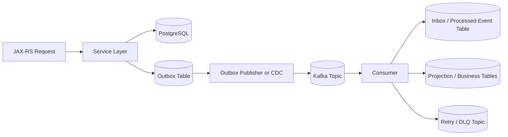

# Cheatsheet Kafka Part 044 — Testing Kafka-Based Systems

## 1. Core idea

Kafka testing is not just proving that one service can produce and another service can consume.

That is the easiest part.

The real goal is to prove that the system remains correct under:

- duplicate delivery,
- retry,
- rebalance,
- partial failure,
- serialization failure,
- schema evolution,
- delayed processing,
- out-of-order events,
- poison events,
- DLQ replay,
- offset reset,
- application crash,
- database transaction boundary failure,
- CDC connector lag,
- broker/network instability,
- deployment restart,
- production-like load.

For enterprise Java/JAX-RS systems, Kafka tests must cover the full path:



A useful Kafka test suite does not only ask: "was the event sent?"

It asks: "is the event flow correct when the infrastructure behaves like a distributed system?"

---

## 2. Testing layers

Kafka-based systems need multiple testing layers.

| Layer | Purpose | Example |
|---|---|---|
| Unit test | Validate pure logic fast | Event mapping, partition key selection, idempotency function |
| Component test | Validate service module with mocked boundaries | Producer wrapper behavior, consumer handler behavior |
| Integration test | Validate real Kafka/DB interaction | Produce event, consume event, write PostgreSQL |
| Contract test | Validate event schema compatibility | Avro/JSON Schema/Protobuf compatibility |
| End-to-end test | Validate business flow across services | Quote submitted → order created → projection updated |
| Load test | Validate throughput and latency | 10k events/minute with target lag |
| Chaos/failure test | Validate resilience | kill consumer during DB transaction |
| Replay test | Validate reprocessing safety | reset offset and replay topic window |
| Operational test | Validate runbook | DLQ replay, connector restart, lag alert |

Do not force every test to be end-to-end. E2E tests are expensive and slow.

The best strategy is a pyramid with targeted, high-value integration and failure tests.

---

## 3. Unit testing producers

Producer unit tests should not require a Kafka broker.

Test the logic that decides what will be produced.

### 3.1 What to test

- event type,
- event version,
- event ID generation,
- aggregate ID,
- partition key,
- correlation ID,
- causation ID,
- tenant ID,
- actor/user metadata,
- schema mapping,
- payload field correctness,
- header propagation,
- timestamp strategy,
- idempotency key,
- behavior when optional fields are absent.

### 3.2 Producer mapping test example

```java
class OrderEventMapperTest {

    @Test
    void mapsOrderSubmittedEventWithRequiredMetadata() {
        Order order = new Order("order-123", "tenant-9", OrderStatus.SUBMITTED);
        RequestContext context = new RequestContext(
            "correlation-1",
            "causation-1",
            "user-42"
        );

        OrderSubmittedEvent event = mapper.toOrderSubmitted(order, context);

        assertThat(event.eventId()).isNotBlank();
        assertThat(event.aggregateId()).isEqualTo("order-123");
        assertThat(event.tenantId()).isEqualTo("tenant-9");
        assertThat(event.correlationId()).isEqualTo("correlation-1");
        assertThat(event.causationId()).isEqualTo("causation-1");
        assertThat(event.eventType()).isEqualTo("OrderSubmitted");
        assertThat(event.eventVersion()).isEqualTo(1);
    }
}
```

### 3.3 Partition key test

Partition key is not incidental. It encodes ordering and scaling semantics.

```java
@Test
void usesOrderIdAsPartitionKeyToPreserveOrderLevelOrdering() {
    OrderSubmittedEvent event = new OrderSubmittedEvent("order-123", "tenant-9");

    String key = partitionKeyResolver.resolve(event);

    assertThat(key).isEqualTo("order-123");
}
```

If someone changes the partition key from order ID to random UUID, tests should fail.

---

## 4. Unit testing consumers

Consumer unit tests should focus on handler behavior independent of Kafka client mechanics.

### 4.1 What to test

- valid event processing,
- duplicate event handling,
- stale event handling,
- unsupported event version,
- missing required metadata,
- invalid state transition,
- retryable exception classification,
- non-retryable exception classification,
- DLQ payload construction,
- external call idempotency key,
- database write command generation.

### 4.2 Consumer handler test example

```java
@Test
void ignoresDuplicateEventAlreadyRecordedInInbox() {
    OrderSubmittedEvent event = event("event-1", "order-123");
    when(inboxRepository.exists("event-1")).thenReturn(true);

    ConsumerResult result = handler.handle(event);

    assertThat(result).isEqualTo(ConsumerResult.duplicateIgnored());
    verify(orderRepository, never()).updateStatus(any(), any());
}
```

### 4.3 State transition test

```java
@Test
void rejectsInvalidBackwardStateTransition() {
    Order order = new Order("order-123", OrderStatus.COMPLETED);
    OrderCancelledEvent event = cancelledEvent("event-9", "order-123");

    assertThatThrownBy(() -> stateMachine.apply(order, event))
        .isInstanceOf(InvalidStateTransitionException.class);
}
```

This is Kafka testing even though no Kafka broker appears in the test.

Correctness starts in domain logic.

---

## 5. Contract testing event schema

Event schema tests prevent producer teams from breaking consumers.

### 5.1 What contract tests should catch

- removing required fields,
- renaming fields,
- changing field type,
- changing enum semantics,
- changing default values incorrectly,
- adding required fields without default,
- changing nested schema incompatibly,
- changing subject naming strategy,
- violating compatibility mode.

### 5.2 Compatibility direction

For event streaming, backward compatibility is commonly required because new consumers should read old data or old consumers should survive new producers depending on deployment order.

Be explicit:

| Compatibility type | Protects |
|---|---|
| Backward | New schema can read old data |
| Forward | Old schema can read new data |
| Full | Both backward and forward |
| None | No compatibility protection |

Do not assume one mode fits every topic.

### 5.3 Schema compatibility test in CI

A CI job should validate new schemas against existing registered schemas.

Pseudo-flow:

```text
1. Load schema changed in PR.
2. Resolve subject name.
3. Fetch latest schema from registry or checked-in baseline.
4. Run compatibility check.
5. Fail PR if incompatible.
6. Print exact breaking field/change.
```

### 5.4 Consumer-driven contract test

Consumer-driven event contract means consumers publish expectations.

Example expectations:

- event contains `eventId`,
- `aggregateId` is stable,
- `orderStatus` has known values,
- amount fields use decimal string, not float,
- event time uses ISO-8601 or epoch millis consistently,
- tenant ID is present,
- optional field behavior is defined.

This prevents producer-centric schema evolution from breaking business consumers.

---

## 6. Integration testing with Testcontainers Kafka

Testcontainers is useful because it starts real infrastructure for integration tests.

Typical stack:

- Kafka broker,
- PostgreSQL,
- Schema Registry if used,
- application under test,
- optionally Kafka Connect/Debezium.

### 6.1 What to validate with integration tests

- producer sends to real Kafka,
- consumer reads from real Kafka,
- serialization/deserialization works,
- headers are preserved,
- offset commit behavior is correct,
- DB transaction and consumer processing work together,
- outbox publisher publishes after commit,
- inbox prevents duplicate processing,
- retry/DLQ topic receives failed events,
- graceful shutdown does not lose in-flight records.

### 6.2 Testcontainers example shape

```java
@Testcontainers
class OrderEventIntegrationTest {

    @Container
    static KafkaContainer kafka = new KafkaContainer(
        DockerImageName.parse("apache/kafka-native:latest")
    );

    @Container
    static PostgreSQLContainer<?> postgres = new PostgreSQLContainer<>("postgres:16");

    @Test
    void consumesOrderSubmittedAndCreatesProjection() {
        // arrange DB schema and application config
        // produce event to Kafka
        // wait until consumer processes
        // assert projection row exists
    }
}
```

Pin container versions in real projects. Do not let `latest` silently change behavior in CI.

### 6.3 Waiting correctly

Kafka integration tests are asynchronous.

Avoid arbitrary sleeps.

Use polling assertions:

```java
await()
    .atMost(Duration.ofSeconds(10))
    .untilAsserted(() -> {
        OrderProjection row = projectionRepository.find("order-123");
        assertThat(row.status()).isEqualTo("SUBMITTED");
    });
```

Arbitrary sleeps make tests slow and flaky.

---

## 7. Embedded Kafka caveat

Embedded Kafka can be useful for quick tests in some frameworks, but it may diverge from real production behavior.

Risks:

- broker version mismatch,
- configuration mismatch,
- no realistic networking,
- no container boundary,
- no realistic startup/shutdown behavior,
- missing Schema Registry/Connect/CDC dependencies,
- hidden test framework behavior.

For serious production-oriented tests, Testcontainers or a controlled ephemeral environment is usually closer to reality.

Embedded Kafka is acceptable for fast feedback if the team understands its limits.

---

## 8. Testing outbox pattern

Outbox tests are critical because outbox exists to solve dual-write risk.

### 8.1 Core outbox tests

Test these cases:

1. Business row and outbox row are inserted in the same DB transaction.
2. If transaction rolls back, no outbox row remains.
3. Publisher only publishes committed outbox rows.
4. Publisher marks rows as published after successful Kafka send.
5. Publisher retries failed publish.
6. Publisher does not publish the same row concurrently from two workers.
7. Cleanup does not delete unpublished rows.
8. Event payload and metadata are stable.
9. Partition key is derived deterministically.
10. Serialization failure is handled after DB commit.

### 8.2 Transaction rollback test

```java
@Test
void doesNotCreateOutboxRowWhenBusinessTransactionRollsBack() {
    assertThatThrownBy(() -> service.createOrderAndFail(command))
        .isInstanceOf(SimulatedFailureException.class);

    assertThat(orderRepository.find(command.orderId())).isEmpty();
    assertThat(outboxRepository.findByAggregateId(command.orderId())).isEmpty();
}
```

### 8.3 Publish after commit test

```java
@Test
void publishesOutboxEventAfterBusinessCommit() {
    service.submitOrder(command);

    outboxPublisher.publishPendingBatch();

    await().untilAsserted(() -> {
        ConsumerRecord<String, String> record = testConsumer.readOne("orders.events.v1");
        assertThat(record.key()).isEqualTo(command.orderId());
    });
}
```

### 8.4 Concurrency test

If using polling publisher with `SKIP LOCKED`, test concurrent publishers.

Goal:

- two publisher instances run,
- each row is claimed once,
- no duplicate Kafka publish unless retry after unknown outcome is expected,
- published status is consistent.

---

## 9. Testing inbox/idempotency pattern

Inbox tests prove consumers can tolerate duplicates and replay.

### 9.1 Core inbox tests

Test these cases:

1. First event is processed and recorded.
2. Duplicate event ID is ignored.
3. Business write and inbox write are in the same transaction.
4. If business processing fails, inbox state does not falsely mark success.
5. Retryable failure remains retryable.
6. Permanent failure is recorded for DLQ/manual review.
7. Replay does not duplicate side effects.
8. Cleanup does not remove data needed for replay window.

### 9.2 Duplicate test

```java
@Test
void duplicateEventDoesNotCreateDuplicateProjection() {
    OrderSubmittedEvent event = event("event-1", "order-123");

    consumer.handle(event);
    consumer.handle(event);

    assertThat(projectionRepository.countByOrderId("order-123")).isEqualTo(1);
    assertThat(inboxRepository.find("event-1").status()).isEqualTo("PROCESSED");
}
```

### 9.3 Crash simulation

Simulate failure between DB write and offset commit.

Expected behavior:

- DB write succeeds,
- offset is not committed,
- event is delivered again,
- inbox detects duplicate,
- no duplicate business effect.

This is one of the most valuable Kafka consumer tests.

---

## 10. Testing retry and DLQ

Retry/DLQ tests prove failure handling is bounded and observable.

### 10.1 Core retry tests

Test:

- transient exception goes to retry,
- retry count increments,
- retry headers are preserved,
- backoff is applied,
- max retry sends to DLQ,
- non-retryable exception sends directly to DLQ,
- DLQ event contains enough metadata,
- poison event does not block healthy events forever,
- DLQ replay can route back safely.

### 10.2 Retry classification test

```java
@Test
void classifiesDatabaseTimeoutAsRetryable() {
    ProcessingException ex = new DatabaseTimeoutException("timeout");

    FailureClassification result = classifier.classify(ex);

    assertThat(result).isEqualTo(FailureClassification.RETRYABLE);
}
```

### 10.3 DLQ payload test

DLQ record should include:

- original topic,
- original partition,
- original offset,
- original key,
- original headers,
- event ID,
- error class,
- error message summary,
- retry count,
- failure timestamp,
- consumer group,
- source service.

Do not put unredacted secrets or sensitive PII into DLQ error fields.

---

## 11. Testing replay safety

Replay is where many event-driven systems fail.

### 11.1 Replay tests should validate

- consumer can reprocess old events,
- duplicate events are ignored or safely applied,
- state transitions reject stale events,
- external calls are not repeated unsafely,
- projections can rebuild from topic history,
- DLQ replay does not bypass validation,
- offset reset procedure is documented,
- replay metrics are visible.

### 11.2 Projection rebuild test

```text
1. Produce events E1, E2, E3 for order-123.
2. Let projection build current state.
3. Delete projection table.
4. Reset projection consumer offset to beginning.
5. Reprocess events.
6. Assert rebuilt projection equals expected final state.
```

### 11.3 Replay window test

If topic retention is 7 days but business requires 30-day rebuild, the test should reveal the mismatch.

Testing replay is also testing retention policy.

---

## 12. Testing ordering

Ordering bugs are subtle because happy-path tests often send one event at a time.

### 12.1 What to test

- same aggregate events use same partition key,
- consumer handles ordered events correctly,
- consumer rejects or buffers out-of-order events if needed,
- partition count changes do not silently break assumptions,
- concurrent producers do not emit conflicting sequence,
- replay preserves expected semantics,
- stale event does not overwrite newer state.

### 12.2 Out-of-order test

```java
@Test
void staleEventDoesNotOverwriteNewerOrderState() {
    consumer.handle(orderCompleted("event-2", "order-123", 2));
    consumer.handle(orderSubmitted("event-1", "order-123", 1));

    OrderProjection projection = projectionRepository.find("order-123");

    assertThat(projection.status()).isEqualTo("COMPLETED");
    assertThat(projection.version()).isEqualTo(2);
}
```

If the domain requires strict ordering, a version/sequence guard should exist.

---

## 13. Testing consumer rebalance behavior

Consumer rebalance can expose duplicate processing and shutdown bugs.

### 13.1 What to test

- graceful shutdown commits or does not commit correctly,
- in-flight records complete before shutdown deadline,
- partitions are revoked safely,
- pause/resume behavior works,
- long processing does not exceed `max.poll.interval.ms`,
- duplicate after rebalance is safe,
- consumer does not process records after losing ownership.

### 13.2 Rebalance simulation

In integration tests:

1. Start consumer A.
2. Produce records.
3. Start consumer B in same group.
4. Force rebalance.
5. Verify no lost records.
6. Verify duplicates are safe if they occur.
7. Verify final database state.

This test is especially valuable for consumers that process batches or use external executors.

---

## 14. Testing serialization and deserialization failure

Serialization failure occurs on producer side.

Deserialization failure occurs on consumer side.

Both need tests.

### 14.1 Producer serialization failure

Test behavior when payload cannot be serialized:

- Does API fail before DB commit?
- If outbox is used, does failure occur in publisher?
- Is outbox row marked failed/retryable?
- Is error observable?
- Is invalid event blocked before publication?

### 14.2 Consumer deserialization failure

Deserialization failure can poison a partition because the consumer may not be able to construct the event object.

Test:

- invalid bytes,
- unknown schema ID,
- incompatible schema,
- missing required field,
- unknown enum,
- invalid JSON.

The system should have an explicit strategy:

- send raw record to DLQ if possible,
- skip with audit if allowed,
- stop consumer and alert,
- use error-handling deserializer if framework supports it.

Do not let deserialization failures spin forever without visibility.

---

## 15. Testing Schema Registry integration

If Schema Registry is used, test it as part of the integration boundary.

### 15.1 What to test

- producer registers or resolves schema,
- consumer resolves schema ID,
- compatibility mode rejects breaking changes,
- registry unavailable behavior,
- credentials failure,
- subject naming strategy,
- schema reference resolution,
- local/dev registry parity with production rules.

### 15.2 Registry unavailable test

Expected behavior differs by client config.

Test whether producer/consumer:

- fails fast,
- uses cached schema,
- retries,
- blocks request,
- sends to DLQ,
- emits useful metrics/logs.

Schema Registry outage can become Kafka outage if not understood.

---

## 16. Testing Kafka Connect

Kafka Connect tests are needed when connectors are part of the event pipeline.

### 16.1 Source connector tests

Validate:

- connector starts,
- tasks are assigned,
- source data becomes Kafka records,
- offsets are stored,
- schema/converter works,
- SMT transforms correctly,
- connector restart resumes from correct offset,
- error tolerance behaves as expected,
- DLQ receives bad records.

### 16.2 Sink connector tests

Validate:

- Kafka records become sink writes,
- duplicate records are idempotent or safe,
- connector commits offsets after sink write,
- sink failure triggers retry/DLQ,
- schema evolution is handled,
- connector scaling does not violate ordering assumptions.

### 16.3 Connector config test

Connector config should be validated as code.

Check:

- topic names,
- converter config,
- credentials references,
- DLQ config,
- error tolerance,
- task count,
- transforms,
- environment-specific endpoints.

---

## 17. Testing CDC and Debezium

CDC tests validate database-to-Kafka correctness.

### 17.1 Core CDC tests

Test:

- initial snapshot,
- insert/update/delete events,
- outbox Event Router transformation,
- transaction ordering,
- schema change handling,
- tombstone behavior,
- connector restart,
- replication slot lag observability,
- incremental snapshot if used,
- duplicate handling after restart.

### 17.2 Outbox Event Router test

Validate:

- outbox row becomes correct topic,
- aggregate ID becomes key,
- payload is extracted correctly,
- headers are populated,
- event type is preserved,
- metadata is not lost,
- tombstone behavior is understood.

### 17.3 CDC failure test

Simulate connector stop:

1. Stop Debezium connector.
2. Insert outbox rows.
3. Observe replication slot lag or connector lag.
4. Restart connector.
5. Verify events are emitted once or duplicate-safe.
6. Verify WAL retention does not break.

---

## 18. Testing JAX-RS to Kafka flow

For Java/JAX-RS services, test HTTP command to asynchronous event lifecycle.

### 18.1 What to test

- API accepts valid command,
- transaction writes business data and outbox,
- event is eventually published,
- response status matches async semantics,
- idempotency key prevents duplicate command,
- correlation ID propagates to event,
- status endpoint reflects pending/completed state,
- error response is honest when event cannot be accepted,
- downstream consumer updates projection.

### 18.2 202 Accepted test

```text
1. POST /orders with idempotency key.
2. Assert HTTP 202 Accepted.
3. Assert response includes operation/status ID.
4. Wait for event publication and consumer processing.
5. GET /operations/{id} or /orders/{id}/status.
6. Assert terminal state.
```

This tests the contract between synchronous HTTP and asynchronous Kafka processing.

---

## 19. Testing performance and load

Kafka load testing should be realistic.

### 19.1 What to measure

- producer throughput,
- producer latency,
- batch size effectiveness,
- compression impact,
- broker CPU,
- broker disk IO,
- broker network IO,
- consumer processing rate,
- consumer lag growth,
- end-to-end latency,
- partition skew,
- hot partitions,
- DLQ/retry rate under load,
- database write bottleneck,
- outbox lag,
- CDC lag.

### 19.2 Load test dimensions

Test different dimensions separately:

- message size,
- message rate,
- key distribution,
- partition count,
- consumer count,
- batch size,
- linger,
- compression type,
- database transaction cost,
- external API latency.

### 19.3 Load test failure criteria

Define failure before running the test.

Examples:

- p95 end-to-end latency > 5 seconds,
- consumer lag grows continuously for 15 minutes,
- DLQ rate > 0.1%,
- broker disk utilization > 80%,
- outbox lag > 2 minutes,
- rebalance rate > threshold,
- CPU throttling observed in Kubernetes.

---

## 20. Testing chaos and failure modes

Chaos tests should be controlled and targeted.

### 20.1 Useful failure scenarios

- kill consumer pod during processing,
- kill producer pod after DB commit before publish,
- pause Kafka broker/network,
- make Schema Registry unavailable,
- introduce invalid schema,
- slow down database,
- stop Debezium connector,
- fill retry topic with poison event,
- force consumer rebalance storm,
- expire Kafka credential in test environment,
- throttle CPU on consumer pod,
- reduce available partitions or simulate broker unavailability.

### 20.2 What to assert

After failure injection, assert:

- no business data corruption,
- no unbounded retry storm,
- no silent message loss,
- duplicates are safe,
- lag is visible,
- alerts fire,
- runbook steps work,
- system recovers after dependency returns,
- manual repair path is known if recovery is not automatic.

Chaos testing without assertions is just disruption.

---

## 21. Test data management

Kafka tests need deterministic data.

### 21.1 Event IDs

Use stable test event IDs where idempotency matters.

Avoid random IDs in tests unless testing uniqueness behavior.

### 21.2 Topic isolation

Avoid tests sharing topic/group state unexpectedly.

Options:

- unique topic per test class,
- unique consumer group per test,
- cleanup topics after test,
- reset offsets deliberately,
- isolated Kafka container per test suite.

### 21.3 Database isolation

Use:

- transaction rollback for unit/component tests,
- schema-per-test where needed,
- cleanup scripts,
- Testcontainers database reset,
- deterministic fixtures.

### 21.4 Time control

Event-driven tests often depend on time.

Control:

- event time,
- processing time,
- retry delay,
- backoff,
- windowing time,
- timeout behavior.

Inject a clock where possible.

---

## 22. CI strategy

Kafka tests can become slow and flaky if not organized.

### 22.1 Suggested CI stages

| Stage | Tests | Frequency |
|---|---|---|
| Fast PR | Unit + schema compatibility + mapper/handler tests | Every PR |
| Integration PR | Testcontainers Kafka/PostgreSQL focused tests | Every PR or selected paths |
| Contract gate | Producer/consumer schema contract | Every PR touching schema/event |
| Nightly | E2E, replay, ordering, CDC, Connect | Nightly |
| Performance | Load tests | Scheduled or release gate |
| Chaos/game day | Failure tests | Scheduled/manual controlled |

### 22.2 Flakiness control

Common causes of flaky Kafka tests:

- arbitrary sleeps,
- shared consumer group IDs,
- reused topics without cleanup,
- racing startup sequence,
- slow CI machines,
- unpinned container versions,
- background consumers from previous tests,
- assertions before async processing completes,
- hidden dependency on wall-clock time.

Use polling assertions, unique test resources, and explicit startup readiness.

---

## 23. Observability in tests

Tests should assert observability where possible.

Examples:

- producer error metric increments,
- consumer processing latency metric exists,
- DLQ publish metric increments,
- retry count metric increments,
- consumer lag can be measured,
- correlation ID appears in logs,
- trace context propagates,
- outbox lag gauge exists,
- CDC lag metric exists.

A system that works but cannot be observed is not production-ready.

---

## 24. Security testing

Kafka security tests should cover both connectivity and authorization.

### 24.1 What to test

- TLS truststore works,
- invalid certificate fails,
- SASL/SCRAM credentials work,
- expired credential fails clearly,
- producer cannot write unauthorized topic,
- consumer cannot read unauthorized topic,
- consumer group ACL is required,
- Schema Registry auth is enforced,
- secrets are not logged,
- DLQ does not leak sensitive data.

### 24.2 Least privilege test

A useful test is negative authorization:

```text
Given producer credential for orders.events.v1
When service attempts to write billing.events.v1
Then Kafka authorization fails
And error is logged without leaking secret
And alert/metric is emitted
```

This proves ACLs are meaningful.

---

## 25. Production readiness test matrix

Use this matrix for each important event flow.

| Concern | Test exists? | Evidence |
|---|---:|---|
| Producer mapping | Yes/No | Unit test |
| Partition key | Yes/No | Unit test |
| Schema compatibility | Yes/No | CI contract test |
| Outbox transaction | Yes/No | Integration test |
| Consumer idempotency | Yes/No | Integration test |
| Retry/DLQ | Yes/No | Failure test |
| Replay safety | Yes/No | Replay test |
| Ordering/stale event | Yes/No | Ordering test |
| Rebalance safety | Yes/No | Integration/failure test |
| Serialization failure | Yes/No | Failure test |
| Schema Registry outage | Yes/No | Failure test |
| CDC/Connect behavior | Yes/No | Integration test |
| Load/lag behavior | Yes/No | Load test |
| Observability | Yes/No | Metric/log assertion |
| Security/ACL | Yes/No | Negative test |

A senior engineer should ask for this matrix during architecture or production readiness review.

---

## 26. Internal verification checklist

Use this checklist inside the actual CSG/team environment.

### 26.1 Test architecture

- Verify which Kafka test strategy is used: mocks, embedded Kafka, Testcontainers, shared dev cluster, ephemeral environment.
- Verify whether PostgreSQL is included in integration tests.
- Verify whether Schema Registry is included in tests.
- Verify whether Kafka Connect/Debezium is testable locally or in CI.
- Verify whether test topic/group naming prevents collisions.

### 26.2 Producer tests

- Verify event mapper tests.
- Verify partition key tests.
- Verify metadata/header propagation tests.
- Verify correlation/causation/trace ID tests.
- Verify serialization failure tests.
- Verify outbox write tests.

### 26.3 Consumer tests

- Verify handler unit tests.
- Verify idempotency/inbox tests.
- Verify duplicate event tests.
- Verify stale/out-of-order event tests.
- Verify offset commit behavior tests.
- Verify crash/restart tests.
- Verify external side-effect idempotency tests.

### 26.4 Schema and contract tests

- Verify schema compatibility check in CI.
- Verify event contract documentation.
- Verify consumer-driven contract tests if used.
- Verify schema registry subject naming tests.
- Verify breaking change prevention.

### 26.5 Retry, DLQ, replay

- Verify retry classification tests.
- Verify DLQ payload tests.
- Verify retry budget/max retry tests.
- Verify manual replay tests.
- Verify projection rebuild tests.
- Verify offset reset procedure tests.

### 26.6 CDC and Connect

- Verify Debezium connector tests if CDC is used.
- Verify outbox Event Router tests.
- Verify connector restart/resume tests.
- Verify connector DLQ tests.
- Verify replication slot lag monitoring tests or checks.

### 26.7 Performance and operations

- Verify load test scripts.
- Verify consumer lag test.
- Verify partition skew test.
- Verify CPU/memory resource behavior in Kubernetes.
- Verify graceful shutdown/rebalance test.
- Verify observability assertions.
- Verify runbook/game day history.

---

## 27. PR review checklist

When reviewing Kafka-related PRs, ask:

- Are producer mapping and metadata covered by tests?
- Is partition key behavior tested?
- Does the PR change schema? If yes, is compatibility checked?
- Does consumer processing have duplicate/replay tests?
- Is offset commit behavior tested indirectly or directly?
- Are retryable and non-retryable failures tested?
- Does DLQ payload include enough context?
- Is outbox transaction behavior tested?
- Is inbox/idempotency behavior tested?
- Are serialization/deserialization failures tested?
- Does the code have integration tests with real Kafka where needed?
- Are asynchronous assertions stable, or do they rely on sleeps?
- Are topic/group names isolated in tests?
- Are observability metrics/logs tested for critical failures?
- Is there a replay or data repair test for critical flows?
- Are external side effects protected by idempotency tests?

---

## 28. Common anti-patterns

### 28.1 Only testing happy-path produce/consume

This proves plumbing, not correctness.

### 28.2 Mocking Kafka everywhere

Mocks are useful for unit tests, but they cannot reveal serialization, offset, rebalance, broker, or async timing issues.

### 28.3 Using sleep instead of polling assertions

This creates slow and flaky tests.

### 28.4 No duplicate event tests

At-least-once delivery means duplicates are not edge cases. They are expected cases.

### 28.5 No schema compatibility gate

A schema change can break production consumers even when producer tests pass.

### 28.6 No replay test

If replay is part of the operational story, it must be tested.

### 28.7 Shared consumer group across tests

This causes hidden offset pollution and flaky results.

### 28.8 No failure assertions

Killing a pod is not a chaos test unless the expected safety properties are asserted.

---

## 29. Senior engineer mental model

A Kafka test suite should prove four things:

1. **Contract correctness**: events are well-shaped, compatible, versioned, and documented.
2. **Processing correctness**: producer/consumer logic handles state, idempotency, ordering, and failures.
3. **Infrastructure correctness**: Kafka, DB, Schema Registry, Connect, and Kubernetes behavior are represented enough to catch real issues.
4. **Operational correctness**: retry, DLQ, replay, lag, observability, and runbooks are testable.

Testing Kafka well means testing the seams.

The dangerous bugs live between:

- HTTP and transaction boundary,
- DB commit and event publish,
- event consume and offset commit,
- schema evolution and deserialization,
- retry and duplicate processing,
- replay and side effects,
- Kubernetes restart and rebalance,
- CDC offset and WAL retention.

---

## 30. Key takeaways

- Kafka tests must go beyond happy-path produce/consume.
- Unit tests should cover mapping, metadata, partition key, idempotency, and state transitions.
- Integration tests should use real Kafka/DB where correctness depends on infrastructure behavior.
- Contract tests prevent schema changes from breaking consumers.
- Outbox/inbox tests are mandatory for serious reliability.
- Retry/DLQ/replay tests prove failure handling is bounded and safe.
- Rebalance, crash, and offset tests expose real production failure modes.
- Load tests must include consumer lag, DB bottlenecks, partition skew, and end-to-end latency.
- Observability and security should be tested, not assumed.
- A good Kafka test suite is a production-readiness asset.

