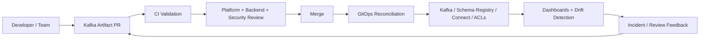
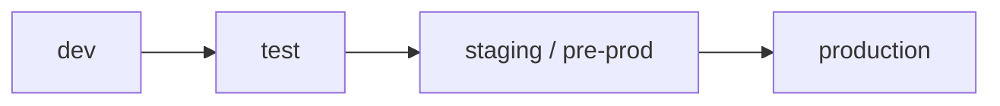
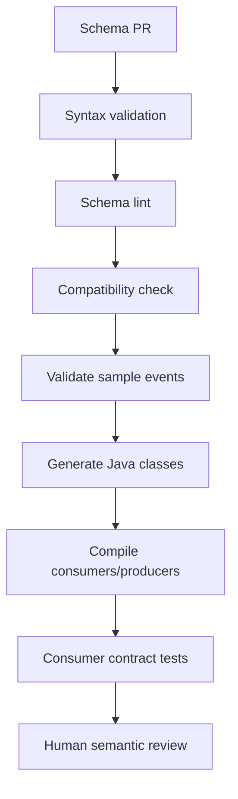
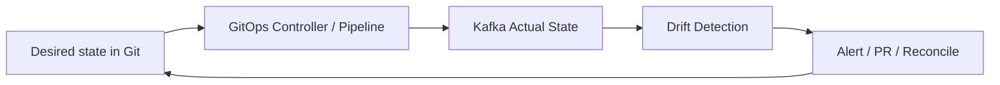
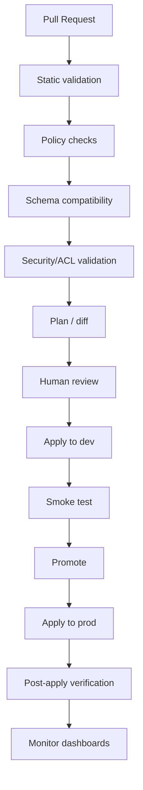

# Cheatsheet Kafka Part 045 — CI/CD and GitOps for Kafka Artifacts

## 1. Core idea

Kafka artifacts are not just infrastructure details.

They are production contracts.

A topic name, partition count, retention policy, compaction setting, schema compatibility mode, connector configuration, ACL, consumer group permission, or DLQ topic convention can change system behavior as much as application code.

In enterprise Java/JAX-RS systems, Kafka changes should therefore follow the same discipline as code changes:

- reviewed,
- versioned,
- validated,
- promoted through environments,
- auditable,
- reversible where possible,
- tied to ownership,
- protected from unsafe production drift.

The goal of CI/CD and GitOps for Kafka is not only automation.

The real goal is **change safety**.



A good Kafka delivery process prevents these production failures:

- a breaking schema reaches production before all consumers are ready,
- a topic is created manually with the wrong retention,
- partition count is increased without ordering review,
- an ACL grants too much access,
- a connector starts with the wrong converter,
- a sink connector writes duplicate records,
- a retry/DLQ topic is missing,
- a config drift hides until incident time,
- rollback is impossible because schema compatibility was misunderstood.

---

## 2. What counts as a Kafka artifact?

A Kafka artifact is any durable configuration or contract that affects event flow.

| Artifact | Example | Why it matters |
|---|---|---|
| Topic definition | name, partition count, replication factor | Controls ordering, parallelism, availability |
| Topic config | retention, compaction, segment size | Controls replay, storage, data loss risk |
| Event schema | Avro, Protobuf, JSON Schema | Defines producer-consumer contract |
| Schema Registry subject config | compatibility mode, subject naming | Controls schema evolution safety |
| Connector config | Debezium, source, sink, SMT, converter | Controls external data movement |
| ACL | topic read/write, group read, transactional ID | Controls blast radius and least privilege |
| Quota | producer/consumer throughput limits | Protects cluster capacity |
| Retry/DLQ topology | retry topics, DLQ topics, parking lot | Controls failure handling |
| ksqlDB query | persistent query, materialized view | Creates derived event/data contracts |
| Kafka Streams internal topic awareness | repartition/changelog topics | Affects state restoration and topology lifecycle |

Application code changes are incomplete if the required Kafka artifact changes are not delivered safely.

---

## 3. The anti-pattern: manual Kafka administration

Manual changes are tempting because they are fast.

They are also dangerous because they are invisible to review and hard to reproduce.

Common manual-change failures:

- creating a production topic from CLI with default retention,
- changing retention to unblock disk pressure without business approval,
- adding partitions without checking ordering assumptions,
- deleting or recreating a topic to “fix” a test environment,
- relaxing Schema Registry compatibility to push a release,
- restarting a connector without preserving its intended config,
- granting wildcard ACLs because a service cannot connect,
- creating DLQ topics ad hoc with inconsistent naming.

A senior engineer should treat manual Kafka changes as emergency exceptions, not normal workflow.

If a manual change is unavoidable, it should produce a follow-up artifact PR to reconcile desired state.

---

## 4. Topic as code

Topic as code means topic definitions live in a repository and are applied by pipeline or GitOps controller.

A topic definition should capture at least:

- topic name,
- owning domain/team,
- purpose,
- producers,
- known consumers,
- partition count,
- replication factor,
- cleanup policy,
- retention time/size,
- compaction settings if applicable,
- expected throughput,
- expected event size,
- partition key strategy,
- security classification,
- environment mapping,
- DLQ/retry relationship,
- deprecation status.

Example shape, not a required internal CSG format:

```yaml
apiVersion: kafka.company.example/v1
kind: KafkaTopic
metadata:
  name: quote.lifecycle.events
spec:
  owner: quote-order-team
  purpose: "Integration events for quote lifecycle state changes"
  classification: internal-business-data
  partitions: 12
  replicationFactor: 3
  config:
    cleanup.policy: delete
    retention.ms: 1209600000
    min.insync.replicas: 2
  producers:
    - quote-service
  consumers:
    - order-service
    - audit-service
  partitionKey:
    field: quoteId
    reason: "Preserve ordering per quote aggregate"
```

The important part is not this exact YAML.

The important part is that topic configuration is intentional, reviewable, and traceable.

### Topic as code review questions

- Who owns this topic?
- Is the topic name stable and meaningful?
- Is this domain, integration, command, audit, retry, DLQ, or compacted topic?
- Why this partition count?
- What is the partition key?
- What ordering assumption exists?
- Is retention aligned with replay and audit needs?
- Is compaction appropriate?
- Are producer and consumer owners known?
- Does the topic need PII/privacy review?
- Is the topic created in all required environments?

---

## 5. Schema as code

Schema as code means event schemas are stored, reviewed, tested, and promoted like application code.

This applies to:

- Avro schemas,
- Protobuf schemas,
- JSON Schema files,
- AsyncAPI documents,
- schema compatibility configuration,
- schema linting rules,
- generated Java classes,
- schema documentation.

Schema changes are dangerous because they affect consumers that may be deployed independently from producers.

The CI pipeline should reject unsafe changes before they reach production.

### Schema change classification

| Change | Usually safe? | Notes |
|---|---:|---|
| Add optional field | Usually yes | Consumer must tolerate absence |
| Add field with default | Usually yes | Common Avro evolution path |
| Remove required field | Usually no | Existing consumers may depend on it |
| Rename field | Usually breaking | Often equivalent to remove + add |
| Change type | Usually breaking | Especially string ↔ number/object |
| Add enum value | Depends | Consumers may fail if enum handling is strict |
| Remove enum value | Depends | Historical events may still contain old value |
| Change semantic meaning | Breaking even if schema-compatible | CI cannot always detect this |

Schema compatibility checks are necessary but not sufficient.

Compatibility tools check structure.

Humans must still review semantics.

Example semantic breaking change:

```text
field: status
old meaning: quote workflow status
new meaning: commercial approval status
```

A schema tool may accept this.

A consumer may be silently corrupted.

---

## 6. Connector config as code

Kafka Connect connector config should not be edited manually in a UI and forgotten.

Connector configuration controls data movement between Kafka and external systems.

For source connectors, it controls what enters Kafka.

For sink connectors, it controls what leaves Kafka.

Connector config as code should capture:

- connector class,
- connector version,
- task count,
- source/sink endpoint reference,
- topic whitelist or routing rules,
- converter configuration,
- Schema Registry integration,
- SMT chain,
- error tolerance,
- DLQ topic,
- offset behavior,
- snapshot mode for CDC,
- secret references,
- restart policy,
- monitoring owner,
- upgrade notes.

For Debezium/PostgreSQL specifically, connector config should be reviewed for:

- database hostname/port reference,
- publication,
- replication slot,
- snapshot mode,
- table include/exclude list,
- heartbeat interval,
- tombstone behavior,
- outbox event router config,
- schema change event handling,
- transaction metadata handling,
- WAL retention risk.

### Connector config failure modes

| Failure | Cause | Impact |
|---|---|---|
| Connector starts snapshot unexpectedly | Wrong snapshot mode | Massive duplicate/backfill behavior |
| Connector misses table | Wrong include list | Missing events |
| Connector emits unexpected topic names | Wrong routing/SMT | Consumers fail or miss data |
| Sink connector duplicates writes | Non-idempotent sink | Data corruption |
| DLQ disabled | Error tolerance misconfigured | Connector stops on poison record |
| Converter mismatch | JSON/Avro/Protobuf config mismatch | Serialization failure |
| Offset reset accidentally | Connector recreated incorrectly | Duplicate or missing data |

---

## 7. ACL as code

Kafka ACLs define what principals can do.

They are security controls and operational guardrails.

ACL as code should define:

- service principal,
- topic read/write permission,
- consumer group permission,
- transactional ID permission if used,
- Schema Registry permission if applicable,
- Kafka Connect permission,
- environment scope,
- owner,
- expiration or review cadence for temporary access.

Least privilege examples:

| Service | Needed access | Suspicious access |
|---|---|---|
| Producer service | Write to owned event topic | Read all topics |
| Consumer service | Read from required topics and group | Write to source topic |
| DLQ publisher | Write to specific DLQ topic | Write wildcard topics |
| Kafka Streams app | Read/write internal topics for app ID | Broad cluster admin |
| Connector | Read/write specific source/sink topics | Wildcard admin |

The dangerous pattern is granting broad access to unblock deployment.

That often becomes permanent.

### ACL review questions

- Which service identity is used?
- Is the principal environment-specific?
- Does producer only write to allowed topics?
- Does consumer only read required topics?
- Is consumer group permission scoped correctly?
- Are transactional IDs scoped if used?
- Are temporary permissions time-bound?
- Is access audited?

---

## 8. Environment promotion

Kafka artifacts should move through environments deliberately.

Typical path:



But Kafka promotion has a nuance: producers and consumers may not be deployed together.

A safe rollout often requires this sequence:

1. Add backward-compatible schema.
2. Deploy tolerant consumers.
3. Deploy producer that emits new field or behavior.
4. Observe production behavior.
5. Deprecate old field only after all consumers migrate.
6. Remove old field much later, if ever.

This is different from a simple application release.

Kafka contracts live longer than code deploys.

---

## 9. Schema compatibility check in CI

A mature CI pipeline should run schema checks on every PR that changes schemas.

Checks may include:

- syntax validation,
- compatibility against latest registered schema,
- compatibility against all relevant historical versions,
- generated Java code compilation,
- schema linting,
- required metadata validation,
- AsyncAPI validation,
- example event fixture validation,
- consumer contract test execution.

Example conceptual pipeline:



CI should block obvious structural breakage.

Reviewers should catch semantic breakage.

---

## 10. Topic config validation

Topic config should be validated before apply.

Validation examples:

- partition count must be positive,
- replication factor must meet environment minimum,
- production topics must not use single replica,
- retention must be explicitly set,
- compacted topics must have stable non-null keys,
- DLQ topics must have longer retention than retry topics,
- audit topics must meet business retention requirement,
- topic name must match naming convention,
- owner must be declared,
- classification must be declared,
- partition key rationale must be documented.

A topic without owner is future incident debt.

A topic without retention rationale is future data loss or storage incident debt.

---

## 11. Connector config validation

Connector validation should catch dangerous misconfiguration before deployment.

Minimum checks:

- connector class exists,
- connector version is approved,
- required secrets are referenced but not committed,
- converter config matches schema strategy,
- topic routing rules match naming convention,
- error tolerance and DLQ policy are explicit,
- task count is within operational limits,
- Debezium slot/publication naming is valid,
- snapshot mode is approved,
- sink connector idempotency is understood,
- config does not point to production from non-production environment.

The last one matters.

A connector pointing to the wrong database is not a Kafka bug.

It is a release governance failure.

---

## 12. Breaking change prevention

Breaking change prevention is the central goal of Kafka artifact CI.

Breaking changes can happen in several layers.

| Layer | Breaking change example |
|---|---|
| Topic | Rename topic without bridge |
| Partitioning | Change key from `quoteId` to `tenantId` |
| Schema | Remove required field |
| Semantics | Reuse event type for different business meaning |
| Retention | Reduce retention below replay requirement |
| Compaction | Enable compaction on event history topic |
| ACL | Remove consumer permission before migration |
| Connector | Change SMT routing output topic |
| ksqlDB | Drop persistent query feeding downstream |

A breaking change should require explicit migration design.

Not just a PR approval.

---

## 13. GitOps reconciliation

GitOps means the repository is the desired state and automation reconciles actual state toward it.

For Kafka, GitOps may apply to:

- topics,
- topic configs,
- ACLs,
- schemas,
- connectors,
- ksqlDB queries,
- Kafka Connect worker deployment,
- Kubernetes manifests for Kafka clients,
- monitoring/alert definitions.

The reconciliation loop should answer:

- what changed,
- who changed it,
- when it was applied,
- whether apply succeeded,
- whether actual state drifted,
- whether rollback is possible.



GitOps does not remove the need for review.

It makes review enforceable.

---

## 14. Drift detection

Drift is when actual Kafka state differs from declared desired state.

Drift can happen because of:

- emergency manual changes,
- failed reconciliation,
- tool bugs,
- environment bootstrap differences,
- cluster migration,
- manual connector restart/edit,
- Schema Registry compatibility changed outside pipeline,
- ACL change through platform console.

Drift detection should compare at least:

- topic existence,
- topic config,
- partition count,
- retention,
- cleanup policy,
- schema version and compatibility,
- connector config,
- connector status,
- ACLs.

Drift is not always bad.

Untracked drift is bad.

Emergency drift should be reconciled into Git after incident mitigation.

---

## 15. Rollback strategy

Kafka rollback is harder than application rollback.

Some changes are reversible.

Some are not practically reversible.

| Change | Rollback difficulty | Notes |
|---|---:|---|
| Add optional schema field | Low | Producer can stop writing it |
| Add new topic | Low | Stop using it if no data dependency |
| Change ACL | Medium | Restore previous permission carefully |
| Change connector config | Medium/high | Offset and external side effects matter |
| Increase partitions | High | Cannot simply decrease partitions |
| Reduce retention | High | Deleted data cannot be recovered from topic |
| Change event semantics | Very high | Consumers may already have acted |
| Sink connector duplicate writes | Very high | Requires data repair |

Do not approve a Kafka artifact change unless rollback or roll-forward is understood.

For many Kafka changes, the safer strategy is not rollback.

It is staged rollout with compatibility.

---

## 16. Schema rollback challenge

Schema rollback is often misunderstood.

If a new schema version is registered and producers start writing events with that version, rolling back producer code may not erase already-written events.

Consumers may still encounter those events during replay.

Questions before schema rollback:

- Were events with the new schema already produced?
- Are they retained in Kafka?
- Can old consumers deserialize them?
- Are DLQ records produced because of this schema?
- Do projections need repair?
- Is a compensating schema needed?
- Is a new version safer than deleting/reverting?

Schema evolution should be treated as append-only history.

You can stop using a schema.

You cannot pretend it never existed if events were produced.

---

## 17. Multi-environment topic naming

There are two common approaches:

### Environment encoded in cluster

```text
dev cluster: quote.lifecycle.events
prod cluster: quote.lifecycle.events
```

### Environment encoded in topic name

```text
dev.quote.lifecycle.events
prod.quote.lifecycle.events
```

Neither is universally correct.

The decision depends on cluster topology, tenancy, platform conventions, security boundaries, and operational tooling.

What matters is consistency.

Review questions:

- Is environment represented by cluster, namespace, prefix, or account/subscription?
- Can a non-prod client accidentally connect to prod topic?
- Are ACLs environment-scoped?
- Are dashboards environment-aware?
- Are connector configs environment-safe?
- Are schema registry subjects environment-separated?

---

## 18. Approval workflow

Kafka artifact changes often require cross-functional review.

Typical reviewers:

- backend service owner,
- event owner,
- consumer owner,
- platform/SRE,
- security,
- data/analytics team if downstream data is affected,
- DBA if CDC/outbox/PostgreSQL is involved,
- product/domain owner for business semantics.

Approval should be risk-based.

Small non-breaking schema addition should not need the same ceremony as changing partitioning for a critical order lifecycle topic.

### Risk levels

| Risk | Example | Review depth |
|---|---|---|
| Low | Add optional field | Schema owner + CI |
| Medium | New topic with known consumers | Backend + platform |
| High | Partition key change | Architecture review |
| High | Connector source database change | Platform + DBA + backend |
| Critical | Retention reduction on audit topic | Architecture + compliance + SRE |

---

## 19. CI/CD pipeline design

A practical Kafka artifact pipeline should have stages like this:



Post-apply verification should check:

- topic exists,
- config matches desired state,
- schema version registered,
- compatibility mode correct,
- connector running,
- tasks running,
- ACL effective,
- producer/consumer smoke test passes,
- no unexpected DLQ spike,
- no consumer lag regression.

---

## 20. Git repository organization

One possible repository layout:

```text
kafka-artifacts/
  topics/
    quote/
      quote.lifecycle.events.yaml
      quote.lifecycle.events.dlq.yaml
  schemas/
    quote/
      QuoteLifecycleEvent.avsc
      QuoteLifecycleEvent.examples.json
  connectors/
    debezium/
      quote-outbox-connector.yaml
  acls/
    quote-service.yaml
    order-service.yaml
  policies/
    topic-policy.yaml
    schema-policy.yaml
  environments/
    dev/
    test/
    staging/
    prod/
```

This is only an example.

The invariant is more important than the folder structure:

> Every Kafka artifact must have a clear owner, desired state, validation path, promotion path, and rollback/roll-forward story.

---

## 21. How this affects Java/JAX-RS services

A Java/JAX-RS service that produces or consumes Kafka events depends on artifact delivery.

Application PRs should not be reviewed in isolation.

When a service PR adds a producer, reviewers should ask:

- Is the topic already declared?
- Is the schema registered?
- Is the service principal allowed to write?
- Is the partition key documented?
- Is retention appropriate?
- Is the DLQ/retry topology defined?
- Are dashboards/alerts added?
- Is there a consumer migration plan?

When a service PR adds a consumer, reviewers should ask:

- Does the service principal have read permission?
- Is the consumer group naming approved?
- Is the schema compatible?
- Is idempotency implemented?
- Is replay safe?
- Is lag observable?
- Is the DLQ handling path declared?

Kafka artifact delivery and application delivery are one release system.

Treating them separately creates production gaps.

---

## 22. How this affects PostgreSQL, MyBatis, and CDC

Kafka artifact CI/CD must account for database coupling when outbox or CDC exists.

Examples:

- outbox table schema migration must be deployed before outbox publisher expects new columns,
- Debezium connector include list must match migrated tables,
- replication slot must exist and be monitored,
- schema change events may affect downstream consumers,
- MyBatis transaction boundary must insert outbox rows before CDC expects them,
- JSONB payload shape must match schema registry contract,
- sink connector writes may require target DB migration before connector update.

A Kafka artifact PR may require a database migration PR.

A database migration PR may require a Kafka artifact PR.

Senior review should connect both.

---

## 23. How this affects Kubernetes, AWS, Azure, on-prem, and hybrid

Kafka artifact delivery differs by environment.

| Environment | Artifact concern |
|---|---|
| Kubernetes | GitOps controller, secrets, NetworkPolicy, client deployment order |
| AWS/MSK | IAM/SCRAM/TLS, security groups, MSK Connect, CloudWatch integration |
| Azure/Event Hubs-compatible endpoint | Kafka compatibility limits, private endpoint, Azure Monitor |
| On-prem | certificate lifecycle, firewall, patching, manual ops risk |
| Hybrid | cross-boundary connectivity, replication, environment naming, DR |

Artifact as code should not hide environment-specific risk.

It should make it visible.

---

## 24. Common failure modes

| Failure mode | Detection | Prevention |
|---|---|---|
| Topic missing in prod | Producer `UNKNOWN_TOPIC_OR_PARTITION` | Topic as code + predeploy validation |
| Wrong retention | Config diff / data loss / storage spike | Topic policy checks |
| Breaking schema | Deserialization failures / DLQ spike | CI compatibility + semantic review |
| Wrong ACL | Authorization failure | ACL as code + smoke test |
| Connector drift | Connector config diff | GitOps reconciliation |
| Wrong snapshot mode | Unexpected event flood | Connector policy gate |
| Partition change breaks ordering | Out-of-order processing | Partition key review gate |
| Manual prod change hidden | Drift detection alert | Reconcile desired state |
| Schema rollback fails | Consumers still see new events | Forward-compatible rollout |

---

## 25. Kafka artifact PR review checklist

Use this checklist when reviewing a Kafka artifact PR.

### Ownership

- [ ] Artifact owner is declared.
- [ ] Producing service is declared.
- [ ] Consuming services are declared where known.
- [ ] On-call/support owner is clear.

### Topic

- [ ] Topic name follows convention.
- [ ] Topic purpose is clear.
- [ ] Partition count is justified.
- [ ] Partition key is documented.
- [ ] Ordering assumption is documented.
- [ ] Retention/compaction policy is intentional.
- [ ] DLQ/retry relationship is defined where needed.

### Schema

- [ ] Schema change is compatibility-checked.
- [ ] Semantic meaning is reviewed.
- [ ] Example event is updated.
- [ ] Consumer impact is understood.
- [ ] Deprecation/migration plan exists if needed.

### Connector

- [ ] Connector config is stored as code.
- [ ] Converter/SMT config is reviewed.
- [ ] Error tolerance and DLQ are explicit.
- [ ] Offset/snapshot implications are understood.
- [ ] Secrets are referenced safely.

### ACL/security

- [ ] Service principal is correct.
- [ ] Topic permission is least privilege.
- [ ] Consumer group permission is scoped.
- [ ] Transactional ID permission is scoped if applicable.
- [ ] Temporary access has expiry/review path.

### CI/CD/GitOps

- [ ] CI validation passes.
- [ ] Plan/diff is reviewed.
- [ ] Promotion order is safe.
- [ ] Drift detection is available.
- [ ] Rollback or roll-forward path is documented.

---

## 26. Internal verification checklist

Verify these in the internal CSG/team environment before applying the concepts directly:

- [ ] Where Kafka topic definitions live, if they are managed as code.
- [ ] Whether topic creation is manual, pipeline-driven, operator-driven, or platform-ticket-driven.
- [ ] Naming convention for topics, retry topics, DLQ topics, compacted topics, and audit topics.
- [ ] Whether schemas live in service repositories, central schema repository, or registry-only workflow.
- [ ] Schema Registry compatibility mode per subject or global default.
- [ ] CI checks for Avro/Protobuf/JSON Schema compatibility.
- [ ] AsyncAPI or event catalog usage.
- [ ] Kafka Connect connector config repository and promotion process.
- [ ] Debezium connector deployment and config ownership.
- [ ] ACL management process and service principal convention.
- [ ] GitOps repository for Kafka artifacts, if present.
- [ ] Drift detection mechanism for topics, schemas, connectors, and ACLs.
- [ ] Rollback/roll-forward procedure for schema, topic config, connector config, and ACL changes.
- [ ] Environment promotion path across dev/test/staging/prod.
- [ ] Approval workflow for high-risk event contract changes.
- [ ] Production incident history caused by Kafka artifact drift or unsafe changes.

---

## 27. Senior engineer takeaway

Kafka CI/CD is not only about automating `kafka-topics.sh` or registering schemas automatically.

It is about preventing uncontrolled changes to distributed contracts.

A senior engineer should ask:

- Is this Kafka change versioned?
- Is it reviewed by the right owners?
- Is compatibility proven?
- Is the environment promotion safe?
- Is the actual state reconciled with desired state?
- Is rollback realistic?
- Is there observability after apply?
- Can this change create duplicate, missing, out-of-order, unauthorized, or unreadable events?

The best Kafka artifact pipeline is not the fastest one.

It is the one that makes dangerous changes hard to ship accidentally.
