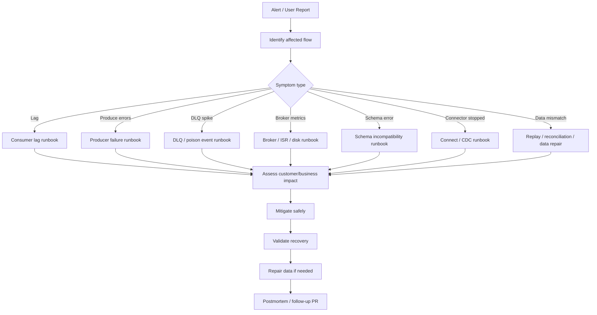
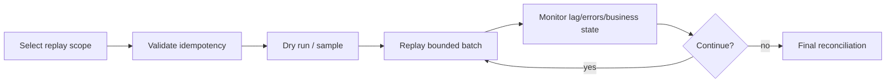

# Cheatsheet Kafka Part 046 — Operational Runbook

## 1. Core idea

A Kafka runbook is not a list of commands.

A good runbook is a decision system for production incidents.

It should help engineers answer, under pressure:

- what is broken,
- who is affected,
- whether data is missing, delayed, duplicated, or corrupted,
- what can be safely mitigated,
- what must not be touched,
- who must be notified,
- what evidence must be preserved,
- what repair or replay is required after mitigation.

Kafka incidents are dangerous because many symptoms look operational but have data-correctness impact.

Consumer lag may be only delay.

Or it may mean order state is stale, fulfillment is blocked, billing is not triggered, audit events are delayed, or downstream projections are wrong.

The operational question is never just:

> Is Kafka healthy?

The better question is:

> Which business event flow is delayed, duplicated, missing, unreadable, or unsafe to process?

---

## 2. Runbook principles

### Principle 1: Do not destroy evidence

Do not purge topics, delete DLQ records, reset offsets, recreate connectors, or delete replication slots before capturing evidence.

Minimum evidence:

- time window,
- affected topic,
- affected partition,
- consumer group,
- lag trend,
- latest offsets,
- error logs,
- DLQ sample,
- schema version,
- producer error rate,
- broker health,
- connector status,
- deployment changes,
- related database changes.

### Principle 2: Separate mitigation from repair

Mitigation reduces current customer impact.

Repair restores correctness.

Examples:

| Incident | Mitigation | Repair |
|---|---|---|
| Consumer lag | Scale consumers or reduce processing bottleneck | Reconcile missed/stale business state |
| Poison event | Route to DLQ and unblock partition | Fix payload/code and replay safely |
| Schema incompatibility | Roll forward schema/consumer | Reprocess DLQ events |
| CDC slot lag | Restart/fix connector and protect WAL | Validate missed events/backfill |
| Duplicate processing | Stop consumer if corrupting data | Deduplicate and repair affected rows |

### Principle 3: Offset reset is a surgical operation

Offset reset is not a generic fix.

It can:

- skip unprocessed events,
- reprocess old events,
- duplicate side effects,
- rebuild projections incorrectly,
- violate audit expectations,
- hide root cause.

Only reset offsets when idempotency, replay scope, and business validation are understood.

### Principle 4: DLQ is not a trash can

DLQ is a controlled quarantine.

Every DLQ event needs:

- original topic,
- original partition,
- original offset,
- original key,
- event ID,
- schema/version,
- error reason,
- failure stack or code,
- first failure time,
- retry count,
- owning service,
- replay eligibility.

### Principle 5: Kafka health and business health are different

Kafka cluster may be healthy while business processing is broken.

Example:

- broker up,
- topic available,
- producer successful,
- consumer polling,
- but consumer writes invalid order state due to semantic schema change.

Operational dashboards must connect Kafka symptoms to business flows.

---

## 3. Generic incident triage flow

Use this flow before jumping to a specific runbook.



Minimum triage questions:

- When did the symptom start?
- What changed around that time?
- Which topic/partition/consumer group is affected?
- Is production traffic affected or only non-prod?
- Is this delay, loss, duplicate, corruption, or unreadable data?
- Is the issue isolated to one service or platform-wide?
- Is there a recent deployment, schema change, connector config change, or infrastructure change?
- Is the issue still ongoing?
- What is the safest mitigation?

---

## 4. Incident severity model

Severity should reflect customer/business impact, not only technical metric size.

| Severity | Kafka symptom | Business interpretation |
|---|---|---|
| SEV1 | Critical order events not processed, data corruption, cluster unavailable | Major customer/system impact |
| SEV2 | Significant lag or DLQ spike on important business flow | Degraded processing or delayed fulfillment |
| SEV3 | Isolated consumer failure with safe retry/DLQ | Limited impact, recoverable |
| SEV4 | Non-prod issue or low-risk alert | No current customer impact |

A small lag on a critical order activation topic may be higher severity than large lag on a low-priority analytics topic.

Severity requires domain context.

---

## 5. Customer impact checklist

For CPQ/order-style systems, ask:

- Are quote submissions delayed?
- Are order creations delayed?
- Are approval events delayed?
- Are catalog/pricing updates stale?
- Are fulfillment events blocked?
- Are fallout/cancellation/amendment flows affected?
- Are downstream integrations missing events?
- Are audit/compliance events delayed or missing?
- Are read models stale?
- Are users seeing inconsistent status?
- Is there a risk of duplicate external calls?
- Is there a risk of duplicate order actions?
- Is manual operations support needed?

Do not communicate “Kafka lag” to stakeholders as if it is the impact.

Translate it into business effect.

---

## 6. Consumer lag runbook

### Symptoms

- Consumer group lag increasing.
- End-to-end event latency increasing.
- Projection/read model stale.
- Consumer logs show slow processing or repeated errors.
- Consumer CPU/memory high.
- Rebalance rate high.
- External dependency latency high.

### First checks

- Which consumer group is lagging?
- Which topic and partitions are affected?
- Is lag across all partitions or only some?
- Is the consumer running?
- Did consumer deployment change?
- Did input rate increase?
- Did downstream DB/API slow down?
- Is the consumer repeatedly failing on a poison event?
- Is there a rebalance storm?
- Are partitions fewer than replicas?

Example generic command shape:

```bash
kafka-consumer-groups \
  --bootstrap-server <bootstrap> \
  --describe \
  --group <consumer-group>
```

Use internal approved tooling if CLI access is restricted.

### Diagnosis patterns

| Pattern | Likely cause |
|---|---|
| Lag on one partition only | Hot key, poison event, partition-specific ordering bottleneck |
| Lag on all partitions | Consumer down, downstream dependency slow, input spike |
| Lag with frequent rebalances | unstable pods, max poll interval exceeded, slow processing |
| Lag with CPU throttling | Kubernetes resource limit too low |
| Lag with DB latency | DB bottleneck, lock wait, connection pool exhaustion |
| Lag with DLQ spike | poison/schema/validation issue |

### Safe mitigations

- Scale consumers only if partitions allow parallelism.
- Increase resources if CPU throttling or memory pressure exists.
- Pause non-critical processing if shared dependency is overloaded.
- Route poison event to DLQ if policy allows.
- Fix slow downstream dependency.
- Increase max poll interval only if processing is legitimately long and understood.
- Reduce max poll records if batch processing causes timeout.

### Dangerous actions

- Resetting offsets to latest to clear lag.
- Increasing consumer replicas beyond partition count and expecting improvement.
- Restarting repeatedly without understanding rebalance cause.
- Skipping records without DLQ/audit trail.
- Scaling consumers that perform non-idempotent side effects.

### Recovery validation

- Lag decreasing consistently.
- Processing latency back within SLO.
- No DLQ spike.
- No duplicate side effects.
- Business projection catches up.
- Reconciliation confirms no missing events.

---

## 7. Producer failure runbook

### Symptoms

- Producer error rate increases.
- Send latency increases.
- Timeout exceptions.
- Authorization failures.
- Serialization failures.
- Unknown topic/partition.
- Buffer exhaustion.
- Application endpoint latency increases if producer send is in request path.

### First checks

- Is the producer failing before or after serialization?
- Is the target topic present?
- Is the broker reachable?
- Did ACL/credential/certificate change?
- Did schema registry compatibility reject schema?
- Is producer buffer full?
- Is broker throttling or unavailable?
- Is the application using outbox or direct publish?

### Diagnosis patterns

| Error class | Likely cause |
|---|---|
| Authorization error | ACL/principal/credential issue |
| Serialization error | payload/schema bug |
| Timeout | broker/network/metadata issue or overloaded producer |
| Unknown topic | missing topic or wrong environment |
| Record too large | event payload too large or broker/topic limit |
| Buffer exhausted | producer throughput bottleneck |

### Safe mitigations

- If outbox exists, allow requests to write DB/outbox while publisher recovers.
- Roll forward schema if incompatibility caused failure.
- Restore ACL/credential if changed incorrectly.
- Create missing topic through approved process.
- Temporarily reduce traffic if producer buffers are exhausted.
- Scale publisher workers if outbox backlog is growing and Kafka can handle it.

### Dangerous actions

- Dropping events silently.
- Disabling schema validation to push bad data.
- Changing producer acks/retries without understanding durability impact.
- Publishing from outside transaction boundary to “catch up” manually.
- Creating ad hoc topic names in production.

### Recovery validation

- Producer error rate normal.
- Outbox backlog drains if applicable.
- Events visible in expected topic.
- Consumers process new events.
- No unexpected duplicate event spike.
- Business flow resumes.

---

## 8. DLQ runbook

### Symptoms

- DLQ topic receives events.
- DLQ rate spikes.
- Consumer error logs repeat.
- Business records stuck.
- Retry budget exhausted.

### First checks

- Which consumer wrote to DLQ?
- What original topic/partition/offset?
- What error reason?
- Is it one poison event or many?
- Is the failure deterministic?
- Is schema version involved?
- Is the event valid but consumer code wrong?
- Is replay safe?

### DLQ classification

| DLQ cause | Action |
|---|---|
| Transient dependency outage | replay after dependency recovers |
| Schema mismatch | deploy compatible consumer/schema, then replay |
| Bad data payload | fix producer/data, decide repair/replay |
| Consumer bug | fix code, replay |
| Business invariant violation | domain review before replay |
| Duplicate event | verify idempotency; replay may be unnecessary |

### Safe mitigations

- Stop infinite retry loop.
- Keep DLQ records intact.
- Sample and classify DLQ events.
- Fix root cause before replay.
- Replay in bounded batches.
- Monitor consumer lag, error rate, and business state during replay.

### Dangerous actions

- Purging DLQ to clear alert.
- Replaying everything without classification.
- Replaying non-idempotent events.
- Editing payload manually without audit trail.
- Ignoring DLQ because main consumer is no longer blocked.

### Recovery validation

- DLQ rate returns to baseline.
- Failed records are processed or formally parked.
- Business state is reconciled.
- Root cause is documented.
- Tests added for failure class.

---

## 9. Broker down runbook

### Symptoms

- Broker unreachable.
- Partition leaders unavailable.
- Producer/consumer timeouts.
- Under-replicated or offline partitions.
- Increased request latency.

### First checks

- Is one broker down or multiple?
- Are affected partitions replicated?
- Is controller stable?
- Are leaders re-elected?
- Is disk full?
- Is network partition involved?
- Did a node/pod restart?
- Was there a rolling upgrade?

### Safe mitigations

- Follow platform/SRE broker recovery procedure.
- Avoid uncontrolled broker restarts.
- Confirm ISR and leader election stability.
- Reduce client traffic only if cluster is overloaded.
- Pause non-critical producers if needed.
- Escalate quickly if offline partitions affect critical flows.

### Dangerous actions

- Restarting all brokers at once.
- Deleting broker storage.
- Changing replication settings during incident without plan.
- Ignoring min ISR producer failures.

### Recovery validation

- All brokers healthy.
- No offline partitions.
- Under-replicated partitions return to zero.
- Producer/consumer errors normalize.
- Lag catches up.
- No data loss indicated.

---

## 10. Under-replicated partition runbook

### Symptoms

- Under-replicated partition count > 0.
- ISR shrink events.
- Broker disk/network pressure.
- Producer failures if `acks=all` and min ISR not satisfied.

### First checks

- Which topics/partitions are under-replicated?
- Which brokers host replicas?
- Is one broker slow or down?
- Is network IO saturated?
- Is disk IO saturated?
- Is replication throttled?
- Did partition reassignment run?

### Safe mitigations

- Restore slow/down broker.
- Investigate disk/network bottleneck.
- Stop or throttle reassignment if it is causing overload.
- Avoid reducing durability configs as first response.

### Dangerous actions

- Lowering `min.insync.replicas` casually.
- Lowering producer acks to hide durability failure.
- Reassigning partitions during unstable cluster state.

---

## 11. Disk full runbook

### Symptoms

- Broker disk usage high.
- Broker fails to write.
- Partitions go offline.
- Retention cleanup not keeping up.
- Compaction lag high.

### First checks

- Which broker disk is full?
- Which topics consume most space?
- Did traffic increase?
- Did retention change?
- Did compaction stall?
- Is a connector or producer writing unexpected volume?
- Are segment files accumulating normally?

### Safe mitigations

- Identify largest topics and retention policies.
- Expand disk if platform supports it.
- Reduce retention only with business approval.
- Stop runaway producer if clearly identified.
- Move partitions only if cluster has capacity and stable state.

### Dangerous actions

- Deleting log directories manually.
- Reducing retention on audit/replay-critical topics without approval.
- Restarting broker repeatedly while disk remains full.
- Ignoring compacted topic tombstone/compaction behavior.

### Recovery validation

- Disk usage returns below threshold.
- Broker stable.
- No offline partitions.
- Retention policy changes documented.
- Business data loss risk assessed.

---

## 12. Schema incompatibility runbook

### Symptoms

- Deserialization failures.
- Schema Registry compatibility errors.
- Producer cannot register schema.
- Consumer cannot read new events.
- DLQ spike after schema release.

### First checks

- Which subject and version changed?
- Which producer deployed the change?
- Which consumers are failing?
- Is failure structural or semantic?
- Did compatibility mode change?
- Were events with new schema already produced?
- Are old consumers still running?

### Safe mitigations

- Roll forward with compatible schema or tolerant consumer.
- Stop offending producer if it is still emitting unreadable events.
- Replay DLQ after compatible consumer is deployed.
- Preserve sample failed records.

### Dangerous actions

- Deleting schema versions blindly.
- Disabling compatibility permanently.
- Rolling back producer and assuming old consumers are safe if new events already exist.
- Skipping failed events without business approval.

### Recovery validation

- Consumers deserialize successfully.
- DLQ no longer grows.
- Failed records replayed or parked.
- Schema governance gap fixed.
- Contract test added.

---

## 13. Connector failure runbook

### Symptoms

- Kafka Connect connector failed.
- Connector tasks failed.
- Source topic stops receiving CDC/source events.
- Sink target stops updating.
- Connector DLQ grows.
- Offset appears stuck.

### First checks

- Connector state and task states.
- Recent connector config changes.
- Worker health.
- Error trace from failed task.
- Source/sink availability.
- Converter/SMT errors.
- DLQ records.
- Offset behavior.

### Safe mitigations

- Restart failed task if failure is transient and understood.
- Fix config through approved artifact pipeline.
- Restore source/sink dependency.
- Increase task resources if resource pressure exists.
- Route bad records to DLQ if policy allows.

### Dangerous actions

- Deleting and recreating connector without offset plan.
- Changing connector name and losing offset continuity.
- Resetting source offsets without understanding duplicates/missing data.
- Ignoring sink idempotency.

### Recovery validation

- Connector and tasks running.
- Source events flowing or sink writes resumed.
- Lag/backlog decreasing.
- DLQ stable.
- Source-to-target reconciliation passes.

---

## 14. CDC slot lag runbook

### Symptoms

- PostgreSQL replication slot lag increasing.
- WAL disk usage increasing.
- Debezium connector stopped or slow.
- Kafka CDC topic stops receiving events.
- Database storage pressure.

### First checks

- Which replication slot is lagging?
- Is Debezium connector running?
- Is Kafka reachable from connector?
- Is source DB under load?
- Did connector fail on schema/data error?
- Is WAL retention approaching disk limit?
- Was snapshot running?

### Safe mitigations

- Restore connector quickly if it is safe.
- Fix connector error blocking WAL consumption.
- Scale/tune connector if throughput bottleneck exists.
- Increase DB storage if WAL pressure is immediate.
- Coordinate with DBA/platform before dropping slots.

### Dangerous actions

- Dropping replication slot without understanding data loss.
- Restarting snapshot unexpectedly.
- Ignoring DB disk pressure.
- Treating CDC lag as only Kafka issue.

### Recovery validation

- Replication slot lag decreasing.
- WAL disk usage stabilizes.
- CDC topic receives events.
- Outbox/CDC event continuity validated.
- Business reconciliation passes.

---

## 15. Rebalance storm runbook

### Symptoms

- Frequent consumer group rebalances.
- Consumers repeatedly revoke/assign partitions.
- Lag increases despite healthy brokers.
- Logs show max poll interval exceeded or heartbeat issues.
- Kubernetes pods restarting or flapping.

### First checks

- Did deployment roll out recently?
- Are pods crashing/restarting?
- Is processing time longer than max poll interval?
- Is GC pause high?
- Is CPU throttling present?
- Are liveness probes too aggressive?
- Are consumer instances sharing group ID accidentally?

### Safe mitigations

- Stabilize pods.
- Fix crash loop.
- Adjust processing batch size.
- Tune max poll interval/session timeout after understanding cause.
- Use cooperative rebalancing if appropriate and supported.
- Pause rollout if rolling update causes instability.

### Dangerous actions

- Restarting all consumers repeatedly.
- Scaling up unstable consumers.
- Increasing timeouts blindly.
- Ignoring slow handler logic.

### Recovery validation

- Rebalance rate normal.
- Consumers retain assignments.
- Lag decreasing.
- No duplicate side effect spike.
- Deployment stable.

---

## 16. Hot partition runbook

### Symptoms

- Lag concentrated on one or few partitions.
- One broker or consumer instance hotter than others.
- Topic throughput uneven.
- Specific key appears frequently.

### First checks

- Which partitions are hot?
- What keys dominate hot partitions?
- Is partition key low-cardinality?
- Did a tenant/customer/order create traffic spike?
- Did producer keying logic change?
- Did partition count change?

### Safe mitigations

- Identify hot key and business source.
- Apply upstream throttling/rate limiting if appropriate.
- Split workload by redesigned key only with ordering analysis.
- Add partitions only if future key distribution benefits and ordering impact is accepted.
- Use separate topic for extreme workload if needed.

### Dangerous actions

- Increasing partitions assuming existing hot key will be fixed.
- Changing partition key without consumer ordering review.
- Ignoring per-aggregate ordering requirements.

### Recovery validation

- Partition lag balanced or accepted.
- Hot key source understood.
- Ordering assumptions documented.
- Capacity plan updated.

---

## 17. Poison event runbook

### Symptoms

- Consumer repeatedly fails on same offset.
- Lag grows for one partition.
- Same error repeats after restart.
- Event cannot be deserialized or violates business rule.

### First checks

- Original topic/partition/offset.
- Event key and event ID.
- Schema version.
- Error stack.
- Is it deterministic?
- Can it be DLQ'd?
- Is processing idempotent?
- Does failure block only one partition or whole consumer?

### Safe mitigations

- Move to DLQ with full metadata if policy allows.
- Patch consumer if bug is clear.
- Stop producer if it is emitting many poison events.
- Replay after fix.

### Dangerous actions

- Skipping offset without recording event.
- Manually editing topic data.
- Replaying repeatedly without fix.
- Allowing poison event to cause infinite retry loop.

---

## 18. Replay runbook

### Pre-flight checklist

- [ ] Why is replay needed?
- [ ] Which topic, partition, offset range, or event IDs?
- [ ] Is consumer idempotent?
- [ ] Are downstream side effects idempotent?
- [ ] Are external calls disabled, mocked, guarded, or safe?
- [ ] Is replay rate limited?
- [ ] Is there a rollback/stop condition?
- [ ] Is business validation defined?
- [ ] Are stakeholders informed?
- [ ] Is audit trail captured?

### Replay execution model



### Dangerous replay cases

- events trigger payments/billing/fulfillment/external API calls,
- consumer has no inbox/idempotency table,
- event schema changed since original processing,
- business rules changed since original event time,
- replay order differs from original order,
- replay crosses tenant/customer boundary unexpectedly,
- downstream projections are not rebuild-safe.

---

## 19. Data repair runbook

Data repair is needed when event processing produced incorrect durable state.

Examples:

- projection missing rows,
- duplicate rows created,
- order status stuck,
- audit event missing,
- downstream integration missed update,
- cache invalidation failed,
- sink connector duplicated writes.

### Repair principles

- Prefer deterministic repair scripts over manual UI edits.
- Keep audit trail.
- Make repair idempotent.
- Validate before and after.
- Run in small batches.
- Capture affected entity IDs.
- Coordinate with domain owner.
- Link repair to incident/postmortem.

### Repair checklist

- [ ] Affected entities identified.
- [ ] Source of truth identified.
- [ ] Repair query/script reviewed.
- [ ] Backup/restore implications understood.
- [ ] Dry run executed where possible.
- [ ] Idempotency verified.
- [ ] Customer impact communicated.
- [ ] Post-repair reconciliation done.

---

## 20. Communication checklist

Technical teams need precision.

Stakeholders need impact clarity.

### Internal engineering update

Include:

- affected topic/service/consumer group,
- start time,
- current symptom,
- suspected cause,
- mitigation in progress,
- data correctness risk,
- next validation step,
- owner.

### Business/stakeholder update

Translate to business language:

- affected capability,
- user/customer impact,
- whether data is delayed or incorrect,
- whether manual action is required,
- expected next update trigger,
- confidence level.

Avoid saying:

```text
Kafka is broken.
```

Prefer:

```text
Order status updates from the fulfillment event stream are delayed. New events are being retained and consumer recovery is in progress. We are validating whether any order projections require replay after lag is cleared.
```

---

## 21. Post-incident follow-up

A Kafka incident is not closed when the alert clears.

Close it when the system is safer.

Follow-up questions:

- Did the alert fire early enough?
- Was the runbook accurate?
- Was ownership clear?
- Did we preserve evidence?
- Did mitigation risk data loss or duplicate processing?
- Was replay/data repair needed?
- Was customer impact measured correctly?
- Did CI/CD or GitOps allow unsafe change?
- Do we need better schema/contract tests?
- Do we need better idempotency?
- Do we need dashboard changes?
- Do we need a PR/ADR?

Common follow-up deliverables:

- add missing alert,
- improve dashboard,
- add contract test,
- add idempotency guard,
- add DLQ metadata,
- add runbook step,
- automate drift detection,
- add schema compatibility gate,
- improve deployment strategy,
- document replay procedure.

---

## 22. Runbook quick index

| Symptom | Start with |
|---|---|
| Lag increasing | Consumer lag runbook |
| Producer send errors | Producer failure runbook |
| DLQ spike | DLQ + poison event runbook |
| Broker unavailable | Broker down runbook |
| ISR shrinking | Under-replicated partition runbook |
| Disk usage critical | Disk full runbook |
| Deserialization errors | Schema incompatibility runbook |
| Connector failed | Connector failure runbook |
| PostgreSQL WAL growing | CDC slot lag runbook |
| Frequent consumer rebalances | Rebalance storm runbook |
| One partition lagging | Hot partition / poison event runbook |
| Business state wrong | Replay / data repair runbook |

---

## 23. Internal verification checklist

Verify these in the internal CSG/team environment before relying on this runbook:

- [ ] Official Kafka incident severity definitions.
- [ ] On-call ownership for Kafka cluster, Kafka clients, connectors, schemas, and business consumers.
- [ ] Approved tooling for inspecting topics, consumer groups, offsets, DLQ, schemas, and connector status.
- [ ] Whether engineers may run Kafka CLI directly or must use platform tooling.
- [ ] Consumer lag dashboards and alert thresholds.
- [ ] Producer metrics dashboards.
- [ ] Broker health dashboards: ISR, offline partitions, disk, network, request latency.
- [ ] Kafka Connect dashboard and restart procedure.
- [ ] Debezium replication slot lag dashboard.
- [ ] DLQ topic naming, schema, retention, and replay procedure.
- [ ] Offset reset approval process.
- [ ] Replay approval process.
- [ ] Data repair approval process.
- [ ] Customer impact communication template.
- [ ] Incident channel and escalation path.
- [ ] Postmortem template and required follow-up artifacts.
- [ ] Known historical Kafka incidents and lessons learned.

---

## 24. Senior engineer takeaway

Kafka operations require two simultaneous mental models.

The first is infrastructure health:

- brokers,
- partitions,
- ISR,
- disk,
- network,
- clients,
- connectors,
- schemas.

The second is data correctness:

- duplicate events,
- missing events,
- delayed events,
- poison events,
- out-of-order events,
- stale projections,
- replay safety,
- business invariants.

A junior response to Kafka incidents often asks:

> How do we clear the alert?

A senior response asks:

> How do we restore the business flow without losing, duplicating, corrupting, or hiding events?

That distinction is the difference between operational activity and production engineering.
