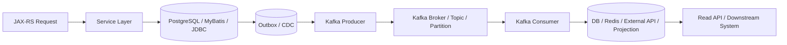
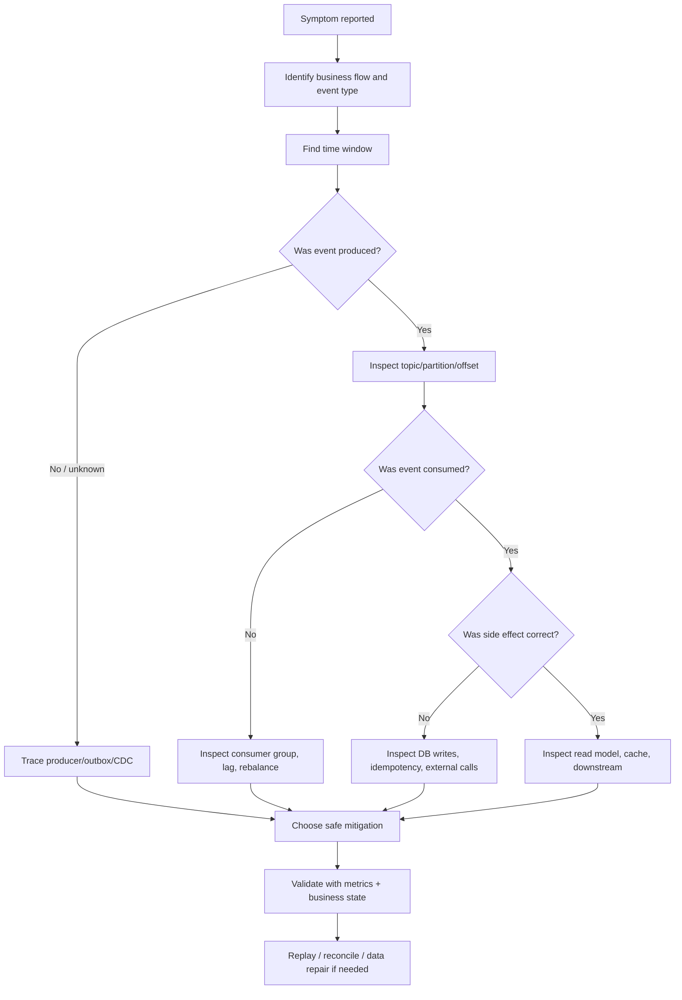

# Cheatsheet Kafka Part 047 — Troubleshooting Playbook

## 1. Core idea

Kafka troubleshooting is not about memorizing error messages.

It is about building a path from symptom to evidence to safe action.

Most production Kafka problems look like one of these:

- an event was not produced,
- an event was produced but not consumed,
- a consumer is falling behind,
- a consumer is stuck on one event,
- events are being duplicated,
- events are missing from a downstream system,
- events are processed out of order,
- serialization or schema compatibility broke,
- auth or networking broke,
- a connector stopped,
- a stream processing application is restoring forever,
- a query layer like ksqlDB is stale or failing.

The dangerous part is that the same symptom can have different meanings.

Consumer lag can mean:

- normal burst traffic,
- slow downstream database writes,
- poison event blocking a partition,
- rebalance loop,
- insufficient partitions,
- CPU throttling in Kubernetes,
- schema incompatibility,
- broken external dependency,
- consumer is alive but not committing offsets,
- consumer is processing duplicate events safely,
- consumer is corrupting state slowly.

So the first rule is:

> Never fix Kafka symptoms without identifying the business flow, event boundary, and safety of the corrective action.

In CPQ/order management systems, the real question is usually not:

> Why is the consumer lagging?

The better question is:

> Which quote, order, catalog, pricing, approval, fulfillment, fallout, cancellation, audit, or integration flow is delayed, duplicated, missing, stale, or unsafe?

---

## 2. Troubleshooting posture

### 2.1 Preserve evidence first

Before restarting services, resetting offsets, purging DLQ, deleting connector offsets, or changing topic config, capture evidence.

Minimum evidence:

- environment,
- time window,
- affected topic,
- affected partition,
- affected key,
- affected consumer group,
- latest offset,
- committed offset,
- lag trend,
- producer logs,
- consumer logs,
- consumer group state,
- deployment changes,
- schema changes,
- connector changes,
- broker health metrics,
- DLQ sample,
- trace/correlation ID,
- event ID,
- business aggregate ID.

### 2.2 Classify the symptom

Classify the incident before acting.

| Symptom | Main risk | First evidence to collect |
|---|---|---|
| Not produced | Missing business event | Producer logs, DB/outbox state, producer metrics |
| Produced but not consumed | Downstream stale state | Topic offsets, consumer group lag, consumer logs |
| Lag increasing | Processing delay or blocked partition | Per-partition lag, processing latency, rebalance metrics |
| Consumer stuck | Poison event or external dependency | Last processed offset/key, stack trace, DB/API latency |
| Rebalance loop | Consumer instability | group state, pod restarts, heartbeat/session config |
| Serialization failure | Contract break | schema ID/version, payload sample, consumer error |
| Authorization failure | Access/config drift | principal, ACL, topic/group permission |
| Network timeout | Connectivity/runtime issue | DNS, listener, TLS, firewall, broker availability |
| Duplicate processing | Side-effect risk | event ID, idempotency table, offset commit timing |
| Missing event | Data loss or skipped offset | producer/outbox/topic/consumer audit trail |
| Out-of-order event | State transition risk | key, partition, timestamp, producer path, replay source |
| DLQ spike | Poison or contract break | DLQ reason, original topic/offset/key/schema |
| CDC stopped | DB-to-Kafka pipeline break | connector state, replication slot lag, WAL retention |

### 2.3 Separate Kafka problem from application problem

Kafka may be healthy while the business flow is broken.

Examples:

- Producer successfully sends invalid business events.
- Consumer successfully polls but fails database writes.
- Topic throughput is normal but event schema meaning changed.
- Broker is healthy but Kubernetes CPU throttling slows consumers.
- Consumer lag is low but read model is semantically wrong.

Troubleshooting must cross these layers:

A failure can exist at any edge.

---

## 3. General diagnostic flow

Use this before jumping into specialized cases.

Checklist:

- Which event type is affected?
- Which aggregate IDs are affected?
- Which producer service owns the event?
- Which topic and partition should contain the event?
- Which consumer group should process it?
- Which downstream state should change?
- Is the event absent, delayed, duplicated, unreadable, rejected, or semantically wrong?
- Is this ongoing or historical?
- Is replay safe?
- Is offset reset safe?
- Is data repair needed?

---

## 4. Message not produced

### 4.1 What it means

A business action occurred, but the expected Kafka event did not appear.

In a Java/JAX-RS system, this usually points to one of these paths:

- request did not reach service layer,
- business transaction failed,
- event was never created,
- event was created but not inserted into outbox,
- outbox row exists but publisher did not publish,
- CDC connector did not emit the outbox event,
- producer failed and error was ignored,
- topic name/key/schema was wrong,
- authorization prevented publish,
- network or broker unavailable,
- event was published to a different environment/topic.

### 4.2 Diagnostic questions

Ask:

- Did the triggering HTTP request succeed?
- What response did the client receive?
- Was the DB transaction committed?
- Does the business row exist?
- Does the outbox row exist?
- Was the outbox row marked `PUBLISHED`, `FAILED`, `PENDING`, or stuck?
- If CDC is used, did Debezium see the transaction?
- Did the producer log success or failure?
- Did the producer callback handle the error?
- Was the target topic authorized and available?
- Was the message rejected by serialization/schema validation?

### 4.3 Evidence sources

| Layer | Evidence |
|---|---|
| JAX-RS | access logs, request ID, response code |
| Service | business logs, correlation ID |
| PostgreSQL | business row, outbox row, transaction time |
| MyBatis/JDBC | transaction manager logs, mapper execution |
| Outbox publisher | pending/failed/published count, retry count |
| Debezium | connector status, offset, replication slot lag |
| Producer | send rate, error rate, retries, callback errors |
| Kafka | topic existence, latest offsets, partition assignment |
| Schema Registry | compatibility/registration errors |

### 4.4 Safe actions

Safe actions:

- verify the event is truly absent before repair,
- replay or republish from outbox if outbox is source of truth,
- fix producer callback/error handling if errors were swallowed,
- fix ACL/topic/schema config if publish was rejected,
- restart publisher/connector only after capturing state,
- run reconciliation to identify all missing events in the incident window.

Unsafe actions:

- manually crafting events without source-of-truth validation,
- marking outbox rows published without verifying Kafka offsets,
- deleting failed outbox rows,
- bypassing schema validation,
- publishing duplicate business events without idempotency.

### 4.5 Producer-path debugging checklist

- [ ] Identify event type and aggregate ID.
- [ ] Find triggering HTTP request and correlation ID.
- [ ] Check business transaction committed.
- [ ] Check outbox row exists.
- [ ] Check outbox status and retry count.
- [ ] Check producer logs and callback errors.
- [ ] Check topic name and partition key.
- [ ] Check schema serialization errors.
- [ ] Check ACL/auth errors.
- [ ] Check broker availability and producer metrics.
- [ ] Decide whether repair should happen from outbox, source table, or reconciliation job.

---

## 5. Message produced but not consumed

### 5.1 What it means

The event exists in Kafka, but the expected consumer-side effect did not happen.

Possible causes:

- consumer group is not running,
- consumer subscribed to wrong topic,
- consumer group offset already advanced past the event,
- consumer is lagging,
- consumer is stuck on earlier event in same partition,
- consumer failed deserialization,
- consumer processed event but failed side effect,
- consumer processed event and wrote state, but read model/cache hides it,
- event was sent with unexpected key/schema/version/type,
- consumer filtered the event intentionally or accidentally,
- authorization prevents consume,
- consumer is in rebalance loop.

### 5.2 Diagnostic sequence

1. Confirm event exists in topic.
2. Identify topic, partition, offset, key, timestamp, schema ID/version.
3. Identify expected consumer group.
4. Check consumer group committed offset for that partition.
5. Compare event offset with committed offset.
6. Check consumer logs around that offset/event ID.
7. Check deserialization/schema errors.
8. Check handler-level errors.
9. Check DB/external side effect.
10. Check DLQ/retry topics.
11. Check projection/cache state.

### 5.3 Interpreting offset position

| Event offset vs committed offset | Meaning |
|---|---|
| Event offset greater than committed offset | Consumer has not processed it yet or is lagging |
| Event offset equal/near committed offset | Consumer may be processing or blocked around it |
| Event offset lower than committed offset | Consumer likely processed, skipped, filtered, or committed too early |
| No committed offset | New group, expired offsets, or group never consumed |

### 5.4 Common root causes

#### Wrong consumer group

A service may run with a new consumer group ID after config change.

Impact:

- it may consume from earliest or latest depending on `auto.offset.reset`,
- it may duplicate processing,
- it may skip historical events.

#### Auto commit misuse

If auto commit advances offsets before processing finishes, events can be lost at application level.

Kafka still has the event, but consumer state says it is done.

#### Silent filtering

Consumers may filter by:

- event type,
- version,
- tenant,
- source service,
- business state,
- header value.

A filter bug can look like a Kafka delivery failure.

#### Side effect failure after commit

If consumer commits offset before DB write or external call is durable, downstream state can miss the event.

### 5.5 Consumer-path debugging checklist

- [ ] Confirm event exists in topic.
- [ ] Record topic/partition/offset/key/schema.
- [ ] Identify expected consumer group.
- [ ] Check consumer group lag per partition.
- [ ] Check committed offset position.
- [ ] Check consumer logs by event ID/correlation ID.
- [ ] Check retry and DLQ topics.
- [ ] Check deserialization errors.
- [ ] Check handler filtering logic.
- [ ] Check DB/external side effect.
- [ ] Check offset commit timing.
- [ ] Confirm replay safety before reset/reprocess.

---

## 6. Consumer lag increasing

### 6.1 What it means

Consumer lag means consumers are behind the log end offset.

Lag is not automatically data loss.

It is delayed processing.

But delay can become business impact if it affects critical flows.

### 6.2 First classification

Classify lag by shape.

| Lag shape | Likely meaning |
|---|---|
| Short spike then recovery | Traffic burst or transient dependency slowdown |
| Monotonic increase | Consumer throughput below producer throughput |
| Lag stuck on one partition | Poison event, hot partition, ordering blockage |
| Lag on all partitions | Consumer app down, dependency down, broker/network issue |
| Lag after deployment | code/config regression, rebalance, resource limits |
| Lag after schema change | deserialization/contract break |
| Lag during replay | expected if controlled, risky if unbounded |

### 6.3 Diagnostic questions

- Is lag on all partitions or one partition?
- Is producer throughput higher than normal?
- Did consumer throughput drop?
- Did processing latency increase?
- Are there rebalances?
- Are pods restarting?
- Is CPU throttling happening?
- Is DB/external API slower?
- Is a poison event blocking one partition?
- Are retries blocking the poll loop?
- Did partition count or consumer replica count change?
- Did a deployment or schema change happen?

### 6.4 Lag causes by layer

| Layer | Possible causes |
|---|---|
| Producer | burst traffic, duplicate publish, backfill, replay |
| Broker | broker latency, under-replicated partitions, disk/network saturation |
| Consumer client | low max poll records, small fetch, rebalances, slow commit |
| Application | slow handler, synchronous external call, blocking retry |
| Database | lock contention, slow queries, connection pool exhaustion |
| Kubernetes | CPU throttling, memory pressure, pod restarts, rolling update |
| Schema | deserialization failures, incompatible schema |
| Business logic | hot aggregate, ordered state transition bottleneck |

### 6.5 Safe mitigation options

Possible mitigations:

- scale consumers if partition count allows,
- increase consumer resources if CPU/memory bound,
- pause non-critical consumers,
- reduce producer/backfill rate,
- route poison events to DLQ if safe,
- fix dependency bottleneck,
- tune batch processing,
- isolate hot topic/tenant if architecture supports it,
- temporarily degrade non-critical side effects.

Do not blindly scale consumers if:

- partition count is lower than replicas,
- external DB/API is already saturated,
- ordering must be preserved per aggregate,
- consumer is failing due to poison event,
- lag is caused by rebalance loop.

### 6.6 Lag debugging checklist

- [ ] Identify affected topic and consumer group.
- [ ] Check lag by partition, not only total lag.
- [ ] Check log end offset vs committed offset.
- [ ] Check consumer processing latency.
- [ ] Check rebalance count/rate.
- [ ] Check pod restarts and deployment changes.
- [ ] Check CPU throttling and memory pressure.
- [ ] Check DB/API latency and connection pools.
- [ ] Check DLQ/retry spikes.
- [ ] Check schema/deserialization errors.
- [ ] Confirm whether lag is acceptable under SLA.

---

## 7. Consumer stuck

### 7.1 What it means

A consumer is assigned partitions but stops making progress.

It may still be alive.

It may still heartbeat.

It may even appear healthy from Kubernetes readiness.

The key symptom is offset not advancing.

### 7.2 Common causes

- poison event blocks handler,
- infinite retry in same poll loop,
- long-running database transaction,
- external API timeout without circuit breaker,
- deadlock in application code,
- thread pool starvation,
- connection pool exhaustion,
- deserialization exception loop,
- max poll interval exceeded repeatedly,
- pause called but never resumed,
- synchronous logging or metrics blockage,
- backpressure mechanism stuck.

### 7.3 Debugging steps

1. Identify assigned partition.
2. Identify last committed offset.
3. Identify last successfully processed event.
4. Inspect next event after committed offset.
5. Check whether it appears in retry/DLQ.
6. Check thread dump if safe and available.
7. Check DB locks and connection pool.
8. Check external dependency latency.
9. Check consumer poll interval and heartbeat metrics.
10. Check application logs around the stuck event.

### 7.4 Poison event pattern

A poison event usually has one of these characteristics:

- valid Kafka record but invalid business state,
- schema-compatible but semantically unexpected,
- missing required business reference,
- violates state transition invariant,
- triggers deterministic handler exception,
- repeatedly fails after every retry.

A poison event should be quarantined with full metadata.

Minimum DLQ metadata:

- original topic,
- original partition,
- original offset,
- original key,
- event ID,
- schema version,
- error type,
- error message,
- stack trace hash,
- first failure timestamp,
- retry count,
- owning consumer,
- replay eligibility.

### 7.5 Consumer-stuck checklist

- [ ] Is offset advancing?
- [ ] Is consumer still polling?
- [ ] Is consumer still heartbeating?
- [ ] Is one partition stuck or all partitions?
- [ ] What is the next unprocessed record?
- [ ] Is there a deterministic exception?
- [ ] Is retry blocking the partition?
- [ ] Is pause/resume stuck?
- [ ] Are DB/API dependencies slow or unavailable?
- [ ] Is max poll interval exceeded?
- [ ] Is moving to DLQ safe?

---

## 8. Rebalance loop

### 8.1 What it means

A rebalance loop means partitions are repeatedly revoked and reassigned.

This destroys throughput and can cause duplicate processing if handlers are interrupted or commits are delayed.

### 8.2 Common causes

- pods restarting,
- rolling deployment too aggressive,
- liveness probe kills slow consumer,
- `max.poll.interval.ms` too low for processing time,
- handler blocks poll loop,
- CPU throttling delays poll/heartbeat,
- network instability,
- consumer group members use unstable instance IDs,
- too many consumers joining/leaving,
- cooperative rebalance not configured where useful,
- scaling events from HPA.

### 8.3 Diagnostic evidence

- group rebalance rate,
- consumer logs: partition revoked/assigned,
- pod restart count,
- Kubernetes events,
- liveness/readiness probe failures,
- max poll interval errors,
- heartbeat/session timeout logs,
- CPU throttling metrics,
- deployment rollout timeline,
- HPA scale timeline.

### 8.4 Safe actions

- stop aggressive rollout,
- stabilize pod restarts,
- adjust liveness/readiness probes,
- tune `max.poll.interval.ms` to match worst-case processing,
- move long processing outside poll thread if architecture supports it,
- reduce HPA flapping,
- use cooperative sticky assignment where appropriate,
- validate graceful shutdown commits offsets safely.

### 8.5 Rebalance-loop checklist

- [ ] Check rebalance rate.
- [ ] Check pod restarts.
- [ ] Check max poll interval violations.
- [ ] Check heartbeat/session timeouts.
- [ ] Check CPU throttling.
- [ ] Check rolling deployment settings.
- [ ] Check HPA events.
- [ ] Check assignment strategy.
- [ ] Check graceful shutdown.
- [ ] Check duplicate side-effect risk during revoke.

---

## 9. Serialization and deserialization failure

### 9.1 What it means

The consumer cannot decode the event payload or the producer cannot encode it.

This can be caused by:

- incompatible schema change,
- wrong subject naming strategy,
- missing schema in registry,
- invalid schema ID,
- consumer lacks generated class,
- enum evolution issue,
- field removal/rename without compatibility,
- malformed JSON,
- wrong serializer/deserializer config,
- payload sent to wrong topic,
- DLQ event missing original serialization metadata.

### 9.2 Producer-side serialization failure

Symptoms:

- message never reaches Kafka,
- producer callback error,
- outbox event stuck as failed,
- schema registration failure,
- compatibility violation in CI or runtime.

Actions:

- check producer serializer config,
- check schema registration response,
- check compatibility mode,
- check generated schema/class version,
- check payload field values,
- avoid bypassing schema validation.

### 9.3 Consumer-side deserialization failure

Symptoms:

- consumer cannot poll records successfully depending on error handler,
- lag increases,
- repeated exception for same offset,
- event moved to DLQ if handler supports it,
- consumer may crash-loop.

Actions:

- capture original topic/partition/offset/key,
- identify schema ID/version,
- check consumer deserializer config,
- compare producer schema vs consumer expectation,
- check compatibility matrix,
- check whether DLQ preserves raw payload or decoded failure metadata,
- fix consumer/schema and replay safely.

### 9.4 Schema debugging checklist

- [ ] What serializer/deserializer is configured?
- [ ] What schema format is used: JSON, Avro, Protobuf, JSON Schema?
- [ ] Is Schema Registry reachable?
- [ ] What subject naming strategy is used?
- [ ] What compatibility mode applies?
- [ ] What schema ID/version is in the event?
- [ ] Did schema change recently?
- [ ] Did enum/required/default/field removal change?
- [ ] Did CI run compatibility checks?
- [ ] Can affected event be replayed after fix?

---

## 10. Schema Registry failure

### 10.1 Symptoms

- producer fails to register or fetch schema,
- consumer fails to resolve schema ID,
- serialization/deserialization error rate spikes,
- new deployments fail while old cached clients still work,
- schema compatibility checks fail in CI,
- ksqlDB or Kafka Streams apps fail to start due to schema resolution.

### 10.2 Diagnostic questions

- Is Schema Registry service reachable from the client pod?
- Is authentication required and valid?
- Is TLS/certificate valid?
- Is compatibility mode changed?
- Is the subject name expected?
- Was a schema deleted or overwritten?
- Are producers using auto-registration?
- Are consumers using latest schema incorrectly?

### 10.3 Safe actions

- restore registry availability,
- roll forward compatible schema,
- avoid deleting subjects in production,
- avoid forcing compatibility mode changes under incident pressure,
- replay only after consumer compatibility is validated.

### 10.4 Checklist

- [ ] Check registry health.
- [ ] Check auth/TLS from producer/consumer pods.
- [ ] Check subject/version/schema ID.
- [ ] Check compatibility mode.
- [ ] Check recent schema changes.
- [ ] Check CI schema validation.
- [ ] Check whether affected clients cache schemas.
- [ ] Check replay plan.

---

## 11. Authorization failure

### 11.1 Symptoms

- producer cannot write to topic,
- consumer cannot read topic,
- consumer cannot join group,
- transactional producer cannot use transactional ID,
- connector cannot create/read/write internal topics,
- Schema Registry auth fails,
- errors appear after credential rotation or deployment.

### 11.2 Root causes

- missing topic ACL,
- missing consumer group ACL,
- missing transactional ID ACL,
- wrong principal,
- wrong SASL mechanism,
- expired credential,
- secret mounted incorrectly,
- certificate rotation incomplete,
- service account changed,
- environment mismatch,
- connector principal lacks access to source/sink/internal topics.

### 11.3 Debugging checklist

- [ ] Identify principal used by client.
- [ ] Check topic permission.
- [ ] Check consumer group permission.
- [ ] Check transactional ID permission if used.
- [ ] Check Schema Registry permission.
- [ ] Check Connect internal topic permissions.
- [ ] Check secret/cert mount.
- [ ] Check credential rotation timeline.
- [ ] Check environment/topic naming mismatch.
- [ ] Confirm least-privilege fix, not wildcard overgrant.

---

## 12. Network timeout or broker unavailable

### 12.1 Symptoms

- bootstrap connection failure,
- metadata fetch timeout,
- broker disconnects,
- TLS handshake failure,
- hostname verification failure,
- intermittent produce/consume failures,
- clients work inside cluster but fail outside,
- clients work in one namespace/VPC but not another.

### 12.2 Common causes

- wrong bootstrap server,
- bad advertised listener,
- DNS failure,
- firewall/security group/NSG block,
- Kubernetes NetworkPolicy block,
- NAT/load balancer issue,
- TLS certificate SAN mismatch,
- expired certificate,
- broker listener not exposed,
- cross-zone/cross-region route issue,
- private endpoint misconfiguration.

### 12.3 Debugging sequence

1. Resolve bootstrap DNS from the client runtime.
2. Test TCP connectivity to bootstrap broker.
3. Fetch metadata if tooling is allowed.
4. Inspect advertised broker addresses returned to client.
5. Validate client can resolve and reach every advertised broker.
6. Validate TLS hostname and certificate chain.
7. Check firewall/security group/NetworkPolicy.
8. Check broker listener config.
9. Check broker health.

### 12.4 Networking checklist

- [ ] Is bootstrap server correct for environment?
- [ ] Does DNS resolve inside the pod/VPC/VNet?
- [ ] Is TCP connectivity allowed?
- [ ] Are advertised listeners reachable by the client?
- [ ] Does TLS hostname verification pass?
- [ ] Are certificates valid?
- [ ] Are firewall/security group/NetworkPolicy rules correct?
- [ ] Are internal/external listeners mixed incorrectly?
- [ ] Is cross-zone/cross-region traffic expected?

---

## 13. Unknown topic or partition

### 13.1 Symptoms

- producer receives unknown topic or partition,
- consumer cannot subscribe,
- topic exists in one environment but not another,
- topic auto-creation creates wrong config,
- deployment succeeds but runtime fails.

### 13.2 Causes

- topic not created,
- wrong environment prefix,
- typo in topic name,
- missing GitOps reconciliation,
- topic deleted,
- producer configured with stale topic,
- partition count assumption wrong,
- topic auto-creation disabled,
- topic auto-created with unsafe defaults.

### 13.3 Checklist

- [ ] Check exact topic name.
- [ ] Check environment naming convention.
- [ ] Check topic exists.
- [ ] Check partition count.
- [ ] Check topic config source of truth.
- [ ] Check GitOps reconciliation status.
- [ ] Check recent delete/rename/deprecation.
- [ ] Check producer/consumer config.
- [ ] Disable reliance on implicit topic auto-creation for production.

---

## 14. Offset out of range

### 14.1 What it means

A consumer tries to read an offset that no longer exists or is invalid for the partition.

Common causes:

- retention deleted old records,
- compacted topic removed records unexpectedly for replay assumptions,
- consumer group was inactive for too long,
- manual offset reset to invalid value,
- topic recreated,
- environment mismatch,
- restore/replay process used stale offsets.

### 14.2 Risk

Offset out of range can cause:

- skipped historical events if `auto.offset.reset=latest`,
- massive replay if `auto.offset.reset=earliest`,
- broken projection rebuild,
- inconsistent consumer state,
- hidden data loss.

### 14.3 Checklist

- [ ] Identify topic/partition/group.
- [ ] Check committed offset.
- [ ] Check earliest and latest available offsets.
- [ ] Check retention policy.
- [ ] Check whether topic was recreated.
- [ ] Check consumer group inactivity period.
- [ ] Check `auto.offset.reset` setting.
- [ ] Decide whether to reset to earliest/latest/specific offset.
- [ ] Validate replay/idempotency before reset.
- [ ] Reconcile affected business state.

---

## 15. Duplicate processing

### 15.1 What it means

The same logical event or business action is processed more than once.

This is normal under at-least-once delivery unless the application prevents duplicate side effects.

### 15.2 Common causes

- producer retry after ambiguous send result,
- producer duplicate due to outbox retry,
- consumer crash after DB write before offset commit,
- rebalance during processing,
- manual replay,
- offset reset,
- DLQ replay,
- duplicate source event,
- CDC connector restart/snapshot issue,
- non-unique event ID.

### 15.3 Debugging questions

- Is Kafka record duplicated or only business side effect duplicated?
- Do duplicate records have same event ID?
- Do they have same key and payload?
- Are offsets different?
- Did replay or offset reset occur?
- Did outbox publish same event twice?
- Did consumer idempotency table reject duplicates?
- Did external API receive duplicate calls?

### 15.4 Safe actions

- stop unsafe consumer if duplicate side effects are corrupting data,
- identify duplicate scope,
- use event ID/idempotency key to deduplicate,
- repair downstream state,
- add idempotency guard before replaying,
- fix commit timing if needed,
- fix outbox uniqueness if producer duplicates are uncontrolled.

### 15.5 Duplicate checklist

- [ ] Compare event IDs.
- [ ] Compare offsets.
- [ ] Compare keys and payloads.
- [ ] Check producer retry/outbox retry.
- [ ] Check consumer crash/rebalance timeline.
- [ ] Check offset reset/replay history.
- [ ] Check inbox/processed event table.
- [ ] Check business idempotency.
- [ ] Check downstream external calls.
- [ ] Prepare data repair if side effects duplicated.

---

## 16. Missing event

### 16.1 What it means

A downstream system expected an event, but it cannot be found or its side effect is missing.

This can be true data loss, application-level loss, or expectation mismatch.

### 16.2 Possible causes

- business event was never emitted,
- event emitted to wrong topic/environment,
- outbox row missing,
- producer error swallowed,
- retention deleted event,
- consumer skipped due to offset reset,
- auto commit advanced before processing,
- consumer filtered event,
- schema failure blocked then DLQ/retry lost visibility,
- downstream projection not updated,
- source business condition did not actually require event.

### 16.3 Debugging strategy

Trace by source of truth:

1. Business database row/state.
2. Outbox row or CDC source change.
3. Kafka topic offset.
4. Retry/DLQ topics.
5. Consumer inbox/processed-event table.
6. Downstream business table/projection.
7. Audit/log/tracing evidence.

### 16.4 Missing-event checklist

- [ ] Confirm expected event should exist.
- [ ] Check source business state.
- [ ] Check outbox/CDC source.
- [ ] Check producer logs.
- [ ] Check topic by key/time window.
- [ ] Check retention window.
- [ ] Check consumer group offset history.
- [ ] Check DLQ/retry.
- [ ] Check consumer filtering.
- [ ] Check downstream projection/cache.
- [ ] Run reconciliation for incident window.

---

## 17. Out-of-order event

### 17.1 What it means

Events are observed in an order that violates consumer expectation or business state transition logic.

Kafka only guarantees ordering within a partition.

It does not guarantee global ordering across partitions.

### 17.2 Common causes

- wrong partition key,
- null key causing distribution across partitions,
- partition count increased,
- same aggregate produced by multiple services with different keys,
- retry topic changes ordering,
- DLQ replay reintroduces old events,
- backfill/replay mixed with live traffic,
- event time differs from processing time,
- CDC emits changes in transaction order but downstream merges incorrectly,
- consumer parallelizes processing within one partition unsafely.

### 17.3 Debugging questions

- What aggregate requires ordering?
- What key was used?
- Did all events for the aggregate go to the same partition?
- Were events produced by the same producer path?
- Was a retry/DLQ/replay involved?
- Did partition count change?
- Is consumer processing records concurrently within a partition?
- Is state transition idempotent and monotonic?

### 17.4 Safe design responses

- key by aggregate ID when aggregate order matters,
- design consumers to tolerate duplicate and stale events,
- use version/sequence numbers for state transitions,
- reject or park stale transitions,
- separate live and replay pipelines if needed,
- avoid reordering through retry topics without business safeguards,
- make projection rebuild deterministic.

### 17.5 Ordering checklist

- [ ] Identify ordering invariant.
- [ ] Verify partition key.
- [ ] Verify partition for each event.
- [ ] Check null key usage.
- [ ] Check partition count changes.
- [ ] Check retry/DLQ/replay involvement.
- [ ] Check consumer concurrency model.
- [ ] Check state version/sequence guard.
- [ ] Check impact on quote/order lifecycle.

---

## 18. DLQ spike

### 18.1 What it means

A sudden increase in DLQ events indicates that consumers are rejecting events.

The source can be producer, schema, consumer code, business state, dependency failure, or replay.

### 18.2 Classify DLQ reason

| DLQ reason type | Interpretation |
|---|---|
| Deserialization | Schema/serialization contract problem |
| Validation | Payload missing or invalid |
| Business invariant | Event is readable but semantically invalid |
| Dependency | DB/API/cache unavailable or slow |
| Timeout | Processing exceeded expected latency |
| Authorization | Consumer cannot access downstream resource |
| Unknown exception | Handler bug or unclassified failure |

### 18.3 Debugging steps

1. Group DLQ events by error reason.
2. Group by topic, partition, producer, event type, schema version.
3. Identify first failure timestamp.
4. Compare with deployments/schema changes/config changes.
5. Sample payloads safely.
6. Determine replay eligibility.
7. Fix root cause.
8. Replay in controlled batches.
9. Monitor duplicates and downstream state.

### 18.4 DLQ checklist

- [ ] Is DLQ spike ongoing?
- [ ] Which consumer wrote DLQ?
- [ ] What original topic/partition/offset/key?
- [ ] What error reason dominates?
- [ ] Did a deployment/schema change happen?
- [ ] Does DLQ contain sensitive data?
- [ ] Is replay safe and idempotent?
- [ ] Who owns replay approval?
- [ ] Is business repair required?

---

## 19. CDC connector stopped

### 19.1 Symptoms

- Debezium connector state is failed or paused,
- no new events from PostgreSQL,
- replication slot lag increases,
- WAL disk grows,
- outbox rows accumulate,
- downstream consumers lag behind source database,
- schema change breaks connector,
- snapshot stuck.

### 19.2 Common causes

- database connectivity failure,
- replication slot issue,
- permission change,
- WAL retention pressure,
- connector task failure,
- incompatible schema/table change,
- connector config drift,
- Kafka Connect worker issue,
- internal topic authorization failure,
- SMT failure,
- sink/source topic authorization failure.

### 19.3 Debugging sequence

1. Check connector status and task status.
2. Check worker logs.
3. Check PostgreSQL replication slot lag.
4. Check WAL disk pressure.
5. Check recent DDL/table changes.
6. Check publication/table inclusion rules.
7. Check Kafka Connect internal topics.
8. Check converter/SMT errors.
9. Check connector offsets.
10. Decide restart, config fix, snapshot, or backfill.

### 19.4 CDC checklist

- [ ] Connector status healthy?
- [ ] Task status healthy?
- [ ] Replication slot lag acceptable?
- [ ] WAL disk safe?
- [ ] Recent DDL change?
- [ ] Publication/table filters correct?
- [ ] Outbox Event Router working?
- [ ] Connector offsets intact?
- [ ] Restart safe?
- [ ] Backfill/reconciliation needed?

---

## 20. Replication slot lag

### 20.1 What it means

PostgreSQL retains WAL needed by a replication slot because the CDC connector has not consumed it.

If unchecked, this can fill disk and endanger the database.

### 20.2 Common causes

- Debezium connector stopped,
- Kafka Connect worker down,
- Kafka unavailable,
- connector cannot write to topic,
- connector processing too slow,
- large transaction,
- snapshot taking too long,
- network issue,
- schema/SMT error blocks progress.

### 20.3 Safe actions

- restore connector processing,
- protect database disk first,
- coordinate with DBA/platform team,
- do not drop replication slot casually,
- if slot must be dropped, understand data gap and backfill requirement,
- run reconciliation after recovery.

### 20.4 Checklist

- [ ] What slot is lagging?
- [ ] How fast is WAL growing?
- [ ] How much disk headroom remains?
- [ ] Is connector running?
- [ ] Can connector write to Kafka?
- [ ] Is connector blocked by schema/SMT error?
- [ ] Is snapshot running?
- [ ] Is dropping/recreating slot approved?
- [ ] What backfill is required if data gap occurs?

---

## 21. Kafka Streams state restore issue

### 21.1 Symptoms

- Kafka Streams app starts but remains restoring,
- state store restoration takes too long,
- rebalance occurs repeatedly during restore,
- changelog topic read is slow,
- local RocksDB corrupted or deleted,
- topology upgrade fails,
- application produces stale or incomplete materialized state.

### 21.2 Causes

- large state store,
- changelog topic retention/config issue,
- slow disk,
- insufficient standby replicas,
- topology change incompatible with old state,
- application ID changed unexpectedly,
- internal topic deleted,
- pod eviction lost local state,
- resource limits too low,
- rebalance loop during restore.

### 21.3 Checklist

- [ ] Check application ID.
- [ ] Check internal/changelog topics exist.
- [ ] Check restore metrics.
- [ ] Check RocksDB local state directory.
- [ ] Check disk performance.
- [ ] Check pod restarts/evictions.
- [ ] Check standby replica config.
- [ ] Check topology change.
- [ ] Check changelog retention.
- [ ] Validate materialized state after restore.

---

## 22. ksqlDB query failure

### 22.1 Symptoms

- persistent query failed,
- materialized view stale,
- pull query returns old data,
- push query disconnects,
- query cannot deserialize topic records,
- query result differs from source topic,
- ksqlDB cluster overloaded.

### 22.2 Causes

- schema mismatch,
- source topic missing or changed,
- incompatible key/value format,
- repartition/internal topic issue,
- query terminated after exception,
- ksqlDB server resource exhaustion,
- consumer lag inside query,
- deployment/config drift,
- wrong stream/table model.

### 22.3 Checklist

- [ ] Is query persistent or ad-hoc?
- [ ] What source stream/table/topic does it read?
- [ ] Is query running?
- [ ] Is materialized view lagging?
- [ ] Are schema/key formats correct?
- [ ] Are internal topics healthy?
- [ ] Are ksqlDB server resources saturated?
- [ ] Did a schema/topic change occur?
- [ ] Is Kafka Streams a better fit for this logic?

---

## 23. Production-safe debugging commands and actions

Exact tooling differs by organization.

Do not assume unrestricted CLI access in production.

The safe principle is:

> Inspect first, mutate last.

### 23.1 Usually safe read-only actions

Subject to internal permission:

- list consumer groups,
- describe consumer group offsets,
- inspect topic config,
- inspect topic partition offsets,
- view producer/consumer logs,
- view metrics dashboards,
- inspect DLQ metadata,
- inspect connector status,
- inspect schema versions,
- inspect Kubernetes pod events.

### 23.2 High-risk actions

Require explicit approval/runbook:

- reset consumer group offsets,
- delete topic,
- purge topic data,
- change retention aggressively,
- delete DLQ records,
- replay DLQ events,
- drop replication slot,
- recreate connector offsets,
- manually publish business events,
- bypass schema validation,
- scale consumers massively during downstream outage,
- restart stateful Kafka Streams apps without restore plan.

### 23.3 Debugging guardrails

- Prefer sampling over bulk reads.
- Redact sensitive data from logs/screenshots.
- Use correlation/event IDs instead of dumping payloads.
- Capture before/after metrics.
- Record every mutating action.
- Validate business state, not just Kafka metrics.
- Use reconciliation after any suspected skip/duplicate/loss.

---

## 24. Troubleshooting decision table

| Symptom | Likely root causes | Safe first action | Dangerous action |
|---|---|---|---|
| Event absent | outbox missing/stuck, producer failure, wrong topic | trace source DB/outbox/producer | manually publish guessed event |
| Lag increasing | slow handler, DB/API bottleneck, hot partition | inspect per-partition lag and processing latency | blindly scale consumers |
| Stuck partition | poison event, blocking retry, dependency timeout | identify next unprocessed offset | reset offset to skip |
| Rebalance loop | pod restarts, max poll interval, CPU throttling | inspect group and pod events | force restart all consumers |
| Deserialization error | schema break, wrong serde | inspect schema ID/version | bypass schema checks |
| Auth failure | ACL/principal/secret issue | verify principal and permission | wildcard overgrant |
| Missing downstream state | skipped/filtered/failed side effect | trace event to consumer and DB | assume Kafka lost it |
| Duplicate side effect | replay, crash before commit, producer duplicate | check idempotency keys | delete business rows ad hoc |
| CDC stopped | connector/task/slot/schema issue | inspect connector and slot lag | drop replication slot casually |
| DLQ spike | poison/schema/business invariant | classify DLQ by reason | bulk replay immediately |

---

## 25. Internal verification checklist

Use this part to verify real CSG/team-specific implementation.

### Kafka access and tooling

- [ ] What read-only Kafka inspection tools are approved?
- [ ] Who can run consumer group describe/reset?
- [ ] Who can inspect topic data?
- [ ] Who can inspect DLQ payloads?
- [ ] What payload redaction rules apply?
- [ ] Which production actions require approval?

### Logs and tracing

- [ ] Do logs include event ID?
- [ ] Do logs include correlation ID?
- [ ] Do logs include topic/partition/offset/key?
- [ ] Do logs include consumer group?
- [ ] Do logs redact PII?
- [ ] Can traces connect JAX-RS request to Kafka event to downstream consumer?

### Dashboards

- [ ] Consumer lag by topic/group/partition.
- [ ] Producer error/retry rate.
- [ ] Consumer processing latency.
- [ ] Rebalance rate.
- [ ] DLQ count by reason.
- [ ] Schema Registry errors.
- [ ] Kafka Connect connector/task status.
- [ ] Debezium replication slot lag.
- [ ] Kafka Streams restore metrics.
- [ ] Broker under-replicated/offline partitions.

### Runbooks

- [ ] Message not produced.
- [ ] Message not consumed.
- [ ] Consumer lag.
- [ ] Poison event.
- [ ] DLQ replay.
- [ ] Offset reset.
- [ ] CDC connector stopped.
- [ ] Replication slot lag.
- [ ] Schema incompatibility.
- [ ] Kafka networking failure.
- [ ] Data repair/reconciliation.

### Codebase

- [ ] Producer callback handles failure.
- [ ] Outbox status is observable.
- [ ] Consumer commits offset after safe processing.
- [ ] Inbox/idempotency guard exists for important consumers.
- [ ] Retry/DLQ preserves original metadata.
- [ ] Event metadata standard is enforced.
- [ ] Schema compatibility is tested in CI.
- [ ] Integration tests cover replay and duplicate events.

---

## 26. PR review checklist

When reviewing a PR that changes Kafka behavior, ask:

- What new failure mode does this introduce?
- What happens if publish succeeds but DB commit fails?
- What happens if DB commit succeeds but publish fails?
- What happens if consumer processes the same event twice?
- What happens if consumer crashes after DB write before offset commit?
- What happens if event is replayed next month?
- What happens if schema evolves while old consumers still run?
- What happens if ordering changes due to key change?
- What happens if DLQ receives this event?
- What happens if this consumer lags for one hour?
- What dashboard will show failure?
- What log line will identify event ID, topic, partition, offset, and aggregate ID?
- What runbook should be followed?
- What production action is unsafe?

---

## 27. Anti-patterns

Avoid these:

- treating restart as root-cause analysis,
- resetting offsets to make lag disappear,
- deleting DLQ events after counting them,
- relying on `latest` offset reset for new groups without intent,
- logging full event payloads with PII,
- publishing manual repair events without audit trail,
- using total lag only and ignoring per-partition lag,
- scaling consumers without checking downstream bottleneck,
- assuming Kafka lost data before checking outbox/consumer commit/filtering,
- ignoring schema compatibility because JSON is “flexible”,
- using Kafka transaction terminology to hide DB consistency gaps,
- replaying events into non-idempotent consumers.

---

## 28. Senior engineer mental model

A senior engineer does not debug Kafka by asking only:

> Is the topic receiving messages?

They ask:

- What business invariant is currently at risk?
- Which event boundary is broken?
- Is the event absent, delayed, duplicated, unreadable, or semantically invalid?
- Is the issue in producer, broker, consumer, side effect, projection, or governance?
- Is the proposed mitigation safe under replay, duplicate, and ordering constraints?
- What evidence proves recovery?
- What follow-up prevents recurrence?

Kafka troubleshooting is production reasoning over time, state, contracts, and side effects.

The goal is not merely to make the alert green.

The goal is to restore a trustworthy event flow.
