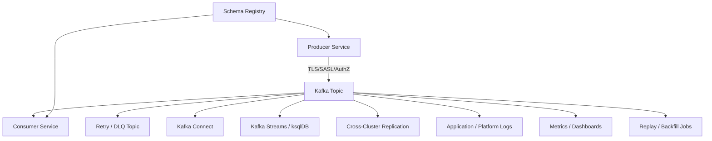

# Cheatsheet Kafka Part 048 — Security, Privacy, and Compliance

## 1. Core idea

Kafka is not only a messaging layer.

In an enterprise system, Kafka is a data distribution layer.

That means Kafka can become:

- a regulated data store,
- a privacy exposure surface,
- an audit evidence source,
- a cross-service permission boundary,
- a long-lived replay source,
- a hidden copy of sensitive business state,
- a compliance risk multiplier.

The security question is not only:

> Is Kafka encrypted and authenticated?

The better question is:

> What data is being copied into Kafka, who can read it, how long does it live, how is it audited, and what happens when it is replayed, logged, dead-lettered, or replicated?

For CPQ/order management systems, events can contain highly sensitive information:

- customer identifiers,
- tenant identifiers,
- quote details,
- order details,
- pricing data,
- discount information,
- approval decisions,
- commercial terms,
- product/catalog configuration,
- account information,
- user/actor metadata,
- integration payloads,
- operational fallout details.

Even when events do not contain direct PII, they may contain business-sensitive or customer-confidential data.

Security review must therefore include data classification, payload design, header design, retention, DLQ, logs, replay, access control, and compliance evidence.

---

## 2. Threat model for Kafka-based systems

Kafka has several security surfaces.



Each edge has questions:

- Is the client authenticated?
- Is the connection encrypted?
- Is authorization least-privilege?
- Is sensitive data exposed in headers, payloads, logs, DLQ, metrics, or traces?
- Is retention aligned with business/legal requirements?
- Is replay access controlled?
- Is access audited?
- Is cross-region/on-prem/cloud replication approved?

---

## 3. Data classification

### 3.1 Why classification matters

Kafka topics often outlive the application code path that produced them.

A database column may have access controls, masking, retention, and audit.

Once copied into Kafka, the same data may be readable by many consumers, stored in DLQ, replicated to other clusters, written to logs, and replayed later.

So every event should have a classification.

### 3.2 Suggested classification model

Use the organization’s official model if one exists.

A practical working model:

| Classification | Example | Kafka implication |
|---|---|---|
| Public | non-sensitive metadata | normal controls still apply |
| Internal | service status, non-sensitive operational event | restrict to internal services |
| Confidential | customer/order/quote/business data | strong ACL, retention review, redaction |
| Restricted | PII, secrets, regulated data, sensitive pricing | avoid if possible, strict approval |
| Audit-critical | compliance/audit trail | immutability, retention, evidence controls |

### 3.3 CPQ/order examples

Potentially confidential or restricted:

- customer name,
- account number,
- phone/email/address,
- tenant ID combined with customer ID,
- quote price,
- discount reason,
- approval comments,
- commercial terms,
- order payload,
- integration credentials,
- fallout reason containing customer data,
- free-text notes.

Free-text fields are especially risky because users may enter PII or sensitive commercial data unexpectedly.

### 3.4 Classification checklist

- [ ] What classification does this event have?
- [ ] Does payload contain PII?
- [ ] Do headers contain PII?
- [ ] Does payload contain confidential commercial data?
- [ ] Does payload contain secrets or credentials?
- [ ] Does payload contain free-text user input?
- [ ] Is event classification documented in event catalog?
- [ ] Do retention and ACL match classification?
- [ ] Are DLQ/retry topics classified at least as sensitive as source topic?

---

## 4. PII in event payload

### 4.1 Core rule

Do not put PII into Kafka events unless there is a clear business reason, explicit ownership, retention approval, access control, and audit path.

Prefer identifiers over full sensitive attributes where possible.

Bad event design:

```json
{
  "eventType": "QuoteSubmitted",
  "customerName": "...",
  "customerEmail": "...",
  "customerPhone": "...",
  "address": "...",
  "approvalComment": "customer said ..."
}
```

Often better:

```json
{
  "eventType": "QuoteSubmitted",
  "quoteId": "...",
  "customerId": "...",
  "tenantId": "...",
  "quoteStatus": "SUBMITTED",
  "submittedAt": "..."
}
```

But identifiers can still be sensitive depending on policy.

### 4.2 Payload minimization

Ask:

- Does every consumer need this field?
- Can consumers fetch sensitive data from an authorized API instead?
- Can event carry state summary instead of raw detail?
- Can sensitive fields be tokenized, hashed, masked, or omitted?
- Is the event used for audit, integration, cache invalidation, or workflow?
- Is event-carried state transfer justified?

### 4.3 Event-carried state transfer risk

Event-carried state transfer can improve autonomy and reduce synchronous calls.

It can also replicate sensitive data broadly.

Use it carefully.

Decision rule:

- carry non-sensitive state that consumers need for autonomy,
- avoid carrying sensitive fields unless strongly justified,
- document consumers and retention,
- enforce schema review,
- classify topic accordingly.

### 4.4 Payload PII checklist

- [ ] Are sensitive fields required by consumers?
- [ ] Can the event carry IDs instead of full data?
- [ ] Can consumers fetch sensitive data through authorized APIs?
- [ ] Are free-text fields excluded or sanitized?
- [ ] Are masked/tokenized values sufficient?
- [ ] Are consumers documented?
- [ ] Is retention approved?
- [ ] Is replay of this data acceptable?

---

## 5. PII in event headers

### 5.1 Why headers are risky

Headers are easy to overlook.

They may be copied into:

- logs,
- tracing systems,
- DLQ metadata,
- retry topics,
- monitoring tools,
- connector sinks,
- external integration payloads.

Avoid placing PII in headers.

Headers should generally contain operational metadata, not sensitive business data.

### 5.2 Better header candidates

Reasonable header fields:

- event ID,
- correlation ID,
- causation ID,
- trace context,
- source service,
- event type,
- event version,
- schema ID/version,
- tenant ID if allowed by policy,
- idempotency key if not sensitive,
- retry count,
- original topic/partition/offset for DLQ.

Risky header fields:

- customer name,
- customer email,
- phone number,
- address,
- raw token,
- API key,
- authorization header,
- user free-text,
- approval notes,
- full order payload.

### 5.3 Header checklist

- [ ] Are headers logged anywhere?
- [ ] Are headers copied to DLQ?
- [ ] Are headers propagated to external systems?
- [ ] Do headers contain PII or credentials?
- [ ] Is tenant ID allowed in headers?
- [ ] Are correlation/trace IDs non-sensitive?
- [ ] Are retry/DLQ headers sanitized?

---

## 6. Secrets in events

### 6.1 Rule

Never put secrets into Kafka events.

This includes:

- passwords,
- API keys,
- OAuth tokens,
- refresh tokens,
- session tokens,
- private keys,
- database credentials,
- signed URLs if long-lived,
- service credentials,
- authorization headers.

Kafka retention, replication, DLQ, logs, and backups make secret exposure difficult to contain.

### 6.2 If secret exposure happens

Treat it as a security incident.

Actions:

- stop further production of secret-bearing events,
- identify affected topics/partitions/time window,
- identify all consumers and replicated clusters,
- rotate exposed credentials,
- restrict access,
- coordinate retention/purge strategy with security/platform/legal,
- preserve evidence,
- update schema validation to prevent recurrence.

### 6.3 Secret checklist

- [ ] Does schema prohibit secret-like fields?
- [ ] Are authorization headers stripped before event creation?
- [ ] Are connector configs protected from logging?
- [ ] Are DLQ payloads inspected for secrets?
- [ ] Are free-text fields scanned or restricted?
- [ ] Is there a credential exposure runbook?

---

## 7. Log redaction

### 7.1 Why Kafka logs become dangerous

Kafka debugging often tempts engineers to log entire events.

This is dangerous because logs may have:

- broader access than Kafka topics,
- longer retention,
- weaker field-level controls,
- export to third-party monitoring,
- indexing that makes sensitive data searchable.

### 7.2 Safe logging pattern

Prefer logging identifiers and metadata:

```text
Processed eventId=... eventType=QuoteSubmitted topic=... partition=3 offset=120941 keyHash=... correlationId=... status=SUCCESS durationMs=42
```

Avoid logging full payload:

```text
payload={...full customer/order/quote data...}
```

### 7.3 Redaction strategy

Redact:

- names,
- emails,
- phone numbers,
- addresses,
- account identifiers if policy requires,
- tokens/secrets,
- free-text notes,
- commercial sensitive fields,
- raw integration payloads.

Hash when useful:

- partition key,
- idempotency key,
- customer ID,
- tenant/customer pair.

But hashing is not automatically anonymization if values are guessable.

### 7.4 Logging checklist

- [ ] Do producer logs include payload?
- [ ] Do consumer logs include payload?
- [ ] Do DLQ logs include payload?
- [ ] Do exception logs print event body?
- [ ] Do deserialization errors dump raw bytes/string?
- [ ] Are headers logged?
- [ ] Is redaction tested?
- [ ] Are log retention and access controls appropriate?

---

## 8. Event retention and privacy

### 8.1 Retention is a privacy decision

Kafka retention is often treated as an operational storage setting.

It is also a privacy and compliance setting.

Long retention improves:

- replay,
- recovery,
- audit,
- backfill,
- debugging.

Long retention increases:

- data exposure duration,
- cost,
- breach impact,
- privacy deletion complexity,
- stale schema replay risk.

### 8.2 Retention by topic type

| Topic type | Retention consideration |
|---|---|
| Command topic | usually short, avoid long-lived sensitive command payloads |
| Domain event topic | depends on replay/audit requirement |
| Integration event topic | depends on partner/system contract |
| Audit topic | may require long retention and immutability controls |
| Retry topic | should be bounded; sensitive data still exists |
| DLQ topic | should not become indefinite sensitive data store |
| Compact topic | values may persist indefinitely until tombstone/compaction |
| CDC topic | may expose database row data broadly |

### 8.3 Compaction privacy trap

Compacted topics are not automatically short-lived.

A key’s latest value may remain for a long time.

Tombstones can remove keys eventually, but compaction is asynchronous and depends on topic config.

Do not use compacted topics for sensitive personal data without a clear deletion and retention strategy.

### 8.4 Retention checklist

- [ ] What is retention by time and size?
- [ ] Is topic delete, compact, or delete+compact?
- [ ] Does topic contain PII/confidential data?
- [ ] Is retention justified by replay/audit need?
- [ ] Is DLQ retention bounded?
- [ ] Are retry topics retained longer than needed?
- [ ] Are compacted topics reviewed for privacy?
- [ ] Is deletion/tombstone behavior understood?
- [ ] Are backups/replicas covered by retention policy?

---

## 9. Encryption in transit

### 9.1 What must be encrypted

Encrypt:

- producer to broker,
- consumer to broker,
- broker to broker,
- Kafka Connect to broker,
- Kafka Streams/ksqlDB to broker,
- Schema Registry client/server communication,
- cross-cluster replication,
- admin tooling where applicable.

### 9.2 TLS/mTLS concerns

TLS provides encrypted transport and server identity.

mTLS can provide client certificate-based authentication.

Common failure points:

- expired certificate,
- wrong truststore,
- wrong keystore,
- hostname verification failure,
- missing SAN in certificate,
- certificate rotation not coordinated,
- internal vs external listener certificate mismatch.

### 9.3 Transport checklist

- [ ] Is TLS enabled for all client-broker traffic?
- [ ] Is broker-broker traffic encrypted?
- [ ] Is Schema Registry traffic encrypted?
- [ ] Are Connect/Streams/ksqlDB clients encrypted?
- [ ] Is hostname verification enabled?
- [ ] Are cert rotation procedures tested?
- [ ] Are non-prod and prod certificates separated?
- [ ] Are weak protocols/ciphers disabled per policy?

---

## 10. Encryption at rest

### 10.1 What at-rest encryption covers

At-rest encryption may cover:

- Kafka broker disks,
- persistent volumes in Kubernetes,
- cloud-managed Kafka storage,
- Kafka Connect internal topic data,
- DLQ topic data,
- replicated cluster storage,
- backups/snapshots,
- local state stores for Kafka Streams,
- ksqlDB materialized state.

### 10.2 What it does not solve

At-rest encryption does not prevent:

- authorized users reading sensitive topics,
- over-permissive consumers,
- payload leakage in logs,
- schema-level privacy mistakes,
- long retention exposure,
- DLQ/replay misuse,
- data exposure after decryption by applications.

### 10.3 At-rest checklist

- [ ] Are broker disks encrypted?
- [ ] Are Kubernetes PVs encrypted?
- [ ] Are cloud-managed Kafka disks encrypted?
- [ ] Are backups encrypted?
- [ ] Are Kafka Streams local state directories encrypted if required?
- [ ] Are ksqlDB state stores covered?
- [ ] Is key management documented?
- [ ] Is encryption evidence available for audits?

---

## 11. Access control and least privilege

### 11.1 Principle

Every producer, consumer, connector, stream app, and admin tool should have the minimum permission required.

Avoid shared principals.

Avoid wildcard grants unless explicitly justified.

### 11.2 Kafka permission dimensions

Kafka permissions commonly involve:

- topic read,
- topic write,
- topic create/delete/alter,
- consumer group read,
- transactional ID use,
- cluster-level operations,
- connector internal topics,
- Schema Registry subject read/write,
- admin operations.

### 11.3 Producer permissions

A producer usually needs:

- write to specific topic,
- describe topic,
- transactional ID permission if transactional producer is used,
- Schema Registry write/read if schema auto-registration is allowed.

It should not generally need:

- read from topic,
- write to unrelated topics,
- alter topic config,
- consume from DLQ,
- cluster admin permissions.

### 11.4 Consumer permissions

A consumer usually needs:

- read from specific topic,
- describe topic,
- read/write offset for specific consumer group,
- write to retry/DLQ topic if consumer owns DLQ publishing,
- Schema Registry read.

It should not generally need:

- write to source topic,
- consume unrelated topics,
- alter topic config,
- admin permissions.

### 11.5 Connector permissions

Kafka Connect may need broader access depending on connector.

Review:

- source topics,
- sink topics,
- internal config topic,
- internal offset topic,
- internal status topic,
- DLQ topic,
- Schema Registry access,
- source/sink system credentials.

Connector principals are often over-permissioned.

### 11.6 Least privilege checklist

- [ ] Does each service have its own principal?
- [ ] Are ACLs topic-specific?
- [ ] Are consumer group permissions scoped?
- [ ] Are transactional IDs scoped?
- [ ] Are DLQ/retry permissions explicit?
- [ ] Are admin permissions separated from app runtime?
- [ ] Are Schema Registry subjects scoped?
- [ ] Are wildcard grants justified and reviewed?
- [ ] Are unused permissions removed?

---

## 12. Sensitive topics

### 12.1 What makes a topic sensitive

A topic is sensitive if it contains:

- PII,
- confidential customer data,
- pricing/discount information,
- commercial terms,
- regulated records,
- audit-critical data,
- internal security signals,
- operational fallout details,
- free-text notes,
- integration payloads.

### 12.2 Controls for sensitive topics

Sensitive topics should have:

- explicit owner,
- documented classification,
- restricted ACL,
- retention approval,
- consumer inventory,
- schema review,
- logging/redaction rules,
- DLQ handling policy,
- replay approval process,
- audit trail for access/config changes.

### 12.3 Sensitive topic checklist

- [ ] Topic owner documented.
- [ ] Data classification documented.
- [ ] Consumer list documented.
- [ ] ACL reviewed.
- [ ] Retention reviewed.
- [ ] DLQ/retry policy reviewed.
- [ ] Replay policy reviewed.
- [ ] Schema privacy review completed.
- [ ] Access/config changes audited.

---

## 13. Schema review for privacy

### 13.1 Why schema review matters

Schema compatibility checks prevent technical breakage.

They do not automatically prevent privacy or compliance problems.

A schema can be backward compatible and still introduce PII exposure.

Example:

```json
{
  "name": "customerEmail",
  "type": ["null", "string"],
  "default": null
}
```

This may be technically compatible.

It may still be unacceptable for the topic classification.

### 13.2 Privacy-focused schema review questions

- Does this new field change data classification?
- Does this field contain PII or confidential information?
- Is this field needed by all consumers?
- Is there a less sensitive representation?
- Does this field appear in DLQ/logs/traces?
- Does retention remain acceptable?
- Does schema documentation identify sensitivity?
- Does AsyncAPI/event catalog document the field?

### 13.3 Schema review checklist

- [ ] New fields classified.
- [ ] Free-text fields challenged.
- [ ] Optional sensitive fields justified.
- [ ] Defaults do not leak meaning incorrectly.
- [ ] Enum values do not reveal sensitive state unexpectedly.
- [ ] Field names do not encourage secret/PII usage.
- [ ] Compatibility check passed.
- [ ] Privacy review passed.
- [ ] Consumer impact reviewed.

---

## 14. DLQ privacy risk

### 14.1 Why DLQ is risky

DLQ often contains the worst data from a privacy perspective:

- malformed payloads,
- unexpected fields,
- raw integration messages,
- sensitive data that failed validation,
- stack traces,
- headers,
- original event payload,
- operational metadata.

DLQ access is sometimes broader than source topic access because it is treated as “debugging data”.

That is unsafe.

DLQ should be classified at least as sensitive as its source topic.

### 14.2 DLQ controls

DLQ should have:

- restricted ACL,
- bounded retention,
- redacted logs,
- structured error metadata,
- owner and replay process,
- payload inspection guardrails,
- audit trail for reads/replays,
- deletion/cleanup policy.

### 14.3 DLQ checklist

- [ ] Does DLQ contain original payload?
- [ ] Does DLQ contain original headers?
- [ ] Does DLQ contain stack traces?
- [ ] Is DLQ classification documented?
- [ ] Are ACLs at least as strict as source topic?
- [ ] Is retention bounded?
- [ ] Are DLQ reads audited?
- [ ] Is replay approved and logged?
- [ ] Are sensitive fields redacted in DLQ logs/dashboards?

---

## 15. Replay privacy risk

### 15.1 Why replay is sensitive

Replay reprocesses historical data.

That means old sensitive data can become active again.

Replay can:

- resend data to downstream systems,
- call external APIs again,
- write old PII into new stores,
- reconstruct deleted or stale state,
- violate deletion expectations,
- trigger audit/compliance questions,
- expose historical payloads to operators.

### 15.2 Replay approval questions

Before replaying sensitive topics, ask:

- What time window will be replayed?
- What data classification is involved?
- Are consumers idempotent?
- Will replay call external systems?
- Will replay write PII to new stores?
- Are deletion/privacy requirements affected?
- Is business approval needed?
- Is security/compliance approval needed?
- How will replay be audited?
- How will replay output be validated?

### 15.3 Replay checklist

- [ ] Topic classification reviewed.
- [ ] Replay window defined.
- [ ] Consumer list known.
- [ ] Idempotency verified.
- [ ] External side effects disabled or approved.
- [ ] Privacy/deletion impact reviewed.
- [ ] DLQ/retry behavior understood.
- [ ] Replay execution audited.
- [ ] Post-replay validation completed.

---

## 16. Audit logs and evidence

### 16.1 What should be auditable

For regulated or enterprise environments, auditability may include:

- topic creation/deletion/config change,
- schema registration/change,
- ACL change,
- connector config change,
- consumer group offset reset,
- DLQ replay,
- manual event publish,
- retention change,
- secret/certificate rotation,
- access to sensitive topics,
- incident repair action.

### 16.2 Evidence types

Useful evidence:

- Git commit for topic/schema/ACL/connector config,
- CI compatibility result,
- deployment record,
- approval record,
- change ticket,
- dashboard screenshots/exports,
- incident timeline,
- replay command/job ID,
- reconciliation report,
- data repair script review,
- postmortem.

### 16.3 Audit checklist

- [ ] Are Kafka artifact changes traceable to Git?
- [ ] Are schema changes linked to PR/approval?
- [ ] Are ACL changes logged?
- [ ] Are offset resets recorded?
- [ ] Are DLQ replays recorded?
- [ ] Are manual publishes prohibited or audited?
- [ ] Are connector changes versioned?
- [ ] Are retention changes approved?
- [ ] Are compliance evidence artifacts retained?

---

## 17. Kafka Connect security and privacy

### 17.1 Connector-specific risk

Kafka Connect bridges Kafka with external systems.

A connector can move sensitive data into:

- databases,
- data lakes,
- search indexes,
- object storage,
- SaaS APIs,
- analytics systems,
- monitoring tools.

This increases blast radius.

### 17.2 Connector controls

Review:

- connector source/sink system credentials,
- connector principal permissions,
- internal topic ACLs,
- DLQ topic controls,
- SMT field filtering/masking,
- converter behavior,
- error tolerance,
- log redaction,
- config secret handling,
- destination data classification.

### 17.3 Connector checklist

- [ ] What data does connector move?
- [ ] What destination receives it?
- [ ] Is destination approved for that classification?
- [ ] Are credentials stored securely?
- [ ] Are connector configs redacted?
- [ ] Are SMTs masking/filtering sensitive fields?
- [ ] Is DLQ controlled?
- [ ] Are connector errors leaking payloads to logs?
- [ ] Are connector changes versioned and approved?

---

## 18. CDC and Debezium privacy risk

### 18.1 CDC risk

CDC can copy database changes into Kafka at row level.

This can unintentionally expose fields that application-level events would not have emitted.

CDC is powerful but dangerous if used without field-level design.

### 18.2 Risks

- entire table payload exposed,
- before/after images include sensitive fields,
- delete events reveal identifiers,
- tombstones behave differently than expected,
- schema changes expose new columns automatically,
- snapshots copy historical sensitive data,
- outbox payload may include raw sensitive JSON,
- connector logs may expose data.

### 18.3 CDC controls

- prefer outbox event router for curated events when possible,
- restrict captured tables,
- mask/filter sensitive columns if supported and approved,
- review snapshot mode,
- review delete/tombstone behavior,
- review topic retention,
- review consumers,
- monitor replication slot lag without exposing payload.

### 18.4 CDC checklist

- [ ] Which tables are captured?
- [ ] Are sensitive columns captured?
- [ ] Are snapshots enabled?
- [ ] Are historical rows copied?
- [ ] Are delete/tombstone events understood?
- [ ] Are schema changes automatically propagated?
- [ ] Is outbox router used?
- [ ] Is CDC topic retention approved?
- [ ] Are CDC consumers documented?

---

## 19. Kafka Streams and ksqlDB security

### 19.1 State store risk

Kafka Streams and ksqlDB can materialize sensitive data locally or in internal topics.

Sensitive data may exist in:

- local RocksDB state,
- changelog topics,
- repartition topics,
- internal topics,
- materialized views,
- query results,
- logs,
- state backups.

### 19.2 Controls

- classify internal topics,
- secure local state storage,
- restrict query access,
- review materialized view retention,
- avoid exposing sensitive joins broadly,
- redact logs,
- define cleanup for state stores,
- review topology changes that add sensitive data to internal topics.

### 19.3 Checklist

- [ ] Do state stores contain sensitive data?
- [ ] Are changelog/repartition topics secured?
- [ ] Are internal topics documented?
- [ ] Is local disk encrypted if required?
- [ ] Who can run pull/push queries?
- [ ] Are materialized views classified?
- [ ] Are query results audited?
- [ ] Is state cleanup handled on decommission?

---

## 20. Cross-region, cloud, on-prem, and hybrid compliance

### 20.1 Data residency and replication

Kafka replication can move data across:

- regions,
- countries,
- cloud accounts,
- cloud providers,
- on-prem and cloud boundaries,
- analytics environments,
- disaster recovery clusters.

This may affect data residency and compliance.

### 20.2 Questions

- Where is the topic physically stored?
- Is it replicated cross-region?
- Is it replicated cross-country?
- Is it replicated to lower-control environments?
- Are schemas replicated?
- Are ACLs replicated consistently?
- Is encryption consistent across clusters?
- Is data residency approved?
- Are DR tests audited?

### 20.3 Checklist

- [ ] Topic location documented.
- [ ] Replication topology documented.
- [ ] Data residency reviewed.
- [ ] Cross-account/cloud access reviewed.
- [ ] MirrorMaker/Cluster Linking permissions reviewed.
- [ ] Replicated topic retention reviewed.
- [ ] Schema replication reviewed.
- [ ] DR access controls reviewed.
- [ ] Failover/replay compliance impact reviewed.

---

## 21. Environment separation

### 21.1 Why it matters

Kafka data must not leak across environments.

Common risks:

- production event published to non-prod topic,
- non-prod consumer reads production topic,
- test connector writes to production sink,
- shared Schema Registry subject confusion,
- shared credentials across environments,
- replay from production into staging without masking.

### 21.2 Controls

- separate clusters or strict namespace isolation,
- separate credentials,
- explicit topic naming convention,
- environment-specific ACLs,
- separate Schema Registry or subject naming,
- masked/anonymized production data in non-prod,
- CI validation of environment config.

### 21.3 Checklist

- [ ] Are clusters separated by environment?
- [ ] Are credentials separated?
- [ ] Are topic names environment-safe?
- [ ] Are Schema Registry subjects environment-safe?
- [ ] Are connectors environment-scoped?
- [ ] Is prod-to-nonprod data movement prohibited or masked?
- [ ] Does CI prevent wrong environment bootstrap/topic config?

---

## 22. Secret management and rotation

### 22.1 Kafka client secrets

Kafka clients may use:

- SASL username/password,
- SCRAM credentials,
- OAuth/OIDC client credentials,
- mTLS private keys,
- truststores/keystores,
- cloud IAM roles,
- Schema Registry credentials,
- connector source/sink credentials.

### 22.2 Rotation risks

- producers fail to authenticate,
- consumers stop processing,
- connector tasks fail,
- Schema Registry becomes unreachable,
- some pods use old secret and others new,
- rolling restart causes rebalance storm,
- certificate SAN/chain mismatch,
- long-lived clients do not reload secrets.

### 22.3 Rotation checklist

- [ ] Are secrets stored in approved secret manager?
- [ ] Are secrets mounted safely into pods?
- [ ] Are secrets redacted from logs/config dumps?
- [ ] Is rotation tested in non-prod?
- [ ] Do clients reload or require restart?
- [ ] Is rolling restart plan safe for consumer groups?
- [ ] Are old credentials revoked after validation?
- [ ] Are connector credentials rotated too?
- [ ] Are Schema Registry credentials included?

---

## 23. Compliance evidence checklist

For audits or internal reviews, collect evidence for:

### Topic governance

- [ ] Topic owner.
- [ ] Data classification.
- [ ] Retention policy.
- [ ] Consumer inventory.
- [ ] Topic config as code.
- [ ] Approval history.

### Schema governance

- [ ] Schema owner.
- [ ] Compatibility mode.
- [ ] Schema version history.
- [ ] CI compatibility checks.
- [ ] Privacy review for sensitive fields.
- [ ] Deprecation/breaking change process.

### Access control

- [ ] Principal list.
- [ ] ACL list.
- [ ] Least-privilege review.
- [ ] Admin access separation.
- [ ] Secret rotation history.
- [ ] Certificate rotation history.

### Operations

- [ ] Monitoring dashboards.
- [ ] Alert definitions.
- [ ] Runbooks.
- [ ] Incident records.
- [ ] Replay records.
- [ ] Offset reset records.
- [ ] DLQ handling records.

### Data protection

- [ ] Encryption in transit evidence.
- [ ] Encryption at rest evidence.
- [ ] Log redaction evidence.
- [ ] DLQ retention evidence.
- [ ] Cross-region/data residency review.
- [ ] Backup/replication controls.

---

## 24. Security review checklist for Kafka changes

Use this for PRs and ADRs.

### Event design

- [ ] Does the event include only necessary fields?
- [ ] Does it contain PII/confidential data?
- [ ] Is data classification documented?
- [ ] Are free-text fields avoided or controlled?
- [ ] Are headers free of PII/secrets?
- [ ] Are identifiers acceptable under policy?

### Topic design

- [ ] Is topic owner defined?
- [ ] Is retention appropriate?
- [ ] Are cleanup/compaction policies safe?
- [ ] Is DLQ/retry retention bounded?
- [ ] Is topic access least-privilege?
- [ ] Is topic replicated across regions/environments?

### Producer/consumer

- [ ] Are credentials scoped?
- [ ] Are payloads redacted in logs?
- [ ] Are errors safe to log?
- [ ] Are retries and DLQ privacy-safe?
- [ ] Is replay safe from privacy perspective?
- [ ] Are external side effects controlled?

### Schema and contract

- [ ] Does schema change alter classification?
- [ ] Are new sensitive fields approved?
- [ ] Is compatibility checked?
- [ ] Is event catalog updated?
- [ ] Are consumers notified of sensitive field changes?

### Operations

- [ ] Are dashboards free from sensitive payloads?
- [ ] Are runbooks privacy-aware?
- [ ] Are manual actions audited?
- [ ] Are offset resets controlled?
- [ ] Are DLQ reads/replays controlled?

---

## 25. Anti-patterns

Avoid these:

- putting full customer/order/quote payload in every event by default,
- using Kafka as an uncontrolled data lake,
- treating JSON flexibility as permission to add sensitive fields casually,
- storing PII in headers,
- logging full event payloads,
- giving every service wildcard topic access,
- sharing one Kafka principal across many services,
- letting DLQ retain sensitive data forever,
- replaying sensitive historical data without approval,
- replicating topics cross-region without data residency review,
- capturing entire database tables through CDC without field review,
- assuming encryption solves authorization and minimization problems,
- auto-registering schemas in production without governance,
- treating non-prod Kafka as safe for production data.

---

## 26. Internal verification checklist

Use this to verify the actual CSG/team setup.

### Data and schema

- [ ] Is there an event data classification policy?
- [ ] Are event schemas classified?
- [ ] Are sensitive fields documented?
- [ ] Are free-text fields allowed in events?
- [ ] Is there a privacy review for schema changes?
- [ ] Is AsyncAPI/event catalog updated with sensitivity notes?

### Topics and retention

- [ ] Which topics contain PII/confidential data?
- [ ] What are retention policies per sensitive topic?
- [ ] Are compacted topics reviewed for privacy?
- [ ] Are DLQ/retry topics retention-bounded?
- [ ] Are audit topics governed separately?
- [ ] Are cross-region replicated topics approved?

### Access control

- [ ] What auth mechanism is used: TLS/mTLS/SASL/OAuth/IAM/etc.?
- [ ] Are ACLs service-specific?
- [ ] Are consumer group ACLs scoped?
- [ ] Are connector principals over-permissioned?
- [ ] Are admin permissions separated?
- [ ] Are sensitive topic reads audited?

### Runtime and deployment

- [ ] Are Kafka client secrets stored in approved secret manager?
- [ ] Are certificates rotated safely?
- [ ] Are logs redacted?
- [ ] Are Kubernetes Secrets protected?
- [ ] Are Schema Registry credentials rotated?
- [ ] Are Connect source/sink credentials protected?

### Operations

- [ ] Are DLQ reads controlled?
- [ ] Are DLQ replays approved and audited?
- [ ] Are offset resets approved and audited?
- [ ] Are manual event publishes prohibited or governed?
- [ ] Are replay jobs privacy-reviewed?
- [ ] Are incident records retained as evidence?

### Cloud/on-prem/hybrid

- [ ] Where are Kafka clusters physically located?
- [ ] Are topics replicated across regions/accounts/clouds?
- [ ] Are DR clusters under same controls?
- [ ] Is data residency documented?
- [ ] Are on-prem/cloud connectivity controls documented?
- [ ] Are backups and snapshots encrypted and governed?

---

## 27. Senior engineer mental model

Security and privacy in Kafka are not add-ons.

They are part of event design.

A senior engineer reviewing Kafka changes should ask:

- Why does this event need this data?
- Who can read this topic?
- How long will this data live?
- Where else will this data be copied?
- What happens when the event goes to DLQ?
- What happens when the event is replayed?
- What happens when the topic is replicated?
- What evidence proves least privilege?
- What evidence proves encryption and retention controls?
- What prevents a future schema change from leaking sensitive data?

Kafka makes data movement easy.

Enterprise engineering makes data movement accountable.

The goal is not just secure transport.

The goal is controlled, minimal, auditable, privacy-aware event distribution.
