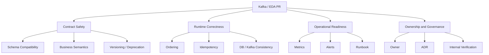

# Cheatsheet Kafka Part 049 — PR Review and Architecture Decision Checklist

## 1. Core idea

Kafka changes should not be reviewed as isolated code changes.

A Kafka PR can change:

- business semantics,
- event contracts,
- data ownership,
- ordering assumptions,
- replay behavior,
- downstream coupling,
- security exposure,
- operational load,
- customer-impact failure modes.

A small producer change can silently affect many consumers.

A small schema change can break production consumers.

A small partition-key change can destroy ordering.

A small retry change can create an infinite storm.

A small DLQ change can hide business data corruption.

A small retention change can remove the only safe replay source.

The senior review question is not:

> Does this code compile and publish a message?

The senior review question is:

> Is this event-driven change correct, observable, secure, replay-safe, evolvable, and operable under failure?

---

## 2. Review mindset

Review Kafka changes using four lenses.

A Kafka PR is risky when it answers only the local implementation question.

A mature Kafka PR explains:

- what business fact or command is represented,
- who owns the event,
- who consumes it,
- what compatibility is guaranteed,
- what happens during retry, duplicate, replay, and failure,
- what metrics prove it is working,
- what runbook explains recovery,
- what internal assumptions must be verified.

---

## 3. Fast triage: what kind of Kafka change is this?

Before reviewing details, classify the PR.

### Event contract change

Examples:

- new event type,
- new schema,
- field added or removed,
- enum changed,
- event version changed,
- payload semantics changed,
- metadata standard changed.

Primary risks:

- breaking consumers,
- ambiguous meaning,
- hidden coupling,
- privacy leakage,
- replay incompatibility.

### Producer change

Examples:

- new producer,
- partition key changed,
- topic changed,
- producer config changed,
- headers changed,
- outbox publisher changed,
- sync/async send changed.

Primary risks:

- lost event,
- duplicate event,
- ordering break,
- dual-write failure,
- throughput/latency regression.

### Consumer change

Examples:

- new consumer group,
- offset commit logic changed,
- handler changed,
- retry/DLQ changed,
- idempotency logic changed,
- external call added,
- database write changed.

Primary risks:

- duplicate processing,
- lost processing,
- stuck consumer,
- poison-event loop,
- business state corruption.

### Platform/runtime change

Examples:

- topic config changed,
- retention changed,
- compaction changed,
- partition count changed,
- ACL changed,
- connector config changed,
- Kafka Streams topology changed,
- deployment replicas changed.

Primary risks:

- data loss,
- ordering change,
- replay loss,
- authorization failure,
- rebalance storm,
- state-store restoration issue.

---

## 4. Event design review

A Kafka event should represent a clear business or integration fact.

Bad event design usually looks technically reasonable but semantically vague.

### Review questions

- What happened?
- Who says it happened?
- When did it happen?
- Which aggregate does it belong to?
- Is it a domain event, integration event, command, notification, audit event, or state-transfer event?
- Is the event name past tense when it represents a fact?
- Is the event name command-like when it asks another service to act?
- Does the event describe business meaning or internal implementation detail?
- Can consumers understand the event without reading producer code?
- Is the event too generic, such as `EntityUpdated`, `StatusChanged`, or `MessageCreated`?
- Is the event too specific to one downstream consumer?
- Does the event leak internal database schema?
- Is the event stable enough to become a public contract?

### Good signals

- The event has clear domain meaning.
- The event has one owner.
- The event has documented consumers.
- The event has clear lifecycle semantics.
- The event can be reasoned about during replay.
- The event includes enough metadata for debugging and audit.

### Bad signals

- The event name is vague.
- The event payload mirrors a database row without intent.
- The producer does not know who consumes it.
- The event is introduced only to patch one integration gap.
- The event contains many nullable fields with unclear meaning.
- The event changes business semantics without versioning.

---

## 5. Topic design review

Topic design is an architecture decision.

It affects ownership, access control, retention, ordering, consumer discovery, and operational noise.

### Review questions

- Is this a new topic or existing topic?
- Who owns the topic?
- Who owns topic configuration?
- What is the topic naming convention?
- Is this topic domain-oriented, event-type-oriented, command-oriented, audit-oriented, retry-oriented, DLQ-oriented, or compacted-state-oriented?
- Is topic granularity too broad?
- Is topic granularity too narrow?
- Are unrelated event types mixed together?
- Are sensitive events isolated enough for ACL and retention control?
- Does the topic need compaction or delete retention?
- Is retention aligned with replay and audit needs?
- Is the topic included in event catalog or AsyncAPI documentation?
- Is topic creation managed as code?

### Topic-level review checklist

- [ ] Topic name follows convention.
- [ ] Topic owner is explicit.
- [ ] Producer owner is explicit.
- [ ] Consumer ownership is known or discoverable.
- [ ] Retention policy is intentional.
- [ ] Compaction policy is intentional.
- [ ] Partition count is justified.
- [ ] Replication factor and min ISR align with criticality.
- [ ] ACL model is documented.
- [ ] Topic is represented in GitOps/topic-as-code if applicable.

---

## 6. Partition key review

Partition key is not only a technical field.

It is a consistency and ordering decision.

### Review questions

- What is the partition key?
- Why was this key chosen?
- Does ordering need to be preserved per quote, order, customer, tenant, account, or another aggregate?
- Is the key stable across event lifecycle?
- Can the key be null?
- What happens if the key is missing?
- Does the key create hot partitions?
- Does the key over-concentrate traffic by tenant?
- Does the key align with consumer state transitions?
- Does this change alter previous ordering guarantees?
- Has partition skew been measured?
- What happens if partition count is increased later?

### Common review traps

- Using tenant ID as key for high-volume tenants.
- Using random UUID as key when aggregate ordering matters.
- Using null key and assuming ordering exists.
- Changing key field without acknowledging ordering impact.
- Increasing partition count and assuming historical key placement remains unchanged.

### Safe PR expectation

A PR that creates or changes partition key should explain:

- aggregate boundary,
- ordering requirement,
- expected cardinality,
- hot-key risk,
- consumer parallelism trade-off,
- replay behavior,
- impact on existing consumers.

---

## 7. Producer review

Producer review should focus on correctness before throughput.

### Review questions

- Where is the event created?
- Is it created before, during, or after database transaction?
- Is the event published directly or through outbox?
- What happens if DB commit succeeds but Kafka publish fails?
- What happens if Kafka publish succeeds but DB commit fails?
- Is producer retry safe?
- Can duplicate events be emitted?
- Is event ID generated once or regenerated per retry?
- Is correlation ID propagated from HTTP request?
- Is causation ID set when event is triggered by another event?
- Is trace context propagated?
- Is tenant/user/actor metadata included where required?
- Are producer callbacks handled?
- Are failed sends visible?
- Are producer configs explicit enough for production?

### Producer config review

- [ ] `acks` is intentional.
- [ ] idempotent producer setting is intentional.
- [ ] retries are intentional.
- [ ] delivery timeout is intentional.
- [ ] request timeout is intentional.
- [ ] max in-flight requests are compatible with ordering expectations.
- [ ] compression is intentional.
- [ ] batching/linger is compatible with latency SLA.
- [ ] serializer is production-supported.
- [ ] metrics are exported.

### Producer correctness anti-patterns

- Publish inside transaction and assume rollback covers Kafka.
- Publish after commit without outbox and ignore failure.
- Generate new event ID on retry.
- Log and swallow producer failure.
- Return HTTP success before durable event intent exists.
- Put business-critical publishing in a best-effort async fire-and-forget path.

---

## 8. Consumer review

Consumer correctness is mostly about when side effects happen relative to offset commit.

### Review questions

- What consumer group is used?
- Is group ID stable and environment-specific?
- Is auto commit enabled?
- If manual commit is used, when is offset committed?
- What happens if processing succeeds but commit fails?
- What happens if commit succeeds but processing failed?
- What happens if consumer crashes after DB write before offset commit?
- What happens if consumer crashes after external API call before offset commit?
- Is processing idempotent?
- Is there an inbox or processed-event table?
- Are database writes and idempotency marker in the same transaction?
- Is processing order-sensitive?
- Does the consumer block the poll loop?
- Are pause/resume/backpressure mechanisms used safely?
- Is graceful shutdown implemented?

### Consumer config review

- [ ] `enable.auto.commit` is intentional.
- [ ] `max.poll.records` fits processing time.
- [ ] `max.poll.interval.ms` fits worst-case processing.
- [ ] session timeout and heartbeat settings are understood.
- [ ] fetch size is compatible with event size.
- [ ] concurrency does not exceed partition/ordering constraints.
- [ ] shutdown commits are safe.
- [ ] rebalance handling is safe.

### Consumer anti-patterns

- Commit offset before side effects are durable.
- Process non-idempotently under at-least-once delivery.
- Call external service without deduplication or compensation.
- Retry forever inside the poll loop.
- Treat DLQ as success without alerting.
- Scale replicas beyond partitions and expect more throughput.

---

## 9. Idempotency review

Idempotency is the primary application-level defense against duplicate delivery.

### Review questions

- What is the idempotency key?
- Is it event ID, command ID, aggregate version, natural business key, or a composite key?
- Is uniqueness enforced by database constraint?
- Is idempotency checked and recorded in the same transaction as business side effect?
- Is idempotency local to a consumer or global across workflow?
- Does retry reuse the same idempotency key?
- Does replay reuse the same idempotency key?
- Is the idempotency store retention long enough?
- What happens when the idempotency store is cleaned up?
- Is Redis used for idempotency? If yes, what happens on eviction or data loss?

### Safe implementation signals

- Unique constraint protects duplicate event processing.
- Idempotency record and business mutation commit together.
- Duplicate handling is observable.
- Replay behavior is explicitly tested.
- Business idempotency is not confused with technical deduplication.

---

## 10. Retry and DLQ review

Retry design decides whether the system self-heals or self-amplifies.

### Review questions

- What failures are retryable?
- What failures are non-retryable?
- Is retry bounded?
- Is backoff fixed, exponential, delayed-topic based, or scheduler-based?
- Is retry count stored in headers or payload?
- Is original event metadata preserved?
- Is error metadata added safely?
- Is DLQ schema documented?
- Is DLQ monitored?
- Who owns DLQ triage?
- Can DLQ events be replayed safely?
- Is manual replay audited?
- Does retry preserve ordering assumptions?
- Can one poison event block an entire partition?
- Is skip/stop decision explicit?

### DLQ checklist

- [ ] DLQ topic naming is standard.
- [ ] DLQ payload preserves original event.
- [ ] DLQ metadata includes failure reason/class/source.
- [ ] DLQ does not leak sensitive data beyond approved access.
- [ ] DLQ has retention policy.
- [ ] DLQ has alerting.
- [ ] DLQ replay is documented.
- [ ] DLQ replay is idempotent and audited.

---

## 11. Schema compatibility review

Schema compatibility protects consumers from surprise.

### Review questions

- What schema format is used: JSON, Avro, Protobuf, JSON Schema?
- Is Schema Registry used?
- What compatibility mode applies?
- Is this a backward-compatible change?
- Is this a forward-compatible change?
- Is this a full-compatible change?
- Are required fields added?
- Are fields removed?
- Are fields renamed?
- Are enum values added or removed?
- Are defaults defined?
- Are optional fields semantically clear?
- Are consumers tolerant of unknown fields?
- Are old events still readable?
- Is schema compatibility checked in CI?
- Is schema documentation updated?

### Breaking-change indicators

- Removing a field consumed downstream.
- Renaming a field without migration/versioning.
- Adding required fields without defaults.
- Changing field type.
- Reusing enum values for different meaning.
- Changing event semantics without changing schema.
- Assuming all consumers deploy at the same time.

---

## 12. Event metadata review

Metadata is what makes distributed systems debuggable.

### Review questions

- Is event ID present?
- Is aggregate ID present?
- Is event type present?
- Is event version present?
- Is event time present?
- Is source service present?
- Is correlation ID present?
- Is causation ID present where applicable?
- Is trace context propagated?
- Is tenant ID present where applicable?
- Is actor/user ID present where applicable?
- Is idempotency key present where applicable?
- Is partition key derivable and documented?
- Are headers vs payload used consistently?
- Are metadata fields standardized across services?

### Review smell

A PR is weak if debugging requires guessing from logs because the event lacks correlation, causation, or identity metadata.

---

## 13. Outbox review

Outbox is the standard defense against DB + Kafka dual-write failure.

### Review questions

- Is business state and outbox row inserted in the same DB transaction?
- Does outbox row include event ID, event type, payload, metadata, partition key, status, retry count, and timestamps?
- Is payload serialized before or after commit?
- Can serialization failure occur after DB commit?
- Is publisher polling or CDC-based?
- If polling, how are rows locked?
- Is `SKIP LOCKED` used safely?
- Is publisher concurrency safe?
- Is ordering required across outbox rows?
- How are publish failures retried?
- When is row marked published?
- Is outbox cleanup safe?
- Is outbox lag observable?
- Is outbox migration backward-compatible?

### Outbox anti-patterns

- Separate DB transaction for business row and outbox row.
- Outbox without stable event ID.
- Outbox publisher with no idempotent producer or duplicate tolerance.
- Mark published before Kafka acknowledgement.
- Cleanup before downstream replay window is understood.

---

## 14. Inbox review

Inbox is the standard defense against duplicate consumer processing.

### Review questions

- Does the consumer record processed event ID?
- Is uniqueness enforced in PostgreSQL?
- Is inbox write in the same transaction as business mutation?
- Does inbox store processing status?
- Does inbox store failure/retry metadata?
- Is event payload stored for audit or replay debugging?
- What is inbox retention?
- What happens when replay occurs after inbox cleanup?
- Does inbox distinguish duplicate event from duplicate command?
- Is inbox observable?

### Inbox anti-patterns

- Check-then-insert without unique constraint.
- Deduplication stored only in memory.
- Redis-only deduplication for critical state changes without durability plan.
- Business update and inbox marker committed separately.
- Replay not tested.

---

## 15. CDC and Debezium review

CDC changes affect both database and Kafka operations.

### Review questions

- Is the connector source table documented?
- Is this raw CDC or outbox event routing?
- Is Debezium connector config managed as code?
- What snapshot mode is used?
- Is incremental snapshot needed?
- Are table/schema changes compatible with connector?
- Is publication configured correctly?
- Is replication slot monitored?
- What happens if connector stops?
- What happens if replication slot lag grows?
- Is WAL retention risk understood?
- Are tombstone/delete events expected?
- Is transaction metadata needed?
- Are schema-change events consumed or ignored?
- Is connector offset backup/recovery understood?

### CDC anti-patterns

- Treating raw database row changes as stable domain events.
- Ignoring replication slot lag.
- Running snapshots without capacity planning.
- Changing DB schema without connector compatibility check.
- Assuming connector restart is harmless without offset understanding.

---

## 16. Kafka Streams review

Kafka Streams PRs are application, state, topology, and operations changes.

### Review questions

- What is the application ID?
- Does the topology use KStream, KTable, GlobalKTable, Processor API, or DSL?
- Is the operation stateless or stateful?
- Are internal topics created?
- Are repartition topics created?
- Are changelog topics created?
- Is key selection correct before aggregation/join?
- Are joins semantically valid?
- Are windows based on event time or processing time?
- Is grace period correct?
- How are late events handled?
- Is RocksDB state size estimated?
- Is standby replica configured if needed?
- What is restore time after restart?
- Is topology upgrade compatible?
- Is state migration needed?
- Is exactly-once processing configured intentionally?

### Streams anti-patterns

- Adding a stateful operation without considering internal topics.
- Joining streams with incompatible keys.
- Using processing time when business semantics require event time.
- Ignoring late events.
- Deploying topology change without state migration plan.

---

## 17. ksqlDB review

ksqlDB changes are production queries, not temporary SQL snippets.

### Review questions

- Is this query persistent or ad hoc?
- Who owns the query?
- What topics does it read?
- What topics/tables does it write?
- Is it a stream or table model?
- Is query state materialized?
- Is Schema Registry integration correct?
- How is query deployed and promoted?
- How is query stopped or rolled back?
- What is the scaling model?
- What happens during restart?
- Are pull/push query expectations documented?
- Is ksqlDB the right tool compared with Kafka Streams or database projection?

### ksqlDB anti-patterns

- Using ksqlDB as an unmanaged production database.
- Creating persistent queries manually without GitOps.
- Depending on materialized views without ownership.
- Ignoring schema evolution.
- Ignoring operational limits and query lifecycle.

---

## 18. Security review

Kafka security review must include transport, identity, authorization, secrets, and data exposure.

### Review questions

- What principal does the producer/consumer use?
- Are ACLs least-privilege?
- Are topic read/write permissions scoped?
- Are consumer group permissions scoped?
- Are transactional ID permissions scoped if needed?
- Are Schema Registry permissions scoped?
- Are connector credentials protected?
- Are secrets loaded from approved secret manager?
- Is credential/certificate rotation supported?
- Is TLS/mTLS/SASL/OAuth/IAM usage documented?
- Are sensitive topics isolated?
- Are DLQ topics protected?
- Are logs redacted?
- Are audit logs available?

### Security anti-patterns

- Shared Kafka principal across many services.
- Wildcard topic permissions.
- Consumer has read access to unrelated sensitive topics.
- DLQ less protected than source topic.
- Kafka credentials stored in repository or plain ConfigMap.
- No rotation path.

---

## 19. Privacy and compliance review

A schema change can become a privacy incident.

### Review questions

- Does payload include PII?
- Does header include PII?
- Is data classification documented?
- Is this data necessary for consumers?
- Can a token/reference replace raw sensitive data?
- What is retention for this topic?
- What is retention for retry/DLQ topics?
- Are events replicated cross-region or cross-account?
- Is replay privacy-reviewed?
- Are logs redacted?
- Is compliance evidence updated?

### Review smell

If nobody can say why a sensitive field must be in the event, it should not be there.

---

## 20. Observability review

A Kafka change is not production-ready until it is observable.

### Review questions

- How do we know the producer is publishing successfully?
- How do we know events are being consumed?
- How do we detect consumer lag?
- How do we detect processing failures?
- How do we detect retry/DLQ growth?
- How do we detect schema/deserialization errors?
- How do we detect outbox lag?
- How do we detect connector failure?
- How do we detect CDC slot lag?
- How do we detect rebalance storm?
- Are dashboards updated?
- Are alerts actionable?
- Is there a runbook link?
- Are logs structured with event ID and correlation ID?
- Are traces propagated?

### Metrics to expect

- producer send rate,
- producer error rate,
- producer retry rate,
- producer latency,
- consumer lag,
- consumer processing latency,
- commit latency,
- rebalance count/rate,
- DLQ count,
- retry count,
- deserialization failure count,
- outbox unpublished count/age,
- inbox duplicate count,
- connector status,
- CDC replication slot lag.

---

## 21. Performance review

Performance review must distinguish throughput, latency, and correctness.

### Review questions

- What is expected event volume?
- What is expected event size?
- What is expected peak rate?
- What latency SLA exists?
- Is producer batching configured intentionally?
- Is compression configured intentionally?
- Is partition count sufficient?
- Is partition key skew measured?
- Is consumer parallelism sufficient?
- Is consumer processing CPU-bound, IO-bound, DB-bound, or external-service-bound?
- Is backpressure handled?
- Is retention/storage capacity sufficient?
- Is broker/network/disk impact understood?
- Is load testing done for critical flow?

### Review traps

- Increasing partition count to fix consumer code inefficiency.
- Increasing consumer replicas beyond partition count.
- Reducing acks/retries to improve latency without accepting data loss risk.
- Increasing batch size without checking tail latency.
- Ignoring event size growth from schema changes.

---

## 22. Operational readiness review

Production readiness is about how the system behaves when things go wrong.

### Review questions

- Is there a runbook?
- Who owns incident response?
- What alert fires first?
- What dashboard is used first?
- What is the safe mitigation?
- What action is dangerous?
- Can the change be rolled back?
- Can schema be rolled back safely?
- Can topic config be rolled back safely?
- Can consumers be paused safely?
- Can offsets be reset safely?
- Can DLQ be replayed safely?
- Is data repair procedure documented?
- Is customer impact classification understood?

### Operational readiness checklist

- [ ] Dashboard exists.
- [ ] Alerts exist.
- [ ] Runbook exists.
- [ ] Owner exists.
- [ ] Rollback path exists.
- [ ] Replay procedure exists if needed.
- [ ] Data repair path exists if needed.
- [ ] Support/customer impact notes exist if needed.

---

## 23. ADR review for event-driven decisions

Some Kafka decisions should not live only in PR discussion.

They deserve an ADR.

Use an ADR when the change affects:

- event contract,
- topic topology,
- partition key,
- service ownership,
- source of truth,
- consistency model,
- retry/DLQ strategy,
- outbox/CDC choice,
- consumer processing model,
- schema versioning strategy,
- Kafka Streams/ksqlDB adoption,
- multi-region or DR behavior,
- security model.

### ADR should include

- context,
- decision,
- alternatives considered,
- chosen trade-off,
- failure modes,
- data consistency model,
- event ownership,
- operational implications,
- observability plan,
- rollout plan,
- rollback plan,
- internal verification checklist.

### ADR smell

An ADR is weak when it says only:

> We use Kafka for scalability.

A strong ADR explains:

> We use Kafka because producers and consumers must be decoupled, replay is required, throughput is high, ordering is needed per order ID, and at-least-once delivery will be handled through inbox idempotency.

---

## 24. Senior engineer review questions

Use these questions when reviewing Kafka PRs.

### Event semantics

- What business fact does this event represent?
- Is it a command disguised as an event?
- Is it a notification event or state-transfer event?
- Can consumers understand it without producer internals?

### Ownership

- Who owns this topic?
- Who owns this event schema?
- Who owns DLQ triage?
- Who owns replay approval?
- Who owns breaking-change communication?

### Correctness

- What happens on duplicate event?
- What happens on missing event?
- What happens on out-of-order event?
- What happens on replay?
- What happens if consumer crashes after side effect?

### Consistency

- Is there a dual-write problem?
- Is outbox needed?
- Is inbox needed?
- Is CDC appropriate?
- Is reconciliation needed?

### Operations

- What is the first dashboard to open during incident?
- What alert detects failure?
- What log fields prove causality?
- What is the safe rollback?
- What action could make it worse?

---

## 25. Internal verification checklist

Use this checklist against the actual CSG/team environment.

### Codebase

- [ ] Which modules contain Kafka producers?
- [ ] Which modules contain Kafka consumers?
- [ ] Is there a shared Kafka client library/wrapper?
- [ ] Is there a standard event metadata model?
- [ ] Is there a standard retry/DLQ framework?
- [ ] Is there a standard outbox/inbox implementation?
- [ ] Are Kafka configs centralized or scattered?

### Event and topic governance

- [ ] Where is the topic list maintained?
- [ ] Where are event schemas maintained?
- [ ] Is there an event catalog?
- [ ] Is AsyncAPI used?
- [ ] Who approves schema changes?
- [ ] Who approves topic changes?
- [ ] Who owns compatibility policy?

### Runtime and platform

- [ ] Which Kafka distribution/runtime is used?
- [ ] Is Kafka managed cloud, self-managed, Kubernetes, on-prem, or hybrid?
- [ ] Is Schema Registry used?
- [ ] Is Kafka Connect used?
- [ ] Is Debezium used?
- [ ] Is Kafka Streams or ksqlDB used?
- [ ] What monitoring stack is used?

### CI/CD and GitOps

- [ ] Are topics managed as code?
- [ ] Are schemas managed as code?
- [ ] Are connector configs managed as code?
- [ ] Are ACLs managed as code?
- [ ] Are compatibility checks in CI?
- [ ] Are topic config changes reviewed?
- [ ] Are rollback procedures documented?

### Production operations

- [ ] Where are Kafka dashboards?
- [ ] Where are consumer lag dashboards?
- [ ] Where are DLQ dashboards?
- [ ] Where are connector dashboards?
- [ ] Where are CDC replication slot dashboards?
- [ ] Where are runbooks?
- [ ] Where are incident notes/postmortems?

---

## 26. PR review checklist summary

Use this compact checklist for daily review.

### Contract

- [ ] Event name is clear.
- [ ] Event type is classified.
- [ ] Schema is compatible.
- [ ] Metadata is complete.
- [ ] Owner and consumers are known.
- [ ] Documentation/catalog updated.

### Topic and partitioning

- [ ] Topic name follows convention.
- [ ] Topic owner is explicit.
- [ ] Retention/compaction is intentional.
- [ ] Partition count is justified.
- [ ] Partition key is justified.
- [ ] Ordering impact is documented.

### Producer

- [ ] Transaction boundary is safe.
- [ ] Outbox is used when needed.
- [ ] Event ID is stable.
- [ ] Retry is safe.
- [ ] Publish failure is visible.
- [ ] Producer metrics exist.

### Consumer

- [ ] Offset commit strategy is safe.
- [ ] Processing is idempotent.
- [ ] Inbox/processed-event table exists when needed.
- [ ] Retry/DLQ is bounded and observable.
- [ ] Replay behavior is safe.
- [ ] Shutdown/rebalance behavior is safe.

### Operations

- [ ] Dashboards exist.
- [ ] Alerts exist.
- [ ] Runbook exists.
- [ ] Rollback path exists.
- [ ] Replay/data repair path exists if needed.
- [ ] Security/privacy review is done.

---

## 27. Final mental model

Kafka review is architecture review.

The artifact under review might be Java code, a schema file, a topic YAML, a connector JSON, or a Kubernetes manifest.

But the real change is often a distributed-system behavior change.

A senior engineer should review Kafka changes by asking:

- What contract is being created or changed?
- What ordering assumption is introduced or removed?
- What failure mode becomes possible?
- What duplicate/replay behavior is expected?
- What data is now copied to another boundary?
- What operational signal proves this works?
- What recovery action is safe?
- What internal assumption must be verified?

The purpose of review is not to block Kafka usage.

The purpose is to keep event-driven systems from becoming invisible production coupling.
