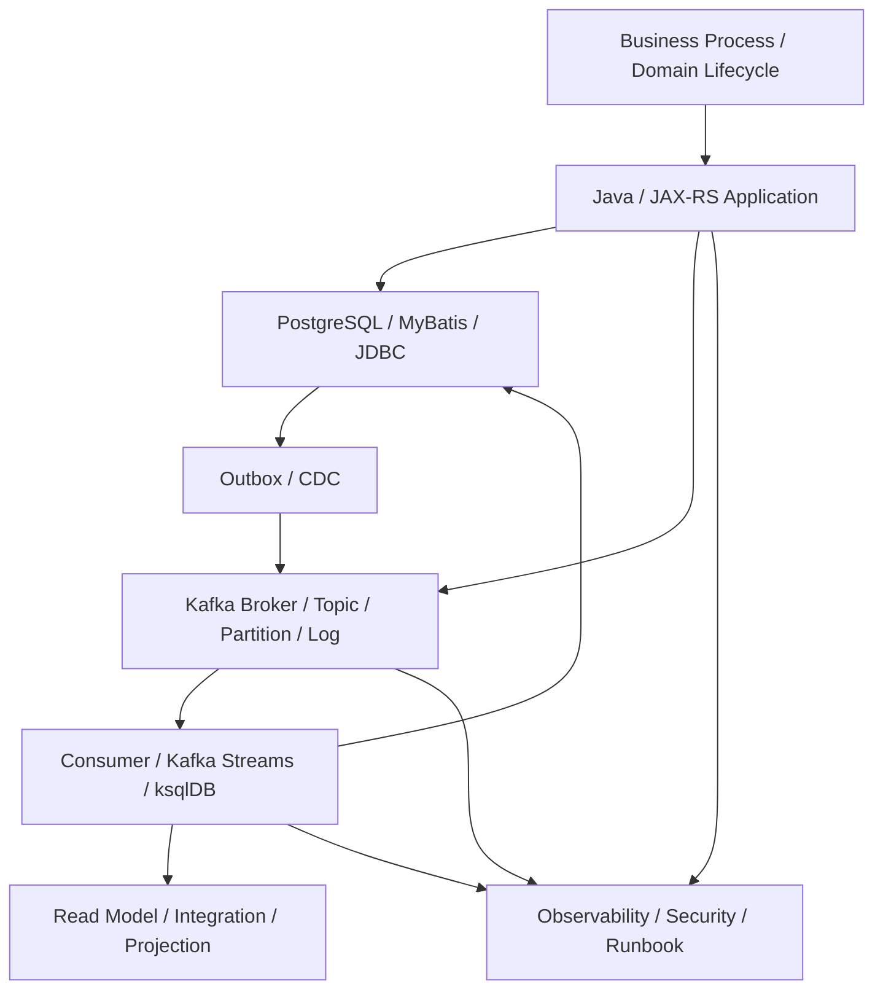
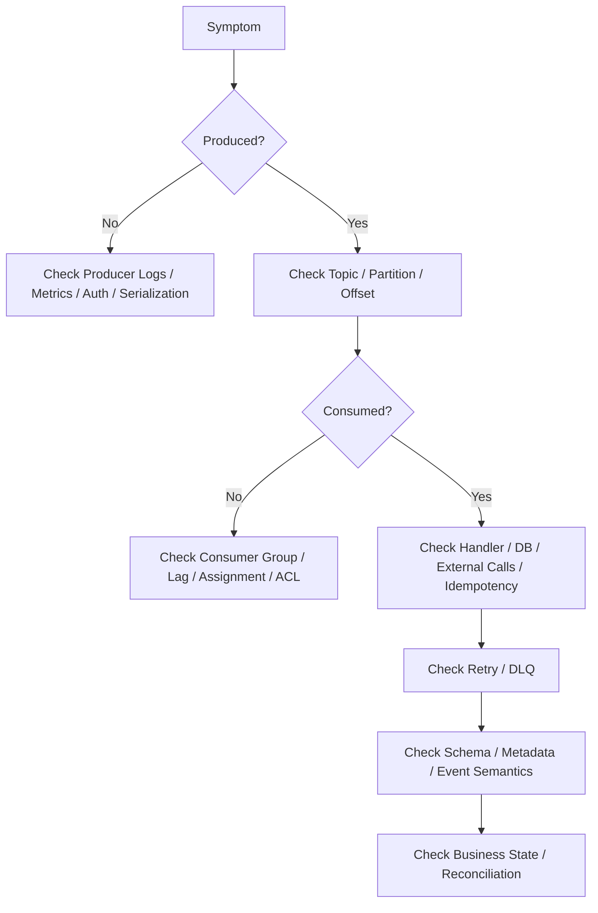

# Cheatsheet Kafka Part 050 — Kafka Mastery Map for Senior Backend Engineer

## 1. Core idea

This is the final part of the Kafka series.

Kafka mastery is not the ability to call `producer.send()` or write a consumer loop.

Kafka mastery is the ability to reason about event-driven systems under production conditions.

That means being able to explain:

- what business fact an event represents,
- why Kafka is the right mechanism,
- how data moves from HTTP request to database transaction to event to downstream consumer,
- how ordering is preserved or lost,
- how duplicates are handled,
- how schema evolves safely,
- how failures become visible,
- how replay is performed safely,
- how production incidents are debugged,
- how the team governs event contracts over time.

The mature Kafka mental model is:

> Kafka is a distributed commit log and event streaming platform used as a production data movement backbone. It gives durable, ordered-per-partition, replayable streams, but application correctness still depends on event design, schema governance, idempotency, transaction boundaries, observability, security, and operational discipline.

---

## 2. Complete Kafka mental model

Kafka should be understood in layers.

Kafka is not only infrastructure.

It is part of the application consistency model.

A senior engineer must connect these layers:

- domain event meaning,
- HTTP/API behavior,
- transaction boundary,
- outbox/inbox correctness,
- topic and partition design,
- consumer processing,
- retry and replay,
- schema evolution,
- observability,
- platform operations.

---

## 3. Kafka as distributed commit log

Kafka stores records in append-only partition logs.

The key implications are:

- records are durable according to replication and acknowledgement configuration,
- records have offsets,
- ordering is guaranteed only within a partition,
- consumers track offsets independently,
- replay is possible while records are retained,
- retention and compaction affect what can be replayed,
- Kafka does not delete a message just because one consumer processed it.

Senior-level reasoning:

- Kafka is not a queue that transfers ownership of a message to one worker.
- Kafka is not a database transaction log for your application state unless you design around that explicitly.
- Kafka is not a magic exactly-once layer for PostgreSQL side effects.
- Kafka is a durable event stream whose correctness depends on producer and consumer discipline.

---

## 4. Kafka as event backbone

Kafka works well when you need:

- decoupled producers and consumers,
- durable event history,
- multiple independent consumers,
- high-throughput event distribution,
- replay and backfill,
- asynchronous workflow,
- integration between bounded contexts,
- CDC pipelines,
- stream processing,
- event-carried state transfer.

Kafka is risky when you need:

- synchronous request/response semantics,
- strict global ordering,
- immediate read-your-writes consistency,
- small/simple task queue semantics,
- per-message manual acknowledgement semantics,
- low-operational-overhead messaging,
- hidden integration without contract governance.

The senior question is never:

> Can Kafka do this?

The question is:

> Should this business interaction become an event stream, and can we operate the resulting consistency model?

---

## 5. Event-driven architecture checklist

Use this checklist when designing or reviewing an event-driven flow.

### Event semantics

- [ ] Is this a fact, command, query, notification, integration event, or audit event?
- [ ] Is the event name clear and domain-oriented?
- [ ] Does the event represent something that actually happened?
- [ ] Is the event stable enough to become a contract?
- [ ] Are producer and consumer responsibilities clear?

### Coupling

- [ ] Does the producer know too much about downstream consumers?
- [ ] Does the consumer depend on producer internals?
- [ ] Is temporal coupling reduced?
- [ ] Is spatial coupling reduced?
- [ ] Is schema coupling governed?

### Consistency

- [ ] What is eventually consistent?
- [ ] What must remain strongly consistent?
- [ ] What is the source of truth?
- [ ] What is the read model?
- [ ] What is the reconciliation mechanism?

### Failure

- [ ] What happens if event publication fails?
- [ ] What happens if consumer processing fails?
- [ ] What happens if event is duplicated?
- [ ] What happens if event is missing?
- [ ] What happens if event arrives out of order?
- [ ] What happens during replay?

---

## 6. Topic design checklist

Topic design should be reviewed like API design.

- [ ] Topic name follows convention.
- [ ] Topic owner is explicit.
- [ ] Event owner is explicit.
- [ ] Topic purpose is clear.
- [ ] Topic granularity is justified.
- [ ] Topic does not mix unrelated business semantics.
- [ ] Topic retention is intentional.
- [ ] Topic compaction policy is intentional.
- [ ] Topic partition count is justified.
- [ ] Topic ACLs are least-privilege.
- [ ] Topic is documented in event catalog.
- [ ] Topic lifecycle/deprecation path exists.

Questions to ask:

- Is this a domain topic, integration topic, command topic, audit topic, retry topic, DLQ topic, or compacted-state topic?
- Can a new engineer understand why this topic exists?
- Can a platform engineer understand how critical it is?
- Can a security reviewer understand who should read it?

---

## 7. Partitioning checklist

Partitioning is where domain modeling meets distributed systems.

- [ ] Partition key is defined.
- [ ] Partition key matches ordering requirement.
- [ ] Aggregate boundary is clear.
- [ ] Key cardinality is sufficient.
- [ ] Hot-key risk is evaluated.
- [ ] Null-key behavior is understood.
- [ ] Consumer parallelism is aligned with partition count.
- [ ] Increasing partition count impact is understood.
- [ ] Repartitioning risk is documented.
- [ ] Out-of-order event behavior is handled.

Useful key candidates:

- quote ID,
- order ID,
- customer ID,
- account ID,
- tenant ID,
- catalog item ID,
- saga ID,
- aggregate ID.

Bad key choices usually come from ignoring business invariants.

---

## 8. Producer checklist

A producer is correct when it publishes the right event at the right durability point with the right metadata.

- [ ] Producer is not fire-and-forget for critical events.
- [ ] Producer failure is visible.
- [ ] Event ID is stable.
- [ ] Correlation ID is propagated.
- [ ] Causation ID is set where relevant.
- [ ] Trace context is propagated.
- [ ] Tenant/actor metadata is included where required.
- [ ] Partition key is intentional.
- [ ] Serializer is governed.
- [ ] Producer config is production-ready.
- [ ] Retry behavior is safe.
- [ ] Duplicate publication is expected and handled.
- [ ] Outbox is used when DB consistency requires it.

Core producer question:

> If the service returns success to the HTTP client, is the business state and event intent durable?

---

## 9. Consumer checklist

A consumer is correct when it can survive duplicates, crashes, retries, replay, and poison messages without corrupting state.

- [ ] Consumer group ID is intentional.
- [ ] Offset commit strategy is explicit.
- [ ] Auto commit is not accidentally enabled.
- [ ] Offset is committed only after durable processing when required.
- [ ] Processing is idempotent.
- [ ] Inbox or processed-event table exists when needed.
- [ ] Business mutation and idempotency marker commit together.
- [ ] Retry is bounded.
- [ ] DLQ is observable.
- [ ] Poison events do not block forever.
- [ ] External side effects are deduplicated or compensated.
- [ ] Shutdown is graceful.
- [ ] Rebalance behavior is understood.
- [ ] Replay is tested.

Core consumer question:

> If this event is delivered twice, after a crash, during replay, can the consumer still produce correct business state?

---

## 10. Delivery semantics checklist

Kafka delivery semantics must be translated into application semantics.

### At-most-once

Use only when loss is acceptable.

Ask:

- [ ] Can this event be lost?
- [ ] Is the business impact acceptable?
- [ ] Is loss detectable?

### At-least-once

Default practical model for most enterprise Kafka systems.

Ask:

- [ ] Can this event be duplicated?
- [ ] Is consumer idempotent?
- [ ] Is replay safe?

### Exactly-once in Kafka context

Useful only in bounded Kafka transaction/Streams contexts.

Ask:

- [ ] Are all side effects inside Kafka transaction scope?
- [ ] Is database outside the transaction?
- [ ] Is outbox/inbox still required?
- [ ] Is the team confusing Kafka EOS with end-to-end business exactly-once?

### Effectively-once

Usually the practical target.

Achieved through:

- stable event IDs,
- idempotent producers,
- outbox,
- inbox,
- unique constraints,
- replay-safe handlers,
- reconciliation.

---

## 11. Idempotency checklist

Idempotency is not optional for serious Kafka consumers.

- [ ] Idempotency key is defined.
- [ ] Idempotency key is stable across retries.
- [ ] Idempotency key is stable across replay.
- [ ] Idempotency key is persisted durably.
- [ ] Unique constraint protects duplicate processing.
- [ ] Idempotency marker and business change commit atomically.
- [ ] Idempotency retention is sufficient.
- [ ] Duplicate events are logged/metriced.
- [ ] Business idempotency is understood separately from technical deduplication.

Common patterns:

- event ID deduplication,
- command ID deduplication,
- aggregate version check,
- natural business key uniqueness,
- inbox table,
- processed-event table.

---

## 12. Retry and DLQ checklist

Retries should recover transient failure without hiding permanent failure.

- [ ] Retryable errors are classified.
- [ ] Non-retryable errors are classified.
- [ ] Retry is bounded.
- [ ] Backoff is intentional.
- [ ] Retry metadata is preserved.
- [ ] DLQ schema is documented.
- [ ] DLQ topic is protected.
- [ ] DLQ is monitored.
- [ ] DLQ owner is clear.
- [ ] Replay procedure exists.
- [ ] Replay is audited.
- [ ] Replay is idempotent.
- [ ] Poison event handling is explicit.

Avoid:

- infinite retry loops,
- retry inside poll loop forever,
- DLQ without alert,
- DLQ without owner,
- replay without approval,
- replay without idempotency.

---

## 13. Schema governance checklist

Event schema is the API of event-driven architecture.

- [ ] Schema format is known: Avro, Protobuf, JSON Schema, JSON.
- [ ] Schema Registry or equivalent governance exists.
- [ ] Compatibility mode is known.
- [ ] Subject naming strategy is known.
- [ ] Required/optional/default semantics are understood.
- [ ] Enum evolution is reviewed.
- [ ] Field removal/rename is governed.
- [ ] Consumers tolerate compatible evolution.
- [ ] Old events remain readable.
- [ ] Schema compatibility check runs in CI.
- [ ] Breaking change requires version/deprecation plan.
- [ ] Event documentation is updated.

Mental model:

> A schema change is not safe because the producer compiles. It is safe when all current and future consumers can interpret the stream correctly.

---

## 14. Event metadata checklist

Metadata makes event flows auditable and debuggable.

- [ ] event ID,
- [ ] event type,
- [ ] event version,
- [ ] event time,
- [ ] source service,
- [ ] aggregate ID,
- [ ] partition key,
- [ ] correlation ID,
- [ ] causation ID,
- [ ] trace ID / span context,
- [ ] command ID,
- [ ] idempotency key,
- [ ] tenant ID,
- [ ] actor/user ID,
- [ ] schema version.

The metadata rule:

> If production debugging needs it, make it part of the event/header standard before the incident.

---

## 15. Outbox and inbox checklist

Outbox protects producer-side consistency.

Inbox protects consumer-side consistency.

### Outbox

- [ ] Business row and outbox row are inserted in same DB transaction.
- [ ] Outbox row has stable event ID.
- [ ] Payload and metadata are complete.
- [ ] Publisher is polling or CDC-based by design.
- [ ] Publish retry is safe.
- [ ] Published marker is updated after acknowledgement.
- [ ] Outbox lag is observable.
- [ ] Cleanup respects replay/audit needs.

### Inbox

- [ ] Processed event ID is recorded.
- [ ] Unique constraint enforces deduplication.
- [ ] Inbox marker and business mutation commit together.
- [ ] Processing status is visible.
- [ ] Replay behavior is safe.
- [ ] Cleanup respects replay/idempotency needs.

Combined mental model:

> Outbox prevents losing an event after database commit. Inbox prevents processing the same event twice after Kafka redelivery or replay.

---

## 16. CDC checklist

CDC is powerful because it moves data from database logs to Kafka.

It is risky because it couples database operations to streaming operations.

- [ ] CDC purpose is clear: raw change stream or outbox event routing.
- [ ] Debezium connector config is versioned.
- [ ] Replication slot is monitored.
- [ ] WAL retention risk is understood.
- [ ] Snapshot mode is documented.
- [ ] Incremental snapshot behavior is understood.
- [ ] Schema change handling is known.
- [ ] Tombstone/delete behavior is known.
- [ ] Connector offset storage is understood.
- [ ] Connector failure runbook exists.
- [ ] CDC lag alert exists.
- [ ] Database migration compatibility is checked.

Core CDC question:

> Is the team treating database row changes as business events, or using CDC to publish deliberate outbox events?

---

## 17. Kafka Connect checklist

Kafka Connect is production infrastructure.

- [ ] Connector owner is clear.
- [ ] Source/sink system owner is clear.
- [ ] Connector config is managed as code.
- [ ] Converter is intentional.
- [ ] SMT usage is documented.
- [ ] Error tolerance is intentional.
- [ ] Connector DLQ is configured where needed.
- [ ] Offset/config/status topics are understood.
- [ ] Task count/scaling is justified.
- [ ] Restart/upgrade procedure exists.
- [ ] Monitoring dashboard exists.
- [ ] Failure runbook exists.

Review smell:

> Connector is manually configured in UI and nobody owns its schema, offsets, DLQ, or restart behavior.

---

## 18. Kafka Streams checklist

Kafka Streams is a stateful application runtime.

- [ ] Application ID is intentional.
- [ ] Topology is documented.
- [ ] Internal topics are understood.
- [ ] Repartition topics are expected.
- [ ] Changelog topics are expected.
- [ ] State store size is estimated.
- [ ] RocksDB operational behavior is understood.
- [ ] Windowing semantics are correct.
- [ ] Late event handling is defined.
- [ ] Event time vs processing time is intentional.
- [ ] Restore time is acceptable.
- [ ] Topology upgrade path exists.
- [ ] State migration plan exists when needed.
- [ ] EOS setting is intentional.

Streams mental model:

> Kafka Streams is not just a consumer. It is a local-state, internal-topic, rebalance-sensitive processing application.

---

## 19. ksqlDB checklist

ksqlDB can simplify stream/table processing, but it must be governed.

- [ ] Query owner is clear.
- [ ] Persistent queries are managed as code.
- [ ] Streams/tables are documented.
- [ ] Source and sink topics are documented.
- [ ] Schema Registry integration is verified.
- [ ] Materialized views have ownership.
- [ ] Query lifecycle is governed.
- [ ] Scaling model is understood.
- [ ] Failure and restart behavior is understood.
- [ ] Rollback path exists.
- [ ] ksqlDB is justified over Kafka Streams or database projection.

ksqlDB warning:

> Do not let ksqlDB become an unowned production database made of SQL snippets.

---

## 20. Security checklist

Kafka security covers identities, permissions, networks, secrets, and data.

- [ ] TLS/mTLS/SASL/OAuth/IAM mechanism is known.
- [ ] Service principal is unique and scoped.
- [ ] Topic ACLs are least-privilege.
- [ ] Consumer group ACLs are least-privilege.
- [ ] Transactional ID permissions are least-privilege.
- [ ] Schema Registry permissions are scoped.
- [ ] Kafka Connect credentials are protected.
- [ ] Secrets are stored in approved secret manager.
- [ ] Certificate/credential rotation works.
- [ ] Network access is restricted.
- [ ] Sensitive topics are isolated.
- [ ] DLQ topics have equivalent protection.
- [ ] Audit logs are available.

Security principle:

> Kafka makes data easy to distribute; security makes distribution accountable.

---

## 21. Privacy and compliance checklist

- [ ] Event data classification exists.
- [ ] PII in payload is minimized.
- [ ] PII in headers is avoided unless explicitly approved.
- [ ] Sensitive fields are documented.
- [ ] Logs are redacted.
- [ ] DLQ privacy risk is reviewed.
- [ ] Replay privacy risk is reviewed.
- [ ] Retention matches business/compliance needs.
- [ ] Cross-region replication matches data residency rules.
- [ ] Access to sensitive topics is audited.
- [ ] Compliance evidence is preserved.

Privacy principle:

> Every event is another copy of data. Every copy needs purpose, protection, retention, and accountability.

---

## 22. Observability checklist

A Kafka system without observability is a delayed incident.

### Producer

- [ ] send rate,
- [ ] send latency,
- [ ] error rate,
- [ ] retry rate,
- [ ] batch size,
- [ ] record size,
- [ ] delivery timeout count.

### Consumer

- [ ] consumer lag,
- [ ] partition lag,
- [ ] processing latency,
- [ ] commit latency,
- [ ] poll latency,
- [ ] rebalance rate,
- [ ] duplicate count,
- [ ] DLQ count.

### Broker/platform

- [ ] under-replicated partitions,
- [ ] offline partitions,
- [ ] ISR shrink,
- [ ] request latency,
- [ ] disk usage,
- [ ] network throughput,
- [ ] controller health,
- [ ] broker CPU/memory.

### Integration runtimes

- [ ] Connect task status,
- [ ] connector error count,
- [ ] connector DLQ count,
- [ ] CDC slot lag,
- [ ] Streams restore time,
- [ ] Streams state store metrics,
- [ ] ksqlDB query status.

Observability principle:

> Measure business-flow health, not only Kafka component health.

---

## 23. Production readiness checklist

Before a Kafka change is production-ready:

- [ ] event contract is documented,
- [ ] schema compatibility is checked,
- [ ] topic config is reviewed,
- [ ] partition key is justified,
- [ ] producer failure is handled,
- [ ] consumer idempotency is implemented,
- [ ] retry/DLQ is bounded and monitored,
- [ ] outbox/inbox exists where needed,
- [ ] replay behavior is tested,
- [ ] security review is complete,
- [ ] privacy review is complete,
- [ ] dashboards are updated,
- [ ] alerts are actionable,
- [ ] runbook exists,
- [ ] rollback path exists,
- [ ] data repair path exists if needed,
- [ ] owner is explicit.

Production-ready does not mean:

> It works in local integration test.

Production-ready means:

> It remains understandable, safe, observable, and recoverable when dependencies fail and messages are duplicated, delayed, replayed, or malformed.

---

## 24. Architecture conversation map

When discussing Kafka architecture, anchor the conversation around these invariants.

### Business invariant

- What must never be wrong?
- What state transition must be protected?
- What customer-visible behavior depends on this event?

### Consistency invariant

- What is strongly consistent?
- What is eventually consistent?
- What is reconciled?
- What is impossible to guarantee?

### Ordering invariant

- What must be ordered?
- Per what key?
- What can be parallelized?
- What happens if ordering breaks?

### Idempotency invariant

- What can be repeated safely?
- What must be deduplicated?
- What side effect is irreversible?

### Contract invariant

- What can change without breaking consumers?
- What needs a new version?
- What is the deprecation path?

### Operational invariant

- How do we detect failure?
- How do we recover?
- How do we prove recovery worked?

---

## 25. Kafka failure-mode map

Senior engineers should recognize these failure classes quickly.

### Producer-side failures

- broker unavailable,
- authorization failure,
- serialization failure,
- timeout,
- retry exhaustion,
- duplicate publish,
- publish after DB commit failure,
- publish before DB rollback inconsistency.

### Broker/topic failures

- under-replicated partition,
- offline partition,
- ISR shrink,
- disk full,
- retention misconfiguration,
- compaction misconfiguration,
- partition skew,
- hot partition.

### Consumer-side failures

- consumer lag,
- stuck poll loop,
- rebalance storm,
- deserialization failure,
- poison event,
- duplicate processing,
- offset commit bug,
- external dependency failure,
- database constraint failure.

### Integration failures

- Schema Registry outage,
- Kafka Connect task failure,
- CDC connector stopped,
- replication slot lag,
- Streams state restore issue,
- ksqlDB query failure.

### Governance failures

- undocumented event,
- unowned topic,
- breaking schema change,
- no DLQ owner,
- no replay approval,
- excessive ACLs,
- hidden sensitive data.

---

## 26. Production debugging map

Debugging Kafka should move from symptom to boundary.

Ask in order:

1. Was the event intended?
2. Was the event durably produced?
3. Was it produced to the expected topic/partition/key?
4. Can the consumer group see it?
5. Did the consumer poll it?
6. Did deserialization succeed?
7. Did handler processing succeed?
8. Was offset committed?
9. Did it go to retry/DLQ?
10. Did business state change correctly?
11. Is reconciliation needed?

Avoid first-response actions that increase blast radius:

- random offset reset,
- replay without idempotency check,
- deleting consumer group offsets,
- disabling DLQ alert,
- changing retention during incident,
- restarting repeatedly without reading metrics,
- manually editing business data without audit.

---

## 27. Internal verification checklist

Because internal CSG architecture is not assumed, verify these directly.

### Team and ownership

- [ ] Who owns Kafka platform?
- [ ] Who owns event schemas?
- [ ] Who owns topics?
- [ ] Who owns connectors?
- [ ] Who owns DLQ triage?
- [ ] Who approves replay?
- [ ] Who approves schema-breaking changes?

### Codebase

- [ ] Where are Kafka producers?
- [ ] Where are Kafka consumers?
- [ ] Is there a shared Kafka library?
- [ ] Is there a standard event metadata model?
- [ ] Is there an outbox implementation?
- [ ] Is there an inbox/idempotency implementation?
- [ ] Are Testcontainers used for Kafka tests?

### Runtime

- [ ] What Kafka distribution is used?
- [ ] Is it managed, self-managed, Kubernetes, on-prem, cloud, or hybrid?
- [ ] Is Schema Registry used?
- [ ] Is Kafka Connect used?
- [ ] Is Debezium used?
- [ ] Is Kafka Streams used?
- [ ] Is ksqlDB used?
- [ ] Is RabbitMQ also used?

### Production operations

- [ ] Where are Kafka dashboards?
- [ ] Where are consumer lag dashboards?
- [ ] Where are broker dashboards?
- [ ] Where are DLQ dashboards?
- [ ] Where are connector dashboards?
- [ ] Where are runbooks?
- [ ] Where are incident notes?
- [ ] What alerts matter most?

### Governance

- [ ] Are topics as code?
- [ ] Are schemas as code?
- [ ] Are ACLs as code?
- [ ] Are connector configs as code?
- [ ] Are compatibility checks in CI?
- [ ] Are event contracts documented?
- [ ] Are ADRs used for major EDA choices?

### Domain learning

- [ ] What quote events exist?
- [ ] What order events exist?
- [ ] What catalog events exist?
- [ ] What pricing events exist?
- [ ] What approval events exist?
- [ ] What fulfillment/fallout events exist?
- [ ] Which events are customer-impacting?
- [ ] Which events are audit/compliance-relevant?

---

## 28. 30/60/90-day Kafka onboarding map

### First 30 days: understand the map

Focus:

- identify Kafka producers and consumers,
- read topic list,
- find event schemas,
- find consumer groups,
- find dashboards,
- find runbooks,
- understand auth/ACL basics,
- learn outbox/inbox usage,
- trace one quote/order event flow end to end.

Deliverable:

- personal event-flow map for one business process.

### Days 31–60: understand correctness

Focus:

- review producer transaction boundaries,
- review consumer offset commit strategy,
- inspect idempotency implementation,
- inspect retry/DLQ policy,
- inspect schema compatibility process,
- inspect CDC/Connect if used,
- read one Kafka-related incident/postmortem.

Deliverable:

- documented correctness/failure-mode checklist for one service.

### Days 61–90: improve production readiness

Focus:

- improve dashboard or alert gap,
- improve PR review checklist,
- document replay/DLQ runbook,
- add missing Testcontainers/integration test,
- improve schema compatibility gate,
- propose ADR for unclear event ownership or topic design.

Deliverable:

- one practical improvement that reduces event-driven incident risk.

---

## 29. How to keep learning Kafka in real production systems

Do not learn Kafka only from API docs.

Learn Kafka from production evidence.

Study:

- topic configurations,
- consumer group lag behavior,
- partition skew,
- producer metrics,
- DLQ patterns,
- schema evolution history,
- incident postmortems,
- retry/replay runbooks,
- outbox/inbox tables,
- CDC connector lag,
- platform upgrade notes,
- PRs that changed event contracts,
- ADRs that chose Kafka over alternatives.

Ask senior/platform/SRE/data engineers:

- Which Kafka incident taught the team the most?
- Which topic is most business-critical?
- Which consumer is most fragile?
- Which event schema is hardest to evolve?
- Which DLQ is most dangerous?
- Which replay is hardest to perform safely?
- Which dashboard do you trust during incidents?
- Which Kafka assumption should new engineers not make?

---

## 30. How to become effective in event-driven architecture discussions

Be useful by making hidden assumptions visible.

Instead of saying:

> We should use Kafka.

Ask:

- What event are we modeling?
- Who owns the event?
- What consistency do we need?
- What ordering do we need?
- What happens on duplicate?
- What happens on replay?
- What happens if downstream is unavailable?
- What is the partition key?
- What is the schema compatibility plan?
- What is the DLQ/retry plan?
- What dashboard proves this works?
- What runbook recovers it?

The best Kafka engineers are not the loudest advocates of Kafka.

They are the people who know where Kafka helps, where it hurts, and what operational discipline it requires.

---

## 31. How to prevent Kafka systems from becoming production incidents

Most Kafka incidents are not caused by Kafka alone.

They are caused by mismatched assumptions:

- producer assumes event was consumed,
- consumer assumes event is unique,
- schema owner assumes consumers upgraded,
- platform assumes application handles duplicates,
- application assumes Kafka provides database exactly-once,
- team assumes DLQ means problem solved,
- reviewer assumes event change is only code change,
- operations assumes dashboard exists,
- security assumes payload contains no sensitive data.

Prevention comes from discipline:

- explicit contracts,
- safe partition keys,
- outbox where needed,
- inbox where needed,
- bounded retry,
- owned DLQ,
- compatible schema evolution,
- tested replay,
- strong metadata,
- least privilege,
- dashboards and runbooks,
- ADRs for major choices,
- internal verification instead of assumptions.

---

## 32. Final mastery checklist

You are Kafka-ready as a senior backend engineer when you can do these consistently.

### Explain

- [ ] Explain Kafka as distributed commit log.
- [ ] Explain topic, partition, offset, consumer group, retention, compaction.
- [ ] Explain at-least-once vs effectively-once.
- [ ] Explain why exactly-once is limited.
- [ ] Explain outbox/inbox/CDC trade-offs.

### Design

- [ ] Design event contracts.
- [ ] Design topic taxonomy.
- [ ] Design partition key strategy.
- [ ] Design producer transaction boundary.
- [ ] Design idempotent consumer processing.
- [ ] Design retry/DLQ flow.
- [ ] Design replay-safe projection.

### Review

- [ ] Review Kafka producer PR.
- [ ] Review Kafka consumer PR.
- [ ] Review schema change.
- [ ] Review topic config.
- [ ] Review partition count/key.
- [ ] Review outbox/inbox implementation.
- [ ] Review operational readiness.

### Debug

- [ ] Debug message not produced.
- [ ] Debug message not consumed.
- [ ] Debug lag growth.
- [ ] Debug rebalance loop.
- [ ] Debug duplicate processing.
- [ ] Debug missing/out-of-order event.
- [ ] Debug DLQ spike.
- [ ] Debug CDC connector lag.

### Operate

- [ ] Read Kafka dashboards.
- [ ] Use runbooks safely.
- [ ] Participate in incident triage.
- [ ] Evaluate replay risk.
- [ ] Support data repair.
- [ ] Communicate customer impact.
- [ ] Write corrective/preventive actions.

### Lead

- [ ] Ask better architecture questions.
- [ ] Prevent hidden coupling.
- [ ] Push for schema governance.
- [ ] Push for observability before launch.
- [ ] Push for operational ownership.
- [ ] Document ADRs.
- [ ] Mentor others on event-driven correctness.

---

## 33. Closing mental model

Kafka is powerful because it lets systems communicate through durable streams.

Kafka is dangerous because those streams become long-lived contracts, hidden dependencies, replay sources, audit artifacts, and operational responsibilities.

The senior backend engineer’s job is to hold both truths:

- Kafka can decouple services.
- Kafka can also create invisible coupling.

- Kafka can improve resilience.
- Kafka can also spread failure across consumers.

- Kafka can enable replay.
- Kafka can also replay bad assumptions.

- Kafka can scale event distribution.
- Kafka can also scale data inconsistency.

Kafka mastery is not enthusiasm for event-driven architecture.

Kafka mastery is disciplined design, careful review, production-aware implementation, and honest failure modeling.

That is what prevents event-driven systems from becoming production incidents.
