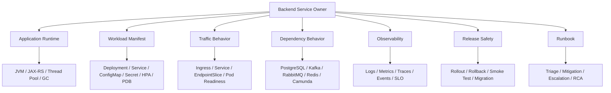

# Part 001 — Enterprise Kubernetes Operations Foundation

## 1. Core Idea

Kubernetes di production bukan sekadar tempat menjalankan container.

Untuk backend engineer, Kubernetes adalah **runtime operasional** yang menentukan bagaimana service:

- dijalankan,
- ditemukan oleh traffic,
- menerima request,
- membaca config dan secret,
- berinteraksi dengan dependency,
- di-scale,
- di-restart,
- di-rollout,
- di-rollback,
- diamati,
- diamankan,
- dan dipulihkan saat incident.

Dalam konteks enterprise backend seperti **Java 17+ / JAX-RS / Jakarta RESTful service**, Kubernetes tidak boleh dipahami hanya sebagai abstraksi deployment. Ia harus dipahami sebagai kombinasi dari:

1. **application runtime boundary**
2. **traffic routing boundary**
3. **resource allocation boundary**
4. **failure isolation boundary**
5. **observability boundary**
6. **security and identity boundary**
7. **release safety boundary**
8. **operational ownership boundary**

Senior backend engineer tidak harus menjadi cluster admin. Tetapi ia harus mampu membaca dan menalar dampak Kubernetes terhadap service yang ia miliki.

---

## 2. Why This Matters Operationally

Di sistem enterprise, outage jarang berasal dari satu penyebab tunggal.

Masalah bisa muncul dari kombinasi:

- deployment baru yang membawa config salah,
- readiness probe yang terlalu agresif,
- JVM heap terlalu besar untuk container limit,
- database connection pool terlalu besar per replica,
- HPA menaikkan replica tanpa memperhatikan Kafka partition count,
- ingress timeout lebih pendek daripada downstream timeout,
- NetworkPolicy memblokir DNS atau broker,
- secret sudah dirotasi tapi pod belum restart,
- node pressure menyebabkan eviction,
- GitOps mengembalikan manual hotfix,
- rollback aplikasi tidak kompatibel dengan migration database.

Kubernetes mempercepat deployment, tetapi juga mempercepat penyebaran kesalahan apabila service owner tidak memahami operational boundary-nya.

Kubernetes operations untuk backend engineer berarti:

> mampu menilai apakah workload berjalan aman, siap menerima traffic, observable, scalable, secure, recoverable, dan compatible dengan dependency production.

---

## 3. Day-1 vs Day-2 Kubernetes Operations

### 3.1 Day-1 Operations

Day-1 berfokus pada membuat workload bisa jalan.

Contoh:

- membuat `Deployment`,
- membuat `Service`,
- expose lewat `Ingress`,
- set `ConfigMap`,
- set `Secret`,
- membuat container image,
- deploy lewat Helm/Kustomize/GitOps,
- memastikan pod running.

Day-1 menjawab:

> "Bagaimana aplikasi bisa dideploy ke Kubernetes?"

### 3.2 Day-2 Operations

Day-2 berfokus pada menjaga workload tetap sehat setelah berjalan di production.

Contoh:

- debugging `CrashLoopBackOff`,
- membaca rollout stuck,
- menganalisis CPU throttling,
- menangani `OOMKilled`,
- men-debug ingress `502/503/504`,
- memastikan graceful shutdown,
- mengelola resource request/limit,
- mengevaluasi HPA,
- membaca Kubernetes events,
- menilai network policy impact,
- koordinasi rollback,
- membaca SLO burn-rate,
- menjalankan incident triage,
- memperbaiki runbook.

Day-2 menjawab:

> "Bagaimana aplikasi tetap reliable, observable, secure, scalable, cost-aware, dan recoverable di production?"

---

## 4. Backend Engineer Responsibility

Backend engineer tidak bertanggung jawab atas seluruh cluster, tetapi bertanggung jawab atas **runtime correctness** dari service yang dimiliki.

### 4.1 Yang Harus Dipahami Backend Engineer

Backend engineer harus memahami:

- workload type yang digunakan,
- container startup behavior,
- readiness/liveness/startup probe,
- graceful shutdown,
- dependency initialization,
- connection pool sizing,
- JVM memory behavior,
- API timeout,
- retry behavior,
- idempotency,
- traffic routing ke service,
- log/metric/trace yang wajib tersedia,
- deployment/rollback behavior,
- resource request/limit,
- HPA behavior,
- config/secret consumption,
- security context dasar,
- service account usage,
- failure mode umum.

### 4.2 Yang Harus Bisa Dilakukan Backend Engineer

Backend engineer harus mampu:

- membaca status workload,
- membedakan desired state dan actual state,
- membaca event dan condition,
- membaca logs container saat ini dan sebelumnya,
- membaca rollout status,
- menemukan apakah service punya endpoint,
- melihat apakah ingress mengarah ke service yang benar,
- mengidentifikasi recent deployment/config change,
- menghubungkan error aplikasi dengan event Kubernetes,
- memberikan hypothesis debugging yang aman,
- menentukan kapan rollback perlu dilakukan,
- menentukan kapan harus eskalasi ke SRE/platform/security.

### 4.3 Yang Tidak Boleh Diasumsikan

Jangan mengasumsikan:

- semua namespace punya policy yang sama,
- semua cluster memakai ingress controller yang sama,
- semua environment memakai GitOps,
- semua secret berasal dari Kubernetes Secret biasa,
- semua identity memakai static credential,
- EKS dan AKS punya behavior network yang identik,
- on-prem cluster punya egress behavior seperti cloud,
- platform team otomatis tahu failure di aplikasi,
- readiness endpoint yang hijau berarti bisnis flow sehat,
- pod `Running` berarti service siap menerima traffic.

---

## 5. Platform/SRE Responsibility vs Backend Responsibility

Operational clarity membutuhkan batas tanggung jawab.

### 5.1 Platform / SRE Biasanya Bertanggung Jawab Atas

- cluster lifecycle,
- Kubernetes version upgrade,
- node pool/node group,
- cluster autoscaler/Karpenter/node autoscaling,
- CNI,
- ingress controller,
- storage CSI,
- cluster-wide policy,
- observability platform,
- logging backend,
- metrics backend,
- tracing backend,
- GitOps platform,
- admission controller,
- cluster RBAC model,
- platform runbook,
- cluster availability,
- cloud integration baseline.

### 5.2 Backend Service Owner Biasanya Bertanggung Jawab Atas

- application container behavior,
- resource request/limit proposal,
- startup/readiness/liveness semantics,
- graceful shutdown,
- service-specific dashboards,
- service-specific alerts,
- service SLO/SLI,
- dependency timeout/retry,
- DB/broker/cache pool sizing,
- migration compatibility,
- release verification,
- rollback readiness,
- runbook for owned service,
- PR review for workload manifest changes,
- incident evidence for service-level failure.

### 5.3 Security Team Biasanya Bertanggung Jawab Atas

- policy standard,
- secret handling requirements,
- RBAC governance,
- vulnerability management,
- image scanning baseline,
- workload identity policy,
- audit requirements,
- compliance evidence requirements,
- exception process.

### 5.4 DevOps / Release Engineering Biasanya Bertanggung Jawab Atas

- CI/CD pipeline,
- build and artifact promotion,
- deployment automation,
- release gate,
- environment promotion,
- deployment marker,
- smoke test integration,
- rollback automation,
- pipeline audit trail.

### 5.5 Reality Check

Di banyak enterprise, boundary ini tidak selalu rapi.

Karena itu senior backend engineer harus bisa bertanya:

- "Siapa owner ingress controller?"
- "Siapa owner HPA/KEDA policy?"
- "Siapa owner secret integration?"
- "Siapa owner EKS/AKS identity integration?"
- "Siapa yang boleh rollback production?"
- "Siapa yang approve NetworkPolicy change?"
- "Siapa yang maintain runbook?"
- "Siapa yang menerima alert ini?"
- "Siapa yang menentukan resource policy?"

Jika jawabannya tidak jelas, itu sendiri adalah operational risk.

---

## 6. Kubernetes in Enterprise Java Systems

Java backend punya karakteristik khusus di Kubernetes.

### 6.1 Startup Time

Aplikasi Java/JAX-RS sering membutuhkan waktu untuk:

- start JVM,
- load framework,
- initialize dependency injection,
- connect ke database,
- initialize connection pool,
- warm up cache,
- load config,
- validate secret,
- expose management endpoint.

Jika startup probe buruk, pod bisa dibunuh sebelum aplikasi siap.

### 6.2 Memory Behavior

Java menggunakan memory bukan hanya heap.

Ada juga:

- metaspace,
- direct buffer,
- thread stack,
- code cache,
- GC overhead,
- native memory,
- TLS buffers,
- networking buffers.

Jika heap terlalu besar terhadap container memory limit, pod bisa `OOMKilled`.

### 6.3 Thread and Connection Pools

Setiap pod bisa punya:

- servlet/container worker thread,
- HTTP client pool,
- DB connection pool,
- Kafka consumer thread,
- RabbitMQ channel/connection,
- Redis connection pool,
- scheduler thread,
- background worker thread.

Replica count mengalikan semua pool tersebut.

Misalnya:

```text
30 DB connections per pod x 12 replicas = 360 DB connections
```

Saat rolling update dengan `maxSurge`, jumlah connection sementara bisa lebih tinggi.

### 6.4 Graceful Shutdown

Saat pod menerima `SIGTERM`, aplikasi harus:

1. berhenti menerima traffic baru,
2. menyelesaikan request in-flight,
3. menghentikan consumer/worker dengan aman,
4. commit offset/ack message secara benar,
5. close DB/broker/cache connection,
6. keluar sebelum grace period habis.

Jika tidak, dapat terjadi:

- request terputus,
- duplicate message processing,
- offset tidak commit,
- message redelivery,
- workflow incident,
- partial transaction,
- inconsistent state.

---

## 7. Kubernetes in CPQ / Quote / Order / Billing Systems

Untuk domain CPQ, quote/order, billing integration, dan order lifecycle, Kubernetes operations punya dampak langsung pada business correctness.

### 7.1 Request-Response API

Contoh:

- create quote,
- validate quote,
- price quote,
- submit order,
- retrieve order status,
- check eligibility.

Operational concern:

- latency,
- timeout,
- idempotency,
- traceability,
- dependency availability,
- rollback compatibility.

### 7.2 Event-Driven Processing

Contoh:

- quote approved event,
- order submitted event,
- provisioning event,
- billing sync event,
- status update event.

Operational concern:

- consumer lag,
- duplicate processing,
- out-of-order handling,
- retry/DLQ,
- partition scaling,
- graceful shutdown.

### 7.3 Workflow / Orchestration

Contoh:

- Camunda worker processing order workflow,
- manual task escalation,
- retry after dependency failure,
- incident creation,
- compensation flow.

Operational concern:

- worker concurrency,
- job timeout,
- incident visibility,
- correlation ID,
- retry policy,
- process version compatibility.

### 7.4 Database State

Contoh:

- quote state,
- order state,
- pricing snapshot,
- approval status,
- integration audit,
- billing handoff record.

Operational concern:

- migration safety,
- transaction boundary,
- connection pool,
- rollback limitation,
- data correction,
- consistency check.

---

## 8. Kubernetes as a Failure Boundary

Kubernetes does not remove failure. It changes how failure appears.

A backend engineer must understand how failures surface.

| Failure Area | Example Symptom | Possible Kubernetes Layer |
|---|---|---|
| Startup | `CrashLoopBackOff` | config, secret, image, JVM, startup probe |
| Scheduling | `Pending` | node capacity, taint, affinity, quota, PVC |
| Traffic | `503` | no endpoint, readiness failure, service selector |
| Gateway | `502/504` | ingress, upstream timeout, protocol mismatch |
| Runtime | latency spike | CPU throttling, GC, dependency latency |
| Memory | `OOMKilled` | heap/native memory, memory limit, leak |
| Config | wrong behavior | stale ConfigMap, wrong overlay, GitOps drift |
| Secret | auth failure | stale/missing secret, rotation, identity |
| Dependency | timeout | DNS, NetworkPolicy, egress, private endpoint |
| Rollout | stuck deployment | bad image, bad config, bad probe, resource issue |
| Autoscaling | no scale up | missing metric, HPA config, cluster capacity |
| Security | access denied | RBAC, IRSA, Azure Workload Identity, policy |

---

## 9. Production Safety Principles

### 9.1 Observe Before Acting

In production, jangan langsung restart, scale, delete pod, atau patch resource tanpa memahami symptom.

Mulai dari:

1. impact,
2. affected service,
3. recent change,
4. workload health,
5. traffic path,
6. dependency health,
7. logs/metrics/traces/events,
8. safe mitigation options.

### 9.2 Prefer Reversible Actions

Safe action biasanya:

- read status,
- collect evidence,
- compare current vs previous deployment,
- rollback to known good version,
- reduce traffic,
- pause rollout,
- scale within approved range,
- disable feature flag if available.

Dangerous action biasanya:

- delete production resources blindly,
- edit live object manually under GitOps,
- change NetworkPolicy without review,
- change secret without rotation process,
- increase pool size without dependency capacity check,
- force delete pod with stateful processing,
- run migration manually,
- exec into pod and mutate runtime state.

### 9.3 Know the Source of Truth

Sebelum mengubah sesuatu, pahami source of truth:

- GitOps repo?
- Helm values?
- Kustomize overlay?
- CI/CD pipeline?
- manual kubectl?
- internal deployment portal?
- Terraform/IaC?
- platform-managed config?

Jika GitOps adalah source of truth, manual patch bisa hilang di reconciliation berikutnya.

### 9.4 Capture Evidence

Saat incident, evidence penting:

- timestamp,
- deployment version,
- pod status,
- events,
- logs,
- metrics,
- traces,
- config version,
- secret version,
- rollout revision,
- HPA state,
- endpoint state,
- ingress state,
- dependency status.

Tanpa evidence, RCA akan berubah menjadi opini.

---

## 10. Operational Readiness Model

Sebuah workload backend di Kubernetes belum production-ready hanya karena pod `Running`.

Minimal harus jelas:

### 10.1 Ownership

- siapa service owner?
- siapa on-call?
- siapa escalation contact?
- siapa platform owner?
- siapa security reviewer?
- siapa approver release?

### 10.2 Runtime

- workload type benar?
- probes benar?
- graceful shutdown benar?
- resource request/limit masuk akal?
- connection pool sesuai replica?
- dependency timeout/retry aman?

### 10.3 Traffic

- Service selector benar?
- EndpointSlice terbentuk?
- Ingress/Gateway route benar?
- TLS benar?
- timeout chain aligned?
- path rewrite aman?

### 10.4 Config and Secret

- config source jelas?
- secret source jelas?
- rotation behavior jelas?
- pod restart behavior jelas?
- safe default tersedia?
- secret tidak bocor ke logs?

### 10.5 Security

- ServiceAccount least privilege?
- RBAC minimal?
- NetworkPolicy sesuai?
- security context aman?
- image scanned?
- audit trail tersedia?

### 10.6 Observability

- logs structured?
- correlation ID tersedia?
- metrics service ada?
- JVM metrics ada?
- dashboard ada?
- alert actionable?
- runbook tersedia?
- SLO jelas?

### 10.7 Release Safety

- rollout strategy aman?
- rollback path jelas?
- migration compatible?
- smoke test tersedia?
- deployment marker tersedia?
- canary/blue-green jika diperlukan?
- post-deployment verification jelas?

---

## 11. Backend Engineer Operational Map



---

## 12. Common Anti-Patterns

### 12.1 "Pod Running Means Service Healthy"

Incorrect.

Pod `Running` hanya berarti container process sedang berjalan. Service mungkin tetap tidak sehat karena:

- readiness false,
- no endpoint,
- dependency down,
- thread pool exhausted,
- DB pool exhausted,
- Kafka lag tinggi,
- ingress salah route,
- TLS trust failure,
- wrong config.

### 12.2 "Restart Pod First"

Restart bisa menyembunyikan evidence dan memperburuk incident.

Restart boleh menjadi mitigasi jika:

- failure mode dikenal,
- impact jelas,
- action approved,
- state safety dipahami,
- evidence sudah cukup,
- tidak ada risiko duplicate processing atau partial state.

### 12.3 "Increase Replica Count Solves Everything"

Scale out tidak menyelesaikan:

- DB bottleneck,
- partition limit,
- global lock contention,
- Redis hot key,
- downstream rate limit,
- bad config,
- wrong secret,
- memory leak,
- CPU throttling per pod,
- workflow incident.

### 12.4 "Readiness Should Check All Dependencies"

Terlalu banyak dependency check di readiness dapat menyebabkan traffic blackhole.

Misalnya, jika readiness bergantung pada optional downstream service, maka transient downstream failure bisa membuat semua pod tidak ready dan service kehilangan endpoint.

Readiness harus mencerminkan kemampuan menerima traffic secara benar, bukan health seluruh universe dependency.

### 12.5 "Manual Hotfix in Production Is Fine"

Jika GitOps aktif, manual patch bisa:

- di-revert otomatis,
- tidak tercatat di Git,
- tidak reproducible,
- mengacaukan audit,
- menyebabkan drift antar environment.

---

## 13. How This Series Should Be Used

Seri ini bukan tutorial dasar Kubernetes.

Gunakan seri ini sebagai:

- operational handbook,
- incident debugging guide,
- PR review checklist,
- production readiness checklist,
- onboarding map,
- platform discussion guide,
- runbook design reference,
- architecture decision checklist.

Cara membaca yang efektif:

1. pahami foundation dan mental model,
2. kuasai traffic flow,
3. kuasai pod/workload lifecycle,
4. kuasai resource/JVM behavior,
5. kuasai config/secret/identity,
6. kuasai observability,
7. kuasai common failure runbooks,
8. gunakan checklist untuk PR/release/incident.

---

## 14. Safe Investigation Commands

> Sesuaikan dengan policy internal. Jangan menjalankan command di production tanpa memastikan context, namespace, dan permission.

```bash
kubectl config current-context
kubectl get ns
kubectl get deploy,rs,pod,svc,ingress,hpa,pdb -n <namespace>
kubectl describe deploy <deployment> -n <namespace>
kubectl describe pod <pod> -n <namespace>
kubectl logs <pod> -n <namespace>
kubectl logs <pod> -n <namespace> --previous
kubectl get events -n <namespace> --sort-by=.lastTimestamp
kubectl rollout status deploy/<deployment> -n <namespace>
kubectl rollout history deploy/<deployment> -n <namespace>
kubectl get endpointslice -n <namespace>
kubectl auth can-i get pods -n <namespace>
```

Use commands to observe first. Do not mutate state until impact, owner, source of truth, and rollback path are understood.

---

## 15. Failure-Oriented Thinking

Saat melihat masalah Kubernetes, jangan mulai dari command. Mulai dari pertanyaan.

### 15.1 Impact

- Siapa user/system yang terdampak?
- API mana yang gagal?
- Flow bisnis mana yang terhenti?
- Apakah hanya satu service atau banyak service?
- Apakah failure total atau partial?

### 15.2 Recent Change

- Ada deployment baru?
- Ada config/secret change?
- Ada migration?
- Ada node upgrade?
- Ada ingress/network policy change?
- Ada cloud dependency incident?
- Ada certificate rotation?
- Ada scaling event?

### 15.3 Runtime State

- Deployment available?
- Pod ready?
- Restart count naik?
- Ada `CrashLoopBackOff`?
- Ada `OOMKilled`?
- Service punya endpoint?
- HPA melakukan scale?
- Node pressure?

### 15.4 Dependency State

- PostgreSQL reachable?
- Kafka lag naik?
- RabbitMQ queue depth naik?
- Redis latency naik?
- Camunda incidents naik?
- External HTTP dependency error?
- DNS resolving?
- TLS handshake berhasil?

### 15.5 Observability

- Logs menunjukkan error apa?
- Metrics berubah sejak kapan?
- Trace berhenti di span mana?
- Alert mana yang firing?
- Deployment marker ada?
- Event Kubernetes menunjukkan apa?

---

## 16. Internal Verification Checklist

Gunakan checklist ini untuk memetakan realita internal sebelum menerapkan materi.

### 16.1 Cluster and Environment

- [ ] Cluster apa saja yang dipakai untuk dev/test/staging/prod?
- [ ] Apakah runtime utama EKS, AKS, on-prem, atau hybrid?
- [ ] Namespace dibagi berdasarkan environment, team, atau application?
- [ ] Apakah ada naming convention namespace?
- [ ] Apakah ada label convention?
- [ ] Apakah ada resource quota per namespace?
- [ ] Apakah ada LimitRange?
- [ ] Apakah ada default NetworkPolicy?

### 16.2 Workload Ownership

- [ ] Siapa owner tiap service?
- [ ] Siapa on-call owner?
- [ ] Siapa owner dashboard?
- [ ] Siapa owner alert?
- [ ] Siapa owner runbook?
- [ ] Siapa yang approve production deployment?
- [ ] Siapa yang boleh rollback?

### 16.3 Deployment and GitOps

- [ ] Apakah deployment lewat GitOps?
- [ ] Tool apa yang dipakai: Argo CD, Flux, internal platform, atau pipeline custom?
- [ ] Source of truth ada di repo mana?
- [ ] Apakah memakai Helm, Kustomize, atau keduanya?
- [ ] Bagaimana promotion antar environment?
- [ ] Bagaimana rollback dilakukan?
- [ ] Apakah manual kubectl patch diperbolehkan?

### 16.4 Traffic and Networking

- [ ] Ingress controller apa yang digunakan?
- [ ] Apakah memakai NGINX, cloud ALB/App Gateway, API Gateway, Gateway API, atau service mesh?
- [ ] Bagaimana request dari client masuk ke pod?
- [ ] Di mana TLS termination?
- [ ] Apakah ada path rewrite?
- [ ] Apakah ada rate limiting?
- [ ] Apakah ada NetworkPolicy default deny?
- [ ] Bagaimana egress ke PostgreSQL/Kafka/RabbitMQ/Redis/Camunda/cloud service?

### 16.5 Config, Secret, and Identity

- [ ] Config berasal dari ConfigMap, Helm values, Kustomize overlay, atau platform config?
- [ ] Secret berasal dari Kubernetes Secret, External Secrets, Secrets Store CSI, AWS Secrets Manager, SSM, Azure Key Vault, atau sistem internal?
- [ ] Bagaimana secret rotation dilakukan?
- [ ] Apakah pod auto reload secret/config?
- [ ] ServiceAccount per workload atau shared?
- [ ] Apakah EKS memakai IRSA?
- [ ] Apakah AKS memakai Azure Workload Identity?
- [ ] Siapa security owner untuk permission cloud?

### 16.6 Observability and Incident

- [ ] Logging stack apa yang dipakai?
- [ ] Metrics stack apa yang dipakai?
- [ ] Tracing stack apa yang dipakai?
- [ ] Apakah deployment marker muncul di dashboard?
- [ ] Apakah service punya dashboard?
- [ ] Apakah dependency dashboard tersedia?
- [ ] Apakah alert actionable?
- [ ] Apakah alert punya runbook link?
- [ ] Apakah service punya SLO?
- [ ] Bagaimana incident notes dan RCA disimpan?

---

## 17. Operational Readiness Quick Checklist

Sebelum service dianggap production-ready:

- [ ] workload owner jelas,
- [ ] namespace benar,
- [ ] labels/annotations sesuai standard,
- [ ] resource request/limit reasonable,
- [ ] JVM sizing sesuai container limit,
- [ ] startup/readiness/liveness probes benar,
- [ ] graceful shutdown diuji,
- [ ] Service selector benar,
- [ ] EndpointSlice terbentuk,
- [ ] Ingress/Gateway route benar,
- [ ] timeout chain direview,
- [ ] ConfigMap/Secret source jelas,
- [ ] secret rotation behavior jelas,
- [ ] ServiceAccount least privilege,
- [ ] NetworkPolicy sesuai dependency,
- [ ] HPA/PDB direview,
- [ ] logs structured,
- [ ] metrics tersedia,
- [ ] traces propagated,
- [ ] dashboard tersedia,
- [ ] alert actionable,
- [ ] SLO jelas,
- [ ] rollback path jelas,
- [ ] migration compatibility jelas,
- [ ] runbook tersedia.

---

## 18. Key Takeaways

- Kubernetes adalah production runtime, bukan hanya deployment target.
- Backend engineer harus memahami operational behavior service miliknya di Kubernetes.
- Pod `Running` bukan bukti service sehat.
- Day-2 operations lebih penting daripada sekadar manifest day-1.
- Production safety dimulai dari ownership, observability, rollback path, dan runbook.
- Java/JAX-RS workload punya concern spesifik: startup, JVM memory, connection pool, timeout, graceful shutdown.
- CPQ/order/billing systems membutuhkan ekstra perhatian terhadap idempotency, state transition, migration, event processing, dan auditability.
- Jangan mengarang detail internal. Verifikasi namespace, cluster, GitOps, ingress, identity, secret, observability, dan runbook di environment nyata.
- Senior backend engineer yang efektif di Kubernetes adalah engineer yang bisa menjembatani application correctness dan platform operations.

---

## 19. Next Part

Part berikutnya membahas **Kubernetes Operational Mental Model**: desired state, actual state, reconciliation loop, controller, scheduler, kubelet, runtime, object status, event, condition, health signal, rollout state, dan dependency state.
