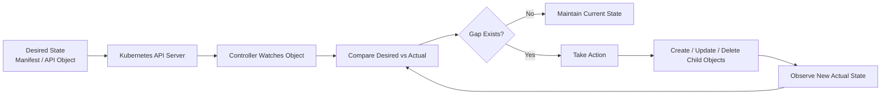
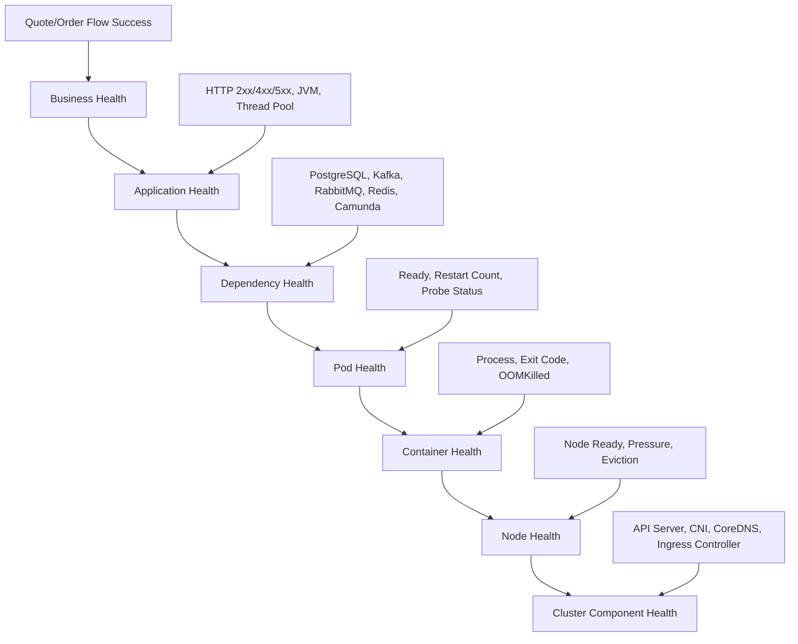
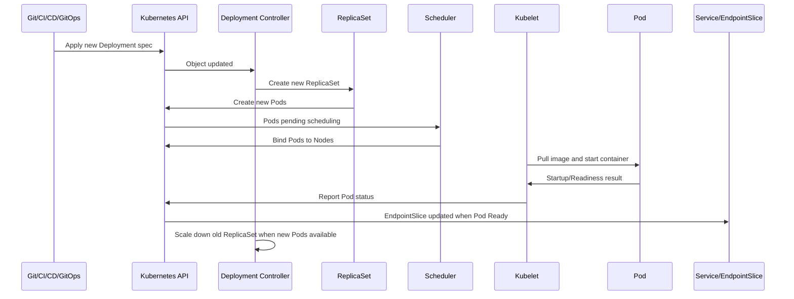
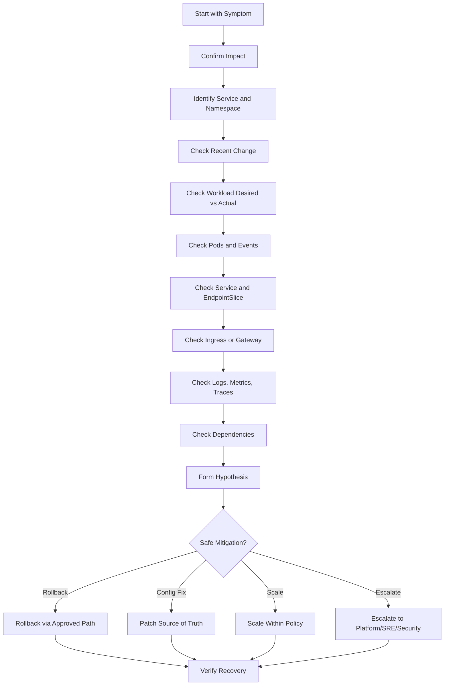

# Part 002 — Kubernetes Operational Mental Model

## 1. Core Idea

Kubernetes bekerja berdasarkan prinsip:

> declare desired state, observe actual state, reconcile continuously.

Backend engineer sering melihat Kubernetes dari permukaan:

- pod `Running`,
- deployment `Available`,
- service punya ClusterIP,
- ingress punya host,
- HPA punya target metric.

Namun operational debugging membutuhkan model yang lebih dalam:

1. Apa desired state yang dideklarasikan?
2. Apa actual state yang terjadi?
3. Controller mana yang mencoba memperbaiki gap?
4. Status dan condition apa yang berubah?
5. Event apa yang menjelaskan transisi?
6. Apakah reconciliation berhasil, tertunda, atau gagal?
7. Apakah service benar-benar siap melayani traffic?
8. Apakah dependency state mendukung workload?

Tanpa mental model ini, debugging menjadi kumpulan command acak.

Dengan mental model ini, setiap command menjadi pertanyaan yang terarah.

---

## 2. Desired State vs Actual State

### 2.1 Desired State

Desired state adalah keadaan yang Anda minta kepada Kubernetes.

Contoh pada `Deployment`:

```yaml
apiVersion: apps/v1
kind: Deployment
metadata:
  name: quote-service
spec:
  replicas: 4
  selector:
    matchLabels:
      app: quote-service
  template:
    metadata:
      labels:
        app: quote-service
    spec:
      containers:
        - name: quote-service
          image: registry.example.com/quote-service:1.8.2
          ports:
            - containerPort: 8080
```

Desired state di atas menyatakan:

- harus ada Deployment bernama `quote-service`,
- harus ada 4 replica,
- pod harus punya label `app=quote-service`,
- container harus menjalankan image tertentu,
- container expose port 8080.

### 2.2 Actual State

Actual state adalah keadaan nyata di cluster.

Contoh:

- hanya 2 dari 4 pod yang ready,
- 1 pod `CrashLoopBackOff`,
- 1 pod `Pending`,
- image pull gagal,
- readiness probe gagal,
- endpoint belum terbentuk,
- node kekurangan CPU,
- rollout stuck.

Kubernetes selalu mencoba mendekatkan actual state ke desired state.

Tetapi Kubernetes tidak bisa memperbaiki semua hal otomatis.

Misalnya:

- image tag salah,
- secret tidak ada,
- app crash karena config invalid,
- DB tidak reachable,
- resource request terlalu besar,
- NetworkPolicy memblokir egress,
- readiness path salah,
- migration merusak compatibility.

Kubernetes akan terus mencoba, tetapi backend engineer harus memperbaiki penyebabnya.

---

## 3. Reconciliation Loop

Reconciliation adalah loop kontrol utama Kubernetes.



Contoh:

- Deployment controller melihat Deployment ingin 4 replicas.
- Actual state baru 2 pod.
- Deployment controller membuat/menyesuaikan ReplicaSet.
- ReplicaSet controller membuat pod.
- Scheduler menempatkan pod ke node.
- Kubelet menjalankan container.
- Status pod berubah.
- Deployment controller membaca readiness.
- Deployment condition diperbarui.

Jika salah satu tahap gagal, status dan event memberi sinyal.

---

## 4. Controller Mental Model

Controller adalah actor yang menjaga object tertentu.

### 4.1 Deployment Controller

Bertanggung jawab menjaga Deployment rollout.

Ia mengelola:

- ReplicaSet baru,
- ReplicaSet lama,
- revision,
- rollout progress,
- available replicas,
- updated replicas,
- progress deadline.

Failure yang sering terlihat:

- rollout stuck,
- `ProgressDeadlineExceeded`,
- new ReplicaSet tidak ready,
- old ReplicaSet belum scale down,
- maxUnavailable membuat kapasitas turun,
- maxSurge membuat resource spike.

### 4.2 ReplicaSet Controller

Bertanggung jawab menjaga jumlah pod sesuai replica count.

Ia mengelola:

- pod creation,
- pod deletion,
- owner reference,
- selector match.

Failure yang sering terlihat:

- pod tidak bisa dibuat,
- pod dibuat tapi pending,
- selector mismatch,
- old ReplicaSet masih punya pod.

### 4.3 StatefulSet Controller

Bertanggung jawab atas workload dengan identity stabil.

Ia mengelola:

- pod ordinal,
- ordered rollout,
- stable network identity,
- PVC association,
- partitioned rollout.

Failure yang sering terlihat:

- rollout tertahan di ordinal tertentu,
- PVC pending,
- mount failure,
- ordered termination/startup memperlambat recovery.

### 4.4 Job Controller

Bertanggung jawab menjalankan task sampai selesai.

Ia mengelola:

- completions,
- parallelism,
- retries,
- backoffLimit,
- activeDeadlineSeconds.

Failure yang sering terlihat:

- job stuck,
- job retry terus,
- job selesai sebagian,
- duplicate processing,
- missed deadline.

### 4.5 HPA Controller

Bertanggung jawab mengubah replica count berdasarkan metric.

Ia membaca:

- CPU/memory metric,
- custom metric,
- external metric,
- target utilization,
- scaling policy,
- stabilization window.

Failure yang sering terlihat:

- metric tidak tersedia,
- HPA tidak scale,
- HPA scale terlalu agresif,
- scale up terlambat,
- max replica terlalu rendah,
- cluster tidak punya capacity.

---

## 5. Scheduler Mental Model

Scheduler bertugas memilih node untuk pod yang belum dijadwalkan.

Ia mempertimbangkan:

- CPU request,
- memory request,
- ephemeral storage request,
- node selector,
- node affinity,
- pod affinity,
- pod anti-affinity,
- topology spread,
- taint/toleration,
- PVC binding,
- node readiness,
- resource availability,
- priority/preemption.

Jika scheduler gagal, pod akan `Pending`.

Typical event:

```text
Warning  FailedScheduling  0/8 nodes are available:
4 Insufficient cpu,
2 node(s) had untolerated taint,
2 node(s) didn't match Pod's node affinity/selector.
```

Backend engineer tidak harus memperbaiki node, tetapi harus bisa membaca apakah manifest workload membuat pod tidak schedulable.

### Backend Impact

Pod Pending berarti:

- replica actual lebih sedikit dari desired,
- service capacity berkurang,
- rollout bisa stuck,
- HPA scale up tidak efektif,
- PDB/availability bisa terganggu,
- consumer capacity tidak bertambah,
- API latency bisa naik.

---

## 6. Kubelet Mental Model

Kubelet berjalan di node dan bertanggung jawab menjalankan pod di node tersebut.

Kubelet menangani:

- pulling image,
- starting container,
- running probes,
- mounting volumes,
- reporting pod status,
- enforcing resource limit,
- restarting container,
- graceful termination,
- eviction under pressure.

Failure yang sering terlihat:

- `ImagePullBackOff`,
- `ErrImagePull`,
- `CrashLoopBackOff`,
- `FailedMount`,
- `Unhealthy`,
- `OOMKilled`,
- `Evicted`,
- `Killing`,
- probe failure,
- container restart.

Backend engineer harus membaca kubelet-driven events karena banyak failure aplikasi muncul lewat kubelet.

---

## 7. Runtime Mental Model

Container runtime menjalankan container image menjadi process.

Untuk Java/JAX-RS service, runtime layer mencakup:

- container entrypoint,
- JVM process,
- application server/runtime,
- JAX-RS resource,
- HTTP listener,
- management endpoint,
- thread pools,
- connection pools,
- GC,
- signal handling,
- filesystem behavior.

Kubernetes hanya tahu container process, port, probe result, resource usage, dan exit code.

Kubernetes tidak tahu secara langsung bahwa:

- quote pricing logic salah,
- order state transition invalid,
- Kafka offset commit tidak aman,
- Camunda worker memproses job dengan timeout salah,
- JDBC transaction boundary rusak,
- retry menyebabkan duplicate billing event.

Karena itu application observability tetap wajib.

---

## 8. Object Status

Setiap Kubernetes object punya `spec` dan biasanya `status`.

- `spec`: desired state.
- `status`: observed state.

Contoh investigative mindset:

```bash
kubectl get deploy quote-service -n <namespace> -o yaml
```

Lihat:

- `spec.replicas`,
- `status.replicas`,
- `status.updatedReplicas`,
- `status.readyReplicas`,
- `status.availableReplicas`,
- `status.unavailableReplicas`,
- `status.conditions`.

Untuk pod:

- `status.phase`,
- `status.conditions`,
- `status.containerStatuses`,
- `restartCount`,
- `lastState`,
- `reason`,
- `exitCode`,
- `started`,
- `ready`.

Untuk HPA:

- current replicas,
- desired replicas,
- current metrics,
- conditions,
- scaling events.

Untuk Service:

- selector,
- ports,
- ClusterIP.

Untuk EndpointSlice:

- endpoints,
- conditions.ready,
- targetRef,
- ports.

Status adalah jembatan dari desired state ke observed state.

---

## 9. Conditions

Condition adalah sinyal boolean-ish dengan reason dan message.

Contoh condition pada Deployment:

- `Available`
- `Progressing`
- `ReplicaFailure`

Contoh condition pada Pod:

- `PodScheduled`
- `Initialized`
- `ContainersReady`
- `Ready`

Contoh condition pada HPA:

- `AbleToScale`
- `ScalingActive`
- `ScalingLimited`

Condition harus dibaca bersama:

- type,
- status,
- reason,
- message,
- lastTransitionTime.

### Example

```text
Type: Progressing
Status: False
Reason: ProgressDeadlineExceeded
Message: ReplicaSet "quote-service-7cbdc9f4f8" has timed out progressing.
```

Interpretasi:

- Deployment mencoba rollout.
- ReplicaSet baru tidak mencapai ready state dalam deadline.
- Penyebab root belum tentu Deployment.
- Root cause bisa pod crash, readiness failure, image issue, resource issue, atau config issue.

---

## 10. Kubernetes Events

Event adalah catatan transisi dan kegagalan penting.

Event sangat berguna untuk menjawab:

- pod gagal dijadwalkan karena apa?
- image gagal ditarik karena apa?
- volume gagal mount karena apa?
- probe gagal karena apa?
- container dibunuh kapan?
- kubelet melakukan restart kapan?
- HPA scale kapan?
- node melakukan eviction kapan?

Command umum:

```bash
kubectl get events -n <namespace> --sort-by=.lastTimestamp
kubectl describe pod <pod> -n <namespace>
kubectl describe deploy <deployment> -n <namespace>
```

Events punya retention terbatas. Saat incident, capture evidence lebih awal.

### Event Is Not Log

Event bukan application log.

Event menjelaskan keputusan Kubernetes. Log menjelaskan perilaku aplikasi.

Keduanya harus digabung.

---

## 11. Health Signal Layers

Health di Kubernetes berlapis.



Pod ready bukan jaminan business health.

Business health membutuhkan:

- API success rate,
- latency,
- workflow completion,
- queue lag,
- dependency success,
- data correctness,
- domain-level state transition.

---

## 12. Rollout State Mental Model

Rollout adalah transition dari versi lama ke versi baru.



Rollout dianggap aman hanya jika:

- pod baru start,
- readiness valid,
- endpoint terisi,
- old pod tidak dimatikan terlalu cepat,
- capacity tetap cukup,
- error rate tidak naik,
- latency tidak naik,
- dependency tidak overload,
- business flow tetap berhasil.

### Rollout Failure Points

- bad image,
- image pull denied,
- bad config,
- missing secret,
- wrong env,
- JVM startup too slow,
- readiness path wrong,
- dependency required at startup unavailable,
- CPU/memory request too high,
- node capacity insufficient,
- DB migration incompatible,
- feature flag mismatch,
- NetworkPolicy blocks dependency,
- secret rotation mismatch.

---

## 13. Dependency State Mental Model

Kubernetes object sehat tidak selalu berarti service sehat.

Backend service bergantung pada dependency eksternal/internal:

- PostgreSQL,
- Kafka,
- RabbitMQ,
- Redis,
- Camunda,
- NGINX/API Gateway,
- cloud services,
- internal REST/gRPC services,
- DNS,
- identity provider,
- secret store.

Dependency state perlu dibaca dengan tiga pertanyaan:

1. **Can the pod reach it?**  
   DNS, network, TLS, identity, egress, firewall.

2. **Can the app use it correctly?**  
   credential, schema, protocol, timeout, pool, version compatibility.

3. **Is the dependency healthy enough?**  
   latency, saturation, error rate, queue depth, lag, connection limit.

### Example: PostgreSQL

Kubernetes view:

- pod ready,
- service endpoint exists,
- deployment available.

Application view:

- DB connection pool exhausted,
- query latency high,
- migration lock,
- max connection reached,
- transaction timeout.

### Example: Kafka

Kubernetes view:

- consumer pods running,
- HPA scaled to 8 replicas.

Application/domain view:

- topic only has 4 partitions,
- lag not reducing,
- rebalance frequent,
- duplicate handling weak,
- DLQ growing.

---

## 14. Operational Debugging as State Transition Analysis

A strong debugging question is:

> "Which expected state transition did not happen?"

Examples:

### 14.1 Pod Expected to Start

Expected transition:

```text
Pending -> Scheduled -> Pulling Image -> Created -> Started -> Ready
```

Failed transition examples:

- stuck in Pending: scheduler/capacity/affinity/PVC/quota.
- stuck in ImagePullBackOff: registry/image/auth/network.
- started then CrashLoopBackOff: app/JVM/config/secret.
- running but not ready: readiness/probe/dependency/startup.

### 14.2 Service Expected to Route Traffic

Expected transition:

```text
Pod Ready -> EndpointSlice Ready -> Service routes -> Ingress routes -> Client receives response
```

Failed transition examples:

- pod ready false,
- service selector mismatch,
- EndpointSlice empty,
- ingress backend service wrong,
- port mismatch,
- TLS/protocol mismatch,
- upstream timeout.

### 14.3 Rollout Expected to Complete

Expected transition:

```text
New ReplicaSet created -> New pods ready -> Old pods scaled down -> Deployment available
```

Failed transition examples:

- new pods pending,
- new pods crashing,
- new pods not ready,
- progress deadline exceeded,
- capacity lost during update,
- migration breaks compatibility.

### 14.4 Autoscaling Expected to Increase Capacity

Expected transition:

```text
Load increases -> Metric increases -> HPA computes desired replicas -> ReplicaSet creates pods -> Scheduler places pods -> Pods ready -> Capacity improves
```

Failed transition examples:

- metric missing,
- HPA capped by max replica,
- pods pending,
- image pull slow,
- readiness slow,
- dependency bottleneck remains,
- queue lag metric delayed.

---

## 15. Production-Safe Investigation Flow



---

## 16. Safe Commands for Mental Model Debugging

### 16.1 Confirm Context

```bash
kubectl config current-context
kubectl config get-contexts
```

### 16.2 Identify Workload State

```bash
kubectl get deploy,rs,pod,svc,ingress,hpa,pdb -n <namespace>
kubectl get deploy <deployment> -n <namespace> -o wide
kubectl describe deploy <deployment> -n <namespace>
```

### 16.3 Inspect Pods

```bash
kubectl get pod -n <namespace> -l app=<app-label> -o wide
kubectl describe pod <pod> -n <namespace>
kubectl logs <pod> -n <namespace>
kubectl logs <pod> -n <namespace> --previous
```

### 16.4 Inspect Events

```bash
kubectl get events -n <namespace> --sort-by=.lastTimestamp
```

### 16.5 Inspect Service Routing

```bash
kubectl get svc <service> -n <namespace> -o yaml
kubectl get endpointslice -n <namespace> -l kubernetes.io/service-name=<service>
```

### 16.6 Inspect Rollout

```bash
kubectl rollout status deploy/<deployment> -n <namespace>
kubectl rollout history deploy/<deployment> -n <namespace>
```

### 16.7 Inspect HPA

```bash
kubectl get hpa -n <namespace>
kubectl describe hpa <hpa> -n <namespace>
```

### 16.8 Inspect Permissions

```bash
kubectl auth can-i get pods -n <namespace>
kubectl auth can-i list secrets -n <namespace>
```

Do not use mutation commands until the source of truth, approval path, and rollback path are known.

---

## 17. Reading a Deployment Like an Operator

When reading a Deployment, do not only check `READY`.

Ask:

- desired replicas berapa?
- updated replicas berapa?
- ready replicas berapa?
- available replicas berapa?
- unavailable replicas berapa?
- condition `Available` apa?
- condition `Progressing` apa?
- ReplicaSet lama masih ada?
- ReplicaSet baru punya pod sehat?
- pod template berubah karena apa?
- image tag/digest apa?
- config/secret reference berubah?
- resource request/limit berubah?
- probes berubah?
- rollout strategy berubah?
- deployment marker ada?

Command:

```bash
kubectl describe deploy <deployment> -n <namespace>
kubectl get rs -n <namespace> -l app=<app-label>
kubectl get pod -n <namespace> -l app=<app-label>
```

---

## 18. Reading a Pod Like an Operator

For each pod:

- scheduled?
- node mana?
- phase apa?
- ready?
- containers ready?
- restart count?
- last termination reason?
- exit code?
- OOMKilled?
- probe failure?
- mounted volumes OK?
- image pulled?
- started at?
- logs current?
- logs previous?
- node pressure?
- IP assigned?
- labels match service selector?

Command:

```bash
kubectl describe pod <pod> -n <namespace>
kubectl logs <pod> -n <namespace>
kubectl logs <pod> -n <namespace> --previous
```

Interpretation examples:

| Symptom | Likely Direction |
|---|---|
| `Pending` | Scheduler, quota, capacity, affinity, PVC |
| `ImagePullBackOff` | Image tag, registry auth, ECR/ACR, network |
| `CrashLoopBackOff` | App crash, JVM, config, secret, startup |
| `Running` but not ready | Readiness, app startup, dependency check |
| `OOMKilled` | Memory limit, JVM heap/native, leak |
| Frequent restarts | Liveness, crash, OOM, node issue |

---

## 19. Reading a Service Like an Operator

Service is not traffic by itself. Service is a stable virtual access layer to selected pods.

Check:

- selector,
- selected pod labels,
- service port,
- targetPort,
- named port,
- EndpointSlice,
- endpoint readiness,
- namespace,
- protocol.

Common issue:

```text
Service exists, but EndpointSlice empty.
```

Possible causes:

- selector mismatch,
- pods not ready,
- wrong namespace,
- readiness gate false,
- rollout failed,
- pod labels changed,
- service points to wrong app label.

Command:

```bash
kubectl get svc <service> -n <namespace> -o yaml
kubectl get endpointslice -n <namespace> -l kubernetes.io/service-name=<service> -o yaml
kubectl get pod -n <namespace> --show-labels
```

---

## 20. Reading Ingress Like an Operator

Ingress failure requires path thinking.

Check:

- host,
- path,
- pathType,
- ingressClassName,
- annotations,
- TLS secret,
- backend service,
- backend service port,
- controller logs,
- load balancer health,
- path rewrite,
- backend protocol,
- timeout config.

Common symptom:

| Error | Direction |
|---|---|
| 404 | host/path/routing rule |
| 502 | backend connection/protocol/TLS |
| 503 | no endpoint/backend unavailable |
| 504 | upstream timeout/backend latency |

Command:

```bash
kubectl get ingress -n <namespace>
kubectl describe ingress <ingress> -n <namespace>
```

Controller-specific logs/config depend on internal platform.

---

## 21. Reading Events Like Timeline Evidence

During incident, build a timeline.

Example:

```text
10:02 Deployment updated to image 1.8.2
10:03 New ReplicaSet created
10:03 Pod scheduled
10:04 Image pulled
10:04 Container started
10:05 Readiness probe failed
10:06 Readiness probe failed
10:07 Progressing=False ProgressDeadlineExceeded
10:08 Ingress 503 spike
```

This timeline suggests rollout created pods but readiness failed, causing endpoint shortage and ingress 503.

Events should be correlated with:

- deployment marker,
- application logs,
- metrics,
- traces,
- alert timestamp,
- Git commit,
- config/secret change.

---

## 22. Java/JAX-RS Runtime Mapping

Kubernetes signal must be mapped to Java runtime behavior.

| Kubernetes Signal | Java/JAX-RS Interpretation |
|---|---|
| startup probe fails | JVM/app server slow startup, dependency init blocking |
| readiness fails | management endpoint unhealthy, app not accepting traffic |
| liveness fails | deadlock, event loop stuck, GC pause, wrong probe |
| OOMKilled | heap too large, native memory, direct buffer, leak |
| CPU throttling | latency, GC delay, thread starvation |
| high restart count | crash, probe issue, OOM, config failure |
| endpoint missing | readiness false or selector mismatch |
| 504 from ingress | app/dependency latency beyond gateway timeout |
| HPA scale out | pool multiplication and dependency pressure |

---

## 23. PostgreSQL/Kafka/RabbitMQ/Redis/Camunda Mapping

### 23.1 PostgreSQL

Signals:

- DB connection timeout,
- pool exhausted,
- max connection reached,
- slow queries,
- migration lock,
- TLS trust error,
- DNS/private endpoint issue.

Kubernetes-related causes:

- too many replicas,
- pool per pod too large,
- network policy egress missing,
- secret stale,
- DNS failure,
- CPU throttling causing slow request handling.

### 23.2 Kafka

Signals:

- lag increasing,
- rebalance frequent,
- duplicate processing,
- consumer not committing,
- broker auth failure.

Kubernetes-related causes:

- pod restart,
- SIGTERM not handled,
- HPA too aggressive,
- replica count > partition count,
- secret/cert issue,
- DNS/network egress issue.

### 23.3 RabbitMQ

Signals:

- queue depth rising,
- unacked messages rising,
- redelivery spike,
- connection/channel churn.

Kubernetes-related causes:

- pod restart,
- shutdown not ack-safe,
- prefetch too high,
- HPA scale mismatch,
- network instability,
- broker connection limit.

### 23.4 Redis

Signals:

- latency spike,
- connection timeout,
- pool exhaustion,
- hot key,
- cache miss storm.

Kubernetes-related causes:

- too many replicas,
- pool multiplication,
- DNS/network issue,
- CPU throttling,
- config drift.

### 23.5 Camunda

Signals:

- incidents rising,
- worker backlog,
- job timeout,
- process stuck,
- correlation failure.

Kubernetes-related causes:

- worker pods restarting,
- concurrency misconfigured,
- graceful shutdown missing,
- dependency timeout,
- version mismatch during rollout.

---

## 24. EKS / AKS / On-Prem Awareness

The mental model remains Kubernetes-first, but infrastructure changes failure modes.

### 24.1 EKS

EKS-specific things to verify:

- VPC CNI behavior,
- pod IP/subnet capacity,
- security group rules,
- AWS Load Balancer Controller,
- EBS CSI,
- IRSA,
- ECR auth,
- Route 53/private hosted zone,
- VPC endpoints,
- NAT gateway.

### 24.2 AKS

AKS-specific things to verify:

- Azure CNI behavior,
- VNet/subnet/NSG/UDR,
- Azure Load Balancer,
- Application Gateway/AGIC,
- ACR auth,
- Azure Workload Identity,
- Key Vault CSI,
- Private DNS Zone,
- Azure Monitor.

### 24.3 On-Prem / Hybrid

On-prem/hybrid things to verify:

- corporate DNS,
- internal CA,
- proxy/NO_PROXY,
- firewall allowlist,
- air-gapped registry,
- on-prem load balancer,
- hybrid cloud connectivity,
- private endpoint routing,
- certificate trust chain.

Do not assume cloud-managed behavior in on-prem clusters.

---

## 25. Failure Modes by Reconciliation Stage

| Stage | Failure Mode | Symptom | First Evidence |
|---|---|---|---|
| API accept | invalid manifest | apply/sync failed | GitOps/CI output |
| Controller | rollout stuck | ProgressDeadlineExceeded | Deployment condition |
| ReplicaSet | pod not created | missing pods | ReplicaSet events |
| Scheduler | no node | Pending | FailedScheduling event |
| Kubelet image | cannot pull | ImagePullBackOff | Pod event |
| Kubelet start | process exits | CrashLoopBackOff | previous logs |
| Probe | not ready | no endpoint | pod condition/event |
| Service | wrong selector | EndpointSlice empty | service/endpointslice |
| Ingress | route failure | 404/502/503/504 | ingress/controller logs |
| Runtime | dependency failure | app errors | logs/traces/metrics |
| Autoscaler | no scaling | overload persists | HPA condition/event |

---

## 26. Backend Engineer Escalation Boundaries

Escalate to platform/SRE when:

- node condition unhealthy,
- cluster DNS unavailable,
- CNI issue suspected,
- ingress controller down,
- CSI driver failure,
- cluster autoscaler stuck,
- subnet/IP exhaustion,
- cloud load balancer target registration issue,
- audit/access tooling issue,
- GitOps controller broken,
- admission controller rejects unexpectedly.

Escalate to security when:

- RBAC permission unclear,
- workload identity denied,
- secret access policy issue,
- NetworkPolicy exception needed,
- image vulnerability exception needed,
- privileged/security context exception needed,
- compliance/audit evidence required.

Escalate to DB/broker/platform owner when:

- PostgreSQL max connection reached,
- Kafka broker unhealthy,
- RabbitMQ queue/broker issue,
- Redis cluster issue,
- Camunda engine issue,
- managed cloud service degraded.

Backend team owns the application evidence and service-level hypothesis.

---

## 27. Internal Verification Checklist

### 27.1 Desired vs Actual State

- [ ] Where is the source of truth for manifests?
- [ ] Is GitOps active?
- [ ] Which rendered manifest is actually applied?
- [ ] Are live objects different from Git?
- [ ] Is drift allowed or auto-corrected?
- [ ] Are manual production changes audited?

### 27.2 Controller and Rollout

- [ ] Which deployment controller/pattern is used?
- [ ] Plain Deployment, Argo Rollouts, Helm, Flux, or Argo CD?
- [ ] What is the rollout strategy?
- [ ] What is maxSurge/maxUnavailable?
- [ ] What is progressDeadlineSeconds?
- [ ] How is rollback performed?
- [ ] Are deployment markers emitted?

### 27.3 Pod Lifecycle

- [ ] Are startup/readiness/liveness probes defined?
- [ ] Are probe endpoints application-owned?
- [ ] Does readiness depend on required or optional dependencies?
- [ ] Is graceful shutdown implemented?
- [ ] Is terminationGracePeriodSeconds aligned?
- [ ] Are preStop hooks used?
- [ ] Are previous logs retained centrally?

### 27.4 Service and Traffic

- [ ] Are Service selectors stable?
- [ ] Are labels standardized?
- [ ] Is EndpointSlice monitored?
- [ ] Which ingress/gateway handles traffic?
- [ ] Where is TLS terminated?
- [ ] Are timeouts documented?
- [ ] Are 502/503/504 dashboards available?

### 27.5 Dependency State

- [ ] PostgreSQL dashboard available?
- [ ] Kafka lag dashboard available?
- [ ] RabbitMQ queue dashboard available?
- [ ] Redis latency dashboard available?
- [ ] Camunda incident dashboard available?
- [ ] Dependency owner known?
- [ ] Dependency runbooks linked?

### 27.6 Observability

- [ ] Are Kubernetes events exported?
- [ ] Are pod logs centrally searchable?
- [ ] Are JVM metrics available?
- [ ] Are service metrics available?
- [ ] Are traces propagated across HTTP and messaging?
- [ ] Are dashboards linked from alerts?
- [ ] Do alerts include runbook links?

### 27.7 EKS / AKS / Hybrid

- [ ] Is the cluster EKS, AKS, on-prem, or hybrid?
- [ ] What CNI is used?
- [ ] How are pod IPs allocated?
- [ ] How does workload identity work?
- [ ] How are secrets integrated?
- [ ] How does egress work?
- [ ] Who owns cloud networking?

---

## 28. Operational Mental Model Checklist

Use this during debugging:

- [ ] What is the symptom?
- [ ] What service/workload is affected?
- [ ] What is desired state?
- [ ] What is actual state?
- [ ] Which reconciliation step failed?
- [ ] Which controller owns that step?
- [ ] What do conditions say?
- [ ] What do events say?
- [ ] What do pod logs say?
- [ ] What do previous logs say?
- [ ] Does service have endpoints?
- [ ] Does ingress route correctly?
- [ ] Did a recent deployment/config/secret/migration happen?
- [ ] Are dependencies healthy?
- [ ] Are resource limits causing throttling/OOM?
- [ ] Are HPA/PDB/scheduling constraints involved?
- [ ] Is this an app issue, platform issue, security issue, or dependency issue?
- [ ] What is the safest mitigation?
- [ ] Is rollback possible?
- [ ] Who must be escalated?

---

## 29. Key Takeaways

- Kubernetes operations is reconciliation reasoning.
- Always compare desired state with actual state.
- Conditions and events are first-class debugging evidence.
- Pod `Running` is not enough; readiness, endpoints, traffic, and business health matter.
- Controllers explain why Kubernetes keeps retrying or gets stuck.
- Scheduler explains Pending pods.
- Kubelet explains image pull, probe, restart, mount, OOM, and eviction behavior.
- Runtime behavior explains Java/JAX-RS symptoms.
- Dependency state must be mapped separately from Kubernetes object health.
- Debugging should identify the failed state transition.
- Production-safe operations require evidence before action.

---

## 30. Next Part

Part berikutnya membahas **Backend Engineer Scope in Kubernetes**: batas tanggung jawab backend engineer, platform engineer, SRE, security, DevOps, escalation boundary, read-only investigation, safe operational action, dangerous operational action, dan ownership checklist.
