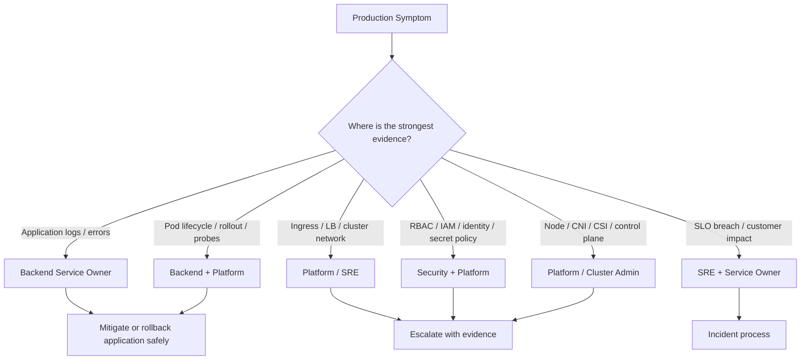
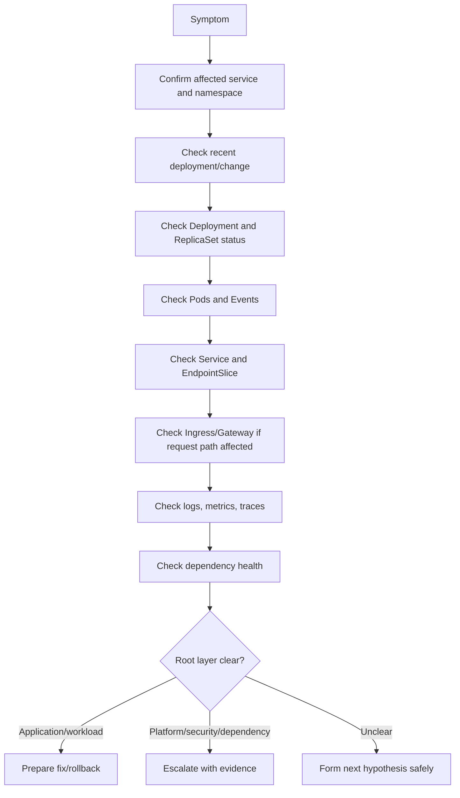

# Part 003 — Backend Engineer Scope in Kubernetes

## 1. Core Idea

Backend engineer tidak harus menjadi cluster admin.

Tetapi backend engineer yang memiliki service production harus mampu menjawab pertanyaan operasional berikut:

- Apakah workload saya sehat?
- Apakah pod saya benar-benar siap menerima traffic?
- Apakah rollout saya aman?
- Apakah service saya punya endpoint?
- Apakah error berasal dari aplikasi, dependency, network, config, secret, identity, atau platform?
- Apakah saya boleh melakukan aksi tertentu di production?
- Kapan saya harus rollback?
- Kapan saya harus eskalasi ke platform/SRE/security?

Kubernetes production memaksa backend engineer untuk memahami boundary antara:

1. **application responsibility**
2. **workload responsibility**
3. **runtime responsibility**
4. **platform responsibility**
5. **SRE responsibility**
6. **security responsibility**
7. **cluster administration responsibility**

Scope yang jelas mencegah dua masalah ekstrem:

- backend engineer terlalu pasif dan tidak bisa melakukan triage production,
- backend engineer terlalu agresif dan melakukan perubahan cluster-level yang memperbesar incident.

Target part ini adalah membangun batas berpikir yang sehat: **cukup dalam untuk efektif, cukup disiplin untuk aman**.

---

## 2. Why This Matters Operationally

Incident Kubernetes sering membingungkan karena gejalanya terlihat di banyak layer.

Contoh:

- API `quote-service` return 503.
- Ingress log menunjukkan upstream unavailable.
- Service tidak punya endpoint.
- Pod ada, tetapi `Ready=False`.
- Readiness gagal karena database connection timeout.
- Database timeout ternyata karena secret credential salah.
- Secret salah karena external secret sync gagal.
- External secret gagal karena workload identity permission berubah.

Dalam chain seperti ini, backend engineer tidak boleh hanya berkata “ini urusan platform”. Tetapi backend engineer juga tidak boleh langsung mengubah IAM role, NetworkPolicy global, atau secret production tanpa proses.

Yang dibutuhkan adalah kemampuan untuk:

- mengumpulkan bukti,
- mempersempit blast radius,
- membedakan root layer,
- menentukan owner yang tepat,
- melakukan mitigasi yang aman,
- menghindari tindakan destruktif,
- dan menjaga auditability.

---

## 3. Operational Ownership Model



Prinsip utamanya:

> Backend engineer owns the service behavior. Platform/SRE owns the runtime substrate. Security owns policy and access posture. Incident response owns coordination and evidence.

Dalam praktik, boundary ini tidak selalu hitam-putih. Banyak incident membutuhkan kerja bersama.

---

## 4. What Backend Engineers Must Know

Backend engineer service owner wajib memahami objek Kubernetes yang langsung memengaruhi aplikasinya:

- `Deployment`
- `ReplicaSet`
- `Pod`
- `Service`
- `EndpointSlice`
- `Ingress` atau route equivalent
- `ConfigMap`
- `Secret`
- `ServiceAccount`
- `RoleBinding` yang relevan
- `NetworkPolicy` yang membatasi pod
- `HorizontalPodAutoscaler`
- `PodDisruptionBudget`
- resource request/limit
- probes
- lifecycle hooks
- labels/selectors
- deployment annotations
- observability labels

Backend engineer juga perlu memahami runtime behavior service:

- startup time Java/JAX-RS service,
- readiness condition,
- liveness behavior,
- graceful shutdown,
- thread pool,
- connection pool,
- JVM heap/native memory,
- HTTP timeout,
- database timeout,
- Kafka/RabbitMQ consumer shutdown,
- retry and DLQ behavior,
- Redis connection behavior,
- Camunda worker activation and incident behavior.

Yang tidak harus dimiliki penuh oleh backend engineer:

- desain control plane cluster,
- upgrade cluster,
- CNI implementation detail,
- node AMI/image management,
- cluster-wide admission policy,
- cluster-wide RBAC,
- cloud network routing global,
- cluster autoscaler internals,
- CSI driver lifecycle,
- managed Kubernetes add-on lifecycle.

Tetapi backend engineer harus tahu cukup untuk mengenali saat layer tersebut mungkin menjadi penyebab.

---

## 5. Backend Service Owner Responsibility

Sebagai service owner, backend engineer bertanggung jawab atas **behavior aplikasi di atas Kubernetes**.

### 5.1 Runtime correctness

Service owner harus memastikan:

- container bisa start,
- aplikasi bisa bootstrap,
- config valid,
- secret tersedia,
- dependency connection benar,
- endpoint health benar,
- request path berfungsi,
- shutdown tidak merusak in-flight request,
- consumer tidak kehilangan message saat pod termination,
- batch job idempotent,
- migration aman terhadap rolling deployment.

### 5.2 Workload manifest correctness

Service owner harus bisa mereview:

- image tag/digest,
- container port,
- env var,
- config mount,
- secret mount,
- resource request/limit,
- probes,
- readiness endpoint,
- deployment strategy,
- service selector,
- HPA target,
- PDB,
- annotations yang memengaruhi ingress/observability,
- labels untuk owner/version/environment.

### 5.3 Production evidence

Saat incident, service owner harus mampu menyediakan:

- recent deployment version,
- commit/version yang sedang running,
- affected pods,
- application logs,
- relevant traces,
- error rate/latency metrics,
- dependency health,
- config/secret version evidence tanpa membocorkan secret,
- rollback recommendation,
- known safe mitigation.

---

## 6. Platform Engineer Responsibility

Platform engineer biasanya bertanggung jawab atas runtime platform dan shared capability.

Contoh area platform:

- cluster provisioning,
- namespace provisioning,
- ingress controller,
- service mesh jika ada,
- CNI,
- CSI,
- cluster autoscaler/Karpenter,
- node pool/node group,
- GitOps controller,
- Helm/Kustomize platform conventions,
- external secrets controller,
- workload identity integration,
- observability platform,
- centralized logging,
- metrics pipeline,
- tracing collector,
- admission policies,
- base image standards,
- CI/CD platform integration.

Backend engineer perlu tahu siapa owner area ini karena banyak debugging membutuhkan evidence escalation.

Contoh eskalasi yang baik:

> “Pod `quote-service-abc` Pending sejak 10:42. Event menunjukkan `0/12 nodes are available: insufficient cpu`. Request naik dari 500m ke 2000m pada deployment `1.8.2`. HPA min replicas 6. Bisa dibantu cek node pool capacity/autoscaler behavior? Dari sisi service, kami bisa sementara rollback resource request jika disetujui.”

Ini jauh lebih baik daripada:

> “Kubernetes bermasalah.”

---

## 7. SRE Responsibility

SRE biasanya fokus pada reliability management, incident response, SLO, alerting, and operational discipline.

Tanggung jawab SRE dapat meliputi:

- SLO definition,
- alert routing,
- incident process,
- on-call governance,
- runbook quality,
- error budget policy,
- release safety guardrail,
- reliability review,
- post-incident review,
- capacity and resilience review,
- production risk assessment.

Backend engineer berkolaborasi dengan SRE untuk:

- menentukan severity,
- menghitung impact,
- memilih rollback/mitigation,
- membaca burn-rate alert,
- memperbaiki alert noise,
- memperkuat runbook,
- menutup corrective action.

---

## 8. Security Team Responsibility

Security team biasanya memiliki policy dan governance terkait:

- RBAC standard,
- least privilege,
- secret management,
- workload identity,
- admission policy,
- image vulnerability scanning,
- pod security standard,
- network segmentation,
- certificate and key management,
- audit log,
- compliance evidence,
- exception approval.

Backend engineer harus memahami security posture yang berdampak langsung ke workload, tetapi tidak boleh sembarang bypass.

Contoh area yang perlu koordinasi security:

- menambah permission cloud role,
- membuka egress ke service baru,
- mengubah NetworkPolicy,
- mounting secret baru,
- mengaktifkan privileged pod,
- menambah HostPath,
- men-disable TLS validation,
- menambah access ke namespace lain,
- mengekspos endpoint internal ke public ingress.

---

## 9. DevOps / Release Engineering Responsibility

DevOps atau release engineering sering mengelola flow dari source code ke deployment.

Area umum:

- pipeline build,
- test automation,
- container image build,
- registry push,
- image scan,
- artifact promotion,
- manifest rendering,
- deployment trigger,
- approval gate,
- environment promotion,
- smoke test,
- release notes,
- rollback mechanism.

Backend engineer harus paham pipeline cukup untuk menjawab:

- image mana yang ter-deploy,
- commit mana yang running,
- values/overlay mana yang dipakai,
- kapan deployment terjadi,
- apakah deployment berhasil,
- apakah smoke test lolos,
- bagaimana rollback dilakukan,
- apakah manual change akan dioverwrite GitOps.

---

## 10. Cluster Admin Responsibility

Cluster admin biasanya mengelola hal yang sangat sensitif dan berblast-radius besar:

- Kubernetes API server configuration,
- admission controller,
- cluster-wide RBAC,
- control plane upgrade,
- node bootstrap,
- CNI lifecycle,
- CSI lifecycle,
- cluster certificate,
- API server audit,
- etcd/control-plane backup untuk self-managed cluster,
- cluster add-ons,
- cluster-wide security baseline.

Backend engineer hampir tidak pernah boleh melakukan perubahan langsung pada area ini.

Yang perlu dilakukan backend engineer adalah:

- mengenali gejalanya,
- mengumpulkan bukti workload-level,
- mengeskalasi dengan tepat,
- menghindari workaround yang membypass platform control.

---

## 11. Read-Only Investigation

Read-only investigation adalah aksi yang biasanya aman karena tidak mengubah state production.

Contoh:

```bash
kubectl get deploy -n quote-prod
kubectl get pods -n quote-prod -l app=quote-service
kubectl describe pod -n quote-prod quote-service-abc123
kubectl logs -n quote-prod quote-service-abc123 --previous
kubectl get svc -n quote-prod quote-service -o yaml
kubectl get endpointslice -n quote-prod -l kubernetes.io/service-name=quote-service
kubectl get hpa -n quote-prod quote-service
kubectl get events -n quote-prod --sort-by=.lastTimestamp
kubectl auth can-i get secrets -n quote-prod
```

Namun “read-only” bukan berarti tanpa risiko.

Risiko tetap ada:

- melihat secret value secara tidak sengaja,
- mengekspos log berisi PII,
- menjalankan query log yang terlalu mahal,
- menyalin bukti incident ke tempat yang tidak sesuai,
- melakukan `exec` yang membuka akses shell ke runtime production,
- menggunakan `port-forward` ke dependency sensitif.

Prinsip:

> Read-only investigation harus tetap mengikuti privacy, security, audit, dan least-access discipline.

---

## 12. Safe Operational Action

Safe action adalah aksi yang mengubah state tetapi blast radius-nya kecil, reversible, dan sesuai prosedur.

Contoh yang mungkin safe jika diizinkan internal:

- restart deployment non-critical setelah approval,
- rollback ke revision sebelumnya setelah incident decision,
- scale replica sementara dalam batas approved capacity,
- pause rollout yang sedang bermasalah,
- resume rollout setelah validasi,
- trigger redeploy via pipeline,
- annotate deployment untuk deployment marker,
- rerun failed Job jika idempotent,
- suspend CronJob sementara jika menyebabkan incident.

Contoh command yang perlu approval/prosedur:

```bash
kubectl rollout undo deployment/quote-service -n quote-prod
kubectl rollout pause deployment/quote-service -n quote-prod
kubectl scale deployment/quote-service -n quote-prod --replicas=6
kubectl patch cronjob quote-reconciliation -n quote-prod -p '{"spec":{"suspend":true}}'
```

Kriteria safe action:

- scope namespace jelas,
- workload jelas,
- alasan jelas,
- rollback path jelas,
- dampak dependency dipahami,
- tercatat di incident/change log,
- tidak membuka security hole,
- tidak mengubah cluster-wide policy,
- disetujui sesuai proses internal.

---

## 13. Dangerous Operational Action

Dangerous action adalah aksi yang berpotensi memperluas outage, merusak data, atau melanggar security/compliance.

Contoh:

- delete namespace,
- delete PVC,
- edit secret production langsung,
- patch NetworkPolicy global tanpa review,
- patch ClusterRole/ClusterRoleBinding,
- disable admission policy,
- disable TLS verification,
- exec ke pod lalu mengubah file runtime secara manual,
- menjalankan migration manual tanpa lock dan rollback plan,
- scale consumer besar-besaran tanpa memperhatikan dependency capacity,
- delete pod stateful dependency tanpa memahami quorum,
- drain node tanpa koordinasi,
- change ingress host/path untuk public traffic tanpa approval.

Contoh command yang harus dianggap berbahaya:

```bash
kubectl delete namespace quote-prod
kubectl delete pvc -n quote-prod data-postgres-0
kubectl edit secret -n quote-prod quote-db-credential
kubectl patch clusterrolebinding platform-admin ...
kubectl delete pod -n kafka kafka-0
kubectl drain node/ip-10-0-1-10 --ignore-daemonsets
```

Prinsip:

> Jika command mengubah security boundary, data boundary, cluster boundary, atau public traffic boundary, perlakukan sebagai dangerous action.

---

## 14. Escalation Boundary

Eskalasi bukan tanda tidak kompeten.

Eskalasi adalah mekanisme menjaga blast radius.

### 14.1 Escalate to platform/SRE when

- pod Pending karena node capacity,
- CNI/network plugin issue,
- ingress controller failure,
- CoreDNS degradation,
- cluster autoscaler tidak provision node,
- node NotReady,
- widespread pod eviction,
- CSI mount failure banyak workload,
- GitOps controller stuck global,
- metrics/logging/tracing pipeline down,
- cluster upgrade side effect.

### 14.2 Escalate to security when

- RBAC denied but permission may be legitimate,
- workload identity access denied,
- secret rotation failure,
- NetworkPolicy needs new egress,
- certificate/truststore issue involves CA policy,
- suspected secret leakage,
- image vulnerability blocks deployment,
- access audit evidence required.

### 14.3 Escalate to dependency owner when

- PostgreSQL connection limit exhausted,
- Kafka broker unavailable,
- RabbitMQ queue stuck due broker issue,
- Redis latency high,
- Camunda engine incident spike,
- cloud service dependency degraded,
- external API error rate high.

### 14.4 Escalate to incident commander when

- customer impact exists,
- SLO burn is significant,
- multiple services affected,
- rollback decision requires coordination,
- communication is needed,
- evidence and timeline must be formalized.

---

## 15. Backend Engineer Decision Matrix

| Situation | Backend engineer action | Escalate? | Notes |
|---|---|---:|---|
| Bad application config caused CrashLoopBackOff | Propose config fix or rollback | Maybe | Validate config source and rollout history |
| Missing secret key | Gather evidence | Yes, security/platform | Do not print secret value |
| Readiness endpoint wrong path | Fix manifest/application config | Maybe | Safe through PR/GitOps |
| Service selector mismatch | Fix manifest | Maybe | High confidence if labels prove it |
| Ingress 503 due no endpoint | Debug service/pod readiness | Maybe | Escalate if ingress controller issue |
| Pod Pending due insufficient CPU | Confirm events | Yes, platform | May reduce request only if safe |
| RBAC denied to Kubernetes API | Confirm ServiceAccount and action | Yes, security/platform | Least privilege review needed |
| AWS/Azure access denied | Gather SDK identity evidence | Yes, security/platform | Check workload identity |
| Kafka consumer lag high | Analyze lag, replica, partition, dependency | Maybe | Scaling may worsen rebalance |
| OOMKilled Java service | Analyze memory/JVM | Maybe | Fix sizing or leak; rollback if recent |
| NetworkPolicy blocks DB | Prove connection path and policy | Yes, security/platform | Minimal egress rule review |

---

## 16. Scope for Java/JAX-RS Services

Untuk service Java/JAX-RS, backend engineer wajib menguasai hubungan antara aplikasi dan Kubernetes runtime.

### 16.1 Application layer owned by backend

- REST resource behavior,
- request validation,
- exception mapping,
- HTTP status strategy,
- transaction boundary,
- dependency client behavior,
- timeout/retry policy,
- connection pooling,
- logging/tracing,
- health endpoint semantics,
- graceful shutdown hooks.

### 16.2 Kubernetes workload layer owned jointly

- container port,
- readiness probe,
- liveness probe,
- startup probe,
- resource requests/limits,
- env/config/secret injection,
- Deployment strategy,
- Service selector,
- Ingress annotations that affect app behavior,
- HPA rules,
- PDB.

### 16.3 Platform layer usually not owned by backend

- ingress controller installation,
- CNI,
- node pool,
- cluster autoscaler,
- cloud LB controller,
- external secret operator,
- workload identity controller,
- logging/metrics/tracing platform.

Backend engineer harus bisa berdiskusi di platform layer, tetapi perubahan harus mengikuti owner yang tepat.

---

## 17. Scope for PostgreSQL/Kafka/RabbitMQ/Redis/Camunda

Backend service sering terlihat bermasalah padahal akar masalah ada di dependency.

### 17.1 PostgreSQL

Backend engineer owns:

- connection pool config,
- query behavior,
- transaction duration,
- timeout,
- migration compatibility,
- retry policy.

Platform/DB owner may own:

- database availability,
- storage,
- backup/restore,
- failover,
- connection max policy,
- parameter tuning.

### 17.2 Kafka

Backend engineer owns:

- consumer group behavior,
- offset commit,
- retry/DLQ,
- consumer concurrency,
- partition-awareness,
- graceful shutdown.

Platform/data platform may own:

- broker health,
- topic provisioning,
- ACL,
- cluster capacity,
- broker upgrade.

### 17.3 RabbitMQ

Backend engineer owns:

- consumer ack/nack,
- prefetch,
- retry/DLQ,
- connection/channel lifecycle,
- shutdown behavior.

Platform/messaging owner may own:

- broker cluster,
- queue policy,
- quorum/classic decision,
- broker resource.

### 17.4 Redis

Backend engineer owns:

- key usage,
- TTL,
- connection pool,
- cache fallback,
- serialization compatibility.

Platform/cache owner may own:

- Redis availability,
- failover,
- memory policy,
- persistence,
- cluster topology.

### 17.5 Camunda

Backend engineer owns:

- worker logic,
- job activation,
- retry behavior,
- process correlation,
- idempotency,
- incident handling.

Platform/workflow owner may own:

- engine availability,
- database health,
- engine upgrade,
- cluster topology,
- global incident dashboard.

---

## 18. Scope in EKS, AKS, and On-Prem/Hybrid

### 18.1 EKS

Backend engineer should recognize:

- IRSA failure,
- AWS SDK credential chain,
- ECR pull failure,
- ALB target group health,
- VPC endpoint DNS issue,
- subnet IP exhaustion symptoms,
- AWS Load Balancer Controller symptoms.

But platform/AWS owner usually owns:

- VPC design,
- subnet allocation,
- security groups,
- EKS add-ons,
- node groups,
- OIDC provider setup,
- ALB controller lifecycle.

### 18.2 AKS

Backend engineer should recognize:

- Azure Workload Identity failure,
- ACR pull failure,
- Azure CNI subnet exhaustion,
- Application Gateway routing issue,
- Private DNS Zone issue,
- Key Vault CSI issue.

But platform/Azure owner usually owns:

- VNet/subnet,
- NSG/UDR,
- node pool,
- managed identity,
- private endpoint,
- Application Gateway integration.

### 18.3 On-prem/hybrid

Backend engineer should recognize:

- corporate DNS issue,
- internal CA/truststore issue,
- proxy/NO_PROXY issue,
- firewall blocked egress,
- air-gapped registry issue,
- private connectivity to cloud dependency.

But platform/network owner usually owns:

- firewall rules,
- proxy infrastructure,
- corporate DNS,
- CA issuance,
- on-prem load balancer,
- hybrid connectivity.

---

## 19. Production-Safe Debugging Boundary

A production-safe backend investigation should follow this order:



Avoid starting with:

- random pod deletion,
- changing probes blindly,
- increasing timeout everywhere,
- scaling replicas blindly,
- editing secrets manually,
- disabling policies,
- execing into production pod without need.

---

## 20. Safe Command Categories

### 20.1 Usually safe read commands

```bash
kubectl config current-context
kubectl get ns
kubectl get deploy -n <namespace>
kubectl get rs -n <namespace>
kubectl get pods -n <namespace> -o wide
kubectl describe pod -n <namespace> <pod>
kubectl get svc -n <namespace>
kubectl get endpointslice -n <namespace>
kubectl get ingress -n <namespace>
kubectl get hpa -n <namespace>
kubectl get pdb -n <namespace>
kubectl get events -n <namespace> --sort-by=.lastTimestamp
```

### 20.2 Sensitive read commands

```bash
kubectl get secret -n <namespace>
kubectl describe secret -n <namespace> <secret>
kubectl logs -n <namespace> <pod>
kubectl exec -n <namespace> <pod> -- env
kubectl port-forward -n <namespace> svc/<service> 8080:80
```

These may expose sensitive information or bypass normal access paths.

### 20.3 State-changing commands

```bash
kubectl rollout undo deployment/<name> -n <namespace>
kubectl scale deployment/<name> -n <namespace> --replicas=<n>
kubectl delete pod -n <namespace> <pod>
kubectl patch deployment/<name> -n <namespace> ...
kubectl edit deployment/<name> -n <namespace>
```

State-changing commands need internal process alignment.

---

## 21. Failure Modes Caused by Scope Confusion

### 21.1 Backend engineer treats platform symptom as application bug

Example:

- pod cannot resolve DNS,
- application logs show database hostname unknown,
- engineer changes DB config,
- real issue: CoreDNS or private DNS outage.

Impact:

- wasted time,
- unnecessary deployment,
- possible config drift.

### 21.2 Backend engineer treats application bug as platform issue

Example:

- readiness endpoint returns 500 after new release,
- service has no endpoint,
- engineer escalates to platform,
- real issue: application health endpoint depends on optional downstream that is failing.

Impact:

- delayed rollback,
- incident duration increases.

### 21.3 Backend engineer performs platform-level workaround

Example:

- NetworkPolicy blocks new dependency,
- engineer asks to disable default deny for namespace,
- traffic works,
- security boundary broken.

Impact:

- compliance risk,
- lateral movement risk,
- audit issue.

### 21.4 Platform team changes runtime assumption without service owner awareness

Example:

- ingress timeout changed,
- long-running quote calculation starts failing with 504,
- no service-level validation performed.

Impact:

- production regression,
- unclear ownership.

---

## 22. Observability Signals by Ownership Layer

| Layer | Signals | Primary reader | Escalation target |
|---|---|---|---|
| Application | logs, traces, error rate, latency, business errors | Backend | Backend lead/service owner |
| JVM/runtime | heap, GC, threads, CPU throttling, OOM | Backend | Backend/platform if resource issue |
| Pod | restart, readiness, events, exit code | Backend/platform | Platform if scheduling/node issue |
| Deployment | rollout, revision, availability | Backend/platform | Release/SRE if incident |
| Service | EndpointSlice, selector, port | Backend/platform | Platform if service discovery issue |
| Ingress | 4xx/5xx, upstream, TLS, timeout | Platform/backend | Platform/SRE |
| Network | DNS, egress, NetworkPolicy, firewall | Platform/security | Platform/security/network |
| Identity | RBAC, IAM, token, access denied | Security/platform/backend | Security/platform |
| Dependency | DB/broker/cache/workflow health | Backend/dependency owner | Dependency owner/SRE |

---

## 23. Initial Mitigation Principles

Saat incident, mitigation awal harus:

- mengurangi customer impact,
- punya blast radius kecil,
- reversible,
- evidence-backed,
- tidak menutup bukti penting,
- tidak melanggar security policy,
- tidak menyebabkan data inconsistency.

Contoh mitigation yang sering aman jika sesuai proses:

- rollback aplikasi ke versi terakhir yang sehat,
- pause rollout,
- scale API replica dalam batas dependency capacity,
- disable feature flag bermasalah,
- suspend CronJob yang menyebabkan load spike,
- route traffic away dari canary,
- reduce consumer concurrency untuk menghentikan downstream overload.

Contoh mitigation yang berisiko:

- scale Kafka consumer jauh di atas partition count,
- restart semua pod sekaligus,
- clear Redis cache global saat incident tanpa impact analysis,
- increase DB pool per pod saat DB sudah saturated,
- disable readiness probe agar pod menerima traffic,
- bypass certificate validation,
- remove NetworkPolicy.

---

## 24. When to Roll Back

Rollback harus dipertimbangkan kuat jika:

- issue muncul setelah deployment baru,
- error rate naik signifikan setelah rollout,
- readiness failure terkait perubahan aplikasi/config,
- CrashLoopBackOff terjadi pada revision baru,
- latency spike berasal dari code path baru,
- config/secret baru invalid,
- canary metric gagal,
- migration belum dilakukan atau tidak kompatibel,
- dependency load meningkat karena perubahan release.

Rollback tidak selalu aman jika:

- database migration sudah irreversible,
- event schema sudah berubah,
- cache format sudah berubah,
- consumer offset semantics berubah,
- external side effect sudah terjadi,
- blue-green/canary traffic state tidak jelas.

Prinsip:

> Rollback is an operational action, not an emotional reaction. Validate compatibility before executing.

---

## 25. PR Review Concerns from Ownership Perspective

Saat review PR yang mengubah Kubernetes manifest, tanyakan:

### 25.1 Application owner questions

- Apakah image version benar?
- Apakah config sesuai environment?
- Apakah secret reference valid?
- Apakah readiness endpoint sesuai aplikasi?
- Apakah graceful shutdown cukup?
- Apakah resource limit sesuai JVM?
- Apakah pool sizing sesuai replica count?

### 25.2 Platform/SRE questions

- Apakah deployment strategy aman?
- Apakah HPA/PDB masuk akal?
- Apakah ingress annotation sesuai standard?
- Apakah observability label lengkap?
- Apakah dashboard dan alert tersedia?
- Apakah rollback path jelas?

### 25.3 Security questions

- Apakah ServiceAccount least privilege?
- Apakah NetworkPolicy terlalu luas?
- Apakah secret dipakai aman?
- Apakah pod berjalan non-root?
- Apakah image sudah discan?
- Apakah egress baru butuh approval?

### 25.4 Cost/reliability questions

- Apakah request/limit overprovisioned?
- Apakah max replica terlalu tinggi untuk dependency?
- Apakah new LB/ingress menambah cost?
- Apakah log volume akan melonjak?
- Apakah batch job bisa overlap?

---

## 26. Internal Verification Checklist

Gunakan checklist ini saat masuk ke Kubernetes environment internal.

### 26.1 Ownership and escalation

- Siapa service owner untuk setiap workload?
- Siapa platform owner untuk cluster/namespace?
- Siapa SRE/on-call owner?
- Siapa security contact untuk RBAC/secret/network policy?
- Siapa dependency owner untuk PostgreSQL/Kafka/RabbitMQ/Redis/Camunda?
- Bagaimana escalation path saat incident?
- Apakah ada incident commander process?

### 26.2 Access and action boundary

- Apakah backend engineer punya read-only access?
- Apakah `exec` di production diperbolehkan?
- Apakah `port-forward` di production diperbolehkan?
- Apakah rollback boleh dilakukan oleh service owner?
- Apakah scale manual boleh dilakukan?
- Apakah restart deployment perlu approval?
- Apakah semua action tercatat di audit/change log?

### 26.3 Workload ownership

- Apakah setiap Deployment punya owner label?
- Apakah ada team label?
- Apakah ada environment label?
- Apakah ada version/commit annotation?
- Apakah ada runbook link?
- Apakah ada dashboard link?
- Apakah ada alert owner?

### 26.4 Platform/SRE boundary

- Siapa owner ingress controller?
- Siapa owner GitOps controller?
- Siapa owner external secret operator?
- Siapa owner workload identity integration?
- Siapa owner metrics/logging/tracing stack?
- Siapa owner cluster autoscaler/Karpenter/node pool?
- Siapa owner CNI/CSI/CoreDNS?

### 26.5 Production operation process

- Bagaimana deployment approval dilakukan?
- Bagaimana rollback dilakukan?
- Bagaimana emergency fix dilakukan?
- Bagaimana secret rotation dilakukan?
- Bagaimana NetworkPolicy change direview?
- Bagaimana HPA/resource change direview?
- Bagaimana incident evidence disimpan?

---

## 27. Practical Mental Model

Saat melihat problem Kubernetes, gunakan kalimat ini:

> “Saya sebagai backend service owner bertanggung jawab membuktikan apakah service behavior, workload manifest, dan dependency usage saya benar. Jika bukti mengarah ke platform, security, atau dependency layer, saya eskalasi dengan evidence yang spesifik.”

Ini menghasilkan perilaku yang seimbang:

- tidak menyalahkan platform terlalu cepat,
- tidak mengubah platform sembarangan,
- tidak menunggu pasif,
- tidak debugging acak,
- tidak mengabaikan security/compliance,
- tidak memperpanjang incident karena ownership kabur.

---

## 28. Key Takeaways

- Backend engineer tidak harus menjadi cluster admin, tetapi harus menjadi service owner yang competent di Kubernetes runtime.
- Scope yang jelas mempercepat incident triage dan mengurangi blast radius.
- Read-only investigation tetap punya risiko privacy/security.
- State-changing action harus mengikuti approval, audit, dan rollback discipline.
- Dangerous action biasanya menyentuh cluster boundary, security boundary, data boundary, atau public traffic boundary.
- Eskalasi yang baik harus membawa evidence, bukan hanya symptom.
- Java/JAX-RS workload punya responsibility khusus: readiness, shutdown, JVM resource, connection pool, timeout, dependency behavior.
- Platform/SRE/security/dependency owner tetap penting; senior backend engineer harus bisa berbicara dengan mereka menggunakan bukti operasional.

---

## 29. Next Part

Part berikutnya membahas **Cluster Access and Operational Safety**: kubeconfig, context, namespace, RBAC, read-only access, production access, break-glass, audit log, dry-run, diff, impersonation awareness, dan command blast radius.
