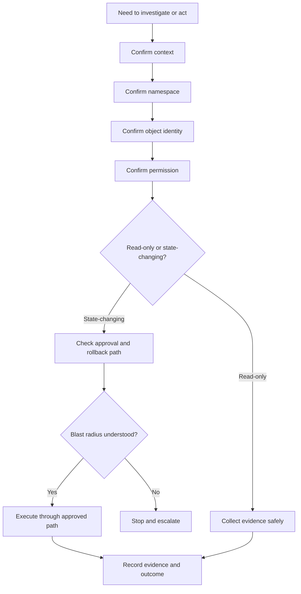
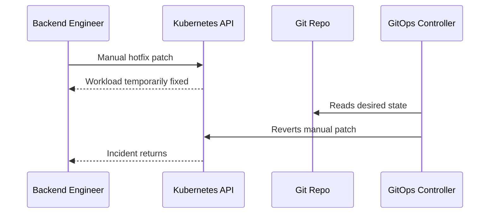

# Part 004 — Cluster Access and Operational Safety

## 1. Core Idea

Akses ke Kubernetes production adalah akses ke runtime aplikasi, traffic path, secret references, rollout state, dan kadang dependency integration.

Kesalahan kecil bisa berdampak besar:

- salah context,
- salah namespace,
- salah label selector,
- salah deployment,
- salah environment,
- salah command,
- salah asumsi permission,
- salah membaca output,
- atau menjalankan command yang terlihat harmless tetapi mengubah state.

Untuk backend engineer, cluster access bukan hanya masalah “bisa menjalankan kubectl”. Cluster access adalah bagian dari operational safety.

Tujuan part ini:

> membangun disiplin akses yang membuat investigasi production efektif tanpa memperbesar blast radius.

---

## 2. Why This Matters Operationally

Banyak incident Kubernetes bukan berasal dari bug aplikasi, melainkan dari human operational error.

Contoh:

- `kubectl delete pod` dijalankan di namespace production, bukan staging.
- `kubectl apply -f` memakai manifest lokal yang sudah stale.
- `kubectl edit deployment` membuat perubahan manual yang kemudian dioverwrite GitOps.
- `kubectl logs` menyalin data sensitif ke channel publik.
- `kubectl port-forward` membuka akses sementara ke service internal tanpa audit yang jelas.
- `kubectl scale` menaikkan replica consumer dan membuat database/broker overload.
- `kubectl rollout undo` dilakukan tanpa memahami migration compatibility.

Production safety bukan memperlambat engineer. Production safety membuat tindakan engineer **terukur, reversible, auditable, dan tidak impulsif**.

---

## 3. Access Safety Mental Model



Sebelum command dijalankan, tanyakan:

1. Cluster mana?
2. Namespace mana?
3. Object mana?
4. Environment mana?
5. Apakah command mengubah state?
6. Apakah ada risiko secret/PII exposure?
7. Apakah action ini bisa di-audit?
8. Apakah ada rollback path?
9. Apakah saya punya authority untuk melakukan ini?

---

## 4. kubeconfig

`kubeconfig` menyimpan informasi untuk mengakses cluster:

- cluster endpoint,
- certificate authority,
- user/auth provider,
- contexts,
- default namespace,
- current context.

Cek file config aktif:

```bash
kubectl config view
kubectl config current-context
kubectl config get-contexts
```

### 4.1 Operational risk

Risiko utama kubeconfig:

- context production dan staging terlihat mirip,
- kubeconfig lama masih aktif,
- credential terlalu luas,
- user menggunakan cluster admin credential untuk investigasi biasa,
- namespace default tidak sesuai,
- multiple kubeconfig digabung tanpa naming convention jelas.

### 4.2 Safety practice

Gunakan naming context yang eksplisit:

```text
csg-dev-eks-quote
csg-stg-eks-quote
csg-prod-eks-quote
csg-prod-aks-order
```

Hindari nama ambigu:

```text
default
kubernetes-admin@kubernetes
prod
cluster1
```

Gunakan alias atau prompt shell yang menampilkan context dan namespace.

Contoh mindset:

> Jika terminal tidak menampilkan context dan namespace, jangan jalankan command state-changing.

---

## 5. Context

Context menentukan kombinasi cluster, user, dan namespace default.

Cek context:

```bash
kubectl config current-context
kubectl config get-contexts
```

Pindah context:

```bash
kubectl config use-context <context-name>
```

### 5.1 Production safety rule

Sebelum command production:

```bash
kubectl config current-context
kubectl get ns
```

Untuk command yang mengubah state, ulangi validasi context secara eksplisit.

Contoh:

```bash
CTX=$(kubectl config current-context)
echo "Current context: $CTX"
```

Jika context mengandung `prod`, anggap semua command berisiko sampai terbukti sebaliknya.

---

## 6. Namespace

Namespace adalah boundary yang sering dipakai untuk:

- environment,
- team,
- application domain,
- resource quota,
- RBAC,
- secret scope,
- network policy,
- workload isolation.

Selalu pakai `-n <namespace>` untuk command production.

Contoh:

```bash
kubectl get pods -n quote-prod
kubectl describe deployment quote-service -n quote-prod
```

Hindari mengandalkan namespace default.

### 6.1 Check namespace default

```bash
kubectl config view --minify --output 'jsonpath={..namespace}'
```

Jika kosong, default namespace adalah `default`.

### 6.2 Operational risk

- command dijalankan di namespace salah,
- service name sama di banyak namespace,
- secret/config beda antar environment,
- NetworkPolicy beda antar namespace,
- HPA/PDB ada di namespace tertentu saja,
- ingress route menunjuk service di namespace tertentu.

### 6.3 Namespace safety checklist

Sebelum investigasi:

```bash
kubectl get deploy -n <namespace>
kubectl get pods -n <namespace>
kubectl get svc -n <namespace>
kubectl get ingress -n <namespace>
```

Pastikan namespace benar sebelum menarik kesimpulan.

---

## 7. RBAC Permission

RBAC menentukan apa yang boleh dilakukan user atau ServiceAccount terhadap Kubernetes API.

Objek utama:

- `Role`
- `ClusterRole`
- `RoleBinding`
- `ClusterRoleBinding`
- `ServiceAccount`

Cek permission:

```bash
kubectl auth can-i get pods -n quote-prod
kubectl auth can-i list secrets -n quote-prod
kubectl auth can-i update deployment -n quote-prod
kubectl auth can-i delete pod -n quote-prod
```

Cek semua permission yang terlihat:

```bash
kubectl auth can-i --list -n quote-prod
```

### 7.1 Operational meaning

Jika Anda tidak punya permission, itu bukan sekadar hambatan teknis. Bisa jadi itu adalah security boundary.

Jangan bypass dengan credential orang lain.

Jangan meminta cluster-admin untuk debugging normal.

Minta permission spesifik berdasarkan evidence:

> “Saya perlu read access ke Deployment, Pod, Service, EndpointSlice, HPA, PDB, Events, dan logs di namespace `quote-prod` untuk incident triage. Saya tidak membutuhkan write access.”

---

## 8. Read-Only Access

Read-only access ideal untuk sebagian besar investigasi backend.

Minimal read-only access yang berguna:

- get/list/watch pods,
- get/list/watch deployments,
- get/list/watch replicasets,
- get/list/watch services,
- get/list/watch endpointslices,
- get/list/watch ingress,
- get/list/watch hpa,
- get/list/watch pdb,
- get/list/watch events,
- read pod logs.

Tetapi read-only ke Secret perlu sangat hati-hati.

Untuk kebanyakan backend investigation, Anda tidak perlu membaca secret value. Anda hanya perlu tahu:

- secret ada atau tidak,
- key ada atau tidak,
- secret ter-mount atau tidak,
- pod restart setelah secret berubah atau tidak,
- external secret sync berhasil atau tidak.

### 8.1 Safer secret inspection

Cek metadata secret:

```bash
kubectl get secret -n quote-prod
kubectl describe secret -n quote-prod quote-db-secret
```

Hindari:

```bash
kubectl get secret -n quote-prod quote-db-secret -o yaml
```

karena dapat menampilkan encoded secret value.

Encoded bukan berarti aman untuk dibagikan.

---

## 9. Production Access

Production access harus dianggap privileged meskipun hanya read-only.

Alasannya:

- logs dapat mengandung customer identifier,
- pod env dapat mengandung sensitive config,
- endpoint internal dapat menunjukkan topology,
- trace dapat menunjukkan payload metadata,
- service discovery dapat menunjukkan dependency map,
- `exec` dapat memberi akses langsung ke runtime.

### 9.1 Production access rules

Prinsip umum:

- least privilege,
- time-bound access jika memungkinkan,
- namespace-scoped access,
- audited access,
- separate production credential,
- no shared credential,
- no credential in personal notes,
- no copying sensitive output to public chat,
- prefer dashboard links with permission model,
- prefer GitOps/pipeline for changes.

### 9.2 Backend engineer production access profile

A reasonable backend production access profile often includes:

- read workload state,
- read events,
- read non-sensitive config metadata,
- read logs according to privacy policy,
- view metrics/traces,
- view rollout status,
- possibly execute approved rollback through pipeline,
- not edit cluster-wide resources,
- not directly edit secrets,
- not bypass network/security policy.

Internal policy may differ. Verify.

---

## 10. Break-Glass Access

Break-glass access adalah emergency access saat normal process tidak cukup untuk melindungi production.

Break-glass bukan jalan pintas.

Break-glass harus punya:

- explicit trigger condition,
- approval or incident commander authorization,
- time limit,
- audit log,
- action recording,
- post-use review,
- revocation after incident,
- evidence preservation.

### 10.1 Valid break-glass situations

Contoh valid:

- severe customer impact,
- normal deployment pipeline unavailable,
- GitOps controller down saat rollback kritis,
- security-approved emergency secret rotation,
- production data corruption prevention,
- critical dependency isolation.

### 10.2 Invalid break-glass usage

Contoh tidak valid:

- ingin cepat tanpa PR,
- malas menunggu approval,
- ingin debug dengan cluster-admin,
- ingin mengubah secret manual untuk testing,
- ingin bypass NetworkPolicy agar sementara berhasil,
- ingin melakukan hotfix tanpa audit.

---

## 11. Audit Log

Audit log menjawab:

- siapa melakukan apa,
- kapan,
- ke resource mana,
- dari mana,
- dengan user/ServiceAccount apa,
- apakah request diizinkan atau ditolak.

Audit penting untuk:

- incident timeline,
- compliance,
- security investigation,
- change attribution,
- detecting manual drift,
- post-incident review.

Backend engineer tidak selalu punya akses langsung ke audit log, tetapi harus tahu bahwa action production dapat diaudit.

### 11.1 Audit-aware behavior

Saat melakukan action:

- catat alasan,
- catat command/action,
- catat timestamp,
- catat object,
- catat expected outcome,
- catat actual outcome,
- link ke incident/change ticket.

Contoh incident note:

```text
10:42 WIB — Checked rollout status for deployment/quote-service in quote-prod.
10:44 WIB — Confirmed new revision 38 has 0 ready pods due readiness failure.
10:47 WIB — Proposed rollback to revision 37. Approved by incident commander.
10:49 WIB — Rollback triggered via GitOps/pipeline. Monitoring error rate and readiness.
```

---

## 12. kubectl Safety

`kubectl` adalah alat yang kuat. Kekuatan utamanya juga risikonya.

### 12.1 Prefer explicit flags

Gunakan:

```bash
kubectl get pods -n quote-prod -l app=quote-service
```

Daripada:

```bash
kubectl get pods
```

Gunakan:

```bash
kubectl rollout status deployment/quote-service -n quote-prod
```

Daripada mengandalkan namespace default.

### 12.2 Avoid broad selectors for mutation

Berbahaya:

```bash
kubectl delete pods -n quote-prod -l app=quote-service
```

Lebih aman:

```bash
kubectl delete pod -n quote-prod quote-service-abc123
```

Tetapi tetap butuh approval jika production.

### 12.3 Avoid live edit when GitOps exists

Hindari:

```bash
kubectl edit deployment quote-service -n quote-prod
```

Jika environment GitOps, perubahan manual dapat:

- dioverwrite,
- menyebabkan drift,
- tidak terekam di Git,
- membingungkan rollback,
- menurunkan auditability.

Prefer:

- PR ke GitOps repo,
- pipeline-approved change,
- emergency patch hanya jika break-glass dan dicatat.

---

## 13. Dry-Run

Dry-run membantu melihat apa yang akan dikirim ke API server tanpa benar-benar mengubah state.

Client-side dry-run:

```bash
kubectl apply -f deployment.yaml --dry-run=client
```

Server-side dry-run:

```bash
kubectl apply -f deployment.yaml --dry-run=server
```

Server-side dry-run lebih berguna untuk validasi admission dan schema terhadap cluster aktual.

### 13.1 Operational use

Gunakan dry-run untuk:

- memvalidasi manifest,
- mengecek schema,
- mengecek admission policy,
- mencegah typo object,
- melihat rendered object sebelum apply.

Namun dry-run bukan pengganti review.

Dry-run tidak menjamin:

- pod akan start,
- image bisa ditarik,
- secret ada,
- readiness berhasil,
- dependency reachable,
- rollout aman.

---

## 14. Diff

`kubectl diff` menunjukkan perubahan antara manifest lokal dan cluster state.

```bash
kubectl diff -f deployment.yaml -n quote-prod
```

Dalam GitOps, gunakan juga diff tool dari GitOps/Helm pipeline, misalnya:

```bash
helm diff upgrade quote-service ./chart -f values-prod.yaml
```

atau rendered manifest comparison di pipeline.

### 14.1 What to inspect in diff

Saat review diff, perhatikan:

- image tag/digest,
- env var,
- ConfigMap/Secret reference,
- resource request/limit,
- probes,
- container port,
- service selector,
- ingress host/path,
- annotations,
- ServiceAccount,
- HPA min/max/metric,
- PDB,
- NetworkPolicy,
- securityContext.

### 14.2 Diff risk

Diff bisa besar dan noise-heavy.

Risiko:

- perubahan penting tersembunyi di generated fields,
- Helm/Kustomize rendering berbeda antar environment,
- secret values tidak terlihat tetapi secret reference berubah,
- annotation kecil berdampak besar pada ingress behavior.

---

## 15. Impersonation Awareness

Kubernetes mendukung impersonation untuk mengecek permission sebagai user atau ServiceAccount tertentu jika diizinkan.

Contoh:

```bash
kubectl auth can-i get pods \
  --as=system:serviceaccount:quote-prod:quote-service \
  -n quote-prod
```

Impersonation berguna untuk debugging RBAC.

Tetapi impersonation permission sendiri adalah privileged capability.

### 15.1 Use cases

- mengecek apakah ServiceAccount workload bisa membaca resource tertentu,
- memvalidasi RoleBinding,
- men-debug operator/controller permission,
- memastikan least privilege.

### 15.2 Safety

Jangan gunakan impersonation untuk bypass policy.

Gunakan hanya untuk validasi dan sesuai permission yang diberikan.

---

## 16. Command Blast Radius

Blast radius command ditentukan oleh:

- cluster,
- namespace,
- resource type,
- selector,
- verb,
- object count,
- traffic role,
- dependency role,
- environment,
- reconciliation behavior,
- GitOps behavior.

### 16.1 Low blast radius examples

```bash
kubectl get pod -n quote-prod quote-service-abc123
kubectl describe pod -n quote-prod quote-service-abc123
kubectl logs -n quote-prod quote-service-abc123 --tail=200
```

Still sensitive, but not state-changing.

### 16.2 Medium blast radius examples

```bash
kubectl rollout restart deployment/quote-service -n quote-prod
kubectl scale deployment/quote-service -n quote-prod --replicas=6
kubectl delete pod -n quote-prod quote-service-abc123
```

Can impact traffic, dependency load, or availability.

### 16.3 High blast radius examples

```bash
kubectl delete pods -n quote-prod -l app=quote-service
kubectl apply -f ./manifests/prod/
kubectl patch networkpolicy -n quote-prod ...
kubectl edit secret -n quote-prod quote-db-secret
kubectl delete pvc -n quote-prod ...
```

High risk because object count, data impact, or security impact is large.

### 16.4 Cluster-wide blast radius examples

```bash
kubectl delete clusterrolebinding ...
kubectl patch validatingwebhookconfiguration ...
kubectl delete crd ...
kubectl drain node ...
```

Backend engineers should not perform these unless explicitly authorized in emergency process.

---

## 17. Safe Investigation Flow

Gunakan flow ini untuk investigasi production:

```bash
# 1. Confirm context
kubectl config current-context

# 2. Confirm namespace exists
kubectl get ns quote-prod

# 3. See workload state
kubectl get deploy,rs,pod,svc,hpa,pdb -n quote-prod -l app=quote-service

# 4. Check rollout
kubectl rollout status deployment/quote-service -n quote-prod
kubectl rollout history deployment/quote-service -n quote-prod

# 5. Check pod details and events
kubectl describe pod -n quote-prod <pod-name>
kubectl get events -n quote-prod --sort-by=.lastTimestamp

# 6. Check logs carefully
kubectl logs -n quote-prod <pod-name> --tail=200
kubectl logs -n quote-prod <pod-name> --previous --tail=200

# 7. Check service endpoints
kubectl get svc -n quote-prod quote-service -o wide
kubectl get endpointslice -n quote-prod -l kubernetes.io/service-name=quote-service

# 8. Check ingress if traffic path is affected
kubectl get ingress -n quote-prod
kubectl describe ingress -n quote-prod <ingress-name>
```

Jangan langsung mutate sebelum evidence jelas.

---

## 18. Operational Safety for `logs`

Logs terlihat aman, tetapi bisa berisi:

- customer identifiers,
- order IDs,
- quote IDs,
- billing references,
- token fragments,
- email/phone/address,
- SQL statements with values,
- payload fragments,
- stack traces with secret-like data.

### 18.1 Safe log usage

- gunakan `--tail`,
- filter waktu jika mungkin,
- jangan dump full logs ke chat umum,
- redact sensitive data,
- gunakan correlation ID,
- simpan evidence sesuai incident process,
- gunakan log platform dengan access control.

Contoh:

```bash
kubectl logs -n quote-prod deploy/quote-service --since=15m --tail=300
```

### 18.2 Dangerous log usage

```bash
kubectl logs -n quote-prod deploy/quote-service > prod-logs.txt
```

Berbahaya jika file disimpan di laptop atau dibagikan tanpa kontrol.

---

## 19. Operational Safety for `exec`

`kubectl exec` memberi akses langsung ke container.

Contoh:

```bash
kubectl exec -n quote-prod -it quote-service-abc123 -- /bin/sh
```

Risiko:

- melihat env var sensitif,
- menjalankan command yang mengubah file runtime,
- memicu request internal,
- membaca mounted secrets,
- membuat evidence tidak repeatable,
- keluar dari audit pipeline normal,
- mengandalkan perubahan manual yang hilang saat pod restart.

### 19.1 Safer alternatives

Sebelum `exec`, pertimbangkan:

- logs,
- metrics,
- traces,
- events,
- readiness endpoint,
- debug endpoint yang aman,
- ephemeral debug container sesuai policy,
- dashboard dependency.

### 19.2 If exec is allowed

Gunakan prinsip:

- read-only intent,
- command spesifik,
- no shell if single command enough,
- no secret printing,
- no file mutation,
- record reason,
- record timestamp.

Contoh lebih aman:

```bash
kubectl exec -n quote-prod quote-service-abc123 -- cat /etc/resolv.conf
```

Daripada masuk shell interaktif tanpa tujuan jelas.

---

## 20. Operational Safety for `port-forward`

`kubectl port-forward` dapat membuka akses lokal ke service/pod internal.

Contoh:

```bash
kubectl port-forward -n quote-prod svc/quote-service 8080:80
```

Risiko:

- bypass ingress/API gateway,
- bypass auth edge,
- bypass rate limiting,
- bypass WAF/policy,
- mengakses endpoint internal,
- menjalankan request manual tanpa audit aplikasi normal,
- membuka akses ke dependency sensitif.

### 20.1 Production guidance

Di production, `port-forward` harus dianggap sensitive action.

Gunakan hanya jika:

- policy memperbolehkan,
- ada alasan debugging yang jelas,
- tidak ada alternatif observability,
- endpoint yang diakses aman,
- tidak mengubah data,
- dicatat di incident/change log.

---

## 21. Operational Safety for `delete pod`

`delete pod` sering dianggap restart sederhana. Itu tidak selalu benar.

Efek delete pod:

- in-flight request terputus jika shutdown buruk,
- consumer rebalance,
- message redelivery,
- DB connection churn,
- cache warmup ulang,
- readiness gap,
- rollout interaction,
- PDB impact,
- node rescheduling.

### 21.1 Safer thinking

Sebelum delete pod:

- apakah pod bagian dari Deployment?
- apakah replica lain ready?
- apakah PDB mengizinkan disruption?
- apakah workload consumer stateful secara logis?
- apakah shutdown graceful?
- apakah deletion akan memicu rebalance storm?
- apakah masalah hanya di satu pod?
- apakah root cause akan hilang atau muncul lagi?

Delete pod bukan root cause fix.

---

## 22. Operational Safety for Scale

Scaling terlihat sederhana:

```bash
kubectl scale deployment/quote-service -n quote-prod --replicas=10
```

Tetapi scale berdampak ke:

- database connection count,
- Kafka consumer group rebalance,
- RabbitMQ consumer count,
- Redis connection pool,
- downstream HTTP dependency,
- node capacity,
- cost,
- HPA behavior,
- PDB behavior.

### 22.1 Scale-up checklist

Sebelum scale up:

- apakah bottleneck CPU di service?
- apakah dependency punya capacity?
- apakah DB max connection aman?
- apakah Kafka partition count mendukung?
- apakah RabbitMQ prefetch perlu disesuaikan?
- apakah Redis max client aman?
- apakah node capacity cukup?
- apakah HPA akan override manual scale?
- apakah scale up akan memperparah incident?

### 22.2 Scale-down checklist

Sebelum scale down:

- apakah traffic masih tinggi?
- apakah queue backlog ada?
- apakah PDB/minAvailable terdampak?
- apakah in-flight work aman?
- apakah consumer shutdown graceful?
- apakah scheduled job butuh replica tertentu?

---

## 23. Operational Safety for Rollout Undo

Rollback sering menjadi mitigation terbaik, tetapi tetap perlu verifikasi.

Command:

```bash
kubectl rollout undo deployment/quote-service -n quote-prod
```

Risiko rollback:

- schema migration sudah maju,
- config lama tidak kompatibel dengan secret baru,
- event format berubah,
- cache format berubah,
- dependency contract berubah,
- rollback revision tidak diketahui,
- GitOps mengembalikan revision berbeda,
- pipeline source of truth tidak sinkron.

### 23.1 Rollback checklist

Sebelum rollback:

- revision sehat terakhir diketahui?
- migration compatible?
- config compatible?
- secret compatible?
- traffic impact dipahami?
- smoke test tersedia?
- GitOps path jelas?
- incident commander approve?
- post-rollback dashboard dipantau?

---

## 24. Operational Safety for Apply/Patch/Edit

`apply`, `patch`, dan `edit` mengubah desired state.

### 24.1 Risks

- local manifest stale,
- generated fields overwritten,
- GitOps drift,
- wrong namespace,
- wrong overlay,
- admission policy bypass attempt,
- secret leakage,
- unreviewed production change,
- no rollback history.

### 24.2 Preferred production path

Untuk production:

1. PR ke manifest repo,
2. review,
3. rendered diff,
4. CI validation,
5. approval,
6. GitOps sync/pipeline deploy,
7. deployment marker,
8. smoke test,
9. dashboard verification.

Manual patch hanya untuk emergency dengan break-glass.

---

## 25. Operational Safety for Debug Containers

`kubectl debug` dapat menambahkan ephemeral container untuk debugging.

Contoh:

```bash
kubectl debug -n quote-prod pod/quote-service-abc123 -it --image=busybox
```

Risiko:

- image debug tidak approved,
- network access dari pod context,
- mounted namespace/process visibility,
- data exposure,
- audit requirement,
- policy violation.

Gunakan hanya jika platform policy mengizinkan.

Pertimbangkan debug image yang approved dan minimal.

---

## 26. Operational Safety with GitOps

Jika cluster memakai GitOps, source of truth adalah Git.

Manual change di cluster dapat menjadi:

- temporary drift,
- overwritten by reconciliation,
- invisible to code review,
- hard to reproduce,
- missing from audit trail,
- confusing during rollback.

### 26.1 GitOps safety rules

- cek sync status sebelum menyimpulkan,
- jangan apply manual tanpa memahami reconciler,
- lakukan rollback melalui Git jika memungkinkan,
- gunakan sync wave/hook sesuai standard,
- catat emergency manual change,
- reconcile kembali ke Git setelah incident.

### 26.2 Common GitOps incident

Flow:



Lesson:

> Manual hotfix in a GitOps cluster is temporary unless reconciled into Git or GitOps is deliberately paused by approved process.

---

## 27. Access Safety for EKS

EKS adds AWS-specific access concerns.

Backend engineer should verify:

- how Kubernetes auth maps to AWS IAM,
- whether access uses IAM Identity Center, role assumption, or static credentials,
- whether `aws eks update-kubeconfig` changes current context,
- whether ECR pull permission is node role or workload identity related,
- whether IRSA is used for pod access to AWS services,
- whether CloudTrail records relevant access.

### 27.1 EKS safety examples

Risky:

```bash
aws eks update-kubeconfig --name prod-cluster
kubectl delete pod ...
```

The first command may silently change or add context. Always check current context after updating kubeconfig.

```bash
kubectl config current-context
```

---

## 28. Access Safety for AKS

AKS adds Azure-specific access concerns.

Backend engineer should verify:

- whether access uses Azure AD / Entra ID,
- whether `az aks get-credentials` changes kubeconfig,
- whether Azure RBAC and Kubernetes RBAC both apply,
- whether ACR pull uses managed identity,
- whether Azure Workload Identity is used,
- whether Azure Activity Log/Audit captures relevant operation.

### 28.1 AKS safety examples

After fetching credentials:

```bash
az aks get-credentials --resource-group <rg> --name <cluster>
kubectl config current-context
kubectl config get-contexts
```

Never assume the active context remains unchanged.

---

## 29. Access Safety for On-Prem/Hybrid

On-prem/hybrid clusters may involve:

- corporate proxy,
- internal CA,
- custom auth provider,
- VPN access,
- bastion host,
- private registry,
- firewall-controlled API server access,
- air-gapped operations.

Safety concerns:

- using personal kubeconfig copied from another engineer,
- bypassing bastion controls,
- ignoring internal CA/truststore requirement,
- copying manifests between disconnected environments,
- applying cloud assumptions to on-prem topology.

Verify internal process before assuming cloud-native workflows exist.

---

## 30. Failure Modes

### 30.1 Wrong context

Symptom:

- command output does not match expected workload,
- deployment not found,
- unexpected resources appear,
- action affects wrong environment.

Detection:

```bash
kubectl config current-context
kubectl get ns
```

Mitigation:

- stop immediately,
- identify whether state changed,
- notify owner if production affected,
- restore via GitOps/rollback if needed,
- record timeline.

### 30.2 Wrong namespace

Symptom:

- service not found,
- pod list empty,
- logs from wrong environment,
- conclusion based on wrong workload.

Detection:

```bash
kubectl get pods -A | grep quote-service
```

Mitigation:

- re-run investigation with explicit `-n`,
- correct incident notes if prior evidence was wrong.

### 30.3 Over-permissioned access

Symptom:

- user can perform dangerous command not needed for role,
- no separation between read and write,
- cluster-admin used for daily debugging.

Mitigation:

- request least-privilege access,
- separate break-glass credential,
- audit access usage.

### 30.4 Manual drift

Symptom:

- cluster state differs from Git,
- change disappears after GitOps sync,
- rollback history unclear.

Detection:

- GitOps out-of-sync status,
- `kubectl diff`,
- deployment annotation mismatch.

Mitigation:

- reconcile through Git,
- document emergency patch,
- remove manual drift.

### 30.5 Secret exposure

Symptom:

- secret value printed in terminal/log/chat,
- secret copied into ticket,
- pod env dumped publicly.

Mitigation:

- treat as possible credential leak,
- notify security,
- rotate secret if required,
- remove/redact exposed evidence.

---

## 31. Production-Safe Command Checklist

Before running any command in production:

- [ ] I verified current context.
- [ ] I specified namespace explicitly.
- [ ] I verified object name/selector.
- [ ] I know whether command is read-only or state-changing.
- [ ] I understand possible blast radius.
- [ ] I am not exposing secret/PII.
- [ ] I have approval if command changes state.
- [ ] I know rollback/recovery path.
- [ ] I will record relevant evidence.
- [ ] I know who to escalate to if result is unexpected.

---

## 32. Internal Verification Checklist

### 32.1 Access model

- Bagaimana kubeconfig diberikan?
- Apakah context naming jelas?
- Apakah production credential terpisah?
- Apakah access time-bound?
- Apakah namespace-scoped?
- Apakah ada read-only role untuk backend engineer?
- Apakah ada break-glass role?

### 32.2 RBAC and audit

- Permission apa yang dimiliki backend engineer?
- Apakah `kubectl auth can-i --list` sesuai kebutuhan?
- Apakah access ke Secret dibatasi?
- Apakah `exec` dibatasi?
- Apakah `port-forward` dibatasi?
- Apakah audit log tersedia?
- Siapa yang bisa membaca audit log?

### 32.3 Operational action policy

- Apakah service owner boleh rollback?
- Apakah service owner boleh scale manual?
- Apakah service owner boleh restart deployment?
- Apakah service owner boleh suspend CronJob?
- Apakah manual patch diperbolehkan?
- Apakah delete pod diperbolehkan?
- Apakah semua action harus via GitOps/pipeline?

### 32.4 GitOps/pipeline safety

- Apa source of truth manifest?
- Apakah cluster auto-sync?
- Bagaimana rollback dilakukan?
- Bagaimana emergency hotfix dilakukan?
- Bagaimana drift dideteksi?
- Bagaimana manual change direkonsiliasi?
- Apakah rendered diff tersedia di PR?

### 32.5 Sensitive data handling

- Apakah logs mengandung PII/customer data?
- Bagaimana evidence incident disimpan?
- Apakah secret boleh dilihat oleh backend engineer?
- Bagaimana secret leakage dilaporkan?
- Apakah pod env boleh diinspeksi?
- Apakah trace payload disanitasi?

### 32.6 EKS/AKS/on-prem specifics

- EKS: bagaimana IAM user/role dipetakan ke Kubernetes access?
- EKS: apakah CloudTrail dipakai untuk audit?
- EKS: bagaimana IRSA di-debug?
- AKS: apakah Azure RBAC dan Kubernetes RBAC dipakai bersama?
- AKS: bagaimana Azure Activity Log/Audit digunakan?
- On-prem: apakah akses melalui VPN/bastion/proxy?
- Hybrid: siapa owner firewall/DNS/private endpoint?

---

## 33. Practical Rules to Memorize

1. Always check context.
2. Always specify namespace.
3. Never mutate production accidentally.
4. Never print secret values.
5. Never trust local manifest without diff.
6. Never bypass GitOps casually.
7. Never scale without dependency capacity awareness.
8. Never rollback without compatibility check.
9. Never use break-glass for convenience.
10. Escalate with evidence, not guesses.

---

## 34. Key Takeaways

- Cluster access is operational power, not just developer convenience.
- Most backend investigations should start read-only.
- Context and namespace mistakes are common and dangerous.
- RBAC denial is a boundary signal, not an invitation to bypass.
- `logs`, `exec`, and `port-forward` can expose sensitive data or bypass normal controls.
- State-changing commands require blast radius reasoning.
- GitOps changes the correct path for production mutation.
- EKS, AKS, and on-prem/hybrid add their own identity, audit, and access risks.
- Senior backend engineers should be fast in investigation, slow in mutation, and precise in escalation.

---

## 35. Next Part

Part berikutnya membahas **kubectl Operational Workflow**: `get`, `describe`, `logs`, `exec`, `top`, `events`, `rollout`, `port-forward`, `debug`, `auth can-i`, `diff`, `explain`, `wait`, dan checklist penggunaan kubectl yang production-safe.
