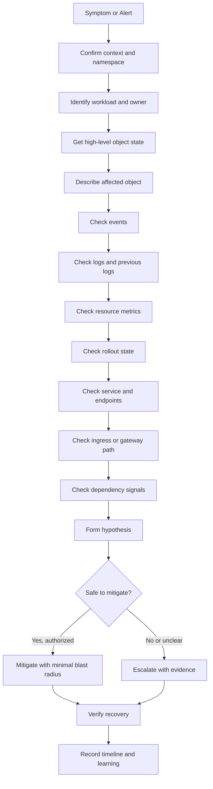

# Part 005 — kubectl Operational Workflow

> Fokus part ini bukan “hafalan command kubectl”. Fokusnya adalah **workflow investigasi production-safe**: bagaimana membaca state Kubernetes secara sistematis, mengurangi blast radius, mengambil evidence, dan tahu kapan harus berhenti lalu eskalasi.

Untuk backend engineer, `kubectl` adalah alat observasi dan investigasi runtime. Ia bisa menjadi alat yang sangat membantu saat outage, tetapi juga bisa menjadi alat yang berbahaya jika dipakai tanpa konteks namespace, environment, RBAC, GitOps, ownership, dan impact ke workload.

Part ini membangun pola kerja aman untuk membaca workload Java/JAX-RS di Kubernetes, terutama service yang berinteraksi dengan PostgreSQL, Kafka, RabbitMQ, Redis, Camunda, NGINX/Ingress, AWS/Azure services, dan sistem enterprise lain.

---

## 1. Core Mental Model

`kubectl` berinteraksi dengan Kubernetes API Server. Saat Anda menjalankan command, Anda sedang membaca atau mengubah object di control plane.

Secara operasional, command kubectl dapat dibagi menjadi beberapa kategori:

| Kategori | Contoh | Risiko | Tujuan |
|---|---|---:|---|
| Read-only inventory | `get`, `explain`, `auth can-i` | Rendah | Melihat object dan permission |
| Read-only diagnosis | `describe`, `logs`, `events`, `top`, `rollout status` | Rendah-menengah | Mengambil evidence runtime |
| Interactive diagnosis | `exec`, `port-forward`, `debug` | Menengah-tinggi | Masuk ke jalur runtime secara lebih dekat |
| State-changing action | `apply`, `patch`, `scale`, `delete`, `rollout undo` | Tinggi | Mengubah state workload |
| Destructive/emergency action | `delete pod`, `delete deployment`, force replace | Sangat tinggi | Mitigasi darurat, hanya bila authorized |

Backend engineer idealnya sangat kuat di kategori pertama dan kedua, tahu batas aman kategori ketiga, dan sangat disiplin sebelum masuk ke kategori keempat/kelima.

---

## 2. Production-Safe Operating Principles

Sebelum command apa pun di production, pegang prinsip berikut:

1. **Pastikan context.** Jangan percaya terminal prompt saja.
2. **Pastikan namespace.** Banyak incident berasal dari salah namespace.
3. **Mulai dari read-only.** Jangan langsung `delete pod`, `restart`, atau `rollout undo`.
4. **Ambil evidence sebelum mitigasi.** Logs/events/status sebelum state berubah.
5. **Jangan melawan GitOps.** Manual patch bisa di-reconcile balik oleh Argo CD/Flux.
6. **Jangan masuk ke pod tanpa alasan kuat.** `exec` dan `debug` bisa melanggar policy/security boundary.
7. **Bedakan symptom dan root cause.** Pod restart bukan root cause; itu gejala.
8. **Gunakan label selector.** Hindari command yang terlalu luas.
9. **Minimalkan scope.** Targetkan satu namespace, satu app, satu pod, satu container.
10. **Tahu kapan eskalasi.** Cluster-level, node-level, CNI, storage, admission, dan IAM sering milik platform/SRE/security.

---

## 3. Pre-flight Safety Checklist

Sebelum investigasi production:

```bash
kubectl config current-context
kubectl config view --minify
kubectl auth can-i get pods -n <namespace>
kubectl auth can-i list events -n <namespace>
kubectl auth can-i get deployments -n <namespace>
```

Validasi juga namespace eksplisit:

```bash
kubectl get ns
kubectl get pods -n <namespace>
```

Hindari mengandalkan default namespace:

```bash
# Kurang aman untuk production karena bergantung context default
kubectl get pods

# Lebih eksplisit
kubectl get pods -n quote-order-prod
```

Untuk command yang berpotensi mengubah state, lakukan mental pause:

- Apakah ini production?
- Apakah ada incident aktif?
- Apakah saya authorized?
- Apakah ada GitOps controller yang akan override perubahan?
- Apakah evidence sudah diambil?
- Apakah command ini mengubah traffic, pod count, config, secret, atau routing?
- Apakah ada rollback path?

---

## 4. Recommended Investigation Flow

Gunakan flow berikut saat mendapat alert atau laporan issue.



Workflow ini mencegah debugging lompat-lompat. Anda mulai dari object state, lalu turun ke pod/container, lalu naik lagi ke service/ingress/dependency.

---

## 5. `kubectl get`: Inventory and State Snapshot

`kubectl get` adalah titik masuk pertama. Gunakan untuk melihat list object dan status ringkas.

### 5.1 Workload Overview

```bash
kubectl get deploy,rs,pod,svc,ingress,hpa,pdb -n <namespace>
```

Untuk namespace besar, gunakan label:

```bash
kubectl get deploy,rs,pod,svc,ingress,hpa,pdb \
  -n <namespace> \
  -l app.kubernetes.io/name=<service-name>
```

### 5.2 Pod dengan wide output

```bash
kubectl get pods -n <namespace> -l app=<app> -o wide
```

Perhatikan:

- `READY`
- `STATUS`
- `RESTARTS`
- `AGE`
- `IP`
- `NODE`
- `NOMINATED NODE`
- `READINESS GATES`

Untuk backend service, `RESTARTS` dan `AGE` sering memberi petunjuk apakah issue terkait rollout baru, node event, crash loop, atau autoscaling.

### 5.3 Deployment detail ringkas

```bash
kubectl get deploy <deployment> -n <namespace>
```

Perhatikan:

- `READY`
- `UP-TO-DATE`
- `AVAILABLE`
- `AGE`

Contoh interpretasi:

| Gejala | Kemungkinan |
|---|---|
| `0/3 READY` | Semua pod gagal ready, bisa config/probe/dependency |
| `2/3 READY` | Partial impact, bisa satu pod crash/node issue |
| `UP-TO-DATE` rendah | Rollout belum selesai |
| `AVAILABLE` rendah | Readiness atau availability issue |

### 5.4 Output custom columns

Untuk incident, custom columns membantu membaca banyak pod cepat:

```bash
kubectl get pods -n <namespace> -l app=<app> \
  -o custom-columns='NAME:.metadata.name,PHASE:.status.phase,NODE:.spec.nodeName,READY:.status.containerStatuses[*].ready,RESTARTS:.status.containerStatuses[*].restartCount,REASON:.status.containerStatuses[*].state.waiting.reason,STARTED:.status.startTime'
```

### 5.5 JSONPath untuk evidence spesifik

```bash
kubectl get pod <pod> -n <namespace> \
  -o jsonpath='{.status.containerStatuses[*].lastState.terminated.reason}'
```

Gunakan JSONPath untuk membaca fakta spesifik, bukan untuk menggantikan observability dashboard.

---

## 6. `kubectl describe`: Timeline, Conditions, Events

`describe` sangat berguna karena menggabungkan metadata, spec, status, condition, container state, volume, mount, dan events.

```bash
kubectl describe pod <pod> -n <namespace>
```

Bagian penting:

- `Labels`
- `Annotations`
- `Status`
- `IP`
- `Controlled By`
- `Containers`
- `State`
- `Last State`
- `Ready`
- `Restart Count`
- `Environment`
- `Mounts`
- `Conditions`
- `Volumes`
- `Events`

### 6.1 Untuk Deployment

```bash
kubectl describe deploy <deployment> -n <namespace>
```

Perhatikan:

- Strategy: rolling update, maxSurge, maxUnavailable
- Replicas desired/current/updated/available/unavailable
- Conditions: Available, Progressing
- Old ReplicaSets/New ReplicaSet
- Events

### 6.2 Untuk Service

```bash
kubectl describe svc <service> -n <namespace>
```

Perhatikan:

- Selector
- Type
- IP
- Port/TargetPort
- Endpoints

Jika `Endpoints: <none>`, masalah biasanya berada pada selector, readiness, namespace, atau target pod.

### 6.3 Untuk HPA

```bash
kubectl describe hpa <hpa> -n <namespace>
```

Perhatikan:

- Metrics target/current
- Min/max replicas
- Conditions
- Events
- Reason tidak scale

### 6.4 Batasan `describe`

`describe` bukan API stabil untuk automation. Untuk script, gunakan `get -o json` atau `get -o yaml`. Untuk manusia saat incident, `describe` sangat efektif.

---

## 7. `kubectl logs`: Evidence dari Container

Logs membantu menjawab: aplikasi memulai? crash? gagal connect dependency? gagal load config? menerima traffic? timeout?

### 7.1 Logs pod biasa

```bash
kubectl logs <pod> -n <namespace>
```

Jika pod punya banyak container:

```bash
kubectl logs <pod> -n <namespace> -c <container>
```

### 7.2 Previous logs untuk crash loop

Untuk CrashLoopBackOff, ini wajib:

```bash
kubectl logs <pod> -n <namespace> -c <container> --previous
```

Tanpa `--previous`, Anda mungkin hanya melihat container baru yang belum sempat menulis error.

### 7.3 Follow logs secara hati-hati

```bash
kubectl logs <pod> -n <namespace> -c <container> --follow
```

Gunakan saat ingin melihat startup atau request baru. Jangan jadikan ini satu-satunya sumber observability.

### 7.4 Batasi waktu dan jumlah baris

```bash
kubectl logs <pod> -n <namespace> --since=15m --tail=200
```

Ini lebih aman dan efisien daripada menarik semua log.

### 7.5 Logs berbasis label

```bash
kubectl logs -n <namespace> -l app=<app> --since=10m --tail=100
```

Hati-hati: label selector bisa membaca banyak pod sekaligus. Gunakan saat volume log terkendali.

### 7.6 Untuk Java/JAX-RS service

Cari pola:

- startup banner/application initialized
- port bind failure
- config binding failure
- missing env/secret
- database connection failure
- Kafka/RabbitMQ/Redis client failure
- Camunda worker activation failure
- HTTP server startup complete
- graceful shutdown signal
- exception spike after deployment
- GC overhead atau memory warning

### 7.7 Sensitive data warning

Jangan copy-paste secret, token, customer data, order data, quote data, PII, credential, atau full payload ke chat/incident notes tanpa aturan internal.

---

## 8. `kubectl events`: Recent Operational Signals

Kubernetes events sering menjadi bukti pertama untuk scheduling, image pull, mount, probe, restart, dan kill.

Command modern:

```bash
kubectl events -n <namespace>
```

Urutkan berdasarkan waktu:

```bash
kubectl events -n <namespace> --sort-by=.lastTimestamp
```

Filter object tertentu:

```bash
kubectl events -n <namespace> --for pod/<pod>
```

Jika cluster belum mendukung `kubectl events`, gunakan:

```bash
kubectl get events -n <namespace> --sort-by=.lastTimestamp
```

### 8.1 Event penting

| Event/Reason | Interpretasi awal |
|---|---|
| `FailedScheduling` | Resource/affinity/taint/quota/PVC issue |
| `Pulling` / `Pulled` | Image pull lifecycle |
| `Failed` / `ErrImagePull` | Image/registry/auth/network issue |
| `BackOff` | Crash loop atau image pull retry |
| `Unhealthy` | Probe failure |
| `Killing` | Container terminated/restarted |
| `FailedMount` | Volume/Secret/ConfigMap/CSI issue |
| `NodeNotReady` | Node/platform issue |

### 8.2 Event retention

Events tidak selalu disimpan lama. Dalam incident besar, ambil evidence cepat sebelum hilang dari API server atau event store.

---

## 9. `kubectl top`: Fast Resource Signal

`top` membaca metrics dari metrics server. Gunakan untuk snapshot cepat CPU/memory.

```bash
kubectl top pods -n <namespace>
kubectl top pod <pod> -n <namespace> --containers
kubectl top nodes
```

### 9.1 Interpretasi cepat

| Sinyal | Kemungkinan |
|---|---|
| CPU tinggi | Load naik, loop, thread saturation, GC, consumer backlog |
| Memory tinggi | Heap pressure, leak, cache growth, large payload, native memory |
| Pod tidak muncul | Metrics server lag/issue atau pod terlalu baru |
| Node tinggi | Node pressure, noisy neighbor, capacity issue |

### 9.2 Batasan `top`

`top` bukan pengganti dashboard historis. Untuk CPU throttling, OOM trend, dan latency correlation, gunakan Prometheus/Grafana/Datadog/New Relic/Azure Monitor/CloudWatch sesuai stack internal.

---

## 10. `kubectl rollout`: Release State

Rollout command membantu melihat dan mengontrol Deployment rollout.

### 10.1 Status rollout

```bash
kubectl rollout status deploy/<deployment> -n <namespace>
```

### 10.2 History rollout

```bash
kubectl rollout history deploy/<deployment> -n <namespace>
```

Revision detail:

```bash
kubectl rollout history deploy/<deployment> -n <namespace> --revision=<n>
```

### 10.3 Rollback

```bash
kubectl rollout undo deploy/<deployment> -n <namespace>
```

Rollback adalah state-changing action. Jangan lakukan kecuali authorized dan sesuai release/incident process.

Di environment GitOps, rollback manual lewat kubectl bisa hanya sementara. Source of truth mungkin tetap Git. Rollback yang benar sering berarti revert commit atau update manifest di GitOps repo.

### 10.4 Pause/resume rollout

```bash
kubectl rollout pause deploy/<deployment> -n <namespace>
kubectl rollout resume deploy/<deployment> -n <namespace>
```

Ini juga state-changing. Gunakan hanya dengan authority yang jelas.

---

## 11. `kubectl exec`: Interactive Runtime Diagnosis

`exec` memungkinkan menjalankan command di container yang sedang hidup.

```bash
kubectl exec -n <namespace> <pod> -c <container> -- <command>
```

Contoh read-only ringan:

```bash
kubectl exec -n <namespace> <pod> -- printenv | sort
kubectl exec -n <namespace> <pod> -- ls -lah /tmp
kubectl exec -n <namespace> <pod> -- cat /etc/resolv.conf
```

### 11.1 Risiko `exec`

`exec` bisa berisiko karena:

- membuka akses runtime langsung ke container
- command bisa mengubah file/process
- bisa mengekspos secret env var
- bisa melanggar audit/security policy
- tidak selalu tersedia pada distroless image
- bisa menghasilkan false confidence karena pod yang diperiksa belum tentu representatif

### 11.2 Untuk Java/JAX-RS

Kemungkinan investigasi:

- cek environment variable yang non-sensitive
- cek DNS resolver
- cek file mount ConfigMap/Secret tanpa menampilkan secret value
- cek `/tmp` atau upload directory
- cek truststore file exists
- cek process PID jika image mendukung

Hindari:

- dump secret
- menjalankan tool yang mengubah state
- query database langsung dari pod production tanpa approval
- kill process manual
- mengubah config file runtime

---

## 12. `kubectl port-forward`: Local Access to Cluster Service

`port-forward` membuat tunnel lokal ke pod/service.

```bash
kubectl port-forward -n <namespace> svc/<service> 8080:80
```

atau:

```bash
kubectl port-forward -n <namespace> pod/<pod> 8080:8080
```

### 12.1 Kapan berguna

- cek management endpoint internal
- cek readiness endpoint dari perspektif local tunnel
- akses dashboard internal saat troubleshooting
- verifikasi service response tanpa lewat ingress

### 12.2 Risiko

- bisa bypass ingress/API gateway controls
- bisa bypass auth/rate limiting tertentu
- menciptakan jalur akses tidak biasa
- harus diaudit di production

Gunakan hanya jika policy internal mengizinkan.

---

## 13. `kubectl debug`: Ephemeral Debugging

`kubectl debug` dapat menambahkan ephemeral container atau membuat debug copy.

Contoh:

```bash
kubectl debug -n <namespace> -it <pod> --image=busybox --target=<container>
```

### 13.1 Kapan dibutuhkan

- image aplikasi distroless
- tidak ada shell/tools di container
- perlu network diagnostic tool
- perlu cek DNS, TLS, atau route dari namespace/pod context

### 13.2 Risiko

- sering dibatasi security policy
- bisa melanggar immutability assumption
- butuh audit ketat
- bisa berbeda dari aplikasi container asli
- tidak boleh menjadi default debugging habit

Backend engineer harus tahu tool ini ada, tetapi pemakaiannya biasanya butuh approval atau platform/SRE involvement.

---

## 14. `kubectl auth can-i`: Permission Awareness

Gunakan untuk memeriksa permission diri sendiri atau service account.

```bash
kubectl auth can-i get pods -n <namespace>
kubectl auth can-i list secrets -n <namespace>
kubectl auth can-i create pods/exec -n <namespace>
kubectl auth can-i patch deployment -n <namespace>
```

Untuk ServiceAccount:

```bash
kubectl auth can-i get configmaps \
  -n <namespace> \
  --as=system:serviceaccount:<namespace>:<serviceaccount>
```

### 14.1 Interpretasi

- `yes`: RBAC mengizinkan, bukan berarti action aman secara proses.
- `no`: perlu Role/RoleBinding atau escalation ke owner.
- Permission Kubernetes berbeda dari cloud IAM/IRSA/Azure Workload Identity.

---

## 15. `kubectl diff`: Preview Change

Untuk manifest change:

```bash
kubectl diff -f manifest.yaml -n <namespace>
```

Dalam GitOps/Helm/Kustomize environment, lebih baik melihat rendered manifest dan diff di pipeline/GitOps tool.

### 15.1 Gunakan diff untuk PR review

Diff harus menjawab:

- Apakah image berubah?
- Apakah resource request/limit berubah?
- Apakah probe berubah?
- Apakah service selector berubah?
- Apakah ingress path/host berubah?
- Apakah HPA/PDB berubah?
- Apakah NetworkPolicy/RBAC berubah?
- Apakah ConfigMap/Secret reference berubah?

---

## 16. `kubectl explain`: Schema Awareness

`explain` membantu membaca field Kubernetes tanpa menebak.

```bash
kubectl explain deployment.spec.strategy
kubectl explain pod.spec.containers.resources
kubectl explain hpa.spec
kubectl explain networkpolicy.spec
```

Gunakan saat review manifest, terutama field yang jarang dipakai seperti:

- `terminationGracePeriodSeconds`
- `readinessGates`
- `topologySpreadConstraints`
- `lifecycle.preStop`
- `startupProbe`
- `revisionHistoryLimit`
- `progressDeadlineSeconds`

---

## 17. `kubectl wait`: Controlled Waiting

`wait` berguna untuk automation atau manual verification.

```bash
kubectl wait --for=condition=available deploy/<deployment> \
  -n <namespace> \
  --timeout=120s
```

Untuk pod readiness:

```bash
kubectl wait --for=condition=ready pod \
  -l app=<app> \
  -n <namespace> \
  --timeout=120s
```

### 17.1 Batasan

`wait` hanya menunggu condition Kubernetes. Ia tidak membuktikan:

- endpoint bisnis benar
- dependency sehat
- latency normal
- error rate normal
- queue lag turun
- workflow Camunda selesai

Tetap butuh smoke test dan observability verification.

---

## 18. Operational Workflows by Symptom

### 18.1 API 5xx setelah deployment

```bash
kubectl config current-context
kubectl get deploy,rs,pod,svc,ingress -n <namespace> -l app=<app>
kubectl rollout status deploy/<deployment> -n <namespace>
kubectl describe deploy <deployment> -n <namespace>
kubectl get pods -n <namespace> -l app=<app> -o wide
kubectl logs -n <namespace> -l app=<app> --since=15m --tail=200
kubectl describe svc <service> -n <namespace>
kubectl get endpointslice -n <namespace> -l kubernetes.io/service-name=<service>
```

Cek juga:

- ingress controller logs
- service dashboard
- trace error spans
- deployment marker
- dependency dashboard

Mitigasi awal:

- rollback jika jelas bad deployment
- pause rollout jika masih berlangsung
- eskalasi ingress/platform jika upstream/routing issue

### 18.2 CrashLoopBackOff

```bash
kubectl get pods -n <namespace> -l app=<app>
kubectl describe pod <pod> -n <namespace>
kubectl logs <pod> -n <namespace> -c <container> --previous --tail=200
kubectl logs <pod> -n <namespace> -c <container> --tail=200
kubectl events -n <namespace> --for pod/<pod>
```

Cek:

- missing config/secret
- JVM args
- startup probe
- database/broker dependency
- OOMKilled
- bad image

### 18.3 Pod Pending

```bash
kubectl describe pod <pod> -n <namespace>
kubectl events -n <namespace> --for pod/<pod>
kubectl get quota -n <namespace>
kubectl get limitrange -n <namespace>
kubectl get nodes
```

Cek:

- resource request terlalu besar
- quota exceeded
- node affinity/taint
- PVC pending
- autoscaler delay

### 18.4 Service no endpoint

```bash
kubectl describe svc <service> -n <namespace>
kubectl get pods -n <namespace> --show-labels
kubectl get endpointslice -n <namespace> -l kubernetes.io/service-name=<service>
kubectl get pods -n <namespace> -l '<selector-from-service>'
```

Cek:

- selector mismatch
- pod not ready
- named port mismatch
- namespace mismatch
- rollout stuck

### 18.5 HPA not scaling

```bash
kubectl get hpa -n <namespace>
kubectl describe hpa <hpa> -n <namespace>
kubectl top pods -n <namespace>
kubectl get deploy <deployment> -n <namespace> -o yaml
```

Cek:

- missing resource request
- metrics server issue
- wrong metric target
- max replica reached
- custom metric unavailable
- pending pods due cluster capacity

---

## 19. Java/JAX-RS Backend-Specific Usage

Untuk Java/JAX-RS service, command Kubernetes perlu dikaitkan dengan lifecycle aplikasi.

| Kubernetes signal | Java/JAX-RS interpretation |
|---|---|
| Startup probe failing | App server startup lambat, migration blocking, config load failure |
| Readiness failing | Endpoint management belum ready, dependency check terlalu strict, pool init gagal |
| Liveness failing | Deadlock, event loop/thread starvation, GC pause, endpoint salah |
| CrashLoopBackOff | JVM exits karena config/secret/memory/startup exception |
| OOMKilled | Heap/native/direct/thread memory melebihi limit |
| CPU throttling | Latency naik, GC lambat, request queue menumpuk |
| Service no endpoint | Semua pod not ready atau selector salah |
| 504 ingress | Timeout chain, slow dependency, thread pool exhaustion |

Command hanya memberi potongan evidence. Gabungkan dengan:

- application logs
- JVM metrics
- HTTP server metrics
- thread pool metrics
- DB pool metrics
- dependency spans
- release marker

---

## 20. Dependency-Aware kubectl Investigation

### 20.1 PostgreSQL

Dari Kubernetes:

- pod ready tetapi API 500 bisa berarti DB connection failure
- rollout meningkatkan replica bisa menaikkan total DB connections
- network policy/secret rotation bisa memutus DB access

Cek dengan aman:

```bash
kubectl logs -n <namespace> -l app=<app> --since=15m | grep -i 'connection\|timeout\|sql\|postgres'
```

Jangan menjalankan query produksi dari pod tanpa approval.

### 20.2 Kafka

Cek:

- pod restarts
- replica count vs partition count
- logs rebalance
- network/DNS to broker
- secret/cert changes

### 20.3 RabbitMQ

Cek:

- consumer pod restart
- queue depth di dashboard broker
- logs ack/nack/redelivery
- connection/channel errors

### 20.4 Redis

Cek:

- connection timeout
- DNS/private endpoint
- credential/secret rotation
- latency dashboard

### 20.5 Camunda

Cek:

- worker pod health
- activation errors
- job timeout/incident logs
- process correlation ID
- restart impact

---

## 21. EKS, AKS, and On-Prem Awareness

### 21.1 EKS

kubectl symptom dapat berasal dari AWS layer:

- ImagePullBackOff karena ECR permission
- ingress issue karena AWS Load Balancer Controller
- pod pending karena subnet IP exhaustion
- access denied karena IRSA trust policy
- PVC issue karena EBS CSI

Backend engineer tidak perlu mengelola semuanya, tetapi harus bisa menyebut evidence yang tepat saat eskalasi.

### 21.2 AKS

Symptom dapat berasal dari Azure layer:

- image pull dari ACR gagal
- identity failure karena Azure Workload Identity
- ingress issue karena Application Gateway/AGIC
- private endpoint DNS issue
- storage issue karena CSI/managed disk

### 21.3 On-prem/hybrid

Symptom dapat berasal dari:

- corporate DNS
- proxy/NO_PROXY
- internal CA
- firewall allowlist
- air-gapped registry
- on-prem load balancer

---

## 22. Safe vs Dangerous Command Matrix

| Command | Default stance | Notes |
|---|---|---|
| `get` | Safe | Tetap batasi namespace |
| `describe` | Safe | Bisa menampilkan env references; hati-hati saat share output |
| `logs` | Safe-ish | Risiko sensitive data |
| `events` | Safe | Evidence penting |
| `top` | Safe | Snapshot saja |
| `rollout status/history` | Safe | Read-only |
| `auth can-i` | Safe | Baik untuk permission awareness |
| `explain` | Safe | Schema learning |
| `wait` | Safe-ish | Read-only wait, tapi bisa misleading |
| `exec` | Controlled | Butuh policy/approval di prod |
| `port-forward` | Controlled | Bisa bypass ingress/security |
| `debug` | Controlled/high | Biasanya perlu approval |
| `scale` | State-changing | Bisa impact traffic/cost/dependency |
| `patch` | State-changing | Bisa dilawan GitOps |
| `delete pod` | State-changing | Bisa aman atau berbahaya tergantung workload |
| `rollout undo` | State-changing | Butuh incident/release authority |
| `delete deployment` | Dangerous | Hampir selalu bukan tindakan backend engineer biasa |

---

## 23. Evidence Package for Escalation

Saat eskalasi ke platform/SRE/security, jangan hanya berkata “Kubernetes error”. Berikan evidence ringkas:

```text
Service: <service-name>
Namespace: <namespace>
Environment: <env>
Time window: <start-end with timezone>
Symptom: <5xx / latency / pod pending / crashloop / access denied>
Recent change: <deployment revision / image tag / config change / none known>
Impact: <user-facing / internal / queue backlog / workflow stuck>

Observed Kubernetes state:
- Deployment: <ready/up-to-date/available>
- Pods: <status/restarts/node>
- Events: <key event reason>
- Logs: <sanitized error summary>
- Service/EndpointSlice: <has endpoint / no endpoint>
- Ingress: <status/error if relevant>
- HPA/PDB: <if relevant>

Hypothesis:
- <best current hypothesis>

Requested help:
- <network / node / IAM / ingress / storage / GitOps / policy investigation>
```

Evidence yang baik mempercepat eskalasi dan mengurangi ping-pong antar tim.

---

## 24. Anti-Patterns

### 24.1 Debugging langsung dari pod logs tanpa object state

Logs penting, tetapi tanpa deployment/pod/events, Anda bisa melewatkan scheduling, image, mount, readiness, atau rollout failure.

### 24.2 `delete pod` sebagai reflex

Restart pod bisa menghilangkan evidence dan hanya menyembunyikan root cause.

### 24.3 Mengubah production dengan `kubectl patch` tanpa GitOps awareness

Perubahan bisa rollback otomatis oleh controller atau menciptakan drift yang sulit diaudit.

### 24.4 Menggunakan `exec` untuk melihat secret

Ini risiko security dan compliance. Gunakan mekanisme approved.

### 24.5 Men-debug timeout hanya dari aplikasi

Timeout bisa berada di client, load balancer, ingress, NGINX, service, app server, HTTP client, DB, broker, atau network policy.

### 24.6 Menganggap pod Ready berarti aplikasi sehat

Ready hanya berarti readiness probe sukses. Business endpoint, dependency behavior, latency, dan error rate tetap harus dicek.

---

## 25. Production-Safe kubectl Checklist

Gunakan checklist ini setiap investigasi:

- [ ] Saya sudah memastikan context cluster.
- [ ] Saya sudah memastikan namespace eksplisit.
- [ ] Saya tahu service/workload yang sedang diinvestigasi.
- [ ] Saya mulai dari read-only command.
- [ ] Saya sudah mengambil state Deployment/Pod/Service/Ingress/HPA/PDB yang relevan.
- [ ] Saya sudah membaca events.
- [ ] Saya sudah mengambil logs terkini dan previous logs jika pod restart.
- [ ] Saya tidak membocorkan secret/customer data dalam output yang dibagikan.
- [ ] Saya tidak melakukan `exec`, `debug`, atau `port-forward` tanpa policy yang jelas.
- [ ] Saya tidak melakukan `patch`, `scale`, `delete`, atau `rollout undo` tanpa authorization.
- [ ] Saya mempertimbangkan GitOps reconciliation sebelum perubahan manual.
- [ ] Saya sudah menghubungkan symptom Kubernetes dengan dashboard aplikasi/dependency.
- [ ] Saya tahu kapan harus rollback dan kapan harus eskalasi.

---

## 26. Internal Verification Checklist

Verifikasi hal berikut di lingkungan internal/team:

### Access and safety

- [ ] Context naming convention untuk dev/test/staging/prod.
- [ ] Namespace naming convention.
- [ ] Production read-only role untuk backend engineer.
- [ ] Policy penggunaan `exec` di production.
- [ ] Policy penggunaan `debug` ephemeral container.
- [ ] Policy penggunaan `port-forward`.
- [ ] Break-glass access process.
- [ ] Audit log access dan review process.

### Tooling

- [ ] Apakah `kubectl events` tersedia.
- [ ] Metrics server tersedia untuk `kubectl top`.
- [ ] Standard plugin/tool internal: stern, k9s, kubectx, kubens, kubectl-neat, atau lainnya.
- [ ] Apakah tools tersebut boleh dipakai di production.

### GitOps and deployment

- [ ] Source of truth manifest: Helm, Kustomize, raw YAML, Argo CD, Flux.
- [ ] Cara melihat rendered manifest.
- [ ] Cara melihat sync/health/drift.
- [ ] Cara rollback yang benar.
- [ ] Manual kubectl change policy.

### Observability

- [ ] Dashboard utama per service.
- [ ] Log query standard.
- [ ] Trace lookup by correlation ID.
- [ ] Deployment marker.
- [ ] Alert/runbook link.

### Escalation

- [ ] Platform/SRE escalation channel.
- [ ] Security escalation channel.
- [ ] Database/broker owner.
- [ ] Ingress/network owner.
- [ ] Cloud IAM/identity owner.

---

## 27. PR Review Checklist for kubectl-Relevant Changes

Saat review PR manifest/deployment pipeline, cek:

- [ ] Apakah command verifikasi rollout tersedia di pipeline?
- [ ] Apakah smoke test dilakukan setelah deployment?
- [ ] Apakah deployment marker dikirim ke observability?
- [ ] Apakah label selector stabil dan benar?
- [ ] Apakah readiness/liveness/startup probe bisa dicek via kubectl?
- [ ] Apakah resources cukup untuk HPA metrics?
- [ ] Apakah rollback path jelas?
- [ ] Apakah GitOps diff mudah dibaca?
- [ ] Apakah runbook menyebut command investigasi aman?
- [ ] Apakah secret/config tidak perlu diinspeksi secara tidak aman?

---

## 28. Key Takeaways

`kubectl` bukan tujuan akhir. Ia adalah alat untuk membaca dan, bila authorized, mengubah state Kubernetes. Backend engineer yang matang tidak sekadar tahu banyak command, tetapi tahu **urutan investigasi, batas keamanan, evidence yang perlu diambil, hubungan antara Kubernetes signal dan aplikasi Java/JAX-RS, serta kapan harus eskalasi**.

Prinsip paling penting:

- mulai dari read-only
- eksplisit context dan namespace
- evidence sebelum mitigasi
- jangan melawan GitOps
- hindari command interaktif tanpa alasan kuat
- hubungkan Kubernetes state dengan aplikasi dan dependency
- gunakan rollback/mitigation hanya dengan authority yang jelas

Di part berikutnya, kita akan masuk ke **Namespace Operations**: bagaimana namespace menjadi boundary environment, team, security, quota, network policy, secret scope, RBAC, cost, dan observability.
