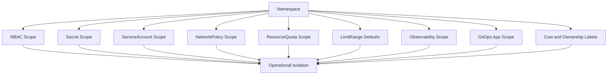
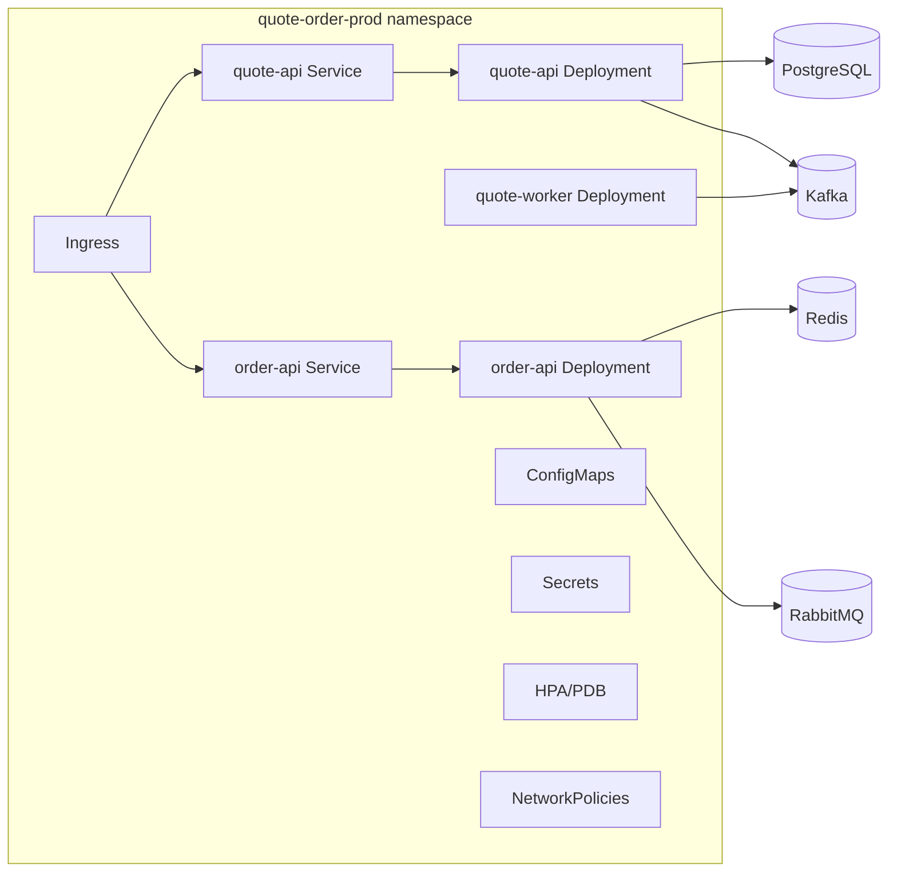
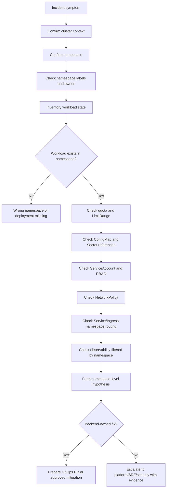

# Part 006 — Namespace Operations

> Namespace adalah salah satu boundary operasional paling penting di Kubernetes. Untuk backend engineer, namespace bukan sekadar folder logis. Namespace menentukan scope akses, secret, service discovery, network policy, quota, observability, ownership, dan blast radius.

Dalam production enterprise, namespace sering menjadi batas antara environment, team, application group, platform component, atau domain capability. Salah memahami namespace dapat menyebabkan investigasi salah target, akses secret yang keliru, service discovery gagal, NetworkPolicy tidak bekerja, quota menolak deployment, atau alert/dashboard tercampur.

Part ini membahas namespace dari sudut pandang senior backend engineer yang mengoperasikan Java/JAX-RS service di Kubernetes, terutama dalam konteks microservices, CPQ/quote/order lifecycle, PostgreSQL, Kafka, RabbitMQ, Redis, Camunda, NGINX/Ingress, AWS/Azure, GitOps, dan production operations.

---

## 1. Core Concept

Namespace adalah mekanisme Kubernetes untuk mempartisi object namespaced dalam satu cluster.

Object namespaced misalnya:

- Pod
- Deployment
- ReplicaSet
- Service
- ConfigMap
- Secret
- ServiceAccount
- Role
- RoleBinding
- NetworkPolicy
- ResourceQuota
- LimitRange
- HPA
- PDB
- Job/CronJob

Object cluster-scoped misalnya:

- Node
- Namespace
- PersistentVolume
- ClusterRole
- ClusterRoleBinding
- StorageClass
- IngressClass
- CustomResourceDefinition

Karena namespace bukan cluster penuh, ia tidak otomatis memberi isolasi sempurna. Isolasi aktual bergantung pada kombinasi:

- RBAC
- NetworkPolicy
- ResourceQuota
- LimitRange
- admission policy
- service account design
- secret management
- observability partitioning
- naming/labeling convention
- platform governance

---

## 2. Namespace as Operational Boundary

Namespace biasanya dipakai untuk satu atau beberapa boundary berikut.

### 2.1 Environment boundary

Contoh:

- `quote-order-dev`
- `quote-order-test`
- `quote-order-staging`
- `quote-order-prod`

Kelebihan:

- mudah membedakan environment
- RBAC bisa dibatasi per environment
- secret/config scope jelas
- quota bisa berbeda antar environment

Risiko:

- namespace dev/test/prod dalam cluster yang sama tetap berbagi control plane dan node pool jika tidak dipisahkan
- salah context/namespace bisa berbahaya
- NetworkPolicy harus benar untuk mencegah cross-env access

### 2.2 Team boundary

Contoh:

- `team-quote`
- `team-order`
- `team-billing-integration`
- `team-platform`

Kelebihan:

- ownership jelas
- RBAC per team
- cost allocation lebih mudah

Risiko:

- satu namespace bisa berisi banyak environment jika naming buruk
- dependency antar team bisa tidak terlihat
- service discovery dan network policy perlu disiplin

### 2.3 Application/domain boundary

Contoh:

- `cpq`
- `quote-management`
- `order-management`
- `billing-integration`
- `workflow-orchestration`

Kelebihan:

- service map per domain lebih mudah
- criticality dan dependency dapat dikelola per domain

Risiko:

- environment harus ditandai lewat label atau cluster terpisah
- namespace terlalu besar bisa sulit dioperasikan

### 2.4 Platform boundary

Contoh:

- `ingress-nginx`
- `cert-manager`
- `external-secrets`
- `argocd`
- `monitoring`
- `logging`

Backend engineer biasanya tidak owner namespace ini, tetapi perlu tahu keberadaannya untuk debugging.

---

## 3. Namespace Is Not Security by Itself

Namespace memberi scope object, tetapi bukan sandbox keamanan lengkap.

Tanpa RBAC, user/service bisa saja membaca object lintas namespace.
Tanpa NetworkPolicy, pod di satu namespace bisa saja mengakses pod/service namespace lain.
Tanpa quota, satu namespace bisa mengonsumsi kapasitas berlebihan.
Tanpa admission policy, workload tidak aman bisa tetap dijalankan.

Isolasi namespace harus dilihat sebagai composition:



---

## 4. Namespace Naming Convention

Namespace name harus membantu manusia memahami environment, domain, dan ownership.

Contoh pola:

```text
<domain>-<env>
<team>-<domain>-<env>
<product>-<capability>-<env>
```

Contoh:

```text
quote-order-prod
quote-order-staging
cpq-catalog-prod
billing-integration-prod
workflow-camunda-prod
```

### 4.1 Naming yang buruk

```text
prod
backend
services
java-apps
team-a
new-prod
prod2
```

Masalahnya:

- tidak jelas owner
- tidak jelas domain
- rawan salah target
- sulit cost allocation
- sulit observability filtering
- sulit incident communication

### 4.2 Naming yang baik

Namespace yang baik menjawab:

- Environment apa?
- Domain atau capability apa?
- Team owner siapa?
- Apakah production?
- Apakah shared/platform?

---

## 5. Namespace Labels and Annotations

Namespace sebaiknya memiliki metadata untuk governance dan observability.

Contoh label:

```yaml
apiVersion: v1
kind: Namespace
metadata:
  name: quote-order-prod
  labels:
    environment: prod
    domain: quote-order
    owner-team: quote-order-backend
    criticality: tier-1
    cost-center: csg-quote-order
    data-classification: confidential
  annotations:
    runbook.url: "https://internal.example/runbooks/quote-order"
    service-catalog.url: "https://internal.example/catalog/quote-order"
```

### 5.1 Operational value

Label/annotation namespace membantu:

- dashboard filtering
- alert routing
- cost allocation
- compliance classification
- policy enforcement
- escalation
- service catalog integration

### 5.2 Backend engineer responsibility

Backend engineer tidak selalu membuat namespace, tetapi harus memastikan workload yang dimiliki berada di namespace dengan metadata benar.

---

## 6. Namespace and Service Discovery

Service DNS default mengikuti namespace.

Format umum:

```text
<service>.<namespace>.svc.cluster.local
```

Dari pod dalam namespace yang sama, service bisa dipanggil dengan:

```text
http://<service>
```

Dari namespace lain:

```text
http://<service>.<namespace>
```

atau FQDN:

```text
http://<service>.<namespace>.svc.cluster.local
```

### 6.1 Failure mode

| Failure | Contoh penyebab |
|---|---|
| Wrong namespace | App memanggil `postgres` di namespace sendiri, padahal service ada di namespace lain |
| Ambiguous short name | Service name sama di beberapa namespace |
| Hardcoded namespace | Config staging terbawa ke prod |
| DNS search behavior | `ndots` menyebabkan lookup tidak sesuai ekspektasi |
| NetworkPolicy blocks cross-namespace | DNS resolve sukses tetapi koneksi timeout |

### 6.2 Backend impact

Untuk Java/JAX-RS service, namespace mistake bisa muncul sebagai:

- DB connection timeout
- Kafka bootstrap server tidak resolve
- RabbitMQ hostname wrong
- Redis connection refused
- Camunda endpoint salah
- HTTP dependency 404/timeout

---

## 7. Namespace and RBAC Scope

RBAC namespaced biasanya memakai Role dan RoleBinding.

Contoh Role read-only:

```yaml
apiVersion: rbac.authorization.k8s.io/v1
kind: Role
metadata:
  name: workload-reader
  namespace: quote-order-prod
rules:
  - apiGroups: [""]
    resources: ["pods", "services", "endpoints", "events", "configmaps"]
    verbs: ["get", "list", "watch"]
  - apiGroups: ["apps"]
    resources: ["deployments", "replicasets"]
    verbs: ["get", "list", "watch"]
```

RoleBinding mengikat subject ke Role di namespace tersebut.

### 7.1 Operational concern

Backend engineer perlu tahu:

- Apakah punya read-only access ke namespace production?
- Apakah boleh melihat ConfigMap?
- Apakah boleh melihat Secret metadata?
- Apakah boleh `logs`?
- Apakah boleh `exec`?
- Apakah boleh `port-forward`?
- Apakah boleh restart/scale/rollback?

### 7.2 Common RBAC failure

```bash
Error from server (Forbidden): pods is forbidden: User "..." cannot list resource "pods" in API group "" in the namespace "quote-order-prod"
```

Interpretasi:

- ini bukan bug aplikasi
- ini bukan pod failure
- ini access policy
- eskalasi ke owner RBAC/platform/security sesuai proses

---

## 8. Namespace and Secret Scope

Secret bersifat namespaced. Pod hanya bisa mereferensikan Secret di namespace yang sama.

Contoh:

```yaml
apiVersion: apps/v1
kind: Deployment
metadata:
  name: quote-api
  namespace: quote-order-prod
spec:
  template:
    spec:
      containers:
        - name: app
          image: example/quote-api:1.2.3
          envFrom:
            - secretRef:
                name: quote-api-db-secret
```

Secret `quote-api-db-secret` harus ada di namespace `quote-order-prod`.

### 8.1 Failure mode

- Secret tidak ada di namespace target
- Secret ada tetapi key hilang
- Secret stale setelah rotation
- ExternalSecret gagal sync
- Secret name sama di namespace berbeda tetapi value berbeda
- Pod tidak restart setelah secret update
- RBAC terlalu luas sehingga secret bisa dibaca pihak tidak perlu

### 8.2 Backend impact

Aplikasi Java bisa gagal startup karena:

- missing env var
- invalid DB password
- invalid Kafka/RabbitMQ credential
- TLS truststore password salah
- OAuth/client secret stale

---

## 9. Namespace and ConfigMap Scope

ConfigMap juga namespaced. Banyak incident terjadi karena config environment salah.

Contoh failure:

- ConfigMap staging dipakai di prod
- endpoint dependency mengarah ke namespace salah
- feature flag environment salah
- timeout berbeda dari ekspektasi
- config update tidak menyebabkan pod restart

### 9.1 Safe review

```bash
kubectl get configmap -n <namespace>
kubectl describe configmap <name> -n <namespace>
```

Hati-hati saat menampilkan isi ConfigMap jika berisi endpoint internal sensitif atau data konfigurasi yang tidak boleh dibagikan.

### 9.2 GitOps concern

Jika ConfigMap berasal dari Helm/Kustomize/GitOps, runtime object harus dibandingkan dengan rendered manifest, bukan diedit manual.

---

## 10. ResourceQuota Operations

ResourceQuota membatasi total resource dalam namespace.

Contoh:

```yaml
apiVersion: v1
kind: ResourceQuota
metadata:
  name: compute-quota
  namespace: quote-order-prod
spec:
  hard:
    requests.cpu: "20"
    requests.memory: 64Gi
    limits.cpu: "40"
    limits.memory: 128Gi
    pods: "100"
```

### 10.1 Melihat quota

```bash
kubectl get quota -n <namespace>
kubectl describe quota -n <namespace>
```

### 10.2 Failure mode

Deployment bisa gagal membuat pod jika quota terlampaui.

Gejala:

- ReplicaSet gagal create pod
- pod tidak muncul
- event quota exceeded
- rollout stuck

Contoh event:

```text
Error creating: pods "quote-api-..." is forbidden: exceeded quota: compute-quota
```

### 10.3 Backend impact

Untuk backend service:

- rollout gagal karena request resource naik
- HPA tidak bisa scale karena quota
- canary tidak bisa menambah pod
- batch job tidak bisa start
- incident mitigation scale-out gagal

### 10.4 Trade-off

Quota melindungi cluster dari satu namespace yang mengambil semua resource, tetapi quota yang terlalu ketat bisa menghambat recovery saat traffic spike.

---

## 11. LimitRange Operations

LimitRange memberi default/min/max resource untuk container/pod di namespace.

Contoh:

```yaml
apiVersion: v1
kind: LimitRange
metadata:
  name: default-container-limits
  namespace: quote-order-prod
spec:
  limits:
    - type: Container
      defaultRequest:
        cpu: "250m"
        memory: "512Mi"
      default:
        cpu: "1"
        memory: "1Gi"
      min:
        cpu: "100m"
        memory: "256Mi"
      max:
        cpu: "4"
        memory: "8Gi"
```

### 11.1 Melihat LimitRange

```bash
kubectl get limitrange -n <namespace>
kubectl describe limitrange -n <namespace>
```

### 11.2 Failure mode

- container tanpa resources mendapat default yang tidak cocok
- request terlalu kecil menyebabkan CPU starvation
- limit terlalu kecil menyebabkan OOMKilled
- max limit menolak deployment Java service besar
- default CPU limit menyebabkan throttling tidak disadari

### 11.3 Backend impact untuk Java

Java service perlu sizing eksplisit. Jangan mengandalkan default LimitRange tanpa memahami JVM heap, native memory, thread stack, direct memory, dan GC behavior.

---

## 12. Namespace and NetworkPolicy Scope

NetworkPolicy bersifat namespaced, tetapi bisa memilih namespace lain via `namespaceSelector`.

Default deny sering diterapkan per namespace.

Contoh default deny ingress:

```yaml
apiVersion: networking.k8s.io/v1
kind: NetworkPolicy
metadata:
  name: default-deny-ingress
  namespace: quote-order-prod
spec:
  podSelector: {}
  policyTypes:
    - Ingress
```

Contoh egress allow DNS:

```yaml
apiVersion: networking.k8s.io/v1
kind: NetworkPolicy
metadata:
  name: allow-dns-egress
  namespace: quote-order-prod
spec:
  podSelector: {}
  policyTypes:
    - Egress
  egress:
    - to:
        - namespaceSelector:
            matchLabels:
              kubernetes.io/metadata.name: kube-system
      ports:
        - protocol: UDP
          port: 53
        - protocol: TCP
          port: 53
```

### 12.1 Failure mode

- service resolves DNS but TCP timeout
- DNS egress blocked
- pod label tidak match policy
- namespace label berubah
- DB/broker/cloud endpoint tidak di-allow
- ingress controller tidak boleh reach backend

### 12.2 Backend impact

Aplikasi akan melihat:

- connection timeout
- intermittent dependency failure
- startup readiness gagal
- Kafka/RabbitMQ/Redis reconnect loop
- HTTP client timeout

NetworkPolicy failure sering terlihat seperti dependency outage, padahal policy change adalah root cause.

---

## 13. Namespace and ServiceAccount

ServiceAccount namespaced. Workload harus memakai ServiceAccount yang benar, bukan default tanpa kontrol.

Contoh:

```yaml
apiVersion: apps/v1
kind: Deployment
metadata:
  name: quote-api
  namespace: quote-order-prod
spec:
  template:
    spec:
      serviceAccountName: quote-api-sa
      automountServiceAccountToken: false
```

Jika workload perlu akses Kubernetes API atau cloud identity, ServiceAccount menjadi critical.

### 13.1 EKS/AKS impact

Di EKS, ServiceAccount bisa dihubungkan dengan IRSA.
Di AKS, ServiceAccount bisa dihubungkan dengan Azure Workload Identity.

Namespace yang salah berarti:

- annotation tidak ditemukan
- federated credential tidak match
- cloud IAM denied
- secret manager/key vault access gagal

---

## 14. Namespace and Ingress

Ingress umumnya namespaced. Ia mereferensikan Service di namespace yang sama, kecuali menggunakan pattern/controller khusus.

Operational concern:

- host/path routing berada di namespace mana?
- TLS secret berada di namespace mana?
- ingress controller berada di namespace platform mana?
- backend service berada di namespace yang sama?
- apakah route ownership jelas?

Failure mode:

- Ingress menunjuk service yang salah
- TLS secret missing di namespace
- duplicate host/path antar namespace
- annotation salah
- ingress class salah
- route tidak diproses controller

---

## 15. Namespace and Observability

Observability harus bisa difilter per namespace.

Minimal dashboard/filter:

- namespace
- service/workload
- environment
- team
- version/revision
- pod
- node

### 15.1 Logs

Log query harus selalu include namespace saat investigasi:

```text
namespace="quote-order-prod" AND app="quote-api"
```

### 15.2 Metrics

Metrics Kubernetes umumnya punya label namespace:

- pod CPU/memory
- restart count
- pod readiness
- deployment availability
- HPA status
- ingress metrics

### 15.3 Traces

Trace service name harus bisa dikaitkan ke namespace/deployment version. Jika tidak, cross-environment confusion bisa terjadi.

### 15.4 Alert routing

Alert tanpa namespace sering sulit ditindaklanjuti.

Alert yang baik menyertakan:

- namespace
- service
- environment
- owner team
- severity
- runbook
- dashboard link

---

## 16. Namespace and Cost Allocation

Namespace sering menjadi basis cost allocation.

Cost drivers:

- CPU request
- memory request
- persistent volume
- load balancer
- NAT/egress
- logs volume
- metrics cardinality
- idle replicas
- overprovisioned batch workers

Backend engineer harus sadar bahwa menaikkan request/replica/HPA max di namespace production bisa memengaruhi cost.

Label namespace seperti `cost-center`, `owner-team`, dan `environment` membantu FinOps.

---

## 17. Namespace and GitOps

Dalam GitOps, namespace sering menjadi target aplikasi.

Contoh struktur:

```text
gitops/
  apps/
    quote-api/
      base/
      overlays/
        dev/
        staging/
        prod/
```

atau:

```text
clusters/
  prod-cluster/
    quote-order-prod/
      quote-api.yaml
      order-api.yaml
```

### 17.1 Failure mode

- manifest deploy ke namespace salah
- overlay environment salah
- namespace belum ada
- quota/LimitRange tidak ikut dikelola GitOps
- manual namespace label drift
- Argo CD app target namespace salah
- Helm release namespace mismatch

### 17.2 Operational rule

Runtime namespace harus bisa ditelusuri balik ke GitOps source.

Jika tidak, sulit melakukan audit, rollback, dan root cause analysis.

---

## 18. Namespace Inventory Workflow

Saat masuk ke cluster atau service baru, lakukan inventory namespace.

```bash
kubectl get ns --show-labels
kubectl get all -n <namespace>
kubectl get deploy,sts,job,cronjob,svc,ingress,hpa,pdb -n <namespace>
kubectl get quota,limitrange,networkpolicy,role,rolebinding,serviceaccount -n <namespace>
kubectl get configmap,secret -n <namespace>
```

Untuk production, hindari menampilkan isi secret.

### 18.1 Service map per namespace



Tujuannya bukan menggambar sempurna, tetapi memahami apa yang hidup dalam namespace dan apa dependency keluar namespace/cluster.

---

## 19. Namespace Failure Modes

### 19.1 Wrong namespace during incident

Gejala:

- command tidak menemukan pod
- logs tampak normal padahal alert production
- rollout status service lain yang dilihat

Mitigasi:

- selalu eksplisit `-n <namespace>`
- gunakan context prompt/kubens dengan hati-hati
- cross-check environment label

### 19.2 ResourceQuota blocks rollout

Gejala:

- Deployment updated tetapi pod baru tidak muncul
- ReplicaSet event quota exceeded
- rollout stuck

Mitigasi:

- cek quota usage
- kurangi maxSurge sementara jika authorized
- minta quota increase ke platform
- review resource request

### 19.3 LimitRange injects unsafe defaults

Gejala:

- pod punya CPU/memory limit padahal manifest tidak eksplisit
- Java service OOMKilled atau throttled

Mitigasi:

- set explicit resources
- review namespace LimitRange
- align JVM flags dengan limit

### 19.4 Secret exists in wrong namespace

Gejala:

- pod FailedMount
- env var missing
- app startup failure

Mitigasi:

- cek secret name di namespace target
- cek ExternalSecret sync
- jangan copy secret manual tanpa process

### 19.5 NetworkPolicy namespace selector mismatch

Gejala:

- deployment sehat tetapi dependency timeout
- hanya satu environment yang gagal
- policy recently changed

Mitigasi:

- cek namespace labels
- cek pod labels
- cek egress/ingress policy
- eskalasi ke security/platform jika perlu

---

## 20. Java/JAX-RS Operational Relevance

Namespace memengaruhi Java/JAX-RS runtime melalui:

- env var dari ConfigMap/Secret
- service DNS untuk dependency
- RBAC/ServiceAccount untuk cloud SDK
- NetworkPolicy untuk DB/broker/cache access
- quota untuk rollout/HPA
- LimitRange untuk JVM memory/CPU
- observability label untuk logs/metrics/traces

Contoh issue nyata:

```text
Symptom:
  quote-api returns 500 after deployment.

Kubernetes state:
  Pods Ready = 3/3.
  Deployment Available = true.
  Logs show PostgreSQL connection timeout.

Namespace-level cause:
  New NetworkPolicy in quote-order-prod allows egress to Redis and Kafka, but not PostgreSQL private endpoint.

Operational lesson:
  Pod Ready does not imply dependency path allowed. Namespace policy can break service after rollout.
```

---

## 21. PostgreSQL, Kafka, RabbitMQ, Redis, and Camunda Namespace Concerns

### 21.1 PostgreSQL

Cek:

- DB endpoint config berasal dari ConfigMap/Secret namespace mana
- NetworkPolicy egress ke DB
- credential Secret namespace target
- connection pool per pod vs quota/HPA
- private endpoint DNS

### 21.2 Kafka

Cek:

- bootstrap server config
- TLS/credential Secret
- NetworkPolicy egress broker
- namespace label untuk consumer observability
- HPA/KEDA object di namespace yang sama

### 21.3 RabbitMQ

Cek:

- queue endpoint Secret/ConfigMap
- egress policy
- consumer replicas dalam namespace
- alert queue depth routing ke owner namespace

### 21.4 Redis

Cek:

- Redis endpoint/password namespace
- NetworkPolicy
- secret rotation
- cache namespace/key prefix environment

### 21.5 Camunda

Cek:

- worker namespace
- Camunda endpoint config
- worker identity
- process incident dashboard filtering by namespace/service

---

## 22. EKS/AKS/On-Prem Namespace Awareness

### 22.1 EKS

Namespace dapat terkait dengan:

- IRSA ServiceAccount annotation
- AWS Load Balancer Controller ingress ownership
- security groups for pods awareness
- ECR image pull secret/policy
- VPC CNI pod IP consumption by namespace workload
- CloudWatch/container insights namespace filter

### 22.2 AKS

Namespace dapat terkait dengan:

- Azure Workload Identity federated credential
- ACR pull integration
- Application Gateway Ingress Controller routing
- Azure Monitor namespace filter
- Key Vault CSI SecretProviderClass
- Azure Policy enforcement

### 22.3 On-prem/hybrid

Namespace dapat terkait dengan:

- corporate DNS policy
- proxy/NO_PROXY config
- internal CA Secret/ConfigMap
- firewall allowlist per namespace/workload label
- air-gapped registry pull config
- internal load balancer routing

---

## 23. Namespace Review Checklist

Gunakan checklist ini saat mereview namespace service.

### Identity and ownership

- [ ] Namespace name jelas menunjukkan environment/domain/team.
- [ ] Namespace punya label environment.
- [ ] Namespace punya owner/team label.
- [ ] Namespace punya criticality/tier label.
- [ ] Namespace punya cost-center label jika diperlukan.
- [ ] Runbook/service catalog link tersedia.

### Workload inventory

- [ ] Semua Deployment/StatefulSet/Job/CronJob teridentifikasi.
- [ ] Semua Service/Ingress teridentifikasi.
- [ ] Owner tiap workload jelas.
- [ ] Critical workload ditandai.
- [ ] Dependency keluar namespace/cluster terdokumentasi.

### RBAC and access

- [ ] Backend engineer punya read-only access yang sesuai.
- [ ] `exec`, `debug`, `port-forward` policy jelas.
- [ ] ServiceAccount workload bukan default tanpa alasan.
- [ ] Role/RoleBinding tidak terlalu luas.
- [ ] ClusterRoleBinding dipakai hanya bila benar-benar perlu.

### Config and secret

- [ ] ConfigMap source jelas.
- [ ] Secret source jelas.
- [ ] ExternalSecret/CSI integration jelas jika ada.
- [ ] Secret rotation behavior diketahui.
- [ ] Config/Secret update memicu restart/reload sesuai desain.

### Resource governance

- [ ] ResourceQuota ada dan sesuai kapasitas workload.
- [ ] LimitRange tidak memberi default berbahaya untuk Java service.
- [ ] HPA max replica tidak melebihi quota.
- [ ] Batch/CronJob tidak bisa menghabiskan quota tanpa kontrol.

### Network and security

- [ ] Default deny policy diketahui.
- [ ] DNS egress diizinkan jika egress default deny.
- [ ] DB/broker/cache/cloud egress diizinkan secara minimal.
- [ ] Ingress controller dapat mencapai backend service.
- [ ] Namespace labels dipakai NetworkPolicy dengan benar.

### Observability

- [ ] Logs bisa difilter per namespace.
- [ ] Metrics bisa difilter per namespace.
- [ ] Traces mencakup service/environment/namespace.
- [ ] Alerts menyertakan namespace dan owner.
- [ ] Dashboard namespace tersedia.

### GitOps

- [ ] Namespace dikelola GitOps atau proses governance jelas.
- [ ] Target namespace di Argo CD/Flux/Helm/Kustomize benar.
- [ ] Manual drift terdeteksi.
- [ ] Rendered manifest bisa dibandingkan dengan runtime.

---

## 24. Incident Debugging Flow: Namespace Suspected



---

## 25. Namespace Anti-Patterns

### 25.1 One giant namespace for everything

Masalah:

- blast radius besar
- RBAC sulit
- network policy rumit
- dashboard noisy
- ownership kabur

### 25.2 Namespace per microservice secara ekstrem

Masalah:

- overhead governance tinggi
- network policy kompleks
- service discovery verbose
- GitOps sprawl

Gunakan namespace boundary yang seimbang: cukup granular untuk ownership/isolation, tidak terlalu granular sampai operasionalnya berat.

### 25.3 Default namespace dipakai untuk production

Ini hampir selalu red flag. Production workload harus punya namespace eksplisit dengan ownership dan policy.

### 25.4 Secret disalin manual antar namespace

Ini menciptakan drift, audit gap, dan rotation failure. Gunakan proses secret management yang approved.

### 25.5 Namespace label berubah tanpa impact analysis

Jika NetworkPolicy, cost allocation, alert routing, atau admission policy memakai namespace label, perubahan label bisa berdampak besar.

---

## 26. Backend Engineer Responsibility

Backend engineer bertanggung jawab untuk:

- memahami namespace tempat workload berjalan
- memastikan manifest deploy ke namespace benar
- memastikan config/secret reference benar
- memastikan resource request/limit cocok dengan quota dan LimitRange
- memahami service discovery antar namespace
- membaca NetworkPolicy impact ke dependency
- memastikan observability bisa difilter per namespace
- menyertakan namespace dalam runbook dan alert
- tidak melakukan manual changes yang menciptakan drift

Backend engineer biasanya tidak bertanggung jawab penuh untuk:

- membuat cluster-wide namespace governance
- mengelola CNI
- mengelola admission controller
- membuat policy security global
- mengubah cluster RBAC global
- mengelola node pool capacity global

Tetapi backend engineer harus bisa berdiskusi dengan evidence.

---

## 27. Platform/SRE/Security Responsibility

Biasanya platform/SRE/security bertanggung jawab atas:

- namespace creation policy
- RBAC baseline
- quota/LimitRange baseline
- admission policy
- NetworkPolicy standard
- GitOps namespace bootstrap
- observability namespace integration
- audit log
- cluster capacity
- platform namespaces
- security exception process

Boundary ini harus diverifikasi di internal team, bukan diasumsikan.

---

## 28. Production Readiness Questions

Sebelum service dianggap production-ready, jawab:

- Namespace production apa?
- Siapa owner namespace?
- Apa criticality namespace?
- Apakah namespace punya quota?
- Apakah HPA max bisa berjalan dalam quota?
- Apakah LimitRange memberi default resource?
- Apakah Java service punya explicit resources?
- Apakah secret/config berasal dari source yang benar?
- Apakah NetworkPolicy mengizinkan dependency minimal?
- Apakah ServiceAccount benar?
- Apakah workload identity benar untuk cloud access?
- Apakah ingress/service berada di namespace yang benar?
- Apakah observability bisa difilter per namespace?
- Apakah alert route ke owner namespace?
- Apakah runbook menyebut namespace eksplisit?

---

## 29. Internal Verification Checklist

Verifikasi di internal CSG/team, jangan diasumsikan:

### Namespace design

- [ ] Apakah namespace dipisah per environment, team, domain, atau application?
- [ ] Apakah prod/staging/dev berada di cluster yang sama atau berbeda?
- [ ] Apakah ada naming convention resmi?
- [ ] Apakah ada standard label namespace?
- [ ] Apakah ada criticality/tier classification?

### Access and RBAC

- [ ] Role apa yang dimiliki backend engineer di namespace dev/staging/prod?
- [ ] Apakah read-only production access tersedia?
- [ ] Siapa yang boleh `exec`, `debug`, `port-forward`?
- [ ] Bagaimana request permission tambahan?

### Resource governance

- [ ] ResourceQuota apa yang berlaku?
- [ ] LimitRange apa yang berlaku?
- [ ] Apakah quota cukup untuk HPA max dan rollout maxSurge?
- [ ] Siapa owner quota increase?

### Network and dependency

- [ ] Apakah default deny NetworkPolicy diterapkan?
- [ ] Bagaimana policy egress ke PostgreSQL/Kafka/RabbitMQ/Redis/Camunda?
- [ ] Bagaimana policy ke AWS/Azure services?
- [ ] Apakah namespace label dipakai untuk policy selection?

### Config and secret

- [ ] Secret dikelola native Kubernetes, External Secrets, CSI, Vault, AWS Secrets Manager, Azure Key Vault, atau mekanisme lain?
- [ ] Bagaimana secret rotation dilakukan?
- [ ] Apakah pod restart otomatis setelah secret/config berubah?
- [ ] Siapa owner config per environment?

### GitOps and deployment

- [ ] Namespace dikelola oleh GitOps?
- [ ] Di repo mana namespace dan workload manifest berada?
- [ ] Apakah Argo CD/Flux app target namespace benar?
- [ ] Bagaimana drift dideteksi?

### Observability and incident

- [ ] Dashboard namespace tersedia?
- [ ] Alert menyertakan namespace?
- [ ] Log/trace/metrics punya label namespace?
- [ ] Incident runbook menyebut namespace?
- [ ] Apakah incident notes historis bisa dicari per namespace?

---

## 30. PR Review Checklist for Namespace-Related Changes

Saat PR menyentuh namespace, cek:

- [ ] Apakah namespace target benar?
- [ ] Apakah namespace baru mengikuti naming convention?
- [ ] Apakah label/annotation namespace lengkap?
- [ ] Apakah ResourceQuota/LimitRange sesuai workload?
- [ ] Apakah NetworkPolicy baseline ada?
- [ ] Apakah RBAC baseline ada?
- [ ] Apakah ServiceAccount workload benar?
- [ ] Apakah ConfigMap/Secret reference berada di namespace yang sama?
- [ ] Apakah Ingress/Service route namespace benar?
- [ ] Apakah HPA/PDB berada di namespace yang sama dengan workload?
- [ ] Apakah GitOps target namespace benar?
- [ ] Apakah dashboard/alert/runbook sudah siap?
- [ ] Apakah cost/owner labels ada?

---

## 31. Key Takeaways

Namespace adalah boundary operasional yang memengaruhi hampir semua aspek Kubernetes production operations:

- akses
- secret
- config
- service discovery
- routing
- network policy
- quota
- resource defaults
- identity
- observability
- alerting
- cost
- GitOps
- incident response

Untuk backend engineer, kemampuan membaca namespace dengan benar mengurangi risiko salah diagnosis dan salah tindakan. Saat service Java/JAX-RS gagal di Kubernetes, namespace bisa menjadi bagian root cause: wrong config, missing secret, blocked egress, quota exceeded, LimitRange default, RBAC denied, atau observability filter yang salah.

Prinsip penting:

- selalu eksplisit namespace
- jangan anggap namespace sebagai security boundary lengkap
- pahami quota dan LimitRange sebelum tuning resource/HPA
- pahami NetworkPolicy sebelum menyalahkan dependency
- pastikan config/secret berada di namespace yang benar
- pastikan observability dan alert menyertakan namespace
- verifikasi boundary internal, jangan mengarang topology

Di part berikutnya, kita akan masuk ke **Labels, Annotations, and Ownership Metadata**: bagaimana metadata menjadi control plane operasional untuk selector, ownership, versioning, observability, cost, compliance, dan debugging.
