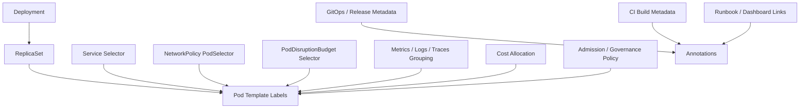
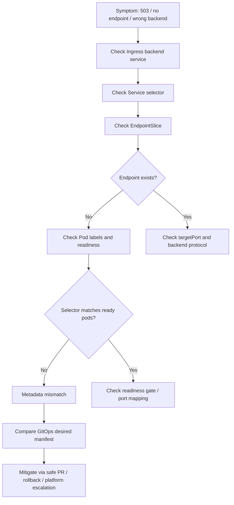

# Part 007 — Labels, Annotations, and Ownership Metadata

> Di Kubernetes production, metadata bukan kosmetik. Label dan annotation menentukan routing internal, rollout behavior, dashboard grouping, alert ownership, cost allocation, policy enforcement, auditability, dan kemampuan tim untuk menemukan service yang benar saat incident.

Banyak outage Kubernetes terlihat seperti masalah aplikasi, padahal akar masalahnya adalah metadata yang salah: selector tidak match, Service menunjuk pod yang salah, dashboard mencampur environment, HPA membaca workload yang keliru, NetworkPolicy tidak match, atau GitOps tidak bisa mengaitkan object dengan release yang benar.

Untuk senior backend engineer, label dan annotation harus diperlakukan sebagai **operational contract** antara aplikasi, Kubernetes control plane, platform/SRE, observability, security, compliance, GitOps, dan cost management.

Part ini membahas metadata dari sudut pandang backend service owner untuk Java/JAX-RS/Jakarta RESTful services, Kafka/RabbitMQ consumers, Redis-backed services, Camunda workers, batch jobs, NGINX/Ingress routing, GitOps/IaC, EKS, AKS, dan hybrid Kubernetes operations.

---

## 1. Core Concept

Kubernetes menyediakan dua bentuk metadata utama pada object:

- **label**: key-value metadata yang dapat dipakai untuk selection, grouping, filtering, routing, ownership, policy, metrics, dan automation.
- **annotation**: key-value metadata untuk informasi non-selector, biasanya lebih panjang, detail, tool-specific, atau audit-oriented.

Perbedaan paling penting:

| Metadata | Dipakai untuk selector? | Cocok untuk | Risiko utama |
|---|---:|---|---|
| Label | Ya | grouping, routing, ownership, policy, observability, cost | salah selector dapat merusak traffic dan policy |
| Annotation | Tidak | deployment metadata, Git commit, checksum, tool hints, runbook link, audit note | terlalu bebas, mudah jadi tempat informasi sensitif |

Rule sederhana:

> Gunakan label untuk metadata yang harus bisa dicari, dikelompokkan, dipilih, atau dipakai automation. Gunakan annotation untuk metadata informatif yang tidak boleh memengaruhi selection.

---

## 2. Why Metadata Matters Operationally

Metadata memengaruhi banyak jalur operasi production.

### 2.1 Traffic routing

Service memilih Pod menggunakan selector.

Jika selector salah:

- Service tidak punya endpoint
- Service mengarah ke pod versi lama
- Service mengarah ke pod aplikasi lain
- Ingress menghasilkan 503
- request masuk ke backend yang salah

### 2.2 Rollout and rollback

Deployment membuat ReplicaSet berdasarkan Pod template. Metadata di pod template ikut menentukan hash ReplicaSet.

Jika label/annotation berubah tidak sengaja:

- rollout terjadi tanpa perubahan image
- ReplicaSet baru dibuat hanya karena metadata churn
- rollback membingungkan karena revision history noisy
- GitOps terus mendeteksi drift

### 2.3 Observability grouping

Dashboard dan alert sering mengelompokkan data berdasarkan label seperti:

- `app`
- `service`
- `component`
- `team`
- `environment`
- `version`
- `namespace`

Jika label tidak konsisten:

- dashboard service hilang
- alert tidak punya owner
- error rate tercampur antar environment
- latency aggregate salah
- deployment marker tidak match workload

### 2.4 Security policy

NetworkPolicy, admission policy, resource policy, dan RBAC helper tooling sering bergantung pada label.

Jika label salah:

- traffic penting terblokir
- traffic tidak seharusnya malah terbuka
- workload lolos dari security policy
- exception policy tidak terdeteksi

### 2.5 Cost and compliance

FinOps dan compliance dashboard biasanya perlu label:

- owner
- team
- domain
- environment
- cost center
- data classification
- criticality

Tanpa metadata ini, workload menjadi orphaned runtime object: berjalan, memakan biaya, tetapi tidak jelas siapa pemiliknya.

---

## 3. Label vs Annotation Decision Rule

Gunakan decision rule berikut.

### 3.1 Gunakan label untuk

- app/service identity
- component identity
- team ownership
- environment
- version atau release track
- selector Service → Pod
- selector NetworkPolicy → Pod
- selector observability/dashboard
- cost allocation
- compliance classification
- criticality classification
- workload type

Contoh:

```yaml
metadata:
  labels:
    app.kubernetes.io/name: quote-api
    app.kubernetes.io/component: api
    app.kubernetes.io/part-of: quote-order
    app.kubernetes.io/managed-by: argocd
    app.kubernetes.io/version: "2026.07.11"
    company.io/team: quote-order
    company.io/environment: prod
    company.io/criticality: tier-1
    company.io/cost-center: csg-quote-order
```

### 3.2 Gunakan annotation untuk

- Git commit SHA
- build URL
- deployment timestamp
- runbook URL
- dashboard URL
- checksum config
- checksum secret reference
- GitOps sync wave
- deployment note
- generated-by tool
- operational hint untuk controller tertentu

Contoh:

```yaml
metadata:
  annotations:
    company.io/git-commit: "a1b2c3d4e5f6"
    company.io/build-url: "https://ci.example/build/12345"
    company.io/runbook: "https://internal.example/runbooks/quote-api"
    company.io/dashboard: "https://observability.example/d/quote-api"
    checksum/config: "sha256:..."
```

### 3.3 Jangan gunakan annotation untuk secret

Annotation sering terlihat di banyak tool:

- `kubectl describe`
- GitOps UI
- observability metadata
- audit export
- admission error
- manifest diff

Jangan menaruh:

- password
- token
- API key
- private key
- credential connection string
- customer data
- PII
- internal confidential incident detail

---

## 4. Kubernetes Recommended App Labels

Kubernetes memiliki convention label umum `app.kubernetes.io/*`.

Label yang paling berguna untuk workload backend:

| Label | Tujuan | Contoh |
|---|---|---|
| `app.kubernetes.io/name` | nama aplikasi/service | `quote-api` |
| `app.kubernetes.io/instance` | instance release | `quote-api-prod` |
| `app.kubernetes.io/version` | versi aplikasi | `2026.07.11-1` |
| `app.kubernetes.io/component` | komponen | `api`, `worker`, `consumer` |
| `app.kubernetes.io/part-of` | sistem/domain lebih besar | `quote-order` |
| `app.kubernetes.io/managed-by` | tool pengelola | `helm`, `argocd`, `flux` |
| `app.kubernetes.io/created-by` | creator/tool | `platform-template` |

Untuk enterprise operations, biasanya perlu label tambahan internal:

| Label internal | Tujuan |
|---|---|
| `company.io/team` | owner team |
| `company.io/domain` | business/domain capability |
| `company.io/environment` | dev/test/staging/prod |
| `company.io/criticality` | tier/classification |
| `company.io/cost-center` | FinOps allocation |
| `company.io/data-classification` | compliance/privacy |
| `company.io/runtime` | `java17`, `java21`, `node`, `go` |
| `company.io/workload-type` | `api`, `consumer`, `worker`, `batch` |

Gunakan prefix internal aktual sesuai standard organisasi. Jangan mengarang prefix internal CSG. Prefix di atas hanya contoh pattern.

---

## 5. Selector Invariants

Selector adalah bagian metadata yang paling berbahaya.

### 5.1 Selector harus stabil

Deployment selector tidak boleh berubah sembarangan.

Contoh:

```yaml
apiVersion: apps/v1
kind: Deployment
metadata:
  name: quote-api
spec:
  selector:
    matchLabels:
      app.kubernetes.io/name: quote-api
      app.kubernetes.io/component: api
  template:
    metadata:
      labels:
        app.kubernetes.io/name: quote-api
        app.kubernetes.io/component: api
```

Invariant:

- `spec.selector.matchLabels` harus match `spec.template.metadata.labels`
- Service selector harus match Pod labels
- NetworkPolicy selector harus match Pod labels yang benar
- PDB selector harus match workload yang benar
- HPA target harus match Deployment yang benar melalui scale target

### 5.2 Jangan pakai version label sebagai Service selector

Bad pattern:

```yaml
spec:
  selector:
    app.kubernetes.io/name: quote-api
    app.kubernetes.io/version: "2026.07.11"
```

Kenapa berbahaya:

- saat rollout versi baru, Service bisa kehilangan endpoint sementara
- rollback dapat memutus traffic
- canary/blue-green logic menjadi tidak eksplisit
- version berubah terlalu sering untuk selector stabil

Better pattern:

```yaml
spec:
  selector:
    app.kubernetes.io/name: quote-api
    app.kubernetes.io/component: api
```

Gunakan version label untuk observability dan release tracking, bukan selector Service normal.

### 5.3 Selector harus minimal tapi cukup spesifik

Selector terlalu luas:

```yaml
selector:
  app.kubernetes.io/part-of: quote-order
```

Risiko:

- Service dapat mengarah ke semua pod dalam sistem quote-order
- NetworkPolicy dapat mengizinkan terlalu banyak workload

Selector terlalu sempit:

```yaml
selector:
  app.kubernetes.io/name: quote-api
  app.kubernetes.io/component: api
  app.kubernetes.io/version: "2026.07.11"
  company.io/git-sha: "a1b2c3"
```

Risiko:

- endpoint hilang saat rollout
- policy tidak match setelah release
- maintenance sulit

Good selector biasanya memakai identity stabil:

```yaml
selector:
  app.kubernetes.io/name: quote-api
  app.kubernetes.io/component: api
```

---

## 6. Metadata Relationship Diagram



Operational reading:

- label adalah hubungan aktif antar object dan tool
- annotation adalah konteks tambahan untuk investigasi, audit, dan automation
- salah label dapat mengubah behavior runtime
- salah annotation biasanya mengubah traceability, bukan routing langsung

---

## 7. Ownership Metadata

Workload production harus menjawab pertanyaan ini tanpa harus bertanya ke banyak orang:

- siapa owner service ini?
- team mana yang on-call?
- domain apa yang terkena dampak?
- ini environment apa?
- service ini tier berapa?
- runbook-nya di mana?
- dashboard-nya di mana?
- release terakhir dari commit apa?
- siapa yang mengelola manifest-nya?
- apakah workload ini bagian dari quote/order/billing lifecycle?

Contoh metadata ownership:

```yaml
metadata:
  labels:
    app.kubernetes.io/name: quote-api
    app.kubernetes.io/component: api
    app.kubernetes.io/part-of: quote-order
    app.kubernetes.io/managed-by: argocd
    company.io/team: quote-order
    company.io/domain: cpq
    company.io/environment: prod
    company.io/criticality: tier-1
    company.io/workload-type: jaxrs-api
  annotations:
    company.io/runbook: "https://internal.example/runbooks/quote-api"
    company.io/dashboard: "https://internal.example/dashboards/quote-api"
    company.io/service-catalog: "https://internal.example/catalog/quote-api"
```

Dalam konteks CSG, detail actual label, URL, dan ownership harus diverifikasi secara internal. Jangan mengasumsikan nama namespace, team label, dashboard URL, atau runbook path.

---

## 8. Version and Release Metadata

Version metadata membantu menjawab:

- versi mana yang sedang berjalan?
- pod mana dari rollout baru?
- commit mana yang memperkenalkan issue?
- apakah semua replica sudah pakai image yang sama?
- apakah error rate naik setelah deployment tertentu?

Contoh:

```yaml
metadata:
  labels:
    app.kubernetes.io/version: "2026.07.11-rc.3"
  annotations:
    company.io/git-commit: "a1b2c3d4"
    company.io/git-branch: "main"
    company.io/build-number: "12345"
    company.io/deployed-at: "2026-07-11T10:15:00Z"
    company.io/deployed-by: "gitops-controller"
```

### 8.1 Deployment marker

Deployment marker di observability harus bisa dikaitkan dengan metadata workload.

Sinyal yang perlu match:

- namespace
- service name
- workload name
- version
- commit SHA
- environment
- deployment timestamp

Jika marker tidak match, incident timeline menjadi lemah.

### 8.2 Checksum annotation for rollout trigger

Untuk ConfigMap/Secret yang dikonsumsi sebagai env atau volume, banyak chart menggunakan checksum annotation agar perubahan config memicu rollout.

Contoh:

```yaml
spec:
  template:
    metadata:
      annotations:
        checksum/config: "{{ include (print $.Template.BasePath \"/configmap.yaml\") . | sha256sum }}"
```

Operational concern:

- checksum berubah → rollout terjadi
- checksum tidak berubah → pod bisa tetap memakai config lama
- secret rotation tanpa restart bisa membuat credential stale

---

## 9. Observability Metadata

Observability yang baik membutuhkan metadata konsisten.

### 9.1 Logs

Structured logs perlu membawa field yang bisa dikaitkan dengan Kubernetes metadata:

- service
- environment
- version
- pod name
- namespace
- trace ID
- correlation ID
- tenant/customer context jika aman dan sesuai policy

### 9.2 Metrics

Metrics harus bisa diaggregate berdasarkan:

- namespace
- workload
- pod
- service
- version
- team
- route/endpoint
- dependency

Label cardinality harus dikontrol. Jangan memasukkan high-cardinality value sembarangan ke metrics label, misalnya:

- request ID
- customer ID
- quote ID
- order ID
- email
- raw URL dengan ID dinamis

### 9.3 Traces

Trace metadata harus memudahkan filtering:

- service name
- deployment environment
- version
- namespace
- pod
- dependency target

Untuk Java/JAX-RS service, pastikan service name yang dikirim OpenTelemetry tidak berubah-ubah antar pod atau environment tanpa alasan.

---

## 10. Metadata Impact on Java/JAX-RS Backend

Metadata Kubernetes memengaruhi Java/JAX-RS service dalam beberapa cara.

### 10.1 Runtime identity

Service name di telemetry harus konsisten dengan metadata Kubernetes.

Contoh mismatch yang buruk:

- Kubernetes workload: `quote-api`
- OpenTelemetry service name: `quote-service-prod-v2`
- dashboard query: `quote_api`
- alert owner: `quote-order-api`

Akibatnya:

- log, metric, trace sulit digabung
- incident triage lambat
- ownership tidak jelas

### 10.2 Readiness and Service selector

Readiness hanya berguna jika Service selector memilih pod yang benar.

Jika selector salah:

- readiness pod bisa sehat
- tetapi service tetap no endpoint
- atau service mengarah ke pod lain yang readiness-nya tidak relevan

### 10.3 Release correlation

Saat latency JAX-RS endpoint naik setelah deployment, metadata version/commit membantu menjawab:

- apakah hanya pod versi baru yang lambat?
- apakah error terjadi pada satu ReplicaSet?
- apakah rollback benar-benar mengembalikan versi lama?

---

## 11. Metadata Impact on Dependencies

### 11.1 PostgreSQL

Metadata membantu menghubungkan:

- service owner
- DB connection pool owner
- DB credential secret
- DB dashboard
- query latency spike
- rollout timestamp

Jika metadata buruk, DB team sulit menghubungkan lonjakan connection ke workload tertentu.

### 11.2 Kafka

Consumer workload harus punya label jelas:

- service name
- consumer group
- topic domain
- workload type
- version

Tanpa ini, lag dashboard sulit dikaitkan ke deployment.

### 11.3 RabbitMQ

Untuk RabbitMQ consumer, metadata perlu mengaitkan:

- queue name
- consumer service
- replica count
- version
- owner team

Jika metadata tidak jelas, queue backlog triage menjadi lambat.

### 11.4 Redis

Redis-backed service perlu metadata untuk:

- cache owner
- keyspace/domain
- TTL policy owner
- Redis dependency dashboard

### 11.5 Camunda

Camunda worker perlu metadata untuk:

- worker type
- process domain
- job type
- version
- incident owner

---

## 12. EKS, AKS, and Hybrid Metadata Concerns

### 12.1 EKS

Metadata dapat dipakai oleh AWS integrations:

- AWS Load Balancer Controller annotations
- external-dns annotations
- IRSA ServiceAccount annotations
- cost allocation tags melalui tooling tertentu
- logging/metrics enrichment

Operational concern:

- annotation AWS-specific sering memengaruhi cloud resource nyata seperti ALB, NLB, target group, health check, certificate, dan scheme.
- perubahan annotation dapat berdampak lebih besar daripada terlihat di manifest.

### 12.2 AKS

Metadata dapat dipakai oleh Azure integrations:

- Application Gateway Ingress Controller annotations
- Azure Workload Identity labels/annotations
- Key Vault CSI configuration references
- Azure Monitor enrichment

Operational concern:

- identity dan ingress annotation harus diverifikasi dengan platform/security team.
- salah annotation dapat menyebabkan access denied atau routing berubah.

### 12.3 On-prem/hybrid

Metadata biasanya dipakai untuk:

- internal load balancer mapping
- corporate DNS automation
- internal CA/certificate automation
- proxy/firewall allowlist mapping
- CMDB/service catalog

Operational concern:

- jangan menganggap cloud-native annotation berlaku di on-prem cluster.
- cek standard internal cluster.

---

## 13. Failure Modes

### 13.1 Service has no endpoint

Penyebab metadata:

- Service selector tidak match Pod labels
- Deployment pod template labels berubah
- label component berbeda antara Service dan Pod
- namespace benar tetapi label salah

Signal:

- EndpointSlice empty
- Ingress 503
- `kubectl get endpointslice` tidak menunjukkan address

### 13.2 Service routes to wrong pod

Penyebab metadata:

- selector terlalu luas
- dua workload berbagi label yang sama
- copy-paste manifest tidak mengubah `app` label

Signal:

- response dari service yang salah
- log pod tidak sesuai request expected
- traffic masuk ke workload lain

### 13.3 NetworkPolicy not applied

Penyebab metadata:

- podSelector tidak match
- namespaceSelector tidak match
- environment label tidak konsisten

Signal:

- traffic yang seharusnya diblokir tetap jalan
- atau traffic yang seharusnya diizinkan malah timeout

### 13.4 Dashboard missing workload

Penyebab metadata:

- label service tidak sesuai query dashboard
- telemetry service name mismatch
- namespace/environment label hilang

Signal:

- pod ada tetapi dashboard kosong
- alert tidak trigger
- release marker tidak muncul

### 13.5 Cost allocation unknown

Penyebab metadata:

- owner/team/cost-center label tidak ada
- workload generated tanpa template standard

Signal:

- biaya masuk bucket unallocated
- FinOps report tidak bisa assign owner

### 13.6 GitOps drift or noisy rollout

Penyebab metadata:

- annotation berubah otomatis tanpa dikelola Git
- timestamp annotation berubah setiap render
- checksum berubah karena nondeterministic template

Signal:

- Argo CD/Flux selalu out-of-sync
- rollout terjadi tanpa code/config change yang bermakna

---

## 14. Production-Safe Investigation Commands

Selalu mulai read-only.

### 14.1 Lihat label object

```bash
kubectl get deploy -n <namespace> --show-labels
kubectl get pod -n <namespace> --show-labels
kubectl get svc -n <namespace> --show-labels
```

### 14.2 Filter berdasarkan label

```bash
kubectl get pod -n <namespace> -l app.kubernetes.io/name=<service-name>
kubectl get all -n <namespace> -l app.kubernetes.io/part-of=<system-name>
```

### 14.3 Lihat selector Service

```bash
kubectl get svc <service-name> -n <namespace> -o yaml
kubectl get endpointslice -n <namespace> -l kubernetes.io/service-name=<service-name>
```

### 14.4 Lihat pod template metadata

```bash
kubectl get deploy <deployment-name> -n <namespace> \
  -o jsonpath='{.spec.template.metadata.labels}'

kubectl get deploy <deployment-name> -n <namespace> \
  -o jsonpath='{.spec.template.metadata.annotations}'
```

### 14.5 Bandingkan Deployment selector dan Pod label

```bash
kubectl get deploy <deployment-name> -n <namespace> \
  -o jsonpath='{.spec.selector.matchLabels}'

kubectl get pod -n <namespace> \
  -l app.kubernetes.io/name=<service-name> \
  --show-labels
```

### 14.6 Lihat annotations penting

```bash
kubectl annotate deploy <deployment-name> -n <namespace> --list
```

Gunakan command modify seperti `kubectl label` atau `kubectl annotate` di production hanya jika process internal memperbolehkan. Dalam GitOps environment, perubahan manual kemungkinan akan direvert atau menciptakan drift.

---

## 15. Debugging Flow: Metadata-Related Routing Issue



---

## 16. Mitigation Patterns

### 16.1 If Service selector is wrong

Safe options:

- rollback last manifest change
- fix selector through GitOps PR
- pause rollout if still in progress
- coordinate with platform/SRE if production traffic is down

Avoid:

- manual label patch in production without approval
- changing Deployment selector casually
- using version label as quick fix

### 16.2 If pod labels are wrong

Safe options:

- compare rendered manifest
- fix pod template labels
- rollout corrected deployment
- verify EndpointSlice populated

Avoid:

- manually labeling running pods as permanent fix
- changing only current pods while Deployment template remains wrong

### 16.3 If dashboard/alert grouping is wrong

Safe options:

- align Kubernetes labels and telemetry service name
- update dashboard query only after confirming naming standard
- add missing ownership labels through standard template

Avoid:

- creating one-off dashboard query that hides metadata inconsistency

### 16.4 If GitOps drift is caused by annotation churn

Safe options:

- identify nondeterministic template output
- remove timestamp-like generated annotation from desired state if inappropriate
- configure ignore differences only with platform approval

Avoid:

- disabling GitOps sync without incident approval

---

## 17. PR Review Checklist for Metadata

Review every manifest/Helm/Kustomize PR with these questions:

### 17.1 Identity

- Is `app.kubernetes.io/name` stable?
- Is `component` correct?
- Is `part-of` correct?
- Is environment label correct?
- Is team/owner label present?

### 17.2 Selector safety

- Does Deployment selector match pod template labels?
- Does Service selector match intended pods only?
- Does selector avoid version/git SHA labels?
- Does NetworkPolicy selector match the intended workload?
- Does PDB selector protect the intended workload?

### 17.3 Observability

- Are labels compatible with dashboard queries?
- Is service name consistent with logs/metrics/traces?
- Is version label available for release correlation?
- Is runbook/dashboard annotation present if standard requires it?

### 17.4 GitOps and release

- Are checksum annotations deterministic?
- Are build/deploy annotations safe and non-sensitive?
- Is `managed-by` correct?
- Does metadata change trigger unnecessary rollout?

### 17.5 Security and compliance

- Are data classification labels present if required?
- Are cost/owner labels present?
- Are annotations free from secrets/PII?
- Are policy-required labels present?

---

## 18. Backend Engineer Responsibility

Backend service owner should own:

- application identity labels
- component/workload type label
- service owner/team label correctness
- readiness of metadata for observability
- dependency ownership metadata
- Git commit/version traceability
- ensuring Service selector matches intended Pod labels
- ensuring PR changes do not break selectors
- ensuring no secret/PII in annotations

Backend engineer should not unilaterally own:

- cluster-wide label governance
- admission policy design
- cloud LB annotation standards
- organization-wide cost taxonomy
- compliance taxonomy
- platform controller-specific annotations

But backend engineer must know enough to identify risk and escalate with evidence.

---

## 19. Platform/SRE Responsibility

Platform/SRE usually owns:

- label/annotation standard
- platform templates
- GitOps conventions
- admission policy enforcing required metadata
- observability enrichment pipeline
- cluster-level dashboards
- cost allocation integration
- ingress/load balancer annotation policy
- namespace metadata standard

Backend engineer should verify the actual boundary internally.

---

## 20. Security and Privacy Concerns

Metadata can leak information.

Avoid putting these in labels/annotations:

- tenant/customer name if sensitive
- customer ID
- quote ID/order ID
- ticket ID with sensitive incident context
- credential values
- internal vulnerability notes
- private endpoint secret details
- raw connection string

Labels and annotations are often visible to many users and tools. Treat metadata as low-sensitivity public-to-internal operational data unless your organization defines otherwise.

---

## 21. Cost Concerns

Missing cost labels create unallocated spend.

Common sources:

- ad-hoc test workload in shared cluster
- forgotten CronJob
- old ReplicaSet or Job history
- one-off namespace without cost-center
- generated workloads without team label
- load balancer resources created by annotated Service/Ingress

Cost metadata should be checked in production readiness and PR review.

---

## 22. Operational Readiness Criteria

A workload is metadata-ready when:

- Service selector is stable and correct
- pod labels match Deployment selector
- ownership label is present
- environment label is present
- workload type label is present
- criticality label is present if required
- version/release metadata is present
- Git commit/build metadata is traceable
- dashboard/runbook annotations exist if standard requires them
- no secret/PII appears in labels/annotations
- metadata works with dashboard, alert, policy, and cost tooling

---

## 23. Internal Verification Checklist

Verify these inside the actual team/cluster before applying the patterns broadly:

- What label standard is used internally?
- Is `app.kubernetes.io/*` mandatory?
- What internal prefix is used for team/domain/environment/cost labels?
- Which labels are required by admission policy?
- Which labels are used by dashboards and alerts?
- Which labels are used by NetworkPolicy?
- Which labels are used by cost allocation?
- Which annotations are used by GitOps?
- Which annotations are used by ingress controllers?
- Which annotations are used by external-dns/cert-manager/cloud controllers?
- Is manual labeling/annotation allowed in production?
- Does the organization allow `kubectl label` or only GitOps PR?
- Are runbook/dashboard/service catalog annotations expected?
- How are version, commit SHA, and deployment timestamp recorded?
- Are secrets/PII scans applied to manifests?
- Are label changes reviewed as production-risk changes?

---

## 24. Mini Runbook: Metadata Mismatch Suspected

Use this when service traffic, dashboard, policy, or ownership looks wrong.

1. Identify affected namespace and workload.
2. Read Deployment selector.
3. Read pod template labels.
4. Read actual running pod labels.
5. Read Service selector.
6. Read EndpointSlice.
7. Check readiness state.
8. Check NetworkPolicy selectors if traffic timeout occurs.
9. Check dashboard query label assumptions.
10. Compare rendered manifest from GitOps/Helm/Kustomize.
11. Identify last PR that changed metadata.
12. Prefer rollback or GitOps PR over manual production patch.
13. Capture evidence before mitigation.
14. Escalate to platform/SRE/security if policy or cloud annotation is involved.

---

## 25. Anti-Patterns

### 25.1 `app: backend`

Too generic. Many workloads can accidentally match.

### 25.2 `env: prod` only

Environment alone is not identity.

### 25.3 Version in Service selector

Breaks endpoint continuity during rollout.

### 25.4 Copy-paste labels from another service

Can route traffic to the wrong pod or pollute dashboard ownership.

### 25.5 Missing owner/team label

Creates orphaned production runtime.

### 25.6 Secret in annotation

Leaks credential through API, logs, GitOps UI, or audit export.

### 25.7 Timestamp annotation changing every render

Creates GitOps drift and unnecessary rollout.

### 25.8 Different names across Kubernetes, logs, metrics, and traces

Destroys correlation during incident.

---

## 26. Key Takeaways

- Label dan annotation adalah bagian dari control plane operasional, bukan dekorasi manifest.
- Selector adalah kontrak runtime; salah selector dapat langsung menyebabkan outage.
- Version, Git commit, dashboard, runbook, team, environment, cost, dan criticality metadata mempercepat incident response.
- Metadata harus konsisten antara Kubernetes, GitOps, CI/CD, observability, security policy, dan service catalog.
- Backend engineer harus bisa mereview metadata PR karena metadata salah sering menjadi akar masalah traffic, dashboard, alert, policy, dan ownership.
- Detail standard internal CSG/team harus diverifikasi, terutama prefix label, required annotations, ownership model, GitOps policy, dan platform controller-specific annotations.
