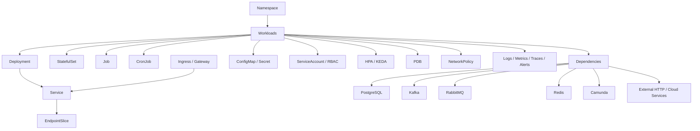
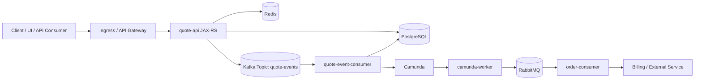
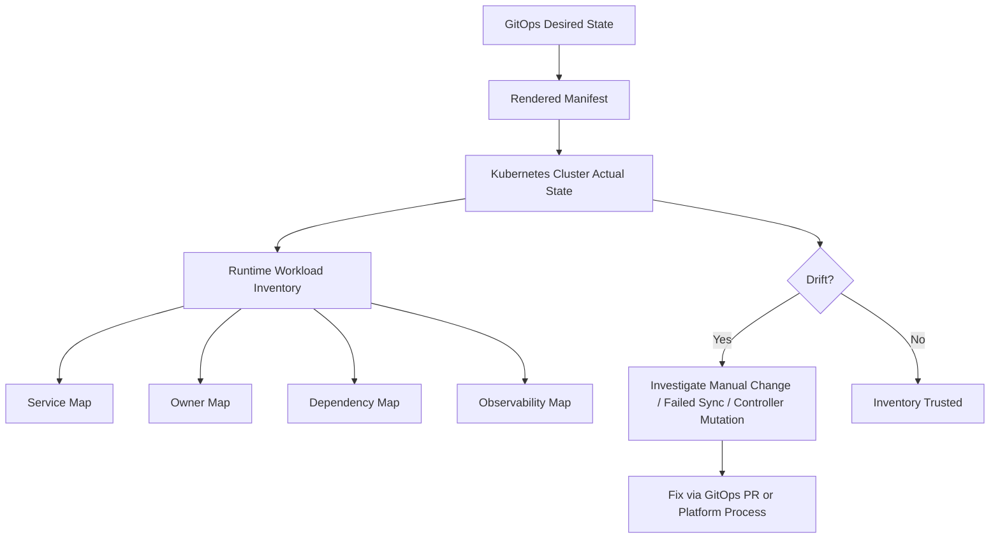
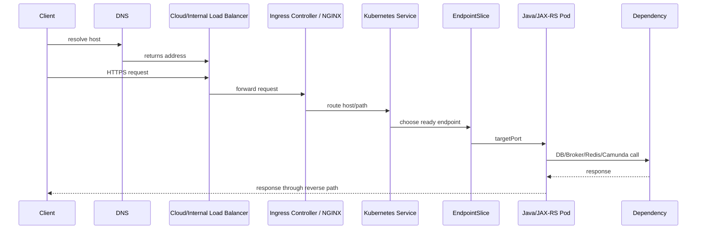
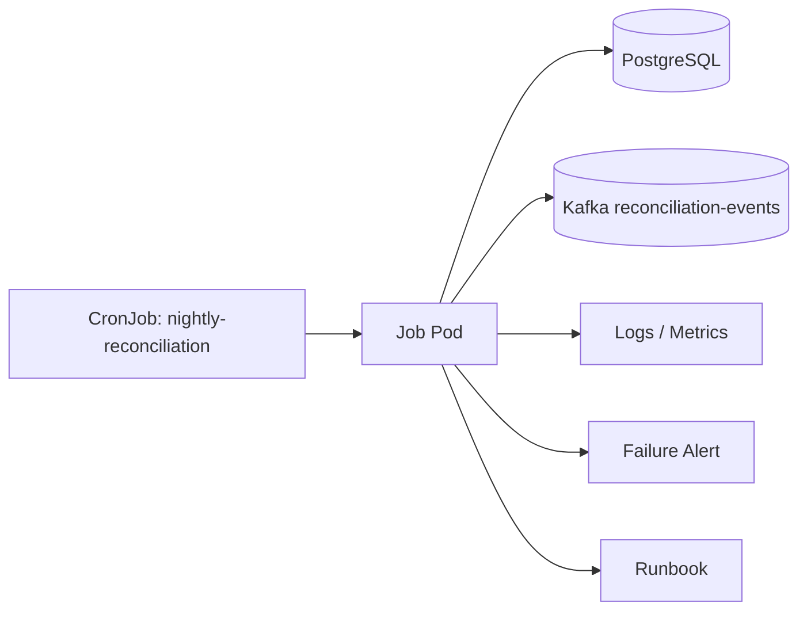

# Part 008 — Workload Inventory and Service Map

> Saat incident terjadi, pertanyaan pertama bukan “command apa yang harus saya jalankan?”, tetapi “service apa yang sebenarnya berjalan, milik siapa, menerima traffic dari mana, memanggil dependency apa, dan seberapa critical dampaknya?”. Workload inventory dan service map menjawab pertanyaan itu.

Kubernetes cluster production dapat berisi ratusan object: Deployment, StatefulSet, Job, CronJob, Service, Ingress, EndpointSlice, Secret, ConfigMap, HPA, PDB, NetworkPolicy, dan banyak CRD. Tanpa inventory, backend engineer akan debugging secara lokal dan reaktif. Dengan inventory yang benar, debugging menjadi sistematis: mulai dari service, ownership, traffic path, dependency graph, runtime shape, criticality, dan runbook.

Part ini membahas bagaimana senior backend engineer membangun mental model inventory dan service map untuk Java/JAX-RS/Jakarta RESTful service, Kafka/RabbitMQ consumers, Redis-backed service, Camunda worker, batch job, NGINX/Ingress, PostgreSQL, GitOps, EKS, AKS, dan hybrid Kubernetes operations.

---

## 1. Core Concept

Workload inventory adalah daftar runtime object yang menjawab:

- workload apa yang berjalan?
- di namespace mana?
- siapa owner-nya?
- tipe workload-nya apa?
- expose traffic lewat apa?
- dependency-nya apa?
- resource profile-nya bagaimana?
- autoscaling-nya bagaimana?
- observability-nya di mana?
- runbook-nya di mana?
- criticality-nya apa?

Service map adalah graph yang menjawab:

- client masuk lewat jalur apa?
- service mana memanggil service lain?
- service mana memakai PostgreSQL, Kafka, RabbitMQ, Redis, Camunda, atau cloud service?
- dependency mana shared?
- failure satu dependency berdampak ke service apa saja?
- rollout satu workload berdampak ke flow bisnis apa?

Inventory adalah tabel. Service map adalah hubungan.

Keduanya dibutuhkan untuk production operations.

---

## 2. Why Inventory Matters Operationally

Tanpa inventory:

- alert tidak jelas owner-nya
- service dependency tidak terlihat
- rollout risk sulit dinilai
- pod restart terlihat kecil padahal memengaruhi quote/order lifecycle
- stale CronJob bisa tetap memodifikasi data
- consumer backlog tidak jelas milik service mana
- NetworkPolicy review sulit
- cost allocation tidak jelas
- incident RCA kekurangan evidence

Dengan inventory:

- blast radius bisa dihitung lebih cepat
- affected service bisa dihubungkan dengan dependency
- runbook lebih mudah ditemukan
- dashboard lebih mudah dinavigasi
- PR review lebih tajam
- readiness review lebih konsisten
- onboarding ke production environment jauh lebih cepat

---

## 3. Inventory Dimensions

Inventory production minimal harus mencakup dimensi berikut.

| Dimension | Pertanyaan |
|---|---|
| Namespace | Workload berjalan di boundary mana? |
| Workload | Deployment, StatefulSet, Job, CronJob, atau lainnya? |
| Service exposure | Apakah menerima traffic lewat Service/Ingress/Gateway? |
| Owner | Team/service owner/on-call siapa? |
| Runtime | Java 17/21, JAX-RS, worker, consumer, batch? |
| Criticality | Tier-1, tier-2, internal, batch, non-critical? |
| Dependency | PostgreSQL, Kafka, RabbitMQ, Redis, Camunda, external HTTP? |
| Autoscaling | HPA, KEDA, static replica, CronJob schedule? |
| Config/Secret | ConfigMap/Secret/external secret apa yang dipakai? |
| Security | ServiceAccount, RBAC, NetworkPolicy, identity? |
| Observability | Dashboard, logs, traces, alerts, SLO, runbook? |
| Release | image, version, Git commit, GitOps app, pipeline? |

---

## 4. Workload Inventory Layers



Operational reading:

- inventory tidak berhenti di Deployment
- Service dan EndpointSlice menentukan runtime traffic
- Config/Secret menentukan runtime behavior
- ServiceAccount/RBAC menentukan permission
- HPA/KEDA menentukan scale behavior
- NetworkPolicy menentukan connectivity
- observability menentukan diagnosability
- dependency graph menentukan blast radius

---

## 5. Safe Discovery Commands

Gunakan command read-only terlebih dahulu.

### 5.1 List namespaces

```bash
kubectl get ns --show-labels
```

### 5.2 List workloads in one namespace

```bash
kubectl get deploy,sts,ds,job,cronjob -n <namespace> -o wide
```

### 5.3 List service exposure

```bash
kubectl get svc,ingress -n <namespace> -o wide
kubectl get endpointslice -n <namespace>
```

### 5.4 List autoscaling and availability controls

```bash
kubectl get hpa,pdb -n <namespace>
```

### 5.5 List config and secret references safely

```bash
kubectl get deploy <deployment-name> -n <namespace> -o yaml | grep -E "configMapRef|secretRef|configMapKeyRef|secretKeyRef|secretName|name:" -n
```

Jangan dump seluruh Secret value di production. Yang perlu diketahui biasanya nama secret dan cara konsumsinya, bukan value-nya.

### 5.6 List security boundaries

```bash
kubectl get serviceaccount,role,rolebinding,networkpolicy -n <namespace>
```

### 5.7 List by owner/team label

```bash
kubectl get all -n <namespace> -l company.io/team=<team-name>
```

Sesuaikan label key dengan standard internal yang sebenarnya.

---

## 6. Workload Types to Inventory

### 6.1 JAX-RS API service

Inventory fields:

- Deployment name
- Service name
- Ingress/Gateway route
- container port
- readiness/liveness/startup probes
- Java version
- app server/runtime
- thread pool
- DB pool
- outbound dependency list
- HPA policy
- PDB
- dashboard
- runbook

Operational risk:

- endpoint no traffic because readiness false
- ingress 502/503/504
- CPU throttling causing latency
- DB pool exhaustion during rollout
- timeout chain mismatch

### 6.2 Kafka consumer service

Inventory fields:

- Deployment name
- topic list
- consumer group
- partition count
- replica count
- concurrency per pod
- lag dashboard
- retry/DLQ policy
- shutdown behavior
- autoscaling policy

Operational risk:

- lag spike
- rebalance storm
- duplicate processing
- offset commit failure
- pod termination before commit

### 6.3 RabbitMQ consumer service

Inventory fields:

- Deployment name
- queue list
- exchange/routing key if relevant
- consumer count
- prefetch
- ack/nack policy
- DLQ
- unacked dashboard
- queue depth alert

Operational risk:

- queue depth growth
- unacked pile-up
- redelivery storm
- unsafe shutdown
- broker connection pressure

### 6.4 Redis-backed service

Inventory fields:

- Redis endpoint
- keyspace/domain
- TTL behavior
- connection pool
- cache criticality
- fallback behavior
- Redis dashboard

Operational risk:

- stale cache
- hot key
- connection exhaustion
- timeout spike
- cache stampede

### 6.5 Camunda worker

Inventory fields:

- worker name
- process/job type
- concurrency
- timeout
- retry policy
- incident dashboard
- correlation ID behavior
- graceful shutdown

Operational risk:

- job backlog
- incident spike
- worker restart impact
- stuck process instance
- timeout/retry mismatch

### 6.6 Batch, scheduler, reconciliation, migration job

Inventory fields:

- Job/CronJob name
- schedule
- timezone
- concurrencyPolicy
- idempotency strategy
- lock mechanism
- retry/backoff
- activeDeadlineSeconds
- notification channel
- data mutation scope

Operational risk:

- duplicate execution
- missed schedule
- partial completion
- long-running migration
- silent failure

---

## 7. Service Inventory

Service inventory harus menjawab:

- Service apa yang expose pod?
- Selector apa yang dipakai?
- Port dan targetPort apa?
- Named port apa?
- EndpointSlice terisi pod mana?
- Apakah service internal-only atau exposed melalui ingress/gateway?
- Apakah headless service?
- Apakah service dipakai oleh dependency lain?

Contoh inventory row:

| Field | Example |
|---|---|
| Namespace | `quote-order-prod` |
| Service | `quote-api` |
| Type | `ClusterIP` |
| Selector | `app.kubernetes.io/name=quote-api` |
| Port | `80` |
| TargetPort | `http` |
| Endpoint Pods | `quote-api-*` |
| Exposed By | `Ingress quote-api` |
| Owner | `quote-order` |
| Criticality | `tier-1` |

Nama di atas hanya contoh. Validasi actual naming secara internal.

---

## 8. Ingress and Route Inventory

Ingress/Gateway inventory harus menjawab:

- host apa yang masuk?
- path apa yang diroute?
- backend service apa?
- TLS secret apa?
- ingress class apa?
- timeout/rewrite annotation apa?
- auth/rate limit berada di mana?
- apakah route public, private, atau internal?

Contoh fields:

| Field | Description |
|---|---|
| Host | DNS host yang menerima request |
| Path | route path |
| Backend service | Kubernetes Service target |
| Backend port | service port target |
| TLS | secret/cert source |
| IngressClass | controller yang menangani ingress |
| Annotations | timeout, rewrite, body size, protocol |
| Exposure | public/private/internal |
| Owner | app/platform route owner |

Route inventory penting saat error 404/502/503/504.

---

## 9. Dependency Map

Dependency map harus menghubungkan workload ke dependency runtime.



Tujuan diagram bukan untuk menggambarkan topology internal CSG secara aktual. Ini contoh pattern. Actual service names, queues, topics, and dependencies harus diverifikasi.

Dependency map minimal menjawab:

- siapa memanggil siapa?
- synchronous atau asynchronous?
- dependency mana critical path?
- dependency mana shared?
- apa retry behavior?
- apa timeout behavior?
- apa fallback behavior?
- alert mana yang menunjukkan dependency health?

---

## 10. Owner Map

Owner map menghubungkan workload dengan manusia atau team.

Fields penting:

- service name
- team owner
- technical owner
- product/domain owner jika relevan
- on-call rotation
- Slack/Teams channel
- escalation path
- platform contact
- security contact jika sensitive
- database/broker owner
- runbook link

Tanpa owner map, incident triage menjadi lambat karena setiap orang bertanya “ini punya siapa?”.

### 10.1 Orphaned workload

Orphaned workload adalah object yang berjalan tanpa owner jelas.

Gejala:

- tidak ada team label
- tidak ada runbook
- tidak ada dashboard
- tidak ada service catalog entry
- image lama
- namespace tidak jelas
- tidak ada recent deployment record

Mitigasi:

- jangan langsung delete di production
- identifikasi traffic dan dependency terlebih dahulu
- cek logs/metrics apakah masih digunakan
- cek GitOps source
- eskalasi ke platform/service owners

---

## 11. Runtime Map

Runtime map menjawab teknologi apa yang menjalankan workload.

Contoh categories:

- Java 17 JAX-RS API
- Java 21 worker
- Kafka consumer
- RabbitMQ consumer
- Camunda worker
- PostgreSQL migration job
- reconciliation CronJob
- Redis-backed API
- NGINX/sidecar/proxy if used

Kenapa runtime map penting:

- Java service perlu JVM memory model
- consumer perlu graceful shutdown dan lag dashboard
- batch perlu idempotency dan lock
- migration job perlu rollback limitation
- file processor perlu ephemeral storage review
- API service perlu ingress/timeout/probe review

---

## 12. Criticality Classification

Tidak semua workload punya operational risk yang sama.

Contoh classification:

| Tier | Meaning | Operational implication |
|---|---|---|
| Tier-1 | Customer/business critical path | paging alert, SLO, PDB, HPA, strong runbook |
| Tier-2 | Important internal flow | alert and dashboard required, rollback path clear |
| Tier-3 | Supporting/background | ticket alert may be enough |
| Batch-critical | Not always online but business-critical | schedule, retry, idempotency, notification required |
| Experimental | Non-production critical | strict isolation and cost control |

Untuk CPQ/quote/order lifecycle, beberapa background workers bisa lebih critical daripada API yang terlihat, karena backlog atau failure dapat menunda quote-to-order processing.

Criticality harus diverifikasi dengan product/business/SRE, bukan ditebak dari nama service.

---

## 13. Service Catalog Fields

Service catalog untuk Kubernetes backend sebaiknya minimal menyimpan:

```yaml
serviceName: quote-api
system: quote-order
domain: cpq
team: quote-order
criticality: tier-1
runtime: java17-jaxrs
namespace:
  prod: <internal-prod-namespace>
workloads:
  - kind: Deployment
    name: quote-api
exposure:
  type: ingress
  host: <internal-host>
dependencies:
  postgresql:
    - <db/logical-db-name>
  kafka:
    produces:
      - <topic-name>
    consumes: []
  rabbitmq:
    consumes: []
  redis:
    - <cache-name>
observability:
  dashboard: <dashboard-url>
  logs: <log-query-url>
  traces: <trace-query-url>
  alerts: <alert-policy-url>
runbook: <runbook-url>
release:
  gitopsApp: <argo-or-flux-app>
  pipeline: <pipeline-url>
```

Gunakan sebagai schema konseptual, bukan data aktual CSG.

---

## 14. Inventory from GitOps vs Inventory from Cluster

Ada dua sumber inventory:

### 14.1 Desired inventory

Berasal dari:

- GitOps repo
- Helm values
- Kustomize overlay
- Terraform/Pulumi/IaC jika mengelola namespace/addon
- service catalog
- architecture diagram

Kelebihan:

- source of truth
- reviewable
- auditable
- bisa dipakai sebelum deploy

Risiko:

- belum tentu sama dengan actual cluster
- render Helm/Kustomize bisa berbeda antar environment
- manual hotfix bisa menciptakan drift

### 14.2 Actual runtime inventory

Berasal dari:

- Kubernetes API
- `kubectl get`
- GitOps controller status
- observability discovery
- service mesh/gateway discovery jika ada

Kelebihan:

- menunjukkan yang benar-benar berjalan
- berguna saat incident

Risiko:

- bisa berisi drift dari Git
- bisa berisi orphaned object
- snapshot bisa berubah cepat

Production debugging perlu membandingkan keduanya.

---

## 15. Inventory Reconciliation Flow



---

## 16. Java/JAX-RS Inventory Details

Untuk Java/JAX-RS service, inventory harus mencatat:

- Java version
- framework/runtime
- HTTP port
- management port jika berbeda
- readiness endpoint
- liveness endpoint
- startup probe expectation
- request timeout
- servlet/container thread pool
- outbound HTTP client pool
- database pool
- Kafka/RabbitMQ/Redis client config
- JVM heap flags
- memory limit
- CPU request/limit
- GC dashboard
- trace instrumentation
- structured logging fields

Kenapa ini penting:

- pod Running belum berarti endpoint siap
- readiness healthy belum berarti dependency latency sehat
- CPU throttling bisa terlihat sebagai API latency
- DB pool exhaustion bisa terlihat sebagai 504 di ingress
- thread pool saturation bisa terlihat seperti network timeout

---

## 17. PostgreSQL Dependency Inventory

Untuk PostgreSQL dependency, inventory minimal:

- logical DB/service name
- endpoint type: internal service, managed service, private endpoint
- credential secret source
- connection pool size per pod
- max replica count
- migration owner
- migration tool
- backup/restore owner
- dashboard
- alert
- escalation path

Operational calculation:

```text
max database connections from service
= max replicas × max pool size per pod
```

Saat rolling deployment:

```text
temporary max connections
= (old replicas + surge replicas) × pool size
```

Ini harus terlihat di inventory karena rollout dapat menyebabkan connection spike.

---

## 18. Kafka Dependency Inventory

Untuk Kafka:

- topics produced
- topics consumed
- consumer group
- partition count
- replica count
- concurrency per pod
- lag dashboard
- retry topic
- DLQ topic
- schema registry dependency jika ada
- broker endpoint
- auth mechanism
- owner team

Operational questions:

- apakah replica count melebihi partition count?
- apakah scaling menambah throughput atau hanya idle consumers?
- apakah pod restart memicu rebalance storm?
- apakah DLQ diamati?

---

## 19. RabbitMQ Dependency Inventory

Untuk RabbitMQ:

- exchange
- queue
- routing key
- consumer service
- prefetch
- ack/nack behavior
- retry queue
- DLQ
- connection/channel per pod
- queue depth dashboard
- unacked dashboard
- broker owner

Operational questions:

- apakah backlog karena consumer lambat atau broker issue?
- apakah prefetch terlalu tinggi?
- apakah unacked tinggi karena processing stuck?
- apakah retry menyebabkan redelivery storm?

---

## 20. Redis Dependency Inventory

Untuk Redis:

- endpoint
- usage type: cache, lock, rate limit, session, stream
- key prefix/domain
- TTL expectation
- connection pool
- max memory/eviction awareness
- fallback behavior
- dashboard
- owner

Operational questions:

- apakah Redis down menyebabkan hard failure atau degraded mode?
- apakah key cardinality meledak?
- apakah cache stampede mungkin terjadi saat restart?
- apakah lock TTL aman?

---

## 21. Camunda Dependency Inventory

Untuk Camunda:

- process definitions used
- job types handled
- worker service
- concurrency
- timeout
- retry policy
- incident owner
- process correlation ID
- dashboard
- runbook

Operational questions:

- apakah process stuck karena worker down?
- apakah worker restart aman?
- apakah retry policy menyebabkan repeated failure?
- apakah incident spike terlihat di alert?

---

## 22. Ingress-to-Service-to-Pod Map

Untuk API service, map harus bisa menjawab:



Inventory harus membuat setiap hop terlihat.

Jika satu hop tidak diketahui, incident debugging akan berhenti di area abu-abu.

---

## 23. Batch and Job Map

Batch workload tidak selalu punya Service/Ingress, tetapi tetap harus masuk inventory.

Fields penting:

- schedule
- input source
- output target
- data mutation scope
- idempotency key
- lock mechanism
- checkpoint state
- retry/backoff
- failure notification
- dashboard/log query
- owner

Contoh graph:



Operational note:

> Batch job yang tidak menerima traffic tetap bisa merusak production jika mutation scope, retry, atau idempotency salah.

---

## 24. Inventory for Rollout Risk

Sebelum deployment, inventory membantu menjawab:

- Service ini critical path atau background?
- Ada berapa replica?
- Ada PDB?
- Ada HPA?
- Apa dependencies-nya?
- Apakah deployment mengubah DB schema?
- Apakah consumer restart memicu rebalance?
- Apakah pool size × surge melebihi DB capacity?
- Apakah Ingress route berubah?
- Apakah NetworkPolicy berubah?
- Apakah Secret/Config berubah?
- Apakah observability cukup untuk verify post-deploy?

Tanpa inventory, rollout review menjadi tebakan.

---

## 25. Inventory for Incident Triage

Saat incident, inventory harus membantu menjawab dalam beberapa menit:

1. Service apa yang terdampak?
2. Namespace mana?
3. Workload apa?
4. Route masuk dari mana?
5. EndpointSlice sehat atau kosong?
6. Pod versi apa yang running?
7. Deployment terakhir kapan?
8. Dependency apa yang dipanggil?
9. Dashboard dan log query di mana?
10. Owner/on-call siapa?
11. Apakah ada recent rollout/config/secret/network change?
12. Apakah rollback aman?

---

## 26. Common Failure Modes Caused by Poor Inventory

### 26.1 Wrong owner during incident

Symptom:

- alert masuk channel salah
- incident lama triage karena tidak tahu owner

Root cause:

- missing team label
- service catalog stale
- dashboard tidak punya runbook link

### 26.2 Hidden dependency blast radius

Symptom:

- satu DB/broker issue memengaruhi banyak service yang tidak terduga

Root cause:

- dependency map tidak lengkap
- connection strings tersebar di config tanpa catalog

### 26.3 Unknown stale workload

Symptom:

- workload lama masih running dan memproses event
- duplicate consumer group atau queue consumer

Root cause:

- GitOps cleanup tidak lengkap
- orphaned Deployment/CronJob
- no owner metadata

### 26.4 Rollout overloads dependency

Symptom:

- deployment sukses tetapi DB connection exhausted
- broker connection spike

Root cause:

- replica count, maxSurge, and pool size tidak dihitung bersama

### 26.5 Dashboard cannot find service

Symptom:

- pod running tetapi dashboard kosong

Root cause:

- service name mismatch
- missing labels
- telemetry metadata inconsistent

### 26.6 Wrong environment assumption

Symptom:

- engineer melihat staging saat incident prod
- command dijalankan di namespace salah

Root cause:

- namespace/environment mapping tidak jelas
- context naming buruk
- dashboard tidak menampilkan environment jelas

---

## 27. EKS Inventory Concerns

Di EKS, inventory juga perlu mencatat:

- EKS cluster name
- region
- node group
- Fargate profile jika ada
- ALB/NLB association
- AWS Load Balancer Controller resource mapping
- Route 53 record
- VPC endpoint dependency
- IRSA role per ServiceAccount
- ECR image source
- EBS CSI/PVC usage
- CloudWatch/observability integration

Backend engineer tidak harus mengelola semuanya, tetapi harus tahu mana yang memengaruhi workload.

Internal verification checklist:

- Apakah service memakai ALB Ingress atau NLB Service?
- Apakah pod membutuhkan IRSA?
- Apakah dependency lewat VPC endpoint?
- Apakah subnet IP exhaustion pernah terjadi?
- Apakah ECR permission terkait ServiceAccount/node role?

---

## 28. AKS Inventory Concerns

Di AKS, inventory juga perlu mencatat:

- AKS cluster name
- region
- node pool
- Azure CNI mode
- Application Gateway/AGIC jika ada
- Azure Load Balancer mapping
- private endpoint dependency
- private DNS zone
- Azure Workload Identity/Managed Identity
- ACR image source
- Key Vault CSI usage
- Azure Monitor integration

Internal verification checklist:

- Apakah ingress memakai NGINX, AGIC, atau gateway lain?
- Apakah pod memakai Azure Workload Identity?
- Apakah secret berasal dari Key Vault?
- Apakah dependency via Private Endpoint?
- Apakah NSG/UDR memengaruhi egress?

---

## 29. On-Prem and Hybrid Inventory Concerns

Untuk on-prem/hybrid:

- cluster location/data center
- internal load balancer
- corporate DNS
- proxy requirement
- NO_PROXY standard
- internal CA
- registry source
- firewall path
- hybrid connection to cloud
- private endpoint mapping
- observability export path

Internal verification checklist:

- Apakah pod butuh proxy untuk outbound?
- Apakah internal CA sudah ada di Java truststore?
- Apakah registry air-gapped?
- Apakah firewall allowlist berdasarkan namespace, node, atau IP range?
- Apakah DNS private endpoint resolve dari pod?

---

## 30. Inventory Review Checklist

Gunakan checklist ini untuk setiap service production.

### 30.1 Identity and ownership

- Service name jelas
- Namespace jelas
- Owner team jelas
- On-call jelas
- Criticality jelas
- Service catalog entry ada
- Runbook ada

### 30.2 Workload runtime

- Workload kind diketahui
- Replica count diketahui
- Runtime diketahui
- Image/version diketahui
- GitOps source diketahui
- Pipeline diketahui

### 30.3 Traffic exposure

- Service diketahui
- Service selector benar
- EndpointSlice sehat
- Ingress/Gateway route diketahui
- TLS source diketahui
- Timeout chain diketahui

### 30.4 Dependencies

- PostgreSQL dependency diketahui
- Kafka topic/group diketahui
- RabbitMQ queue diketahui
- Redis usage diketahui
- Camunda worker/process diketahui
- External HTTP/cloud service diketahui
- Owner setiap dependency diketahui

### 30.5 Operations

- HPA/KEDA diketahui
- PDB diketahui
- Resource request/limit diketahui
- ConfigMap/Secret source diketahui
- ServiceAccount/RBAC diketahui
- NetworkPolicy diketahui
- Observability dashboard/log/trace/alert diketahui

### 30.6 Safety

- Rollback path diketahui
- Smoke test diketahui
- Incident runbook diketahui
- Escalation path diketahui
- Recent incidents diketahui

---

## 31. Production-Safe Inventory Commands

### 31.1 Snapshot namespace object count

```bash
kubectl get all -n <namespace>
```

Note: `get all` tidak benar-benar semua object. Ia tidak selalu menampilkan ConfigMap, Secret, Ingress, HPA, PDB, NetworkPolicy, RoleBinding, dan CRD tertentu.

### 31.2 Better namespace snapshot

```bash
kubectl get deploy,sts,job,cronjob,svc,ingress,hpa,pdb,networkpolicy,serviceaccount -n <namespace>
```

### 31.3 Export selected object names

```bash
kubectl get deploy -n <namespace> -o custom-columns=NAME:.metadata.name,IMAGE:.spec.template.spec.containers[*].image,REPLICAS:.spec.replicas
```

### 31.4 Find services with selectors

```bash
kubectl get svc -n <namespace> -o jsonpath='{range .items[*]}{.metadata.name}{"\t"}{.spec.selector}{"\n"}{end}'
```

### 31.5 Find pods by app label

```bash
kubectl get pod -n <namespace> -l app.kubernetes.io/name=<app-name> -o wide --show-labels
```

### 31.6 Find mounted config and secret names

```bash
kubectl get deploy <deployment-name> -n <namespace> -o jsonpath='{.spec.template.spec.volumes}'
```

```bash
kubectl get deploy <deployment-name> -n <namespace> -o jsonpath='{.spec.template.spec.containers[*].envFrom}'
```

These commands reveal references, not secret values.

---

## 32. Inventory Artifact Template

A useful inventory artifact can be a Markdown table, spreadsheet, service catalog record, or generated dashboard.

Minimal Markdown table:

| Service | Namespace | Workload | Type | Owner | Criticality | Route | Dependencies | Dashboard | Runbook |
|---|---|---|---|---|---|---|---|---|---|
| `quote-api` | `<verify>` | Deployment | JAX-RS API | `<verify>` | `<verify>` | `<verify>` | PostgreSQL, Redis, Kafka | `<verify>` | `<verify>` |
| `quote-consumer` | `<verify>` | Deployment | Kafka consumer | `<verify>` | `<verify>` | none | Kafka, PostgreSQL | `<verify>` | `<verify>` |
| `order-reconciliation` | `<verify>` | CronJob | batch | `<verify>` | `<verify>` | none | PostgreSQL, RabbitMQ | `<verify>` | `<verify>` |

Use `<verify>` intentionally until real internal data is confirmed.

---

## 33. What Backend Engineer Owns

Backend service owner should own or strongly contribute to:

- service catalog correctness
- workload type classification
- dependency list
- runtime config understanding
- ownership metadata
- runbook accuracy
- dashboard usefulness
- release traceability
- production readiness checklist
- PR review for workload changes
- incident notes related to service behavior

Backend engineer should not silently own:

- cluster-wide inventory tooling
- node inventory
- cloud load balancer inventory
- global DNS management
- platform add-on inventory
- organization-wide CMDB

But backend engineer must be able to consume and validate these maps when debugging production.

---

## 34. Platform/SRE Responsibility

Platform/SRE usually owns:

- inventory automation
- cluster object discovery
- GitOps app inventory
- ingress/gateway catalog
- platform dashboard
- node pool inventory
- cloud resource mapping
- policy enforcement
- namespace lifecycle
- shared runbook patterns

Backend engineer should verify how much of this exists internally and where it lives.

---

## 35. Security and Compliance Concerns

Inventory can expose sensitive operational structure.

Avoid publishing broad inventory outside appropriate internal audience if it contains:

- internal hostnames
- private endpoint names
- secret names that reveal systems
- business criticality
- dependency topology
- security policy names
- incident links
- customer/tenant context

Inventory should be access-controlled according to internal policy.

---

## 36. Cost Concerns

Inventory is a FinOps input.

Cost questions:

- workload mana yang idle?
- namespace mana yang paling mahal?
- service mana overprovisioned?
- log volume terbesar dari service apa?
- load balancer dibuat oleh ingress/service mana?
- NAT egress berasal dari workload mana?
- unused CronJob/Job history masih memakan resource?

If cost labels are missing, inventory should flag the workload as non-compliant or unknown owner.

---

## 37. Operational Readiness Criteria

A service has acceptable inventory when:

- workload object known
- service/ingress route known
- dependency graph known
- owner/on-call known
- criticality known
- runtime type known
- GitOps source known
- dashboard/log/trace/alert links known
- runbook known
- resource/autoscaling/PDB known
- config/secret identity known
- ServiceAccount/RBAC/NetworkPolicy known
- rollback path known
- internal verification items tracked

---

## 38. Mini Runbook: Build Inventory for One Service

1. Identify namespace.
2. Find Deployment/StatefulSet/Job/CronJob.
3. Record labels and annotations.
4. Find Service selector.
5. Find EndpointSlice.
6. Find Ingress/Gateway route.
7. Find ConfigMap/Secret references without reading secret values.
8. Find ServiceAccount.
9. Find HPA/KEDA and PDB.
10. Find NetworkPolicy affecting workload.
11. Find logs/metrics/traces dashboard.
12. Find dependencies from config, code, dashboard, and architecture docs.
13. Confirm owner and criticality.
14. Compare actual cluster state with GitOps desired state.
15. Store verified result in service catalog or team documentation.

---

## 39. Anti-Patterns

### 39.1 Inventory only from memory

People forget stale workloads, hidden jobs, and old routes.

### 39.2 Inventory only from `kubectl get all`

`get all` misses important object types.

### 39.3 Inventory without dependencies

Deployment list alone does not reveal blast radius.

### 39.4 Inventory without ownership

A list of objects without owner is not operationally useful.

### 39.5 Inventory without criticality

A debug service and a quote/order critical path service cannot be treated equally.

### 39.6 Inventory not reconciled with GitOps

Runtime state can drift from desired state.

### 39.7 Inventory stale after migration

Routes, topics, queues, and secrets often change after migration. Stale inventory creates false confidence.

---

## 40. Internal Verification Checklist

Verify these in the actual CSG/team environment:

- Where is the service catalog?
- Which namespaces contain quote/order services?
- What labels identify owner, environment, service, component, criticality, and cost center?
- Which GitOps repo/app manages each workload?
- Which Helm chart or Kustomize overlay renders manifests?
- Which workloads are JAX-RS APIs?
- Which workloads are Kafka consumers?
- Which workloads are RabbitMQ consumers?
- Which workloads are Camunda workers?
- Which workloads are batch/reconciliation/migration jobs?
- Which Services are exposed through Ingress/Gateway/NGINX?
- Which DNS hosts map to which ingress routes?
- Which PostgreSQL databases are used by each service?
- Which Kafka topics and consumer groups are used?
- Which RabbitMQ queues/exchanges are used?
- Which Redis instances/keyspaces are used?
- Which Camunda processes/job types are used?
- Which cloud services are called from pods?
- Which private endpoints/VPC endpoints/Azure Private Endpoints are used?
- Which ServiceAccounts and cloud identities are attached?
- Which NetworkPolicies affect each workload?
- Which dashboards and alerts exist?
- Which runbooks exist and which are missing?
- Which service has known incident history?
- Which inventory fields are automated vs manually maintained?

---

## 41. Key Takeaways

- Workload inventory is the operational index of what runs in Kubernetes.
- Service map explains traffic, dependency, ownership, and blast radius.
- Deployment list alone is not enough; include Service, EndpointSlice, Ingress, Config/Secret, identity, NetworkPolicy, HPA, PDB, observability, and dependencies.
- Backend engineers need inventory to debug production safely and to review Kubernetes changes intelligently.
- For enterprise CPQ/quote/order systems, background consumers, workers, and batch jobs can be as operationally critical as public APIs.
- Actual CSG topology, namespace names, GitOps repo, dashboard links, dependency names, and ownership must be verified internally.
