# Part 009 — Pod Lifecycle Operations

> Pod lifecycle adalah tempat banyak incident Kubernetes mulai terlihat: pod tidak bisa dijadwalkan, image gagal ditarik, container gagal start, readiness tidak pernah hijau, liveness terlalu agresif, traffic masuk terlalu cepat, shutdown tidak graceful, atau request/event processing terputus saat rollout.

Untuk senior backend engineer, Pod bukan sekadar container yang berjalan. Pod adalah unit runtime yang melewati rangkaian state operasional: dibuat oleh controller, dijadwalkan ke node, menarik image, menjalankan init container, men-start container utama, melewati startup probe, masuk readiness, menerima traffic, diamati oleh kubelet, dan akhirnya dihentikan dengan SIGTERM sebelum dipaksa SIGKILL.

Part ini membahas Pod lifecycle dari sudut pandang production operations untuk Java 17+ / JAX-RS / Jakarta RESTful service, Kafka consumer, RabbitMQ consumer, Redis-backed service, Camunda worker, batch job, PostgreSQL-dependent service, NGINX/Ingress path, EKS, AKS, GitOps, observability, dan incident response.

---

## 1. Core Concept

Pod lifecycle adalah urutan transisi runtime yang menentukan apakah workload bisa:

- dijadwalkan ke node
- menarik image dari registry
- menjalankan init dependency
- start dengan konfigurasi benar
- dinyatakan siap menerima traffic
- tetap sehat selama runtime
- keluar dari load balancing sebelum shutdown
- menyelesaikan request/message/job yang sedang berjalan
- berhenti tanpa data loss atau duplicate side effect

Secara sederhana:

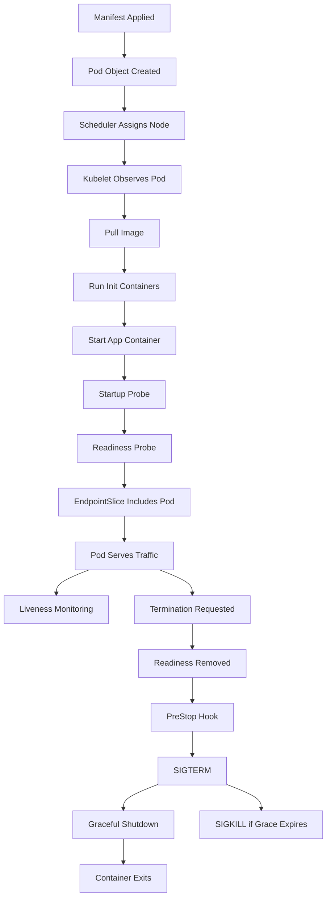

Operationally, setiap panah adalah failure point.

Backend engineer perlu bisa membaca titik mana yang gagal dan apa efeknya terhadap aplikasi, traffic, dependency, dan rollout.

---

## 2. Why Pod Lifecycle Matters Operationally

Banyak masalah production terlihat sebagai status Pod, tetapi akar masalahnya bisa ada di aplikasi, konfigurasi, dependency, platform, atau cloud.

| Symptom | Kemungkinan akar masalah |
|---|---|
| Pod Pending | scheduling, resource request, quota, affinity, taint, PVC, autoscaler |
| ImagePullBackOff | image tag salah, registry auth, ECR/ACR permission, network egress |
| Init container stuck | migration/check dependency/permission/network issue |
| CrashLoopBackOff | app crash, missing config, missing secret, JVM OOM, startup failure |
| Readiness false | app belum siap, endpoint salah, dependency blocking, slow startup |
| Liveness failed | app hang, probe terlalu agresif, GC pause, CPU throttling |
| Pod ready tapi 5xx | endpoint path salah, app partial health, ingress/service mismatch |
| Termination lama | shutdown hook blocked, consumer tidak berhenti, DB pool waiting |
| SIGKILL | grace period kurang, PreStop lama, app tidak handle SIGTERM |

Pod lifecycle penting karena menentukan:

- rollout safety
- traffic correctness
- connection draining
- consumer offset commit safety
- workflow/job consistency
- dependency pressure
- incident blast radius
- observability evidence

---

## 3. Backend Engineer Responsibility

Backend engineer tidak harus menjadi cluster admin, tetapi wajib memahami lifecycle Pod karena aplikasi berjalan di dalam lifecycle tersebut.

Tanggung jawab backend service owner:

- menyediakan endpoint health yang benar
- membedakan startup, readiness, dan liveness semantics
- memastikan app menerima SIGTERM dan shutdown graceful
- memastikan HTTP server berhenti menerima request baru saat termination
- memastikan request in-flight diberi waktu selesai
- memastikan Kafka/RabbitMQ consumer berhenti polling sebelum shutdown
- memastikan offset/ack dilakukan secara aman
- memastikan DB/Redis/HTTP client pool ditutup bersih
- memastikan runtime Java sesuai memory/CPU container
- memastikan logs/metrics/traces cukup untuk lifecycle debugging
- mereview `terminationGracePeriodSeconds`, probe config, resource requests, dan rollout behavior

Bukan tanggung jawab utama backend engineer:

- memperbaiki kubelet/node runtime rusak
- memperbaiki CNI cluster-wide
- mengubah scheduler policy
- mengubah node pool production tanpa approval
- mengubah global admission policy
- mengakses secret value secara langsung tanpa proses aman

Tetapi backend engineer harus bisa mengumpulkan evidence yang jelas untuk platform/SRE/security.

---

## 4. Platform/SRE Responsibility

Platform/SRE biasanya bertanggung jawab atas:

- node health
- kubelet/runtime health
- registry integration
- CNI/network plugin
- ingress controller platform
- cluster autoscaler/Karpenter/node pool autoscaling
- metrics server
- event/log/metrics pipeline
- admission controller/policy engine
- base Helm chart/platform template
- production access model
- cluster upgrade dan node drain process

Backend engineer perlu tahu boundary ini agar tidak memperbaiki gejala aplikasi dengan cara yang merusak platform, atau sebaliknya menyalahkan platform tanpa evidence.

---

## 5. Pod Status Is Not a Root Cause

Status Pod adalah sinyal, bukan root cause.

Contoh:

```bash
kubectl get pod -n <namespace>
```

Output seperti:

```text
NAME                                READY   STATUS             RESTARTS   AGE
quote-api-7b9d7f7f76-hx2p9          0/1     CrashLoopBackOff   5          8m
```

Itu hanya mengatakan container restart berulang. Root cause perlu dicari dari:

- previous logs
- exit code
- events
- config/secret references
- probe result
- resource usage
- node condition
- recent deployment/config change
- dependency availability

Mental model yang benar:

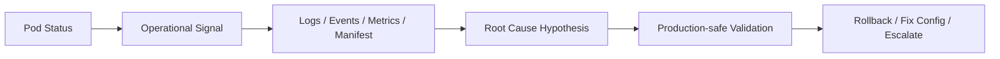

---

## 6. Pod Phase vs Container State vs Condition

Jangan mencampur Pod phase, container state, dan Pod condition.

### 6.1 Pod Phase

Pod phase adalah ringkasan kasar:

| Phase | Arti operasional |
|---|---|
| Pending | Pod diterima API server, tetapi belum semua container berjalan |
| Running | Pod bound ke node dan minimal satu container running/starting/restarting |
| Succeeded | Semua container selesai sukses, umum untuk Job |
| Failed | Container selesai gagal dan tidak akan restart lagi |
| Unknown | Node/kubelet tidak bisa memberi status |

`Running` tidak berarti siap menerima traffic.

### 6.2 Container State

Container state lebih detail:

| State | Arti operasional |
|---|---|
| Waiting | Belum berjalan; lihat reason seperti ImagePullBackOff, CrashLoopBackOff |
| Running | Container process sedang berjalan |
| Terminated | Container selesai; lihat exitCode, reason, finishedAt |

### 6.3 Pod Condition

Condition adalah sinyal penting:

| Condition | Fungsi |
|---|---|
| PodScheduled | Scheduler sudah memilih node |
| Initialized | Init container sudah selesai |
| ContainersReady | Semua container ready |
| Ready | Pod siap menerima traffic melalui Service |
| DisruptionTarget | Pod sedang ditargetkan untuk disruption |

Command investigasi:

```bash
kubectl get pod <pod-name> -n <namespace> -o jsonpath='{.status.phase}'
kubectl get pod <pod-name> -n <namespace> -o jsonpath='{.status.conditions}'
kubectl get pod <pod-name> -n <namespace> -o jsonpath='{.status.containerStatuses}'
```

Untuk production, lebih aman mulai dari `describe`:

```bash
kubectl describe pod <pod-name> -n <namespace>
```

---

## 7. Stage 1 — Pod Object Created

Pod dibuat oleh controller seperti Deployment, ReplicaSet, StatefulSet, Job, CronJob, atau controller custom.

Untuk Deployment:

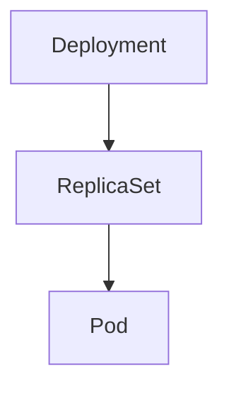

Backend engineer perlu tahu owner chain:

```bash
kubectl get pod <pod-name> -n <namespace> -o jsonpath='{.metadata.ownerReferences}'
```

Atau:

```bash
kubectl describe pod <pod-name> -n <namespace>
```

Cari field `Controlled By`.

### Operational concern

Jika Pod bermasalah, jangan langsung mengedit Pod. Pod biasanya disposable dan akan direkonsiliasi ulang oleh controller.

Perubahan harus dilakukan pada owner object:

- Deployment
- StatefulSet
- Job/CronJob
- Helm values
- Kustomize overlay
- GitOps source

### Failure mode

- Pod dibuat oleh ReplicaSet lama
- Pod dibuat oleh ReplicaSet baru dengan config salah
- Pod orphan akibat manual operation
- Pod berasal dari Job lama yang masih berjalan
- Pod tidak sesuai GitOps desired state

### Safe command

```bash
kubectl get pod <pod-name> -n <namespace> -o yaml | grep -A5 ownerReferences
kubectl get rs -n <namespace>
kubectl get deploy -n <namespace>
```

---

## 8. Stage 2 — Scheduling

Scheduler memilih node berdasarkan:

- CPU/memory/ephemeral storage request
- node availability
- taint/toleration
- node selector
- affinity/anti-affinity
- topology spread constraints
- PVC binding
- quota/LimitRange constraints
- priority/preemption

### Scheduling flow

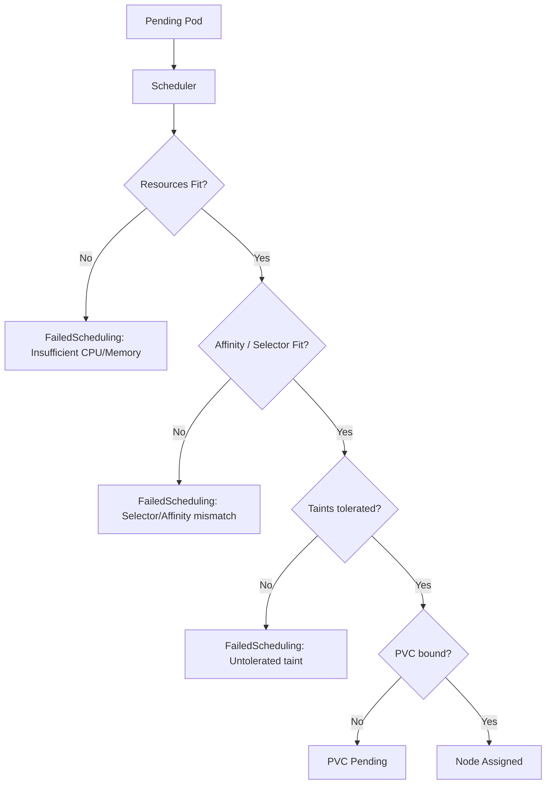

### Operational symptoms

- `STATUS=Pending`
- no node assigned
- events show `FailedScheduling`
- cluster autoscaler may or may not add nodes

### Safe commands

```bash
kubectl describe pod <pod-name> -n <namespace>
kubectl get events -n <namespace> --sort-by=.lastTimestamp
kubectl get quota -n <namespace>
kubectl get limitrange -n <namespace>
kubectl get nodes --show-labels
```

Use node commands carefully. In many orgs, backend engineers have read-only node visibility only.

### Java/JAX-RS impact

If Pod is Pending:

- rollout may stall
- new version never receives traffic
- old version may remain serving
- HPA may request more pods but no capacity exists
- traffic may overload existing replicas

### Dependency impact

Pending pods can indirectly affect:

- Kafka lag if consumers cannot scale
- RabbitMQ queue depth if replicas cannot start
- Camunda job backlog
- API latency due to insufficient replicas

### Mitigation

Safe initial actions:

- confirm recent resource request change
- confirm HPA desired replicas
- confirm quota exceeded
- confirm affinity/taint mismatch
- escalate node capacity/autoscaler issue to platform/SRE

Dangerous actions:

- reducing requests blindly in production
- removing affinity/taints without understanding isolation/security
- manually forcing pods to nodes

---

## 9. Stage 3 — Image Pull

After node assignment, kubelet pulls the container image.

Image pull depends on:

- image registry availability
- image tag/digest correctness
- imagePullSecret
- ECR/ACR permission
- node egress path
- registry rate limit
- TLS/certificate trust
- private network/proxy

### Failure reasons

| Reason | Typical root cause |
|---|---|
| `ErrImagePull` | initial image pull error |
| `ImagePullBackOff` | repeated pull failure with backoff |
| `Unauthorized` | registry auth missing/expired |
| `manifest unknown` | tag does not exist |
| `i/o timeout` | network/proxy/firewall/DNS issue |
| `x509` | CA/certificate trust issue |

### Safe commands

```bash
kubectl describe pod <pod-name> -n <namespace>
kubectl get pod <pod-name> -n <namespace> -o jsonpath='{.spec.containers[*].image}'
kubectl get secret -n <namespace> | grep -i pull
```

Do not print registry credentials.

### Backend engineer reasoning

Ask:

- did pipeline push the image?
- is the tag immutable?
- is deployment using tag or digest?
- did environment promotion update the right registry?
- is imagePullSecret present in the namespace?
- did ECR/ACR permission change?
- is this only one node or all nodes?

### EKS-specific awareness

Possible EKS-specific causes:

- ECR repository policy
- node IAM role permission
- IRSA not relevant for image pull in common node-based flows
- private subnet without correct NAT/VPC endpoint
- ECR API/DKR VPC endpoint missing in private clusters

### AKS-specific awareness

Possible AKS-specific causes:

- AKS not attached to ACR
- kubelet managed identity lacks `AcrPull`
- private endpoint DNS for ACR broken
- NSG/UDR blocks registry path

### On-prem/hybrid awareness

Possible causes:

- air-gapped registry sync failed
- internal CA not trusted by node runtime
- proxy misconfigured
- firewall blocks registry

---

## 10. Stage 4 — Init Containers

Init containers run before app containers. They must complete successfully.

Common init container use cases:

- wait for dependency
- prepare config/files
- run lightweight setup
- check connectivity
- perform migration

### Production caution

Running database migration as init container is often risky for rolling deployments.

Why:

- multiple pods may attempt migration
- rollout may block if migration is long-running
- rollback may not undo schema change
- startup health becomes coupled to DB migration
- failed migration causes CrashLoop-like behavior

Prefer explicit migration Job with locking, observability, approval, and rollback reasoning.

### Failure mode

- init container stuck
- init container CrashLoopBackOff
- dependency wait loop never finishes
- permission denied on mounted volume
- secret/config missing
- network blocked

### Safe commands

```bash
kubectl describe pod <pod-name> -n <namespace>
kubectl logs <pod-name> -n <namespace> -c <init-container-name>
```

### Backend impact

If init fails:

- application container never starts
- readiness never becomes true
- rollout may stall
- HPA cannot help
- old pods may continue serving until rollout strategy removes them

### Internal verification checklist for init containers

- Is init container required?
- What dependency does it check?
- Does it mutate external state?
- Is it idempotent?
- Is it bounded by timeout?
- Does it expose logs clearly?
- Does failure block rollout safely?
- Is migration handled separately?

---

## 11. Stage 5 — Container Start

Kubelet starts the main container after init containers complete.

For Java/JAX-RS service, startup includes:

- JVM process creation
- classpath/module loading
- framework initialization
- dependency injection
- config parsing
- secret loading
- logging setup
- HTTP server binding
- DB pool initialization, depending on implementation
- Kafka/RabbitMQ/Redis client initialization, depending on implementation
- management endpoint startup

### Common startup failures

- invalid JVM flag
- missing environment variable
- missing mounted file
- wrong config value
- missing secret
- DB connection attempted too early
- migration lock contention
- port already in use inside container
- permission denied on filesystem
- incompatible library/runtime version
- OOM during startup

### Safe commands

```bash
kubectl logs <pod-name> -n <namespace>
kubectl logs <pod-name> -n <namespace> --previous
kubectl describe pod <pod-name> -n <namespace>
```

### What to look for in Java logs

- exception near startup boundary
- config binding failure
- secret/key not found
- database authentication failure
- TLS truststore error
- Kafka/RabbitMQ connection failure
- port binding error
- OOM or fatal JVM error

### Production-safe principle

Do not `exec` into production pod as the first move. Start with logs, events, manifest, metrics, and dashboard. Use `exec` only when policy allows and when read-only evidence cannot answer the question.

---

## 12. Stage 6 — Startup Probe

Startup probe protects slow-starting apps from premature liveness failure.

Without startup probe, a Java service with slow cold start can be killed repeatedly by liveness probe before it finishes booting.

### Startup probe purpose

Startup probe answers:

> Has the application finished its startup sequence enough that liveness checks are meaningful?

It should not mean:

- all dependencies are healthy forever
- service is ready for traffic
- business functionality is fully validated

### Example

```yaml
startupProbe:
  httpGet:
    path: /health/startup
    port: management
  failureThreshold: 30
  periodSeconds: 5
```

This allows up to 150 seconds startup window.

### Java-specific relevance

Java services may have:

- slow class loading
- warmup overhead
- connection pool initialization
- cache initialization
- JIT warmup effects
- TLS truststore loading
- large config parsing

### Failure mode

- startup probe path wrong
- port name wrong
- app server not bound yet
- startup threshold too low
- startup endpoint depends on external dependency
- CPU throttling makes startup slow
- OOM during startup

### Safe commands

```bash
kubectl describe pod <pod-name> -n <namespace>
kubectl logs <pod-name> -n <namespace>
kubectl get pod <pod-name> -n <namespace> -o yaml | grep -A20 startupProbe
```

---

## 13. Stage 7 — Readiness Probe

Readiness controls whether Pod is included as endpoint behind a Service.

Readiness false means:

- pod can be running
- container can be alive
- logs can be normal
- but Service should not send traffic to it

### Traffic flow with readiness

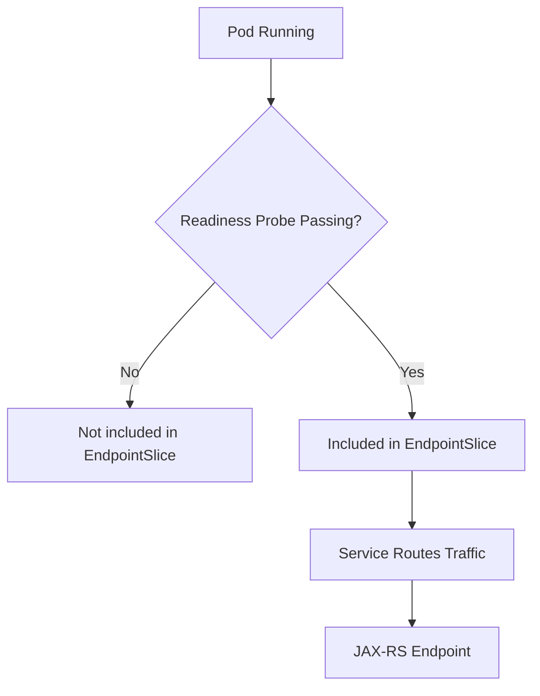

### Good readiness endpoint

A good readiness endpoint checks whether the process can safely receive traffic.

For JAX-RS API service, readiness may check:

- HTTP server is running
- request router is initialized
- critical config loaded
- service can process basic request path
- optionally shallow dependency state, if carefully designed

Avoid readiness that does deep blocking checks against every dependency if that creates cascading traffic removal during dependency degradation.

### Dependency check nuance

If readiness requires PostgreSQL to be healthy, then DB blip can remove all pods from service endpoints. That may be acceptable for some services, but dangerous for others.

Decision depends on semantics:

| Service type | Readiness dependency strategy |
|---|---|
| Pure API requiring DB for every request | DB readiness may be valid but must be bounded |
| API with degraded mode/cache fallback | readiness should allow degraded serving |
| Kafka consumer | readiness may reflect ability to consume safely |
| RabbitMQ consumer | readiness may reflect broker channel and consumer state |
| Camunda worker | readiness may reflect worker registration/activation ability |
| Batch job | readiness usually less relevant than job completion |

### Common readiness failures

- wrong path
- wrong port/name
- endpoint returns 500
- dependency check timeout
- app starts slower than expected
- config missing
- CPU throttling causes timeout
- thread pool saturated
- GC pause

### Safe commands

```bash
kubectl describe pod <pod-name> -n <namespace>
kubectl get endpointslice -n <namespace> -l kubernetes.io/service-name=<service-name>
kubectl logs <pod-name> -n <namespace>
```

---

## 14. Stage 8 — Liveness Probe

Liveness answers:

> Should Kubernetes restart this container because the process is unhealthy and cannot recover by itself?

Liveness is not readiness.

A bad liveness probe can turn transient slowness into restart storm.

### Good liveness endpoint

Good liveness is shallow:

- process alive
- HTTP server/event loop can respond
- internal fatal state not detected

Usually avoid checking external dependencies deeply in liveness.

### Bad liveness patterns

- liveness checks PostgreSQL deeply
- liveness checks Kafka broker deeply
- liveness checks all downstream HTTP services
- liveness has too short timeout for Java under GC pressure
- liveness shares saturated application thread pool with business requests
- liveness endpoint allocates heavy resources

### Failure mode

- liveness timeout during GC pause
- CPU throttling causes delayed response
- dependency slowness causes restart loop
- network hiccup restarts healthy process
- application thread pool exhaustion blocks health endpoint

### Safe commands

```bash
kubectl describe pod <pod-name> -n <namespace>
kubectl logs <pod-name> -n <namespace> --previous
kubectl top pod <pod-name> -n <namespace>
```

Correlate with:

- CPU throttling metric
- GC pause metric
- JVM thread count
- request latency
- restart count

---

## 15. Probe Design Matrix

| Probe | Main question | Should restart container? | Should receive traffic? | Typical depth |
|---|---|---:|---:|---|
| Startup | Has startup completed? | No, until failure threshold exceeded | No | Startup-specific |
| Readiness | Can receive traffic safely? | No | Yes/No | Shallow to bounded dependency-aware |
| Liveness | Is process unrecoverably unhealthy? | Yes | Not directly | Very shallow |

### Backend rule of thumb

- startup protects slow boot
- readiness protects traffic
- liveness protects stuck process

Do not use one endpoint for all three unless its semantics are intentionally designed for all three.

---

## 16. Probe Configuration Review

Example:

```yaml
ports:
  - name: http
    containerPort: 8080
  - name: management
    containerPort: 8081

startupProbe:
  httpGet:
    path: /health/startup
    port: management
  failureThreshold: 30
  periodSeconds: 5

readinessProbe:
  httpGet:
    path: /health/ready
    port: management
  initialDelaySeconds: 5
  periodSeconds: 10
  timeoutSeconds: 2
  failureThreshold: 3

livenessProbe:
  httpGet:
    path: /health/live
    port: management
  periodSeconds: 10
  timeoutSeconds: 2
  failureThreshold: 3
```

Review questions:

- Are ports named and stable?
- Does management port differ from app port?
- Are paths real in the app?
- Are timeouts realistic under CPU throttling?
- Is readiness too deep?
- Is liveness too aggressive?
- Is startup window enough for cold start?
- Are probe endpoints exposed only internally if needed?

---

## 17. Stage 9 — Serving Traffic

A Pod receives traffic after readiness passes and EndpointSlice includes it.

Path:

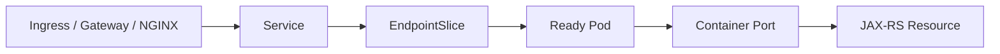

### Runtime concerns while serving

- request concurrency
- thread pool saturation
- DB pool saturation
- Redis pool saturation
- Kafka/RabbitMQ producer connection health
- HTTP client timeout
- downstream retry storm
- JVM GC pressure
- CPU throttling
- memory growth
- log volume
- trace propagation

### Production debugging signals

Check:

- pod readiness
- EndpointSlice membership
- ingress access logs
- app request metrics
- latency percentiles
- error rate
- JVM metrics
- DB pool metrics
- dependency metrics
- trace spans

### Safe commands

```bash
kubectl get pod -n <namespace> -l app.kubernetes.io/name=<service> -o wide
kubectl get endpointslice -n <namespace> -l kubernetes.io/service-name=<service-name>
kubectl logs -n <namespace> deploy/<deployment-name> --since=10m
```

Use label keys according to internal standard.

---

## 18. Multi-Container Pods

Some Pods have sidecars:

- service mesh proxy
- log agent
- metrics exporter
- secrets/cert reloader
- config reloader
- init/sidecar helper

### Operational concern

Pod readiness can depend on multiple containers. A sidecar failure can make app unavailable or block termination.

Safe commands:

```bash
kubectl get pod <pod-name> -n <namespace> -o jsonpath='{.spec.containers[*].name}'
kubectl logs <pod-name> -n <namespace> -c <container-name>
kubectl describe pod <pod-name> -n <namespace>
```

### Failure modes

- app healthy, sidecar not ready
- sidecar intercepts traffic incorrectly
- sidecar shutdown order breaks graceful drain
- cert reloader updates file but app does not reload
- log sidecar creates disk pressure

### Backend responsibility

Backend engineer should know whether sidecars exist and how they affect:

- traffic path
- readiness
- logs
- TLS/mTLS
- shutdown
- resource usage

---

## 19. Termination Lifecycle

Pod termination is critical during rollout, rollback, node drain, scale-down, and eviction.

Flow:

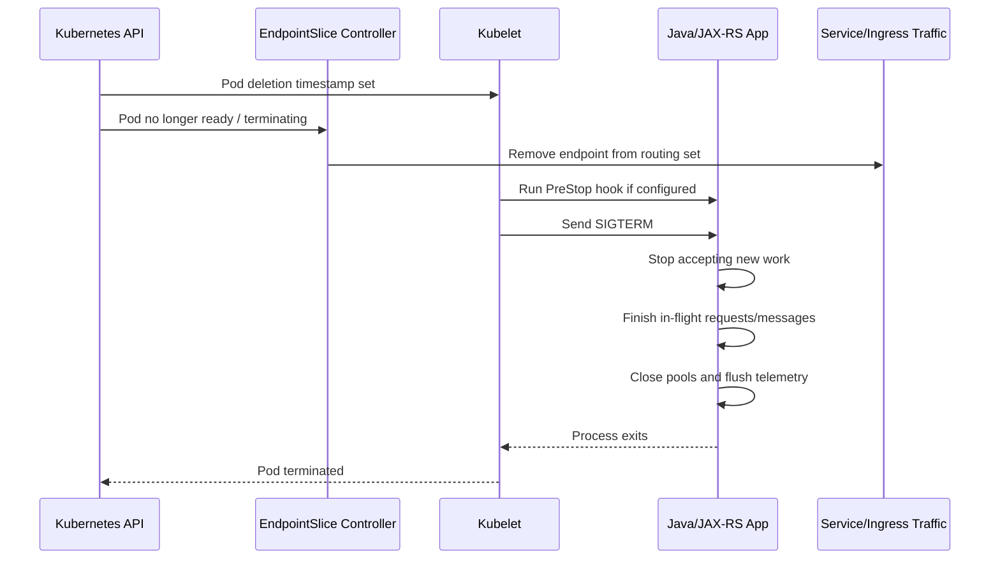

Important: Endpoint removal and external LB/ingress drain are not always instantaneous. There can be propagation delay.

---

## 20. SIGTERM and Java Graceful Shutdown

Kubernetes sends SIGTERM before SIGKILL.

Java apps should handle termination by:

- stopping HTTP listener or marking app not ready
- rejecting new requests
- allowing in-flight requests to finish
- stopping Kafka/RabbitMQ polling
- committing offsets or acking safely
- closing DB/Redis/HTTP pools
- flushing logs/metrics/traces
- exiting before grace period expires

### Common Java shutdown issues

- non-daemon threads keep process alive
- consumer continues polling after SIGTERM
- executor shutdown waits forever
- DB pool close blocks
- telemetry exporter blocks
- long request exceeds grace period
- liveness restarts app during shutdown

### Verification signal

Look for logs like:

```text
Received SIGTERM
Readiness set to false
Stopped accepting new HTTP requests
Waiting for in-flight requests: N
Kafka consumer paused
Offsets committed
Connection pools closed
Shutdown completed
```

If those logs do not exist, graceful shutdown may be invisible during incident.

---

## 21. PreStop Hook

PreStop hook runs before SIGTERM. It can be used to add drain delay or call a shutdown endpoint.

Example:

```yaml
lifecycle:
  preStop:
    exec:
      command: ["/bin/sh", "-c", "sleep 10"]
terminationGracePeriodSeconds: 60
```

### Use carefully

A simple sleep may help external load balancer propagation, but it also consumes grace period.

PreStop is not a replacement for application graceful shutdown.

### Dangerous PreStop patterns

- long sleep with short grace period
- calling endpoint that can hang
- doing DB mutation
- relying on PreStop for business consistency
- assuming PreStop always has unlimited time

### Review questions

- Why is PreStop needed?
- How long is endpoint propagation delay?
- Is the app also handling SIGTERM?
- Is terminationGracePeriodSeconds enough?
- Does PreStop fail safely?

---

## 22. terminationGracePeriodSeconds

`terminationGracePeriodSeconds` is the time Kubernetes gives the Pod to terminate before SIGKILL.

Example:

```yaml
terminationGracePeriodSeconds: 60
```

Sizing depends on workload type:

| Workload | Grace period consideration |
|---|---|
| JAX-RS API | max request duration + drain delay + telemetry flush |
| Kafka consumer | poll loop stop + processing current records + offset commit |
| RabbitMQ consumer | stop consuming + finish message + ack/nack |
| Camunda worker | finish/extend/complete/fail activated job safely |
| Batch job | checkpoint or safe stop behavior |
| File processing | temp file cleanup and partial output handling |

### Too short

- SIGKILL before in-flight request finishes
- duplicate message processing
- unacked messages redelivered unexpectedly
- workflow job timeout/incident
- partial file/job state

### Too long

- rollout slow
- node drain blocked
- stuck shutdown delays recovery
- PDB interactions become painful

---

## 23. Graceful Shutdown for JAX-RS API Service

For HTTP API service:

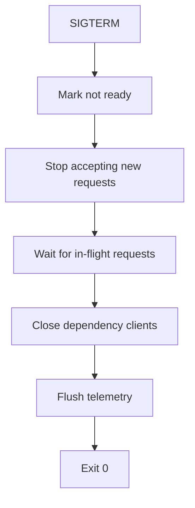

Operational concerns:

- request timeout must be less than grace period
- ingress timeout should not exceed app shutdown budget blindly
- readiness should flip false quickly
- app should not accept new business requests after shutdown starts
- background executor should stop taking tasks

### In-flight request example

If max request timeout is 30s and load balancer propagation delay is around 10s, a 45-60s grace period may be reasonable. But verify internal traffic path; do not assume.

### Internal verification checklist

- app logs SIGTERM
- readiness flips false during shutdown
- app server graceful shutdown enabled
- max request timeout known
- DB/HTTP pools close gracefully
- telemetry flush bounded
- shutdown tested in non-prod

---

## 24. Graceful Shutdown for Kafka Consumer

Kafka consumer termination must avoid:

- losing processed records before offset commit
- committing offsets before side effects complete
- long rebalance storm
- duplicate processing beyond acceptable semantics

Shutdown sequence:

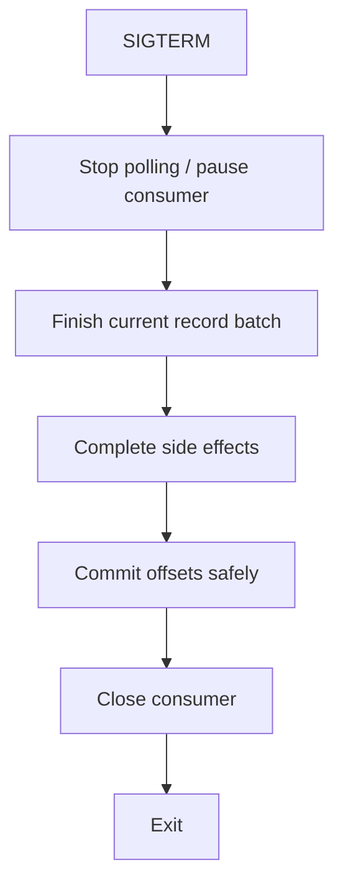

Review:

- Is processing idempotent?
- Is offset commit sync/async?
- What happens if SIGKILL before commit?
- How long can one message take?
- Does max.poll.interval align with processing time?
- Does rolling deployment trigger rebalance storm?

---

## 25. Graceful Shutdown for RabbitMQ Consumer

RabbitMQ consumer termination must handle:

- unacked messages
- redelivery
- prefetch count
- channel close
- connection close
- retry/DLQ behavior

Shutdown sequence:

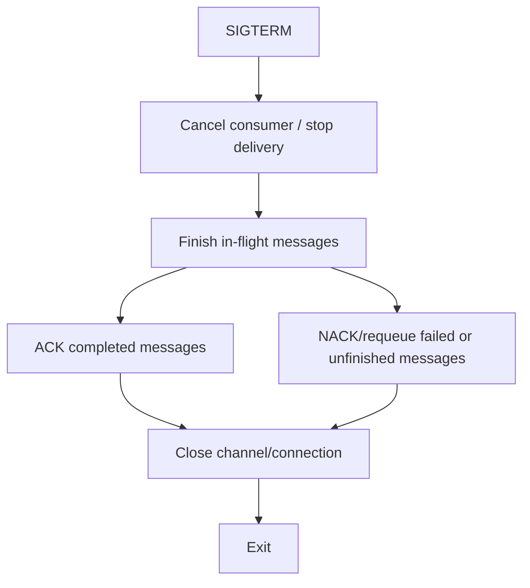

Review:

- prefetch too high can lengthen shutdown
- unacked messages may redeliver
- duplicate processing must be safe
- DLQ policy should be visible
- shutdown logs should include in-flight count

---

## 26. Graceful Shutdown for Camunda Worker

Camunda worker shutdown must consider activated jobs.

Operational questions:

- What happens to activated but unfinished job?
- Is job timeout long enough?
- Does worker complete/fail job before exit?
- Are retries configured?
- Does pod restart create incident spike?
- Is worker concurrency too high for graceful shutdown?

Shutdown sequence:

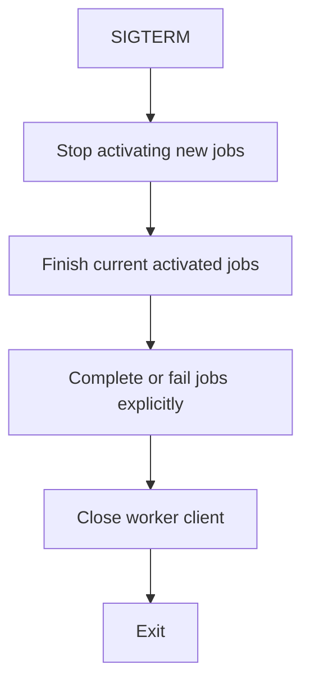

Backend engineer must understand process impact, not only pod status.

---

## 27. Termination During Rollout

During rolling update, old pods terminate while new pods start.

Risk appears when:

- maxUnavailable too high
- new pods are not ready
- old pods terminate too quickly
- readiness does not reflect true availability
- graceful shutdown is broken
- DB migration is incompatible
- consumers rebalance too aggressively

Sequence:

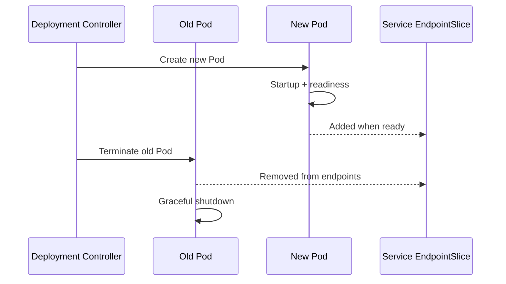

If readiness lies, rollout lies.

---

## 28. Termination During Node Drain

Node drain creates voluntary disruption.

Backend engineer should know:

- PDB can limit disruption
- pods receive SIGTERM
- replacement pods may start elsewhere
- local ephemeral data may be lost
- connection draining still matters
- node drain may coincide with cluster upgrade

Safe investigation:

```bash
kubectl get pod <pod-name> -n <namespace> -o wide
kubectl describe pod <pod-name> -n <namespace>
kubectl get pdb -n <namespace>
```

Escalate to platform/SRE if multiple workloads on same node show disruption.

---

## 29. Termination During Eviction

Eviction may happen due to:

- memory pressure
- disk pressure
- PID pressure
- node not ready
- ephemeral storage overuse

Eviction is not the same as normal rollout.

Signals:

```bash
kubectl describe pod <pod-name> -n <namespace>
kubectl describe node <node-name>
```

Look for:

- `Evicted`
- `The node was low on resource`
- memory pressure
- disk pressure
- ephemeral storage usage

Backend impact:

- abrupt loss of local temp files
- in-flight request interruption
- message redelivery
- job partial completion
- cache warmup repeated

---

## 30. Lifecycle and EndpointSlice

Readiness controls EndpointSlice membership.

EndpointSlice debugging:

```bash
kubectl get endpointslice -n <namespace> -l kubernetes.io/service-name=<service-name> -o wide
kubectl describe endpointslice <endpoint-slice-name> -n <namespace>
```

What to check:

- endpoint addresses
- ready condition
- serving condition
- terminating condition
- port name/number
- service selector

Operational issue:

A pod can be Running but absent from EndpointSlice if readiness is false.

Ingress 503 often maps to no ready endpoints.

---

## 31. Lifecycle and Observability

A good service exposes lifecycle observability.

### Minimum logs

- startup begin/end
- config loaded safely without secret values
- readiness state changes
- dependency client initialization
- SIGTERM received
- shutdown begin/end
- in-flight request/message count during shutdown
- fatal startup errors

### Minimum metrics

- pod restart count
- readiness status
- startup duration
- JVM memory/GC
- CPU throttling
- request latency/error
- dependency pool usage
- in-flight requests
- consumer lag/queue depth
- shutdown duration if available

### Minimum traces

- inbound HTTP request spans
- outbound dependency spans
- messaging propagation where relevant
- deployment marker correlation

### Kubernetes signals

- events
- pod condition
- container restart count
- exit code
- last termination state

---

## 32. Common Failure Mode: Pod Stuck Pending

Investigation:

```bash
kubectl describe pod <pod-name> -n <namespace>
kubectl get events -n <namespace> --sort-by=.lastTimestamp
kubectl get quota -n <namespace>
kubectl get hpa -n <namespace>
```

Likely causes:

- insufficient CPU/memory
- quota exceeded
- node selector mismatch
- affinity too strict
- taint not tolerated
- PVC pending
- autoscaler cannot scale
- zone capacity issue

Backend-safe mitigation:

- identify recent resource/placement change
- confirm desired replicas
- reduce rollout blast radius if possible
- escalate node/autoscaler/capacity issue

Do not reduce resources blindly to “make it schedule”. That can turn Pending into OOM/throttling.

---

## 33. Common Failure Mode: Startup Probe Failing

Investigation:

```bash
kubectl describe pod <pod-name> -n <namespace>
kubectl logs <pod-name> -n <namespace>
kubectl logs <pod-name> -n <namespace> --previous
```

Likely causes:

- app startup slower than configured window
- wrong health path
- wrong management port
- config parsing failure
- dependency initialization blocking
- CPU throttling
- OOM during startup

Mitigation:

- rollback if caused by release
- fix probe path/port if manifest error
- adjust startup window if evidence supports slow boot
- remove deep dependency check from startup if inappropriate
- escalate node/resource issue if platform-related

---

## 34. Common Failure Mode: Readiness Never True

Investigation:

```bash
kubectl describe pod <pod-name> -n <namespace>
kubectl get endpointslice -n <namespace> -l kubernetes.io/service-name=<service-name>
kubectl logs <pod-name> -n <namespace> --since=10m
```

Likely causes:

- wrong readiness path/port
- endpoint returns non-2xx
- dependency check failing
- app stuck initializing
- secret/config missing
- DB pool cannot initialize
- thread pool saturation

Mitigation:

- confirm readiness endpoint semantics
- compare with previous version
- check config/secret drift
- check dependency health
- rollback if release introduced failure

---

## 35. Common Failure Mode: Liveness Restart Loop

Investigation:

```bash
kubectl describe pod <pod-name> -n <namespace>
kubectl logs <pod-name> -n <namespace> --previous
kubectl top pod <pod-name> -n <namespace>
```

Correlate with:

- GC pause
- CPU throttling
- latency spike
- node pressure
- dependency timeout
- thread pool saturation

Likely causes:

- liveness too deep
- liveness timeout too short
- health endpoint blocked by app thread pool
- JVM pause
- CPU limit too restrictive
- actual deadlock/hang

Mitigation:

- rollback bad probe config
- tune liveness threshold carefully
- separate health endpoint execution path
- investigate JVM/thread dump only if policy allows

---

## 36. Common Failure Mode: SIGKILL During Shutdown

Signal:

- exit code 137
- pod terminated after grace period
- logs show shutdown started but not completed
- request/message duplication after rollout

Investigation:

```bash
kubectl describe pod <pod-name> -n <namespace>
kubectl logs <pod-name> -n <namespace> --previous
kubectl get deploy <deployment-name> -n <namespace> -o yaml | grep -A5 terminationGracePeriodSeconds
```

Likely causes:

- grace period too short
- PreStop consumes too much time
- app does not handle SIGTERM
- consumer has too many in-flight messages
- request timeout exceeds grace period
- executor/pool close blocks

Mitigation:

- tune grace period based on evidence
- fix application shutdown path
- lower consumer concurrency/prefetch during rollout if needed
- add shutdown logs/metrics

---

## 37. Common Failure Mode: Pod Ready But Traffic Fails

If Pod is Ready but users see errors, readiness may be insufficient or traffic mapping broken.

Check:

```bash
kubectl get endpointslice -n <namespace> -l kubernetes.io/service-name=<service-name>
kubectl describe ingress <ingress-name> -n <namespace>
kubectl get svc <service-name> -n <namespace> -o yaml
kubectl logs -n <namespace> deploy/<deployment-name> --since=10m
```

Likely causes:

- readiness endpoint shallow but app path broken
- service targetPort mismatch
- ingress path rewrite issue
- TLS/backend protocol mismatch
- app route missing
- dependency failure only on business endpoint
- wrong config environment

This is why readiness must be meaningful but not dangerously deep.

---

## 38. Production-Safe Pod Debugging Flow

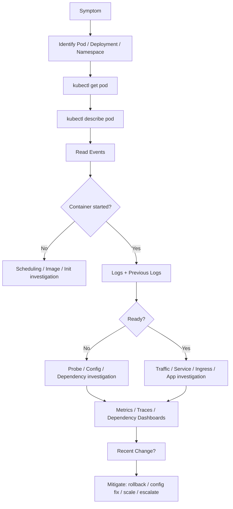

### Safe default command sequence

```bash
kubectl get pod -n <namespace> -o wide
kubectl describe pod <pod-name> -n <namespace>
kubectl logs <pod-name> -n <namespace> --since=15m
kubectl logs <pod-name> -n <namespace> --previous
kubectl get events -n <namespace> --sort-by=.lastTimestamp
kubectl get endpointslice -n <namespace>
kubectl get deploy,rs -n <namespace>
```

Use `exec`, `debug`, or `port-forward` only under approved policy.

---

## 39. Safe vs Dangerous Operational Actions

### Usually safe read-only actions

- `kubectl get`
- `kubectl describe`
- `kubectl logs`
- `kubectl top`
- `kubectl auth can-i`
- dashboard/log/trace queries
- GitOps diff review

### Requires caution/approval

- `kubectl exec`
- `kubectl debug`
- `kubectl port-forward`
- reading mounted files
- collecting heap/thread dumps
- scaling replicas manually
- restarting pods

### Dangerous actions

- deleting pods blindly during incident
- editing live Deployment outside GitOps
- dumping Secret values
- disabling readiness/liveness without review
- reducing resource requests blindly
- removing NetworkPolicy/RBAC to “test quickly”
- forcing rollout during unknown incident

---

## 40. Pod Lifecycle and GitOps

If GitOps is used, lifecycle configuration comes from Git:

- probes
- lifecycle hooks
- resources
- env/config/secret refs
- image tag/digest
- service account
- labels/selectors
- rollout strategy

Manual cluster changes may be reverted by GitOps reconciliation.

Backend engineer should verify:

```bash
kubectl get deploy <deployment-name> -n <namespace> -o yaml
```

Then compare against:

- Helm values
- Kustomize overlay
- rendered manifest
- Argo CD/Flux app state
- last Git commit

Operational principle:

> If the source of truth is Git, the durable fix is Git, not ad-hoc cluster mutation.

---

## 41. EKS-Specific Pod Lifecycle Awareness

In EKS, Pod lifecycle can be affected by:

- VPC CNI IP allocation
- subnet IP exhaustion
- managed node group capacity
- Karpenter/Cluster Autoscaler provisioning delay
- ECR access
- IRSA token projection for cloud API access
- EBS CSI mount for PVC workloads
- AWS Load Balancer Controller endpoint propagation

Backend engineer should ask:

- is Pending caused by subnet IP exhaustion?
- is ImagePullBackOff caused by ECR permission or private endpoint?
- is PVC mount issue caused by EBS CSI?
- is cloud access failure workload identity related?
- is ingress target health delayed?

Escalate EKS platform layer issues with clear evidence.

---

## 42. AKS-Specific Pod Lifecycle Awareness

In AKS, Pod lifecycle can be affected by:

- Azure CNI subnet capacity
- node pool scaling delay
- ACR pull permission
- Azure Workload Identity token projection
- Key Vault CSI driver mount
- Azure Disk CSI mount
- Application Gateway Ingress Controller propagation
- NSG/UDR/private DNS issues

Backend engineer should ask:

- is image pull failure due to ACR integration?
- is secret mount failure due to Key Vault CSI?
- is Pending due to node pool capacity?
- is DNS failure private endpoint/private DNS related?

---

## 43. On-Prem/Hybrid Pod Lifecycle Awareness

In on-prem/hybrid clusters, Pod lifecycle may depend on:

- corporate DNS
- internal CA trust
- proxy/NO_PROXY
- firewall rules
- air-gapped registry sync
- on-prem storage backend
- internal load balancer
- hybrid cloud connectivity

Failure modes are often network/certificate/proxy related, not Kubernetes object syntax.

Internal verification is mandatory; do not assume cloud-managed behavior.

---

## 44. Pod Lifecycle PR Review Checklist

Review Kubernetes changes for:

### Scheduling

- resource requests realistic?
- affinity/selector/taint constraints intentional?
- quota impact understood?
- HPA max replica schedulable?

### Startup

- image tag/digest valid?
- init containers bounded and idempotent?
- startup probe exists for slow Java service?
- startup threshold realistic?

### Readiness

- readiness path correct?
- readiness semantics appropriate?
- dependency checks bounded?
- Service/EndpointSlice behavior understood?

### Liveness

- liveness shallow?
- timeout realistic?
- does not depend deeply on external systems?

### Termination

- SIGTERM handled?
- grace period sufficient?
- PreStop justified?
- consumer/job shutdown safe?

### Observability

- startup/shutdown logs present?
- restart/probe metrics visible?
- dashboard has pod lifecycle panels?
- alert links to runbook?

---

## 45. Internal Verification Checklist

For CSG/team internal validation, verify actual values instead of assuming:

### Cluster and namespace

- Which namespace does the service run in?
- Is namespace per environment, team, product, or tenant?
- What quota/LimitRange applies?
- Are there admission policies affecting pod specs?

### Workload manifest

- Deployment/StatefulSet/Job owner
- image tag/digest
- resource requests/limits
- startup/readiness/liveness probes
- lifecycle hooks
- terminationGracePeriodSeconds
- serviceAccountName
- configMap/secret refs
- volume mounts

### Runtime behavior

- Java version and JVM flags
- management endpoint path/port
- app server graceful shutdown configuration
- thread pool and connection pool behavior
- Kafka/RabbitMQ/Camunda shutdown handling
- startup duration baseline
- shutdown duration baseline

### Traffic behavior

- Service selector and EndpointSlice behavior
- Ingress/NGINX/Gateway route
- endpoint propagation delay
- external LB drain behavior
- timeout chain

### Observability

- pod lifecycle dashboard
- restart alert
- readiness alert
- probe failure alert
- deployment marker
- logs for startup/shutdown
- trace correlation

### Platform/SRE boundary

- Who owns node issues?
- Who owns CNI/networking?
- Who owns ingress controller?
- Who owns metrics server?
- Who owns registry integration?
- Who owns cluster autoscaler?
- What is escalation path during incident?

---

## 46. Operational Anti-Patterns

Avoid:

- using liveness as deep dependency health check
- using readiness as full integration test
- no startup probe for slow Java apps
- terminationGracePeriodSeconds too short for consumers
- PreStop sleep without understanding drain path
- migration inside init container without lock/observability
- dumping secret values during debugging
- deleting pods repeatedly to “fix” CrashLoopBackOff
- scaling replicas without checking dependency capacity
- assuming Running means Ready
- assuming Ready means business endpoint works
- editing live pod instead of owner manifest/GitOps source

---

## 47. Production Runbook Template — Pod Lifecycle Incident

Use this structure for pod lifecycle incidents.

```md
# Pod Lifecycle Incident Runbook

## Symptom
- Pod status:
- Affected namespace:
- Affected workload:
- User/business impact:

## Current state
- Deployment/ReplicaSet:
- Pod phase:
- Container state:
- Pod conditions:
- Restart count:
- EndpointSlice membership:

## Recent changes
- Deployment:
- ConfigMap/Secret:
- Image:
- GitOps sync:
- Node/platform maintenance:

## Evidence
- Events:
- Current logs:
- Previous logs:
- Metrics:
- Traces:
- Dependency dashboard:

## Hypothesis
- Scheduling issue:
- Image issue:
- Startup issue:
- Readiness/liveness issue:
- Resource issue:
- Dependency issue:
- Platform issue:

## Mitigation
- Rollback:
- Config fix:
- Scale action:
- Traffic drain:
- Escalation:

## Follow-up
- Probe tuning:
- Shutdown improvement:
- Resource tuning:
- Runbook update:
- Alert/dashboard improvement:
```

---

## 48. Key Takeaways

- Pod lifecycle is the operational spine of Kubernetes workload debugging.
- `Running` is not the same as `Ready`.
- Readiness controls traffic; liveness controls restart; startup protects slow boot.
- Java/JAX-RS services need explicit startup, readiness, shutdown, JVM, and pool awareness.
- Consumers and workers need shutdown semantics tied to ack/commit/job completion.
- Most pod symptoms require evidence from events, logs, metrics, manifest, and recent changes.
- Production-safe debugging starts read-only and escalates carefully.
- If GitOps owns the desired state, durable lifecycle fixes must go through Git.

---

## 49. Practice Exercises

1. Pick one non-production Java API Deployment and map its full pod lifecycle from manifest to ready endpoint.
2. Identify startup, readiness, and liveness probes. Explain what each endpoint actually proves.
3. Check whether the service logs SIGTERM and shutdown completion.
4. Compare `terminationGracePeriodSeconds` against max request timeout and consumer processing time.
5. Trigger a safe non-prod rollout and observe EndpointSlice membership during pod replacement.
6. Review whether readiness depends on PostgreSQL/Kafka/RabbitMQ/Redis/Camunda and whether that dependency check is justified.
7. Build a mini runbook for one pod lifecycle failure: Pending, ImagePullBackOff, CrashLoopBackOff, readiness failure, or SIGKILL.

---

## 50. Next Part

Part 010 akan membahas **Deployment Operations**: Deployment, ReplicaSet, replica, revision, rollout, rollback, progress deadline, available condition, updated/ready/unavailable replicas, rollout history, dan cara membaca deployment state secara production-safe.
