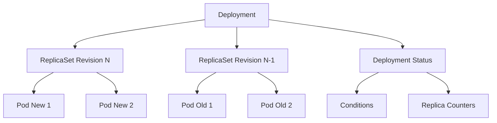
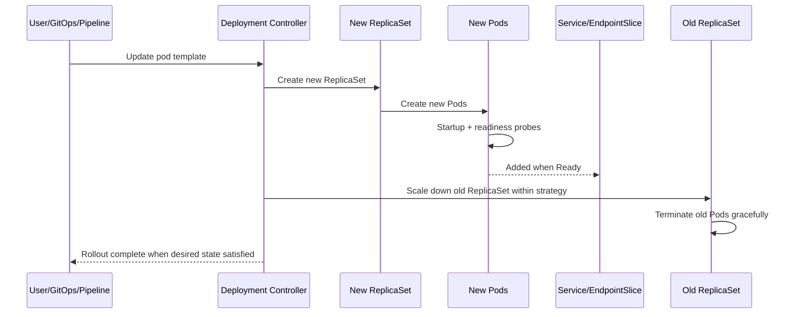
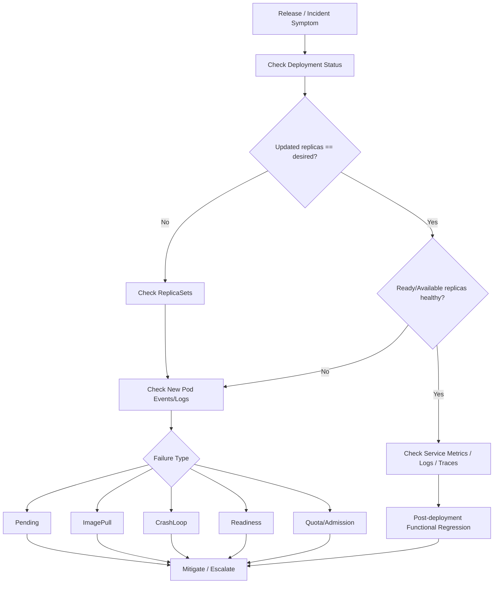

# Part 010 — Deployment Operations

> Deployment adalah kontrak antara service owner dan Kubernetes: “jalankan versi workload ini dengan jumlah replica ini, strategi rollout ini, dan kondisi availability ini.” Saat production incident terjadi setelah release, Deployment adalah salah satu object pertama yang harus dibaca.

Untuk backend engineer, Deployment bukan sekadar YAML yang membuat Pod. Deployment adalah mekanisme release safety: ia membuat ReplicaSet, menciptakan Pod baru, menghentikan Pod lama, menjaga availability, mencatat revision, dan memberi status apakah rollout berhasil, stuck, atau gagal progress.

Part ini membahas Deployment operations untuk Java 17+ / JAX-RS / Jakarta RESTful service, Kafka/RabbitMQ consumers, Redis-backed service, Camunda worker, batch-adjacent workloads, PostgreSQL dependency, NGINX/Ingress traffic, GitOps, EKS, AKS, observability, dan incident response.

---

## 1. Core Concept

Deployment mengelola desired state untuk stateless replicated workload.

Deployment menjawab:

- image/version apa yang harus berjalan?
- berapa replica yang diinginkan?
- bagaimana rollout dilakukan?
- berapa pod boleh unavailable?
- berapa pod tambahan boleh dibuat sementara?
- apakah rollout masih progressing?
- apakah minimum availability tercapai?
- revision mana yang sedang aktif?
- bagaimana rollback dilakukan?

Hubungan object:



Deployment adalah control object. Pod adalah runtime object. ReplicaSet adalah versioned pod template holder.

---

## 2. Why Deployment Matters Operationally

Deployment menentukan apakah release:

- berjalan aman
- mengganti pod lama secara bertahap
- menjaga minimum availability
- stuck karena pod baru tidak ready
- gagal karena image/config/probe/resource issue
- bisa rollback cepat
- meninggalkan ReplicaSet lama sebagai fallback

Deployment operations penting untuk:

- release verification
- incident triage setelah deploy
- rollback decision
- capacity planning saat rolling update
- migration coordination
- dependency pressure control
- rollout blast radius
- GitOps reconciliation

---

## 3. Backend Engineer Responsibility

Backend service owner perlu memahami:

- Deployment mana yang menjalankan service
- image tag/digest yang sedang live
- replica count aktual vs desired
- rollout strategy
- maxSurge/maxUnavailable
- revision history
- readiness gate terhadap rollout
- impact rollout ke HTTP traffic atau consumer processing
- rollback path
- post-deployment verification
- GitOps source of truth

Backend engineer biasanya tidak perlu:

- mengubah global deployment controller behavior
- mengelola node drain/cluster upgrade secara langsung
- mengubah admission policy
- melakukan manual production patch tanpa proses

Tetapi backend engineer harus bisa membaca Deployment state dan memberi evidence yang jelas saat release bermasalah.

---

## 4. Deployment vs ReplicaSet vs Pod

| Object | Fungsi | Operasional concern |
|---|---|---|
| Deployment | Desired state dan rollout strategy | Apakah rollout sukses/stuck? |
| ReplicaSet | Menjaga replica untuk satu pod template revision | Mana versi lama/baru? |
| Pod | Runtime process aktual | Apakah container healthy/ready? |

Mental model:

- Deployment mengatur ReplicaSet
- ReplicaSet membuat Pod
- Pod menjalankan container
- readiness Pod menentukan apakah rollout bisa lanjut
- Deployment status mencerminkan aggregate state

---

## 5. Deployment Anatomy

Minimal fields yang penting secara operasional:

```yaml
apiVersion: apps/v1
kind: Deployment
metadata:
  name: quote-api
  labels:
    app.kubernetes.io/name: quote-api
spec:
  replicas: 3
  revisionHistoryLimit: 5
  progressDeadlineSeconds: 600
  strategy:
    type: RollingUpdate
    rollingUpdate:
      maxSurge: 1
      maxUnavailable: 0
  selector:
    matchLabels:
      app.kubernetes.io/name: quote-api
  template:
    metadata:
      labels:
        app.kubernetes.io/name: quote-api
        app.kubernetes.io/version: "1.42.0"
    spec:
      containers:
        - name: app
          image: registry.example.com/quote-api:1.42.0
          ports:
            - name: http
              containerPort: 8080
```

Review focus:

- `replicas`
- `revisionHistoryLimit`
- `progressDeadlineSeconds`
- `strategy`
- `selector`
- pod template labels
- image tag/digest
- probes
- resources
- env/config/secret refs
- ServiceAccount
- topology constraints

---

## 6. Deployment Status Counters

Key counters:

| Field | Meaning |
|---|---|
| `spec.replicas` | desired replica count |
| `status.replicas` | total non-terminated pods targeted by deployment |
| `status.updatedReplicas` | pods created from latest pod template |
| `status.readyReplicas` | pods with Ready condition true |
| `status.availableReplicas` | ready for at least minReadySeconds |
| `status.unavailableReplicas` | desired replicas not available |
| `status.observedGeneration` | controller has observed latest spec generation |

Safe command:

```bash
kubectl get deploy <deployment-name> -n <namespace> -o wide
kubectl describe deploy <deployment-name> -n <namespace>
```

Detailed JSONPath:

```bash
kubectl get deploy <deployment-name> -n <namespace> \
  -o jsonpath='{.status.replicas}{" total, "}{.status.updatedReplicas}{" updated, "}{.status.readyReplicas}{" ready, "}{.status.availableReplicas}{" available, "}{.status.unavailableReplicas}{" unavailable\n"}'
```

---

## 7. Deployment Conditions

Deployment conditions tell whether rollout and availability are healthy.

Common conditions:

| Condition | Meaning |
|---|---|
| `Available=True` | minimum availability satisfied |
| `Progressing=True` | rollout is progressing or complete |
| `Progressing=False` | rollout failed progress deadline |
| `ReplicaFailure=True` | failed creating pods, often quota/admission issue |

Inspect:

```bash
kubectl describe deploy <deployment-name> -n <namespace>
```

Look for:

- `MinimumReplicasAvailable`
- `NewReplicaSetAvailable`
- `ReplicaSetUpdated`
- `ProgressDeadlineExceeded`
- `FailedCreate`

### Important nuance

`Available=True` does not guarantee business health. It means Kubernetes availability condition is satisfied. Application-level SLO, latency, error rate, dependency failure, and functional correctness still need observability.

---

## 8. Rollout Lifecycle

Rolling update flow:



Rollout depends heavily on readiness. If new Pods never become ready, Deployment should not fully replace old Pods under safe strategy.

---

## 9. RollingUpdate Strategy

Deployment default strategy is RollingUpdate.

Fields:

```yaml
strategy:
  type: RollingUpdate
  rollingUpdate:
    maxSurge: 1
    maxUnavailable: 0
```

### maxSurge

`maxSurge` controls how many extra Pods can exist above desired replicas during rollout.

Example: replicas = 4, maxSurge = 1

- up to 5 pods can exist temporarily
- dependency connection count can spike
- node capacity must allow surge pod

### maxUnavailable

`maxUnavailable` controls how many desired Pods can be unavailable during rollout.

Example: replicas = 4, maxUnavailable = 1

- only 3 available may be acceptable during rollout
- riskier for latency-sensitive service

### Operational trade-off

| Strategy | Benefit | Risk |
|---|---|---|
| maxSurge high | faster rollout | capacity spike, dependency connection spike |
| maxSurge low | less capacity spike | slower rollout |
| maxUnavailable 0 | safer availability | needs extra capacity |
| maxUnavailable high | faster replacement | traffic capacity loss |

---

## 10. Java/JAX-RS Deployment Considerations

For Java API service, rollout behavior interacts with:

- JVM startup time
- readiness endpoint correctness
- HTTP server graceful shutdown
- request timeout
- DB pool warmup
- Redis cache warmup
- Kafka/RabbitMQ producer connection
- class loading/JIT warmup
- CPU throttling during startup

### Common rollout issue

New Pod becomes Ready before it can actually handle production traffic.

Symptoms:

- rollout completes
- error rate rises
- latency rises
- traces show dependency timeout
- old pods already terminated

Cause:

- readiness endpoint too shallow
- missing post-deployment smoke test
- config accepted but functionally wrong
- dependency path not checked

### Correct response

- use deployment marker to correlate release
- check error budget/SLO burn
- compare old/new version metrics
- rollback if release-caused and impact significant
- fix readiness/smoke test gap afterward

---

## 11. Deployment for Consumer Workloads

Deployment can run Kafka/RabbitMQ consumers, but rollout semantics differ from HTTP services.

### Kafka consumer rollout concerns

- each pod restart can trigger rebalance
- replica count should consider partition count
- new version may process messages differently
- rollback may process mixed semantics
- graceful shutdown must commit offsets safely

### RabbitMQ consumer rollout concerns

- unacked messages may redeliver
- prefetch affects in-flight message count
- new/old versions may process messages differently
- DLQ/retry behavior must be compatible

### Camunda worker rollout concerns

- activated jobs may timeout if shutdown is not graceful
- worker version compatibility matters
- process model and worker deployment must be coordinated

### Backend review questions

- Is rollout safe with multiple versions consuming concurrently?
- Are message schemas backward/forward compatible?
- Is processing idempotent?
- Is shutdown safe?
- Does maxSurge create too many consumers temporarily?

---

## 12. Deployment Selectors Are Immutable and Dangerous

Deployment selector connects Deployment to Pods via ReplicaSet.

Example:

```yaml
selector:
  matchLabels:
    app.kubernetes.io/name: quote-api
```

Operational danger:

- selector mismatch means Deployment does not manage intended Pods
- Service selector mismatch means traffic goes nowhere or to wrong Pods
- changing selector is restricted and can be destructive

Review:

```bash
kubectl get deploy <deployment-name> -n <namespace> -o yaml | grep -A10 selector
kubectl get pods -n <namespace> --show-labels
kubectl get svc <service-name> -n <namespace> -o yaml | grep -A10 selector
```

Rule:

> Deployment selector, pod template labels, and Service selector must form a consistent chain.

---

## 13. Revision and Rollout History

Each pod template change creates new ReplicaSet revision.

Commands:

```bash
kubectl rollout history deploy/<deployment-name> -n <namespace>
kubectl rollout history deploy/<deployment-name> -n <namespace> --revision=<revision>
```

Rollout history is useful for:

- identifying previous revision
- rollback target
- correlating deployment with incident
- understanding what changed

But in GitOps environments, `kubectl rollout undo` may not be the durable rollback method. Git revert or GitOps rollback may be required.

---

## 14. revisionHistoryLimit

`revisionHistoryLimit` controls how many old ReplicaSets are kept.

Example:

```yaml
revisionHistoryLimit: 5
```

Operational trade-off:

- too low: rollback target may disappear
- too high: clutter and old ReplicaSets remain

Note:

Old ReplicaSets usually have zero replicas but preserve pod template for rollback.

Check:

```bash
kubectl get rs -n <namespace> -l app.kubernetes.io/name=<service-name>
```

---

## 15. progressDeadlineSeconds

`progressDeadlineSeconds` defines how long Deployment waits for progress before marking rollout failed.

Example:

```yaml
progressDeadlineSeconds: 600
```

If new Pods do not become ready within deadline:

- condition may become `Progressing=False`
- reason may be `ProgressDeadlineExceeded`

### Common causes

- new image crashes
- readiness never passes
- pod Pending due to resources
- image pull failure
- bad config/secret
- admission/quota failure
- init container stuck

Safe command:

```bash
kubectl rollout status deploy/<deployment-name> -n <namespace> --timeout=5m
kubectl describe deploy <deployment-name> -n <namespace>
```

---

## 16. minReadySeconds

`minReadySeconds` requires a Pod to be ready for a minimum time before considered available.

Example:

```yaml
minReadySeconds: 30
```

Useful when:

- app may pass readiness briefly then fail
- warmup requires short stability window
- readiness flaps during startup

Trade-off:

- safer availability signal
- slower rollout

For Java services with startup warmup, `minReadySeconds` can be useful, but it should be based on observed behavior.

---

## 17. Rollout Status Reading

Command:

```bash
kubectl rollout status deploy/<deployment-name> -n <namespace>
```

Possible interpretations:

| Output | Interpretation |
|---|---|
| successfully rolled out | Kubernetes rollout complete |
| waiting for deployment rollout to finish | new pods not fully available yet |
| exceeded progress deadline | rollout stuck/failing |

Important:

Successful rollout means Kubernetes desired state met. It does not mean:

- zero application errors
- no latency regression
- dependency calls healthy
- business flow correct
- quote/order workflow correct

Always combine rollout status with service metrics and smoke tests.

---

## 18. Deployment Debugging Flow



Safe sequence:

```bash
kubectl get deploy <deployment-name> -n <namespace> -o wide
kubectl describe deploy <deployment-name> -n <namespace>
kubectl get rs -n <namespace> -l app.kubernetes.io/name=<service-name>
kubectl get pod -n <namespace> -l app.kubernetes.io/name=<service-name> -o wide
kubectl describe pod <new-pod-name> -n <namespace>
kubectl logs <new-pod-name> -n <namespace> --since=15m
```

---

## 19. Rollout Stuck: Updated Replicas Low

If `updatedReplicas` is lower than desired:

Possible causes:

- rollout paused
- Deployment controller blocked by strategy
- old Pods not terminating
- PDB or availability constraint
- quota/admission failure
- ReplicaSet creation issue

Check:

```bash
kubectl describe deploy <deployment-name> -n <namespace>
kubectl get rs -n <namespace>
kubectl get events -n <namespace> --sort-by=.lastTimestamp
kubectl get pdb -n <namespace>
```

Operational interpretation:

The controller cannot create or scale new revision to expected level.

---

## 20. Rollout Stuck: Pods Created But Not Ready

If new Pods exist but readiness is false:

Possible causes:

- readiness path/port wrong
- startup too slow
- dependency check failing
- config/secret issue
- CPU/memory issue
- application bug

Check:

```bash
kubectl get pod -n <namespace> -l pod-template-hash=<hash> -o wide
kubectl describe pod <pod-name> -n <namespace>
kubectl logs <pod-name> -n <namespace>
```

Operational interpretation:

Deployment is doing its job by not considering broken Pods available.

---

## 21. Rollout Stuck: Old Pods Not Terminating

Old Pods may remain because:

- new Pods not ready
- maxUnavailable=0 and no surge capacity
- terminationGracePeriodSeconds long
- PreStop hook stuck
- finalizer/custom behavior
- node issue

Check:

```bash
kubectl get pod -n <namespace> -l app.kubernetes.io/name=<service-name> -o wide
kubectl describe pod <old-pod-name> -n <namespace>
kubectl logs <old-pod-name> -n <namespace> --previous
```

Be careful before deleting old Pods. They may be the only serving capacity.

---

## 22. Rollout Paused

Deployment can be paused:

```bash
kubectl rollout pause deploy/<deployment-name> -n <namespace>
```

Resume:

```bash
kubectl rollout resume deploy/<deployment-name> -n <namespace>
```

In production, pausing/resuming should follow release process.

Check paused state:

```bash
kubectl get deploy <deployment-name> -n <namespace> -o yaml | grep paused
```

Use cases:

- stop rollout while investigating
- batch multiple manifest changes before resume
- manually gate progressive release

GitOps caution:

Manual pause may be reverted or conflict with GitOps desired state.

---

## 23. Rollback Operations

Imperative rollback:

```bash
kubectl rollout undo deploy/<deployment-name> -n <namespace>
```

Rollback to revision:

```bash
kubectl rollout undo deploy/<deployment-name> -n <namespace> --to-revision=<revision>
```

But in GitOps, durable rollback usually means:

- revert Git commit
- update image tag/digest in Git
- sync Argo CD/Flux
- verify deployment

### Rollback decision inputs

Rollback when:

- incident correlates strongly with recent deployment
- error rate/latency/SLO burn unacceptable
- new pods crash or never ready
- bad config/image/secret introduced
- smoke test fails
- mitigation through config is slower/riskier than rollback

Do not rollback blindly when:

- DB migration is not backward compatible
- old version cannot read new data/schema
- message format changed incompatibly
- external dependency changed in parallel
- rollback would worsen state inconsistency

---

## 24. Rollback and Database Migration Risk

Deployment rollback is easy only if application and data remain compatible.

Risk scenarios:

- new version applies destructive schema migration
- old version cannot read new column semantics
- enum/state machine values changed
- event schema changed
- cache format changed
- Camunda process/job behavior changed

Safer approach:

- expand-contract migration
- backward-compatible reads/writes
- feature flags
- migration Job with approval
- post-deployment verification
- explicit rollback limitation documented

For quote/order lifecycle, schema and workflow compatibility must be treated as production safety concern, not only database concern.

---

## 25. Deployment and Service Availability

Deployment availability depends on readiness and strategy.

Service availability depends on:

- ready endpoints
- ingress/gateway route
- app behavior
- dependency availability
- resource saturation

You can have:

- Deployment available but endpoint returns business errors
- Pods ready but ingress misconfigured
- rollout complete but dependency pool exhausted
- replicas healthy but Kafka lag increasing

Therefore, post-deployment verification must include application-level signals.

---

## 26. Post-Deployment Verification

After rollout:

### Kubernetes-level

```bash
kubectl rollout status deploy/<deployment-name> -n <namespace>
kubectl get deploy <deployment-name> -n <namespace> -o wide
kubectl get pod -n <namespace> -l app.kubernetes.io/name=<service-name> -o wide
kubectl get endpointslice -n <namespace> -l kubernetes.io/service-name=<service-name>
```

### Application-level

Check:

- error rate
- latency p95/p99
- request volume
- saturation
- JVM metrics
- DB pool metrics
- dependency errors
- logs for new exception
- trace sample
- smoke test result

### Business-flow level

For CPQ/quote/order systems, verify relevant flow:

- quote creation/update
- quote validation
- pricing/configuration path
- order submission
- order status update
- billing integration path if applicable
- async event publication/consumption
- workflow task completion

Use internal smoke tests where available. Do not invent endpoint details; verify internally.

---

## 27. Deployment Markers

Deployment markers connect release events with observability.

Useful marker fields:

- service name
- version
- Git commit
- image digest
- environment
- namespace
- deployment timestamp
- pipeline run ID
- approver if relevant

Markers should appear in:

- logs
- metrics dashboard annotations
- tracing/resource attributes
- incident timeline
- release dashboard

Without deployment markers, incident triage wastes time correlating manually.

---

## 28. Deployment and Resource Capacity

Rolling update can temporarily increase capacity demand.

Example:

- replicas = 10
- maxSurge = 25%
- temporary pods = up to 13
- each pod has DB pool max 20
- potential DB connections = 260 instead of 200

For backend services, rollout can spike:

- CPU request demand
- memory request demand
- DB connections
- Redis connections
- Kafka/RabbitMQ connections
- log volume
- startup CPU
- cache warmup traffic

Review maxSurge with dependency capacity.

---

## 29. Deployment and HPA

Deployment replicas can be managed by HPA.

If HPA exists, manual `spec.replicas` changes may be overwritten.

Check:

```bash
kubectl get hpa -n <namespace>
kubectl describe hpa <hpa-name> -n <namespace>
```

Operational interactions:

- rollout creates new pods while HPA changes desired replicas
- HPA may scale during incident
- missing resource requests can break CPU-based HPA
- maxReplicas influences dependency capacity
- scale-down during rollout can complicate debugging

During incident, always check HPA before reasoning about replica counts.

---

## 30. Deployment and PDB

PDB protects availability during voluntary disruption, not every failure.

Interactions:

- node drain respects PDB
- rolling update may interact with availability expectations
- too strict PDB can block maintenance
- single replica service with PDB has limited value

Check:

```bash
kubectl get pdb -n <namespace>
kubectl describe pdb <pdb-name> -n <namespace>
```

Review:

- desired replicas
- minAvailable/maxUnavailable
- HPA minReplicas
- rollout strategy
- cluster upgrade behavior

---

## 31. Deployment and ConfigMap/Secret Changes

A Deployment rollout is triggered by pod template changes. Updating a ConfigMap/Secret alone may not restart Pods automatically unless tooling adds checksum annotations or reloader behavior.

Common patterns:

- checksum annotation in pod template
- config reloader sidecar/operator
- manual rollout restart
- immutable ConfigMap/Secret with versioned name

Risk:

- config changed but pods still use old env var
- secret rotated but app still holds old connection
- volume-mounted secret updated but app does not reload
- GitOps shows synced but runtime stale

Check:

```bash
kubectl get deploy <deployment-name> -n <namespace> -o yaml | grep -i checksum -n
kubectl rollout history deploy/<deployment-name> -n <namespace>
```

---

## 32. Deployment and Secret Safety

During Deployment debugging, avoid exposing secret values.

Safe to inspect:

- Secret object name
- key names if policy allows
- mount path
- env var name
- version annotation
- external secret sync status

Unsafe without approval:

- dumping decoded secret values
- copying credentials to local machine
- printing secret in logs/chat/ticket
- exec into pod to cat secret files unnecessarily

If secret value validation is required, follow internal security process.

---

## 33. Deployment and NetworkPolicy

New Deployment version can fail even if old version worked when:

- labels changed and NetworkPolicy no longer selects it
- ServiceAccount changed
- namespace label changed
- egress destination changed
- port changed
- DNS egress blocked

Check:

```bash
kubectl get networkpolicy -n <namespace>
kubectl get pod <pod-name> -n <namespace> --show-labels
kubectl describe networkpolicy <policy-name> -n <namespace>
```

Deployment PR review must include label impact on NetworkPolicy.

---

## 34. Deployment and RBAC/ServiceAccount

New Deployment may change ServiceAccount or token behavior.

Failure symptoms:

- Kubernetes API access denied
- cloud service access denied
- external secret sync failure
- workload identity not assumed
- SDK credential chain fallback fails

Check:

```bash
kubectl get deploy <deployment-name> -n <namespace> -o yaml | grep serviceAccountName -n
kubectl auth can-i <verb> <resource> --as=system:serviceaccount:<namespace>:<serviceaccount>
```

For EKS/AKS cloud identity, also verify ServiceAccount annotations/federated identity configuration.

---

## 35. Deployment and Ingress/Service

Deployment changes may break routing indirectly:

- pod labels changed
- container port changed
- named port changed
- readiness false removes endpoints
- Service targetPort mismatch
- app route changed
- backend protocol changed

Check chain:

```bash
kubectl get deploy <deployment-name> -n <namespace> -o yaml
kubectl get svc <service-name> -n <namespace> -o yaml
kubectl get endpointslice -n <namespace> -l kubernetes.io/service-name=<service-name>
kubectl describe ingress <ingress-name> -n <namespace>
```

Production symptom:

- Deployment rollout complete but ingress 503/502/404 appears

Root cause may be routing metadata, not app crash.

---

## 36. Deployment and Observability

Deployment operations require observability at multiple levels.

### Deployment-level

- rollout status
- available replicas
- unavailable replicas
- updated replicas
- restart count after deployment
- deployment marker

### Pod-level

- startup duration
- readiness duration
- restarts
- probe failures
- OOMKilled
- CPU/memory/throttling

### Service-level

- request rate
- error rate
- latency
- saturation
- dependency errors

### Business-level

- quote/order workflow success
- event backlog
- job incident count
- order completion delay

---

## 37. Common Failure: Bad Image Rollout

Symptoms:

- new ReplicaSet created
- new Pods ImagePullBackOff or CrashLoopBackOff
- old Pods may still serve if strategy safe
- rollout not complete

Commands:

```bash
kubectl rollout status deploy/<deployment-name> -n <namespace>
kubectl get rs -n <namespace>
kubectl get pod -n <namespace> -o wide
kubectl describe pod <new-pod-name> -n <namespace>
```

Mitigation:

- verify image tag/digest
- confirm pipeline pushed image
- check registry permission
- rollback through GitOps or rollout undo per process

---

## 38. Common Failure: Bad Config Rollout

Symptoms:

- Pods start then crash
- readiness never true
- app logs config binding error
- dependency authentication fails
- only one environment affected

Investigation:

```bash
kubectl describe pod <pod-name> -n <namespace>
kubectl logs <pod-name> -n <namespace> --previous
kubectl get configmap -n <namespace>
kubectl get secret -n <namespace>
```

Do not dump secret values.

Mitigation:

- rollback config change
- fix ConfigMap/Secret reference
- trigger controlled rollout after fix
- update validation in pipeline

---

## 39. Common Failure: Bad Probe Rollout

Symptoms:

- app logs normal startup
- readiness/liveness fails
- rollout stuck or restart loop
- EndpointSlice empty

Investigation:

```bash
kubectl describe pod <pod-name> -n <namespace>
kubectl get deploy <deployment-name> -n <namespace> -o yaml | grep -A30 readinessProbe
kubectl get endpointslice -n <namespace>
```

Mitigation:

- rollback probe change if causing outage
- correct path/port/timeout
- validate endpoint semantics in non-prod

---

## 40. Common Failure: Rollout Completes but Error Rate Rises

This is an application-level regression, not necessarily Kubernetes rollout failure.

Check:

- deployment marker
- error rate by version
- latency by version
- logs by image/version label
- traces by version
- dependency errors
- business flow smoke tests

Possible causes:

- code regression
- config wrong but app still ready
- dependency timeout changed
- feature flag enabled
- DB query regression
- Kafka/RabbitMQ event compatibility issue
- Redis cache format mismatch

Mitigation:

- rollback if compatible
- disable feature flag if safer
- reduce traffic/canary if progressive delivery exists
- escalate dependency/platform if external

---

## 41. Common Failure: Deployment Creates Too Much Dependency Pressure

Symptoms after rollout:

- DB max connections reached
- Redis connection count spikes
- Kafka broker connection churn
- RabbitMQ connection/channel spike
- dependency latency increases

Causes:

- maxSurge creates extra pods
- HPA scales during rollout
- each pod has large pool
- startup warms cache aggressively
- new version opens more connections

Mitigation:

- reduce pool size per pod if safe
- tune maxSurge
- coordinate rollout window
- cap HPA max replicas
- increase dependency capacity through owner team

---

## 42. Deployment Operations in GitOps

GitOps changes operational workflow.

### Without GitOps

- pipeline may directly apply Deployment
- kubectl rollout undo may persist

### With GitOps

- Git is source of truth
- controller reconciles cluster to Git
- manual changes may be reverted
- rollback is Git revert or app rollback

Check GitOps state:

- app synced?
- app healthy?
- out-of-sync?
- drift detected?
- sync waves/hooks?
- last commit?

Internal verification required for actual tool: Argo CD, Flux, custom pipeline, or other.

---

## 43. EKS-Specific Deployment Awareness

Deployment rollout on EKS may be affected by:

- node group capacity
- Karpenter/Cluster Autoscaler behavior
- VPC CNI subnet IP exhaustion
- ECR access
- ALB target group registration delay
- EBS CSI mount for PVC-bound pods
- IRSA token projection if app accesses AWS

Backend engineer should gather evidence:

- Pod Pending event
- ImagePullBackOff details
- ALB target health if ingress-related
- subnet/IP capacity signals via platform/SRE
- CloudWatch/container insights if used internally

Do not assume EKS topology; verify internally.

---

## 44. AKS-Specific Deployment Awareness

Deployment rollout on AKS may be affected by:

- node pool capacity
- Azure CNI subnet capacity
- ACR pull permission
- Application Gateway backend health
- Azure Load Balancer rule/health probe
- Azure Workload Identity
- Key Vault CSI mount
- Azure Disk CSI mount

Backend engineer should gather:

- Pod event evidence
- image pull error
- ingress/backend health signal
- identity error logs
- secret mount event

Escalate Azure platform issues with concrete workload evidence.

---

## 45. On-Prem/Hybrid Deployment Awareness

Deployment rollout in on-prem/hybrid may be affected by:

- private registry sync
- internal CA trust
- corporate proxy
- firewall path
- corporate DNS
- on-prem load balancer
- storage backend
- hybrid connectivity to cloud services

Rollout failure may look like Kubernetes issue while root cause is enterprise network/security infrastructure.

Internal verification checklist is mandatory.

---

## 46. Production-Safe Deployment Commands

### Read status

```bash
kubectl get deploy -n <namespace>
kubectl get deploy <deployment-name> -n <namespace> -o wide
kubectl describe deploy <deployment-name> -n <namespace>
```

### Read rollout

```bash
kubectl rollout status deploy/<deployment-name> -n <namespace>
kubectl rollout history deploy/<deployment-name> -n <namespace>
```

### Read ReplicaSets and Pods

```bash
kubectl get rs -n <namespace> -l app.kubernetes.io/name=<service-name>
kubectl get pod -n <namespace> -l app.kubernetes.io/name=<service-name> -o wide
```

### Cautious actions

```bash
kubectl rollout pause deploy/<deployment-name> -n <namespace>
kubectl rollout resume deploy/<deployment-name> -n <namespace>
kubectl rollout undo deploy/<deployment-name> -n <namespace>
```

Use action commands only if allowed by production process.

---

## 47. Deployment PR Review Checklist

### Identity and ownership

- correct namespace?
- labels follow standard?
- owner/team/environment labels present?
- Git commit/version annotations present?

### Selector safety

- Deployment selector matches pod labels?
- Service selector matches pod labels?
- NetworkPolicy selectors still apply?

### Image

- immutable tag or digest?
- image promotion correct?
- registry path correct?
- scan passed?

### Rollout strategy

- replicas appropriate?
- maxSurge/maxUnavailable safe?
- progressDeadlineSeconds realistic?
- minReadySeconds needed?
- revisionHistoryLimit sufficient?

### Runtime health

- startup probe appropriate?
- readiness meaningful?
- liveness shallow?
- terminationGracePeriodSeconds enough?
- PreStop justified?

### Resources and capacity

- CPU/memory requests realistic?
- limits appropriate?
- HPA interaction understood?
- surge capacity available?
- dependency pool impact calculated?

### Config and secrets

- ConfigMap/Secret references correct?
- reload/restart behavior understood?
- secret values not exposed?

### Observability

- deployment marker present?
- logs/metrics/traces tagged by version?
- dashboard supports rollout verification?
- alert/runbook links exist?

### Rollback

- rollback compatible?
- migration reversible or documented irreversible?
- feature flags available?
- GitOps rollback path known?

---

## 48. Internal Verification Checklist

For CSG/team environment, verify actual implementation instead of assuming:

### Deployment source

- Is Deployment generated by Helm, Kustomize, plain YAML, or platform template?
- Which GitOps repo/app owns it?
- What pipeline updates image/version?
- Is rollback done by Git revert, Argo CD, Flux, or kubectl?

### Release process

- Who approves production rollout?
- Are smoke tests automatic?
- Are deployment markers emitted?
- Is canary/progressive delivery used?
- What is the rollback authority?

### Workload settings

- replica count
- maxSurge/maxUnavailable
- progressDeadlineSeconds
- minReadySeconds
- revisionHistoryLimit
- probes
- resources
- lifecycle hooks
- ServiceAccount
- config/secret refs

### Runtime safety

- Java graceful shutdown configured?
- request timeout aligned with grace period?
- DB/Kafka/RabbitMQ/Redis pools sized for replicas and surge?
- consumer shutdown safe?
- Camunda worker timeout/retry aligned?

### Observability

- rollout dashboard
- service dashboard
- dependency dashboard
- error rate/latency by version
- logs by version
- traces by version
- alert linkage
- runbook linkage

### Platform boundary

- who owns ingress controller?
- who owns node capacity?
- who owns autoscaler?
- who owns registry integration?
- who owns cluster upgrade?
- who owns policy/admission failures?

---

## 49. Deployment Runbook Template

```md
# Deployment Incident Runbook

## Symptom
- Service:
- Namespace:
- Environment:
- User/business impact:
- Start time:

## Recent deployment
- Version/image:
- Git commit:
- Pipeline run:
- GitOps app:
- Deployment marker:

## Kubernetes state
- Deployment status:
- Conditions:
- Desired replicas:
- Updated replicas:
- Ready replicas:
- Available replicas:
- Unavailable replicas:
- New ReplicaSet:
- Old ReplicaSet:

## Pod evidence
- Pod status:
- Events:
- Logs:
- Previous logs:
- Restart count:
- Readiness/liveness:

## Service evidence
- EndpointSlice:
- Ingress/Gateway:
- Error rate:
- Latency:
- Logs:
- Traces:

## Dependency evidence
- PostgreSQL:
- Kafka:
- RabbitMQ:
- Redis:
- Camunda:
- External HTTP/cloud:

## Decision
- Continue rollout:
- Pause rollout:
- Rollback:
- Fix config:
- Scale:
- Escalate:

## Follow-up
- Root cause:
- Probe improvement:
- Smoke test improvement:
- Dashboard/alert gap:
- PR checklist update:
```

---

## 50. Operational Anti-Patterns

Avoid:

- treating rollout success as business success
- using mutable image tags without traceability
- changing selector labels casually
- missing readiness probe on production service
- readiness that always returns OK
- liveness that checks every dependency
- maxUnavailable too high for critical API
- maxSurge without dependency capacity calculation
- rollback without migration compatibility check
- manual kubectl patch fighting GitOps
- no deployment marker in observability
- no version labels in logs/metrics/traces
- no runbook for failed rollout

---

## 51. Key Takeaways

- Deployment is the operational release controller for stateless workloads.
- ReplicaSet represents pod template revision; Pod represents runtime state.
- Rollout safety depends on readiness correctness, strategy, resources, and graceful shutdown.
- Successful Kubernetes rollout is not equal to healthy business flow.
- Rollback is easy only when code, config, schema, events, cache, and workflows remain compatible.
- GitOps changes where durable deployment fixes and rollbacks must happen.
- Backend engineers must review Deployment changes as production risk, not just deployment syntax.

---

## 52. Practice Exercises

1. Pick one non-production Deployment and identify current, old, and new ReplicaSets.
2. Run `kubectl rollout history` and map revision to image/version.
3. Check maxSurge/maxUnavailable and calculate temporary pod count during rollout.
4. Compare replica count and DB/Kafka/RabbitMQ/Redis pool sizing.
5. Check whether deployment markers appear in dashboards.
6. Simulate a failed readiness rollout in non-prod and observe Deployment conditions.
7. Review whether rollback would be safe if a database migration was deployed with the service.

---

## 53. Next Part

Part 011 akan membahas **ReplicaSet and Rollout State Debugging** secara lebih detail: old ReplicaSet, new ReplicaSet, pod template hash, revision history, rollout stuck, `ProgressDeadlineExceeded`, max surge, max unavailable, pod not becoming ready, bad image, bad config, bad probe, dan rollout debugging checklist.
