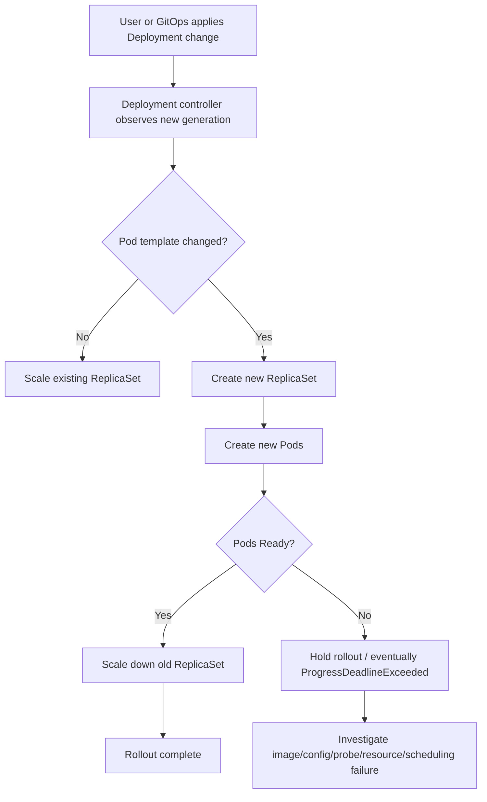
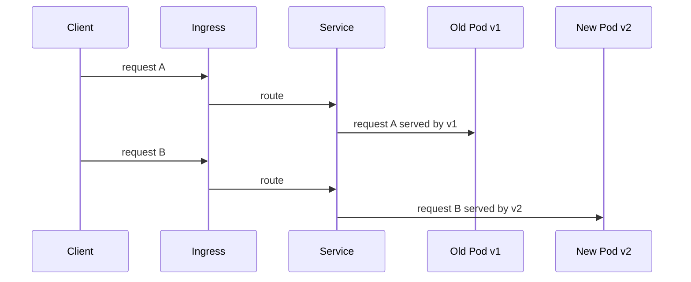
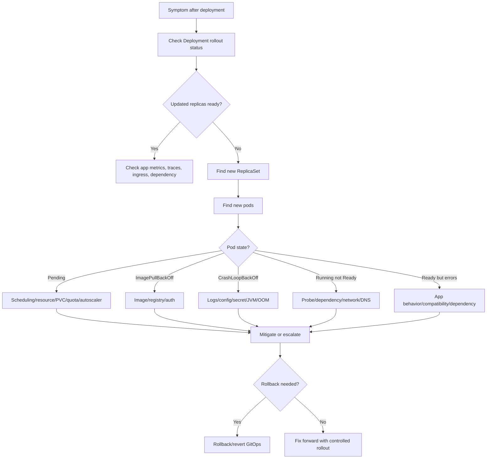

# Part 011 — ReplicaSet and Rollout State Debugging

> Saat Deployment bermasalah, jangan hanya melihat Pod. Lihat hubungan antara Deployment, ReplicaSet lama, ReplicaSet baru, pod template hash, readiness, dan event. Di situlah cerita rollout sebenarnya terlihat.

ReplicaSet adalah lapisan yang sering dilewati backend engineer, padahal saat rollout stuck, partial deployment, rollback, atau traffic bercampur antara versi lama dan baru, ReplicaSet adalah bukti utama.

Part ini membahas cara membaca old ReplicaSet dan new ReplicaSet, memahami revision history, menemukan penyebab rollout stuck, dan mengambil mitigasi aman untuk Java 17+ / JAX-RS service, Kafka/RabbitMQ consumer, Redis-backed service, Camunda worker, batch-adjacent workload, PostgreSQL dependency, NGINX/Ingress traffic, GitOps, EKS, AKS, dan on-prem/hybrid Kubernetes.

---

## 1. Core Concept

Deployment tidak langsung mengelola Pod secara longgar. Deployment membuat dan mengelola ReplicaSet. ReplicaSet menjaga jumlah Pod untuk satu versi pod template.

Saat ada perubahan pada `.spec.template`, Deployment membuat ReplicaSet baru.

Perubahan yang membuat ReplicaSet baru biasanya mencakup:

- image tag atau image digest berubah
- environment variable berubah
- ConfigMap/Secret reference berubah
- probe berubah
- resource request/limit berubah
- label/annotation pada pod template berubah
- container port berubah
- command/args berubah
- ServiceAccount berubah
- volume mount berubah
- securityContext berubah
- topology/scheduling rule berubah

Tidak semua perubahan Deployment membuat ReplicaSet baru. Perubahan pada field Deployment di luar pod template, misalnya `replicas`, dapat mengubah scaling tanpa membuat revision baru.

Mental model:



ReplicaSet adalah versi runtime dari pod template. Jika ingin tahu versi mana yang berjalan, jangan hanya lihat Deployment; lihat ReplicaSet dan Pod labels.

---

## 2. Why ReplicaSet Debugging Matters Operationally

ReplicaSet debugging penting karena banyak incident release tidak terlihat jelas jika hanya melihat Deployment summary.

Contoh gejala:

- Deployment menunjukkan `2/3` ready tetapi tidak jelas pod mana yang gagal.
- Rollout stuck karena pod baru tidak ready.
- Ingress mulai mengirim sebagian traffic ke versi baru yang error.
- Kafka consumer group mengalami rebalance karena ReplicaSet baru naik turun.
- RabbitMQ consumer unacked naik saat pod lama terminate terlalu cepat.
- Camunda worker membuat incident spike setelah rollout sebagian.
- Redis-backed service punya config baru di sebagian pod saja.
- Rollback dilakukan tetapi dependency schema sudah berubah.
- GitOps terus mencoba apply versi yang rusak setelah manual rollback.

ReplicaSet membantu menjawab:

- ReplicaSet mana yang versi lama?
- ReplicaSet mana yang versi baru?
- Berapa pod dari masing-masing ReplicaSet yang ready?
- Apakah pod baru gagal sebelum readiness?
- Apakah pod lama masih melayani traffic?
- Apakah rollout benar-benar selesai?
- Apakah rollback mengembalikan pod template lama?
- Apakah ada mixed-version window yang berbahaya?

---

## 3. Backend Engineer Responsibility

Backend service owner bertanggung jawab memahami rollout state workload miliknya.

Yang harus bisa dilakukan backend engineer:

- membaca Deployment status
- membaca ReplicaSet lama dan baru
- menghubungkan ReplicaSet dengan image/config/revision
- menemukan pod baru yang tidak ready
- membaca event dan previous logs
- membedakan bad image, bad config, bad secret, bad probe, resource issue, dan scheduling issue
- menilai traffic impact ke JAX-RS endpoint
- menilai impact ke consumer/worker workload
- memberi rekomendasi pause, rollback, scale, atau escalate
- memastikan GitOps source of truth konsisten dengan mitigasi

Yang biasanya dimiliki platform/SRE:

- controller health
- node capacity dan cluster autoscaling
- admission controller policy
- CNI/network plugin behavior
- ingress controller platform-level issue
- cluster-wide rollout tooling
- Argo Rollouts/Flagger controller jika digunakan
- production emergency access policy

Backend engineer tidak harus menjadi cluster admin, tetapi harus cukup kuat membaca bukti dari object Kubernetes.

---

## 4. Deployment, ReplicaSet, Pod Template Hash

Saat Deployment membuat ReplicaSet, Kubernetes menambahkan label seperti `pod-template-hash` untuk membedakan pod template revision.

Contoh:

```bash
kubectl get rs -n quote-prod -l app.kubernetes.io/name=quote-api
```

Output ilustratif:

```text
NAME                    DESIRED   CURRENT   READY   AGE
quote-api-6f9c8f7c7d    3         3         3       5d
quote-api-7c4d8bbf9f    1         1         0       3m
```

Interpretasi:

- `quote-api-6f9c8f7c7d` kemungkinan ReplicaSet lama dan sehat.
- `quote-api-7c4d8bbf9f` adalah ReplicaSet baru.
- ReplicaSet baru punya 1 pod desired/current tetapi 0 ready.
- Rollout kemungkinan stuck pada pod baru.

Lihat pod per hash:

```bash
kubectl get pod -n quote-prod \
  -l app.kubernetes.io/name=quote-api \
  -o custom-columns='NAME:.metadata.name,HASH:.metadata.labels.pod-template-hash,READY:.status.containerStatuses[*].ready,PHASE:.status.phase,RESTARTS:.status.containerStatuses[*].restartCount,NODE:.spec.nodeName'
```

Jika service menggunakan selector hanya `app.kubernetes.io/name=quote-api`, maka service bisa memilih pod dari kedua ReplicaSet selama pod ready.

---

## 5. Revision History

Deployment menyimpan revision history dalam ReplicaSet annotation.

Safe command:

```bash
kubectl rollout history deployment/<deployment-name> -n <namespace>
```

Untuk melihat detail revision tertentu:

```bash
kubectl rollout history deployment/<deployment-name> -n <namespace> --revision=<revision-number>
```

Lihat annotation ReplicaSet:

```bash
kubectl get rs <replicaset-name> -n <namespace> -o yaml
```

Field yang sering relevan:

```yaml
metadata:
  annotations:
    deployment.kubernetes.io/revision: "42"
    kubernetes.io/change-cause: "release quote-api 1.42.0"
```

Operational concern:

- revision history hanya berguna jika `revisionHistoryLimit` cukup.
- `change-cause` sering kosong jika pipeline tidak mengisinya.
- GitOps mungkin menjadi sumber history yang lebih reliable daripada annotation.
- rollback via kubectl bisa dilawan oleh GitOps jika Git belum di-revert.

---

## 6. Rollout Status: What to Read First

Urutan aman:

```bash
kubectl get deploy <deployment> -n <namespace>
kubectl rollout status deployment/<deployment> -n <namespace>
kubectl describe deploy <deployment> -n <namespace>
kubectl get rs -n <namespace> -l <selector>
kubectl get pod -n <namespace> -l <selector> -o wide
```

Yang dicari:

- desired replicas
- updated replicas
- ready replicas
- available replicas
- unavailable replicas
- condition `Progressing`
- condition `Available`
- event `Scaled up replica set`
- event `Scaled down replica set`
- event `ProgressDeadlineExceeded`
- pod baru stuck di `Pending`, `ImagePullBackOff`, `CrashLoopBackOff`, atau `Running but not Ready`

Jangan langsung `delete pod` sebelum tahu kenapa pod gagal. Pod baru akan dibuat ulang dengan masalah yang sama jika akar masalah ada di template.

---

## 7. Rollout Stuck Pattern

Rollout stuck biasanya berarti Deployment controller tidak bisa mencapai state baru karena pod baru tidak available.

Common causes:

| Cause | Signal | Typical fix |
|---|---|---|
| Bad image | `ImagePullBackOff`, `ErrImagePull` | fix image tag/digest/registry auth atau rollback |
| Bad config | `CrashLoopBackOff`, app startup error | fix ConfigMap/env atau rollback |
| Missing secret | `CreateContainerConfigError` atau app auth error | restore secret atau fix reference |
| Bad probe | `Running` tetapi `Ready=false`, event `Unhealthy` | fix probe path/port/timeout |
| Resource issue | `Pending`, `FailedScheduling`, OOMKilled | adjust resources/capacity |
| NetworkPolicy issue | readiness dependency timeout | fix egress/ingress policy |
| RBAC/IAM issue | app starts but cloud calls fail | fix ServiceAccount/RBAC/IAM |
| Migration incompatibility | app error after start | rollback may not be enough; coordinate DB fix |

---

## 8. ProgressDeadlineExceeded

`ProgressDeadlineExceeded` berarti Deployment tidak membuat progress dalam `progressDeadlineSeconds`.

Contoh condition:

```yaml
status:
  conditions:
    - type: Progressing
      status: "False"
      reason: ProgressDeadlineExceeded
      message: ReplicaSet "quote-api-7c4d8bbf9f" has timed out progressing.
```

Makna operasional:

- Deployment controller berhenti menganggap rollout progressing.
- Ini bukan root cause; ini gejala.
- Root cause biasanya ada di pod baru atau constraint scheduling.
- Old ReplicaSet mungkin masih menjaga availability jika `maxUnavailable=0` dan old pods masih ready.
- Jika old pods sudah turun, user impact bisa signifikan.

Safe investigation:

```bash
kubectl describe deploy <deployment> -n <namespace>
kubectl get rs -n <namespace> -l app.kubernetes.io/name=<app>
kubectl describe rs <new-rs> -n <namespace>
kubectl get pod -n <namespace> -l pod-template-hash=<hash>
kubectl describe pod <new-pod> -n <namespace>
kubectl logs <new-pod> -n <namespace> --previous
```

Decision:

- Jika bad app/config/image: rollback atau revert Git.
- Jika capacity/scheduling: escalate platform/SRE sambil menahan rollout.
- Jika probe terlalu agresif: fix probe dan redeploy.
- Jika migration incompatibility: jangan rollback membabi buta; cek database compatibility.

---

## 9. maxSurge and maxUnavailable

RollingUpdate memiliki dua knob penting:

```yaml
strategy:
  type: RollingUpdate
  rollingUpdate:
    maxSurge: 1
    maxUnavailable: 0
```

Makna:

- `maxSurge`: berapa pod tambahan boleh dibuat di atas desired replicas.
- `maxUnavailable`: berapa pod desired boleh unavailable selama rollout.

Contoh untuk 3 replicas:

| Config | Behavior | Risk |
|---|---|---|
| `maxSurge: 1`, `maxUnavailable: 0` | tambah 1 pod baru dulu, baru turunkan pod lama | lebih aman, butuh capacity ekstra |
| `maxSurge: 0`, `maxUnavailable: 1` | turunkan 1 pod lama dulu, baru buat pod baru | hemat capacity, lebih berisiko availability |
| `maxSurge: 50%`, `maxUnavailable: 50%` | rollout cepat | risk besar untuk traffic critical |
| `maxSurge: 1`, `maxUnavailable: 1` | trade-off tengah | bisa ada temporary capacity drop |

Untuk JAX-RS API critical, `maxUnavailable: 0` sering lebih aman, tetapi harus ada node capacity untuk surge.

Untuk Kafka/RabbitMQ consumer, surge bisa berarti consumer count sementara naik dan memicu:

- Kafka rebalance
- duplicate processing jika commit tidak aman
- RabbitMQ prefetch burst
- DB connection spike
- Redis connection spike

Untuk Camunda worker, surge bisa menaikkan job activation concurrency dan pressure ke workflow engine.

---

## 10. Mixed-Version Window

Rolling update menciptakan periode ketika versi lama dan baru berjalan bersamaan.



Mixed-version safe jika:

- API contract backward compatible
- database schema backward compatible
- cache key/version compatible
- event schema compatible
- message consumer compatible
- feature flag behavior deterministic
- auth/session format compatible

Mixed-version dangerous jika:

- pod baru menulis schema/data yang tidak bisa dibaca pod lama
- event baru tidak bisa diproses consumer lama
- cache format berubah tanpa versioning
- session/token format berubah
- endpoint behavior berubah tanpa compatibility layer
- migration dilakukan sebelum app compatible

Backend engineer harus selalu membaca rollout sebagai distributed compatibility problem, bukan hanya deployment command.

---

## 11. Bad Image Debugging

Signals:

- new ReplicaSet created
- new pod stuck `ImagePullBackOff` atau `ErrImagePull`
- old ReplicaSet masih ready
- deployment updatedReplicas naik tetapi readyReplicas tidak naik

Commands:

```bash
kubectl describe pod <new-pod> -n <namespace>
kubectl get pod <new-pod> -n <namespace> -o jsonpath='{.spec.containers[*].image}{"\n"}'
kubectl get rs <new-rs> -n <namespace> -o jsonpath='{.spec.template.spec.containers[*].image}{"\n"}'
```

Check:

- image tag typo
- image not pushed
- digest mismatch
- registry auth issue
- ImagePullSecret missing
- ECR/ACR permission
- node egress to registry
- registry outage
- admission policy rejection

Safe mitigation:

- stop further promotion
- revert image reference in GitOps repo
- rollback Deployment if allowed and GitOps-aware
- escalate registry/auth issue to platform if image exists but pull fails

---

## 12. Bad Config Debugging

Bad config often appears as pod starting then crashing.

Signals:

- `CrashLoopBackOff`
- `CreateContainerConfigError`
- app startup exception
- missing environment variable
- wrong profile/environment
- invalid URL, invalid credentials, invalid enum, invalid port
- pod old version healthy, new version crashing

Commands:

```bash
kubectl describe pod <new-pod> -n <namespace>
kubectl logs <new-pod> -n <namespace>
kubectl logs <new-pod> -n <namespace> --previous
kubectl get deploy <deployment> -n <namespace> -o yaml
kubectl get cm -n <namespace>
kubectl get secret -n <namespace>
```

Do not print secret values in chat, tickets, logs, screenshots, or incident notes.

Operational question:

- Did config change with the app version?
- Did ConfigMap name/version change?
- Did Secret reference change?
- Did environment overlay select the wrong value?
- Did Helm/Kustomize render what the PR reviewer expected?
- Did GitOps sync a different manifest than pipeline artifact?

Safe mitigation:

- revert config change
- restore missing Secret/ConfigMap reference
- rollback app if config not separable
- restart only if config source is fixed and app needs restart

---

## 13. Bad Probe Debugging

Bad probe can make a healthy app look broken, or make a broken app receive traffic.

Signals:

- pod `Running` but `READY 0/1`
- events show `Readiness probe failed`
- container logs show app serving, but readiness path wrong
- ingress returns 503 because Service has no ready endpoints
- liveness restarts the container repeatedly

Commands:

```bash
kubectl describe pod <new-pod> -n <namespace>
kubectl get pod <new-pod> -n <namespace> -o jsonpath='{.spec.containers[*].readinessProbe}{"\n"}'
kubectl get pod <new-pod> -n <namespace> -o jsonpath='{.spec.containers[*].livenessProbe}{"\n"}'
```

Probe review:

| Probe | Operational intent | Common mistake |
|---|---|---|
| startupProbe | give slow app time to boot | missing for slow Java startup |
| readinessProbe | decide whether pod receives traffic | checking unstable dependency too strictly |
| livenessProbe | restart deadlocked process | used as dependency check and causes restart loop |

For Java/JAX-RS:

- readiness endpoint should indicate app can accept requests.
- liveness should be conservative.
- startupProbe should cover slow JVM/classpath/migration/cache warmup.
- readiness should not become a distributed dependency cascade unless intentionally designed.

---

## 14. Pod Not Becoming Ready

A new pod may be `Running` but not `Ready`.

Possible causes:

- readiness endpoint returns non-2xx
- readiness endpoint times out
- wrong port/path
- app still warming up
- thread pool saturated during startup
- DB connection pool cannot initialize
- Kafka/RabbitMQ/Redis dependency check blocks readiness
- cloud IAM/secret access denied during readiness check
- NetworkPolicy blocks dependency
- DNS failure

Debug sequence:

```bash
kubectl describe pod <pod> -n <namespace>
kubectl logs <pod> -n <namespace> --tail=200
kubectl get endpointslice -n <namespace> -l kubernetes.io/service-name=<service>
kubectl get svc <service> -n <namespace> -o yaml
```

If policy allows safe exec:

```bash
kubectl exec -n <namespace> <pod> -- sh -c 'wget -qO- http://127.0.0.1:8080/health/ready || true'
```

Use `exec` carefully. In production, prefer logs/metrics/traces/events first unless internal policy allows exec.

---

## 15. Reading ReplicaSet YAML Safely

Useful fields:

```bash
kubectl get rs <rs-name> -n <namespace> -o yaml
```

Inspect:

- `metadata.annotations.deployment.kubernetes.io/revision`
- `metadata.ownerReferences`
- `metadata.labels.pod-template-hash`
- `spec.replicas`
- `status.replicas`
- `status.readyReplicas`
- `status.availableReplicas`
- `spec.template.metadata.labels`
- `spec.template.metadata.annotations`
- `spec.template.spec.containers[].image`
- `spec.template.spec.containers[].envFrom`
- `spec.template.spec.containers[].env`
- `spec.template.spec.containers[].resources`
- `spec.template.spec.containers[].readinessProbe`
- `spec.template.spec.containers[].livenessProbe`
- `spec.template.spec.serviceAccountName`
- `spec.template.spec.volumes`

Do not paste full YAML publicly if it contains sensitive env var names, secret names, internal hosts, tenant identifiers, or customer-related metadata.

---

## 16. Rollout Debugging Flow



The goal is not to run every command. The goal is to reduce uncertainty without increasing blast radius.

---

## 17. Java/JAX-RS Specific Rollout Risks

For Java/JAX-RS services, rollout state is tightly coupled to runtime behavior.

Common rollout risks:

- JVM startup exceeds probe timeout.
- Classpath/config error appears only in new image.
- Management endpoint moved or secured accidentally.
- JAX-RS base path changed, readiness path still old.
- DB pool initializes eagerly and blocks startup.
- Hibernate/JPA/MyBatis mapper error crashes app at startup.
- JDBC driver/SSL truststore mismatch prevents DB connectivity.
- HTTP client timeout config wrong, readiness dependency times out.
- thread pool saturated by warmup tasks.
- GC behavior changes under new memory limit.
- native memory usage grows after library update.

Operational review before rollout:

- image version
- JVM flags
- heap/resource ratio
- readiness/liveness/startup probe
- request timeout
- dependency timeout
- DB pool size
- graceful shutdown hooks
- migration compatibility
- observability markers

---

## 18. Impact on PostgreSQL, Kafka, RabbitMQ, Redis, and Camunda

Rollout is not isolated to Kubernetes.

### PostgreSQL

Risk:

- connection spike during surge
- migration incompatibility
- pool exhaustion
- long startup due to DB checks
- SSL/truststore issue

Check:

- active connections
- connection pool metrics
- migration status
- DB error logs if available through approved channel
- readiness DB check behavior

### Kafka

Risk:

- consumer group rebalance storm
- pod termination before offset commit
- replica count exceeds partition count
- lag spike during rollout
- duplicate processing if idempotency weak

Check:

- consumer lag
- rebalance rate
- active members
- offset commit errors
- shutdown logs

### RabbitMQ

Risk:

- unacked message spike
- redelivery storm
- prefetch too high during surge
- connection/channel churn
- DLQ growth

Check:

- queue depth
- unacked count
- consumer count
- redelivery rate
- DLQ rate

### Redis

Risk:

- connection spike
- cache key compatibility issue
- stale cache after version change
- timeout spike under surge

Check:

- Redis connections
- latency
- error rate
- cache hit/miss
- key version compatibility

### Camunda

Risk:

- worker concurrency changes
- job activation spike
- incident spike
- job lock timeout mismatch
- partial version rollout affects process behavior

Check:

- activated jobs
- worker count
- incidents
- retries
- process correlation
- job timeout config

---

## 19. EKS, AKS, and On-Prem/Hybrid Considerations

### EKS

ReplicaSet rollout failure can be caused by:

- subnet IP exhaustion via VPC CNI
- ECR permission issue
- IRSA access denied
- ALB target group not healthy
- node group capacity shortage
- EBS CSI mount issue
- security group restrictions

Verify internally:

- VPC CNI health
- ECR pull permissions
- ServiceAccount IRSA annotation
- ALB target health
- managed node group capacity
- AWS Load Balancer Controller events

### AKS

ReplicaSet rollout failure can be caused by:

- ACR pull permission issue
- Azure Workload Identity misconfiguration
- Key Vault CSI mount issue
- subnet/NSG/UDR issue
- node pool capacity
- Application Gateway routing issue

Verify internally:

- ACR integration
- federated credential
- managed identity
- Key Vault CSI config
- node pool status
- AGIC/Application Gateway backend health

### On-Prem/Hybrid

ReplicaSet rollout failure can be caused by:

- air-gapped registry sync delay
- corporate proxy/NO_PROXY issue
- internal CA trust failure
- firewall allowlist missing
- on-prem load balancer health check mismatch
- constrained node capacity

Verify internally:

- registry mirror sync
- proxy env vars
- internal CA mount/truststore
- firewall path
- corporate DNS
- load balancer health check

---

## 20. Observability Signals for Rollout Debugging

A good rollout is visible in observability.

Check these signals:

| Signal | What it tells you |
|---|---|
| Deployment marker | when new version started |
| pod readiness | whether new pods entered traffic |
| restart count | whether new pod crashes |
| error rate by version | whether new version is bad |
| latency by version | whether new version is slower |
| logs by pod-template-hash | isolate old vs new pod logs |
| traces by deployment version | compare request path old vs new |
| DB pool metrics | detect connection spike |
| Kafka/RabbitMQ lag | detect consumer impact |
| ingress 5xx | detect routing/backend failure |
| CPU/memory/throttling | detect resource regression |

Label/version consistency is critical. If metrics do not include app version, pod template hash, deployment, or namespace, rollout debugging becomes slower.

---

## 21. Production-Safe Commands

Read-only first:

```bash
kubectl get deploy <deployment> -n <namespace>
kubectl describe deploy <deployment> -n <namespace>
kubectl rollout status deploy/<deployment> -n <namespace>
kubectl rollout history deploy/<deployment> -n <namespace>
kubectl get rs -n <namespace> -l app.kubernetes.io/name=<app>
kubectl describe rs <rs> -n <namespace>
kubectl get pod -n <namespace> -l app.kubernetes.io/name=<app> -o wide
kubectl describe pod <pod> -n <namespace>
kubectl logs <pod> -n <namespace> --tail=200
kubectl logs <pod> -n <namespace> --previous --tail=200
kubectl get events -n <namespace> --sort-by=.lastTimestamp
```

Higher-risk commands, use only if authorized:

```bash
kubectl rollout undo deploy/<deployment> -n <namespace>
kubectl scale deploy/<deployment> -n <namespace> --replicas=<n>
kubectl delete pod <pod> -n <namespace>
kubectl exec -n <namespace> <pod> -- <command>
kubectl debug -n <namespace> <pod> --image=<debug-image>
```

In GitOps environments, direct mutation may be reverted. Prefer revert/rollback through the approved source of truth.

---

## 22. Safe Mitigation Options

Mitigation depends on root cause and internal policy.

| Situation | Safer first move |
|---|---|
| bad image tag | revert image in GitOps or rollback Deployment |
| bad app code | rollback/revert release |
| bad config | revert config or restore previous ConfigMap reference |
| missing secret | restore secret reference/source; avoid exposing value |
| bad probe | fix probe and rollout carefully |
| pod pending due capacity | escalate platform; consider temporary replica reduction if approved |
| dependency outage | mitigate dependency or reduce traffic/consumer pressure |
| consumer causing downstream pressure | pause scale-up or reduce replicas if approved |
| migration incompatibility | coordinate DB/application recovery; rollback may be unsafe |

Avoid:

- deleting random pods repeatedly
- scaling to zero without impact assessment
- patching production manifest manually while GitOps is active
- exposing secret values in incident notes
- increasing resources blindly without checking node capacity
- increasing consumer replicas without checking partition/dependency capacity

---

## 23. When to Rollback

Rollback is appropriate when:

- new ReplicaSet fails due to bad image/code/config
- error rate or latency regression correlates with new version
- readiness failure prevents rollout completion
- smoke test fails after deploy
- dependency compatibility is confirmed safe for old version
- GitOps/source-of-truth rollback path is available

Rollback is risky when:

- database migration is not backward compatible
- new version emitted events old version cannot handle
- new version wrote cache/data format old version cannot read
- external system state changed irreversibly
- rollout involved cloud/IAM/secret changes outside app version

Before rollback, check:

- what changed
- whether data/schema changed
- whether consumer offsets changed
- whether feature flags changed
- whether GitOps will reapply bad version
- whether old ReplicaSet still exists

---

## 24. When to Escalate

Escalate to platform/SRE when evidence points to:

- node capacity shortage
- cluster autoscaler not provisioning
- controller malfunction
- CNI/network plugin issue
- DNS/CoreDNS outage
- registry auth/platform issue
- ingress controller platform issue
- load balancer/target group issue
- storage CSI issue
- admission policy malfunction
- cloud provider outage

Escalate to security when evidence points to:

- RBAC/IAM denied
- secret access denied
- NetworkPolicy approval needed
- certificate/truststore issue with security ownership
- image policy rejection
- privileged/securityContext exception

Escalate to database/broker/platform owner when evidence points to:

- DB connection exhaustion
- Kafka/RabbitMQ broker health issue
- Redis memory/latency issue
- Camunda engine issue
- managed service quota/limit

Good escalation includes:

- affected namespace/workload
- deployment revision
- new ReplicaSet name
- pod state
- events
- error excerpts without secrets
- time of deployment
- observed impact
- suspected boundary
- mitigation already attempted

---

## 25. Rollout PR Review Checklist

Before approving a Kubernetes manifest change, review:

- Does this change create a new ReplicaSet?
- Is image tag/digest immutable and traceable?
- Is `revisionHistoryLimit` enough for rollback?
- Is `progressDeadlineSeconds` reasonable?
- Are `maxSurge` and `maxUnavailable` safe for service criticality?
- Are probes compatible with Java startup and readiness semantics?
- Are resources sufficient for new version?
- Does HPA interact safely with rollout surge?
- Will rolling update create DB/broker connection spike?
- Are config/secret changes backward compatible?
- Is migration expand-contract safe?
- Is event/cache/API compatibility preserved during mixed-version window?
- Are deployment markers and version labels present?
- Is rollback path documented?
- Does GitOps source of truth match intended release?

---

## 26. Internal Verification Checklist

For your internal CSG/team environment, verify rather than assume:

- Deployment naming convention
- ReplicaSet revision history policy
- pod-template-hash labeling pattern
- app/version labels used by dashboards
- Git commit/deployment annotations
- rollout strategy standard per workload type
- default `maxSurge` and `maxUnavailable`
- `progressDeadlineSeconds` standard
- rollback authority and process
- GitOps rollback mechanism
- Argo CD/Flux sync behavior
- deployment pipeline markers
- smoke test owner
- post-deployment verification checklist
- production access policy for `rollout undo`
- whether manual kubectl patch is allowed
- whether old ReplicaSets are retained long enough
- how failed rollout is alerted
- how rollout state is shown in dashboard
- how version-specific metrics/logs/traces are labeled
- who owns capacity issue during rollout
- who owns bad manifest remediation
- who owns emergency rollback decision

---

## 27. Mini Runbook: Rollout Stuck

Use this as a compact incident flow.

1. Confirm affected workload.

```bash
kubectl get deploy <deployment> -n <namespace>
```

2. Check rollout status.

```bash
kubectl rollout status deploy/<deployment> -n <namespace>
```

3. Read Deployment details.

```bash
kubectl describe deploy <deployment> -n <namespace>
```

4. Identify ReplicaSets.

```bash
kubectl get rs -n <namespace> -l app.kubernetes.io/name=<app>
```

5. Identify new pods.

```bash
kubectl get pod -n <namespace> -l pod-template-hash=<new-hash> -o wide
```

6. Classify pod failure.

```bash
kubectl describe pod <pod> -n <namespace>
kubectl logs <pod> -n <namespace> --previous --tail=200
```

7. Check user impact.

- ingress 5xx
- service no endpoint
- error rate
- latency
- dependency metrics
- consumer lag/queue depth

8. Choose safe mitigation.

- rollback/revert if bad release
- fix config/secret if isolated
- escalate platform if capacity/network/registry/storage
- pause rollout if tooling supports it and internal policy allows

9. Capture evidence.

- deployment revision
- ReplicaSet names
- pod state
- event excerpt
- log excerpt without secrets
- dashboard time range
- deployment marker
- decision timestamp

---

## 28. Key Takeaways

ReplicaSet debugging turns rollout confusion into a structured investigation.

Remember:

- Deployment is the desired rollout controller.
- ReplicaSet represents a specific pod template revision.
- Pod template hash lets you separate old and new version.
- Rollout stuck usually means new pods are not becoming available.
- `ProgressDeadlineExceeded` is a symptom, not root cause.
- Rolling update creates a mixed-version window.
- Backend compatibility matters as much as Kubernetes status.
- Rollback must be GitOps-aware and data-compatible.
- Strong labels, annotations, metrics, and deployment markers make rollout debugging dramatically faster.

