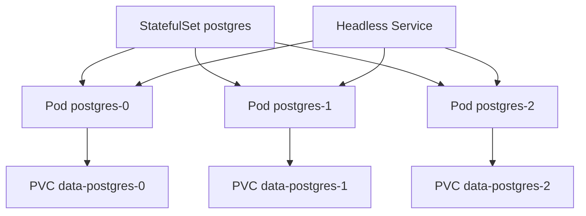
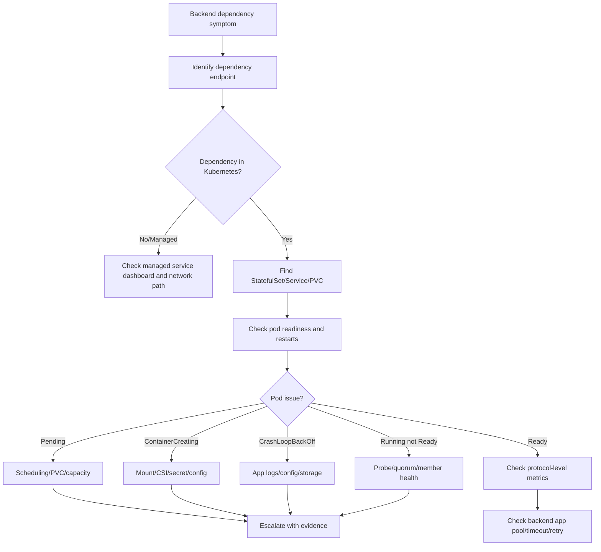

# Part 012 — StatefulSet Operations for Backend Dependencies

> StatefulSet bukan sekadar Deployment dengan storage. StatefulSet adalah kontrak identitas, urutan, network name, dan persistent volume. Salah memahami StatefulSet bisa berujung data loss, quorum issue, stuck rollout, atau dependency outage.

Untuk senior backend engineer, StatefulSet perlu dipahami terutama sebagai operational awareness. Anda mungkin tidak selalu mengelola PostgreSQL, Kafka, RabbitMQ, Redis, atau Camunda engine langsung di Kubernetes, tetapi aplikasi backend Anda sangat dipengaruhi oleh stateful dependency tersebut.

Part ini membahas StatefulSet dari sudut pandang backend service owner: kapan perlu dipahami, apa failure mode-nya, apa yang menjadi tanggung jawab platform/SRE/database/broker team, dan bagaimana men-debug secara production-safe tanpa memperburuk kondisi stateful workload.

---

## 1. Core Concept

StatefulSet mengelola Pod yang membutuhkan identitas stabil dan storage stabil.

Berbeda dengan Deployment:

- Pod Deployment interchangeable.
- Pod StatefulSet punya ordinal tetap.
- Pod StatefulSet punya DNS name stabil.
- Pod StatefulSet sering punya PVC sendiri.
- Rollout StatefulSet umumnya berurutan.
- Delete Pod tidak berarti delete PVC.
- Scaling down tidak otomatis menghapus volume.

Contoh identitas:

```text
postgres-0
postgres-1
postgres-2
```

Contoh DNS internal via headless service:

```text
postgres-0.postgres-headless.database.svc.cluster.local
postgres-1.postgres-headless.database.svc.cluster.local
postgres-2.postgres-headless.database.svc.cluster.local
```

Mental model:



StatefulSet is about stable identity plus persistent state.

---

## 2. Why StatefulSet Matters Operationally

Backend engineer perlu memahami StatefulSet karena banyak dependency enterprise berjalan sebagai stateful workload, terutama di environment tertentu:

- PostgreSQL self-managed atau operator-managed
- Kafka cluster
- RabbitMQ cluster
- Redis cluster/sentinel
- Camunda engine atau related stateful components
- Elasticsearch/OpenSearch logging/search stack
- workflow/job processing infrastructure
- file-processing components with persistent state

Bahkan jika production menggunakan managed cloud service, non-prod/on-prem/hybrid environment bisa menjalankan dependency dengan StatefulSet.

StatefulSet matters karena:

- pod restart bisa berdampak ke quorum
- PVC mount failure bisa membuat dependency unavailable
- node drain bisa menyebabkan failover
- ordered rollout bisa stuck di ordinal tertentu
- scaling down bisa meninggalkan PVC/data lama
- storage full bisa menghentikan dependency
- backup/restore harus konsisten dengan data state
- manual delete/patch bisa sangat berbahaya

---

## 3. Backend Engineer Responsibility

Backend engineer biasanya bukan owner utama StatefulSet dependency, tetapi tetap perlu bisa membaca dampaknya.

Backend engineer harus bisa:

- mengenali dependency berjalan sebagai StatefulSet atau managed service
- membaca basic health object tanpa melakukan destructive action
- menghubungkan dependency outage dengan aplikasi backend
- memahami apakah failure berasal dari app atau dependency
- membaca endpoint/DNS dependency yang dipakai aplikasi
- mengetahui escalation owner
- memberi evidence yang jelas ke platform/SRE/database/broker team
- tidak melakukan restart/delete/scale stateful workload tanpa otorisasi

Backend engineer tidak boleh sembarang:

- delete StatefulSet pod untuk “restart”
- scale StatefulSet down/up tanpa runbook
- delete PVC
- patch volumeClaimTemplate sembarangan
- force delete pod dengan storage attach issue
- exec ke database/broker pod tanpa izin
- mengubah cluster membership manually
- mengubah operator-managed resource tanpa tahu reconciliation behavior

Stateful operations require more caution than stateless rollout operations.

---

## 4. Platform/SRE/Database/Broker Responsibility

Yang biasanya dimiliki platform/SRE/database/broker team:

- StatefulSet manifest/operator ownership
- StorageClass and CSI configuration
- backup and restore
- replication/quorum configuration
- failover runbook
- node placement strategy
- PodDisruptionBudget
- volume expansion
- upgrade sequence
- certificate rotation
- cluster membership recovery
- data retention and compliance
- disaster recovery procedure

Backend engineer perlu tahu boundary ini agar incident escalation efektif.

---

## 5. StatefulSet vs Deployment

| Aspect | Deployment | StatefulSet |
|---|---|---|
| Pod identity | interchangeable | stable ordinal identity |
| Pod name | generated random suffix | predictable ordinal suffix |
| Storage | usually ephemeral | often persistent PVC per pod |
| Network identity | service-level stable | pod-level stable via headless service |
| Rollout | parallel-ish rolling update | ordered by ordinal by default |
| Scale down | any pod can go away | highest ordinal removed first |
| Replacement | new pod equivalent | replacement reuses identity and volume |
| Failure risk | usually stateless availability | data/quorum/storage risk |

Rule of thumb:

- Use Deployment for stateless backend service.
- Use Job/CronJob for finite work.
- Use StatefulSet only when stable identity/storage/order matters.
- Prefer managed service for critical stateful infrastructure unless team is prepared for full operational burden.

---

## 6. StatefulSet Anatomy

Example simplified StatefulSet:

```yaml
apiVersion: apps/v1
kind: StatefulSet
metadata:
  name: rabbitmq
spec:
  serviceName: rabbitmq-headless
  replicas: 3
  selector:
    matchLabels:
      app.kubernetes.io/name: rabbitmq
  updateStrategy:
    type: RollingUpdate
  template:
    metadata:
      labels:
        app.kubernetes.io/name: rabbitmq
    spec:
      containers:
        - name: rabbitmq
          image: rabbitmq:3-management
          ports:
            - name: amqp
              containerPort: 5672
            - name: management
              containerPort: 15672
          volumeMounts:
            - name: data
              mountPath: /var/lib/rabbitmq
  volumeClaimTemplates:
    - metadata:
        name: data
      spec:
        accessModes: ["ReadWriteOnce"]
        storageClassName: standard
        resources:
          requests:
            storage: 100Gi
```

Operationally important fields:

- `spec.serviceName`
- `spec.replicas`
- `spec.selector`
- `spec.updateStrategy`
- `spec.podManagementPolicy`
- `spec.volumeClaimTemplates`
- pod labels
- probes
- resources
- ServiceAccount
- affinity/topology spread
- PDB
- storage class

---

## 7. Stable Identity

StatefulSet Pod names are stable:

```text
<statefulset-name>-0
<statefulset-name>-1
<statefulset-name>-2
```

This matters for systems that need identity:

- database primary/replica member identity
- Kafka broker ID or listener mapping
- RabbitMQ node identity
- Redis cluster slot ownership
- quorum membership
- persistent local state

Operational concern:

- Replacing `postgres-0` usually means new pod with same identity and same volume.
- If the volume is corrupted or unavailable, recreating pod may not fix it.
- Force deletion can create split-brain or attach/detach problems if done incorrectly.

Safe command:

```bash
kubectl get pod -n <namespace> -l app.kubernetes.io/name=<stateful-app> -o wide
```

Look for:

- ordinal missing
- one ordinal not Ready
- pod stuck Terminating
- pod rescheduled to different node
- restart count increasing
- volume mount issue

---

## 8. Stable Network Identity and Headless Service

StatefulSet often uses a headless Service:

```yaml
apiVersion: v1
kind: Service
metadata:
  name: rabbitmq-headless
spec:
  clusterIP: None
  selector:
    app.kubernetes.io/name: rabbitmq
```

Headless Service allows DNS records for individual pods.

Example:

```text
rabbitmq-0.rabbitmq-headless.messaging.svc.cluster.local
rabbitmq-1.rabbitmq-headless.messaging.svc.cluster.local
```

Operational concerns:

- Wrong `serviceName` breaks stable DNS.
- Wrong selector breaks endpoint discovery.
- DNS issue can break cluster membership.
- NetworkPolicy can block member-to-member traffic.
- Stateful systems may require both client service and headless peer service.

Commands:

```bash
kubectl get svc -n <namespace>
kubectl get endpointslice -n <namespace> -l kubernetes.io/service-name=<headless-service>
kubectl describe svc <headless-service> -n <namespace>
```

---

## 9. Stable Storage and PVC

StatefulSet commonly creates one PVC per pod using `volumeClaimTemplates`.

PVC naming pattern:

```text
<claim-template-name>-<statefulset-name>-<ordinal>
```

Example:

```text
data-rabbitmq-0
data-rabbitmq-1
data-rabbitmq-2
```

Operational concerns:

- PVC remains after pod deletion.
- Scaling down does not automatically delete PVC.
- Deleting PVC can delete data depending on reclaim policy and storage backend.
- Volume attach/detach can delay recovery.
- `ReadWriteOnce` volumes may not mount on multiple nodes.
- Zone-bound volumes can conflict with scheduling.

Safe commands:

```bash
kubectl get pvc -n <namespace>
kubectl describe pvc <pvc-name> -n <namespace>
kubectl get pv
kubectl get storageclass
```

Do not delete PVC unless there is an approved data recovery or cleanup process.

---

## 10. Ordered Startup, Shutdown, and Rollout

StatefulSet defaults to ordered behavior.

Typical behavior:

- create pod `0` first
- wait until `0` is Running/Ready
- create pod `1`
- wait until `1` is Running/Ready
- create pod `2`

For deletion/scale-down:

- highest ordinal removed first
- `2` before `1`
- `1` before `0`

Rollout can be blocked if one ordinal does not become ready.

```mermaid
sequenceDiagram
    participant SS as StatefulSet Controller
    participant P0 as Pod app-0
    participant P1 as Pod app-1
    participant P2 as Pod app-2

    SS->>P0: create/update ordinal 0
    P0-->>SS: Ready
    SS->>P1: create/update ordinal 1
    P1-->>SS: Not Ready
    SS-->>P2: wait; do not continue
```

Operational concern:

- One broken ordinal can block the whole rollout.
- The broken ordinal may be due to storage, membership, config, or readiness.
- For quorum systems, order matters.

---

## 11. PodManagementPolicy

StatefulSet supports `podManagementPolicy`:

```yaml
podManagementPolicy: OrderedReady
```

or:

```yaml
podManagementPolicy: Parallel
```

| Policy | Meaning | Risk |
|---|---|---|
| `OrderedReady` | create/update pods sequentially | safer for ordered stateful systems, slower |
| `Parallel` | create/delete pods in parallel | faster, riskier for systems requiring ordering |

Backend engineer review point:

- Do not assume Parallel is safe just because rollout is slow.
- For broker/database/quorum systems, ordering may be intentional.
- If operator manages this field, do not override it manually.

---

## 12. Update Strategy and Partitioned Rollout

StatefulSet update strategy:

```yaml
updateStrategy:
  type: RollingUpdate
```

Partitioned rollout:

```yaml
updateStrategy:
  type: RollingUpdate
  rollingUpdate:
    partition: 2
```

Meaning:

- only pods with ordinal >= partition are updated
- lower ordinals stay on old version

Example with 3 replicas and partition 2:

- `app-2` updated
- `app-0` and `app-1` unchanged

Use cases:

- controlled stateful upgrade
- canary one ordinal
- manual validation before full rollout
- operator-guided upgrades

Risks:

- mixed-version stateful cluster
- protocol compatibility issues
- membership mismatch
- data format compatibility risk

Internal verification:

- Is partitioned rollout used intentionally?
- Who controls partition changes?
- What validation is required before lowering partition?
- Is mixed version supported by the dependency?

---

## 13. StatefulSet Status Fields

Useful command:

```bash
kubectl get sts <statefulset> -n <namespace> -o yaml
```

Fields to inspect:

| Field | Meaning |
|---|---|
| `spec.replicas` | desired replica count |
| `status.replicas` | current replicas |
| `status.readyReplicas` | ready replicas |
| `status.currentReplicas` | replicas at current revision |
| `status.updatedReplicas` | replicas updated to update revision |
| `status.currentRevision` | revision currently stable |
| `status.updateRevision` | revision being rolled out |
| `status.collisionCount` | hash collision count, rare |

Commands:

```bash
kubectl get sts -n <namespace>
kubectl describe sts <statefulset> -n <namespace>
kubectl rollout status sts/<statefulset> -n <namespace>
kubectl rollout history sts/<statefulset> -n <namespace>
```

Note: rollback behavior for StatefulSet must be handled carefully, especially with data/schema/protocol changes.

---

## 14. Common Failure: StatefulSet Pod Stuck Pending

Possible causes:

- insufficient CPU/memory
- node affinity mismatch
- taint/toleration mismatch
- PVC pending
- storage class unavailable
- volume zone conflict
- quota exceeded
- cluster autoscaler cannot provision matching node

Commands:

```bash
kubectl describe pod <pod> -n <namespace>
kubectl get pvc -n <namespace>
kubectl describe pvc <pvc> -n <namespace>
kubectl get events -n <namespace> --sort-by=.lastTimestamp
```

Backend interpretation:

- If event says `FailedScheduling`, look at scheduling/capacity.
- If event says `pod has unbound immediate PersistentVolumeClaims`, look at PVC/storage.
- If event says volume node affinity conflict, storage and node zone are mismatched.

Escalate to platform/storage owner if storage scheduling is involved.

---

## 15. Common Failure: FailedMount

Symptoms:

- Pod stuck `ContainerCreating`
- event `FailedMount`
- volume attach timeout
- CSI driver error
- secret/config volume missing
- PVC volume not attached

Commands:

```bash
kubectl describe pod <pod> -n <namespace>
kubectl describe pvc <pvc> -n <namespace>
kubectl get events -n <namespace> --field-selector involvedObject.name=<pod>
```

Root cause examples:

- PVC not bound
- CSI driver issue
- cloud disk attach limit
- node-zone mismatch
- secret/config missing
- storage backend unavailable
- volume already attached to another node

Do not force delete unless platform/storage runbook says so.

---

## 16. Common Failure: Pod Stuck Terminating

Stateful pods can remain Terminating because:

- application shutdown hangs
- finalizer blocks deletion
- volume detach issue
- node unavailable
- process ignores SIGTERM
- preStop hook hangs
- quorum/member leave logic blocks

Commands:

```bash
kubectl get pod <pod> -n <namespace> -o yaml
kubectl describe pod <pod> -n <namespace>
```

Check:

- deletionTimestamp
- finalizers
- node status
- terminationGracePeriodSeconds
- container logs during shutdown
- volume detach events

Force deletion can be dangerous for stateful systems. It may lead to:

- duplicate member identity
- volume attachment race
- split-brain
- data corruption
- quorum instability

Escalate before force deletion.

---

## 17. Common Failure: Disk Full

Stateful dependencies often fail when disk is full.

Signals:

- application logs show no space left on device
- database stops accepting writes
- Kafka/RabbitMQ/Redis persistence errors
- PVC usage near 100%
- node disk pressure if local storage involved
- readiness failure

Check:

- PVC capacity
- filesystem usage metric
- storage backend dashboard
- application-specific disk metrics
- retention policy
- log/data compaction behavior

Possible mitigation:

- expand PVC if supported and approved
- clean safe temporary data if runbook allows
- increase retention cleanup
- scale storage backend
- restore from backup if corruption happened

Do not manually delete data files from database/broker volumes without owner-approved runbook.

---

## 18. PostgreSQL StatefulSet Awareness

PostgreSQL in Kubernetes can be:

- self-managed StatefulSet
- operator-managed cluster
- managed cloud database outside Kubernetes
- hybrid/on-prem managed database

Backend engineer should verify which one is true internally.

Operational concerns if PostgreSQL runs in Kubernetes:

- primary/replica role
- failover mechanism
- PVC health
- WAL growth
- backup/restore
- connection pool pressure
- migration timing
- storage latency
- certificate rotation
- DNS/service endpoint

Backend app symptoms:

- connection timeout
- too many connections
- SSL handshake failure
- read-only transaction error after failover
- latency spike
- migration lock contention
- transaction rollback spike

Safe evidence to collect:

- app DB error logs without credentials
- connection pool metrics
- DB endpoint used by app
- Kubernetes service/endpoint health
- time correlation with StatefulSet event
- recent rollout/migration

Escalate DB-specific operations to database/platform owner.

---

## 19. Kafka StatefulSet Awareness

Kafka brokers are strongly stateful.

Operational concerns:

- broker ID / node identity
- persistent log volume
- ISR health
- partition leadership
- controller/quorum state
- listener configuration
- advertised listeners
- storage usage
- rolling broker upgrade order
- client compatibility

Backend consumer symptoms:

- consumer lag spike
- rebalance storm
- commit timeout
- metadata fetch timeout
- unknown leader
- not enough replicas
- producer send timeout

Kubernetes-related causes:

- broker pod not ready
- PVC mount failure
- headless service DNS issue
- NetworkPolicy blocking broker ports
- certificate/truststore issue
- pod rescheduled but storage attach delayed

Backend engineer should not restart Kafka brokers manually unless explicitly part of approved runbook.

---

## 20. RabbitMQ StatefulSet Awareness

RabbitMQ cluster in Kubernetes often uses stable node identity.

Operational concerns:

- Erlang cookie secret
- node name identity
- persistent queue data
- quorum queue behavior
- management service
- headless peer discovery
- disk alarm
- memory alarm
- connection/channel count
- rolling upgrade order

Backend consumer symptoms:

- queue depth rising
- unacked messages rising
- connection refused
- channel closed
- redelivery spike
- DLQ growth
- publish confirms delayed

Kubernetes-related causes:

- pod not ready
- PVC/mount issue
- DNS peer discovery issue
- Secret mismatch
- NetworkPolicy blocking AMQP/peer ports
- disk pressure

Backend action:

- reduce consumer pressure only if approved
- capture queue metrics
- capture app error evidence
- escalate cluster health to RabbitMQ/platform owner

---

## 21. Redis StatefulSet Awareness

Redis may run as:

- standalone StatefulSet
- Redis Sentinel
- Redis Cluster
- managed Redis outside Kubernetes

Operational concerns:

- persistence mode
- memory pressure
- eviction policy
- failover behavior
- replica sync
- cluster slots
- password/ACL secret
- service endpoint
- persistence volume

Backend symptoms:

- cache timeout
- connection refused
- MOVED/ASK errors in cluster mode
- auth failure
- latency spike
- high miss rate
- rate limiter failure
- distributed lock instability

Kubernetes-related causes:

- pod restart
- PVC issue
- NetworkPolicy
- Secret rotation mismatch
- node memory pressure
- storage latency if persistence enabled

Backend engineer must understand whether Redis is cache-only or stateful coordination dependency. The operational severity is different.

---

## 22. Camunda Stateful Dependency Awareness

Camunda platform components can include stateful dependencies depending on version and architecture.

Operational concerns:

- engine database availability
- job executor/worker connectivity
- broker/cluster components if applicable
- process instance state
- incident creation
- retry exhaustion
- history/audit persistence
- external worker connectivity

Backend symptoms:

- workflow stuck
- job activation timeout
- incident spike
- process correlation failure
- duplicate job handling
- worker backlog

Kubernetes-related causes:

- worker rollout issue
- engine/database dependency issue
- network/DNS to Camunda endpoint
- secret/identity issue
- readiness failure
- storage issue for stateful Camunda components

Backend action:

- check worker logs/metrics
- check process correlation IDs
- check incident rate
- check dependency dashboard
- escalate engine/platform issue to owner

---

## 23. Managed Service vs Self-Managed StatefulSet

This is an architecture and operations decision.

| Option | Benefit | Cost/Risk |
|---|---|---|
| Managed cloud service | less operational burden, provider handles many HA/backup concerns | cloud dependency, cost, network/private endpoint complexity |
| Self-managed StatefulSet | control, portability, on-prem support | high operational burden, backup/restore/quorum/storage responsibility |
| Operator-managed StatefulSet | codified operations, automation | operator complexity, CRD knowledge, upgrade risk |
| External on-prem service | enterprise integration, existing governance | hybrid network/DNS/firewall/proxy complexity |

Decision criteria:

- data criticality
- RPO/RTO
- team expertise
- compliance constraints
- latency requirements
- on-prem/hybrid requirement
- backup/restore maturity
- upgrade discipline
- cost model
- operational ownership clarity

Backend engineer should challenge self-managed stateful dependencies when ownership, backup, restore, and incident response are unclear.

---

## 24. StatefulSet and PDB

Stateful workloads often need PodDisruptionBudget.

Example:

```yaml
apiVersion: policy/v1
kind: PodDisruptionBudget
metadata:
  name: rabbitmq-pdb
spec:
  minAvailable: 2
  selector:
    matchLabels:
      app.kubernetes.io/name: rabbitmq
```

Operational concern:

- PDB protects against voluntary disruption.
- PDB does not prevent involuntary node failure.
- Too strict PDB can block node drain or cluster upgrade.
- Too loose PDB can break quorum or availability.

Review:

- replica count
- quorum requirement
- cluster upgrade behavior
- node drain runbook
- zone spread
- operator recommendations

---

## 25. StatefulSet and Scheduling

Stateful workload placement matters.

Common constraints:

- pod anti-affinity to avoid same node
- topology spread across zones
- node affinity for storage/locality
- taints/tolerations for dedicated nodes
- priority class for critical dependency
- storage zone constraints

Bad placement can cause:

- multiple replicas lost on one node failure
- volume cannot attach after reschedule
- zone outage affects quorum
- node pool pressure harms dependency latency
- cost increase due over-dedicated nodes

Commands:

```bash
kubectl get pod -n <namespace> -l app.kubernetes.io/name=<stateful-app> -o wide
kubectl describe pod <pod> -n <namespace>
kubectl get nodes --show-labels
```

Backend engineer should usually escalate placement changes to platform/SRE.

---

## 26. StatefulSet and Security

Stateful dependencies often hold sensitive data.

Security concerns:

- secret-mounted credentials
- TLS/mTLS certificates
- persistent data encryption
- backup encryption
- RBAC to pods/PVC/secrets
- exec access policy
- network isolation
- service exposure
- image vulnerability
- privileged container requirements
- filesystem permissions

Backend engineer should verify:

- app credentials are not hardcoded
- connection uses TLS where required
- secret rotation impact is understood
- NetworkPolicy allows only required traffic
- dashboards/logs do not leak sensitive data
- incident evidence does not include secret values

---

## 27. StatefulSet and Observability

Stateful workloads need layered observability.

Kubernetes signals:

- pod readiness
- restart count
- PVC bound state
- volume usage
- FailedMount events
- node pressure
- rollout status
- PDB disruptions

Application-specific signals:

- PostgreSQL replication lag, connections, locks, WAL, disk
- Kafka broker health, ISR, controller, partition leadership, disk
- RabbitMQ queue depth, unacked, memory/disk alarm, node health
- Redis memory, evictions, latency, replication, cluster slots
- Camunda incidents, job backlog, retries, process latency

Backend app signals:

- dependency error rate
- dependency latency
- connection pool saturation
- timeout/retry rate
- circuit breaker state
- queue lag/backlog
- request error rate

A dependency StatefulSet may be healthy at Kubernetes level but unhealthy at application/protocol level.

---

## 28. Production-Safe Commands

Read-only commands:

```bash
kubectl get sts -n <namespace>
kubectl describe sts <statefulset> -n <namespace>
kubectl get pod -n <namespace> -l app.kubernetes.io/name=<app> -o wide
kubectl describe pod <pod> -n <namespace>
kubectl get pvc -n <namespace>
kubectl describe pvc <pvc> -n <namespace>
kubectl get svc -n <namespace>
kubectl get endpointslice -n <namespace> -l kubernetes.io/service-name=<service>
kubectl get events -n <namespace> --sort-by=.lastTimestamp
kubectl rollout status sts/<statefulset> -n <namespace>
```

Potentially risky commands:

```bash
kubectl delete pod <stateful-pod> -n <namespace>
kubectl scale sts/<statefulset> -n <namespace> --replicas=<n>
kubectl rollout undo sts/<statefulset> -n <namespace>
kubectl patch sts/<statefulset> -n <namespace> ...
kubectl delete pvc <pvc> -n <namespace>
kubectl exec -n <namespace> <stateful-pod> -- <command>
```

Treat all risky commands as runbook-only operations.

---

## 29. StatefulSet Incident Debugging Flow



The key question: is Kubernetes unable to run the dependency, or is the dependency protocol unhealthy despite Kubernetes being green?

---

## 30. Safe Mitigation Principles

For stateful workloads:

- Prefer evidence over action.
- Prefer owner escalation over manual mutation.
- Prefer graceful failover over forced deletion.
- Prefer tested restore over ad-hoc data manipulation.
- Prefer planned storage expansion over emergency file deletion.
- Prefer runbook-driven restart over random pod deletion.
- Prefer compatibility check before rollback.

Unsafe instincts:

- “Delete the pod, Kubernetes will recreate it.”
- “Scale it down and up.”
- “Delete the PVC, it will recreate.”
- “Force delete stuck pod.”
- “Patch volume size without checking CSI support.”
- “Exec and clean files manually.”

These can be acceptable only if the approved runbook says so.

---

## 31. Internal Verification Checklist

For internal CSG/team environment, verify:

- Which dependencies are managed cloud services vs Kubernetes StatefulSets
- Which namespaces contain stateful workloads
- Which StatefulSets are operator-managed
- StatefulSet owner/team
- escalation path for each dependency
- backup and restore owner
- last restore test date
- RPO/RTO for each dependency
- StorageClass used
- CSI driver ownership
- PVC expansion support
- volume reclaim policy
- PDB policy
- pod anti-affinity/topology spread
- node pool placement
- headless service naming
- client service endpoint
- TLS/certificate source
- secret source and rotation process
- NetworkPolicy for client and peer traffic
- dashboard for Kubernetes-level health
- dashboard for dependency-level health
- alert ownership
- runbook for restart/failover/scale/storage expansion
- policy for `exec` into stateful pods
- policy for PVC deletion
- GitOps/operator source of truth
- incident examples involving stateful dependency

---

## 32. PR Review Checklist for Stateful Workloads

When reviewing a StatefulSet-related PR, ask:

- Is StatefulSet actually required?
- Is this better served by a managed service?
- Is `serviceName` correct?
- Does headless service selector match pod labels?
- Are PVC size and StorageClass appropriate?
- Is volume expansion supported?
- Is update strategy safe?
- Is partitioned rollout intentional?
- Are probes aligned with dependency semantics?
- Are resources sized for real workload?
- Are PDB and topology spread configured?
- Are NetworkPolicies allowing peer and client traffic?
- Are secrets/certificates handled safely?
- Is backup/restore documented?
- Is rollback safe with data/protocol changes?
- Is operator reconciliation understood?
- Are dashboards and alerts present?
- Is there a runbook?

For backend app PRs that depend on StatefulSet services, ask:

- Is endpoint stable?
- Is DNS correct?
- Are timeouts sane?
- Is connection pool bounded?
- Is retry policy safe?
- Is circuit breaker configured?
- Is failover behavior understood?
- Is compatibility with dependency version verified?

---

## 33. Mini Runbook: Dependency StatefulSet Looks Down

1. Confirm symptom from backend app.

- error rate
- timeout rate
- connection pool saturation
- dependency latency
- queue lag
- workflow incident spike

2. Identify dependency endpoint.

- service DNS
- external host
- private endpoint
- secret/config source

3. Check whether dependency is Kubernetes-managed.

```bash
kubectl get sts -A | grep <dependency-name>
```

4. Check StatefulSet status.

```bash
kubectl get sts <statefulset> -n <namespace>
kubectl describe sts <statefulset> -n <namespace>
```

5. Check pods.

```bash
kubectl get pod -n <namespace> -l app.kubernetes.io/name=<dependency> -o wide
```

6. Check PVC/storage if pod is Pending or ContainerCreating.

```bash
kubectl get pvc -n <namespace>
kubectl describe pvc <pvc> -n <namespace>
```

7. Check events.

```bash
kubectl get events -n <namespace> --sort-by=.lastTimestamp
```

8. Check protocol-level dashboard.

- DB connections/locks/replication/disk
- Kafka broker/ISR/lag
- RabbitMQ queue/unacked/alarm
- Redis memory/latency/eviction
- Camunda incidents/job backlog

9. Escalate with evidence.

Include:

- affected app
- dependency endpoint
- StatefulSet name
- pod ordinal affected
- PVC/event evidence
- app error excerpts without secrets
- dashboard time range
- recent changes
- business impact

---

## 34. Key Takeaways

StatefulSet operations require more caution than stateless workload operations.

Remember:

- StatefulSet gives stable identity, stable network, stable storage, and ordered behavior.
- Pod ordinal matters.
- PVC lifecycle is separate from Pod lifecycle.
- Headless Service enables stable pod DNS.
- Rollout can be blocked by one unhealthy ordinal.
- Stateful dependency health is not only Kubernetes readiness; protocol-level metrics matter.
- Managed service vs self-managed StatefulSet is an operational maturity decision.
- Backend engineer should collect evidence and understand impact, not perform destructive stateful actions without runbook.
- Internal verification is mandatory because stateful topology, ownership, backup, and recovery are highly environment-specific.

