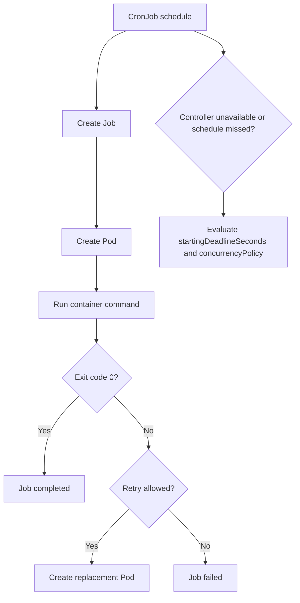
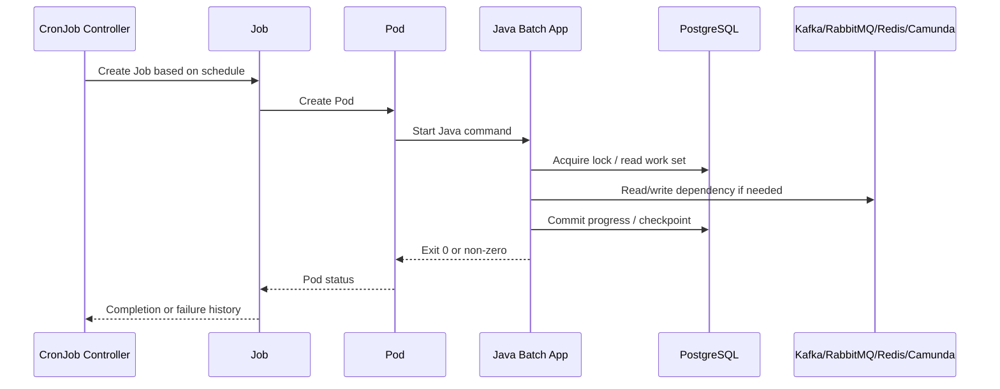
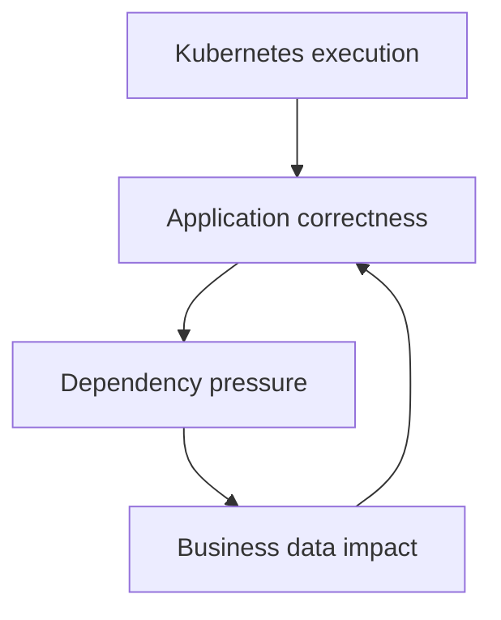

# Part 013 — Job and CronJob Operations

> Job dan CronJob terlihat sederhana sampai mereka menjalankan migration dua kali, menumpuk karena schedule overlap, gagal diam-diam, atau mengunci proses quote/order di tengah malam.

Untuk backend engineer, Job dan CronJob bukan hanya object Kubernetes untuk menjalankan command satu kali. Mereka adalah mekanisme runtime untuk pekerjaan yang sering punya konsekuensi data: migration, reconciliation, invoice preparation, quote expiry, order synchronization, cache warming, file processing, retry repair, cleanup, dan operational maintenance.

Part ini membahas Job dan CronJob dari sudut pandang production operations untuk Java 17+ / JAX-RS ecosystem, PostgreSQL, Kafka, RabbitMQ, Redis, Camunda, NGINX/Ingress-adjacent workflows, GitOps/IaC, EKS, AKS, dan on-prem/hybrid Kubernetes.

---

## 1. Core Concept

`Job` menjalankan satu unit pekerjaan sampai selesai. Kubernetes menganggap Job sukses ketika jumlah completion yang diminta tercapai.

`CronJob` membuat Job berdasarkan schedule. CronJob tidak menjalankan pekerjaan langsung; CronJob membuat Job, lalu Job membuat Pod.

Mental model:



Operationally, Job/CronJob harus dibaca sebagai kombinasi dari:

- schedule
- execution command
- retry policy
- deadline
- concurrency policy
- idempotency behavior
- dependency access
- data mutation impact
- observability and notification
- cleanup policy

Jika salah satu hilang, batch workload bisa terlihat normal di Kubernetes tetapi salah secara bisnis.

---

## 2. Why Job and CronJob Matter Operationally

Banyak incident enterprise tidak berasal dari API request path. Banyak berasal dari pekerjaan terjadwal yang:

- berjalan terlalu lama
- berjalan dua kali
- tidak berjalan sama sekali
- retry tanpa idempotency
- memproses data parsial
- gagal setelah melakukan sebagian update database
- memakai credential yang sudah rotate
- kehabisan memory saat memproses file besar
- membuat spike connection ke PostgreSQL
- membuat Kafka/RabbitMQ backlog karena publish ulang massal
- mengganggu Camunda process instance karena job repair salah target
- gagal diam-diam karena tidak ada alert pada Job failure

Di sistem CPQ/quote/order, CronJob sering dipakai untuk:

- quote expiration
- order state reconciliation
- delayed fulfillment sync
- retry failed integration
- cleanup stale draft quote
- cache/catalog refresh
- invoice/billing preparation
- migration or backfill
- SLA breach detection
- outbox repair

Maka pertanyaan operasionalnya bukan “apakah Pod jalan?”, tetapi:

- apakah pekerjaan tepat waktu?
- apakah pekerjaan selesai?
- apakah aman jika diulang?
- apakah aman jika berjalan bersamaan?
- apakah aman jika gagal di tengah?
- apakah ada bukti hasilnya?
- apakah ada alert jika gagal?
- apakah recovery path jelas?

---

## 3. Backend Engineer Responsibility

Backend engineer bertanggung jawab atas correctness dan operational behavior dari pekerjaan yang dijalankan Job/CronJob.

Yang harus dimiliki service owner:

- memahami tujuan bisnis Job/CronJob
- memastikan job idempotent jika bisa di-retry
- memastikan partial failure punya recovery path
- menentukan concurrency policy yang aman
- menentukan retry/backoff yang tidak merusak dependency
- menentukan deadline agar job tidak menggantung tanpa batas
- menyediakan logs, metrics, dan audit trail
- memastikan credential/config valid
- memastikan resource sizing sesuai data volume
- memastikan job punya runbook
- memastikan failure memunculkan alert atau ticket

Yang biasanya dimiliki platform/SRE:

- health CronJob controller
- cluster scheduling capacity
- node pool capacity
- policy admission
- namespace quota
- image registry access
- platform-level alerting pipeline
- cluster time synchronization
- backup/restore infrastructure

Yang harus diverifikasi internal:

- apakah CronJob dibuat oleh Helm, Kustomize, Argo CD, Flux, atau pipeline lain
- apakah manual rerun diperbolehkan
- siapa yang boleh suspend/resume CronJob
- siapa yang boleh delete failed Job
- bagaimana evidence hasil batch disimpan
- bagaimana incident batch dikomunikasikan

---

## 4. Job Object: Fields That Matter

Contoh Job simplified:

```yaml
apiVersion: batch/v1
kind: Job
metadata:
  name: quote-reconciliation-20260711
  namespace: quote-prod
spec:
  backoffLimit: 2
  activeDeadlineSeconds: 1800
  ttlSecondsAfterFinished: 86400
  template:
    spec:
      restartPolicy: Never
      containers:
        - name: reconcile
          image: registry.example.com/quote-service:1.42.0
          command: ["java"]
          args:
            - "-jar"
            - "app.jar"
            - "reconcile-quotes"
```

Fields penting:

| Field | Operational meaning |
|---|---|
| `backoffLimit` | Berapa kali retry sebelum Job dianggap failed. |
| `activeDeadlineSeconds` | Batas waktu total agar Job tidak menggantung. |
| `completions` | Jumlah completion yang dibutuhkan. |
| `parallelism` | Berapa Pod boleh berjalan bersamaan. |
| `ttlSecondsAfterFinished` | Cleanup otomatis Job setelah selesai. |
| `restartPolicy` | Biasanya `Never` atau `OnFailure`. |
| `template.spec.containers[].command/args` | Entry point pekerjaan. |
| `template.spec.serviceAccountName` | Identity untuk akses Kubernetes/cloud/dependency. |
| `template.spec.resources` | Resource contract. |

Rule praktis:

- Job tanpa `activeDeadlineSeconds` berisiko menggantung lama.
- Job tanpa observability berisiko gagal diam-diam.
- Job retry tanpa idempotency adalah sumber data corruption.
- Job parallel tanpa partitioning strategy adalah sumber duplicate processing.

---

## 5. CronJob Object: Fields That Matter

Contoh CronJob simplified:

```yaml
apiVersion: batch/v1
kind: CronJob
metadata:
  name: quote-expiry-sweeper
  namespace: quote-prod
spec:
  schedule: "*/15 * * * *"
  timeZone: "UTC"
  concurrencyPolicy: Forbid
  startingDeadlineSeconds: 300
  successfulJobsHistoryLimit: 3
  failedJobsHistoryLimit: 5
  suspend: false
  jobTemplate:
    spec:
      backoffLimit: 1
      activeDeadlineSeconds: 600
      template:
        spec:
          restartPolicy: Never
          containers:
            - name: sweeper
              image: registry.example.com/quote-service:1.42.0
              args: ["expire-stale-quotes"]
```

Fields penting:

| Field | Operational meaning |
|---|---|
| `schedule` | Cron expression. Harus dipahami timezone-nya. |
| `timeZone` | Timezone schedule. Jangan asumsi local team timezone. |
| `concurrencyPolicy` | Apakah run boleh overlap. |
| `startingDeadlineSeconds` | Batas toleransi missed schedule. |
| `successfulJobsHistoryLimit` | Berapa Job sukses disimpan. |
| `failedJobsHistoryLimit` | Berapa Job gagal disimpan. |
| `suspend` | Pause schedule tanpa menghapus object. |
| `jobTemplate` | Template Job yang dibuat. |

`concurrencyPolicy`:

| Policy | Meaning | Risk |
|---|---|---|
| `Allow` | Run baru boleh dimulai walau run lama masih berjalan. | Duplicate work, lock contention, DB pressure. |
| `Forbid` | Skip run baru jika run lama masih aktif. | Data freshness bisa tertinggal. |
| `Replace` | Run lama diganti oleh run baru. | Partial execution harus aman dihentikan. |

Untuk enterprise backend, default aman biasanya `Forbid`, kecuali workload benar-benar didesain untuk parallel/overlap.

---

## 6. Job Lifecycle Reasoning

Job lifecycle harus dibaca dari CronJob sampai Pod exit.



Investigation path:

1. CronJob schedule dibuat?
2. Job dibuat pada waktu yang benar?
3. Pod dibuat oleh Job?
4. Pod berhasil scheduling?
5. Image berhasil pull?
6. Container command benar?
7. Config/Secret valid?
8. Dependency reachable?
9. Job selesai atau gagal?
10. Output bisnis valid?

Jangan berhenti pada `kubectl get cronjob`. CronJob bisa terlihat sehat walau Job terakhir gagal.

---

## 7. Safe Investigation Commands

Lihat CronJob:

```bash
kubectl get cronjob -n <namespace>
```

Detail CronJob:

```bash
kubectl describe cronjob <cronjob-name> -n <namespace>
```

Lihat Job yang dibuat:

```bash
kubectl get job -n <namespace> \
  -l app.kubernetes.io/name=<app-name> \
  --sort-by=.metadata.creationTimestamp
```

Lihat Pod milik Job:

```bash
kubectl get pod -n <namespace> \
  -l job-name=<job-name> \
  -o wide
```

Describe Job:

```bash
kubectl describe job <job-name> -n <namespace>
```

Lihat logs:

```bash
kubectl logs -n <namespace> job/<job-name>
```

Jika ada beberapa Pod:

```bash
kubectl logs -n <namespace> -l job-name=<job-name> --all-containers=true
```

Lihat previous logs jika container restart:

```bash
kubectl logs -n <namespace> <pod-name> --previous
```

Lihat events:

```bash
kubectl get events -n <namespace> \
  --field-selector involvedObject.name=<pod-name> \
  --sort-by=.lastTimestamp
```

Lihat YAML tanpa mengubah:

```bash
kubectl get cronjob <cronjob-name> -n <namespace> -o yaml
kubectl get job <job-name> -n <namespace> -o yaml
```

Safe rule:

- `get`, `describe`, `logs`, `events` aman untuk read-only investigation.
- `delete job`, `create job --from`, `patch suspend`, dan `scale` perlu approval sesuai proses internal.
- `exec` ke Job pod production harus hati-hati karena Job mungkin sedang memproses data.

---

## 8. Manual Rerun and Suspend Operations

Manual rerun sering diperlukan saat Job gagal. Tetapi manual rerun bisa berbahaya jika pekerjaan tidak idempotent.

Membuat Job manual dari CronJob:

```bash
kubectl create job <manual-job-name> \
  --from=cronjob/<cronjob-name> \
  -n <namespace>
```

Suspend CronJob:

```bash
kubectl patch cronjob <cronjob-name> -n <namespace> \
  -p '{"spec":{"suspend":true}}'
```

Resume CronJob:

```bash
kubectl patch cronjob <cronjob-name> -n <namespace> \
  -p '{"spec":{"suspend":false}}'
```

Production rule:

- Jangan manual rerun tanpa memahami data scope.
- Jangan suspend tanpa komunikasi jika schedule memengaruhi SLA.
- Jangan delete Job aktif tanpa tahu partial effect.
- Untuk GitOps, patch manual bisa di-revert oleh controller.
- Prefer perubahan melalui GitOps repo jika bukan emergency.

Internal verification:

- Apakah manual rerun harus lewat pipeline?
- Apakah nama manual Job harus punya incident/change ID?
- Apakah suspend/resume harus lewat PR?
- Apakah ada audit requirement?

---

## 9. Idempotency Is the Main Safety Property

Idempotency berarti menjalankan pekerjaan lebih dari sekali tidak mengubah hasil akhir secara salah.

Contoh buruk:

```text
For every expired quote:
  insert penalty row
  publish quote.expired event
  update quote status
```

Jika job retry setelah insert tetapi sebelum update, run berikutnya bisa insert penalty lagi dan publish duplicate event.

Contoh lebih aman:

```text
For every expired quote where status = ACTIVE and expiry_time < now:
  acquire quote-level lock
  update status from ACTIVE to EXPIRED using conditional update
  insert event into outbox with unique business key
  commit
```

Safety techniques:

- conditional update
- unique business key
- idempotency key
- outbox pattern
- checkpoint table
- advisory lock
- distributed lock with lease
- processed marker
- version check
- optimistic locking
- deduplication on consumer side

For quote/order systems, idempotency harus dijelaskan dalam business term:

- quote hanya boleh expire sekali
- order hanya boleh submit sekali
- billing sync tidak boleh double-charge
- workflow correction tidak boleh membuat duplicate task
- retry integration tidak boleh mengubah state mundur

---

## 10. BackoffLimit and Retry Risk

`backoffLimit` menentukan berapa kali Job retry sebelum dianggap failed.

Jika `backoffLimit` terlalu tinggi:

- dependency bisa dihajar retry storm
- error data bisa diproses berulang
- logs membengkak
- alert terlambat
- batch window habis

Jika terlalu rendah:

- transient failure tidak punya kesempatan recovery
- operator harus manual rerun terlalu sering

Guideline:

| Workload | Suggested posture |
|---|---|
| Migration | Retry rendah; failure harus diinvestigasi manual. |
| Reconciliation idempotent | Retry moderat dengan backoff. |
| External integration retry | Retry hati-hati; perhatikan rate limit dan DLQ. |
| Cleanup job | Retry rendah/moderat; harus aman jika skip. |
| File processing besar | Retry harus checkpoint-aware. |

Jangan mengandalkan Kubernetes retry untuk memperbaiki application-level correctness. Kubernetes hanya tahu exit code.

---

## 11. ActiveDeadlineSeconds and Stuck Job

Job tanpa deadline bisa berjalan tanpa batas karena:

- query database lambat
- deadlock/wait lock
- broker connection hang
- external HTTP dependency tidak timeout
- thread pool deadlock
- infinite loop
- file processing stuck
- pod masih Running tetapi tidak membuat progress

Gunakan `activeDeadlineSeconds` sebagai batas safety.

Namun deadline harus disesuaikan:

- terlalu pendek: job dibunuh sebelum selesai
- terlalu panjang: incident terlambat terdeteksi
- tanpa progress metric: deadline saja tidak cukup

Observability yang diperlukan:

- job start timestamp
- job duration
- records scanned
- records updated
- records failed
- checkpoint position
- dependency latency
- error count
- completion status

---

## 12. Parallelism and Completion

Job bisa menjalankan beberapa Pod secara paralel.

```yaml
spec:
  completions: 10
  parallelism: 3
```

Artinya Job membutuhkan 10 successful completions, maksimal 3 Pod berjalan bersamaan.

Risiko parallelism:

- duplicate work jika partitioning buruk
- DB lock contention
- connection pool spike
- Kafka/RabbitMQ publish spike
- Redis hot key
- race condition pada order state
- file output collision

Parallel job harus punya partitioning strategy:

- shard by tenant/customer/account
- shard by quote/order ID range
- shard by hash modulo
- shard by date bucket
- shard by explicit work item table with row locking

Tanpa partitioning, parallelism adalah multiplier risiko.

---

## 13. ConcurrencyPolicy in CronJob

`concurrencyPolicy` menentukan perilaku jika schedule berikutnya tiba saat run sebelumnya masih aktif.

### Allow

Cocok jika setiap run memproses scope berbeda dan aman overlap.

Contoh aman:

- job per time bucket immutable
- job hanya mengirim heartbeat non-mutating
- job membaca snapshot berbeda

Tidak cocok untuk:

- quote expiry sweeper tanpa lock
- order reconciliation global
- migration/backfill
- cache refresh global

### Forbid

Cocok untuk mayoritas enterprise batch yang tidak boleh overlap.

Risiko:

- jika run sering melebihi interval, banyak schedule skipped
- freshness tertinggal
- backlog bisa tumbuh

### Replace

Cocok untuk pekerjaan yang hanya peduli state terbaru dan aman dihentikan.

Risiko:

- partial execution harus aman
- SIGTERM handling harus benar
- checkpoint wajib kuat

---

## 14. Missed Schedule and startingDeadlineSeconds

CronJob bisa miss schedule karena:

- controller downtime
- cluster upgrade
- namespace/controller issue
- API server pressure
- GitOps disabled/suspended
- CronJob suspended
- clock/timezone confusion

`startingDeadlineSeconds` menentukan batas waktu untuk tetap memulai Job yang jadwalnya terlewat.

Jika terlalu besar:

- job lama bisa menyusul dan menumpuk
- data lama diproses di waktu yang tidak diinginkan

Jika terlalu kecil:

- transient controller issue bisa membuat run hilang

Untuk workload bisnis, harus jelas:

- missed run boleh di-skip atau harus catch up?
- jika catch up, apakah satu run cukup atau harus per-bucket?
- apakah ada reconciliation job terpisah?
- apakah ada freshness SLO?

---

## 15. RestartPolicy: Never vs OnFailure

Job Pod biasanya memakai:

```yaml
restartPolicy: Never
```

atau:

```yaml
restartPolicy: OnFailure
```

Perbedaan operasional:

| Policy | Behavior | Debugging impact |
|---|---|---|
| `Never` | Pod gagal tidak direstart; Job membuat Pod baru jika retry. | Evidence lebih mudah karena Pod gagal tetap terlihat. |
| `OnFailure` | Container direstart dalam Pod yang sama. | Perlu cek restart count dan previous logs. |

Untuk batch production, `Never` sering lebih mudah diaudit karena setiap attempt punya Pod tersendiri. Tetapi pilihan tergantung platform standard.

---

## 16. Java Batch App Concerns

Untuk Job berbasis Java 17+:

- startup JVM bisa signifikan dibanding durasi job pendek
- heap sizing harus disesuaikan dengan memory limit
- batch sering butuh direct memory/file buffer
- logging volume bisa sangat besar
- thread pool default bisa terlalu agresif
- DB pool default bisa terlalu besar untuk short-lived job
- shutdown hook harus menangani SIGTERM
- exit code harus benar
- exception jangan ditelan lalu exit 0

Command anti-pattern:

```bash
java -jar app.jar || true
```

Ini membuat Kubernetes menganggap Job sukses walau aplikasi gagal.

Better:

- fail fast on invalid config
- non-zero exit on unrecoverable error
- structured summary log at end
- expose metrics through pushgateway or job result table jika diperlukan
- record business audit result

---

## 17. PostgreSQL Impact

Job/CronJob sering paling berbahaya bagi PostgreSQL.

Failure modes:

- full table scan saat peak hour
- long transaction
- row lock contention
- deadlock
- connection spike from parallel pods
- migration lock blocking API
- vacuum pressure due to mass update/delete
- replication lag
- transaction timeout
- partial data mutation

Operational review:

- query plan sudah dicek?
- index cukup?
- batch size dibatasi?
- transaction boundary kecil?
- lock timeout diset?
- statement timeout diset?
- connection pool kecil dan eksplisit?
- ada checkpoint?
- bisa resume?
- ada dry-run mode?

Untuk CPQ/order lifecycle, batch yang salah bisa mengubah state bisnis massal. Itu harus diperlakukan seperti production change, bukan sekadar background task.

---

## 18. Kafka, RabbitMQ, Redis, and Camunda Impact

### Kafka

Job bisa publish event massal atau repair outbox.

Risiko:

- duplicate event
- out-of-order event
- topic throughput spike
- downstream consumer lag
- schema compatibility issue

### RabbitMQ

Job bisa requeue message atau publish retry message.

Risiko:

- queue depth spike
- unacked message storm
- DLQ replay tanpa throttle
- broker memory pressure

### Redis

Job bisa warm cache, delete keys, atau rebuild lookup.

Risiko:

- hot key
- large key scan
- blocking operation
- cache stampede setelah delete massal

### Camunda

Job bisa repair workflow, correlate message, atau resolve incident.

Risiko:

- duplicate correlation
- incident masking
- wrong process instance selection
- worker backlog

Operational principle:

> Batch workload harus punya rate limit dan business scope guardrail.

---

## 19. Resource Sizing for Job/CronJob

Job bukan workload bebas resource. Ia tetap perlu requests/limits.

Checklist resource:

- CPU request cukup untuk selesai dalam batch window
- memory limit sesuai heap/native memory
- ephemeral storage cukup untuk temp file/log
- DB pool tidak melebihi dependency budget
- parallelism tidak melebihi node capacity
- namespace quota cukup
- Job tidak mengganggu API service critical

Anti-pattern:

```yaml
resources: {}
```

Efek:

- scheduling tidak predictable
- QoS rendah
- bisa dievict lebih mudah
- capacity planning tidak jelas
- cost attribution lemah

---

## 20. Observability for Job/CronJob

Minimum observability untuk Job/CronJob:

- job started
- job completed
- job failed
- duration
- records processed
- records succeeded
- records failed
- skipped count
- retry count
- dependency error count
- business scope
- correlation/change/incident ID if manual

Logs harus punya summary akhir:

```json
{
  "event": "job_completed",
  "job": "quote-expiry-sweeper",
  "runId": "2026-07-11T10:15:00Z",
  "durationMs": 184220,
  "scanned": 120000,
  "updated": 842,
  "skipped": 119158,
  "failed": 0
}
```

Alert penting:

- CronJob missed schedule
- Job failed
- Job duration too long
- no successful run within freshness window
- records failed above threshold
- dependency errors
- repeated manual rerun

Sinyal Kubernetes saja tidak cukup. Job bisa exit 0 tapi salah secara bisnis.

---

## 21. GitOps and CI/CD Concerns

Jika CronJob dikelola GitOps:

- manual patch `suspend` bisa di-revert
- manual image change bisa di-revert
- manual delete mungkin membuat controller recreate
- rollback harus melalui Git atau GitOps UI sesuai proses
- rendered manifest harus dicek, bukan hanya source values

Review PR CronJob harus melihat:

- schedule berubah?
- timezone berubah?
- image berubah?
- command/args berubah?
- concurrencyPolicy berubah?
- deadline/backoff berubah?
- service account berubah?
- resource berubah?
- secret/config berubah?
- alert/runbook berubah?

---

## 22. EKS, AKS, On-Prem/Hybrid Considerations

### EKS

Perhatikan:

- IRSA untuk akses AWS service
- ECR image pull permission
- VPC endpoint untuk private AWS service
- subnet IP exhaustion untuk burst Job
- node group capacity
- Karpenter/Cluster Autoscaler delay
- CloudWatch log ingestion cost

### AKS

Perhatikan:

- Azure Workload Identity atau Managed Identity
- ACR pull integration
- Key Vault CSI/secret sync
- Azure CNI subnet capacity
- node pool autoscaling delay
- Azure Monitor cost

### On-prem/hybrid

Perhatikan:

- proxy/NO_PROXY
- corporate DNS
- internal CA
- firewall allowlist
- air-gapped registry
- limited node capacity
- backup/restore process
- manual operational approval

Backend engineer tidak perlu mengelola semua itu, tetapi harus tahu kapan evidence menunjukkan masalah platform.

---

## 23. Common Failure Modes

| Symptom | Likely cause | First evidence |
|---|---|---|
| CronJob tidak membuat Job | suspended, bad schedule, controller issue | `kubectl describe cronjob` |
| Job aktif terlalu lama | deadlock, slow query, no timeout, external hang | Job age, logs, DB metrics |
| Job failed cepat | bad config, missing secret, bad command, app exception | Pod logs, exit code |
| Banyak failed Pods | retry loop, non-idempotent failure | Job events, pod list |
| Job sukses tapi data salah | app-level correctness issue | audit table, summary logs |
| Schedule overlap | concurrencyPolicy Allow atau long runtime | active Jobs |
| Pod Pending | quota/capacity/scheduling/PVC | pod events |
| ImagePullBackOff | registry/tag/auth issue | pod events |
| OOMKilled | memory sizing/JVM heap/native | pod status, metrics |
| No alert on failure | observability gap | alert rules |

---

## 24. Production-Safe Mitigation

Mitigation awal yang relatif aman:

- confirm scope and impact
- stop new executions with approved suspend if job is harmful
- prevent duplicate manual rerun
- capture logs/events/YAML before cleanup
- validate whether job is idempotent
- check dependency health before rerun
- reduce parallelism if dependency overloaded
- rerun only with clear business scope
- restore schedule after mitigation
- create incident note if business data affected

Dangerous actions:

- delete active Job without understanding partial work
- rerun migration blindly
- increase parallelism during DB pressure
- remove deadline to “let it finish”
- change command args manually in production
- exec into Pod and mutate data manually
- ignore failed Job because next schedule may fix it

---

## 25. When to Rollback, Suspend, or Escalate

Rollback/change revert if:

- new image/config causes repeated Job failure
- schedule/args changed incorrectly
- service account/secret change broke access
- job now processes wrong scope

Suspend if:

- job is actively corrupting data
- job is overloading dependency
- job overlaps unexpectedly
- job causes repeated downstream incident

Escalate to platform/SRE if:

- CronJob controller issue suspected
- cluster scheduling/capacity issue
- node pressure/eviction widespread
- GitOps reconciliation issue
- registry/image pull platform issue
- cloud identity provider issue

Escalate to security if:

- secret leakage suspected
- unauthorized ServiceAccount permission
- job accessed data outside intended scope
- audit/compliance evidence required

Escalate to DBA/data owner if:

- migration partial failure
- data correction needed
- long lock/deadlock
- data integrity risk

---

## 26. PR Review Checklist

Review setiap Job/CronJob change dengan pertanyaan ini:

- Apa tujuan bisnis job ini?
- Apakah Job idempotent?
- Apakah aman jika retry?
- Apakah aman jika overlap?
- Apakah `concurrencyPolicy` tepat?
- Apakah `activeDeadlineSeconds` ada?
- Apakah `backoffLimit` masuk akal?
- Apakah schedule dan timezone benar?
- Apakah ada resource request/limit?
- Apakah DB pool dibatasi?
- Apakah ada observability summary?
- Apakah failure menghasilkan alert?
- Apakah manual rerun punya runbook?
- Apakah Secret/ConfigMap benar?
- Apakah ServiceAccount least privilege?
- Apakah dependency capacity cukup?
- Apakah ada rollback/suspend path?

---

## 27. Internal Verification Checklist

Verifikasi internal untuk setiap Job/CronJob:

- nama CronJob/Job dan namespace
- owner/team/service mapping
- schedule dan timezone
- business purpose
- concurrencyPolicy
- backoffLimit
- activeDeadlineSeconds
- startingDeadlineSeconds
- successful/failed history limit
- suspend policy
- manual rerun policy
- Job command/args
- image tag/digest
- ConfigMap/Secret source
- ServiceAccount/RBAC/cloud identity
- resource request/limit
- DB/Kafka/RabbitMQ/Redis/Camunda dependency impact
- idempotency design
- locking/checkpoint strategy
- partial failure recovery
- alert on failure/missed run/long duration
- dashboard/log query
- runbook
- GitOps repo/path
- CI/CD deployment path
- incident notes from previous failures

---

## 28. Practical Mental Model

Untuk Job/CronJob production, selalu pikirkan empat lapis:



Kubernetes hanya menjawab:

- Pod dibuat?
- Container jalan?
- Exit code apa?
- Retry berapa kali?

Production operations harus menjawab:

- pekerjaan benar?
- data aman?
- dependency stabil?
- hasil terukur?
- failure terlihat?
- recovery jelas?

---

## 29. Summary

Job dan CronJob adalah mekanisme Kubernetes untuk menjalankan pekerjaan finite dan scheduled, tetapi risiko utamanya bukan pada object Kubernetes. Risiko utamanya ada pada correctness, idempotency, partial failure, dependency pressure, missed schedule, overlap, dan observability gap.

Backend engineer yang kuat harus bisa membaca Job/CronJob dari dua sisi sekaligus:

1. sisi Kubernetes: schedule, Job, Pod, retry, deadline, events, logs, resource, identity
2. sisi aplikasi: business scope, data mutation, idempotency, dependency impact, audit, recovery

Jika dua sisi ini tidak disatukan, batch workload akan menjadi sumber incident yang sulit dilacak.

