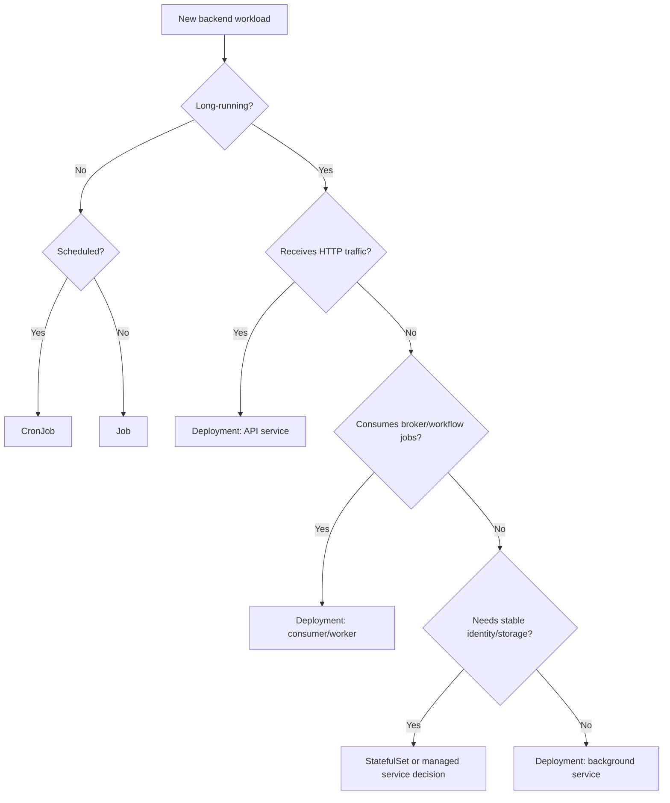
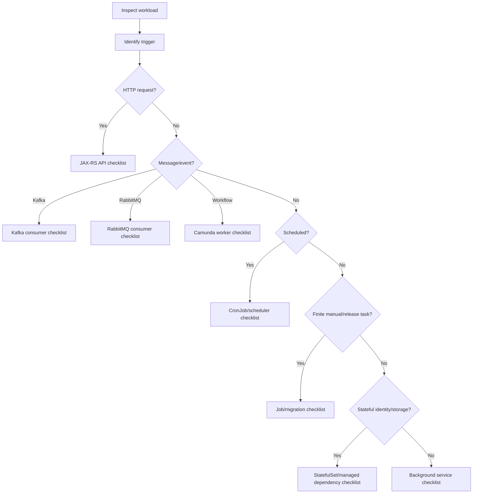

# Part 014 — Backend Workload Types

> Semua backend workload bisa berjalan sebagai container, tetapi tidak semua workload boleh dioperasikan dengan cara yang sama. API service, consumer, worker, scheduler, batch, dan migration job punya lifecycle, failure mode, scaling model, dan blast radius yang berbeda.

Di Kubernetes production, kesalahan umum backend team adalah memakai satu pola standar untuk semua workload: Deployment, replica 2, readiness/liveness, HPA CPU, resource limit default, dan selesai. Itu cukup untuk demo, tetapi tidak cukup untuk enterprise operations.

Part ini membangun klasifikasi workload backend agar service owner bisa memilih strategi deployment, probes, resource, scaling, shutdown, observability, runbook, dan review checklist yang sesuai. Fokusnya adalah Java 17+ / JAX-RS / Jakarta RESTful services dalam ekosistem CPQ, quote/order lifecycle, PostgreSQL, MyBatis/JPA/JDBC, Kafka, RabbitMQ, Redis, Camunda, NGINX/Ingress, GitOps, EKS, AKS, dan on-prem/hybrid Kubernetes.

---

## 1. Core Concept

Kubernetes menyediakan object runtime, tetapi semantics workload berasal dari aplikasi.

Workload backend dapat diklasifikasikan berdasarkan:

- apakah menerima request sinkron
- apakah memproses event/message asynchronous
- apakah berjalan terus-menerus atau finite
- apakah punya state internal penting
- apakah boleh di-scale horizontal
- apakah boleh berjalan paralel
- apakah aman di-restart
- apakah membutuhkan ordering
- apakah punya side effect ke database/broker/workflow
- apakah failure bisa diulang dengan aman

Mapping sederhana:

| Workload type | Runtime object umum | Scaling signal | Main risk |
|---|---|---|---|
| JAX-RS API service | Deployment | RPS, CPU, latency | 5xx, latency, bad readiness, dependency timeout |
| Kafka consumer | Deployment | Lag, partitions | rebalance, duplicate processing, offset commit issue |
| RabbitMQ consumer | Deployment | queue depth, unacked | redelivery storm, ack/nack bug, prefetch mismatch |
| Redis-backed service | Deployment | RPS, cache latency | cache stampede, hot key, stale data |
| Camunda worker | Deployment | activated jobs, incidents | workflow stuck, duplicate work, timeout |
| Batch job | Job | finite completion | partial failure, non-idempotency |
| Scheduler | CronJob or Deployment | schedule/freshness | overlap, missed run, duplicate execution |
| File processing job | Job/Deployment | file backlog | disk pressure, partial processing |
| Reconciliation job | Job/CronJob | drift/backlog | wrong state correction, DB pressure |
| Migration job | Job/pipeline step | release event | irreversible schema/data change |

Operational maturity dimulai dari mengenali tipe workload sebelum menentukan manifest.

---

## 2. Why Workload Classification Matters

Workload classification memengaruhi keputusan berikut:

- Deployment vs Job vs CronJob vs StatefulSet
- readiness/liveness/startup probe design
- graceful shutdown strategy
- resource request/limit
- HPA/KEDA/autoscaling signal
- PDB requirement
- concurrency limit
- retry/DLQ behavior
- dependency pool sizing
- observability dashboard
- alert design
- rollback strategy
- incident runbook
- PR review checklist

Contoh:

- JAX-RS API service butuh readiness yang melindungi traffic.
- Kafka consumer readiness tidak selalu bermakna untuk external traffic.
- RabbitMQ consumer shutdown harus menghormati ack/nack dan prefetch.
- Camunda worker harus menyelesaikan atau release job activation secara aman.
- Migration job tidak boleh otomatis retry tanpa desain idempotency.
- Scheduler tidak boleh overlap jika memproses global business state.

Jika workload type salah, Kubernetes manifest bisa terlihat valid tetapi unsafe.

---

## 3. Ownership Boundary

Backend engineer bertanggung jawab atas workload semantics.

Artinya:

- API contract
- processing semantics
- retry behavior
- idempotency
- timeout behavior
- database transaction boundary
- message acknowledgement
- graceful shutdown
- resource profile aplikasi
- business-level observability
- runbook aplikasi

Platform/SRE biasanya bertanggung jawab atas:

- cluster capacity
- node pool
- ingress controller
- CNI/network plugin
- storage provider
- GitOps controller
- observability platform
- admission policies
- cluster upgrade

Security bertanggung jawab atas:

- policy standard
- RBAC governance
- secret handling standard
- workload identity standard
- vulnerability policy
- audit/compliance requirements

Backend engineer tidak harus memiliki semua infrastruktur, tetapi wajib tahu bagaimana workload-nya berperilaku di atas infrastruktur tersebut.

---

## 4. Decision Framework

Gunakan pertanyaan berikut sebelum memilih manifest:



Lalu validasi:

- Apakah workload boleh punya lebih dari satu replica?
- Apakah workload aman saat rolling update?
- Apakah termination bisa dilakukan tanpa kehilangan data?
- Apakah retry ada di aplikasi, broker, Kubernetes, atau semuanya?
- Apakah observability menunjukkan progress bisnis?
- Apakah rollback cukup dengan image rollback, atau ada data/schema side effect?

---

## 5. JAX-RS API Service

JAX-RS API service menerima HTTP request sinkron dari client, gateway, service lain, atau internal platform.

Runtime umum:

```yaml
kind: Deployment
```

Biasanya disertai:

- Service
- Ingress/Gateway route
- ConfigMap/Secret
- ServiceAccount
- HPA
- PDB
- NetworkPolicy
- dashboards and alerts

Operational concerns:

- startup time JVM
- readiness endpoint
- liveness endpoint
- graceful shutdown
- HTTP server thread pool
- DB connection pool
- outbound HTTP client pool
- request timeout
- dependency timeout
- JSON serialization overhead
- GC pause
- CPU throttling
- memory limit/OOMKilled

Readiness principle:

> Readiness harus menjawab apakah Pod siap menerima traffic sekarang, bukan apakah seluruh dunia sempurna.

Probe anti-pattern:

- readiness melakukan deep check ke semua dependency sehingga dependency minor membuat semua pod keluar dari endpoint
- liveness melakukan DB check sehingga DB lambat menyebabkan restart storm
- startup time Java tidak diberi startupProbe yang cukup

Observability:

- RPS
- latency p50/p95/p99
- 4xx/5xx
- dependency latency
- DB pool saturation
- JVM heap/GC/thread
- pod restarts
- readiness changes
- ingress 5xx

Safe scaling signal:

- CPU bisa berguna, tetapi latency/RPS/custom metrics sering lebih informatif.
- HPA harus mempertimbangkan DB pool total dan downstream capacity.

---

## 6. Kafka Consumer Service

Kafka consumer adalah long-running worker yang membaca topic dan memproses record.

Runtime umum:

```yaml
kind: Deployment
```

Operational concerns:

- consumer group membership
- partition assignment
- lag
- rebalance
- offset commit
- max poll interval
- processing time
- retry topic/DLQ
- duplicate processing
- ordering guarantee
- graceful shutdown
- replica count vs partition count

Replica rule:

> Effective parallelism Kafka consumer dibatasi oleh jumlah partition per consumer group.

Jika replica lebih banyak dari partition, sebagian pod idle. Jika replica terlalu sering naik turun, rebalance meningkat.

Shutdown concern:

- Pod menerima SIGTERM.
- Consumer harus stop polling.
- In-flight message harus selesai atau dikembalikan secara aman.
- Offset commit harus jelas.
- Grace period harus cukup.

Readiness untuk consumer:

- tidak selalu terkait Service endpoint
- bisa dipakai untuk menandai consumer siap join group
- jangan membuat readiness flapping karena lag tinggi

Observability:

- consumer lag per partition
- records consumed rate
- processing latency
- commit latency
- rebalance count
- retry/DLQ rate
- consumer error rate
- pod restart impact

Autoscaling:

- CPU-based HPA sering tidak cukup.
- Queue/lag-based scaling lebih cocok, tetapi harus mempertimbangkan partition count dan rebalance cost.

---

## 7. RabbitMQ Consumer Service

RabbitMQ consumer memproses queue dengan ack/nack semantics.

Runtime umum:

```yaml
kind: Deployment
```

Operational concerns:

- queue depth
- consumer count
- prefetch
- unacked messages
- redelivery
- ack/nack timing
- connection/channel lifecycle
- retry exchange/DLQ
- poison message
- graceful shutdown
- backpressure

Prefetch adalah control penting. Prefetch terlalu tinggi dapat menyebabkan:

- satu pod memegang terlalu banyak unacked messages
- redelivery besar saat pod mati
- unfair distribution
- memory pressure

Shutdown concern:

- stop consuming new messages
- finish in-flight messages if possible
- ack only after durable side effect succeeds
- nack/requeue intentionally if not processed
- close channel/connection cleanly

Observability:

- queue depth
- unacked count
- ready count
- consumer count
- redelivery rate
- publish/consume rate
- DLQ count
- connection churn
- processing latency

Scaling:

- queue-depth-based scaling cocok, tetapi harus diselaraskan dengan prefetch, DB capacity, dan downstream throughput.

---

## 8. Redis-Backed Service

Redis-backed service bisa berupa API service, worker, cache warmer, rate limiter, session service, lock manager, atau stream consumer.

Runtime umum:

```yaml
kind: Deployment
```

atau Job/CronJob untuk cache rebuild.

Operational concerns:

- cache hit rate
- hot key
- key TTL
- stale data
- cache stampede
- Redis connection pool
- command latency
- large key/value
- blocking command
- eviction policy
- lock expiry
- Redis cluster topology

Failure modes:

- Redis latency menyebabkan API latency spike
- Redis unavailable membuat service gagal jika tidak ada fallback
- cache delete massal membuat DB spike
- lock expiry terlalu pendek menyebabkan duplicate processing
- lock expiry terlalu panjang menyebabkan stuck process

Backend responsibility:

- define cache fallback behavior
- avoid dangerous commands in hot path
- use bounded TTL
- monitor hit/miss
- bound connection pool
- design lock with lease and owner token

Kubernetes angle:

- replica count meningkatkan Redis connections
- rolling restart bisa menyebabkan cache cold start
- HPA scale out bisa meningkatkan Redis load tiba-tiba

---

## 9. Camunda Worker

Camunda worker memproses workflow jobs. Ia bukan API biasa dan bukan broker consumer biasa; ia terikat pada process semantics.

Runtime umum:

```yaml
kind: Deployment
```

Operational concerns:

- job activation
- worker concurrency
- job timeout
- lock duration
- retry policy
- incident creation
- process correlation
- business key
- duplicate work
- graceful shutdown
- worker visibility

Failure modes:

- worker down membuat process stuck
- timeout terlalu pendek menyebabkan duplicate activation
- concurrency terlalu tinggi membuat dependency overload
- retry policy terlalu agresif membuat incident storm
- wrong correlation membuat process salah bergerak

Observability:

- activated jobs
- completed jobs
- failed jobs
- incident count
- job latency
- worker error rate
- backlog by job type
- process instance stuck age

Kubernetes angle:

- rolling update harus menjaga worker availability
- SIGTERM harus menghentikan activation baru
- in-flight job harus selesai atau fail secara intentional
- HPA harus memperhatikan workflow engine dan dependency capacity

---

## 10. Batch Job

Batch job menjalankan finite work. Ia selesai, gagal, atau timeout.

Runtime umum:

```yaml
kind: Job
```

Operational concerns:

- idempotency
- retry safety
- partial completion
- checkpoint
- activeDeadlineSeconds
- resource sizing
- input scope
- output validation
- audit trail

Failure modes:

- exit 0 walau sebagian gagal
- retry menghasilkan duplicate update
- memory OOM saat dataset besar
- DB lock besar
- no alert on failure
- job cleanup terlalu cepat menghapus evidence

Checklist:

- Apakah work item punya unique key?
- Apakah job bisa resume?
- Apakah ada summary result?
- Apakah ada dry-run?
- Apakah ada max batch size?
- Apakah ada runbook manual rerun?

---

## 11. Scheduler

Scheduler bisa berupa CronJob atau long-running service dengan internal scheduler.

Preferensi umum:

- Kubernetes CronJob untuk simple scheduled finite task.
- Dedicated scheduler service jika perlu dynamic schedule, tenant-aware scheduling, distributed coordination, atau complex orchestration.

Operational concerns:

- timezone
- missed run
- overlap
- leader election
- clock skew
- locking
- freshness SLO
- failure notification

Anti-pattern:

- setiap replica menjalankan scheduler internal tanpa leader election
- schedule local timezone tidak jelas
- tidak ada lock global
- schedule terlalu sering untuk durasi job
- failure hanya muncul di logs

Kubernetes angle:

- CronJob controller memberikan schedule creation, bukan business correctness.
- Deployment scheduler membutuhkan leader election atau external lock.

---

## 12. File Processing Job

File processing workload membaca file dari object storage, volume, SFTP drop, shared storage, atau event trigger.

Runtime umum:

- Job untuk one-off file batch
- CronJob untuk polling file
- Deployment untuk continuous worker

Operational concerns:

- file discovery
- duplicate file processing
- partial file
- file lock/marker
- checkpoint
- large file memory use
- temp storage
- upload/download timeout
- checksum
- retry and quarantine

Kubernetes-specific risks:

- ephemeral storage exhausted
- node disk pressure
- pod killed mid-file
- temp file not cleaned
- PVC mount failure
- object storage credential failure

Checklist:

- file processed marker exists?
- partial files ignored?
- checksum validated?
- temp directory bounded?
- retry does not duplicate business effect?
- failed files quarantined?

---

## 13. Reconciliation Job

Reconciliation job compares expected state and actual state, then repairs drift.

Examples:

- quote status mismatch repair
- order state sync with downstream system
- billing sync reconciliation
- outbox stuck event repair
- Camunda process-state reconciliation
- cache/catalog consistency repair

Runtime umum:

```yaml
kind: CronJob
```

or manually triggered Job.

Operational concerns:

- source of truth
- comparison window
- correction rule
- dry-run mode
- rate limit
- audit trail
- approval for repair
- idempotency
- rollback of wrong repair

Failure modes:

- wrong source of truth
- stale dependency data
- repair changes valid state into invalid state
- too broad query updates too many records
- no audit trail

Operational principle:

> Reconciliation job harus lebih konservatif daripada API service karena ia bisa mengubah banyak entity tanpa direct user action.

---

## 14. Migration Job

Migration job mengubah schema atau data sebagai bagian dari release.

Runtime options:

- CI/CD pipeline step
- Kubernetes Job
- manual controlled run
- database migration tool outside cluster

Operational concerns:

- expand-contract compatibility
- backward compatibility
- lock duration
- transaction size
- rollback limitation
- migration order vs app rollout
- multi-replica compatibility
- long-running migration
- data validation

Anti-pattern:

- migration as initContainer on every pod
- destructive migration in same release as code requiring new schema
- automatic retry on non-idempotent migration
- no lock/lease
- no migration observability

Production rule:

- schema migration must be coordinated with rollout strategy.
- app rollback may not rollback database.
- migration failure is a release incident.

---

## 15. Deployment Object Mapping

Not every backend workload should be a Deployment.

| Need | Preferred object | Notes |
|---|---|---|
| Long-running HTTP API | Deployment | Needs Service/Ingress, readiness, PDB, HPA. |
| Long-running message consumer | Deployment | Needs shutdown, lag/queue metrics, careful scaling. |
| Finite one-time task | Job | Needs idempotency, deadline, result evidence. |
| Scheduled finite task | CronJob | Needs concurrency policy and missed schedule handling. |
| Stable identity/storage | StatefulSet | Use carefully; managed service may be better. |
| Schema/data migration | Job or pipeline | Must be release-coordinated. |
| Internal singleton scheduler | Deployment with leader election or CronJob | Avoid duplicate execution. |

Incorrect mapping examples:

- Running migration inside every API pod startup.
- Running singleton scheduler as multi-replica Deployment without leader election.
- Running queue consumer as CronJob while queue requires continuous consumption.
- Running stateful dependency as plain Deployment.

---

## 16. Probe Strategy by Workload Type

| Workload | Readiness | Liveness | Startup |
|---|---|---|---|
| JAX-RS API | Required to protect traffic | Required but shallow | Useful for slow JVM startup |
| Kafka consumer | Optional/internal | Careful; avoid restart storm | Useful if startup slow |
| RabbitMQ consumer | Optional/internal | Careful; avoid killing slow processing | Useful |
| Camunda worker | Optional/internal | Careful; job timeout aware | Useful |
| Batch Job | Usually not needed | Usually not needed | Rarely needed |
| CronJob | Usually not needed | Usually not needed | Rarely needed |
| Migration Job | Usually not needed | Avoid unless necessary | Usually not needed |

Probe anti-patterns:

- liveness tied to external dependency
- readiness too deep and flapping
- no startupProbe for slow Java service
- batch job with liveness that kills long processing

---

## 17. Shutdown Strategy by Workload Type

| Workload | Shutdown priority |
|---|---|
| API service | Stop accepting new traffic, finish in-flight request, close pools. |
| Kafka consumer | Stop polling, finish/commit or safely abandon in-flight record. |
| RabbitMQ consumer | Stop consuming, ack/nack intentionally, close channel. |
| Camunda worker | Stop activating new jobs, finish/fail/release active work. |
| Batch job | checkpoint progress, exit non-zero if incomplete. |
| Scheduler | release leader lock / avoid duplicate next run. |
| Migration | never kill casually; understand DB state first. |

Kubernetes fields involved:

- `terminationGracePeriodSeconds`
- `preStop`
- SIGTERM handling
- readiness transition before termination
- PDB
- rolling update strategy

Java-specific:

- shutdown hooks
- executor shutdown
- HTTP server graceful shutdown
- consumer close timeout
- DB pool close
- metrics flush

---

## 18. Autoscaling by Workload Type

| Workload | Good scaling signal | Bad/default-only signal |
|---|---|---|
| API service | RPS, latency, CPU, queue/thread saturation | CPU only without dependency awareness |
| Kafka consumer | consumer lag, processing rate | CPU only |
| RabbitMQ consumer | queue depth, unacked, processing rate | CPU only |
| Camunda worker | job backlog, incident rate, job latency | CPU only |
| Redis-backed API | RPS/latency plus Redis capacity | CPU only |
| Batch Job | parallelism controlled explicitly | HPA usually irrelevant |
| CronJob | schedule/partitioning | HPA usually irrelevant |

Scaling hazard:

- scaling consumers increases DB/broker pressure
- scaling API increases DB connection demand
- scaling workers can increase duplicate/retry side effects
- scaling without max cap can convert backlog into dependency outage

---

## 19. Resource Profile by Workload Type

API service:

- steady CPU/memory
- latency sensitive
- affected by CPU throttling
- DB pool per replica

Consumer:

- CPU depends on processing
- memory depends on batch/prefetch
- sensitive to shutdown
- lag-sensitive

Batch:

- spiky CPU/memory
- may need high ephemeral storage
- should be isolated from API if heavy

Migration:

- DB-bound more than CPU-bound
- resource low can still cause DB high load
- requires strict control

File processing:

- memory and disk sensitive
- may need streaming instead of loading whole file

Camunda worker:

- concurrency-sensitive
- workflow timeout-sensitive
- dependency-bound

---

## 20. Observability by Workload Type

API service:

- request rate
- latency
- error rate
- dependency latency
- JVM metrics
- ingress metrics

Kafka consumer:

- lag
- consume rate
- processing latency
- rebalance count
- commit failures
- DLQ rate

RabbitMQ consumer:

- queue depth
- unacked
- redelivery
- ack/nack rate
- DLQ
- consumer count

Camunda worker:

- activated/completed/failed jobs
- incident count
- job duration
- backlog by job type
- process correlation errors

Batch/CronJob:

- last success time
- duration
- records processed
- failure count
- skipped/missed run
- business result summary

Migration:

- migration version
- duration
- lock wait
- failure point
- validation result

---

## 21. Failure Mode Matrix

| Workload | Common Kubernetes symptom | Real operational question |
|---|---|---|
| API | readiness failure | Is traffic protected or blackholed? |
| API | 5xx from ingress | Backend unavailable, timeout, or app error? |
| Kafka consumer | pod restart | Were offsets committed safely? |
| RabbitMQ consumer | pod killed | What happened to unacked messages? |
| Redis-backed service | latency spike | Is Redis slow, hot key, or cache miss storm? |
| Camunda worker | healthy pods | Are workflow jobs actually progressing? |
| Batch Job | Job completed | Did business work complete correctly? |
| CronJob | no active job | Was schedule missed or successfully completed? |
| Migration Job | failed pod | What database changes already happened? |
| File job | OOMKilled | Was file partially processed? |

This is why `kubectl get pods` is never enough.

---

## 22. Rollout Risk by Workload Type

API rollout risk:

- mixed version serving traffic
- schema compatibility
- timeout changes
- readiness mistakes

Kafka consumer rollout risk:

- rebalance storm
- duplicate processing
- changed event schema handling
- offset commit changes

RabbitMQ consumer rollout risk:

- message redelivery
- prefetch change
- ack behavior change
- DLQ routing change

Camunda worker rollout risk:

- changed job type handling
- timeout mismatch
- process version compatibility
- incident spike

Batch/CronJob rollout risk:

- schedule change
- command args change
- wrong image/config
- retry policy change

Migration rollout risk:

- irreversible DB change
- app version compatibility
- rollback limitation

---

## 23. EKS, AKS, and Hybrid Considerations

### EKS

Workload type affects:

- node group selection
- IRSA permission
- ECR image pull
- VPC CNI IP capacity
- ALB/NLB routing for API
- CloudWatch log cost
- Karpenter scaling for burst batch

### AKS

Workload type affects:

- node pool selection
- Azure Workload Identity
- ACR pull
- Azure CNI subnet capacity
- Application Gateway/Load Balancer routing
- Azure Monitor cost
- Key Vault access pattern

### On-prem/hybrid

Workload type affects:

- proxy/NO_PROXY
- corporate DNS
- internal CA
- registry access
- firewall path
- storage behavior
- limited node capacity
- manual release windows

Backend engineer should ask: does this workload need special node pool, identity, egress, storage, or observability treatment?

---

## 24. Workload Type Review Template

For every backend workload, document:

```yaml
workload:
  name: quote-reconciliation-worker
  type: kafka-consumer
  owner: quote-order-team
  namespace: quote-prod
  runtimeObject: Deployment
  trafficModel: asynchronous
  scalingModel: kafka-lag
  shutdownRequirement: finish-inflight-and-commit-offset
  idempotency: required
  dependencies:
    - PostgreSQL
    - Kafka
    - Redis
  productionCriticality: high
  observability:
    dashboards:
      - consumer-lag
      - jvm
      - dependency
    alerts:
      - lag-high
      - dlq-spike
      - restart-loop
  runbook: quote-reconciliation-worker-runbook
```

This turns Kubernetes workload review into operational review.

---

## 25. Internal Verification Checklist

Untuk setiap workload backend, cek:

- workload name
- namespace
- owner/team
- runtime object: Deployment/Job/CronJob/StatefulSet
- workload type: API/consumer/worker/batch/scheduler/migration/file/reconciliation
- business criticality
- traffic model: sync/async/scheduled/manual
- dependency list
- Service/Ingress/Gateway usage
- message topic/queue/job type if async
- database tables touched
- idempotency model
- retry/DLQ policy
- graceful shutdown behavior
- probe strategy
- resource request/limit
- HPA/KEDA/autoscaling policy
- PDB requirement
- NetworkPolicy
- ServiceAccount/RBAC/cloud identity
- ConfigMap/Secret source
- dashboard
- alert
- SLO/SLI if applicable
- runbook
- GitOps path
- CI/CD deployment path
- rollback strategy
- known failure modes
- escalation owner

---

## 26. PR Review Checklist

Saat mereview PR Kubernetes untuk workload backend, tanyakan:

- Tipe workload apa ini?
- Apakah runtime object tepat?
- Apakah replica count aman?
- Apakah scaling signal sesuai workload type?
- Apakah probes sesuai lifecycle?
- Apakah shutdown behavior aman?
- Apakah retry/idempotency dijelaskan?
- Apakah resource sizing sesuai runtime profile?
- Apakah dependency capacity terdampak?
- Apakah observability cukup untuk workload type ini?
- Apakah alert sesuai symptom nyata?
- Apakah rollback cukup aman?
- Apakah ada migration/data side effect?
- Apakah security identity minimal?
- Apakah network egress/ingress cukup ketat?

---

## 27. Anti-Patterns

Anti-pattern umum:

- semua workload diperlakukan sebagai stateless HTTP API
- Kafka/RabbitMQ consumer memakai HPA CPU tanpa lag/queue awareness
- scheduler internal berjalan di semua replica
- migration dijalankan sebagai initContainer setiap pod
- batch job tidak idempotent tetapi punya retry tinggi
- readiness API melakukan dependency check terlalu dalam
- liveness worker membunuh processing yang sebenarnya masih berjalan
- replica count dinaikkan tanpa menghitung DB pool total
- no PDB untuk service critical multi-replica
- no alert untuk CronJob failure
- no dashboard untuk async backlog
- no runbook untuk manual rerun

---

## 28. Practical Classification Flow

Gunakan flow berikut saat melihat workload baru:



This classification should happen before tuning probes, HPA, resources, or rollout strategy.

---

## 29. Summary

Kubernetes object type is not the same as backend workload type.

A Deployment can be:

- stateless API service
- Kafka consumer
- RabbitMQ consumer
- Camunda worker
- scheduler
- background reconciler

Each has different safety properties.

A senior backend engineer must reason from workload semantics first, then Kubernetes mechanics:

1. What triggers work?
2. What side effects happen?
3. Can it run concurrently?
4. Can it retry safely?
5. Can it shut down safely?
6. Can it scale safely?
7. Can it be observed correctly?
8. Can it be rolled back safely?

That is the difference between “deploying containers” and operating enterprise backend systems on Kubernetes.

