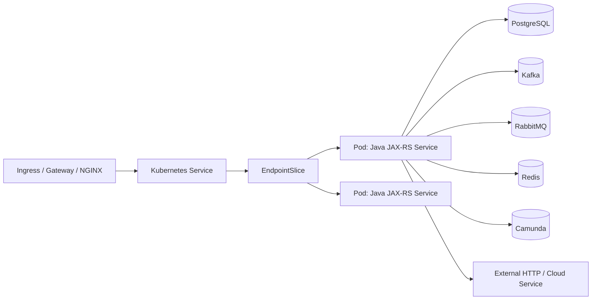
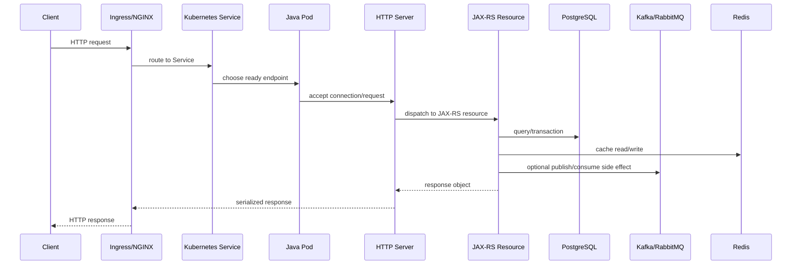
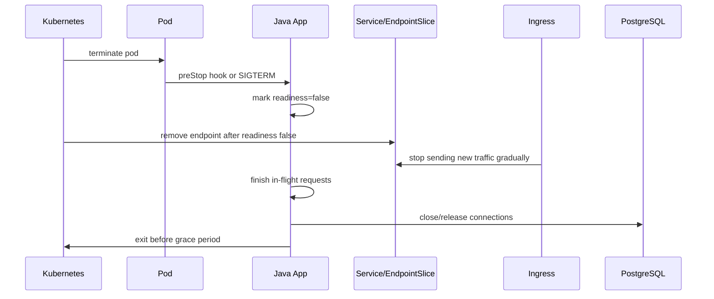
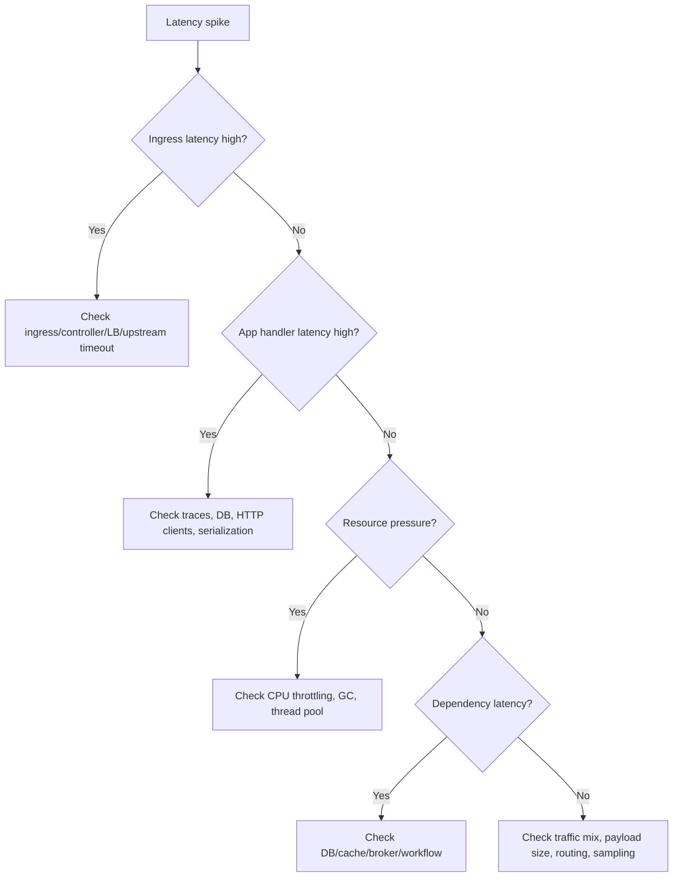

# Part 015 — Java/JAX-RS Service Operations in Kubernetes

> Java/JAX-RS service di Kubernetes bukan hanya container yang mengekspos HTTP port. Ia adalah runtime yang punya startup behavior, JVM memory model, request thread pool, dependency pool, timeout chain, readiness semantics, graceful shutdown behavior, dan failure mode yang langsung memengaruhi production reliability.

Part ini fokus pada operasi service Java 17+ / JAX-RS / Jakarta RESTful Web Services di Kubernetes. Konteksnya adalah backend enterprise: CPQ, quote/order lifecycle, PostgreSQL, MyBatis/JPA/JDBC, Kafka, RabbitMQ, Redis, Camunda, NGINX/Ingress, GitOps, EKS, AKS, on-prem/hybrid, dan observability stack.

Tujuan utama: Anda bisa membaca service Java di Kubernetes sebagai **production workload**, bukan sekadar `Deployment + Service + Ingress`.

---

## 1. Core Concept

JAX-RS service di Kubernetes punya tiga lifecycle yang berjalan bersamaan:

1. **Kubernetes workload lifecycle**
   - Pod scheduled
   - image pulled
   - container started
   - startup probe passes
   - readiness becomes true
   - Service endpoint receives traffic
   - termination starts
   - endpoint removed
   - container receives SIGTERM
   - process exits

2. **Java process lifecycle**
   - JVM starts
   - class loading
   - dependency injection/container initialization
   - HTTP server starts
   - resource classes registered
   - connection pools initialized
   - warmup/caches initialized
   - GC/runtime stabilizes
   - shutdown hooks run

3. **Business request lifecycle**
   - request enters ingress/gateway
   - routed to service
   - handled by HTTP server thread
   - JAX-RS resource executes
   - database/broker/cache/workflow dependency called
   - response serialized
   - metrics/logs/traces emitted

Production operations gagal ketika tiga lifecycle ini tidak selaras.

Contoh:

- Kubernetes menganggap pod ready, tetapi JAX-RS resource belum benar-benar siap.
- JVM butuh 90 detik startup, tetapi liveness probe mulai membunuh container setelah 30 detik.
- Pod menerima SIGTERM, tetapi HTTP server tidak menghentikan acceptance request baru.
- HPA menambah replica, tetapi total DB connection pool melebihi limit PostgreSQL.
- Ingress timeout 60 detik, tetapi HTTP client timeout ke dependency 120 detik.
- Memory limit 1Gi, tetapi heap + metaspace + direct memory + thread stack melebihi container memory.

---

## 2. Operational Responsibility Boundary

Backend engineer bertanggung jawab atas behavior aplikasi di dalam pod.

Yang biasanya menjadi tanggung jawab backend service owner:

- endpoint contract
- readiness/liveness/startup endpoint semantics
- graceful shutdown behavior
- thread pool sizing
- database pool sizing
- outbound HTTP client timeout
- Kafka/RabbitMQ/Redis/Camunda client config
- JVM memory settings
- logging/correlation ID
- application metrics
- tracing instrumentation
- error handling
- retry/backoff behavior
- production runbook
- rollback signal

Yang biasanya menjadi tanggung jawab platform/SRE:

- cluster capacity
- node pool
- ingress controller
- CNI/network plugin
- DNS/CoreDNS
- observability platform
- GitOps controller
- HPA/custom metric platform
- secret operator
- workload identity integration
- node upgrade
- cluster upgrade

Yang biasanya menjadi tanggung jawab security:

- secret handling standard
- workload identity policy
- RBAC baseline
- NetworkPolicy baseline
- image scanning policy
- pod security policy/admission policy
- audit/compliance requirement

Boundary penting:

> Platform bisa menyediakan Kubernetes runtime yang sehat, tetapi backend team tetap harus membuat service yang berperilaku aman saat startup, overload, dependency failure, rollout, shutdown, dan rollback.

---

## 3. Runtime Shape of a Java/JAX-RS Service

Bentuk minimum production workload biasanya bukan hanya Deployment.



Object umum:

- `Deployment`
- `ReplicaSet`
- `Pod`
- `Service`
- `EndpointSlice`
- `Ingress` or `HTTPRoute`
- `ConfigMap`
- `Secret` or `ExternalSecret`
- `ServiceAccount`
- `Role` / `RoleBinding` jika perlu
- `NetworkPolicy`
- `HorizontalPodAutoscaler`
- `PodDisruptionBudget`
- observability config
- GitOps application/release object

Minimal production question:

- Service menerima traffic dari mana?
- Endpoint apa yang menjadi readiness?
- Apakah liveness bisa menyebabkan restart storm?
- Berapa lama JVM startup normal?
- Apa yang terjadi saat SIGTERM?
- Berapa total DB connections saat max replica?
- Bagaimana dependency timeout disusun?
- Apa sinyal rollback setelah deployment?

---

## 4. JAX-RS Request Lifecycle Inside a Pod

Alur umum request:



Operationally, latency bisa berasal dari:

- ingress queueing
- pod not ready / endpoint churn
- HTTP server thread saturation
- JAX-RS filter/interceptor overhead
- JSON serialization/deserialization
- DB pool wait
- database query latency
- Redis latency
- Kafka/RabbitMQ publish latency
- outbound HTTP dependency latency
- GC pause
- CPU throttling
- network/DNS/TLS overhead

Jangan langsung menyimpulkan `application slow` sebelum memetakan request path.

---

## 5. Management Endpoint vs Business Endpoint

Production Java service sebaiknya membedakan endpoint berikut:

| Endpoint type | Contoh | Tujuan |
|---|---|---|
| Business endpoint | `/quotes/{id}`, `/orders/{id}` | Melayani business request |
| Readiness endpoint | `/health/ready` | Menentukan apakah pod boleh menerima traffic |
| Liveness endpoint | `/health/live` | Menentukan apakah process masih hidup |
| Startup endpoint | `/health/startup` | Melindungi startup lambat |
| Metrics endpoint | `/metrics` | Expose metrics untuk scraper |
| Build/version endpoint | `/info`, `/version` | Deployment traceability |

Rule penting:

- Readiness tidak harus sama dengan liveness.
- Startup probe melindungi aplikasi Java yang butuh waktu init lama.
- Metrics endpoint tidak boleh exposed public tanpa kontrol.
- Version endpoint membantu incident timeline.
- Business endpoint tidak sebaiknya dipakai sebagai health endpoint.

Anti-pattern:

```text
readiness = query PostgreSQL + ping Kafka + ping RabbitMQ + ping Redis + ping Camunda + call all downstream APIs
```

Masalahnya:

- dependency minor bisa membuat semua pod keluar dari load balancing
- cascading failure menjadi lebih buruk
- readiness flapping menyebabkan endpoint churn
- ingress 503 meningkat
- rollout bisa stuck meskipun service sebenarnya masih bisa melayani sebagian request

Readiness harus mencerminkan **kemampuan pod menerima traffic secara aman**, bukan semua dependency selalu sempurna.

---

## 6. Startup Probe Design for Java

Java service bisa punya startup time lebih panjang karena:

- class loading
- framework initialization
- dependency injection
- JAX-RS resource scanning
- connection pool initialization
- cache warmup
- migration check
- TLS truststore loading
- large configuration parsing
- slow DNS/dependency calls saat boot
- CPU throttling saat startup

Tanpa startup probe, liveness probe bisa membunuh aplikasi sebelum siap.

Contoh konsep manifest:

```yaml
startupProbe:
  httpGet:
    path: /health/startup
    port: management
  periodSeconds: 5
  failureThreshold: 36 # 3 minutes
```

Operational review:

- Apakah startup normal 20 detik, 60 detik, atau 180 detik?
- Apakah startup lebih lambat saat CPU throttled?
- Apakah startup melakukan dependency call yang bisa timeout?
- Apakah startup berbeda antara dev, staging, dan production?
- Apakah startup probe threshold berdasarkan data, bukan tebakan?

Safe principle:

> Startup probe harus cukup longgar untuk normal cold start, tetapi tidak menutupi startup hang tanpa batas.

---

## 7. Readiness Probe Design

Readiness menentukan apakah pod masuk EndpointSlice dan menerima traffic.

Readiness yang baik biasanya mengecek:

- HTTP server sudah bind port
- JAX-RS runtime siap menerima request
- essential internal component initialized
- application tidak sedang shutting down
- optional: local dependency state yang benar-benar critical untuk semua request

Readiness yang buruk:

- terlalu shallow sehingga pod menerima traffic sebelum siap
- terlalu deep sehingga dependency minor membuat pod tidak ready
- timeout terlalu pendek untuk Java under CPU pressure
- path salah atau port salah
- response selalu 200 walau service degraded
- response sering flapping

Contoh readiness behavior:

```text
READY when:
- process started
- HTTP listener active
- app initialization completed
- shutdown flag = false
- minimum required config loaded

NOT READY when:
- still starting
- graceful shutdown started
- critical local initialization failed
- app is overloaded beyond safe serving threshold, if explicitly designed
```

Readiness untuk dependency harus hati-hati.

Untuk API yang semua endpoint selalu membutuhkan PostgreSQL, readiness bisa mempertimbangkan DB pool state. Tetapi jika hanya sebagian endpoint butuh DB, readiness deep DB check bisa memperbesar outage.

Better pattern:

- readiness shallow-to-moderate
- dependency health exposed as separate health detail
- alert berdasarkan dependency error/latency
- graceful degradation jika memungkinkan

---

## 8. Liveness Probe Design

Liveness menjawab:

> Apakah process ini mati/hang sehingga Kubernetes perlu restart container?

Liveness bukan dependency health check.

Liveness sebaiknya tidak gagal hanya karena:

- PostgreSQL lambat
- Kafka unavailable
- RabbitMQ unreachable
- Redis timeout
- downstream API 500
- temporary DNS issue

Jika liveness melakukan deep dependency check, Kubernetes bisa menciptakan restart storm saat dependency bermasalah.

Liveness yang aman:

- process responsive
- main event loop/thread responsive
- app not deadlocked jika bisa dideteksi
- internal fatal state yang hanya bisa pulih dengan restart

Contoh anti-pattern:

```text
DB down -> liveness fails -> all pods restart -> connection storm -> DB recovery makin berat
```

Review questions:

- Apa kondisi yang benar-benar membutuhkan restart?
- Apakah restart menyelesaikan masalah atau memperburuk?
- Apakah liveness timeout realistis saat CPU throttled?
- Apakah startup probe mencegah liveness terlalu dini?

---

## 9. Graceful Shutdown for Java/JAX-RS

Rolling update aman hanya jika service bisa shutdown dengan benar.

Alur ideal:



Masalah umum:

- app langsung exit saat SIGTERM
- readiness tetap true saat shutdown
- terminationGracePeriodSeconds terlalu pendek
- request masih masuk setelah shutdown mulai
- DB transaction terputus
- Kafka/RabbitMQ publish side effect setengah jalan
- HTTP client call belum selesai
- server tidak drain connection

Checklist graceful shutdown:

- SIGTERM handler aktif
- readiness berubah false saat shutdown mulai
- HTTP server berhenti menerima request baru
- in-flight request diberi waktu selesai
- DB transaction diselesaikan/rollback dengan jelas
- outbound client ditutup rapi
- thread pool shutdown orderly
- termination grace lebih panjang dari p99 request normal
- ingress/load balancer drain behavior dipahami

Untuk Java/JAX-RS, pastikan framework/server yang dipakai benar-benar mendukung graceful shutdown dan setting-nya aktif.

---

## 10. Thread Pool Operations

Java API service biasanya punya beberapa pool:

- HTTP server worker thread pool
- request executor
- async executor
- scheduled executor
- DB connection pool
- HTTP client pool
- Kafka producer sender threads
- RabbitMQ connection/channel usage
- Redis client event loop/pool
- application-specific worker pool

Symptoms thread pool saturation:

- latency naik tajam
- request timeout
- CPU tidak selalu tinggi
- DB pool mungkin idle tetapi request menunggu thread
- queue internal membesar
- p99 latency buruk
- readiness bisa tetap true meskipun service overloaded

Operational metrics yang perlu:

- active threads
- max threads
- queued tasks
- rejected tasks
- executor saturation
- request duration
- request concurrency
- blocked thread count
- deadlock indicator jika tersedia

Review questions:

- Berapa max concurrent request per pod?
- Apakah thread pool sesuai CPU request/limit?
- Apakah pool terlalu besar sehingga context switching tinggi?
- Apakah pool terlalu kecil sehingga request antre?
- Apakah outbound call blocking memakai thread request yang sama?
- Apakah ada timeout untuk task queue?

Rule praktis:

> Thread pool besar tidak otomatis meningkatkan throughput. Ia bisa memperbesar contention, memory usage, dan downstream pressure.

---

## 11. Connection Pool Operations

Connection pool adalah salah satu sumber outage paling umum pada service Java di Kubernetes.

Pool yang perlu dipetakan:

- PostgreSQL connection pool
- HTTP client connection pool
- Redis connection pool
- Kafka producer/consumer connections
- RabbitMQ connection/channel
- Camunda client connection

Masalah utama di Kubernetes:

> Pool size adalah per pod, tetapi dependency limit biasanya global.

Contoh:

```text
DB max connection allowed for service: 120
replica normal: 4
DB pool per pod: 20
normal total: 80
rolling update maxSurge: 2
temporary pods: 6
temporary total: 120
HPA max: 10
possible total: 200 -> unsafe
```

Review harus memperhitungkan:

- normal replicas
- maxSurge during rollout
- HPA max replica
- blue-green/canary duplicate capacity
- connection lifetime
- idle connection cleanup
- dependency max connection
- DB proxy/pooler jika ada

Metrics penting:

- active connections
- idle connections
- pending/waiting for connection
- pool timeout count
- acquisition latency
- connection creation rate
- connection error rate

Runbook pool exhaustion:

1. Cek error log: pool timeout, too many connections, connection refused.
2. Cek DB active connections per service/user.
3. Cek replica count dan rollout state.
4. Cek HPA scale event.
5. Cek pool config per pod.
6. Kurangi traffic/replica jika memperburuk DB.
7. Rollback jika pool config baru menyebabkan incident.
8. Eskalasi ke DBA/platform jika DB limit atau proxy bermasalah.

---

## 12. Timeout Chain for Java API Service

Timeout harus disusun dari luar ke dalam.

Contoh chain:

```text
Client timeout: 30s
Ingress timeout: 29s
Service/application request timeout: 25s
Outbound HTTP timeout: 3s-10s depending dependency
DB query timeout: bounded
Broker publish timeout: bounded
```

Masalah umum:

- application timeout lebih panjang dari ingress timeout
- DB query tidak punya timeout
- HTTP client default infinite timeout
- retry membuat total duration melebihi ingress timeout
- Kafka/RabbitMQ publish menunggu terlalu lama
- Redis timeout terlalu agresif sehingga cache failure banjir log

Operational rule:

> Timeout tanpa retry policy adalah setengah desain. Retry tanpa timeout adalah incident menunggu terjadi.

Review questions:

- Timeout mana yang paling pendek?
- Timeout mana yang tidak dikonfigurasi?
- Apakah retry menambah total latency melebihi SLO?
- Apakah timeout error diklasifikasikan dengan benar?
- Apakah trace memperlihatkan span yang paling lambat?
- Apakah ingress 504 cocok dengan application log?

---

## 13. JVM Memory in Container

Container memory limit mencakup lebih dari Java heap.

Komponen memory:

- Java heap
- metaspace
- compressed class space
- thread stack
- direct buffer
- native memory
- JIT/code cache
- GC overhead
- mmap/file buffers
- library/native allocation

Jika memory limit 1Gi dan heap diset 1Gi, itu hampir pasti unsafe.

Better reasoning:

```text
container memory limit
- heap
- metaspace
- direct memory
- thread stack
- native overhead
- safety margin
= expected headroom
```

Operational signals:

- container memory usage
- JVM heap used/committed/max
- non-heap memory
- direct buffer usage jika tersedia
- thread count
- GC pause
- OOMKilled event
- exit code 137

Common failures:

- heap terlalu besar untuk container
- MaxRAMPercentage terlalu agresif
- direct memory leak
- thread leak
- large JSON payload memory spike
- file upload buffering in memory
- high-cardinality metrics memory growth
- native memory not visible in heap metrics

Review questions:

- Apakah JVM aware terhadap container limit?
- Berapa `MaxRAMPercentage`?
- Apakah ada explicit `-Xmx`?
- Apakah heap dump saat OOM aman secara storage dan data privacy?
- Apakah memory request cukup untuk scheduling?
- Apakah memory limit terlalu dekat dengan normal peak?

---

## 14. GC and Latency Operations

GC bukan hanya tuning performance; GC adalah operational signal.

Symptoms GC issue:

- p99 latency spike
- CPU naik tanpa throughput naik
- request timeout periodik
- heap usage sawtooth tidak turun sehat
- full GC sering
- pod OOM setelah traffic spike
- readiness timeout saat GC pause panjang

Metrics yang perlu:

- heap used/max
- allocation rate
- GC pause duration
- GC count
- old generation usage jika tersedia
- live set after GC
- promotion failure jika terlihat
- CPU usage during GC

Kubernetes-specific interaction:

- CPU throttling bisa memperpanjang GC pause.
- Memory limit terlalu ketat bisa membuat GC bekerja berlebihan.
- HPA berbasis CPU bisa scale karena GC, bukan karena business load.
- Restart pod bisa sementara menurunkan heap tetapi tidak menyelesaikan leak.

Operational stance:

> Jangan tuning GC sebelum memahami traffic, allocation pattern, CPU throttling, memory limit, dan dependency latency.

---

## 15. CPU Throttling Impact on Java Services

CPU throttling sering terlihat sebagai latency problem.

Symptoms:

- CPU usage terlihat “tidak penuh” tetapi latency tinggi
- throttling metric tinggi
- GC pause lebih panjang
- request threads antre
- readiness/liveness timeout
- startup lebih lambat
- p99 memburuk saat traffic peak

Penyebab:

- CPU limit terlalu rendah
- thread pool terlalu besar untuk CPU limit
- GC butuh CPU burst tetapi dipotong CFS quota
- serialization/deserialization heavy
- TLS overhead
- CPU-bound business logic

Mitigation options:

- naikkan CPU request/limit
- hapus CPU limit jika policy internal mengizinkan
- sesuaikan thread pool
- optimize endpoint hot path
- reduce JSON/object allocation
- scale horizontal jika dependency capacity cukup
- review HPA target

Internal verification:

- Apakah organisasi punya policy CPU limit wajib?
- Apakah ada dashboard throttling per pod?
- Apakah SLO latency mempertimbangkan throttling?
- Apakah workload ini CPU-bound atau IO-bound?

---

## 16. PostgreSQL/MyBatis/JPA/JDBC Operational Implications

Java API service sering gagal bukan karena HTTP layer, tetapi karena database interaction.

Operational risks:

- DB pool exhaustion
- slow query
- transaction too long
- lock contention
- deadlock
- connection leak
- query timeout missing
- migration incompatibility
- N+1 query
- large result set memory spike
- connection storm during rollout

MyBatis/JPA/JDBC concerns:

- default fetch size
- transaction boundary
- lazy loading behavior
- batch write behavior
- query timeout
- connection acquisition timeout
- statement timeout
- pool max lifetime
- validation query overhead

Kubernetes-specific risks:

- HPA scaling multiplies DB connections
- rolling update temporarily increases connections
- CrashLoop can repeatedly reconnect
- readiness deep DB check can amplify DB incident
- pod restart can rollback in-flight transaction

Debugging flow for DB-related API degradation:

1. Cek p95/p99 endpoint latency.
2. Cek trace span DB.
3. Cek DB pool active/waiting.
4. Cek PostgreSQL active sessions.
5. Cek slow query/lock dashboard.
6. Cek recent deployment and migration.
7. Cek HPA/replica increase.
8. Cek timeout and retry behavior.

---

## 17. Kafka/RabbitMQ/Redis/Camunda Dependency Impact

Walaupun part ini fokus API service, banyak API melakukan side effect ke broker/cache/workflow.

Kafka producer concerns:

- publish latency
- metadata fetch failure
- broker DNS/TLS issue
- idempotent producer config
- retry timeout
- buffer memory
- acks setting

RabbitMQ publisher concerns:

- connection/channel lifecycle
- publisher confirm
- blocked connection
- mandatory routing failure
- exchange/queue binding mismatch

Redis concerns:

- cache timeout
- connection pool saturation
- hot key
- cache stampede
- stale data
- serialization cost

Camunda concerns:

- process start latency
- correlation failure
- worker dependency
- incident creation
- workflow state inconsistency

Operational principle:

> API response success harus selaras dengan side effect guarantee. Jangan mengembalikan 200 OK jika order side effect penting gagal secara silent.

Review questions:

- Apakah publish/write side effect synchronous atau asynchronous?
- Apakah failure di broker/cache/workflow membuat request gagal?
- Apakah retry bisa membuat duplicate side effect?
- Apakah idempotency key digunakan?
- Apakah trace menunjukkan side effect span?

---

## 18. Config and Secret Operations for Java Service

Java service biasanya membaca config dari:

- environment variables
- mounted ConfigMap
- mounted Secret
- command-line args
- system properties
- external config service
- cloud secret manager via workload identity

Failure modes:

- missing env variable
- wrong environment config
- stale ConfigMap
- stale Secret
- secret rotated but pod not restarted/reloaded
- wrong profile active
- wrong base URL dependency
- truststore path wrong
- DB credential mismatch
- feature flag mismatch

Operational review:

- Apakah config immutable atau mutable?
- Apakah change membutuhkan restart?
- Apakah secret rotation didukung tanpa restart?
- Apakah config berbeda antar environment jelas?
- Apakah log startup menampilkan config summary tanpa membocorkan secret?
- Apakah GitOps drift bisa dideteksi?

Safe debugging:

- Jangan print secret value.
- Cek presence dan metadata, bukan raw secret.
- Cek secret version/timestamp jika tersedia.
- Gunakan approved tool/process untuk secret inspection.
- Pastikan audit trail ada.

---

## 19. Observability Dashboard for Java/JAX-RS Service

Dashboard minimal untuk service Java API:

### Traffic

- RPS
- request concurrency
- 2xx/4xx/5xx rate
- p50/p95/p99 latency
- ingress 4xx/5xx
- endpoint-level latency

### Kubernetes workload

- pod count desired/current/ready
- restart count
- readiness changes
- rollout revision
- CPU usage
- CPU throttling
- memory usage
- OOMKilled events
- network in/out

### JVM

- heap used/max
- non-heap
- GC pause/count
- thread count
- class loading
- direct buffer if available

### Dependency

- DB pool active/idle/waiting
- DB query latency
- Redis latency/error
- Kafka publish latency/error
- RabbitMQ publish latency/error
- Camunda API latency/error
- outbound HTTP client latency/error

### Release

- deployment marker
- image tag/digest
- Git commit
- config version
- feature flag state if relevant

Dashboard yang baik menjawab:

- apakah user impact ada?
- service mana terkena?
- sejak kapan?
- apakah ada deployment?
- apakah pod sehat?
- apakah dependency sehat?
- apakah resource pressure ada?
- apakah rollback mungkin membantu?

---

## 20. Alert Design for Java/JAX-RS Service

Alert yang berguna harus action-oriented.

Recommended alert categories:

- high 5xx rate
- high p95/p99 latency
- pod availability below threshold
- CrashLoopBackOff/restart spike
- OOMKilled
- CPU throttling high with latency impact
- DB pool saturation
- dependency error spike
- ingress 502/503/504
- readiness flapping
- error budget burn

Avoid alert anti-pattern:

- alert CPU high tanpa impact
- alert memory high tanpa trend/context
- alert every single pod restart as page
- alert dependency check failure yang tidak actionable
- alert duplicate symptom dari banyak layer tanpa grouping

Each alert should include:

- service name
- environment
- severity
- dashboard link
- runbook link
- recent deployment marker
- suspected blast radius
- owner/escalation path

---

## 21. Common Failure: Service Returns 5xx

Initial triage:

```text
Symptom: 5xx increased
1. Check ingress 5xx vs application 5xx
2. Check recent deployment/config change
3. Check pod readiness and restarts
4. Check application error logs by correlation/trace ID
5. Check DB/cache/broker/workflow dependency errors
6. Check latency and timeout chain
7. Check resource pressure: CPU throttling/OOM/restarts
8. Decide: mitigate, rollback, scale, or escalate
```

Interpretation:

- ingress 502: backend/protocol/connection issue likely
- ingress 503: no endpoint/backend unavailable likely
- ingress 504: upstream timeout likely
- application 500: app exception/dependency failure likely
- application 429: throttling/rate limit/capacity policy likely

Safe mitigation examples:

- rollback recent bad deployment
- disable bad feature flag if approved
- scale up only if dependency capacity allows
- route traffic away from bad canary
- increase timeout only if clearly safe and not hiding deeper failure
- escalate to DB/broker/platform if dependency degraded

---

## 22. Common Failure: Latency Spike

Latency spike can come from many layers.

Diagnostic tree:



Signals:

- p95/p99 endpoint latency
- trace slow spans
- DB pool wait
- CPU throttling
- GC pause
- thread pool queue
- Redis hot key latency
- downstream HTTP latency
- ingress upstream response time

Bad mitigation:

- blindly scale out while DB is saturated
- blindly increase timeout
- restart pods without evidence
- disable liveness/readiness during active incident without approval

---

## 23. Common Failure: Readiness Flapping

Readiness flapping causes endpoint churn.

Symptoms:

- pod ready/unready repeatedly
- Service endpoint count changes
- ingress 503 intermittent
- rollout stuck
- HPA scales but traffic unstable
- logs show probe timeout

Possible causes:

- readiness endpoint too slow
- readiness deep dependency check
- CPU throttling
- GC pause
- app overloaded
- management thread pool shared with business traffic
- wrong timeout/failureThreshold
- network policy/DNS issue affecting health check dependency

Investigation:

1. Check pod events for `Unhealthy`.
2. Check readiness endpoint latency.
3. Check CPU throttling and GC pause.
4. Check endpoint implementation.
5. Check dependency checks inside readiness.
6. Check rollout timing.
7. Compare previous version.

Mitigation:

- rollback readiness implementation/config if recently changed
- tune probe threshold if too aggressive and evidence supports it
- remove deep dependency from readiness through approved change
- scale only if overload is confirmed and dependency can handle it

---

## 24. Common Failure: Startup Failure

Symptoms:

- pod stuck not ready
- CrashLoopBackOff
- startupProbe failing
- logs stop during initialization
- config/secret exception
- DB migration check failure
- classpath issue
- port bind failure

Investigation:

```bash
kubectl get pod -n <namespace> <pod>
kubectl describe pod -n <namespace> <pod>
kubectl logs -n <namespace> <pod> --previous
kubectl logs -n <namespace> <pod>
```

Check:

- image tag/digest
- env vars
- mounted config/secret
- command/args
- startup probe path/port
- application port binding
- truststore/keystore path
- dependency DNS/credential
- recent deployment diff

Common Java-specific causes:

- missing class/dependency
- invalid JVM option
- invalid Spring/MicroProfile/Jakarta config
- bad environment variable
- DB credential failure during boot
- failed schema validation
- memory too low during startup

---

## 25. Safe kubectl Commands for Java Service Investigation

Read-only first:

```bash
kubectl get deploy -n <namespace> <deployment> -o wide
kubectl describe deploy -n <namespace> <deployment>
kubectl get rs -n <namespace> -l app=<app>
kubectl get pod -n <namespace> -l app=<app> -o wide
kubectl describe pod -n <namespace> <pod>
kubectl logs -n <namespace> <pod>
kubectl logs -n <namespace> <pod> --previous
kubectl get svc -n <namespace> <service> -o yaml
kubectl get endpointslice -n <namespace> -l kubernetes.io/service-name=<service>
kubectl top pod -n <namespace>
kubectl rollout status deploy/<deployment> -n <namespace>
kubectl rollout history deploy/<deployment> -n <namespace>
```

Use with care:

```bash
kubectl exec -n <namespace> <pod> -- <command>
kubectl port-forward -n <namespace> svc/<service> <local>:<remote>
kubectl debug -n <namespace> <pod> --image=<debug-image>
```

Dangerous without approval:

```bash
kubectl delete pod
kubectl rollout restart
kubectl scale
kubectl edit
kubectl patch
kubectl delete secret
kubectl apply -f
```

Reason:

- delete pod can hide evidence
- rollout restart can amplify dependency load
- scale can overload DB/broker
- edit/patch breaks GitOps source of truth
- secret operations can create audit/security issues

---

## 26. Rollout Safety for Java API Service

Before rollout:

- confirm image built and scanned
- confirm config/secret version
- confirm DB migration compatibility
- confirm readiness/startup probe matches startup behavior
- confirm resource request/limit safe
- confirm connection pool total safe under maxSurge
- confirm smoke test
- confirm rollback path

During rollout:

- watch rollout status
- watch ready replicas
- watch ingress 5xx
- watch app 5xx
- watch latency
- watch DB pool
- watch pod restarts
- watch readiness flapping

After rollout:

- confirm all pods on new revision
- confirm no old ReplicaSet receiving traffic unexpectedly
- confirm dashboard stable
- confirm error budget not burning
- confirm dependency saturation not increased
- confirm business smoke path works

Rollback when:

- 5xx/latency regression clear after deployment
- readiness failure caused by new version
- CrashLoop in new ReplicaSet
- DB/query regression severe
- bad config/secret introduced
- canary metrics fail threshold

Do not assume rollback is safe if schema migration was not backward compatible.

---

## 27. PR Review Checklist

Review manifest changes:

- Deployment replicas
- rolling update strategy
- maxSurge/maxUnavailable
- readiness/liveness/startup probes
- resource requests/limits
- env vars
- ConfigMap references
- Secret references
- Service port/targetPort
- Ingress route/annotations
- NetworkPolicy
- ServiceAccount/RBAC
- HPA min/max/metric
- PDB
- labels/annotations
- image tag/digest
- rollout/rollback instructions

Review Java-specific changes:

- JVM flags
- heap settings
- management endpoint config
- thread pool config
- DB pool config
- HTTP client timeout
- retry/backoff
- logging/tracing config
- feature flags
- migration behavior

Review operational risk:

- Does this change affect startup?
- Does this change affect readiness?
- Does this change affect dependency connection count?
- Does this change affect timeout chain?
- Does this change affect memory/CPU usage?
- Does this change require platform/SRE/security review?
- Is rollback safe?

---

## 28. Internal Verification Checklist

Verify with internal CSG/team context before applying assumptions:

### Workload and ownership

- Which namespace hosts the service?
- Who owns the service?
- Who owns the deployment manifest?
- Who owns the Helm chart/Kustomize overlay?
- Who owns production approval?
- Who is on-call for this service?

### Runtime

- Which Java runtime/server/framework is used?
- What is normal startup time?
- What are readiness/liveness/startup endpoints?
- Does service support graceful shutdown?
- What is terminationGracePeriodSeconds?
- Is preStop used?

### Resources

- CPU request/limit
- memory request/limit
- JVM heap settings
- native memory headroom
- CPU throttling dashboard
- OOMKilled history

### Dependency

- PostgreSQL pool size
- max DB connections allocated to service
- Kafka/RabbitMQ/Redis/Camunda client config
- dependency timeout/retry policy
- private endpoint/DNS config
- NetworkPolicy egress rules

### Release

- GitOps repo path
- Helm/Kustomize structure
- deployment pipeline
- image registry
- image promotion process
- smoke test
- rollback procedure
- migration coordination

### Observability

- logs location
- metrics dashboard
- JVM dashboard
- ingress dashboard
- dependency dashboard
- trace query
- alert rules
- SLO/burn-rate alert
- runbook link

### Security

- ServiceAccount
- RBAC
- workload identity
- secret source
- secret rotation behavior
- truststore/keystore source
- image scan policy
- NetworkPolicy

---

## 29. Anti-Patterns

Avoid these:

- using business endpoint as liveness probe
- liveness checks all dependencies
- no startup probe for slow Java startup
- readiness always returns 200 even during shutdown
- no graceful shutdown handling
- termination grace shorter than p99 request
- DB pool size not multiplied by replica/HPA/maxSurge
- CPU limit too low causing throttling
- heap equals container memory limit
- no timeout on outbound HTTP client
- no query timeout
- retry without backoff
- logging secrets during startup
- no deployment marker
- no dashboard for JVM/DB pool
- manual `kubectl edit` in GitOps-managed environment
- scaling service during DB incident without capacity check

---

## 30. Production Runbook Summary

For any Java/JAX-RS incident in Kubernetes, start with this order:

```text
1. Confirm user impact: 5xx, latency, failed business transaction.
2. Check recent deployment/config/secret/migration change.
3. Check rollout status and pod readiness.
4. Check pod restarts, previous logs, events.
5. Check ingress/service/EndpointSlice path.
6. Check application logs by correlation ID.
7. Check traces for slow/failing spans.
8. Check JVM: heap, GC, threads, CPU throttling.
9. Check DB pool and dependency health.
10. Decide mitigation: rollback, disable feature, scale carefully, or escalate.
11. Capture evidence before destructive action.
12. Update timeline and runbook gaps after incident.
```

---

## 31. Key Takeaways

- Java/JAX-RS service operations require aligning Kubernetes lifecycle, JVM lifecycle, and request lifecycle.
- Readiness protects traffic; liveness should not restart pods because dependencies are unhealthy.
- Startup probe is important for Java cold start and framework initialization.
- Graceful shutdown is mandatory for safe rolling update.
- Thread pool and connection pool sizing must account for replica count, HPA max, and rollout surge.
- JVM memory must leave headroom beyond heap.
- CPU throttling can look like application latency.
- Observability must include HTTP, Kubernetes, JVM, dependency, and release signals.
- Production-safe debugging is evidence-first, not command-first.
